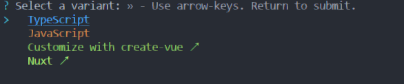

# TypeScript语法

[TOC]

## 一、TypeScript简介

typescript是javaScript的一个超集，是**==微软==以js语言为基础构建的的语言，它完全兼容js并扩展了新的内容**，比如js是数据类型弱化的语言，TS里就强化了数据类型的定义。

> TS虽然可以支持任何js平台，但==ts文件不能直接被js解析器直接执行==，它需要**先通过ts编译器先将ts文件转化为js文件**后才能被识别。

TS扩展的内容

+ 数据类型，在js的内容上增加了许多新的类型，并强化的数据类型的区分
+ 支持ES新的特性，例如抽象类，接口，装饰器等，并添加了ES不具备的新特性
+ 丰富的编译配置选项，ts转化为js编译是可配置的，这样就可实现ts转化为任意js的版本，满足各个版本需求且减少大量代码逻辑错误
+ 面向对象的开发，ES相当于把js弱语法语言转化为类似java的强语法语言，不仅满足的各种工具的开发，还可利用完成Cocos creator的游戏开发

## 二、TypeScript开发环境搭建

开发环境的搭建是让本机电脑满足编译ts文件为js文件的基础环境。其搭建步骤如下

- 下载Node.js，因为TS编译器是使用node.js开发的，因此要先安装node.js环境。去[Node.j官网](https://nodejs.org/en)下载**LTS稳定版**即可
- 安装Node.js,在安装完成后使用cmd命令`node -v`查看node.js版本测试是否安装成功
- 使用npm全局指令 `npm i -g typescript` 安装TypeScript,使用`tsc -version`指令查看版本是否安装成功


环境搭建好后，就可以尝试创建第一个ts文件进行编译。其步骤如下

1. 创建一个后缀名为ts的文件，内容可随便写一个js脚本（因为ts完成兼容js）
2. 进入ts文件所在目录下，在路径栏中输入cmd快速进入当前目录命令行
3. 执行命令 tsc xxx.ts编译为xxx.js文件
4. 编写基础html文件，引入xxx.js文件查看脚本效果，**编译不报错什么信息都没有且生成js文件就编译成功**

ts文件就编写最简单的`alert("hello ts")`就行

编译后的文件目录如下


html文件中引入js脚本代码

```html
<!DOCTYPE html>
<html lang="en">

<head>
    <meta charset="UTF-8">
    <meta name="viewport" content="width=device-width, initial-scale=1.0">
    <title>Document</title>
</head>
<body>
    <script type="text/javascript" src="01.js"></script> 
</body>
</html>
```

运行结果


安装完环境后，VSCode中也可以使用同样的指令完成TS文件编译，点击查看——打开终端，然后选择cmd终端，然后使用就更cmd中一样。


同理，除了用html的方式，还可以直接使用node直接编译js的运行结果 指令如下`node xxx.js`文件,运行效果如下，console打印的内容可以直接看到：


## 三、TS类型声明

类型声明是TS非常重要的一个特点，**通过对不同数据声明不同的类型可以更严格的限制后期数据类型的使用**。

类型声明可指定**变量、函数的参数、形参、返回值**的类型。指定类型后，当为变量赋值时，TS编译器会自动检测值是否符合类型声明，符合赋值，不符合就报错。但**默认报错后可以依然生成js文件，该问题后期可通过编译配置解决**。

**类型声明的语法**：

```ts
let 变量名：类型； let a:string；
let 变量名：类型 = 值；
fuction fn(参数名：类型，参数名，类型)：类型{
    //参数类型指定后，不仅限制了类型，也默认限制的参数数量，该函数的参数只能为两个
    //最后一个类型是指定返回值的类型
	...
}
```

**自动类型判断**，ts拥有自动类型判断机制。当对变量的声明与赋值同时进行时，ts编译器会自动判断变量类型，所有声明赋值同时进行可简写

`let a:sting = "hello"；`可简写为`let a = "hello"；`

使用vsCode工具辅组ts脚本的编写的与编译,这样可以更快速的编写ts脚本，更容易发现错误，例如类型声明后数据赋值错误提示信息如下：


编译也会提示报错信息，但vsCode中**如果出现js文件与ts相同路径下，定义变量名会有冲突报错，该错误信息可以忽略**。


### 3.1 基础数据类型

**字面量类型声明**，使用数值本身当作类型

```typescript
let a:10|"hello";
a=10;
a="hello";
a=3;//赋值3会出错

let b:string|number; //表示b即可是字符串也可以是数字，该类型被称为联合类型
```

**any类型声明**,表示任意类型，使用any类型声明变量后，**相当于关闭了该变量TS的类型检测**,变成js的语法，一般不建议使用。

```typescript
let a: any;
let b;//隐式的any，该写法默认自动会给b声明any类型，该情况要尽量避免
a = 10;
a = "hello";

let c: boolean;
c = a;//any最大的问题就是，变量间赋值时，c本身的ts检测无法检测，导致该c的boolean值可以赋值字符串了
```

**unknown类型声明**，表示未知类型，该类型就可避免any变量间赋值的问题，**unknown可看成类型安全的any**。

**其他类型都可直接赋值给unknown类型**

```typescript
let a:unknown;
a=10;
a="string"
let b:string="ss"
a=b;
```

unkonwn类型不可以直接赋值给其他类型，要赋值必须使用**类型断言**或**类型范围缩小**

```js
let a:unknown;
let b:string="ss";
//会报错，因为unknown类型不兼容string类型
b = a; 
//解决方式
//写法1，类型范围缩小
if (typeof a === "string") {
    b = a;
}
//写法2，TS中类型断言的写法，该方法类似强制类型转化，虽然不报错，但必须要确认a的值类型为断言类型
b = a as boolean;
b = <boolean>a;
console.log(b);
```

unknown类型的**交叉类型**始终是其他类型

```js
type a =  unknown & any       //any
type a1 = string & unknown    //string
type a2 = number & unknown   //number
type a3=  unknown & undefined //undefined
type a4 = unknown & never    //never
type a1 = string & unknown & number   //never 注意string & number就是never
```

unkonwn的**联名类型**除了any，其余全是unknown,**any与任何联名或交叉都是any**

```js
type a =  unknown | any //any
type a1 = number | unknown //unknown
type a2 = string | unknown //unknown
type a3 = unknown | undefined //unknown
type a4 = unknown | never | string //unknown
```

never类型是unknown类型的子类型,==**也可以说never是任何类型的子类型，任何类型是any的子类型**==

```js
type t = never extends unknown ? true : false;//true
type t1 = string extends any ? true : false; //true
type t2 = unknown extends string ? true : false; //false
```

**void类型声明**,该类型在变量中使用不多，常用于函数返回值声明。**表示函数没有返回值**。如果有返回值时会报错。返回**undefined值可以**。


**never类型声明**，该类型跟void一样常用于返回值生声明，**表示永远不会返回结果**，连undefined都不行，常用于错误信息检测的函数。

```typescript
function aa(params: string): never {
    throw new Error("错误信息");
}
```

**object类型声明**，表示js中的对象，但默认该方式定义变量不常用。`{}`也表示对象，其定义的变量才最常用。

```typescript
//普通声明变量的方式
let a: object;
a = {};
a = function () { };

//TS中常用的变量声明方式
//表示b变量创建时必须指定有且只有一个string的name属性值，否则会报错
let b: { name: string };
b = { name: "hello" };//正确
b = { a: 'hello' }; //错误，属性名不对
b = { name: 'hello', c: "sss" };//错误，属性数量不对

//存在非必须的属性值，可使用？表示非必须，这样没有该属性时不会报错
let c: { name: string, age?: number };
c = { name: "sss" };//正确
c = { name: "sss"，age:18 };//正确

//如果要定义动态属性数量，propName表示属性名，可以写aa，写propName更规范，[]数组表示多个，类型为string，，any表示任意属性值
let d: { name: string, [propName: string]: any };
d = { name: "sss", a: 18, b: "dd" };//正确


//扩展Lambda表达式表达式函数对象的定义，这样也可以限制函数的对象的类型与参数数量
//该方法常用于定义函数结构
let sum: (a: number, b: number) => number;
sum = function (n1, n2): number {
    return n1 + n2;
}
```

**array数组类型声明**，表示数组声明，js中数组没有类型的限制，TS则可定义特定类型的数组，常用方式为`[]`

```typescript
let a:string[];//定义string类型的数组
a=["a","b"];//正确
a=[1];//错误
let b:Array<number>; //定义数组类型第二种方式
b=["a","b"]; //错误
b=[1];//正确
```

**tuple类型声明**，元组，TS新增的类型，表示固定长度的数组,数组长度固定可节约内存

```typescript
let b:[string,number];
b=["a",10];
```

**enum类型声明**，枚举类型，TS新增的类型，常用于表示有固定数量的一种变量，方便代码的阅读

```typescript
//没有枚举时常见的写法，这样数字不方便阅读理解
let i: { name: string, gender: 0|1 };
i = {
    name: "zhangsan",
    gender: 0//0表示男，1表示女
}

//用枚举代替上边性别类型
//定义枚举类型
enum Gender {
    male, //这里默认男就是0数字，也可自己定义数字
    female
}

let x: { name: string, gender: Gender };
x = {
    name: "zhangsan",
    gender: Gender.male//0表示男，1表示女
}

console.log(x.gender===Gender.male);//用于判断时很方便，游戏状态机编写时非常常用
```

枚举类型主要分为==**①数字枚举、②字符串枚举、③异构枚举**==。默认基本的枚举是数字枚举且从0开始。

**数字枚举**的特点，默认赋值数字常量会依次递增，但如果是变量或计算结果则需要全部手动赋值

```js
let val = 10;
let val2 = () => 1 + 10;
enum Gender {
    Male = 10,
    Female //常量递增默认为11 
}
//变量
enum Gender2 {
    Male = val,
    Female //会报错，必须全部自己赋值
}
//表达式变量
enum Gender3 {
    Male = val2(),
    Female //会报错
}
//表达式在内部
enum Gender4 {
    Male = 1 + 10,
    Female //不会报错
}
//获取枚举内容的2种方式
console.log(Gender.Male); //10
console.log(Gender["Male"]); //10
console.log(Gender[10]); //数字枚举获取枚举名的特定方式 利用的数字索引名获取值
```

**字符串枚举**的特点，字符串不能递增，因此全部都有手动赋值才行，且它不支持变量赋值

```js
let val = "10";
const val1 = "12";
const val2 = () => "1 + 10";
enum Gender {
    UP = "up",
    Down = "down"
}
//字符串枚举无法使用变量赋值，常量函数表达式也不可以
enum Gender2 {
    UP = val, //报错
    UP1 = val1, //常量字符串可以
    Down = val2() //报错
}
enum Gender3 {
    UP = "du",
    Down = UP //可用内部其他枚举值赋值
}
//获取枚举值的方式
console.log(Gender.UP);
console.log(Gender["UP"]);
console.log(Gender["up"]); //字符串枚举无法使用索引名或者枚举名
```

**异构枚举**的特点，既包含数字也包含字符串的枚举就叫做异构枚举。异构枚举也需要自己手动全部赋值，其中数字部分有数字枚举的特点。可以利用索引获取。

```js
enum Gender {
    Down = "down",
    UP = 1
}
console.log(Gender.UP);
console.log(Gender["Down"]);
console.log(Gender[1]); //UP
console.log(Gender["down"]);//报错
```

枚举成员也可以当作类型来使用，注意之前使用的都是**枚举本身作为类型，枚举成员作为类型不一样**。

```js
enum Gender {
    Down = "down",
    UP = "up"
}
interface AA {
    name: Gender;//枚举本身可以当作类型 该相当于Gender.Down|Gender.UP的联合类型
}
interface BB {
    name: Gender.UP;//枚举成员当作类型
}

//使用枚举类型只能使用枚举赋值，相同类型字符串也不行
let s: AA = {
    //name: "up" 会报错
    name: Gender.UP
}
```

**symbol类型声明**，symbol是ES6引入的一种新的基本数据类型，表示独一无二的值，是js语言中第七种原始数据类型，其作用就是作为对象的标识符，其唯一性用于解决命名冲突的问题，不能与其他类型进行数据运算。

**其对象属性也不能使用for...in遍历循环，但可以使用Reflct.ownKeys获取对象的索引键名**

```js
const fn = Symbol()；
let fn1 = Symbol("name")；//name是symbol类型的描述信息，可以重复
let fn2 = Symbol("name")；
console.log(fn1 === fn2);//打印结果false
console.log(Symbol("foo") === Symbol("foo"));//打印结果false
console.log(fn1+"sss");//会报错symbol类型不能进行运算
console.log(fn1.description);//打印结果name，获得synmbol定义时的描述信息
//重复symbol对象时就需要使用Symbol.for()
let os1 = Symbol.for('sym');//sym就是Symbol.for对象创建的key，第一次使用是会在全局中注册
let os2 = Symbol.for('sym');
console.log(os1 === os2);//打印结果true
console.log(Symbol.keyFor(os1));//获取symbol全局注册的key ‘sym’

//作为对象不重复属性名的写法
let s1 = Symbol('sym');
let obj = {
    name: 'aaa',
    [s1]: 'this is a symbol'
}
console.log(obj[s1]);//打印结果 this is a symbol
```

类型总结表格

| 类型    | 例子             | 描述                                        |
| ------- | ---------------- | ------------------------------------------- |
| number  | 1，-33，2.5      | 任意数字类型                                |
| string  | "he",'he',he     | 任意字符串类型                              |
| boolean | true,false       | 布尔值                                      |
| 字面量  | 数据本身就是类型 | 限制变量的值，类似常量的效果，常结合`|`使用 |
| any     | *                | 任意类型                                    |
| unknown | *                | 类型安全的any                               |
| void    | 空值(undefined)  | 没有值或为undefined                         |
| never   | 没有值           | 不能为任何值                                |
| object  | {name:"hhh"}     | js本身的对象                                |
| array   | [1,2,3]          | js数组类型                                  |
| tuple   | [4,5]            | 元组，TS新增类型，固定长度的数组            |
| enum    | enum{A,B}        | TS新增，枚举类型                            |
| symbol  | Symbol("name")   | 唯一数据类型，解决命名冲突问题              |

### 3.2 其他类型声明

**&符号，除了可以构建交叉类型外，也可用于对象的拼接**,该写法可以用于基础代码的扩展

```typescript
let j: { name: string } & { age: number };//在原本的对象上扩展新的属性
j = { name: "s", age: 13 };
```

**类型的别名**`type`，也就是自定义类型，常用于复杂类型的简写

```typescript
type Mytype = 1 | 2 | 3 | 4 | 5 | 6;
let a: Mytype;
let b: Mytype;
```

**类型断言**，也就是强制指定对象类型，不管对象之前的定义强制转化为需要的类型，使用方式有两种`<数据类型>`或者`as 数据类型`

```js
//方式一
let str = "123";
let s1 = (<string>str).length;
//方式二
let s2 = (str as string).length;
//使用场景
function Aa(x: string | number) {
    console.log((<string>x).length);//因number没有length方法，要想使用就需要string类型断言
}
```

**遍历数组与类的解构**，所谓解构，就是将复杂对象的多个属性分离出来，常用于提取复杂对象中必要属性内容，使用方式与js中完全一致。

**数组的解构**，默认数组解构只用于单纯的字符串数组或number数组，因为其原理就是迭代器的调用，复合数组没有迭代器不能直接使用

```js
let goddess = ["张三", "李四", "lady", "王五"];
let [f1, f2, f3, f4] = goddess;//解构方式一 完全对应一一解构
let [t1, ...rest] = goddess;//部分解构
let [, s2, , s4] = goddess;//部分解构2

console.log(f1, f2, f3, f4);
console.log(t1, rest);//rest就是新的数组
console.log(...rest);//分别打印数组全部内容
console.log(s2, s4);

let test1 = ["1", "2", ["3", "4", "5"], "6"]//嵌套数组结构
let [a1, , [, a2,], a3] = test1;
console.log(a1, a2, a3);//打印结果 1 4 6
```

运行效果


**对象的解构**，方式与数组差不多，只是使用**对象属性名**来获取对象内容

```js
let obj = {
    uname: "zhang",
    age: 18,
    sex: "女"
};
let { uname, sex } = obj;
console.log(uname, sex); //运行效果 zhang 女
//解构重命名
let { uname: hha, age: bb } = obj;
console.log(hha, bb);//运行结果 zhang 18

//解构默认值，就是在没有属性时，就使用默认自己定义的值，比如address就没有该属性，但依然正确
let { uname: ss = "王", address: addr = "中国" } = obj;
console.log(ss, addr);

//真正解构对象使用的场景多用于复合对象属性
let obj = {
    uname: "zhang",
    age: 18,
    sex: "女",
    address: {
        add: "上海",
        add2: "北京"
    }
};
let { add, add2 } = obj.address;
console.log(add, add2);
```

**解构的原理**，就看解构的对象是否可迭代，也就是具备是否Symbol.iterator方法，案例 `let [x, y] = { x: 1, y: 2 }`该内容中的对象就不具有迭代方法，因此会报错。

要了解其迭代原理，先了解生成器函数,下面案例中的**function*（）**就表示生成器函数

```js
//生成器函数
let generator = function* () {
    yield 1;
    yield 2;
}
//调用生成器函数就会返回一个迭代器
let iterator = generator();
console.log(iterator.next());//返回{ value: 1, done: false }
console.log(iterator.next());//返回{ value: 2, done: false }
console.log(iterator.next());//{ value: undefined, done: true }
```

案例问题解决,默认就是在对象中添加迭代函数，返回对象属性值，**解构原理也就是调用生成函数的迭代器的next方法来遍历对象属性值**

```js
"use strict";
let obj = { x: 1, y: 2 };
//生成器函数
obj[Symbol.iterator] = function* () {
    yield this.x;
    yield this.y;
};
let [x, y] = obj;
//解构原理步骤
// let iterator = obj[Symbol.iterator]();
// let x = iterator.next().value;
// let y = iterator.next().value;
console.log(x, y);
```

### 3.3 函数

**函数的基本使用方式**，函数常见的使用方式有以下几种：**匿名函数、命名函数以及函数表达式**，比较复杂的使用有**函数别名、接口函数**以及**函数类Function**

```js
//匿名函数
const mk = function (a: number, b: number): number {
    return a + b;
}

//命名函数
function mk2(a: number, b: number): number {
    return a + b;
}

//箭头函数又称函数表达式
const mk3 = (a: number, b: number): number => { return a + b; }


//函数别名
type myFunc = (a: number, b: number) => number
const mk4: myFunc = (a: number, b: number): number => { return a + b; }

//接口函数
interface myFunc2 {
    (a: number, b: number): number
}
const mk5: myFunc2 = function (a: number, b: number): number { return a + b; }

//构造函数，函数类构建函数
const mk6 = new Function("a", "b", "return a+b");

//函数调用
console.log(mk6(3, 6));
```

**函数参数与返回值**，默认函数参数是数量固定的，当有需求要函数**参数可选**，可使用`？`表示可选参数

```js
const mk = function (a: number, b?: number): number { return a; }
mk(1); //可选参数可选可不选
mk(1, 2);
```

**函数参数默认值**，给参数设置默认值也可以实现参数可选的效果

```js
const mk = function (a: number = 1, b: number = 2): number { return a; }
mk();//有默认值不传参数也可以使用
mk(1);
mk(1, 2);
```

如果参数数量不定，剩余参数可使用不定数组表示，`...`是最常见剩余参数的表示方式,这里使用string[]，如果使用any[]就表示任意类型

```js
const mk = function (a: number = 1, b: number, ...args: string[]): number { return a; }
mk(1, 2, "aa", "bb", "cc");
```

**递归函数**，递归函数也就是函数自己调用自己循环多次的函数，最简单的递归案例

```js
function sum(arr: number[], n: number): number {
    if (n <= 0) {
        return 0;
    } else {
        return sum(arr, n - 1) + arr[n - 1];//函数递归调用
    }
}

let res = sum([2, 3, 4, 5], 3);
console.log(res);
```

**函数重载**，重载的意思是名字相同，而参数不同，返回类型可相同也可不同。每个重载的函数都相当于一个独立的函数。

```js
//不使用接口的重载
function sum(a: number | string, b: number | string) {
    //类型缩小typeof
    if (typeof a === "number" && typeof b === "number") {
        return a + b;
    }
    if (typeof a === "number" && typeof b === "string") {
        return a + b;
    }
    if (typeof a === "string" && typeof b === "number") {
        return a + b;
    }
    if (typeof a === "string" && typeof b === "string") {
        return a + b;
    }
}
sum(1, 2); //sum函数实现4种不同类型的相加
sum(1, "a");
```

上边写重载函数逻辑判断太复杂，更简单的方式是使用**函数声明**方式实现重载

```js
//函数声明
function sum(a: number, b: number): number;
function sum(a: number, b: string): string;
function sum(a: string, b: number): string;
function sum(a: string, b: string): string;
//函数任意类型实现
function sum(a: any, b: any) {
    return a + b;
};
sum(1, 2);
sum(1, "a");
```

上述方式虽然简化的逻辑内容，但编写声明依然繁琐，后续还可以使用**泛型**进一步简化内容实现函数重载。

**函数特殊返回值**,函数类型为void依然可以接收有返回值的函数，该返回值依然有效果，案例如下

```js
type voidFunc = () => void; //void函数
//有返回值的函数赋值给void函数
let fuc1: voidFunc = function () {
    return 123;
}
console.log(fuc1());//打印结果123

//错误写法
function a():void {
    return 123;//当然，直接给void返回值依然是错误的，注意上述使用场景
}
```

### 3.4 Map

Map对象类型保存键值对，并且能够记住键的原始插入顺序，任何值(对象)都可以作为一个键或一个值,Map是在ES6引入的，因此js中也有Map。其可以使用**for of**进行迭代遍历。

==**Map的创建**==

```js
let myMap = new Map();
let myMap2 = new Map([["1", "aa"], ["2", "aa"], ["2", "aa"]]); //带值的初始化
```

==**Map的设置、获取与删除**==，**key键与value值可以是任意类型**,但一般key为string类型

```js
myMap.set("1", "张三"); //map键值对设置，key键与value值可以是任意类型,但一般key为string类型
myMap.set({name:"s"}, false);//键为对象，值为boolean

myMap.get("1");//获取到张三
myMap.get(1);//undefined

//删除
myMap.delete("1") //删除成功返回true,没有对应key删除失败返回false
```

==**Map的其他方法**==

```js
myMap.clear();//移除map所有键值对
myMap.has("1");//是否包含对应键的键值对
myMap.size;//map中键值对的数量
```

==**Map的迭代**==

```js
myMap.keys();//返回一个iterator对象，包含map对象中每一个元素的键
myMap.values();//返回一个新的iterator对象，包含map对象的每个元素的值
//迭代属性的使用方式
for (let key of myMap.keys()) {
    console.log(key);
}

for (let value of myMap.values()) {
    console.log(value);
}
//扩展 map数据数组展示
for (let entry of myMap.entries()) {
    console.log(entry);
}
//map数据解构
for (let [key, value] of myMap) {
    console.log(key, value);
}
```

```js
//扩展内容打印结果
[ '1', 1 ]
[ '2', 'ss' ]
[ '3', true ]
1 1
2 ss
3 true
```

## 四、TS编译选项

### 4.1 文件编译指令

之前学习的第一个指令`tsc xxx.ts`编译文件有一个问题就是每次修改文件，都需要编译一次，那过程就太麻烦。

新的指令`tsc -w xxx.ts`，该指令会进入监控模式**watch mode**，它实时监控文件只要文件修改就会自动重新编译。要退出监控模式使用`Ctrl+C`。该指令只能操作一个文件，如果要同时监视且编译一个文件夹中多个文件。则需要使用TS配置文件。

创建默认的TS配置文件，可直接使用指令`tsc --init`就行,默认配置文件的内容有很多，之后慢慢学习，可以直接全部删除，只留下一个{}。


在有了`tsconfig.json`配置文件后，可以在文件目录下直接使用`tsc -w`命令，默认空的配置下会自动编译全部文件且实时监控。

tsconfig.json就是TS编译器的配置文件，该文件可以完成各种编译配置。其包含的简单配置选项有：

**include**:定义需要被编译的文件目录，默认值为：["\**/\*"],常见的代码案例

```json
{
  *//**表示任意目录 \*表示任意文件 ./表示根目录*
  "include": [
​    "./src/**/*",
​    "./tests/**/*"
  ]
}
```


**exclude**:定义需要被忽略排除的文件目录，默认值为**["node_modules","bower_components","jspm_packages"]**，常见的案例

```json
{ 
    //定义需要排除编译的文件
    "exclude": [
        "./src/hello/**/*",
        "./src/04.ts"
   ]
}
```

**extends**:继承配置文件，可以快速实现配置文件的全部复用，也就是复制一遍原本的其他配置文件的内容。常见的案例

```json
{
    //表示继承base.json配置文件的内容
	"extends:./configs/base"
}
```

**files**:指定要编译的文件列表，一般不用，include完全可以实现该功能。

```json
{
    "files":["01.ts","02.ts","03.ts","04.ts"]
}
```

### 4.2 compilerOptions

该配置主要编译选项的设置，他本身说一个复杂的配置包含很多子选项，因此使用{}格式进行配置。其子选项有：

`"target"："ES3"`指定TS编译器的编译版本，默认ES3,例如会把let转化为var，其ES版本有如下选项：

**es3, es5, es6/es2015, es2016, es2017, es2018, es2019, es2020, es2021, es2022, esnext**

`"module": "ES2015"`，设置模块化的规范。模块可设置的值如下：

**'none', 'commonjs', 'amd', 'system', 'umd', 'es6', 'es2015', 'es2020', 'es2022', 'esnext', 'node16', 'nodenext'**

模块是什么，最简单js模块就是两个文件中的变量相互引入

```js
//文件1导出变量hi
export const hi = "你hi奥";
let ttw = 0;
alert("hello ts");
//文件2引入hi变量
import { hi } from "./01.js"
console.log(hi);

//使用ES6模块化标准转化后的文件内容====================
//文件1导出变量hi
export const hi = "你hi奥";
let ttw = 0;
alert("hello ts");
//文件2引入hi变量
import { hi } from "./01.js"
console.log(hi);

//使用CommonJS模块化标准后的文件====================
//文件1导出变量hi
"use strict";
Object.defineProperty(exports, "__esModule", { value: true });
exports.hi = void 0;
exports.hi = "你hi奥";
let ttw = 0;
alert("hello ts");
//文件2引入hi变量
"use strict";
Object.defineProperty(exports, "__esModule", { value: true });
const _01_js_1 = require("./01.js");
console.log(_01_js_1.hi);

```

`"lib": ["DOM","ES2015"]`，资源库设置，**默认不设置使用浏览器标准库**，这样大部分浏览器都能支持，需要修改lib的情况是该项目不在浏览器中运行，例如在node.js中运行，这时就不需要DOM。DOM就是常用的浏览器document库。

`"outDir": "./dist"`, 设置编译后文件的目录,实现源码与编译文件的分离

`"outFile": "./dist/m.js"`,是将多个文件内容合并到一个文件中，对于模块化的内容，需要使用模块模式为**'amd' 或者'system'**才可以进行合并，不常用，后期有专门的打包功能可完成该功能。

`"allowJs": true`,js文件编译运行，默认是false。

`"checkJs": true`, 是否检查js,默认false,这里检查的语法是按照ts的语法来检测的，例如代码 `let a = 10; a = "hello";`在js中不会出错，但设置为true后按照ts的语法就会提示错误。

`"removeComments": true`,是否移除注释，默认false。设置为true后编译后的代码中不会再有注释内容

`"noEmit": false`,不生成编译后文件，默认false

`"noEmitOnError": true`,编译出错时不生成编译文件，默认false

`"alwaysStrict": true`, 开启严格模式,默认false不开启,js的严格模式能更规范js代码，运行效率更高。

js开启中严格模式的代码`"use strict";`，ts中只要设置严格模式，生成的js代码就会加上严格模式的内容。**如果代码中包含引入导出模块，则js代码会自动进入严格模式，不再需要严格模式的代码。**

代码检查的设置：

`"noImplicitAny": true`, 不允许使用隐式的any，默认为false，设置为true时，下面的代码就会检测出错误，函数参数a,b类型为any

```js
function fn(a, b) {
  return a + b;
}
//类型明确不会报错
function fn(a: number, b: string) {
    return a + b;
}
```

`"noImplicitThis": true`, 不允许使用不明确的类型this,类型不明确的this会报错，例如下面的代码

```js
//this类型不明确
function fn2(this) {
  return this;
}

//明确类型的则不会
function fn2(this:Window) {
    return this;
}
```

`"strictNullChecks": true`, 严格检查空值，会检测出null调用的错误，例如下面都代码

```js
let box1 = document.getElementById('box1'); //box1会有null值的情况，不检查直接使用有问题
box1.addEventListener('click', function () {
    console.log("aaa");
})

//？就相当于添加if(box1!===null)的条件
let box1 = document.getElementById('box1');
box1?.addEventListener('click', function () {
    console.log("aaa");
})
```

检查配置内容还有很多，这里就不一一列据，到真正使用时再深入了解。

`"strict": true`, 开启所有的严格检查,如果为true，上边的检查都会开启，一般写在上方，然后在下方写不需要开启的内容

简单编译选项配置的文件内容

```json
{
    //**表示任意目录 *表示任意文件 ./表示根目录
    "include": [
        "./src/**/*",
        "./tests/**/*"
    ],
    //编译选项配置
    "compilerOptions": {
        "target": "ES2015", //指定ts被编译的ES版本，默认为ES3版本
        "module": "ES2015", //ES不同版本模块化的解决方案设置，指定模块化的规范
        // "lib": [  //资源库设置
        //     "DOM",
        //     "ES2015"
        // ]
        "outDir": "./dist", //设置编译后文件的目录
        //"outFile": "./dist/m.js", //多个文件合并为一个文件，不常用，后后期会使用专门的打包文件完成功能
        "allowJs": true, //js文件编译运行，默认是false
        "checkJs": false, //是否检查js,这里检查的语法是按照ts的语法来检测的
        "removeComments": true, //是否移除注释
        //"noEmit": false,//不生成编译后文件
        "noEmitOnError": true, //编译出错时不生成编译文件
        "strict": true, //开启所有的严格检查
        "alwaysStrict": true, //开启严格模式,js的严格模式能更规范js代码，运行效率更高
        "noImplicitAny": true, //不允许使用隐式的any
        "noImplicitThis": true, //不允许使用不明确的类型this
        "strictNullChecks": false, //严格检查空值
    }
}
```

## 五、TS面向对象编程

面向对象编程简而言之就是程序中所有操作都通过对象完成，万物皆可对象化。如果学习过java的同学都知道类Class的概念，其中类就是对现实事物中的对象的抽象表示。比如一个人，就可以使用人的类来表示该人具有是属性与功能。

**对象主要被分为两部分：属性与功能，属性就是之前接触的变量，功能就是函数。**

### 5.1 类（class）

在学习该模块前，先利用前面的编译配置搭建简单的环境，创建的目录如下


在html引入js文件，tsc编译看是否生成js文件，并运行看网页中是否执行js的内容

```html
<!DOCTYPE html>
<html lang="en">
<head>
    <meta charset="UTF-8">
    <meta name="viewport" content="width=device-width, initial-scale=1.0">
    <title>TS学习</title>
</head>
<body>
    <!-- 核心是引入js内容-->
    <script type="text/javascript" src="./dist/01.js"></script>
</body>

</html>
```

要创建对象，需要先定义类，然后再使用类实例化对象。TS中创建**最简单的类案例**如下：

```js
/*
类包含两部分，属性 方法
*/
class Person {
    //实例定义属性
    name = "张三"; //只声明不赋值
    age: number = 10; //声明属性加赋值,一般都不赋值，而在构造函数中赋值

    //定义方法
    addEat() {
        console.log("人吃饭");
    }
}
```

==**类的实例化**==，**关键字为`new`**

```js
const p = new Person();
console.log(p); //打印类所有属性内容
console.log(p.name);//打印类属性值
p.addEat(); //类方法调用
```


#### 5.1.1 ==**静态属性与方法**==：**关键字为`static`**

静态属性与方法是指不实例化也能调用的方法与属性，这就是常说的**静态变量与方法**。

```html
class Person {
    //定义类属性方法的关键字为static
    static gender = "男";

    static addRun() {
        console.log("人跑");
    }
}
console.log(Person.gender);
console.log(Person.addRun);
```

#### 5.1.2 ==**只读属性**==**：关键字**`readonly`

只读表示变量与方法的内容不可修改,类似const的效果，其中readonly需要注意两点，①使用readonly修饰变量时，尽量加上对于类型，防止属性变为**字面量**。②readonly的属性可以在构造函数中赋值，不会与默认值起冲突。

```js
class Person {
    //只读属性方法的关键字为readonly
    readonly name: string = "张三";
	readonly name2 = "张三2"; //注意这里的name2的属性就是张三2而不是string
	//构造函数中readonly属性的赋值是允许的
	constructor(name: string) {
        this.name = name;
    }
    //静态属性可以与只读搭配,但位置必须static在前
    static readonly gender: string = "男";

    static addRun() {
        console.log("人跑");
    }
}
const person = new Person();
console.log(person.name);
person.name = "李四"; //该内容就会报错因为是只读属性不能修改数值
console.log(Person.gender);
```

#### 5.1.3 ==**可选属性**==：**关键字为`？`

类中可选的属性，在**可选属性在类中不常用**，但在接口中很常用，可选属性能让接口继承与实现的复用性更强

```js
class PP {
    name: string
    age?: number  //属性可选

    protected constructor(name: string, age?: number) {
        this.name = name;
        this.age = age;
    }
}

class P2 extends PP {
    constructor(name: string, age?: number) {
        super(name, age);
    }
}

let t1 = new P2("d12");
let t2 = new P2("d12", 15);
console.log(t1);
console.log(t2);
```

#### 5.1.4 ==**对象类型验证**==：**关键字为`instanceof`**

常用于判断对象类型是否为指定类型,使用方式如下，**注意继承的子类判断父类类型也是true**

```js
class PP {
    name: string
    age: number
    private sex: string = "nv"

    constructor(name: string, age: number) {
        this.name = name;
        this.age = age;
    }
}

class P2 extends PP {

}

let t1 = new PP("d", 12);
console.log(t1 instanceof PP); //true
let t2 = new P2("d12", 15);
console.log(t2 instanceof PP); //true
```

#### 5.1.5 ==可见性与属性封装==

类成员的可见性：就是TS通过控制class中的方法或属性是否对外部代码可见。主要关键字有`public`(公有的)、`private`(私有的)、`protected`(受保护的)

`public`表示共有的，公开的，公有成员可以在任何地方被访问。默认类中的属性与方法都是公有的。

`private`表示私有的，**只在当前类**中可见，只有本类中可以访问，在子类与其实例化对象中都不可直接访问。

`protected`表示受保护的，仅在对其**声明的类与子类**中可见，**也就是如果子类中可以直接访问父类的私有属性**。实例化对象也不可直接调用。

> **注：函数的继承或者接口的实现，其属性对于的可见性也会被继承，也就是父类是私有属性，那子类重写的也是私有属性**

对于实例对象不能直接访问的私有或受保护的属性，通过定义**==getter、setter方法==**进行访问的方式就是**属性的封装**。属性的封装就是确保属性更安全。

```js
class Animal {
        //出于安全问题，名词前加_就是防止对象直接调用
    	public gender:string="男"；//默认public可省略
        private _name: string  //private属性子类也不能访问
        protected _age: number  //protected属性子类可继承，外部也不可直接访问
        constructor(name: string, age: number) {
            this._name = name;
            this._age = age;
        }

		//属性的封装
        //外部获取属性的方法函数 getter方法
        get name() {
            return this._name;
        }
        //外部修改属性值的方法函数 setter方法
        set name(value: string) {
            this._name = value;
        }

        //外部获取属性的方法函数
        get age() {
            return this._age;
        }
        //外部修改属性值的方法函数
        set age(value: number) {
            if (value >= 0) this._age = value; //限制修改值的内容
        }
 }
```


### 5.2 构造方法与this关键字

之前创建的最简单的类案例有一个问题，就是new创建的类对象所有属性都是固定的，这与实际不符，常见的会创建对象后给该对象不同的属性值，这里就需要**构造函数** `constructor`来完成。属性赋值使用`this`来完成，最简单的构造函数定义如下：

```js
class Person {
    _name: string;
    _age: number;
    //构造函数的创建可以有参数也可以没有，默认不写系统也会默认创建一个空的构造函数
    constructor(name: string, age: number) {
        //this只的是调用该方法的对象，比如per1调用方法，this就指的是per1对象
        this._name = name;
        this._age = age;
    }

    //测试打印this
    printThis() {
        console.log(this);
    }
    //静态方法中的this
    static pThis() {
        console.log(this);
    }
}
const per1 = new Person("张三", 19);
const per2 = new Person("张三2", 23);
//实例方法中this的打印
per1.printThis();
per2.printThis();
//打印静态方法的this
Person.pThis();
```

运行效果，创建出两个属性不同的对象,并且打印出的this它对于调用该方法的对象


**构造函数的调用是在对象new的时候就会默认调用一次，不需要自己调用**。

### 5.3 继承extends与super关键字

面向对象中往往会创建很多类，而很多类有相似的内容，因此为了更简单的编写相似的内容，我们会使用继承让**子类`extends`继承父类的内容**实现代码的复用。最简单的继承案例如下：

```js
class Animal {
    _name: string;
    _age: number;

    constructor(name: string, age: number) {
        this._name = name;
        this._age = age;
    }
    sayWord() {
        console.log("动物叫");
    }
}
class Dog extends Animal {
    //继承会拥有父类除了私有的所有属性与方法，如果要在子类中重新编写父类的方法，该内容我们称为方法的重写
    sayWord(): void {
        console.log("狗叫");
    }
}
class Cat extends Animal {
    sayWord(): void {
        console.log("猫叫");
    }
}
```

如果使用对应的子类实例化对象，调用的是子类的方法。

```js
const dog = new Dog("dac", 15);
const cat = new Cat("dd", 12);
dog.sayWord();
cat.sayWord();
```


在子类中我们没有写构造函数，但依然有构造函数的效果，其实就是程序**默认添加了一个构造函数**，默认调用父类的构造函数,利用`super`关键字，其写法如下，

```js
   constructor(name: string, age: number) {
       //super就表示父类对象，super()就是调用父类的构造函数
        super(name, age);
    }
```

==**调用父类构造函数中的this依然指的是当前子类对象的实例属性，因为调用该方法的是子类实例**==。

super关键字跟this一样，除了调用父类的方法外，还可以调用父类中的属性

```js
class Animal {
    _name: string;
    _age: number;
    _fname: string = "父母";
    constructor(name: string, age: number) {
        this._name = name;
        this._age = age;
        console.log("动物的构造函数");
    }
    sayWord() {
        console.log("动物叫");
    }
}

class Dog extends Animal {

    //继承会拥有父类除了私有的所有属性与方法，如果要在子类中重新编写父类的方法，该内容我们称为重写
    sayWord(): void {
        super.sayWord();//调用父类的方法
        console.log("狗叫" + super._fname);//调用父类的属性
    }
}

const dog = new Dog("dac", 15);
dog.sayWord();
```

运行效果：**父类属性值是undefined的原因就是子类同名的属性字段已经覆盖了父类中的内容**，因此父类的属性字段是未定义的，全是子类重写的字段。


### 5.4 抽象类 abstract

一般创建的父类可能不需要创建实例，为了防止被错误创建，可以采用父类的构造方法添加protected关键字，这样该父类就不能直接实例化。

```js
class PP {
    name: string
    age: number
    private sex: string = "nv"

    protected constructor(name: string, age: number) {
        this.name = name;
        this.age = age;
    }
}

class P2 extends PP {
    constructor(name: string, age: number) {
        super(name, age);
    }
}

let t1 = new PP("d", 12); //父类实例化会报错，因为构造函数外部无法直接访问
```

更好的方法，可使用修饰符`abstract`来定义**抽象类**。而抽象类中的有些方法可能没有意义，比如之前的动物叫的方法，这时就可以使用**抽象方法**，只定义方法结构，在子类中实现。其中抽象方法还会限制子类必须实现，防止忘记。

```js
//抽象类
abstract class Animal {
    _name: string;
    _age: number;
    constructor(name: string, age: number) {
        this._name = name;
        this._age = age;
    }
    //抽象方法
    abstract sayWord(): void;

}

//实现抽象类
class Dog extends Animal {
	//必须实现抽象方法，否则会报错
    sayWord(): void {
        console.log("狗叫");
    }
}
const an = new Animal("da",23);//会报错，抽象类不能创建实例
const dog = new Dog("dac", 17);
dog.sayWord();
```

### 5.5 接口 interface

**接口常用于定义类结构**，关键字为`interface`，其功能就类似抽象类，但接口中的属性与方法都没有值，需要其他类来实现，而其他类要实现接口，需要使用关键字`implements`,最简单的接口案例如下：

```js
interface myInterface {
    _name: string //接口中的属性不能赋值
    _age: number
    //接口中的方法默认为抽象方法
    sayHello(): void;
};

class Cat implements myInterface {
    _name: string
    _age: number
    constructor(name: string, age: number) {
        this._name = name;
        this._age = age;
    }
    sayHello(): void {
        console.log("猫叫")
    }
}

const cat = new Cat("d", 12);
cat.sayHello();
```

**接口的作用就是定义规范**，该规范可以更方便其他开发者调用已开发成熟内容并不会出现问题，因为按照接口规范实现不会与原本内容出现冲突。

除了类的使用，**接口也常用于定义对象类型**，类似于重命名`type`来**重命名对象类型声明**来使用

```js
//type重命名对象类型
type Mytype = {
    name: string,
    gender: string,
    age: number
}

//interface定义对象结构类型
interface myType2 {
    name: string;
    gender: string;
}
//可分开只有名称相同可自动组合
interface myType2 {
    age: number;
}

const obj1: Mytype = {
    name: "张三",
    gender: "男",
    age: 14
}

const obj2: myType2 = {
    name: "李四",
    gender: "女",
    age: 15
}

console.log(obj1);
console.log(obj2);
```

运行效果


接口对象中除了属性外还可以有函数，接口中带有函数的定义如下

```js
interface ITest {
    age: number,
    name: string,
    add(a: number, b: number): number //方法也可看做属性字段
}
//带有方法函数对象定义
let a: ITest = {
    age: 18,
    name: "张三",
    add: (a: number, b: number) => { return a + b }
}
console.log(a.add(11, 2));

//匿名接口函数
interface IFunc {
    (a: string, b: string): string //匿名函数
}
let b: IFunc = (a: string, b: string) => { return a + b };
```

**混合类型接口**，十分复杂，一般不这样使用(有问题)

```js
interface CC {
    (s: number): string,
    name: string,
    add(): void
}

function getCC(): CC {
    let cc = <CC>function (s: number) { console.log("匿名函数") };//强制类型转化
    cc.name = "ss";
    cc.add = function () { };
    return cc;
}
```

**接口的继承**，继承的效果与类继承基本类似

```js
interface ITest {
    age: number
}

interface ITest2 {
    name: string
}
//多继承就是单继承加，分割继承对象
interface IF extends ITest, ITest2 {
    add(a: number, b: number): number
}
//接口的实现
let aa: IF = {
    age: 14,
    name: "s",
    add: (a: number, b: number) => { return a + b; }
}
```

**交叉类型**使用`&`符号，**用于实现组合多个类型为一个类型的功能**，功能类似extends。

```js
interface Point2d { a: number; b: string }
interface PointC { c: string }
//最简单的交叉类型
type Point3D = Point2d & PointC;
let obj:Point3D = {a:1,b:'s',c:'ss'}
```

**交叉类型与接口继承对比**

+ 相同点：都可以实现对象类型的组合
+ 不同点：两种方式实现类型组合时，**对于同名属性之间处理冲突的方式不同**，接口继承不允许同名类型出现，会报错，交叉可之间覆盖

```js
interface A { fn: (value: number) => string }
//会报错
interface B extends A {
    //因为B中的fn函数参数类型不兼容A的内容
    fn: (value: string) => string
}

//交叉类型
interface A { fn: (value: number) => string }
interface B { fn: (value: string) => string }
type C= A & B;
//C就相当于下面的C1类型，这就类似于函数的重载，函数参数既可以为number也可以是string
interface C1 { fn: (value: number | string) => string }
```


### 5.6 索引

索引的作用通过key值快速查询访问特定属性，其关键符号为`[]`,数组就是我们最早接触的索引，其索引类型就是number。

类的索引访问,**可以快速访问到类属性的类型或者对象属性的值**

```js
class Person1 {
    name: string
    age: number
    constructor(name: string, age: number) {
        this.name = name;
        this.age = age;
    }
    speak() {
        console.log("aaaa")
    }
}
//获取对象属性值，通过索引key的方式
let aa = new Person1("张三", 14);
console.log(aa["name"]); //这里的效果与aa.name的效果一致
//获取类属性的类型值，也通过索引key的方式
type Mytype1 = Person1["name"];
let a: Mytype1 = "李四";
console.log(a);
```

索引访问的高级应用案例

```js
const obj = {
    name: "张三",
    age: 18,
    obj2: {
        add: "北京",
        sex: true
    }
}

//利用泛型与索引 利用属性名获取对象内容值的函数 keyof就是或者索引对象属性key值
function getValues<T, K extends keyof T>(obj: T, keys: K[]): T[K][] {
    let res = [] as T[K][];//建立对象数组
    keys.forEach(key => {
        res.push(obj[key]);//遍历访问属性值
    })
    return res;
}

let aa = getValues(obj, ["name", "obj2"]);
console.log(aa); //打印结果[ '张三', { add: '北京', sex: true } ]
```

除了获取值外，如果出现无法确定对象中有哪些属性(或对象中可以出现任意数量属性)时，可使用**索引签名类型**,也就是动态属性名称。索引类型签名的写法为`[key：string]`来约束属性名称，表示属性名称为string类型就都可以出现在对象中。

`key`只表示占位符，可以换成任意变量名称，使用string也表明js中对象{}中的属性名都是string类型的

```js
//使用索引签名类型
interface Anyobj {
    [key: string]: string;
}

//这里obj对象中的属性就可以是任意个string类型的
const obj: Anyobj = {
    a: 'aaa',
    b: 'adc'
}
console.log(obj['a']);
```

通过这个也可以很容易的想到，数组是否也使用索引类型签名，答案是肯定的，只是数组的索引使用的是number类型的索引

```js
//按照源码可自定义数组类
interface MyArray<T> {
    [n: number]: T; //数组就是索引类型签名与泛型结合编写的
}

let arr: MyArray<number> = [1, 2, 3]
console.log(arr[0]);//索引使用就可以得到数组的值
```

运行结果：


结合上述两种内容，就可利用泛型编写工具类型，实现类型的快速复用。最经典的的案例，属性可选工具类Partial

```js
//Partial的源码如下，就利用keyof实现
type Partial<T> = {
    [P in keyof T]?: T[P];
};
```

### 5.7 泛型（★）

在定义函数时，常常会编写一种函数参数与返回值类型相同的函数，而且往往这种函数不知需要写一个，可能多种类型都需要写一遍，例如下方的Add函数：

```js
//字符串相加函数
const add1 = (aa: string, bb: string): string => {
    return aa + bb;
}
//数值相加函数
const add2 = (aa: number, bb: number): number => {
    return aa + bb;
}
//后续可能还有很多
```

对于该情况，可能有人会想到用any来代替实现，但前面就已经说明any是不安全的，它其实是一种关闭ts功能的操作，因此这里TS提供了一个安全的代替方式，那就是泛型。它不仅可以保证类型安全，而且在**函数、接口、类**很多地方都可用。**泛型可实现函数、类、接口甚至对象的复用，是必须掌握的技能**。

#### 5.7.1 泛型函数

泛型函数的写法是在**函数名称后面**添加`<>`(尖括号)，尖括号中添加**类型变量**，类型变量名称可以随意写，但最好是有意义的单词，比如案例中的T就是Type的单词的简写，表示一种任意类型。

==**类型变量(type parameter)**==是一种特殊类型的变量，它用于处理类型而不是值。

最简单的泛型函数如下：泛型函数的调用也有**类型参数推断的机制**，根据实参推导类型，这样就可不写类型，只是有时推导出类型是字面量类型而不是标准的类型。

```js
//标准函数泛型的方法定义
function id<T>(value: T): T {
    return value;
}
//表达式泛型函数的定义
const fan = <T>(value: T): T => {
    return value;
}

//泛型函数的标准使用
const a = id<number>(10);
const b = fan<string>("abc");
//泛型函数简略写法
const a1 = id(10);   //注意类型推导出的变量类型是字面量类型，这里是10，并不是number类型
const b1 = fan("abc");

```

通过泛型可以做到让函数可同时处理多种不同类型，实现了复用的同时也保证了类型的安全。

#### 5.7.2 泛型约束

默认情况下，类型变量可以表示任意类型，但这也会导致其无法访问类型的属性。比如写一个泛型函数，我们知道后续它会处理string或者数组类型的内容，因此在操作过程中就会实现string类型中的length变量，但使用泛型就会报错。

```js
function id<Type>(value: Type): Type {
    console.log(value.length); //报错，因为不确定是否传入的类型是否包含length变量
    return value;
}
```

因此要保证Type类型中一定存在length属性，就需要为泛型添加约束来收缩类型(缩窄类型取值范围)，这就是常说的**泛型约束**。

常见的**添加约束**方式可使用**类、对象、接口**完成，使用extends关键字+接口来实现约束，extends不再是继承的意思而是在类型中添加约束

```js
//接口定义length属性，class的方式就不演示了基本和接口的一样
interface Inter {
    length: number;
}
//使用接口来实现约束
function id2<Type extends Inter>(value: Type): Type {
    console.log(value.length); //如果想要调用string或者数组类型的类型变量就不行
    return value;
}
//使用对象来实现约束
function id22<Type extends { length: number }>(value: Type): Type {
    console.log(value.length);
    return value;
}

id2("abc"); //字符串
id22(["a", "b"]) //数组
```

运行效果，就可以看到打印出字符串或数组长度内容


如果知道Type一定是数组相关的类型，还可以将参数写成类型数组来实现约束，让其具有length属性

```js
//参数定义为数组类型
function id3<Type>(value: Type[]): Type[] {
    console.log(value.length);
    return value;
}
//泛型调用
id3(["a", "n"]);
```

泛型的类型变量是可以有多个的，并且类型变量之间还可以约束，比如第二个变量受第一个变量约束

泛型多个类型变量使用`，`逗号进行分割,可以为任意多个，只有在后续使用该类型就可。

==**keyof**==关键字作用是**接收一个对象类型，生成其键名称(可能是字符串或数字)的联合类型，键名为数字情况就是数组或字符串的索引名**。

案例中person类型生成的联合类型是："name|age",也就是限制key类型必须为name或者age，这样就实现智能访问对象中存在属性的功能，比如如果写`getProp(person, "name1");`就会报错，因为不存在name1的属性。**当然除了属性类型外，方法也是可以访问的**。

```js
//可以获取对象中属性值的函数
function getProp<Type, Key extends keyof Type>(obj: Type, key: Key) {
    return obj[key];
}
//创建一个对象
let person = { name: "张w", age: 18 };
//获取对象属性的值
const a = getProp(person, "name");
console.log(a);

//访问number类型的toString方法
console.log(getProp(18, "toString"));
//访问string类型的length属性
console.log(getProp("abc", "length"));
//甚至可以访问索引number属性 字符串和数组都有一个number属性表示索引 效果类型abc[2]调用一样
console.log(getProp("abc", 2));
```

运行效果


#### 5.7.3 泛型接口与泛型类

泛型接口就是泛型配合接口来使用，这样可增强接口的复用性。泛型接口的写法就是在接口名称后添加<类型变量>：

接口得类型变量对于接口中所有其他成员都是可见的，也就是所有接口成员都可使用接口的泛型变量。

**使用泛型接口时，需要显示指定具体类型(这里不能实现类型推导，因为没有实参)。**

```js
//接口泛型的使用
interface Person1<T, Y> {
    _name: Y;
    addT(value: T): T;
    ids: () => T[];
}

//泛型接口实现对象
let obj: Person1<number, string> = {
    _name: "zhang从",
    addT(value) { return value + value; },
    ids() { return [1, 2, 3]; },
}
//泛型实现对象内容的打印
console.log(obj._name, obj.addT(10), obj.ids());

//泛型接口实现类
class TT implements Person1<string, string>{
    _name: string = "张三";
    addT(value: string): string {
        return value + value;
    }
    ids() { return ["abc", "dd1"]; }
}

const aa = new TT();
console.log(aa._name, aa.addT("ba"), aa.ids());

```

运行结果，可以看到不管是类还是对象内容都可以很容易的获取


js中的数组在TS中就是一个泛型接口。可通过选中数组方法，**ctrl+鼠标左键**进行源码跳转进行查看。


数组forEach就是泛型根据内容自动推断类型。

```js
const str = [1, 2, 3, 4];
str.forEach(item => {
    console.log(item);
})
```

泛型类使用与接口基本类似,在类名称后添加<类型变量>,只是类中可以使用构造函数传入参数，该参数可以对泛型进行类型推断。

```js
class Person2<T>{
    _name: T;
    id(value: T): T {
        return value;
    }
    constructor(value: T) {
        this._name = value;
    }
}

//泛型类的使用
const aa = new Person2<string>("ss");
//简化写法，类型推断
const bb = new Person2(11);
console.log(aa._name);
console.log(bb.id(11));
```

#### 5.7.4 泛型工具类

TS中内置了一些常用的工具类型，使用这些工具类型可简化代码操作，大部分这些工具类型都是使用泛型实现，可复用多种类型。

`Partial<type>`用来构造新的类型，新类型的所有属性都变为可选

```js
interface Prop {
    id: string;
    children: number[];
}
//类型转化
type ParProps = Partial<Prop>;
const p1: ParProps ={ id:"aa"}
//转化后的类型就ParProps等于下面的Prop1
interface Prop1 {
    id?: string;
    children?: number[];
}
```

### 5.8 条件类型

#### 5.8.1 基本条件类型

其形式类似js中的条件表达式，`T extends U ? TrueType : FalseType`,**常用于泛型约束实现根据条件动态指定类型**,基础使用方式如下：

```js
type Mytype<T> = T extends string ? string : any
type res = Mytype<boolean>;//返回类型就是any
```

普通条件类型可用于简化函数重载，案例，根据参数类似动态返回对象类型函数,可以看到重载的内容中依然需要大量条件判断

```js
interface AA {
    name: string
    age: number
}

interface BB {
    add: string
    sex: number
}

function reload(name: string): AA;
function reload(sex: number): BB;
function reload(aOrB: string | number): AA | BB | null {
    if (typeof aOrB === "string") {
        let temp: AA = {
            name: aOrB,
            age: 13
        }
        return temp;
    } else if (typeof aOrB === "number") {
        let temp: BB = {
            add: "aOrB",
            sex: aOrB
        }
        return temp;
    }
    return null;
}

console.log(reload("ss"));
console.log(reload(17));
```

使用条件类型后,返回内容得到很大优化，案例过于简单所以看不出效果。

```js
interface AA {
    name: string
    age: number
}

interface BB {
    add: string
    sex: number
}

type Condition<T> = T extends string ? AA : BB;
function reload(name: string): AA;
function reload(sex: number): BB;
function reload<T extends number | string>(aOrB: T): Condition<T> {
    let ee: Condition<T>;
    if (typeof aOrB === "string") {
        ee = { name: aOrB, age: 18 } as Condition<T>;
    } else {
        ee = { add: "ddr", sex: aOrB } as Condition<T>;
    }
    return ee;
}

console.log(reload("ss"));
console.log(reload(17));
```

#### 5.8.2 分布式条件类型

其本质就是**返回类型为联合类型的条件类型**，其基本格式如下

```js
type Mytype1<T> = T extends any ? T : never;
type res = Mytype1<string | number>
```

基于分布式条件类型，TS中存在一系列基于该原理的功能泛型类

**1.移除赋值类型泛型** `Exclude`

```js
interface AA {
    //AA类型用于测试
    name: string
} 
type res = Exclude<string | number | AA, string> //返回类型number|AA
```

`Exclude`源码

```js
type Exclude<T, U> = T extends U ? never : T
```

**2.移除null与undefined类型泛型** `NonNullable`

```js
type res = NonNullable<string | number | AA | null | undefined> //返回类型string | number | AA
```

`NonNullable`源码

```js
type NonNullable<T> = T & {}
```

#### 5.8.3 `infer`关键字(不完全)

infer关键字，常用于提供一种方法让我们在真实分支中使用infer关键字进行对比的类型，使用infer可以编写辅组类型别名。

**infer只能用于条件类型分支中，其作用于编写条件分支中返回类型不确定时的泛型**。

获取数组中的元素类型不是数组就返回原类型，原始写法就是不断嵌套extends

```js
type ID = number[];
type IName = string[];
type Unpacked<T> = T extends ID ? number : T extends IName ? string : T

type aa = Unpacked<string[]> //返回类型为string
```

上述只能判断两种数组类型，为了优化，就使用infer关键字，**数组返回类型不确定**

```js
type Unpacked<T> = T extends Array<infer E> ? E:T;
type aa = Unpacked<boolean[]> //返回boolean
```

infer关键字进行联合类型推断，**联合类型不确定**

```js
type Foo<T> = T extends {a:infer U ,b:infer U}? U:never;
type aa = Foo<{a:string,b:number}> //返回string|number
```

还有就是**编写函数参数类型或返回值不确定时的类型**：我们分步骤一步步解析得到源码

```js
//1.编写一个任意参数任意返回值的函数类型
type a = (...arg: any) => string;
//2.添加该类型的条件函数
type mf<T> = T extends (...args: any) => string ? string : any
//3.将返回值类型任意化，使用infer
type mf1<T> = T extends (...args: any) => infer R ? R : any
//4.再加上函数条件约束,该写法就是ReturnType的源码
type mf2<T extends (...args: any) => any> = T extends (...args: any) => infer R ? R : any

type ss = mf2<a>; //返回类型string
```

使用infer原理的功能泛型类（原理跟上边一样）

**1.获取函数返回值类型泛型** `ReturnType`

```js
let fn1 = () => {
    return 123;
};
type res = ReturnType<() => AA>  //返回类型AA
type res2 = ReturnType<typeof fn1>//返回类型number
```

`ReturnType`源码

```js
type ReturnType<T extends (...args: any) => any> = T extends (...args: any) => infer R ? R : any
```

**2.获取类构造函数参数组成元组类型泛型** `ConstructorParameters`

```js
class PP {
    name: string
    age: number
    constructor(name: string, age: number) {
        this.name = name;
        this.age = age;
    }
}

type res = ConstructorParameters<typeof PP>  //返回类型[name: string, age: number]
```

`ConstructorParameters`源码

```js
type ConstructorParameters<T extends abstract new (...args: any) => any> 
    = T extends abstract new (...args: infer P) => any ? P : never
```

**3.获取函数参数组成元组类型泛型** `Parameters`

```js
function fn1(name1: string, age1: number) {
}
type res = Parameters<typeof fn1>  //返回类型[name1: string, age1: number]
```

`Parameters`源码

```js
type Parameters<T extends (...args: any) => any> = T extends (...args: infer P) => any ? P : never
```

### 5.9 映射

基于其他类型创建新的类型的方式就是映射，**映射类型表示基于旧的类型创建新类型**，映射就是根据已有的类型快速创建新类型，减少代码的重复编写。在之前的泛型工具类中也接触到映射类型的内容。

#### 5.9.1 映射基本原理

案例：基于PropKeys联合类型`'x' | 'y' | 'z'`，创建类型Type1的x/y/z的属性都为number的新属性

```js
type Propkeys = 'x' | 'y' | 'z';
//传统创建新类型的方法
type Type1 = {
    x: number,
    y: number,
    z: number
}
//使用映射方式创建类型的方法，其中key in就表示属性名为联合类型中所有属性名
type Type2 = {
 [key in Propkeys]:number
}
```

映射类型是基于索引签名类型的，都是使用`[]`来表示动态属性名，而使用关键字`in`来约束属性名范围。

**映射类型只能在type中使用，在接口中不能使用。**

映射类型除了使用联合类型创建外，也可以根据对象属性类型来创建，其关键字为`keyof`。这里的用法就跟之前泛型工具类中的`readonly，Partial`等类型写法是类似的。`key of Type1`的结果就是联合类型`'x' | 'y' | 'z'`

```js
//type1可以为type 也可以为interface或者对象甚至class类
type Type1 = {
    x: number,
    y: number,
    z: number
}

type Type2 = {
    [key in keyof Type1]: number
}
```

泛型工具类Partial源码解读，前面的映射类型与泛型都了解，**？表示属性可选**，最后的**T[P]其实就是表示获取T中每个key对应的类型**

```js
type Partial<T> = {
    [P in keyof T]?: T[P];
};
```

`T[P]`语法在TS中叫做**索引查询(访问)类型**，作用是用来查询属性的类型。注意查询的索引必须存在，否则会报错。

```js
interface Type1 {
    x: number,
    y: number,
    z: number
}
//例如查询接口中某个属性的类型，就可使用索引方式获取
type a = Type1['x'];//查询出x的类型为number
```

索引类型查询也可同时查询多个索引,出现重复的类型会自动进行合并。

```js
interface Type1 {
    x: number,
    y: string,
    z: number
}
type a = Type1['x' | 'y' | 'z']; //结果为string|number
type b = Type1[keyof Type1];//结果与上边相同

```

**类型加减(`+`,`-`符号在映射类的作用)**

```js
interface Type1 {
    x: number,
    y?: string,
    z: number
}
type Test<T> = {
    +readonly [P in keyof T]-?: T[P]; //加减表示增加没有的减去存在的
}
type b = Test<Type1>;
//结果
// interface Type1 {
//     readonly x: number,
//     readonly y: string,
//     readonly z: number
// }
```

#### 5.9.2 映射工具类

映射相关的工具类，例如直接说的可选工具类`Partial<type>`用来构造新的类型，新类型的所有属性都变为可选

```js
interface Prop {
    id: string;
    children: number[];
}
//类型转化
type ParProps = Partial<Prop>;
const p1: ParProps ={ id:"aa"}
//转化后的类型就ParProps等于下面的Prop1
interface Prop1 {
    id?: string;
    children?: number[];
}

```

`Partial`源码

```js
type Partial<T> = {
    [P in keyof T]?: T[P];
};
```

`Required<T>`工具类功能恰恰与Partial相反

```js
interface aa {
    name?: string,
    age?: number
}
type ss = Required<aa>;
```

`Required`源码

```js
type Required<T> = { 
    [P in keyof T]-?: T[P]; 
}
```

`Readonly<Type>`用来构造新的类型，新类型的所有属性都变为readonly只读

```js
interface Prop {
    id: string;
    children: number[];
}
type reProps = Readonly<Prop>;
const p2: reProps = { id: "aa", children: [2, 3] }
```

`Readonly`源码

```js
//源码
type Readonly<T> = {
    readonly [P in keyof T]: T[P];
};
```

`Pick<Type,Key>`用来构造新的类型，是从原来的属性中挑选需要的构造新的类型，比如下面三个属性选中两个构造新类型

```js
interface Prop {
    id: string;
    title: number;
    children: number[];
}
type pickProps = Pick<Prop, 'id' | 'children'>;
const p2: pickProps = { id: "aa", children: [2, 3] }
```

`Pick`源码

```js
//源码
type Pick<T, K extends keyof T> = {
    [P in K]: T[P];
};
```

`Omit<Type,Keys>`从原类型中删除对应key属性然后用其他属性构建新类型

```js
interface iS {
    name1: string,
    name2: string,
    name3: string,
    name4: string
}

type aa = Omit<iS, "name1" | "name3">;

let ss: aa = {
    name2: "ss",
    name4: "ss2"
}
```

源码，其原理就是基于`Exclude`类型移除

```js
type Omit<T, K extends string | number | symbol> = { [P in Exclude<keyof T, K>]: T[P]; }
```

`OmitThisParameter<T>`移除函数参数中的this

```js

function aad(this: string, a: number): string {
    return this;
}

type T0 = OmitThisParameter<typeof aad>;

let as: T0 = (aa: number) => "张三";
```

源码

```js
type OmitThisParameter<T> = 
    unknown extends ThisParameterType<T> ? T : T extends (...args: infer A) => infer R ? (...args: A) => R : T
```

`Record<Keys,Type>`用来构造新的类型，是创建一个key名称不同，但类型相同的新类型，注意该类型要求key所有类型都相同

```js
//简单映射
type reProps = Record<'a' | 'b' | 'c', string>;
const p2: reProps = { a: "a", b: "a", c: "a" }
//reProps类型如下
//type rP = {
//     a: string,
//     b: string,
//     c: string
// }

//复合对象类型映射
type Name = "person" | "animal";
type Person = {
    name: string,
    age: number
}
type NT = Record<Name, Person>
let res: NT = {
    person: {
        name: "aa",
        age: 14
    },
    animal: {
        name: "bb",
        age: 15
    }
}
```

`Record`源码

```js
type Record<K extends keyof any, T> = {
    [P in K]: T;
};
```

### 5.10 混入 Mixins

为了解决TS中继承只能继承一个类的问题，使用混入的方法可以有效解决该问题，这也是一种可重用组件创建类的方式，在Scala、js等语言或者vue等框架中看到类似混入相关的内容。

在TS中有两种混入，**对象混入**以及**类混入**。先看对象混入的使用,其效果就是把对象2的内容放入对象1，如果有相同属性就覆盖

```js
let obj1 = { name: "zhang", age: 18 }
let obj2 = { age: 19, age1: 20, address: "北京" }
Object.assign(obj1, obj2);
console.log(obj1);
console.log(obj2);
```

其运行结果,可以看到对象1中的age：18变为age：19,并增加对象2中的属性

```js
{ name: 'zhang', age: 19, age1: 20, address: '北京' }
{ age: 19, age1: 20, address: '北京' }
```

类混入：**类混入只能混入方法实现，不能混入属性值**

```js
class A {
    name: string;
    constructor(name: string) {
        this.name = name;
    }
    getName() {
        console.log(this.name);
    }
}

class B {
    age: number;
    constructor(age: number) {
        this.age = age;
    }
    getAge() {
        console.log(this.age);
    }
}


//混和类，使用实现接口的方式，实现A，B中的方法
class C implements A, B {
    age: number;
    name: string;
    constructor(name: string, age: number) {
        this.name = name;
        this.age = age;
    }
    
    //注意方法没有实现
    getAge(): void {
       
    }
    getName(): void {
        
    }
}

//类属性混入函数，该函数就是使用forEach方法读取属性名，再利用属性名赋值给目标类的属性
function Mixins(target: any, from: any[]) {
    from.forEach(item => {
        Object.getOwnPropertyNames(item.prototype).forEach(name => {
            target.prototype[name] = item.prototype[name];
        })
    })
}
Mixins(C, [A, B]);
let ccc = new C('张三', 18);
ccc.getAge();
ccc.getName();


```

运行结果

```js
18
张三
```

## 六、类型兼容型

类型的兼容性包括对象的兼容性与函数的兼容性两种，这也是TS中的多态性实现原理。

最常见的类型兼容案例就是数组的**forEach回调函数**，可以很容易的发现，回调函数既可以传一个参数，也可以传2，3个参数，这就是函数参数的兼容的效果。

```js
const arr = [1, 2, 3];
arr.forEach(item => { });
arr.forEach((item, value) => { });
arr.forEach((item, value, array) => { });
```

### 6.1 对象兼容性

常见的两种类型系统:1.Structural Type System(结构化类型系统)  2.Nominal Type Syetem(标明类型系统)

其中TS采用的就是结构化类型系统，这种类型系统也叫鸭子类型，也就是类型检查关注的是值所具有的形状，**也就是两个类型如果结构相同，就可能被认定为它们属于同一种类型**。

```js
class Point { x: number = 1; y: number = 2 };
class Point2D { x: number = 3; y: number = 4 };
const p: Point = new Point2D(); //将类型2赋值给类型1，ts不会报错，这就是类型兼容
console.log(p);
```

在TS中只检查Point与Point2D中是否都具有x,y属性，只要有就认定类型相同。而在标明类型系统（比如java,c#...)，它们就表示不同的类，是无法兼容的。

在对象类型的兼容性来说，不止简单属性结构完全相同的对象，甚至只要包含相同的属性，即使多属性也是可以兼容的，==口诀：来讲就是成员多的可以赋值成员少的==

```js
class Point { x: number = 1; };
class Point2D { x: number = 3; y: number = 4 };
class Point3D { x: number = 3; y: number = 4; z: number = 6 };
const p: Point = new Point2D();
const p2: Point2D = new Point3D();
const p3: Point2D = new Point();//会报错
```

**联合类型属性**对象的兼容性，==口诀：少的赋值给多的==

```js
type a = {
    name: string
}
type a2 = {
    name: string | number
}
let r: a = {
    name: "ss"
}
let r2: a2 = {
    name: 123
}
r2 = r; //不报错 范围窄的赋值给范围广的
r = r2;//报错
```

接口对象的兼容性与class对象基本一样。**class与接口之间是可以相互兼容的**。

```js
interface Point { x: number; };
class Point2D { x: number = 3; y: number = 4 };
interface Point3D { x: number; y: number; z: number };

let p1: Point = { x: 3 };
let p3: Point3D = { x: 1, y: 2, z: 3 };
p1 = p3;
p1 = new Point2D();//class也可以兼容接口

p3 = p1;//会报错
p3 = new Point2D();//会报错
```

class对象,接口对象，对象的兼容都可统一看为对象的兼容性。

### 6.2 函数兼容性

函数的兼容性比较复杂，需要考虑**①参数个数，②参数类型以及③返回值类型**三方面的内容。

==**参数个数**==，参数多的兼容参数少的，**通俗来讲就是参数少的可以赋值给参数多的**，类似数组的forEach函数

```js
type F1 = (a: number) => void;
type F2 = (a: number, b: number) => void;

let a: F1 = function a(value) { console.log(value) };
let b: F2 = function a(value1, value2) { console.log(value1) };;
b = a;
a = b;//会报错，参数多的不能赋值参数少的
```

==**参数类型**==，相同位置的参数类型要相同或者兼容(对象类型的兼容)。如果不同就可能有兼容类型兼容性的考量，该内容称为**双向协变**。

类型**string|number的类型**就兼容**string类型**。==口诀：多的参数可以赋值给参数少的==(与参数个数恰恰相反)

**参数类型为对象类型时**，必须为对象类型间的兼容，按照函数参数方式来理解，==口诀：对象属性少的可以赋值给属性多的==

> 注意：原始类型string等与对象类型间是不能兼容，即使对象属性中包含string类型也不兼容。

```js
//联合类型
let a1 = (x: number) => { }
let b1 = (x: number | string) => { }
a1 = b1;//多给少
b1 = a1;//报错 
//对象类型
interface Point2d { a: number; b: string }
interface Point3d { a: number; b: string; c: string }
let a2 = (a: Point2d) => { };
let b2 = (a: Point3d) => { };
b2 = a2;//少给多
a2 = b2;//报错，可以按照参数个数来理解，属性多的不能赋值属性少的
```

==**返回值类型**==，原始返回值类型的兼容就不多说一致就兼容。主要还是考虑**联合类型返回值**，==口诀：属性少的赋值属性多的==

**返回值为对象类型的兼容性**，该兼容性按照对象类型兼容规则，==口诀：属性多的赋值属性少的==

```js
//联合类型
let a1 = (a: string): number => { return 123 };
let b1 = (a: string): string | number => { return "sss" };
b1 = a1;  //少给多
a1 = b1;//报错
//对象类型
interface Point2d { a: number; b: string }
interface Point3d { a: number; b: string; c: string }
let a2 = (a: string): Point2d => { return { a: 1, b: '2' } };
let b2 = (a: string): Point3d => { return { a: 1, b: '2', c: '3' } };
a2 = b2; //多给少
b2 = a2;//会报错，按照对象兼容性来理解，属性少的不能赋值属性多的
```

==**函数重载**==，重载函数类型相同时，赋值时就可重载数量是否兼容。==口诀：重载多的赋值给重载少的==

```js
function add(x: number, y: number): number;
function add(x: string, y: string): string;
function add(x: any, y: any) {
    return x + y;
}

function sub(x: number, y: number): number;
function sub(x: any, y: any) {
    return x - y;
}
let a = add;
let b = sub;
b = a;//多给少
a = b;//报错
```

==**可选参数与剩余参数**==,剩余参数可以看着无限个可选参数，因此剩余函数兼容可选。

```js
//参数为数组加回调函数callback的函数
function func(args: any[], callback: (...args: any[]) => void) {

}
//剩余兼容可选，下面三个函数都兼容
func([1, 2], (x, y, z) => console.log(x + y + z)); 
func([1, 2], (x?, y?) => console.log(x + y));
func([1, 2], (x, y?, z?) => console.log(x + y));
```

### 6.3 类兼容性

类对象的兼容性之前已经说过跟对象、接口是基本一致的，类中的**静态成员与构造函数也不影响其兼容性**,也就是静态属性与构造函数在判断前会直接被忽略，同理**readonly**以及**可选字符？**等也不影响内容。==口诀：多的赋值给少的==

```js
class Person {
    name: string
    age: number
    static sex: string = "ss";

    constructor(name: string, age: number) {
        this.name = name;
        this.age = age;
    }

    add() { }
}

class Animal {
    name: string
    age: number = 10;

    constructor(name: string) {
        this.name = name;
    }

    static add() { }
}

let p = new Person("ss", 12);
let p2 = new Animal("ss2");
p2 = p;//成功，因为person与animal内容基本一致
p = p2;//会报错，因为Animal类中没有add方法
```

但也有例外就是类成员的可见性有**private**与**protected**两种时，类对象不兼容。

```js
class Person {
    name: string
    private age: number //protected与private同理
    constructor(name: string, age: number) {
        this.name = name;
        this.age = age;
    }
    add() { }
}

class Animal {
    name: string
    age: number
    constructor(name: string, age: number) {
        this.name = name;
        this.age = age;
    }
    add(){ }
}

let p = new Person("ss", 12);
let p2 = new Animal("ss2", 13);
p2 = p; //报错
p = p2;// 报错
```

> 根据上述内容断定，**子类一定兼容父类**，因为子类属性一般比父类多，即使有私有属性也是一样的。

### 6.4 枚举类型的兼容性

其兼容性可归纳为三句话：

+ **数字枚举**与**数字**是兼容的
+ **数字枚举**与**数字枚举**不兼容
+ **字符串枚举**与**字符串**是不兼容的，同理**字符串枚举**与**字符串枚举**也不兼容

```js
//数字与数字兼容
let val2 = 10;
let val: Gender;
val = Gender.Male;
console.log(val)
val = val2; //数字枚举与数字变量是兼容的，
val = 10；//与数字字面量不兼容，说明常量也不兼容，会报错
console.log(val) //打印结果10

//数字枚举与数字枚举不兼容，这也说明两种枚举类型间都不兼容
enum Gender {
    Male,
    Female
}
enum Gender2 {
    UP,
    Down
}
let val: Gender;
let val2: Gender2;
val = Gender.Male;
val2 = Gender.Male; //报错 枚举直接赋值
val2 = Gender2.UP;
val = val2; //报错 枚举变量赋值都会报错

//字符串枚举与字符串
enum Gender {
    UP = "up",
    Down = "down"
}

let val = "sss";
let val2: Gender;
val2 = Gender.UP;
val2 = "up"; //报错
val2 = val;//报错
```

### 6.5 泛型的兼容性

只有一致特殊情况，就是泛型类型不被使用时才完全兼容，其他情况都按照之前对象规则处理。下述情况就是T类型不被使用时全类型兼容

```js
//泛型不被使用时，兼容
interface Empty<T> { }
let x: Empty<number> = {};
let y: Empty<string> = {};
x = y;//不报错
y = x;//不报错

//T类型被使用后，就不再兼容
interface Empty<T> { name?: T }
let x: Empty<number> = {};
let y: Empty<string> = {};
x = y; //报错
y = x;//报错

//联合类型 兼容与对象一致
interface Empty<T> { name: T }
let x: Empty<number | string> = { name: 13 };
let y: Empty<string> = { name: "ss" };
x = y; //不报错 范围窄的可以赋值给范围广的
y = x;//报错
```

## 七、装饰器

装饰器是一种特殊类型的声明，它能够被附加到类、方法、访问器、属性或参数等内容上，使用`@`添加。其本质还是一种方法，但在流行的语言中使用很广泛比如python、java等。

ts中的装饰器功能目前依然是测试未完成版，要启用装饰器需要在tsconfig.json中编译配置中启用*`"experimentalDecorators": true*`，默认是**false**


**装饰器最大的作用就是在不修改原代码原内容的基础上完成内容扩充**，只需要在对应内容位置添加对应装饰器就行，如果不需要时也可以移除装饰器休息还原代码。非常利于多人共同开发。

**装饰器工厂**：如果需要定制一个装饰器应用到一个声明上，必须写一个**装饰器工厂函数**。装饰器工厂就是一个简单的函数，它返回一个表达式，以供装饰器在运行时调用。

### 7.1 类装饰器

类装饰器在类声明之前被声明，被**应用于类的构造函数，可观察、修改或替换类的定义**。类装饰器表达式会在运行时当作函数被调用，==**类的构造函数作为其唯一参数**==。

> 类的装饰器不能在**类的声明文件**中(.d.ts)使用，也不能在任何上下文中(比如declare中)使用。

如果类装饰器返回一个值，它会使用提供的构造函数来替换类的声明。

**最简单的类装饰器**(记得启用装饰器配置)

```js
function testDecorator(constructor: any) {
    constructor.prototype.uname = "aaa";
    constructor.prototype.show = (): void => {
        console.log("装饰器", constructor.prototype.uname);
    };
}

//添加一个空类，添加装饰器以及编写装饰函数
@testDecorator
class Person {

}

let p = new Person();
(p as any).show(); //打印结果 装饰器 aaa 这里也说明类上边添加了新的字段与方法
```

利用**工厂函数**，完成装饰器启用关闭功能，在该功能上可以添加更多参数完成各种功能。

```js
//封装工厂函数
function testDecorator(flag: boolean) {
    if (flag) {
        return function (constructor: any) {
            constructor.prototype.uname = "aaa";
            constructor.prototype.show = (): void => {
                console.log("装饰器", constructor.prototype.uname);
            };
        };
    }
    return function (constructor: any) { };
}
@testDecorator(true)
class Person1 {

}

let p = new Person1();
(p as any).show(); //修改为false就没有show方法就会报错
console.log((<any>p).uname);//属性与方法都需要断言才能不报错
```

如果要在装饰器中修改原本类中的属性内容，写法需要进一步修改(**这里没有用工厂方法，需要使用只需要像之前一样再在外部套一层工厂函数就行**)

```js
function testDecorator<T extends new (...args: any[]) => {}>(constructor: T) {
    return class extends constructor {
        name = "张三";//类中原属性
        uname: string = "李四";//增加新属性
        show() {
            constructor.prototype.add();
            console.log("装饰器", this.name, this.uname)
        }
    }
}
@testDecorator
class Person1 {
    name: string;
    constructor(name: string) {
        this.name = name;
    }
    add() {
        console.log("add的方法");
    }
}
let p = new Person1("d");
(p as any).show();
console.log(p);
```

上边装饰器中还有一个问题，就是调用装饰器添加的属性或方法，都不能直接用**对象.调用**，需要断言，这样对开发者很不友好。如果要修改就需要如下写法(**该写法是隐藏的装饰器，不常用**)

```js
function testDecorator() {
    return function <T extends new (...args: any[]) => {}>(constructor: T) {
        return class extends constructor {
            name = "张三";//类中原属性
            uname: string = "李四";//增加新属性
            show() {
                constructor.prototype.add();
                console.log("装饰器", this.name, this.uname)
            }
        }
    }

}
const Person1 = testDecorator()(class {
    name: string;
    constructor(name: string) {
        this.name = name;
    }
    add() {
        console.log("add的方法");
    }
})

let p = new Person1('ss');
p.add(); //拥有提示了，但修改内容太多，该写法一般不用
```

如果还要进一步添加条件函数，最终函数如下

```js
function testDecorator(flag: boolean) {
    if (flag) {
        return function <T extends new (...args: any[]) => {}>(constructor: T) {
            return class extends constructor {
                name = "张三";//类中原属性
                uname: string = "李四";//增加新属性
                show() {
                    constructor.prototype.add();
                    console.log("装饰器", this.name, this.uname)
                }
            }
        }
    } else {
        return function <T extends new (...args: any[]) => {}>(constructor: T) {
            return class extends constructor {
                show() { }
            }
        }
    }

}

const Person1 = testDecorator(true)(class {
    name: string;
    constructor(name: string) {
        this.name = name;
    }
    add() {
        console.log("add的方法");
    }
})

let p = new Person1('ss');
p.show();
```

### 7.2 方法装饰器

方法装饰器写在方法的声明之前，**可以用来监视、修改或替换方法定义**。方法装饰器表达式会在运行时当作函数被调用，传入下面三个参数

+ 静态成员的类的构造函数，或者实例成员的类的原型(**target**)
+ 成员名称(**key**)
+ 成员的属性描述符(类型为**PropertyDescriptor**)

最简单的方法装饰器

```js
function getNameDecorator(target: any, key: string, decriptor: PropertyDescriptor) {
    console.log(target);
    console.log(key);
    console.log(decriptor);
}

class Test {
    name: string = "删除"
    constructor(name: string) {
        this.name = name;
    }

    @getNameDecorator
    getName() {
        return this.name;
    }

    show(): void {
        console.log("show");
    }
}
let t = new Test("ss");
```


描述参数最关键的设置的属性有4个，分别是

+ `writable: true`, 改为false就不能修改方法的内容
+ `enumerable: false`, 一般默认false，表示不可枚举
+ `configurable: true`, 改为false就不能在设置方法
+ `value: ƒ`,方法值，**修改方法逻辑最核心的部分**

上述是普通方法返回的参数，如果设置在静态方法上

```js
class Test {
    name: string = "删除"
    constructor(name: string) {
        this.name = name;
    }
    
    @getNameDecorator
    static getName() {
        return this.name;
    }

    show(): void {
        console.log("show");
    }
}
```

除了target由**prototype**变为**类本身**，其余两个参数都一样


使用描述参数修改函数状态

```js
function getNameDecorator(target: any, key: string, decriptor: PropertyDescriptor) {
    decriptor.writable = false;
    //修改方法内容，可以随意修改方法内容，除了参数不能修改外
    decriptor.value = function () {
        return "修改方法";
    }
}

class Test {
    name: string = "删除"
    constructor(name: string) {
        this.name = name;
    }

    @getNameDecorator
    getName() {
        return this.name;
    }

    show(): void {
        console.log("show");
    }
}

let t = new Test("ss");
console.log(t.getName());
t.getName = () => { return "外部修改" }; //外部修改方法本身可行，但如果在描述参数中设置不可修改就会报错
```

可以看到方法就变成只读属性了


### 7.3 访问器的装饰器

所谓访问器，就是之前说的对于私有属性的getter与setter方法。其作用基本与方法装饰器一致，也可以传入三个参数**target、key、decriptor**。但注意**TS不允许一个装饰器同时装饰一个成员的get和set方法**,就是get，set方法上只需写一个就行。

最简单的访问器装饰器

```js
function getNameDecorator(target: any, key: string, decriptor: PropertyDescriptor) {
    console.log(target);
    console.log(key);
    console.log(decriptor);
}

class Test {
    private _name: string;
    constructor(name: string) {
        this._name = name;
    }

    @getNameDecorator
    get name() {
        return this._name;
    }
    set name(name: string) {
        this._name = name;
    }

    show(): void {
        console.log("show");
    }
}

let t = new Test("张三");
console.log(t.name);
```


**注意描述参数中`writable`可写参数与`value`值参数都没有了**。要修改`get`，`set`内容就是修改get与set的值,它们就相当于之前的value。

```js
function getNameDecorator(target: any, key: string, decriptor: PropertyDescriptor) {
    decriptor.get = function () {
        return "aaa";
    }
}
```

### 7.4 属性的装饰器

属性装饰器传入的参数有两个：(没有方法描述的参数)

+ 静态成员的类的构造函数，或者实例成员的类的原型(**target**)
+ 成员名称(**key**)

```js
function nameDecorator(target: any, key: string) {
    console.log(target);
    console.log(key);
}

class Test {
    @nameDecorator
    _name: string;
    constructor(name: string) {
        this._name = name;
    }
}

let t = new Test("张三");
console.log(t._name);

```

参数内容打印


**属性修改为只读**

```js


function nameDecorator(target: any, key: string): any {
    //将属性修改为只读
    const descriptor: PropertyDescriptor = {
        writable: false
    }
    return descriptor;
    
}

class Test {
    @nameDecorator
    _name: string;
    constructor(name: string) {
        this._name = name;
    }
}

let t = new Test("张三");
console.log(t._name);
t._name = "ss";
```


修改属性(**目前还未了解到真正修改属性的方法**)，但其实一般不需要修改属性，编写**属性赋值验证合法性**才是最关键的内容

```js
function nameDecorator(target: any, key: string): any {
    //target[key] = "李四";//修改属性值没有效果，这里修改的值并不是实例上的_name而是prototype上的_name
    const descriptor: PropertyDescriptor = {
        writable: true,
        value: "王五"
    }
    return descriptor; //该修改方法跟上述一样
}

class Test {
    @nameDecorator
    _name: string;
    constructor(name: string) {
        this._name = name;
    }
}

let t = new Test("张三");
console.log((<any>t).__proto__._name);//打印原型中的值
```

### 7.5 参数装饰器

参数修饰器一般声明在一个参数声明之前，其函数会传入三个参数

+ 静态成员的类的构造函数，或者实例成员的类的原型(**target**)
+ 参数所在方法名称(**key**)
+ 参数在参数列表中的索引(**index**)

```js
function paramDecorator(target: any, key: string, index: number) {
    console.log(target);
    console.log(key);
    console.log(index);
}

class Test {
    _name: string;
    constructor(name: string) {
        this._name = name;
    }

    add(name1: string, @paramDecorator name2: string, age: number): void { }
}

let t = new Test("张三");
```

参数装饰器参数打印


其使用方式跟直接的一样，根据需要使用就行。

### 7.6 装饰器需求案例

装饰器真正使用的一个场景如下,该场景下因为对象没有对应的属性值，那调用时必然报错

```js
const userInfo: any = undefined;
class Test {
    getName() {
        return userInfo.name;
    }

    getAge() {
        return userInfo.age;
    }

}

let t = new Test();
t.getName();//报错
t.getAge();//报错
```

而为了让报错信息可控化，程序更健壮，我们会自定义try..catch捕获异常让程序继续执行。不使用装饰器的原始写法

```js
const userInfo: any = undefined;
class Test {
    getName() {
        try {
            return userInfo.name;
        } catch (error) {
            console.log("userInfo.name错误");
        }

    }

    getAge() {
        try {
            return userInfo.age;
        } catch (error) {
            console.log("userInfo.age错误");
        }
    }

}

let t = new Test();
t.getName();
t.getAge();
```

可以看到程序不再报错执行完成，并打印出我们想要的错误信息。但如果每写一个方法都这样写一遍内容，那程序冗余太多且不好维护，这时就可使用装饰器完成相似的功能。


装饰器写法(使用工厂函数传递参数)

```js
function msgDecorator(msg: string) {
    return function (target: any, key: string, descriptor: PropertyDescriptor) {
        const fn = descriptor.value;
        descriptor.value = function () {
            try {
                fn();//调用原本函数的内容
            } catch (error) {
                console.log(msg);
            }
        }
    }
}

const userInfo: any = undefined;
class Test {
    @msgDecorator("userInfo.name错误")
    getName() {
        console.log("getName");
        return userInfo.name;
    }

    @msgDecorator("userInfo.age错误")
    getAge() {
        return userInfo.age;
    }

}

let t = new Test();
t.getName();
t.getAge();

//打印结果，充分证明装饰器起到作用
getName
userInfo.name错误
userInfo.age错误
```

混入mixins

## 八、TS模块与命名空间

### 8.1 模块

模块的作用就是让不同文件中的内容相互引用。模块的关系就是通过在文件级别上使用**`import`**和**`export`**建立的。

模块是使用模块加载器去导入其他模块的。在运行时，模块加载器的作用就是在执行此模块前去查找并执行这个模块的所有依赖。js的模块加载器就是服务于Node.js的**CommonJS**和服务于Web应用的**Require.js**。TS的模块加载器就是对这两种进行整合，因此在使用TS模块加载器前，先了解一下前两种模块加载的使用方法。

js中模块使用

```js
//js模块
//默认的导入与导出的方式
export default xxx;
import ooo form "路径"; //其中xxx与ooo名称可以不一致

//按需导入与导出的方式(推荐)
export xxx;
import {xxx} form "路径";//导入与导出名称必须一致，后续使用导入名进行使用
```

node中模块使用

```js
//node中模块的导入与导出 方式1
export.xxx=xxx;
const xxx = require("path");
const {xx,xx} = require("path");

//方式2 使用module
module.exports.xxx =xxx;
const xxx = require("path");
const { xx, xx } = require("path");
```

TS中模块的使用，默认情况下，在js中不兼容上边两种方式混合使用，在TS中进行综合。不过要正常使用功能，需要在tsconfig.json中配置，其他版本可以不支持

```js
 "module": "CommonJS"
```

创建两个文件进行测试,test文件进行模块导出(该方式类似js中的按需导出)

```js
export interface IPP {
    name: string;
    age: number;
    sex: boolean;
    show(): void
}
```

另一个文件负责导入(该导入方式类似node的导入方式，注意两边名称不需要相同)，结果成功运行

```js
import Test = require("./test");
class Per implements Test.IPP {
    name: string = "张三";
    age: number = 10;
    sex: boolean = false;
    show(): void {
        console.log("show" + this.name);
    }

}
let a = new Per();
console.log(a.age);
a.show();
```

使用另一种方式导入对象数据(该方式就是完全使用js的按需导入导出方式)

```js
//导出
export const obj = {
    name: "展示",
    age: 18
}
//导入
import { obj } from "./test";
console.log(obj.name, obj.age); //展示 18

```

理解为什么之前为了防止不同文件命名相同的报错的问题，下面方式就可解决问题，其实这里就相当于给文件定义一个模块，每个模块都相当于都有了独立的命名空间，因此内部变量重名也不会相互影响

```js
export default {};
```

### 8.2 命名空间

在TS1.5之前叫做内部模块，后面修改为命名空间。命名空间的主要作用就是避免命名冲突。本质**就是定义一个大对象，将变量内容都放在内部变为局部变量**。通过`export`进行导出，`namespace`进行定义。

命名空间的使用

```js
namespace A {
    export const a = 10; //必须导出才能使用
}
console.log(A);//{a:10}可以看出该命名空间就是一个对象
console.log(A.a);//10
```

命名空间的嵌套

```js
namespace B {
    export const b = 200;
    export namespace C { //嵌套的命名空间也需要导出
        export const b = 300;//内部命名相同也不会受到外部影响
    }
}

console.log(B.b, B.C.b); //

//命名空间简化(实用于多层嵌套的命名空间)
import x = B.C;
console.log(x.c);//可以有效省略命名空间的层级
```

命名空间模块导入

```js
//test文件命名空间的导出
export namespace D {
    export const dd = 1000;
}

//其他文件导入使用
import { D } from "./test";
console.log(D.dd);
```

### 8.3 三斜杠导入导出

三斜杠是TS特有的指令，是包含单个XML标签的单行注释，注释内容会作为编译器指令使用。**一般使用在命名空间作为单独的ts文件中，上边不能有其他导出，否则命名空间无法找到**

```js
//嵌套命名空间数据，注意最上边没有export
namespace IPerson {
    export namespace IF {
        export const ss = "sss"
        export interface IName {
            name: string
        }
    }
}
type ISS = {
    age: number,
    nu: string
}
```

使用三斜杠进行导入

```js
//该导入相当于整个文件的导入，因此导入文件上边不能编写其他导出
//使用该方式导入的内容只能作为类型，对象数据这些都不能直接导入

/// <reference path="./test2.ts"/>
const dd: IPerson.IF.IName = {
    name: "张三"
}
console.log(dd.name);

const aa: ISS = { age: 19, nu: "ss" };
console.log(aa);//直接使用，没有命名空间
```

### 8.4 声明合并

接口合并，在之前也接触过，**接口相同属性合并，方法相同参数不同，方法重载**。

```js
//重名接口 属性合并
interface AA {
    name: string
}

interface AA {
    age: number
}

class AS implements AA {
    name: string = "d"
    age: number = 18
}
//重名接口 方法重载
interface BB {
    show(n: string): number
}

interface BB {
    show(n: number): number
}
class BS implements BB {
    show(n: string): number
    show(n: number): number
    show(n: unknown): number {
        if (typeof n === "string") {
            return n.length;
        } else if (typeof n === "number") {
            return Number.parseInt(n.toFixed());
        } else {
            return 0;
        }
    }
}

let b = new BS();
console.log(b.show("daf"));//3
console.log(b.show(13.14123));//13
```

**命名空间的合并**，主要分为四种情况**①命名空间变量合并②命名空间与类合并③命名空间与函数合并④命名空间与枚举合并**

命名空间内变量的合并，重名变量不能使用

```js
namespace A {
    export const a = 10;
}

namespace A {
    export const a = 100; //会报错
}
```

命名空间与类的合并，类必须写在命名空间上方，否则报错

```js
class A {
    name: string = "ddd"
    say(): void {
        console.log("say ddd");
    }
}

namespace A {
    export const s = 100;
    export const hi = (): void => {
        console.log("hi 100");
    }
}

console.dir(A);//dir打印结构目录
```

合并的结果


命名空间与函数的合并，函数也只能在命名空间上方，否则报错。合并函数可以使用命名空间中的变量

```js
function A() {
    A.count++;
    console.log(A.count);
}

namespace A {
    export let count: number = 0;
}


A();
```

命名空间与枚举的合并

```js
enum Gender {
    Male,
    FeMale
}

namespace Gender {
    export let count: number = 17;
}
console.dir(Gender);
```

最终合并结构就是将枚举放入命名空间中


## 九、类型声明文件

### 9.1 概述

现在开发js、TS应用都会引入许多第三方库来完成任务需求。而**第三方库几乎都是使用js代码**，即使是TS开发的最终也会编译成js文件。

我们知道TS有代码提示与类型保护等机制都是因为TS提供了类型。因此要想使用第三方库时有相应的类型，并且有代码提示、类型保护等机制，就需要有一个**类型声明文件**。该文件结尾是**`d.ts`**，**==用来为已存在的js库提供类型信息==**。

TS中两种文件类型对比：①.ts 文件②.d.ts 文件

+ ts文件既包含类型信息又有可执行代码，可以被编译为js文件，用于编写ts程序。
+ d.ts文件只包含类型信息声明，不会生成js文件，**仅仅提供类型信息，不能编写代码实现**，仅用于为js文件提供类型声明。.d的意思就是**declaration**声明的意思。

```js
type pp = { x: number, y: string } //类型声明不会出错

declare function add(num1: number, num2: number): number; //正确的函数类型声明

declare function addx(num1: number, num2: number) { //会报错，说类型声明中不能在环境上下文中声明实现
    return num1 + num2;
}
```

**类型声明文件的使用方式有两种**：

1. **使用已有的类型声明文件**，大部分第三方库或者标准库都有写好的类型声明文件，直接使用就可
2. **创建自己的类型声明文件**，一般说自己编写库要给别人使用时就需要编写类型什么文件提供给别人

先学习已有的，再通过别人的模仿编写自己的类型声明文件。

### 9.2 第三方类型声明文件

已有的第三方类型声明文件分为两种：

==**内置类型声明文件**==：TS为js运行时可用的所有标准化内置API都提供了声明文件，比如，使用数组类时，数组所有方法都有相应的代码提示就是源于标准库的类型声明文件，vsCode工具可使用**Ctrl+鼠标左键**进行声明文件内容查看。当然处理数组类，使用window、document等BOM、DOMAPI也会有相应的类型声明文件(**lib.dom.d.ts**)，数组遍历forEach方法声明文件(**lib.es5.d.ts**)

数组类的类型声明文件


window类型声明文件


==**第三方库的类型声明文件**==:目前几乎所有常用的第三方库都有相应的类型声明文件。其类型声明文件有两种存在形式①**库中自带类型声明文件**，比如axios库，导入该库时，TS会自动加载其库的类型声明文件 ②由**DefinitelyTyped**提供第三方库。DefinitelyTyped是一个[github仓库](https://github.com/DefinitelyTyped/DefinitelyTyped)，用来提供高质量ts类型声明文件。可通过npm/yarn来下载仓库提供的ts类型声明包。这些包名称格式为：**`@types/*`**。比如：@types/react就是react的声明文件包、@types/lodash就是lodash的声明文件包。

> 在实际开发中，如果你使用第三方库没有自带的声明文件，vsCode会给出明确提示，并提供相应的安装指令。执行指令安装完声明文件包后，==TS会自动加载该库的声明包==，以提供该库的类型声明。

TS官方网页提供了一个页面来查询声明文件库指令,但目前该页面已经被遗弃了，yarn的网站还存在 https://yarnpkg.com/

因为类型声明文件指令都是相似的，比如安装react其指令为

```js
//安装react第三方库 i就是install的缩写 
npm i react
//安装类型声明文件指令，@types/*是固定格式，--save-dev意思是保存在开发环境配置中dev就是开发环境
npm i @types/react --save-dev 
//该命令的写法2，效果跟上边一致 -D就是dev的简写
npm i -D @types/react 
//安装lodash也是类似的
npm i lodash
//安装lodash类型声明文件
npm i @types/lodash --save-dev 
//卸载的指令(了解)
npm uninstall @types/lodash --save-dev
```

案例比如在空项目中先引入lodash第三方库，直接执行`npm i lodash`指令便可，这里会默认创建`package.json`与`package-lock.json`两个文件，该文件与打包有关，这里先不用了解，只需要知道`package.json`中可查看安装第三方库的版本，后续可更改为自己需要的版本。


然后创建一个ts文件，引入lodash模块使用,没有类型声明会有相关提醒，执行完其指令就会消失，@types文件夹中也会出现类型声明文件


其中第三方库是如何找到这些类型声明文件的呢，其依赖其实就在项目的`package.json`文件中声明了，


axios与上边的不一样，它是配置在第三方库内部自带**package.json**文件中，声明依赖也在其中


这里推荐一个vs强大的插件 **`import Cost`**,可以很简单的查看到引入包大小的插件。其效果如下，更多配置就查看官方文档即可


### 9.3 自定义类型声明文件

创建自己的类型声明文件有两种情况：

1. **项目内共享类型**，如果一个项目中多个ts文件都用到同一种类型，此时就可创建d.ts文件提供该类型实现类型共享。
2. **为已有的js文件提供类型声明**，①将js项目迁移到TS项目时，就要为已有的js文件编写类型声明文件，②成为库作者，创建库时也要编写对应的类型声明文件供其他人使用。

项目内共享类型案例，先创建三个文件测试a.ts,b.ts,index.d.ts。

```js
//index.d.ts文件中定义类型
type Props = { x: number, y: string };
export { Props };

```

a.ts中使用

```js
import { Props } from './index';
//类型的引入与使用
let a: Props = {
    x: 145,
    y: "张三"
}
console.log(a);
```

b.ts中使用

```js
import { Props } from './index';
//类型的引入与使用
let b: Props = {
    x: 14,
    y: "李四"
}
console.log(b);
```

> 注: 类型声明文件的编写与模块化方式相关，不同的模块化方式有不同的写法，因历史的原因，js的模块经历的多种变化(AMD、CommonJS、UMD、ESmodule等)，因此**类型声明文件的相关内容写法也多种多样**。

为已有的js文件编写类型声明文件案例，该案例模块导入导出方式使用**当前最常用的ESmodule模块化语法方式**。准备一个`untils.js`工具文件,其内容如下

```js
let count = 10;
let songName = "太阳";
let position = {
    x: 0,
    y: 0
}

function add(x, y) {
    return x + y;
}

function changeDirection(derection) {
    console.log(derection);
}

const fomartPoint = point => {
    console.log("当前坐标：", point);
}
//导出方式 ES6模块化语法方式
export { count, songName, position, add, changeDirection, fomartPoint };
```

根据js文件编写对应的类型声明文件，**TS会自动加载与js同名的d.ts文件**，因此只需要写同名的声明文件`untils.d.ts`即可。

`declare`关键字，用于类型声明，**与js文件中已存在的变量声明类型时使用，这样就可以区分该内容时类型声明而非创建一个新变量**。对于**type,interface**等TS中特有的类型可以省略declare关键字，**let、function**这种在js，ts中都有的最好使用declare关键字进行区分。

类型声明文件`untils.d.ts`内容如下

```js
declare let count: number;
declare let songName: string;
//定义接口类型方便后面对象变量使用
interface Point {
    x: number,
    y: number
}

declare let postion: Point;
declare function add(x: number, y: number): number;
declare function changeDirection(direction: 'up' | 'down' | 'left' | 'right'): void;
type FomartPoint = (point: Point) => void;
declare const fomartPoint: FomartPoint;

//最关键的类型导出，使用方案与js要一致，
//其中自己定义的类型(js中本身没有的)看情况可以选择性导出,案例中导出了一个Point类型
export { count, songName, position, add, changeDirection, fomartPoint, Point };
```

最后其他文件引入使用,默认会有提示。只需使用就会默认导入了

```js
import { count, songName, Point, add, position, fomartPoint, changeDirection } from './untils';

let a: Point = {
    x: 10,
    y: 10
}

console.log(count, songName, position);
console.log(add(1, 3));
changeDirection('down');
fomartPoint(a);
```

打印结果,因为使用node打印，因此tsconfig.json配置的是`"module": "CommonJS",`


## 十、 打包

### 10.1 webpack打包

开发大型项目时，一般不直接使用TS编译器直接打包，而是借用专业的打包工具，**webpack**就是比较常见的打包工具。

使用webpack构建项目的流程如下：

1. 初始化生成包管理配置文件==**package.json**==(因为**要使用npm管理包**该配置文件是必须的),指令为 `npm init -y` ,默认基本配置信息如下按自己需求进行修改就行，比如修改名称，版本号等简单的内容：

   ```js
   {
     "name": "05",
     "version": "1.0.0",
     "description": "",
     "main": "index.js",
     "scripts": {
       "test": "echo \"Error: no test specified\" && exit 1"
     },
     "keywords": [],
     "author": "",
     "license": "ISC"
   }
   ```

2. **安装webpack依赖**，可使用npm(推荐)或cnpm(中国镜像速度更快)进行安装，webpack基本需要的依赖如下：

   + webpack(打包工具的核心代码包)、

   + webpack-cli(webpack的命令行工具)、

   + typescript(TS核心包)、

   + ts-loader(webpack的加载器，通过它可以将webpack与ts进行整合，有了它ts编译器才能在webpack中使用)

   + 总结安装指令： `npm i -D webpack webpack-cli typescript ts-loader` 安装好后就可在package.json看到对应的版本

     注意：上边的指令是可以分开执行，比如只需安装webpack核心包就只使用`npm i -D webpack`就行

     

3. 构建项目目录，然后创建==**webpack.config.js**==的配置文件进行webpack的基本配置,核心内容就在**module.exports**中，该配置可以看作js模块导出对象

   ```js
   //引入path模块，该模块属于nodejs，该模块的作用就是拼接路径
   const path = require('path');
   
   //webpack中所有的配置信息都写在module.exports中
   module.exports = {
       //指定入口文件，相当于java项目中的main函数的文件
       entry: "./src/index.ts",
       //指定打包文件输出目录
       output: {
           //打包目录的路径 这里输出到根路径下的dist目录下
           path: path.resolve(__dirname, 'dist'),
           //打包后的文件名
           filename: "bundle.js"
       },
       //指定webpack打包时要使用的模块
       module: {
           //指定要loader加载的规则
           rules: [
               {
                   //test指定规则生效的文件 用正则限制范围 /中间就是范围内容/ 下面规则表示处理所有以.ts结尾的文件
                   test: /\.ts$/,
                   //要使用的loader
                   use: 'ts-loader',
                   //排除node-modules文件夹中的内容
                   exclude: /node-modules/
               }
           ]
       }
   };
   ```

4. 生成ts的编译配置文件==**tsconfig.json**==，只需要配置最基本的内容即可，使用默认也行。指令 `tsc --init`,配置如下就行：

   ```json
   {
     "compilerOptions":{
       "target": "ES2015", 
       "module": "ES2015", 
       "strict": true 
     }
   }
   ```

5. 最后在==**package.json**==中配置打包指令，执行打包指令`npm run build`便可看到index.ts内容是否按配置进行打包

   

打包完成的效果如下


### 10.2 webpack打包扩展 

webpack打包js没问题，但最终js还是要放入html才有效，因此**自动创建引入打包的js的html文件的需求**就出现了，这时就需要使用webpack的插件`html-webpack-plugin`来完成该功能。其使用步骤如下：

1.安装依赖 `npm i -D html-webpack-plugin`

2.配置webpack，引入插件配置变量,并在插件配置中配置生成的网页对象，注意new的对象名就是引入插件的变量名

```js
//引入插件模块变量
const HTMLWebpackPlugin = require('html-webpack-plugin');
module.exports = {
    //配置Webpack插件,使用模板构建网页
    plugins: [
        new HTMLWebpackPlugin({
            template: "./src/index.html"
        }),
    ]
};
```

3.构建使用的模板网页index.html，其内容可以像正常网页一样编写内容

构建成功后就可以看到dist中生成index.html网页，其内容就跟模板一样，并引入了生成的bundle.js文件

```html
<!doctype html><html lang="en"><head><meta charset="UTF-8">
    <meta name="viewport" content="width=device-width,initial-scale=1">
    <title>网页模板</title>
    <script defer="defer" src="bundle.js"></script>
    </head>
    <body>
        <div>网页模板</div>
    </body>
</html>
```

**热更新扩展**，实现修改ts代码后网页html也能实时刷新内容，该扩展需要的依赖为**`webpack-dev-server`**。安装该扩展就相当于在项目中安装一个**内置服务器**，该服务器与webpack相关联，会根据项目改变自动更新。使用该扩展的步骤如下：

1.安装依赖 `npm i -D webpack-dev-server`

2.配置webpack，最基本的使用可以不用修改配置内容

3.配置package.json设置服务器启动指令，` "start": "webpack serve --open --mode production"`,该指令效果就是输入start就可打包并启动服务器，启动浏览器打开服务器网页。其中**--mode production**就是环境模式设置，该环境是生产环境，**--mode development**就是开发环境。

启动指令如下：`npm start`或者 `npm run start`

**文件清空扩展**，实现webpack打包时先删除之前生成的文件，然后再生成新的文件，防止刷新错误。该扩展依赖为`clean-webpack-plugin`,其使用步骤依然如下

1.安装依赖 `npm i -D clean-webpack-plugin`

2.配置webpack,使用方式与网页插件基本一致,只是不需要参数之间使用就可

```js
//非默认导出，因此导入变量名是固定的
const { CleanWebpackPlugin } = require('clean-webpack-plugin');
    plugins: [
        new CleanWebPackPlugin(),
    ]
```

3.运行测试，可能很难看出效果，但起到的刷新就文件的作用，在大型项目中很常用，不过一般用于生产环境，开发环境不适合。

模块扩展支持，默认配置不支持ts中模块的引入。测试效果如下，创建一个新**m1.ts**文件,导出一个模块变量`export const hi = "张三";`

然后再index.ts引入使用，会发现打包报错。说找不到模块m1，**因为默认webpack打包不知道哪些文件可以作为模块使用**

```js
import { hi } from './m1'; //引入模块变量
console.log("AAA12314555");
console.log(hi);
```


这时就需要在webpack配置文件中添加一条模块的配置。其配置如下,添加完成后就不会报错了。

```js
 //设置引用的模块,凡是以ts，js结尾的文件都可以作为模块使用
    resolve: {
        extensions: ['.ts', '.js']
    }
```

还有最后一个常见的配置就是环境配置,默认为production环境，这里设置为开发环境,这里的配置跟之前在package.json指令配置效果一致

```js
    // resolve: {
    //     extensions: ['.ts', '.js']
    // },
mode: "development"
```

设置后可以看到生成的html就不是压缩后的html


标准的html


如果还需要更深入的考虑版本问题以及兼容IE等问题，就需要使用**babel**进行版本管理，或者了解更多的webpack的内容。

### 10.3 Babel

使用Babel插件可以解决大部分浏览器兼容性的问题，其原理就是在原本打包的js文件上再进一步进行转化，使其兼容老版本的浏览器。

使用babel需要安装的依赖有：@babel/core(babel的核心代码包)、@babel/preset-env(预制环境包，环境转化需要的内容)、babel-loader(babel与webpack结合的包)、core-js(js运行环境，可以让老版本浏览器可以使用新版的内容的代码包)

步骤依然是三步：

1. 安装依赖 `npm i -D @babel/core @babel/preset-env babel-loader core-js`

2. 配置webpack与babel结合，核心是配置加载器,注意use内部的配置

   ```js
   module.exports = {
   
       //指定webpack打包时要使用的模块
       module: {
           //指定要loader加载的规则
           rules: [
               {
                   //test指定规则生效的文件 用正则限制范围 /中间就是范围内容/ 下面规则表示处理所有以.ts结尾的文件
                   test: /\.ts$/,
                   //要使用的loader,配置在后面的先执行
                   use: [
                       //babel加载器配置
                       {
                           //指定加载器
                           loader: 'babel-loader',
                           //设置babel
                           options: {
                               //预定义环境设置
                               presets: [
                                   //指定环境的插件
                                   [
                                       "@babel/preset-env",
                                       //配置信息
                                       {
                                           //兼容版本
                                           targets: {
                                               "chrome": "58",
                                               "ie":"11"
                                           },
                                           //指定core-js版本
                                           "corejs": "3",
                                           //使用corejs方式，usage就是按需加载
                                           "useBuiltIns": "usage"
                                       }
                                   ]
                               ]
                           }
                       },
                       'ts-loader',
                   ],
                   //排除node-modules文件夹中的内容
                   exclude: /node-modules/
               }
           ]
   
       },
      
   };
   
   ```

3. 配置完成后就可以编译就可以看到，高版本的const对象会变为低版本的var对象

   

修改版本后


如果加上**Promise**这些新语法，会发现内容增加很多，这就是因为老版本没有，因此会复制core-js实现代码到转化后的代码中实现效果。

但目前还有一个问题就是webpack打包后，默认会生成箭头函数在最开始实现局部作用域的效果，该内容是后期生成的无法转化实现老版本兼容，这时就需要配置webpack关闭该功能。配置选项在**environment**中：

```js
output: {
        //打包目录的路径 这里输出到根路径下的dist目录下
        path: path.resolve(__dirname, 'dist'),
        //打包后的文件名
        filename: "bundle.js",
        environment: {
            arrowFunction: false //关闭webpack的箭头函数，可选
        }
    },
```

最终生成没箭头函数的内容如下


当然，这只是babel最简单的配置，更多的配置要结合具体项目才能更好理解，webpack也是一样。

### 10.4  rollup打包

该打包与webpack类似只是换一种工具包。其步骤如下

1. 创建空项目，初始化配置文件package.json,指令如下`npm init -y`

2. 安装依赖，其主要使用的依赖如下 

   + rollup -g(rollup打包的核心包，-g意思是全局global上安装rollup)、

   + typescript(ts核心包)、

   + rollup-plugin-typescript2(typescript与rollup转化器也就是之前loader的功能)、

   + rollup-plugin-terser(代码压缩插件)、

   + rollup-plugin-serve(rollupWeb服务插件)、

   + rollup-plugin-livereload(rollup热更新插件)、

   + cross-env(环境区分插件，安装配置环境变量用来区分本地与生产环境)、

   + 统一指令：`npm i -D rollup typescript rollup-plugin-typescript2 rollup-plugin-terser rollup-plugin-serve rollup-plugin-livereload cross-env`

     

3. 创建目录，生成tsconfig.json配置文件，指令`tsc --init`

4. 创建并配置`rollup.config.js`配置文件,其内容如下,该案例没有使用动态绑定html的插件，因此需要手动引入js文件

   ```js
   import path from "path";
   import ts2 from "rollup-plugin-typescript2";
   import serve from "rollup-plugin-serve";
   import livereload from "rollup-plugin-livereload";
   import { terser } from "rollup-plugin-terser";
   
   export default {
       //输入文件
       input: "./src/index.ts",
   
       //输出文件
       output: {
           file: path.resolve(__dirname, "./dist/bundle.js"),
           format: "umd",//转化的格式为umd格式
           sourcemap: true,//输出原代码，防止压缩后的代码看不懂的情况
       },
   
       //插件配置
       plugins: [
           //ts文件转化插件使用
           ts2(),
           //热更新插件配置
           livereload(),
           //压缩代码插件配置,将代码压缩为一行
           terser(),
           //内置服务器插件配置
           serve({
               open: true,
               port: 8080,
               openPage: "/public/index.html"
           })
       ]
   
   }
   //console.log(process.env);
   console.log(process.env.NODE_ENV);//打印当前运行环境
   ```

   

5. 配置package.json运行指令，使用环境插件配置指令，并可以在rollup.config.js打印出当前运行环境

   ```js
   {
     "name": "06",
     "version": "1.0.0",
     "description": "",
     "main": "index.js",
     "scripts": {
       "test": "echo \"Error: no test specified\" && exit 1",
       "build": "cross-env NODE_ENV=production rollup -c", //生产环境
       "dev": "cross-env NODE_ENV=development rollup -c " //开发者环境
     },
     "keywords": [],
     "author": "",
     "license": "ISC",
     "devDependencies": {
       "cross-env": "^7.0.3",
       "rollup": "^2.79.1",
       "rollup-plugin-livereload": "^2.0.5",
       "rollup-plugin-serve": "^1.1.1",
       "rollup-plugin-terser": "^7.0.2",
       "rollup-plugin-typescript2": "^0.36.0",
       "typescript": "^5.3.3"
     }
   }
   ```

6. 配置tsconfig.json，主要配送sourceMap,生成源代码让浏览器中可以之间查看源代码

   

   执行指令`npm run dev`,最后浏览器中的效果,有热更新能力

   

   

## 十一、项目

在了解基本打包案例后，快速创建项目的原理也就是常说的**脚手架的原理**就能很容易理解，他的核心其实就是下载网上已经**成熟的项目模板的package.json文件**，根据该文件的内容执行**npm i**指令安装相关的依赖。再复制**相关依赖的配置文件**从而实现项目的快速搭建。

根据上边的原理，要复制别人的项目框架很简单，就只需要复制package.json文件安装依赖，然后复制配置文件就行

Vue与react是比较热门的前端项目框架，下面就介绍两种框架基础代码如何快速创建。

### 11.1 react项目

react项目基于CRA脚手架(其全名为create-react-app)的项目，其默认支持ts

+ react_js项目其安装指令为`npx create-react-app 项目名` 
  + 安装完成后，进入项目`cd react_js`，
  + 然后执行运行指令`npm start` 就可以看到项目启动成功的页面了  
+ react_ts项目其安装指令为`npx create-react-app 项目名 --template typescript`

react项目启动成功的页面如下


至于更深的react项目了解，就看react专业知识的文档。

### 11.2 vue项目

Vue版本有vue2与vue3,这里的案例就使用Vue3进行说明。vue脚手架指的是**vue-cli**，它是一个专门为单页面应用快速搭建繁杂的脚手架，它可以轻松的创建新的应用程序而且可用于自动生成vue和webpack的项目模板。

因此要使用该脚手架，还需要使用node.js的npm指令安装vue-cli,其指令为,需要全局安装，这样cmd才能找到vue指令

```js
npm install -g @vue/cli
//或者 -g与global都是全局安装的意思
yarn global add @vue/cli
```

安装成功后使用`vue -V`查看版本，如果成功说明脚手架已经安装好，接下来就是创建项目。创建项目，js与ts指令一样只是再安装过程中的选择不同，其指令为

```js
vue create 项目名
```

其中安装过程会有相关内容的选择，先同意镜像链接，出现的第一个选择如下：

+ 第一个就是vue3默认项目配置，
+ 第二个是vue2默认配置，
+ 第三项手动选择安装内容，为了了解安装流程，我们选择手动选项进行创建


进入手动，接下来选择的就是需要的依赖内容(空格表示选择或取消，enter表示确认)


接下来选择vue版本，这里就选择vue3.x


是否使用hash路由，这里可以随意，但选择yes防止后续出错需要自己配


接下来是CSS框架的选择，这里就使用第一个


接下来就是配置babel的位置，默认选择第一个就配置到**专业的打包配置文件**中更好点


最后选择**no**,不把该配置设置为默认选项，毕竟后续也会更改，这里只是演示


这样安装完成后，只需要进入项目`cd vue3_js`,然后运行项目`npm run serve`，就可以看到vue页面如下


同理要配置vue_ts的项目，只需要在选择依赖的过程中选择typescript,formatter是格式化包，容易报错可以先不导入


接下来会多一个类样式是否使用，按照需求可选可不选，这里就选择y


然后是babel与ts是否绑定，也按照个人需求选择。


而其他的选项基本和js的一致，这里就不重复，按照完成依然是只需要进入项目`cd vue3_ts`,然后运行项目`npm run serve`，就可以看到vue页面如下


### 11.3 vite项目

vite是毕竟轻量级的项目框架，它集合在node.js中不需要安装其他脚手架，输入指令 `npm init vite@latest`就可以安装最新的vite。

安装vite项目很快，因为它本身用的依赖很少，后续根据自己需要添加相应依赖就可。

输入指令后就按照项目指引安装对应项目即可，其指引流程如下


选择vue,就选择对应版本，**vite默认使用vue3**，nuxt是vue服务器的框架，一般开发选择前三个



选择自定义会有下列选项


这里就使用默认框架，使用ts就可，很快安装完成，但这时其实还没安装好依赖，还需执行下面几步就可：

+ cd vite-project 进入项目
+ npm install 安装依赖
+ npm run dev 运行项目

启动页面如下


react的选项步骤基本与vue类似


其启动页面如下                               

                                                                                                                                                                                                                                                                                                                                                                                                                                                                                                                                                                                                                                                                                                                                                                                                                                                                                                                                                                                                                                                                                                                                                                                                                                                                                                                                                                                                                                                                                                                                                                                                                                                                                                                                                                                                                                                                                                                                                                                                                                                                                                                                                                                                                                                                                                                                                                                                                                                                                                                                                                                                                                                                                                                                                                                                                                                                                                                                                                                                                                                                                                                                                                                                                                                                                                                                                                                                                                                                                                                                                                                                                                                                                                                                                                                                                                                                                                                                                                                                                                                                                                                                                                                                                                                                                                                                                                                                                                                                                                                                                                                                                                                                                                                                                                                                                                                                                                                                                                                                                                                                                                                                                                                                                                                                                                                                                                                                                                                                                                                                                                                                                                                                                                                                                                                                                                                                                                                                                                                                                                                                                                                                                                                                                                                                                                                                                                                                                                                                                                                                                                                                                                                                                                                                                                                                                                                                                                                                                                                                                                                                                                                                                                                                                                                                                                                                                                                                                                                                                                                                                                                                                                                                                                                                                                                                                                                                                                                                                                                                                                                                                                                                                                                                                                                                                                                                                                                                                                                                                                                                                                                                                                                                                                                                                                                                                                                                                                                                                                                                                                                                                                                                                                  

更多vite的内容就放到专门讲vite的文档中说明。
