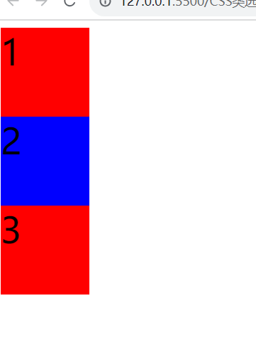
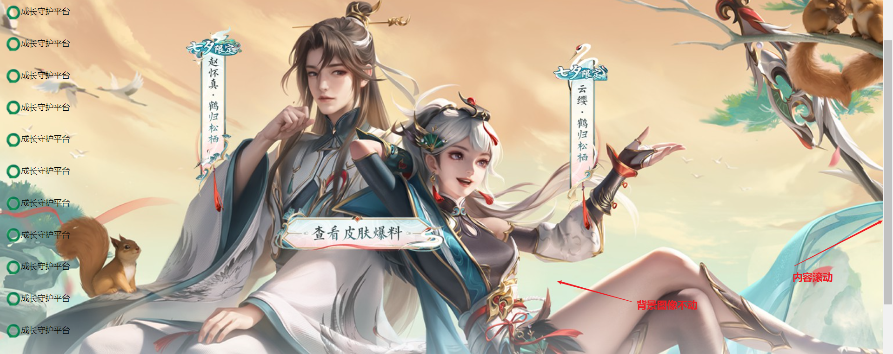
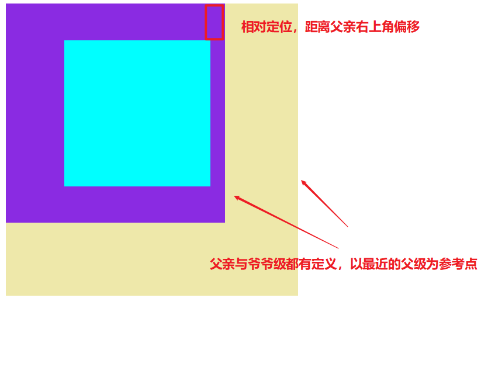
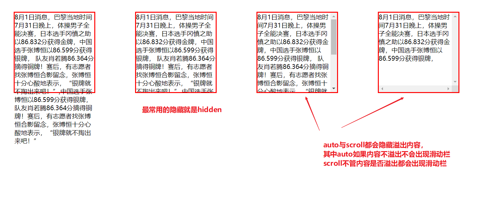
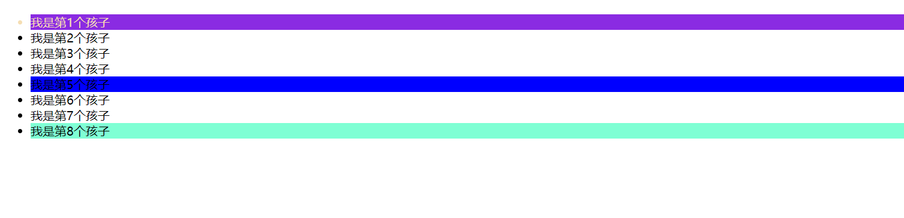
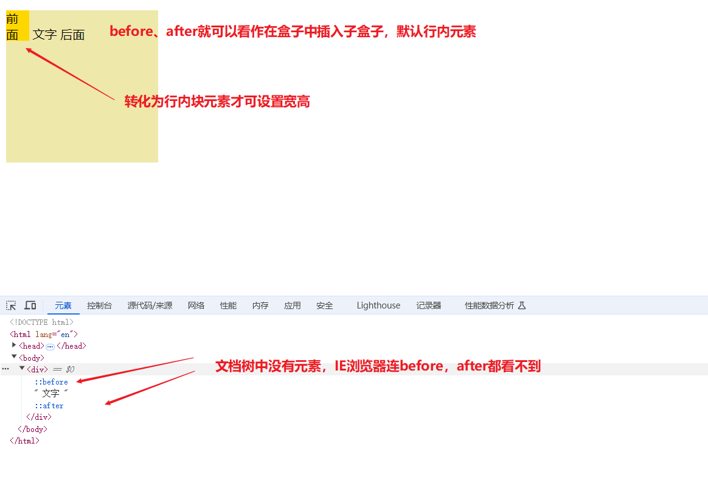
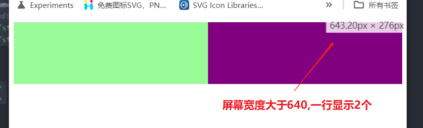
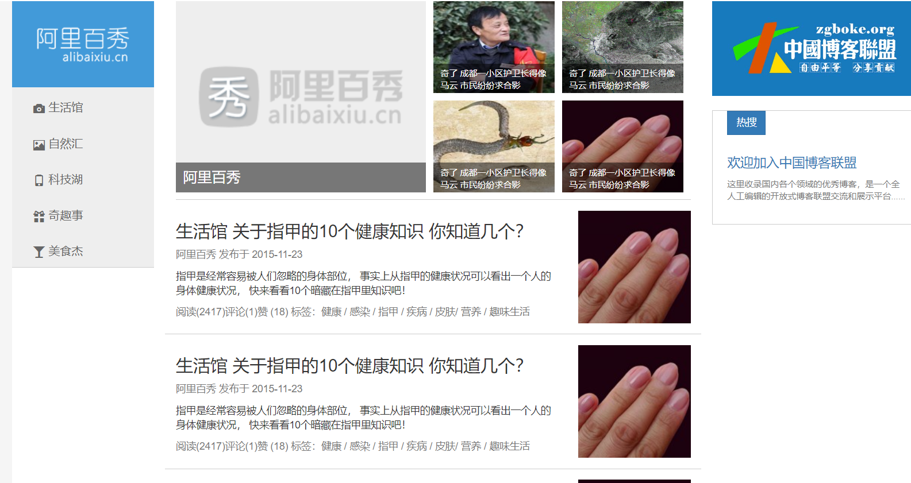

[TOC]


# CSS基础

## 一、CSS简介

HTML可以很容易的是由标签完成页面元素的展示，但它是有局限性的，就是它只关注内容元素的展示对于样式并不太关心。简单的说HTML做出来的页面很==丑==，要做出漂亮的页面，这时就需要使用CSS来完成。

**CSS(Cascading Style Sheets)**译为层叠样式表，又称为CSS样式表或级联样式表。它也是一种**标记语言**。由名字也可以看出，CSS主要就是做网页元素样式的，例如设置网页元素大小、颜色、布局等内容。

> **总结：HTML专注做网页结构，CSS完成页面样式美好，两者搭配完美实现==结构（HTML）==与==样式(CSS)==的分离。最后的==行为==也就是网页动态内容就交给==js==脚本完成**

CSS的语法主要由两部分构成：**选择器**以及**一条或多条样式声明**。选择器决定选择出给谁修改样式，样式声明要修改成什么样式。


代码案例

```html
<style>
    /* 标准编写样式(该风格为展开式风格)一般规范 div与{之间有一个空格 */
        div {
            font-size: 40px;
            /* :后面有一个空格 且每一个样式都以;结尾并换行编写*/
            color: blue; 
        }
</style>
```

运行效果


## 二、CSS选择器

之前以及了解到选择器就是帮助寻找要修改样式的元素，CSS的选择器有很多,不同场景需要不同选择方式。选择器主要可分为==基础选择器==与==复合选择器==两大类。

### 2.1 CSS基础选择器

基础选择器是由单个选择器组成，主要包括**标签选择器、类选择器、id选择器和通配符选择器**。

下表就简单讲解不同选择的使用方法与选择功能效果。

| 选择器                       |                       使用场景                       |           使用方式           | 作用                                                         |
| ---------------------------- | :--------------------------------------------------: | :--------------------------: | ------------------------------------------------------------ |
| **标签选择器（元素选择器）** |             使用HTML标签名直接作为选择器             |        ==HTML标签名==        | 统一给某一类HTML标签全部修改样式，优点是可快速给某一类标签统一修改样式，缺点就是无法差异化设置 |
| **类选择器**                 | 差异化选择标签，可单独选择一个或某几个标签（最常用） | ==.类名+标签class属性=类名== | 可实现选择某一个或多个标签效果，类名可自定义但不能与标签div等相同，长名称可使用-分开，命名要有意义可参考==web开发规范手册命名==，一个标签可同时对应多个类名也就是样式叠加（**多类名**常用） |
| **id选择器**                 |           使用元素标签特有的id属性定义样式           |  ==#id名+标签id属性=id名==   | 该选择其只能实现选中某一个特定标签的效果，因为元素标签id名不能重复，id就相当于标签的身份证号，与类选择器区别就在于使用次数上 |
| **通配符选择器**             |                  选择页面中所有元素                  |            ==*==             | *就是把页面中所有的标签都修改了样式，其中也包括html、head、body等标签也一起修改了，默认作为页面统一样式使用 |

4种基础选择器的基本使用案例

```html
<!DOCTYPE html>
<html lang="en">
<head>
    <meta charset="UTF-8">
    <meta name="viewport" content="width=device-width, initial-scale=1.0">
    <title>CSS开始</title>
    <style>
        /*标签选择器*/
        div {
            font-size: 40px;
            color: blue;
        }

        /* 类选择器  最常用*/
        .red {
            color: red;
            font-size: 12px;
        }

        .my-green {
            color: green;
            font-size: 23px;
        }

        /* id选择器 */
        #nav {
            color: aqua;
        }

        /* 通配符选择器 特殊场景中才使用，该代码就是清除所有元素标签的内外边距*/
        * {
            margin: 0;
            padding: 0;
        }
    </style>
</head>
<body>
    <div>CSS文字内容</div>
    <ul>
        <li class="red">男生</li>
        <li class="my-green">女生</li>
        <li>pingg</li>
        <li class="red">才情</li>
        <li>未来</li>
    </ul>

    <!-- 这里id选择器样式覆盖了div选择器中颜色重复的内容 -->
    <div id="nav">导航栏</div>
</body>
</html>
```

==绘制盒子案例（类选择器多类名调用使用）==

```html
<!DOCTYPE html>
<html lang="en">
<head>
    <meta charset="UTF-8">
    <meta name="viewport" content="width=device-width, initial-scale=1.0">
    <title>Document</title>
    <style>
        /* 统一类样式 */
        .box {
            width: 100px;
            height: 100px;
            font-size: 40px;
        }
        /* 差异类样式 */
        .red {
            background-color: red;
        }

        .blue {
            background-color: blue;
        }
    </style>
</head>
<body>
    <!-- 多类名需要使用空格分开 多类名可达到样式模块化效果 可以很简单实现样式统一修改-->
    <div class="box red">1</div>
    <div class="box blue">2</div>
    <div class="box red">3</div>
</body>
</html>
```

运行效果



### 2.2 复合选择器

复合选择器就是建立在基础选择器之上，它是由**两个或多个基础选择器通过不同方式组合**而成的，复合选择器可以更高效准确的选择目标元素。

常用的复合选择器包括：**后代选择器、子类选择器、并集选择器、伪类选择器**等。

#### 2.2.1 后代选择器(重要)

后代选择器又称为包含选择器，可以选择父元素里面子元素。其写法就是**父类选择器 子类选择器 曾子类选择器....**可以无限嵌套下去，中间用空格分隔。(**注:当标签发生嵌套时，外层标签就是内部标签的父类**),语法如下

```html
<style>
    ol li {
       color: red;
    }
</style>
```

==**注意：后代选择器只修改子代的样式，父类样式不会修改，且其子类不单单是儿子也包含孙子、曾孙等全部的子类。**==

练习案例

```html
<!DOCTYPE html>
<html lang="en">
<head>
    <meta charset="UTF-8">
    <meta name="viewport" content="width=device-width, initial-scale=1.0">
    <title>Document</title>
    <style>
        ol li {
            color: red;
        }
        /* a标签要修改样式需要单独制定才行 这里还可以简写为 ol a,但这样有时会不明确尽量写完全*/
        ol li a {
            color: green;

        }
        /* 类选择器与标签选择器组合 */
        .nav li {
            color: rgb(253, 245, 28);
        }
    </style>
</head>
<body>
    <ol>
        <li>我是ol的孩子</li>
        <li>我是ol的孩子</li>
        <li>我是ol的孩子</li>
        <li>我是ol的孩子</li>
        <li><a href="#">我是孙子标签</a></li>
        <li><a href="#"><span><a href="#">我是曾曾孙</a></span></a></li>
    </ol>
    <ul>
        <li>我是ul的孩子</li>
        <li>我是ul的孩子</li>
        <li>我是ul的孩子</li>
        <li><a href="#">我是孙子标签</a></li>
    </ul>
    <ul class="nav">
        <li>我是ul的孩子</li>
        <li>我是ul的孩子</li>
        <li>我是ul的孩子</li>
    </ul>
</body>
</html>
```

运行效果


#### 2.2.2 子元素选择器(重要)

子元素选择器(子选择器)是**只选择作为某元素的最近一级子元素的选择器**。**简单理解就是只选儿子**，孙子这些都不选择。该选择器就可以弥补子代选择器不能区分儿子孙子的不足。其语法

```html
<style>
  .nav>a {
       color: aqua;
   }
</style>
```

与后代选择器不同，其**父类选择器与子选择器之间是由`>`符号分开的，也可无限嵌套**。其最终修改的依然是只有最后一个子类的样式。

简单的案例

```html
<!DOCTYPE html>
<html lang="en">

<head>
    <meta charset="UTF-8">
    <meta name="viewport" content="width=device-width, initial-scale=1.0">
    <title>Document</title>
    <style>
        .nav>a {
            color: aqua;
        }

        /*多种复合选择器组合*/
        .nav1 ul li>a {
            color: #1cdc46;
        }
    </style>
</head>
<body>
    <div class="nav">
        <a href="#">我是儿子</a>
        <p>
            <a href="#">我是孙子</a>
        </p>
    </div>
    <div class="nav1">
        <ul>
            <li>儿子</li>
            <li>儿子</li>
            <li>儿子</li>
            <li><a href="#">孙子类</a></li>
            <li>
                <p>
                    <a href="#">我是曾孙子</a>
                </p>
            </li>
        </ul>
    </div>
</body>
</html>
```

运行效果(这里只修改了一个，本质该方法常用于修改一群相同的子类元素)


#### 2.2.3 并集选择器(重要)

并集选择器可以选择多组标签，同时为他们定义相同的样式。其效果相当于==**或**==的效果，就是**将不同的元素组合在一起用一个样式**。通常用于集体声明，其不同选择器使用`，`符号分隔，任何形式的选择器都可以作为并集选择器的一部分。其语法：

```html
<style>
    /*一般并集要求一行写一个选择器，写在一行不方便阅读理解*/
   div,
     p {
       color: rgb(12, 246, 27);
     }
</style>
```

简单案例(与后代选择器组合)

```html
<!DOCTYPE html>
<html lang="en">
<head>
    <meta charset="UTF-8">
    <meta name="viewport" content="width=device-width, initial-scale=1.0">
    <title>Document</title>
    <style>
        div,
        p,
        .pig li {
            color: rgb(12, 246, 27);
        }
    </style>
</head>
<body>
    <div>西欧ngd</div>
    <p>香街</p>
    <span>触发</span>
    <ul class="pig">
        <li>佩奇一家1</li>
        <li>佩奇一家2</li>
        <li>佩奇一家3</li>
    </ul>
</body>
</html>
```

效果


#### 2.2.4 伪类选择器(重要)

伪类选择器用于向某些选择器添加特殊的效果，比如给链接添加特殊效果或选择第一个，第n个元素。

伪类选择器书写最大特点就是用**`冒号:`**分隔表示，比如`:hover`表示鼠标选中状态、`:first-child`表示第一个子元素。

> 伪类本质就是不是类属性但其在网页有特殊状态`:hover`或特殊位置`:first-child`而可以通过这样标签直接查找到。

伪类选中器有很多，比如有链接伪类、结构伪类等。

>==链接伪类选择器==：主要是针对链接元素`<a>`的状态的选择器

```tex
链接伪类选择器,其语法主要有:

a:link   /1.*选择所有未被访问的链接*/

a:visited   /2.*选择所有已经被访问的链接*/

a:hover   /3.*选择鼠标指针位于其上的链接*/

a:active  /4.*选择活动链接(鼠标按下为弹起时的链接)*/
```

==链接伪类选择器全部效果案例：==

```html
<!DOCTYPE html>
<html lang="en">
<head>
    <meta charset="UTF-8">
    <meta name="viewport" content="width=device-width, initial-scale=1.0">
    <title>Document</title>
    <style>
        /*选择所有未被访问的链接*/
        a:link {
            color: aqua;
        }

        /*选择所有已经被访问的链接*/
        a:visited {
            color: pink;
        }

        /*选择鼠标指针位于其上的链接*/
        a:hover {
            color: #ea1111;
        }

        /*选择活动链接(鼠标按下为弹起时的链接)*/
        a:active {
            color: blue;
        }

        .nav a {
            color: red;
            text-decoration: none;
        }

        /*选择鼠标指针位于其上的链接*/
        .nav a:hover {
            color: green;
        }
    </style>
</head>
<body>
    <a href="#">链接1</a>
    <a href="#aaa">链接2</a>
    <a href="#aaa3">链接3</a>
    <div class="nav"><a href="#">链接x</a></div>
</body>
</html>
```

运行效果


注意为了确保能全部生效，声明顺序必须按照**LVHA的顺序**即是:link、:visited、:hover、:active

**默认a链接在浏览器有默认样式，因此要修改样式，必须指定单独的样式**。而上述内容并不是每次一定要全部声明，可以选择需要的指定，因为我们比较常见的链接声明如下

```html
 <style>
	a {
      color: gray;
      text-decoration: none;
     }

     /*选择鼠标指针位于其上的链接*/
     a:hover {
       color: red;
     }
 </style>
```

> ==focus伪类选择器==：主要是选取**获得焦点**的**表单元素**，焦点就是我们俗称的光标，一般在input表单元素中获取。

该选择器使用很简单，使用方法如下

```html
<!DOCTYPE html>
<html lang="en">
<head>
    <meta charset="UTF-8">
    <meta name="viewport" content="width=device-width, initial-scale=1.0">
    <title>Document</title>
    <style>
        input:focus {
            background-color: #f03;
        }
    </style>
</head>
<body>
    <input type="text">
    <input type="text">
    <!-- 注意除了text类型、password或者button等表单类型也有效 -->
    <input type="password">
</body>
</html>
```

其运行的效果，光标选中的文本框就改变样式


网页调试中如何**快速查看伪类选择器效果和样式**


## 三、CSS的引入方式

CSS按照书写的位置或引入的方式不同，可以分为三大类：行内样式表、内部样式表、外部样式表。

### 3.1 行内样式表

**行内样式表(内联式)**是在**元素标签内部直接编写style属性设置css样式**，**只适合修改简单的属性修改**，如果需要大范围修改样式，该方式不推荐使用。

```html
<p style="color:red;font-size:20px">红色的字</p>
```

该方式就不需要选择器选择元素，因为它只能控制当前元素，且style的属性值需要==双引号==包含住才能生效。该方式可以直接看到效果，但如果写太多会完全破坏html结构的简洁性，不方便开发者阅读。因此不推荐大量使用。

### 3.2 内部样式表

**内部样式表(嵌入式)**是样式写在**HTML页面内部，将所有CSS样式代码抽取出来**，放入到一个单独的`<style>`标签中，在前面的案例中我们都是按照这种方式来编写的。

```html
<style>
      p {
        text-indent: 2em;
        font-size: 16px;
     }
 	 .test2 {
         line-height: 40px;
     }
</style>
```

理论上该内容可以写在HTML页面的任何标签中，它的作用范围是全局的，但为了防止出现错误，一般情况还是防止`<head>`标签中最好。

其特点就是样式代码结构清晰，但并没有实现结构与样式的完全分离。

> 该样式本质就是行内样式表的优化，是将所有样式统计放到一处可以很容易==实现代码复用与结构管理==

### 3.3 外部样式表(常用)

**外部样式表(链接式)**实际开发网页项目时都会使用，其核心就是单独建立一个CSS文件，其包含的样式内容很多，因为是直接引入CSS文件可以**让一个CSS文件作用到多个html页面**中，复用性很强，**且html与css分为不同文件，实现了结构与样式相分离的效果**。

使用外部样式表步骤很简单：

1. 先新建后缀名为.css的样式文件，在其内部编写好css样式内容


2. 在html文件中使用链接标签将外部样式文件引入，其中链接标签参数的意思分别是**rel文件类型是样式文件**，href就是**文件路径地址**

   ```html
   <!DOCTYPE html>
   <html lang="en">
   <head>
       <meta charset="UTF-8">
       <meta name="viewport" content="width=device-width, initial-scale=1.0">
       <title>Document</title>
       <!-- rel指文件类型，stylesheet就是文件时样式文件，href是文件路径，当选为相同目录就直接文件名便可 -->
       <link rel="stylesheet" href="CSS外部.css">
   </head>
   <body>
       <p>外部样式</p>
   </body>
   </html>
   ```

> 总结

| 样式表         | 优点                             | 缺点         | 使用情况   |
| -------------- | -------------------------------- | ------------ | ---------- |
| 行内样式表     | 书写方便，权重高，只控制一个标签 | 结构样式混写 | 较少       |
| 内部样式表     | 部分结构和样式分离               | 没有彻底分离 | 较多       |
| **外部样式表** | **完全实现结构与样式分离**       | **需要引入** | **最常用** |

### ★ Chrome 调试工具

在每个浏览器中都内部自带了调试工具，只需要按`F12`就可进入。这里就具体使用Chrome调试工具来说明。

进入调试工具的方法，可以按`F12`进入，也可点击`右键选择检查`进入

调试工具默认页


调试工具快捷键

+ `Ctrl＋鼠标滚轮`可以放大缩小代码页面
+ 右边的css样式可直接改动数值(**可按键盘上下键直接调节数值大小**)和查看颜色
+ `Ctrl+0`是复原浏览器大小
+ 如果点击元素右侧没有对应的样式，极有可能是类名或样式引入错误
+ 如果由样式有**黄色感叹号**提示，则可能是样式内容属性书写错误


## 四、CSS样式

### 4.1 CSS Fonts(字体)属性

CSS字体属性主要是定义**字体类型、大小、粗细和文字样式(如斜体)**等内容

#### 4.1.1 字体类型 font-family

字体名称一般不要使用中文怕网页不兼容，**微软雅黑**的英文就是**Microsoft Yahei**，默认遇到**两个字符的就使用引号加空格**编写.

```html
 <style>
        p {
            font-family: "微软雅黑";
        }

        /* 字体类型可以同时定义多个，中间使用,分开，默认从前往后找，如果全部没找到就使用浏览器默认字体 */
        div {
            font-family: Arial, Helvetica, sans-serif, "Microsoft Yahei";
        }
    </style>
```

最常用的字体写法,一般要求整体页面字体一致，因此常常使用body标签统一修改全局字体

```html
body {
       font-family: Arial, Helvetica, sans-serif, 'Microsoft Yahei',Tahoma,'Hiragino Sans GB';
      }
```

常见的中文字体样式中英文

| 中文             | 英文               |
| ---------------- | ------------------ |
| 黑体             | SimHei             |
| 宋体             | SimSun(浏览器默认) |
| 微软雅黑         | Microsoft Yahei    |
| 微软正黑体       | Microsoft JhengHei |
| 楷体             | KaiTi              |
| 新宋体           | NSimSun            |
| 仿宋             | FangSong           |
| 苹方（苹果常用） | PingFang SC        |
| 华文黑体         | STHeiti            |
| 华文楷体         | STKaiti            |
| 华文宋体         | STSong             |
| 华文仿宋         | STFangsong         |
| 华文中宋         | STZhongsong        |
| 华文琥珀         | STHupo             |
| 华文新魏         | STXinwei           |
| 华文隶书         | STLiti&nbsp;       |
| 华文行楷         | STXingkai          |
| 冬青黑体简       | Hiragino Sans GB   |
| 兰亭黑-简        | Lantinghei SC      |
| 翩翩体-简        | Hanzipen SC        |
| 手札体-简        | Hannotate SC       |
| 宋体-简          | Songti SC          |

#### 4.1.2 字体大小 font-size

其中大小值后面的`px`表示像素，是最常用的页面显示单位。不同浏览器文字大小默认不同，**谷歌浏览器默认大小为16px**。

其使用方式很简单，跟字体类型一样都可以直接放入body中，但body中设置文字大小可以修改全局，**`<h>`标题标签没效果，需要单独指定**

```html
<style>
        body {
            font-family: Arial, Helvetica,'Microsoft Yahei', Tahoma, 'Hiragino Sans GB';
            /* body中设置文字大小可以修改全局，但标题标签不能修改，需要单独指定 */
            font-size: 16px;
        }
       /* 标题标签字体单独修改 */
        h1 {
            font-size: 18px; 
        }
 </style>
```

#### 4.1.3 字体粗细 font-weight

font-weight属性值：

+ normal,默认字体样式
+ bold:粗体
+ bloder:特粗体
+ lighter:细体
+ **数字**(不加px单位，默认400等价于normal,700就等价于bold)

```html
 <style>
        body {
            font-family: Arial, Helvetica, 'Microsoft Yahei', Tahoma, 'Hiragino Sans GB';
            /* body中设置文字大小可以修改全局，但标题标签不能修改，需要单独指定 */
            font-size: 16px;
            /* 400就等价于normal*/
            font-weight: 400;
        }
        .bold {
            font-weight: bold;
        }

        .bold1 {
            font-weight: 100;
        }
		/* 700就等价于bold */
        .bold2 {
            font-weight: 700;
        }
        .bold3 {
            font-weight: 900;
        }
    </style>
```

样式中的加粗效果已经了解，但它只是改变样式，如果页面**强调该标签内容**，使用`<strong>`标签效果会更好。

#### 4.1.4 字体风格 font-style

其主要设置文字是否为斜体：**normal默认值非斜体**，**italic斜体**

```html
 <style>
 	  p {
        font-style: italic; 
 	  }
      em {
        font-style: normal;
      }   
  </style>
```

一般很少使用文字倾斜的效果，反而是==常常使用normal将``<em>``或``<i>``标签内倾斜的文字改为不倾斜==。

#### ★ 字体复合属性 font

字体复合属性**使用一种属性同时设置多种属性值**，默认要指定一个字体的几种基础属性默认写法

```html
<style>
     div {
        /* 默认要修改这些字体属性我们需要写5行代码，而使用复合属性就可以简化为1行代码 */
        font-style: italic;
        font-weight: 700;
        font-size: 16px;
        /* 行间距 */
        line-height: 80px;
        font-family: 'Microsoft Yahei';    
     }
</style>
```

而使用复合属性就只需要一行代码

```html
<style>
    div {
        /* font:font-style font-weight font-size/line-height font-family */
		/* 注意属性值的顺序是指定好的，默认要依次指定对应的值*/
        font: italic 700 18px/40px 'Microsoft Yahei';
    }
</style>
```

复合属性值有些是可以省略的，==但必须保留`font-size`、`font-family`设置的内容==，否则font属性将无效

### 4.2 CSS Text(文本)属性

文本属性定义文本的外观，例如**文本颜色、对齐文本、装饰文本、文本缩进、行间距**等。

#### 4.2.1 文本颜色 color

文本颜色主要设置==元素内文本的颜色==，其颜色属性值表示的方法有三种

| 表示方法     | 属性值                                                       |
| ------------ | ------------------------------------------------------------ |
| 预定义颜色值 | red，green,blue等都是浏览器中设置好的颜色值(不常用)          |
| 十六进制     | #FF0000,#FF6600等内容，有简写的方法比如#FF0066可简写为#F06(推荐) |
| RGB代码      | rgb(255,0,0)或rgb(100%，0%，0%)表示纯红色                    |

```html
<style>
     div {
       color: rgb(255, 149, 0);
     }
</style>
```

#### 4.2.2 文本对齐 text-align

文本对齐主要设置==元素内文本内容的水平对齐方式==，对齐属性值有三个：默认是left(左对齐)、center(居中对齐)、right(右对齐)

==案例：注意案例中图片有时也可以看作是父类元素下的文本内容==

```html
<!DOCTYPE html>
<html lang="en">
<head>
    <meta charset="UTF-8">
    <meta name="viewport" content="width=device-width, initial-scale=1.0">
    <title>Document</title>
    <style>
        div {
            color: rgb(255, 149, 0);
        }
        h1 {
            text-align: right;
        }
		/* 图片元素也相当于父类元素下的文本内容 */
        p {
            text-align: center;
        }
    </style>
</head>

<body>
    <div>查看成绩</div>
    <p>
        
    </p>
    <h1>标题</h1>
</body>

</html>
```

运行效果


#### 4.2.3 文本装饰 text-decoration

**文本装饰**主要设置==元素内文本的下划线、上划线以及删除线等内容==，装饰文本属性值有：

+ **none**,默认值，表示没有装饰线(**最常用于去掉`<a>`链接标签的默认下滑线**)
+ **underline**,下划线，链接标签<a>默认自带下划线
+ **overline**,上划线，几乎不用
+ **line-through**,删除线，几乎不用

```html
<style>
    a {
         text-decoration: none; /*去掉链接标签的下滑线*/
      }
</style>
```

各个装饰文本效果如下


#### 4.2.4 文本缩进 text-indent

文本缩进主要设置==元素内文本段落的首行缩进==，缩进的属性值就是指定一个**缩进长度**，可以为正值，也可以为负值，单位默认为`px`

```html
   <style>
   		p {
            text-indent: 20px;
        }
    </style>
```

当如果要求缩进几个字的距离，则可以使用单位`em`，它是一个相对单位，它是根据**当前的元素文字大小font-size的值**来动态转化的，如果当前元素没有设置大小，则会按照**父元素文本大小**来转化。

```html
<style>
   	p {
        text-indent: 2em;/*表示缩进两个字距离*/
    }
</style>
```


#### 4.2.5 行间距(行高) line-height

行间距主要设置==元素内文本行与行之间的距离(俗称行高)==，通常网页元素的行间距主要由三部分构成:**上间距、文本高度(也就是文本大小)、下间距**


**上间距与下间距高度相等，调整行间距本质就是调节上下间距的值**。如果设置行间距小于文本高度，文本段落就会**出现交叉重叠的现象**，出现上下间距为负值的情况。

**行高既可以带有px单位，也可以不带单位，不带单位的行高表示行高数据是字体大小的几倍，例如行高1.5就是字体大小数值的*1.5*就是行高**

==简单的行间距案例==

```html
<html lang="en">
<head>
    <meta charset="UTF-8">
    <meta name="viewport" content="width=device-width, initial-scale=1.0">
    <title>Document</title>
    <style>
        p {
            text-indent: 2em;
            font-size: 16px;
        }
        .test1 {
            line-height: 10px;
        }
        .test2 {
            line-height: 40px;
        }
    </style>
</head>

<body>
    <p>类似的状况也会发生在符号上，因为 Markdown 支持 行内 HTML ，如果你使用符号作为 HTML 标签的分隔符，那 Markdown 也不会对它做任何转换，但是如果你是写：</p>

    <p class="test1">类似的状况也会发生在符号上，因为 Markdown 支持 行内 HTML ，如果你使用符号作为 HTML 标签的分隔符，那 Markdown
        也不会对它做任何转换，但是如果你是写</p>

    <p class="test2">类似的状况也会发生在符号上，因为 Markdown 支持 行内 HTML ，如果你使用符号作为 HTML 标签的分隔符，那 Markdown
        也不会对它做任何转换，但是如果你是写</p>
</body>

</html>
```

运行效果


**测量行间距软件**推荐==FSCapture==,测量方法如下，先打开软件，选择最右边的标尺工具就可以进行测量。测量完成后可按**`F12`**进入网页调试工具中查看是否正确。


> 如果遇到软件测量的效果与设置的不一致，可能会是==电脑系统屏幕显示缩放的缘故==。
>
> ==对于win10系统：桌面点击右键，显示设置，缩放与布局不是100%。设置为100%后，重新打开FS。就可以了==

> **==小技巧：单行文字垂直居中对齐==**
>
> 
>
> Css没有提供**文字垂直居中**对齐的代码，我们可以使用一个小技巧来实现。就是**让文字的行高等于==容器的高度==**，因为行高等于上间距+文字高度+下间距，让行高等于容器高度，就相当于上下间距将文字挤到中间，自然实现居中对齐。同理如果**行高小于容器高度，文字偏上，大于容器高度，文字偏下**。其简单案例如下:

```html
<!DOCTYPE html>
<html lang="en">
<head>
    <meta charset="UTF-8">
    <meta name="viewport" content="width=device-width, initial-scale=1.0">
    <title>Document</title>
    <style>
        span {
            width: 100px;
            height: 50px; /*容器的高度*/
            display: block;
            background-color: pink;
        }
        .up {
            line-height: 30px;
        }
        .mid {
            line-height: 50px;
        }
        .down {
            line-height: 70px;
        }
    </style>
</head>
<body>
    <span class="mid">文字居中</span>
    <br>
    <span class="up">文字偏上</span>
    <br>
    <span class="down">文字偏下</span>
    <br>
</body>
</html>
```

运行效果


### 4.3 元素显示模式display(重要★)

元素的显示模式就是决定==**网页元素标签以什么方式进行显示**==。比如`<div>`标签就是自己占一行而`<span>`标签则可以一行放多个。

HTML元素一般分为两种类型分别是`块元素`与`行内元素`。

#### 4.3.1 块元素(block)

常见的块元素有`<h1>~<h6>、<p>、<div>、<ul>、<ol>、<li>`等，其中`<div>`是**最典型的块元素**。

> 块元素的特点：
>
> 1. 一个元素单独占一行
> 2. 高度、行高、外边距以及内边距都可以控制
> 3. **宽度默认为容器(父级元素)的宽度**
> 4. ==常作为容器和盒子看待，里面可以放行内以及其他块级元素==

注意：==文字类块元素（例如`<p>、<h1>`等）内不能使用块级元素==，<p>标签主要用于存放文字，因此其中不要放块级元素特别是<div>，放入后会解析错误。例如:

```html
 <!-- 错误写法-->    
	<p>
    <div>文字</div>
    </p>

    <!-- 在网页中会被解析为，多创建了一个p标签-->
    <p></p>
    <div>文字</div>
    <p></p>
```

#### 4.3.2 行内元素(inline)

常见的行内元素有`<a>、<strong>、<b>、<em>、<i>、<u>、<span>`等，其中`<span>`是**最典型的行内元素**。又称为**内联元素**。

> 行内元素的特点：
>
> 1. 相邻行内元素在一行上，中间有空白缝隙，一行可显示多个行内元素
> 2. 宽度与高度默认，样式设置直接无效(样式提示中会出现黄色波浪线提示)
> 3. **默认宽度就是本身内容的宽度**
> 4. ==行内元素只能容纳文本或其他行内元素==

==注意：特殊情况`<a>`链接标签内不能放其他`<a>`链接，但`<a>`中可以放块级元素，但这样使用时最好把`<a>`标签转化为块级模式最安全。==

#### 4.3.3 行内块元素(inline-block)

行内元素有几个特殊的标签元素——`、<input/>、<td>`等，他们同时具有块元素与行内元素的特点。因此有些地方将其命为**行内块元素**。

> 行内块元素的特点：
>
> 1. **和相邻行内块元素(或行内元素)在一行上，中间有空白缝隙分开，一行显示多个**（行内元素的特点）
> 2. 默认宽度为本身内容的宽度（行内元素的特点）
> 3. **高度、行高、外边距以及内边距都可以控制**（块元素特点）

三种显示元素的简单案例

```html
<!DOCTYPE html>
<html lang="en">
<head>
    <meta charset="UTF-8">
    <meta name="viewport" content="width=device-width, initial-scale=1.0">
    <title>Document</title>
    <style>
		div {
			background-color: aqua;
		}
		span {
			background-color: red;
		}
		input {
			background-color: pink;
		}
        .div1 {
            width: 100px;
            height: 100px;
        }
        .span1 {
            width: 100px;
            height: 100px;
        }
        .input1 {
            width: 100px;
            height: 200px;
        }
    </style>
</head>
<body>
    <div>块元素</div>
    <div class="div1">块元素</div>
    <span>行内元素</span>
    <span class="span1">行内元素</span>
    <span>行内元素</span>
    <input type="text" value="行内块元素">
    <input type="text" value="行内块元素" class="input1">
    <input type="text" value="行内块元素">
</body>
</html>
```

效果


> **总结**

| 元素模式   | 元素排列特点             | 设置样式       | 默认宽度       | 包含                                      |
| ---------- | ------------------------ | -------------- | -------------- | ----------------------------------------- |
| 块元素     | 一行只能放一个块元素     | 可设置宽高度   | 父容器宽度     | 可包含任何其他标签，文字类需注意          |
| 行内元素   | 一行可以放多个行内元素   | 不可设置宽高度 | 本身内容的宽度 | 容纳文本或其他行内元素，`<a>`标签比较特殊 |
| 行内块元素 | 一行可以放多个行内块元素 | 可设置宽高度   | 本身内容的宽度 | 内容自定义                                |

#### ★ 元素显示模式的转换(display)

在特殊情况下可能**需要一种显示模式的元素拥有另一种显示模式的特性**。这时就需要元素模式的转换。比如<a>链接需要设置宽高度增加其触发范围，就需要将其转换为块元素模式。

> 默认转换的使用方式
>
> + 转换为块元素：display:block(最常用)
> + 转换为行内元素：display:inline
> + 转换为行内块元素：display:inline-block(比较常用)

简单转化模式案例代码

```html
<!DOCTYPE html>
<html lang="en">

<head>
    <meta charset="UTF-8">
    <meta name="viewport" content="width=device-width, initial-scale=1.0">
    <title>Document</title>
    <style>
        a {
            width: 100px;
            height: 100px;
            background-color: pink;
            /* 行内原转换为块元素 */
            display: block;
        }
        div {
            width: 100px;
            height: 100px;
            background-color: aqua;
            /* 块元素转换为行内元素 */
            display: inline;
        }
        span {
            width: 100px;
            height: 100px;
            background-color: red;
            /* 行内元素转换为行内块元素 */
            display: inline-block;
        }
    </style>
</head>
<body>
    <a>a标签</a>
    <a>a标签</a>
    <div>块元素</div>
    <div>块元素</div>
    <span>行内元素</span>
    <span>行内元素</span>
</body>
</html>
```

==案例：简单小米链接侧边栏==

```html
<!DOCTYPE html>
<html lang="en">

<head>
    <meta charset="UTF-8">
    <meta name="viewport" content="width=device-width, initial-scale=1.0">
    <title>Document</title>
    <style>
        a {
            /* 转化为块模式 */
            display: block;
            width: 230px;
            height: 40px;
            background-color: #55585a;
            color: #fff;
            font-size: 14px;
            /* 通过设置首行距离制作前面空行的效果 */
            text-indent: 2em;
            text-decoration: none;
            /* 设置行高与高度一样就可以让文本居中对齐 */
            line-height: 40px;
        }
        a:hover {
            background-color: #ff6700;
        }
    </style>
</head>

<body>
    <a href="">手机 电话卡</a>
    <a href="">电视 盒子</a>
    <a href="">笔记本 平板</a>
    <a href="">出行 穿戴</a>
    <a href="">智能 路由器</a>
    <a href="">健康 儿童</a>
    <a href="">耳机 音箱</a>
</body>
</html>
```

运行效果


### 4.4 CSS背景 background

css通过背景属性可以给页面元素添加背景样式。背景属性可以设置`背景颜色`、`背景图片`、`背景平铺`、`背景图片位置`、`背景图像固定`等内容

#### 4.4.1 背景颜色 background-color

背景颜色主要设置元素对象背景的颜色，其默认值为**transparent(透明色)**，透明色就表示默认没有颜色，也可以直接设置颜色值，跟之前设置文字颜色一样。

```html
<style>
    div {
        background-color: #fff;
    }
</style>
```

#### 4.4.2 背景图片 background-image(重要)

背景图片主要设置元素的背景图像。**实际开发中常见用于logo或者一些装饰性小图片或者超大的背景图片，其优点在于非常便于控制位置**。(精灵图也是一种应用场景)，背景图片默认值为 **none** 表示默认没有背景图，也可以使用**url(url地址)**，地址可以使用相对或绝对路径地址

 ```html
 <style>
    div {
         width: 200px;
         height: 200px;
         background-image: url(logo.png);
    }
 </style>
 ```

背景图片默认效果为**平铺效果**。平铺效果就是图片小于容器大小就会重复复制显示直到填充满整个容器。案例效果如下


可通过设置**`background-repeat`**属性调整背景的填充效果。默认值为**`repeat`就是平铺的意思，`no-repeat`就是不平铺，`repeat-x`就是沿着x轴平铺，`repeat-y`就是沿着y轴平铺**。

```html
<style>
    div {
        width: 300px;
        height: 300px;
        background-color: #ff0;
        background-image: url(logo.png);
        background-repeat: no-repeat;
    }
</style>
```

**背景图片与背景颜色是可以同时添加，默认背景图片在背景颜色的上方**。上边案例的效果如下


**==背景图片位置==**控制可以利用属性`background-position`完成。其默认格式为

> background-position: x y;

x代表x轴坐标，y代表y轴坐标。可以使用==方位名词==或==精确单位==表示。

**方位名词**是指例如`top(上)|center(中)|bottom(下)|left(左)|right(右)`，其中在使用方位名词表示时，需要注意几点

+ **可以不按照x,y的顺序写**，例如`background-position: top center`与`background-position: center top`是一样的，因为上下默认只表示y轴与左右默认只表示x轴

+ **方位名词的写法可省略**，省略内容默认值为center,例如 `background-position：bottom`其等价于`background-position：center bottom`意思就是下方居中对齐

  

+ background-position默认值是`background-position：0 0`也就等价于`background-position：left，top`

如果需要的位置不完全是指定的方位位置，这时就需要使用**精确单位**表示，它的值可以是像素值也可以为百分比。而使用精确单位时，**必须按照下x，y顺序填写**。案例如下

```html
<style>
    div {
        width: 300px;
        height: 300px;
        background-color: #ff0;
        background-image: url(logo.png);
        background-repeat: no-repeat;
        background-position: 20px 50%;
    }
 </style>
```

**精确单位值也可省略**，而省略的内容默认填充为center或50%，例如`background-position: 20px`意思就是`background-position: 20px center`。也可看出，**方位名词与精确单位是可以同时使用的**，但一定要注意x,y位置。

背景图片固定使用`background-attachment`属性来设置背景图像是否跟随页面其余内容滚动。其默认值**scroll就是跟随内容滚动**，**fixed就是图像固定不滚动**。简单案例代码如下

```html
<!DOCTYPE html>
<html lang="en">
<head>
    <meta charset="UTF-8">
    <meta name="viewport" content="width=device-width, initial-scale=1.0">
    <title>Document</title>
    <style>
        h3 {
            width: 118px;
            height: 41px;
            font-size: 14px;
            font-weight: 400;
            line-height: 41px;
            background-image: url(未标题-4.png);
            background-repeat: no-repeat;
            background-position: left center;
            text-indent: 2em;
        }
        body {
            background-image: url(bg.jpg);
            background-repeat: no-repeat;
            background-position: center top;
            background-attachment: fixed;
        }
    </style>
</head>
<body>
    <h3>成长守护平台</h3>
    <h3>成长守护平台</h3>
    <h3>成长守护平台</h3>
    <h3>成长守护平台</h3>
    <h3>成长守护平台</h3>
    <h3>成长守护平台</h3>
    <h3>成长守护平台</h3>
    <h3>成长守护平台</h3>
    <h3>成长守护平台</h3>
    <h3>成长守护平台</h3>
    <h3>成长守护平台</h3>
    <h3>成长守护平台</h3>
    <h3>成长守护平台</h3>
    <h3>成长守护平台</h3>
    <h3>成长守护平台</h3>
    <h3>成长守护平台</h3>
    <h3>成长守护平台</h3>
    <h3>成长守护平台</h3>
    <h3>成长守护平台</h3>
    <h3>成长守护平台</h3>
    <h3>成长守护平台</h3>
</body>
</html>
```



#### 4.4.3 网页图片爬取方法

在学习过程中，有时可能需要图片素材，这时就可以去网页上爬取一些图片下来练习，但这种方式只能用于学习绝不可商用。

在前面我们已经学习了两种表示图片的方式，一种是使用标签，一种是背景图片设置。因此要获取网页图片资源，也是先进入F12调试模式，选中图片元素。如果看到元素是img标签，则之间**复制src链接内容进行图片另存为**即可


而如果看到的元素不是img，则看样式中是否为背景图片设置，点开url就可下载


当然，有时小图标的url内容不是一个而是很多，这时就会使用精灵元素来使用了。这里先不讲精灵后续高级内容会说明。


==王者小图标背景图与超大背景图案例==

超大背景图，一般这些图片会大于默认屏幕的大小，一般会选中水平居中显示只显示中间部分重要内容。

```html
<!DOCTYPE html>
<html lang="en">

<head>
    <meta charset="UTF-8">
    <meta name="viewport" content="width=device-width, initial-scale=1.0">
    <title>Document</title>
    <style>
        h3 {
            width: 118px;
            height: 41px;
            font-size: 14px;
            font-weight: 400;
            line-height: 41px;
            background-image: url(未标题-4.png); /*该图片是案例中的小图标*/
            background-repeat: no-repeat;
            background-position: left center;
            text-indent: 2em;
        }
        
        body {
            background-image: url(bg.jpg);
            background-repeat: no-repeat;
            background-position: center top;
        }
    </style>
</head>

<body>
    <h3>成长守护平台</h3>
</body>

</html>
```

运行效果：


#### 4.4.4 背景复合属性 background

跟font复合属性类似，背景属性也有复合属性的写法，但背景复合属性没有顺序的约束。但按照规范，，一般顺序为

> background：背景颜色 背景图片 背景平铺 背景图像滚动 背景图片位置

```html
<style>
   body {
       /* 
        background-color: black;
        background-image: url(bg.jpg);
        background-repeat: no-repeat;
        background-position: center top;
        background-attachment: fixed; 
       */
        /*上述的复合属性写法如下*/
        background: transparent url(bg.jpg) no-repeat fixed center top;
   }
</style>
```

运行效果与之前一致。

#### 4.4.5 背景颜色半透明

css3给我们提供了新的背景颜色半透明的效果。其实现方式就是将原本的`rgb`值修改为新的`rgba`值，其中最后一个**alpha**值就是透明度值。**0表示完全透明，1表示完全不透明，0.5就是半透明**。有时也可省略写法.5，但一般不推荐，因为这样不会错但不容易阅读。

**注意：半透明只有容器透明，容器内部内容不会透明，这是css3的新属性，IE9+版本浏览器才支持。**

简单写法

```html
<!DOCTYPE html>
<html lang="en">
<head>
    <meta charset="UTF-8">
    <meta name="viewport" content="width=device-width, initial-scale=1.0">
    <title>Document</title>
    <style>
        body {
            background: transparent url(bg.jpg) no-repeat scroll top center;
        }
        div {
            width: 300px;
            height: 300px;
            background-color: rgba(9, 70, 194, 0.5);
        }
    </style>
</head>
<body>
    <div>容器文字内容</div>
</body>
</html>
```

运行效果


> **总结**

| 属性                 | 作用       | 值                                                   |
| -------------------- | ---------- | ---------------------------------------------------- |
| background-color     | 背景颜色   | 预定义颜色值/十六进制/RGB代码                        |
| background-image     | 背景图片   | url(图片路径)                                        |
| background-repeat    | 是否平铺   | repeat/no-repeat/repeat-x/repeat-y                   |
| background-position  | 背景位置   | length/position 分别是x、y坐标                       |
| background-atachment | 背景附着   | scroll滚动/fixed固定                                 |
| 背景复合属性         | 书写更简洁 | 背景颜色 背景图片 背景平铺 背景滚动 背景位置         |
| 背景颜色半透明       | 新机制     | background：rgba(0,0,0,0.3)增加第四个值alpha透明度值 |

#### 4.4.6 背景图缩放 background-size

在css3中就添加了背景图缩放的属性，这样背景图也可以像普通图片img那样可以进行缩放。

`background-size:x,y`属性规定的背景图像的尺寸，x是图片的宽度，y是图片的高度。y可以省略不写，图片就会按照宽度进行等比缩放。

除了像素值，x,y还可以使用百分比，50%的意思就是x是**背景图盒子宽度的一半**。

还有特定值==**cover**==与==**contain**==,cover就是**等比放大图片**到占满父盒子为止，可能会丢失一部分图片。contain是等比放大图片，将图像扩展至于最大尺寸，以使其宽度和高度完全适应盒子区域，不会丢失图片但可能盒子会有空白。**contain在开发中最常用**。

```html
<!DOCTYPE html>
<html lang="en">
<head>
    <meta charset="UTF-8">
    <meta name="viewport"
        content="width=device-width, user-scalable=no,initial-scale=1.0,maximum-scale=1.0,minimum-scale=1.0">
    <title>Document</title>
    <style>
        div {
            width: 500px;
            height: 500px;
            border: 2px solid red;
            background: url(dog.jpg) no-repeat;
            /* 写法1：background-size:x,y 图片会变这种可能形*/
            /* background-size: 500px 200px; */
            /* 写法2：依照宽度等比缩放 不会变形 但可能会丢失一部分内容*/
            /* background-size: 500px; */
            /* 写法3：使用百分比 */
            /* background-size: 50%; */
            /* 写法4：cover完全覆盖盒子 可能有部分背景图片显示不全*/
            /* background-size: cover; */
            /* 写法5：contain将图像扩展至于最大尺寸，以使其宽度和高度完全适应内容区域 */
            background-size: contain;
        }
    </style>
</head>

<body>
    <div></div>
</body>
</html>
```

效果


#### 4.4.7 背景颜色渐变

CSS3支持背景颜色从一种变化到另一种，也就是**颜色渐变**。渐变的方式有很多：比如线性渐变`linear-gradient`、径向渐变`radial-gradient`等。以线性渐变为例，它的写法为linear-gradient(渐变起始方向，颜色1，颜色2，...)，

+ 渐变起始方向:默认是top，也就是**从上往下渐变**，设置为left就是**从左往右**，如果设置为left top也就是**从左上角到右下角**斜线渐变
+ 渐变的颜色可以写许多个，他会从前往后依次渐变等距离

```html
<!DOCTYPE html>
<html lang="en">
<head>
    <meta charset="UTF-8">
    <meta name="viewport" content="width=device-width, initial-scale=1.0">
    <title>背景颜色渐变</title>
    <style>
        div {
            width: 600px;
            height: 200px;
            /* pc端背景渐变必须加浏览器类型前缀,例如-webkit- ，渐变颜色不止可以写2个，可以写很多个颜色*/
            background: -webkit-linear-gradient(left, red, blue);
            /* 从左上角斜线渐变 */
            /* background: linear-gradient(left top, red, blue); */
        }
    </style>
</head>
<body>
    <div></div>
</body>
</html>
```

效果


径向渐变`radial-gradient`通过指定渐变的中心（0% 椭圆所在的位置）和*结束形状*（100% 椭圆）的大小和形状来指定。


要创建平滑的渐变，`radial-gradient()` 函数绘制了一系列从中心点放射到*结束形状*（甚至可能超出范围）的同心轮廓。结束形状可以是圆形或椭圆形。

```html
<!DOCTYPE html>
<html lang="en">
<head>
    <meta charset="UTF-8">
    <meta name="viewport" content="width=device-width, initial-scale=1.0">
    <title>背景颜色渐变</title>
    <style>
        div {
            width: 600px;
            height: 400px;
            /*  径向渐变默认就是从中心开始向外渐变 ，直接设置开始结束颜色就行*/
            /* background: radial-gradient(#e66465, #9198e5); */
            /* 完整参数写法 在容器中心的渐变，从红色开始，变成蓝色，最后变成绿色 */
            background: radial-gradient(circle at center, red 0, blue, green 100%);
        }
    </style>
</head>
<body>
    <div></div>
</body>

</html>
```

效果


## 五、Emmet语法

emmet语法主要目的就是为了方面快速编写html页面与样式而开发的一种**工具语言**，在VScode工具中默认包含。可以直接使用的。**emmet语法本质就是完整代码的缩写指令**。

### 5.1 快速生成HTML语法

编写html如果一条条写很慢，是否有方法可以快速生成一群标签呢，答案是可以的就是使用Emmet的简写语法就行。默认所有语法编写完成都按**`tab按钮`**进行转化

| **emmet语法编写**         | **语法效果**                                  |
| ------------------------- | --------------------------------------------- |
| **！**                    | 快速生成默认Html页面基本内容                  |
| **标签名**                | 快速生成标签 例如div就是快速生成一个div       |
| **标签名\*数量**          | 快速生成多个相同标签 \*就是表示生成多个       |
| **父级标签名>子级标签名** | 快速生成父子级标签使用>连接标签就行           |
| **标签名+标签名**         | 快速生成兄弟级标签使用+连接标签就行           |
| **(标签名).类名**         | 快速生成带有类名的标签，没写标签名默认使用div |
| **(标签名)#id名**         | 快速生成带有id的标签，没写标签名默认使用div   |
| **(标签名).类名\$*数量**  | 快速生成有顺序的类名，使用自增符号\$          |
| **标签名{内部文字}**      | 快速生成标签内部文字内容使用{}                |

==案例==

```html
<!-- 单个标签与复数标签 -->
<!-- div+tab -->
<div></div>
<!-- p*3+tab -->
<p></p>
<p></p>
<p></p>
<!-- 父子级 -->
<!-- div>span -->
<div>
    <span></span>
</div>
<!-- ul>li*3 -->
<ul>
    <li></li>
    <li></li>
    <li></li>
</ul>
<!-- 兄弟级 -->
<!-- div+p*3 -->
<div></div>
<p></p>
<p></p>
<!-- 类名与id -->
<!-- .demo #demo-->
<div class="demo"></div>
<div id="demo"></div>
<!-- p.demo#test -->
<p class="demo" id="test"></p>
<!-- 自增类名 -->
<!-- div.demo$*5 -->
<div class="demo1"></div>
<div class="demo2"></div>
<div class="demo3"></div>
<div class="demo4"></div>
<div class="demo5"></div>
<!-- 生成标签内部内容 -->
<!-- div{内部文字} -->
<div>内部文字</div>
<!-- div{$}*3 -->
<div>1</div>
<div>2</div>
<div>3</div>
```

### 5.2 快速生成CSS样式语法

emmet快速生成css语法总结下来就是==**简写单词首字母＋tab按键**==。

例如`text-align:center`其写法就是**tac**

`font-size:30px`就是**fs+tab然后输入30像素值**或者**fs30px**，甚至简写为**fs30**

同理`width:100px`就是**w100**,其案例如下

```html
div {
       /* fz+30px或者fz30 */
       font-size: 30px;
       /* c */
       color: #000;
       /* tac */
       text-align: center;
       /* w100 */
       width: 100px;
}
```

> emmet语法是要开发工具拥有该功能才能使用，如果没有还是需要按照原本的方法编写，该方法只为了快速编写内容，初学者不建议使用

### 5.3 vscode代码自动格式化设置

该内容就在**设置-文本编辑器-格式化-勾选format on save**，这样只要保存代码就会格式化。


## 六、CSS的三大特性

css有三个非常重要的特性：**层叠性、继承性、优先级**。

### 6.1 层叠性

给相同的选择器设置了相同的样式，也就是常说的**重复设置样式**，此时一个样式就会覆盖(层叠)另一个冲突的样式。这就是层叠性。层叠性解决样式冲突的原则就是==就近原则==。也就是样式冲突时，哪个样式离结构近就执行哪个样式。样式不冲突时不会覆盖，全部都会执行。

```html
<style>
    div {
       /* 颜色冲突，会执行下面距离div近的样式 */
       color: red;
       /* 文字样式不冲突，依然会执行效果 */
       font-size: 40px;
    }
    div {
        color: aqua;
    }
</style>
```

执行效果


### 6.2 继承性

**css中的继承，子标签元素会继承父标签元素的==某些样式==**，例如文本颜色、字体大小等。继承性可以很方便的实现多个子元素标签样式统一，只需要在父标签上编写样式就行，这样会大大简化CSS的复杂性。

```html
<!DOCTYPE html>
<html lang="en">
<head>
    <meta charset="UTF-8">
    <meta name="viewport" content="width=device-width, initial-scale=1.0">
    <title>Document</title>
    <style>
        div {
            color: red;
        }
    </style>
</head>
<body>
    <div>
       <!-- 设置的是div的颜色，但子标签p也会继承对应的样式 -->
        <p>继承父亲的内容</p>
    </div>
</body>
</html>
```


**子元素继承父元素的样式有text-，font-,line-这些元素开头的以及color属性都可以继承**。

继承中有一些比较特殊的案例，比如行高的比例继承。之间以及学习，行高是可以设置字体大小比例的数值，但当该比例设置在父元素上，而子元素的字体大小跟父元素不同时，这时的**行高继承的是现有子元素字体大小*行高比例**。

```html
<!DOCTYPE html>
<html lang="en">
<head>
    <meta charset="UTF-8">
    <meta name="viewport" content="width=device-width, initial-scale=1.0">
    <title>Document</title>
    <style>
        body {
            font: 16px/1.5 'Microsoft YaHei';
            color: red;
        }

        /* 子元素单独设置了字体大小，它的行高值变化为新字体大小的比例 */
        p {
            font-size: 20px;
        }
    </style>
</head>
<body>
    <div>
        div内容
    </div>
    <p>p的内容</p>
</body>
</html>
```


**继承是具有传递性的**，如果父元素下的子元素以及孙子元素都没设置样式，它们都会继承父元素的样式，也就是常说的==代代传承==。

### 6.3 优先级

给同一个元素指定了**多个多种选择器**，这时就会根据不同选择器的优先级选择对应的样式。

==**同一个元素同时使用了不同选择器指定相同的样式 这时就不会依靠就近原则判断而是根据选择器权重判断**==。

```html
<!DOCTYPE html>
<html lang="en">

<head>
    <meta charset="UTF-8">
    <meta name="viewport" content="width=device-width, initial-scale=1.0">
    <title>Document</title>
    <style>
        /* 同一个元素同时使用了不同选择器指定相同的样式 这时就不会依靠就近原则判断而是根据选择器权重判断*/
        .nav {
            color: blue;
        }

        div {
            color: red;
            font-size: 20px;
        }
    </style>
</head>
<body>
    <div class="nav">
        div内容
    </div>
</body>
</html>
```

运行效果


选择器优先级权重如下表所示

| **选择器**               | **选择器权重设置** |
| ------------------------ | ------------------ |
| **继承或通配符选择器\*** | 0,0,0,0            |
| **元素选择器**           | 0,0,0,1            |
| **类选择器，伪类选择器** | 0,0,1,0            |
| **ID选择器**             | 0,1,0,0            |
| **行内样式style=**       | 1,0,0,0            |
| **!important重要的**     | 无限大             |

权重数值越大，优先级越高，**上边从上往下权重依次增大,数值依次是0，1，2，4，8，无穷大**，==权重的比较是位置从左往右依次比较==，比如行内样式第一个位就是1，因为他比第一位是0的权重都要高。==**在继承的情况中，不管父元素全是有多高，子元素继承的权重默认始终是0**==。

```html
<!DOCTYPE html>
<html lang="en">
<head>
    <meta charset="UTF-8">
    <meta name="viewport" content="width=device-width, initial-scale=1.0">
    <title>Document</title>
    <style>
        /* 同一个元素同时使用了不同选择器指定相同的样式 这时就不会依靠就近原则判断而是根据选择器权重判断*/
        /* 类选择器 */
        .nav {
            color: blue;
        }
        /* 元素选择器 */
        div {
            /* 添加的特殊表示符，选择器默认会变成最高权重 */
            color: red !important;
            font-size: 20px;
        }
        /* id选择器 */
        #demo {
            color: green;
        }
        /* 父类继承样式权重低，会被覆盖 */
        body {
            color: bisquek;
        }
    </style>
</head>
<body>
    <!-- 行内样式 -->
    <div class="nav" id="demo" style="color:brown">
        div内容
    </div>
</body>
</html>
```

学习完选择器权重后，我们就可以**理解为什么之前给使用通配符选择器设置全局样式时，`<a>`标签样式依然不会改变**，因为浏览器默认会给`<a>`默认样式蓝色有下划线文字` a {color:blue; text-decoration: underline;}`，==标签选择器权重比通配符或继承高，因此会覆盖通配符或继承的样式。而如果后面自己自定样式，这样就近执行就近原则覆盖默认样式==。

#### ★ 复合选择器权重叠加计算规则

在使用复合选择器时，这时就会出现权重叠加的问题，这时就需要按照一定的规则来计算权重。

最简单的权重叠加的案例

```html
<!DOCTYPE html>
<html lang="en">
<head>
    <meta charset="UTF-8">
    <meta name="viewport" content="width=device-width, initial-scale=1.0">
    <title>Document</title>
    <style>
        /* 类选择器复合选择器，权重始终高于标签复合选择器，即使是下面叠加无数个都一样*/
        .nav li {
            color: aquamarine;
        }
        /* li的标签选择器，ul li权重 比li的权重高就是因为权重叠加*/
        ul li {
            color: red
        }
        li {
            color: blue;
        }
    </style>
</head>
<body>
    <ul class="nav">
        <li>li的内容1</li>
        <li>li的内容2</li>
        <li>li的内容3</li>
    </ul>
</body>

</html>
```

运行效果 执行ul li的内容，而它的权重其实时0，0，0，1+0，0，0，1=0，0，0，2，==权重叠加不会进位==，因此标签选择器始终要低于类选择器，不管叠加多少个。


权重计算小案例：

+ div ul li  ------>0,0,0,3
+ .nav ul li ------>0,0,1,2
+ a:hover    ------>0,0,1,1(伪类选择器比较特别)
+ .nav a     ------>0,0,1,1

==**权重的练习(特别注意.test为什么失效以及失效后如果增加权重使其生效)**==

```html
<!DOCTYPE html>
<html lang="en">
<head>
    <meta charset="UTF-8">
    <meta name="viewport" content="width=device-width, initial-scale=1.0">
    <title>Document</title>
    <style>
        /* .nav li的权重是0,0,1,1 */
        .nav li {
            color: aquamarine;
        }

        /* test权重的是0,0,1,0,因此这里不会有作用 */
        /* .test {
            color: blueviolet;
        } */
        
        /* 权重增加为0,0,2,0，这时就会起作用 */
        .nav .test {
            color: blueviolet;
        }
    </style>
</head>
<body>
    <ul class="nav">
        <li class="test">li的内容1</li>
        <li>li的内容2</li>
        <li>li的内容3</li>
    </ul>
</body>
</html>
```

执行效果


## 七、盒子模型

页面布局有三大核心内容：`盒子模型`、`浮动`以及`定位`。学好盒子模型能很好的帮助我们布局页面。

看透网页的布局本质：一个网页就是由许多的盒子构成


理解完成盒子模型后，**网页布局步骤**可简化为：

1. 先准备好相关的网页元素，网页元素基本都是盒子box(也就是写标签`<div>`,简单)
2. **利用CSS设置好盒子样式，然后摆放到相应位置**(css摆放盒子，最复杂)
3. 往盒子里面装内容(也就是标签中插入文字或者图片，简单)

所谓**盒子模型**，就是把HTML页面中的布局元素看作一个矩形的盒子，也就是装在内容的容器。CSS盒子模型本质是一个盒子用于封装**周围的HTML元素**，它的组成为`边框border`、`外边距margin`、`内边距padding`和`实际内容content`。


调试工具中如何查看盒子样式，看颜色即可


### 7.1 边框(border)

border设置元素的边框，主要包含三部分：

+ **边框宽度(`border-width`)**:定义边框的粗细，单位是px
+ **边框样式(`border-style`)**:边框的样式，线为实线`solid`、虚线`dashed`、小圆点`dotted`和双线边框`double`,默认为`none`，也就是无边框。
+ **边框颜色(`border-color`)**:边框的颜色

边框的复合写法(简写)：`border:1px solid red`,三者属性没有顺序规定。

边框单边样式写法：`border-top:1px solid blue`,其含义就是边框的上边框为蓝色实线。如果要上边红色，其余三边为蓝色的边框最简单的写法为：`border:1px solid blue;border-top:1px solid red;`,这里巧妙地使用层叠性覆盖地效果。

综合案例：

```html
<!DOCTYPE html>
<html lang="en">
<head>
    <meta charset="UTF-8">
    <meta name="viewport" content="width=device-width, initial-scale=1.0">
    <title>边框案例</title>
    <style>
        div {
            width: 300px;
            height: 200px;
            /* 边框的粗细 一般情况都用px作为单位 */
            border-width: 5px;
            /* 边框的样式 solid实线 dashed虚线 dotted 点线 */
            border-style: dashed;
            border-color: aqua;
        }

        /* 边框的复合写法 */
        .aa {
            border: 2px solid red;
        }

        /* 边框单边样式修改 */
        .bb {
            /* 所有边框 */
            border: 5px solid pink;
            /* 左边框 */
            border-left: 6px dotted darkblue;
        }
    </style>
</head>

<body>
    <div></div>
    <div class="aa"></div>
    <div class="bb"></div>
</body>

</html>
```

运行效果


**==表格的细线边框==**，表格需要设置边框，如果设置table样式，只会控制表格最外层的边框，内部的边框没有，要同时设置th，td的样式才行。但这样设置会出现边框重叠导致实际边框比设置的宽2倍，这时就需要使用`border-collapse:collapse`合并相邻边框来完成效果。简单案例如下

```html
<!DOCTYPE html>
<html lang="en">

<head>
    <meta charset="UTF-8">
    <meta name="viewport" content="width=device-width, initial-scale=1.0">
    <title>表格边框</title>
    <style>
        table {
            width: 500px;
            height: 249px;
        }

        th {
            height: 35px;
        }

        /* table设置表格外边框,td,th设置表格内部元素边框 */
        table,
        td,
        th {
            border: 1px solid red;
            /* 合并相邻边框 */
            border-collapse: collapse;
            font-size: 14px;
            text-align: center;
        }
    </style>
</head>

<body>
    <!-- 表格设置内部元素间距为0 -->
    <table cellspacing="0">
        <thead>
            <th>排名</th>
            <th>关键字</th>
            <th>趋势</th>
            <th>搜索</th>
            <th>最近七日</th>
            <th>相关链接</th>
        </thead>
        <tbody>
            <tr>
                <td>1</td>
                <td>鬼吹灯</td>
                <td>aa</td>
                <td>123</td>
                <td>456</td>
                <td><a href="#">百度</a></td>
            </tr>
            <tr>
                <td>2</td>
                <td>鬼吹灯</td>
                <td>aa</td>
                <td>123</td>
                <td>456</td>
                <td><a href="#">百度</a></td>
            </tr>
            <tr>
                <td>3</td>
                <td>鬼吹灯</td>
                <td>aa</td>
                <td>123</td>
                <td>456</td>
                <td><a href="#">百度</a></td>
            </tr>
            <tr>
                <td>4</td>
                <td>鬼吹灯</td>
                <td>aa</td>
                <td>123</td>
                <td>456</td>
                <td><a href="#">百度</a></td>
            </tr>
        </tbody>
    </table>
</body>

</html>
```

效果


**==边框会影响盒子实际大小==**，比如盒子为宽高200px，如果设置10px边框，那实际盒子的宽高会变为220px。因此实际开发有两种解决方案：

+ 测量盒子大小的时候，不测量边框部分
+ 测量盒子大小包含边框，则设置盒子width/height时需要**减去边框的宽度`*`2**

### 7.2 内边距(padding)

内边距指的是盒子内容与盒子边框的距离。默认为0px。

| 属性           | 作用     |
| -------------- | -------- |
| padding-left   | 左内边距 |
| padding-right  | 右内边距 |
| padding-top    | 上内边距 |
| padding-bottom | 下内边距 |

复合写法：

| 值的个数                     | 含义                                                         |
| ---------------------------- | ------------------------------------------------------------ |
| `padding:5px`                | 1个值，表示内边距上下左右都是5px                             |
| `padding:5px 10px`           | 2个值，表示内边距上下为5px，左右为10px                       |
| `padding:5px 10px 20px`      | 3个值，表示内边距上为5px，左右为10px,下为20px                |
| `padding:5px 10px 20px 30px` | 4个值，表示内边距上下为5px，右为10px,下为20px,左为30px。**顺时针顺序** |

**==padding也会影响盒子的实际大小==**，盒子宽高会变为**原本的宽高+内边距大小`*`2**，但这时处理不能像边框那样，因为测量时可以不量边框，但内边距一般不好忽略不量，因此采取的策略为==**width/height-内边距大小`*`2**==。

简单的案例：

```html
<!DOCTYPE html>
<html lang="en">

<head>
    <meta charset="UTF-8">
    <meta name="viewport" content="width=device-width, initial-scale=1.0">
    <title>padding</title>
    <style>
        div {
            /*200-5*2=190保持盒子大小 */
            height: 190px;
            width: 190px;
            background-color: antiquewhite;
            /* 设置上下左右四个内边距 */
            /* padding-left: 5px;
            padding-right: 5px;
            padding-top: 5px;
            padding-bottom: 5px; */
            /* 复合写法 上下左右都是5px */
            padding: 5px;
        }
    </style>
</head>

<body>
    <div>盒子内容盒子内容盒子内容盒子内容盒子内容盒子内容盒子内容盒子内容盒子内容盒子内容盒子</div>
</body>

</html>
```


==**有时内边距扩宽盒子效果是有益的==，比如在盒子内容不同，只需要内边距相同时，就不需要减去内边距，让盒子大小动态**。

==**应用案例：新浪头条导航**==

```html
<!DOCTYPE html>
<html lang="en">

<head>
    <meta charset="UTF-8">
    <meta name="viewport" content="width=device-width, initial-scale=1.0">
    <title>新浪案例</title>
    <style>
        /* 最外层div盒子，设置边框以及高度，让内容居中 */
        .nav {
            height: 41px;
            border-top: 3px solid #ff8500;
            border-bottom: 1px solid #edeef0;
            background-color: #fcfcfc;
            line-height: 41px;
        }

        /* 内部a标签盒子，只给高度不要给宽度，让宽度动态*/
        .nav a {
            font-size: 12px;
            /* 为设置a标签高度，需要转化模式为行内块 */
            display: inline-block;
            height: 41px;
            /* 内边距上下为0 左右为20px */
            padding: 0px 20px;
            font-size: 12px;
            color: #4c4c4c;
            text-decoration: none;
        }

        /* 选中时链接样式 */
        .nav a:hover {
            background-color: #eee;
            color: #ff8500
        }
    </style>
</head>

<body>
    <div class="nav">
        <a href="#">新浪导航</a>
        <a href="#">手机新浪网</a>
        <a href="#">移动客户端</a>
        <a href="#">微博</a>
        <a href="#">三个字</a>
    </div>
</body>

</html>
```

效果


**padding的特殊情况**(**不常见**)，如果盒子本身没有指定width/height属性，则此时padding不会撑开盒子大小

```html
<!DOCTYPE html>
<html lang="en">

<head>
    <meta charset="UTF-8">
    <meta name="viewport" content="width=device-width, initial-scale=1.0">
    <title>新浪案例</title>
    <style>
        /* 高度会被撑开30px但宽度不会 */
        h1 {
            /* 设置100%就会被撑开 */
            /* width: 100%; */
            height: 200px;
            background-color: pink;
            padding: 30px;
        }

        div {
            width: 300px;
            height: 100px;
            background-color: purple;
        }

        /* 宽高都不会被撑开，宽度300px 高度是内容的高度＋padding，默认p有高度 */
        div p {
            padding: 30px;
            background-color: skyblue;
        }
    </style>
</head>

<body>
    <h1></h1>
    <div>
        <p></p>
    </div>
</body>

</html>
```

效果：宽度不会扩展，宽度会保持父容器的300px(**学会在调试工具中查看盒子模型**(computed计算样式))


### 7.3 外边距(margin)

外边距(margin)属性用于**控制盒子与盒子之间的距离**。基本使用方法跟内边距一样。

| 属性          | 作用     |
| ------------- | -------- |
| margin-left   | 左外边距 |
| margin-right  | 右外边距 |
| margin-top    | 上外边距 |
| margin-bottom | 下外边距 |

margin也有复合属性，`margin:20px`表示上下左右都是20px,**复合属性写法也跟padding一样**。

**==外边距实现块级盒子水平居中效果==**，但必须满足2个条件：①盒子必须指定width属性，②只需把盒子左右的外边距都设置为`auto`

```html
<!DOCTYPE html>
<html lang="en">

<head>
    <meta charset="UTF-8">
    <meta name="viewport" content="width=device-width, initial-scale=1.0">
    <title>margin</title>
    <style>
        div {
            height: 200px;
            width: 600px;
            background-color: aqua;
            /* 写法1 */
            /* margin-left: auto;
            margin-right: auto; */
            /* 写法2 表示上下左右都是auto*/
            /* margin: auto; */
            /* 写法3 推荐*/
            margin: 0 auto;
        }
    </style>
</head>
<body>
    <div></div>
</body>
</html>
```

效果


这种写法对**行内元素或行内块元素是无效的**，因为行内元素与行内块元素默认没有宽度。如何让它们水平居中，方法为**给其父元素添加`text-align:center`，将它们当作父元素中的文本即可**。无效写法如下：


**==行内元素水平居中案例==**：

```
<!DOCTYPE html>
<html lang="en">
<head>
    <meta charset="UTF-8">
    <meta name="viewport" content="width=device-width, initial-scale=1.0">
    <title>margin</title>
    <style>
        div {
            height: 200px;
            width: 600px;
            background-color: aqua;
            text-align: center;
            margin: 10px auto;
        }
    </style>
</head>

<body>
    <div>
        <span>内部文字,行内元素span</span>
    </div>

    <div>
        <!-- img为行内块元素 -->
        
    </div>
</body>
</html>
```


#### 7.3.1 外边距合并(塌陷问题)

使用margin定义块元素的垂直外边距时，可能会出现外边距合并从而**引发嵌套块元素塌陷问题**。


对于两个嵌套关系的块元素，父元素上有外边距同时子元素也有外边距，此时父元素会塌陷较大的外边距值，嵌套塌陷案例：

```html
<!DOCTYPE html>
<html lang="en">

<head>
    <meta charset="UTF-8">
    <meta name="viewport" content="width=device-width, initial-scale=1.0">
    <title>margin</title>
    <style>
        .father {
            width: 400px;
            height: 400px;
            background-color: blue;
            margin-top: 20px;
        }

        .son {
            width: 200px;
            height: 200px;
            background-color: aquamarine;
            /* 本意是想让儿子与父亲的外边距为40px，实际效果 */
            margin-top: 40px;
        }
    </style>
</head>
<body>
    <!-- 嵌套块元素 -->
    <div class="father">
        <div class="son"></div>
    </div>
</body>
</html>
```


解决塌陷的办法：

1. 父元素定义**边框**,缺点会增加盒子大小
2. 父元素定义**内边距**，缺点会增加盒子大小
3. 父元素添加`overflow:hidden`属性

```html
<!DOCTYPE html>
<html lang="en">

<head>
    <meta charset="UTF-8">
    <meta name="viewport" content="width=device-width, initial-scale=1.0">
    <title>margin</title>
    <style>
        .father {
            width: 400px;
            height: 400px;
            background-color: blue;
            margin-top: 20px;
            /*解决塌陷的方法*/
            /* border: 1px solid transparent; */
            /* padding: 1px; */
            overflow: hidden;
        }

        .son {
            width: 200px;
            height: 200px;
            background-color: aquamarine;
            /* 本意是想让儿子与父亲的外边距为40px，实际效果 */
            margin-top: 40px;
        }
    </style>
</head>

<body>
    <!-- 嵌套块元素 -->
    <div class="father">
        <div class="son"></div>
    </div>
</body>

</html>
```


#### 7.3.2 清除内外边距

默认网页标签元素都有默认样式，其就自带内外边距，但因为不同浏览器对应的值可能不同。为了统一解决该问题。默认网页样式写的第一个CSS就是完全清除内部边距样式。

```css
* {
       margin: 0; /*清除外边距*/
       padding: 0;/*清除内边距*/
}
```

> 行内元素为了照顾兼容性，尽量**只设置左右内外边距，不要设置上下内外边距**。但是转换为块级和行内块元素就可以```

```html
<!DOCTYPE html>
<html lang="en">
<head>
    <meta charset="UTF-8">
    <meta name="viewport" content="width=device-width, initial-scale=1.0">
    <title>margin</title>
    <style>
        * {
            margin: 0;
            padding: 0;
        }

        span {
            background-color: aqua;
            margin: 20px;
        }
    </style>
</head>
<body>
    <span>行内元素</span>
</body>

</html>
```


有时清除内外边距还有这种下面的写法(新浪网写法)

```css
/*该写法详细指定了要清除内外边距的标签，比单纯*指定全部标签更快速高效，加载网页会更快*/
html,body,ul,li,ol,dl,p,h1,h2,h3,h4,h5,h6,form,filedset,legend,img{
	margin:0;
    padding:0;
}
```

### 7.4 综合案例

学习CSS,就必须学会模仿网络里的比较出名网站的内容，通过截图网页内容(截图工具推荐**snipaste**)，**分析盒子模型**，再放入PS中**测量各个盒子宽高(ps打开标尺，记得设置单位为像素)**，内外边距从而完成模仿学习。拖动ps中的标尺能出现辅助帮助测量


#### 7.4.1 小米网页模仿案例


放入ps中测量盒子元素各种距离，其中图片的宽其实是外部大盒子的宽度，高度等比缩放，所以可以不用测量(注意window系统默认设置的缩放125%，最好还原的100%后再测量才准确)


代码

```html
<!DOCTYPE html>
<html lang="en">

<head>
    <meta charset="UTF-8">
    <meta name="viewport" content="width=device-width, initial-scale=1.0">
    <title>小米产品</title>
    <style>
        /* 清除所有内外边距 */
        * {
            margin: 0;
            padding: 0;
        }

        body {
            /* 全局背景灰色 */
            background-color: #f5f5f5;
        }

        /* 所有a链接统一样式 颜色与移除下划线*/
        a {
            color: #333;
            text-decoration: none;
        }

        /* 外部盒子 */
        .box {
            width: 414px;
            height: 585px;
            /* 背景白色 */
            background-color: #fff;
            /* 块级盒子居中 */
            margin: 20px auto;
        }

        /* 图片盒子 */
        .box img {
            width: 100%;
        }

        /* 段落盒子,高度应该固定，不让内容影响高度 */
        .review {
            height: 120px;
            font-size: 20px;
            /* 使用padding因为没宽度因此不会扩大盒子 */
            padding: 0 36px;
            /* 不使用padding是因为p有高度，防止扩大盒子使用margin更简单 */
            margin-top: 42px;
        }

        /* 评价盒子 */
        .appraise {
            font-size: 15px;
            /* 文字颜色 */
            color: #b0b0b0;
            padding: 0 36px;
            margin-top: 20px;
        }

        /* info盒子 */
        .info {
            font-size: 20px;
            padding: 0 36px;
            margin-top: 18px;
        }

        .info h4 {
            /* 转化块元素为块内元素 */
            display: inline-block;
            /* 取消加粗*/
            font-weight: 400;

        }

        .info em {
            /* 取消倾斜 */
            font-style: normal;
            color: #ebe4e0;
            /* 盒子间距使用margin */
            margin: 0 8px 0 16px;
        }

        .info span {
            color: #ff6700
        }
    </style>
</head>
<body>
    <div class="box">
        
        <p class="review">快递牛，整体不错蓝牙可以说秒连。红米给力</p>
        <div class="appraise">来自于117323482的评价</div>
        <div class="info">
            <h4><a href="#">Radmi AirDots真无线蓝...</a></h4>
            <em>|</em>
            <span>99.9元</span>
        </div>
    </div>

</body>
</html>
```

实际效果


> 上述案例中不仅使用了很多之前学习的知识，还会发现特别之处
>
> 1.为什么不全用`<div>`？
>
> ​	根据不同模块内容表示的不同而选择不同的标签，比如radmi那个明显是作为标题，因此选择`<h4>`标签，价格只是文字，因此选择简单的`<span>`。大量文字内容使用`<p>`标签
>
> 2.样式使用类名?
>
> ​	类名查找可以很高效完成样式匹配，这是最常用的写法。
>
> 3.padding与margin使用时机？
>
> ​	大多数情况两者是可以混合使用，但其各有优缺点，根据实际情况选择最优方式才是正确使用它们的方式。

#### 7.4.2 快报案例(使用)

案例中使用`list-style: none`可以去掉列表的小圆点样式。

```html
<!DOCTYPE html>
<html lang="en">

<head>
    <meta charset="UTF-8">
    <meta name="viewport" content="width=device-width, initial-scale=1.0">
    <title>快报案例</title>
    <style>
        * {
            margin: 0;
            padding: 0;
        }

        /* 清除所有无序列表圆点样式 */
        ul li {
            list-style: none;
        }

        /* 外部盒子 */
        .box {
            width: 248px;
            height: 163px;
            border: 1px solid #ccc;
            margin: 100px auto;
        }

        /* 标题盒子 */
        .box h3 {
            height: 32px;
            border-bottom: 1px dotted #ccc;
            font-size: 14px;
            font-weight: 400;
            /* 不能使用margin，因为下边框也会跟着一起动，因此这里只能使用padding 而且这里padding不会撑大盒子 */
            padding-left: 20px;
            /* 垂直居中 */
            line-height: 32px;
        }

        /* 无序列表 */
        .box ul li a {
            font-size: 12px;
            color: #666;
            text-decoration: none;
        }

        .box ul li {
            height: 23px;
            line-height: 23px;
            padding-left: 20px;
        }

        .box ul {
            margin-top: 7px;
        }

        .box ul li a:hover {
            /* 链接添加下划线 */
            text-decoration: underline;
        }
    </style>
</head>

<body>
    <div class="box">
        <h3>品优购快报</h3>
        <ul>
            <li><a href="#">[特惠] 爆款耳机5折秒！</a></li>
            <li><a href="#">[特惠] 母亲节，健康好礼送到家！</a></li>
            <li><a href="#">[特惠] 爆款耳机5折秒！</a></li>
            <li><a href="#">[特惠] 9.9折扣包邮件到家！</a></li>
            <li><a href="#">[特惠] 小米手机卷后立省1000元！</a></li>
        </ul>
    </div>
</body>

</html>
```

最终效果


### 7.5 圆角边框

**在CSS3中新增了圆角边框样式**，这样盒子就可以变成圆角的了。`border-radius: 10px;`设置边框圆角为10px,**10px指定是圆角的圆的半径**。

其替换原理如下图


border-radius也是复合属性

| 值                                  | 描述                                                     |
| ----------------------------------- | -------------------------------------------------------- |
| `border-radius:10px`                | 表示上下左右4个角全是10px                                |
| `border-radius:10px 20px`           | 表示对角线，左上与右下为10px，右上和左下为20px           |
| `border-radius:10px 20px 30px`      | 表示一个对角线，左上为10px，右上和左下为20px，右下为30px |
| `border-radius:10px 20px 30px 40px` | 顺时针，从左上开始分别是10px,20px,30px,40px              |

也可分开写：

+ **border-top-left-radius**表示左上角
+ **border-top-right-radius**表示右上角
+ **border-bottom-left-radius**表示左下角
+ **border-bottom-right-radius**表示右下角

常用的圆角边框案例：

```html
<!DOCTYPE html>
<html lang="en">

<head>
    <meta charset="UTF-8">
    <meta name="viewport" content="width=device-width, initial-scale=1.0">
    <title>Document</title>
    <style>
        .yuanxing {
            width: 200px;
            height: 200px;
            background-color: pink;
            /* 半径为正方形盒子的边长的一半即可 */
            /* border-radius: 100px; */
            border-radius: 50%;
        }

        .juxing {
            width: 300px;
            height: 100px;
            background-color: aquamarine;
            /* 高度的一半 */
            border-radius: 50px;
        }

        .redius {
            width: 200px;
            height: 200px;
            background-color: rgb(120, 32, 235);
            border-radius: 10px 20px 30px 40px;
        }
    </style>
</head>

<body>
    1.圆形
    <div class="yuanxing"></div>
    2.圆角矩形
    <div class="juxing"></div>
    3.设置不同的圆角
    <div class="redius"></div>
</body>

</html>
```

运行效果


### 7.6 盒子阴影

**CSS3中新增了盒子阴影**，使用`box-shadow`属性为盒子添加阴影。**盒子阴影不占用空间，不会影响其他盒子的排列**，其包含多个属性

| **值**           | **描述**                                                     |
| ---------------- | ------------------------------------------------------------ |
| **==h-shadow==** | 必填。水平阴影的位置，允许为负值。                           |
| **==v-shadow==** | 必填。水平阴影的位置，允许为负值。                           |
| **blur**         | 可选。模糊虚实程度,0表示纯实体颜色的阴影，没有模糊效果。     |
| **spread**       | 可选。阴影的尺寸，也就是影子的大小。                         |
| **color**        | 可选。阴影的颜色。参考CSS颜色值。                            |
| `inset`          | 可选。将外部阴影(outset)改为内部阴影(inset),不要写outset，因为没有该属性 |

简单案例鼠标经过盒子时显示阴影：

```html
<!DOCTYPE html>
<html lang="en">

<head>
    <meta charset="UTF-8">
    <meta name="viewport" content="width=device-width, initial-scale=1.0">
    <title>阴影</title>
    <style>
        div {
            width: 200px;
            height: 200px;
            background-color: pink;
            margin: 50px auto;
        }

        /* 鼠标经过div，跟a标签一样 */
        div:hover {
            box-shadow: 10px 10px 10px -4px rgba(0, 0, 0, 0.3);
            /* 修改为内阴影 */
            /* box-shadow: 10px 10px 10px -4px rgba(0, 0, 0, 0.3) inset; */
        }
    </style>
</head>

<body>
    <div></div>
</body>

</html>
```


### 7.7 文字阴影

**CSS3中新增了文字阴影**，可以使用`text-shadow`属性将阴影应用于文字。其属性有(跟盒子阴影基本一样)

| **值**           | **描述**                                                 |
| ---------------- | -------------------------------------------------------- |
| **==h-shadow==** | 必填。水平阴影的位置，允许为负值。                       |
| **==v-shadow==** | 必填。水平阴影的位置，允许为负值。                       |
| **blur**         | 可选。模糊虚实程度,0表示纯实体颜色的阴影，没有模糊效果。 |
| **color**        | 可选。阴影的颜色。参考CSS颜色值。                        |

```html
<!DOCTYPE html>
<html lang="en">

<head>
    <meta charset="UTF-8">
    <meta name="viewport" content="width=device-width, initial-scale=1.0">
    <title>阴影</title>
    <style>
        div {
            color: orange;
            font-size: 50px;
            font-weight: 700;
        }

        div:hover {
            text-shadow: 5px 5px 6px rgba(0, 0, 0, 0.3);
        }
    </style>
</head>

<body>
    <div>
        文字也拥有阴影
    </div>
</body>
</html>
```


## 八、浮动(float)

### 8.1 传统网页布局的三种方式

之前说过网页布局的本质就是**用CSS来摆放盒子**。我们已经学好了盒子模型，下面就是学会如何摆盒子。CSS提供**三种传统布局方式**(**PC端网页的布局方式**):

1. **普通流(标准流/文档流)**：在之前就已经使用过了，是**网页最基本的布局方式**，也就是**网页元素(标签)按照规定好的默认方式排列**，比如:
   + **块级元素(div、hr、p、h1~h6、ul、ol、dl、form、table)**独占一行，从上向下顺序排列
   + **行内元素(span、a、i、em)**会按照顺序从左到右顺序排列，**碰到父元素边缘会自动换行**
2. **浮动**
3. **定位**

上述三种方式都是用来摆放盒子的，盒子摆放到合适为止，网页布局自然就完成了。实际开发中，**==一个网页基本都包含了三种布局方式==**，也就是三者合一才能最好的布局网页。**移动端网页则会有新的布局方式**。

### 8.2 浮动原理

不使用浮动，是否能用标准流实现下面几种布局：

+ 如何让多个块级盒子`<div>`水平排列一行,且中间间隙(完全可控)

  因为块元素是独占一行，有人就会想使用**转化行内块元素**来完成，实现效果如下

  

+ 如何实现盒子的左右对齐效果

  

除了上述两种外，此外还有很多布局效果，标准流都没有办法完成，此时就可以利用浮动完成布局。因为**浮动可以改变元素标签的默认排列方式**，让其脱离标准流。

> 总结网页布局第一准则：==**多个块级元素`纵向`排列找标准流，多个块级元素`横向`排列找浮动**==

`float`浮动属性用于创建浮动框，将其移动到一边，直到其左边缘或右边缘触及**包含块(也就是父容器)**或**另一个浮动框的边缘**。其语法

| 属性值        | 描述                               |
| ------------- | ---------------------------------- |
| `float:none`  | 元素不浮动(默认值)                 |
| `float:left`  | 元素左浮动(用元素的左边缘进行判断) |
| `float:right` | 元素右浮动(用元素的右边缘进行判断) |

最简单的浮动案例

```html
<!DOCTYPE html>
<html lang="en">

<head>
    <meta charset="UTF-8">
    <meta name="viewport" content="width=device-width, initial-scale=1.0">
    <title>浮动</title>
    <style>
        * {
            margin: 0;
            padding: 0;
        }
        .div1 {
            width: 200px;
            height: 200px;
            background-color: palegreen;
             /*元素左浮动*/
            float: left;
        }

        .div2 {
            width: 200px;
            height: 200px;
            background-color: blueviolet;
            /*元素右浮动*/
            float: right;
        }
    </style>
</head>
<body>
    <div class="div1"></div>

    <div class="div2"></div>
</body>
</html>
```

其实现了之前提到的左右布局的效果


当有多个左浮动时，这里也实现了多个盒子无间隙横向展示


### 8.3 浮动特性(重点)

加了浮动的元素就拥有许多新的特性，这些特性都十分重要：

1. **==浮动元素会脱离标准流(脱标)==**，
2. 浮动元素**会在一行内显示并且元素顶部对齐**
3. 浮动元素会具有行内块元素的特性

#### 8.3.1 脱标

所谓脱标，就是设置浮动的元素会脱离标准流的控制(浮)，并移动到指定位置(动)。也就是浮动的盒子不再保留原先标准流的位置，而**其原先的位置则会被下面不浮动的盒子进行替代**，具体表现如下

```html
<!DOCTYPE html>
<html lang="en">

<head>
    <meta charset="UTF-8">
    <meta name="viewport" content="width=device-width, initial-scale=1.0">
    <title>浮动</title>
    <style>
        * {
            margin: 0;
            padding: 0;
        }

        .div1 {
            width: 200px;
            height: 200px;
            background-color: palegreen;
            float: left;
        }

        .div2 {
            width: 300px;
            height: 300px;
            background-color: blueviolet;
        }
    </style>
</head>

<body>
    <div class="div1"></div>
    <div class="div2"></div>
</body>
</html>
```


可以看做浮动的元素有单独的图层一般，它**漂浮到标准流图层的上边**。

==**如果交换两个div的编写顺序，则会得到下面的效果**==


因为第一个元素是块级不浮动那它独占一行，当第二元素浮动时，它也不能影响第一个元素，因此**它会在新的一行浮动**。

**==如果再div盒子中编写内容，内容是否会覆盖==**，答案是否定的


如果是三个盒子的情况，其中div1浮动，div2不浮动，div3浮动。**div1浮动因此div2会占用它的位置，但div2不浮动又是块元素，因此独占一行，div3浮动就单独在新的一行显示**。其效果如下：


如果div2盒子宽度和高度都小于div1，则会出现效果如下


==总结规律：**浮动的盒子只会影响浮动盒子后面的标准流，不会影响前面的标准流**==

#### ☆ 浮动中的文字

浮动盒子中文字之所以会出现上述案例中的各种位置，本质是**因为浮动元素只会压住标准流盒子内容，而盒子内的文字或图片是不会压住的**，

浮动产生的最初的目的是为了做**文字环绕效果**，文字会围绕浮动元素。因此浮动才不会压住下方的文字内容。

```html
<!DOCTYPE html>
<html lang="en">
<head>
    <meta charset="UTF-8">
    <meta name="viewport" content="width=device-width, initial-scale=1.0">
    <title>浮动实现文字环绕</title>
    <style>
        .box {
            float: left;
            width: 50%;
        }
    </style>
</head>
<body>
    <p>当地时间7月27日，61岁的倪夏莲在巴黎奥运会乒乓球女子单打首轮战胜土耳其选手，使其成为奥运会乒乓球比赛最年长的获胜者。
        本届奥运会女单正赛首轮，倪夏莲大比分4比2战胜土耳其选手阿尔廷卡亚，取得自己第六次奥运之旅的开门红。获胜后的她赛后向观众飞吻致意，并在接受央视采访时展望下一场与夺冠热门孙颖莎的焦点之战。
        “我觉得我已经完成任务啦。我很高兴可以有机会跟孙颖莎打，这是我难得的机会，向她学习，我争取多赢一分是一分。”
    
        而在这场对决正式开始前，还发生了一个小插曲——倪夏莲应中国乒乓球队的邀请，做起了孙颖莎/王楚钦在混双决赛前的特殊陪练。作为与朝鲜队员金琴英相同打法的倪夏莲，毫不犹豫地答应了这一请求。
        “我觉得没有祖国的培养，没有中国队对我的培养，我算什么呢？我能有这样的机会去回报祖国，回报中国队，为他们在夺取冠军的路上扫除那么一点点障碍，我是非常非常幸福的。”
        成功帮助“莎头”组合赢下混双冠军，倪夏莲与孙颖莎隔台相望站在女单1/16决赛的舞台。虽然在这场“相差38岁”的对决中败下阵来，但倪夏莲依然收获了现场球迷们的掌声。
        而在这场对决正式开始前，还发生了一个小插曲——倪夏莲应中国乒乓球队的邀请，做起了孙颖莎/王楚钦在混双决赛前的特殊陪练。作为与朝鲜队员金琴英相同打法的倪夏莲，毫不犹豫地答应了这一请求。
        “我觉得没有祖国的培养，没有中国队对我的培养，我算什么呢？我能有这样的机会去回报祖国，回报中国队，为他们在夺取冠军的路上扫除那么一点点障碍，我是非常非常幸福的。”
        成功帮助“莎头”组合赢下混双冠军，倪夏莲与孙颖莎隔台相望站在女单1/16决赛的舞台。虽然在这场“相差38岁”的对决中败下阵来，但倪夏莲依然收获了现场球迷们的掌声。
        而在这场对决正式开始前，还发生了一个小插曲——倪夏莲应中国乒乓球队的邀请，做起了孙颖莎/王楚钦在混双决赛前的特殊陪练。作为与朝鲜队员金琴英相同打法的倪夏莲，毫不犹豫地答应了这一请求。
        “我觉得没有祖国的培养，没有中国队对我的培养，我算什么呢？我能有这样的机会去回报祖国，回报中国队，为他们在夺取冠军的路上扫除那么一点点障碍，我是非常非常幸福的。”
        成功帮助“莎头”组合赢下混双冠军，倪夏莲与孙颖莎隔台相望站在女单1/16决赛的舞台。虽然在这场“相差38岁”的对决中败下阵来，但倪夏莲依然收获了现场球迷们的掌声。
        而在这场对决正式开始前，还发生了一个小插曲——倪夏莲应中国乒乓球队的邀请，做起了孙颖莎/王楚钦在混双决赛前的特殊陪练。作为与朝鲜队员金琴英相同打法的倪夏莲，毫不犹豫地答应了这一请求。
        “我觉得没有祖国的培养，没有中国队对我的培养，我算什么呢？我能有这样的机会去回报祖国，回报中国队，为他们在夺取冠军的路上扫除那么一点点障碍，我是非常非常幸福的。”
        成功帮助“莎头”组合赢下混双冠军，倪夏莲与孙颖莎隔台相望站在女单1/16决赛的舞台。虽然在这场“相差38岁”的对决中败下阵来，但倪夏莲依然收获了现场球迷们的掌声。而在这场对决正式开始前，还发生了一个小插曲——倪夏莲应中国乒乓球队的邀请，做起了孙颖莎/王楚钦在混双决赛前的特殊陪练。作为与朝鲜队员金琴英相同打法的倪夏莲，毫不犹豫地答应了这一请求。
        “我觉得没有祖国的培养，没有中国队对我的培养，我算什么呢？我能有这样的机会去回报祖国，回报中国队，为他们在夺取冠军的路上扫除那么一点点障碍，我是非常非常幸福的。”
        成功帮助“莎头”组合赢下混双冠军，倪夏莲与孙颖莎隔台相望站在女单1/16决赛的舞台。虽然在这场“相差38岁”的对决中败下阵来，但倪夏莲依然收获了现场球迷们的掌声。
    </p>
</body>
</html>
```


#### 8.3.2 浮动的排列

浮动元素是**横向排列成一行的**。元素是相互贴靠在一起的中间没有缝隙，如果父级元素装不下浮动盒子，多出的盒子会另起一行对齐。

```html
<!DOCTYPE html>
<html lang="en">

<head>
    <meta charset="UTF-8">
    <meta name="viewport" content="width=device-width, initial-scale=1.0">
    <title>浮动</title>
    <style>
        * {
            margin: 0;
            padding: 0;
        }

        .div1 {
            width: 200px;
            height: 200px;
            background-color: palegreen;
            float: left;
        }

        .div2 {
            width: 300px;
            height: 300px;
            background-color: blueviolet;
            float: left;
        }

        .div3 {
            width: 400px;
            height: 400px;
            background-color: pink;
            float: left;
        }
    </style>
</head>

<body>
    <div class="div1"></div>
    <div class="div2"></div>
    <div class="div3"></div>
</body>

</html>
```


调整页面大小让元素显示不开看浮动换行的效果


#### 8.3.3 浮动行内元素特性

浮动元素会具有行内块元素特点，任何元素都可以浮动。不管它原本是什么元素，添加浮动后就具有行内块元素相似的特性。

1. 块级元素添加浮动后，如果不指定宽度，它的宽度就会根据内容自动设定
2. 行内元素添加浮动后，它就可以直接设置宽高

```html
<!DOCTYPE html>
<html lang="en">

<head>
    <meta charset="UTF-8">
    <meta name="viewport" content="width=device-width, initial-scale=1.0">
    <title>浮动</title>
    <style>
        * {
            margin: 0;
            padding: 0;
        }

        .span1 {
            background-color: red;
            width: 200px;
            height: 100px;
        }

        .span2 {
            background-color: aquamarine;
            width: 200px;
            height: 100px;
            float: left
        }

        /* p是块级元素，本身宽度是默认占一行，但浮动后宽度就变为内容决定宽度 */
        p {
            height: 200;
            background-color: pink;
            float: left;
        }
    </style>
</head>

<body>
    <span class="span1">行内元素没有浮动</span>
    <span class="span2">行内元素有浮动</span>
    <p>aaa</p>

</body>
</html>
```


如果p不指定内容，就没有宽度，可以就会出现看不到p的情况。这就是有时遇到元素消失的一种情况。


> **==上述图中，写在第一行的span1为什么会被排列到最后？==**
>
> ​	既没有出现之前`div`覆盖也没有换行，跟之前的效果不同。其真实判定流程如下：span1元素不浮动本应该在最左边，但它是行内元素，不会单独占一行，因此当浮动元素来，就会占用它的位置，span1就会被推后，直到浮动元素显示完，再显示其内容。
>
> **==如果将span1的顺序写到最后，是否会有变化？==**
>
> ​	答案是没有，但流程不同，前两个元素浮动，因此它门的位置会被最后的span1占用，这时就会**出现背景的覆盖**，但span的背景与内容在一起，因此它依然会被推后到浮动元素显示完的位置。因此显示效果跟之前不同。
>
> 

如果将上述的案例的span1元素改为div,则展示的效果

```html
<!DOCTYPE html>
<html lang="en">

<head>
    <meta charset="UTF-8">
    <meta name="viewport" content="width=device-width, initial-scale=1.0">
    <title>浮动</title>
    <style>
        * {
            margin: 0;
            padding: 0;
        }

        .span1 {
            background-color: red;
            width: 200px;
            height: 100px;
        }

        .span2 {
            background-color: aquamarine;
            width: 200px;
            height: 100px;
            float: left
        }

        /* p是块级元素，本身宽度是默认占一行，但浮动后宽度就变为内容决定宽度 */
        p {
            height: 200;
            background-color: pink;
            float: left;
        }
    </style>
</head>
<body>
    <div class="span1">span元素变为div</div>
    <span class="span2">行内元素有浮动</span>
    <p>aaa</p>
</body>
</html>
```


div放到最后


调节div盒子大小

```html
<!DOCTYPE html>
<html lang="en">

<head>
    <meta charset="UTF-8">
    <meta name="viewport" content="width=device-width, initial-scale=1.0">
    <title>浮动</title>
    <style>
        * {
            margin: 0;
            padding: 0;
        }

        .span1 {
            background-color: red;
            width: 300px;
            height: 200px;
        }

        .span2 {
            background-color: aquamarine;
            width: 200px;
            height: 100px;
            float: left
        }

        /* p是块级元素，本身宽度是默认占一行，但浮动后宽度就变为内容决定宽度 */
        p {
            height: 200;
            background-color: pink;
            float: left;
        }
    </style>
</head>

<body>

    <span class="span2">行内元素有浮动</span>
    <p>aaa</p>
    <div class="span1">span元素变为div</div>
</body>

</html>
```


### 8.4 浮动元素布局方式

一般为了约束浮动元素，不让其出现混乱浮动的情况，网页布局一般采取的策略是：**==先用标准流的父元素排列上下位置，之后内部子元素采取浮动排列左右位置(也就是之前的网页布局第一准则)==**。


小米网页布局案例1


```html
<!DOCTYPE html>
<html lang="en">

<head>
    <meta charset="UTF-8">
    <meta name="viewport" content="width=device-width, initial-scale=1.0">
    <title>浮动</title>
    <style>
        * {
            margin: 0;
            padding: 0;
        }

        .box {
            width: 1200px;
            height: 460px;
            background-color: pink;
            margin: 0 auto;
        }

        .left {
            width: 230px;
            height: 460px;
            background-color: aquamarine;
            float: left;
        }

        .right {
            width: 970px;
            height: 460px;
            background-color: greenyellow;
            float: left;
        }
    </style>
</head>
<body>

    <div class="box">
        <div class="left">左盒子</div>
        <div class="right">右盒子</div>
    </div>
</body>
</html>
```


小米网页布局案例2(使用`<ul>`实现)


```html
<!DOCTYPE html>
<html lang="en">

<head>
    <meta charset="UTF-8">
    <meta name="viewport" content="width=device-width, initial-scale=1.0">
    <title>浮动</title>
    <style>
        * {
            margin: 0;
            padding: 0;
        }

        /* 去除小圆点 */
        li {
            list-style: none;
        }

        .box {
            width: 1226px;
            height: 285px;
            background-color: pink;
            margin: 0 auto;
        }

        .box li {
            width: 296px;
            height: 285px;
            background-color: gold;
            float: left;
            /* 因为最后一个元素有右边距，因此会超出盒子范围，出现换行显示的效果 */
            margin-right: 14px;
        }

        /* 移除最后一个元素右边距让其不换行 不能直接用.last 会出现权重不够被覆盖的情况*/
        .box .last {
            margin-right: 0px;
        }
    </style>
</head>

<body>
    <ul class="box">
        <li>1</li>
        <li>2</li>
        <li>3</li>
        <li class="last">4</li>
    </ul>
</body>
</html>
```


小米网页布局案例3(前案例的两个案例的综合)


```
<!DOCTYPE html>
<html lang="en">

<head>
    <meta charset="UTF-8">
    <meta name="viewport" content="width=device-width, initial-scale=1.0">
    <title>浮动</title>
    <style>
        .box {
            width: 1226px;
            height: 615px;
            background-color: pink;
            margin: 0 auto;
        }

        .left {
            width: 234px;
            height: 615px;
            background-color: aqua;
            float: left;
        }

        .right {
            /* 宽度使用992像素是将左右盒子的空隙也包含在内的 */
            width: 992px;
            height: 615px;
            background-color: greenyellow;
            float: left;
        }

        /* 子类选择器，防止div中还有div */
        .right>div {
            width: 234px;
            height: 300px;
            background-color: gold;
            float: left;
            /* 这里没有移除最左边边距的步骤就是因为之前设置右边盒子将空隙包含在内，因此不会超出盒子范围 */
            margin-left: 14px;
            /* 上下元素外边距即使超出范围也不会影响浮动 */
            margin-bottom: 14px;
        }
    </style>
</head>

<body>
    <div class="box">
        <div class="left">左边盒子</div>
        <div class="right">
            <div>1</div>
            <div>2</div>
            <div>3</div>
            <div>4</div>
            <div>5</div>
            <div>6</div>
            <div>7</div>
            <div>8</div>
        </div>
    </div>
</body>
</html>
```


> 总结网页布局第二准则：**==先设置盒子大小，之后设置盒子的位置==**

### 8.5 常见的网页布局

常见的网页布局有下面三种，其中第一种就是标准流，第二种就是中间加点浮动，第三种就是浮动与标准的结合


第三种网页布局的案例,其头部和底部是**通栏**的样式，不需要指定宽度，默认宽度就是浏览器的宽度。

```html
<!DOCTYPE html>
<html lang="en">

<head>
    <meta charset="UTF-8">
    <meta name="viewport" content="width=device-width, initial-scale=1.0">
    <title>浮动</title>
    <style>
        * {
            margin: 0;
            padding: 0;
        }

        li {
            list-style: none;
        }
		/* 只要是样式通栏的盒子，不需要指定宽度，其宽度就是浏览器的宽度 */
        .top {
            height: 50px;
            background-color: gray;
        }

        .banner {
            width: 980px;
            height: 150px;
            background-color: gray;
            margin: 10px auto;
        }

        /* 盒子1 */
        .box1 {
            width: 980px;
            height: 100px;
            background-color: #fff;
            margin: 10px auto;
        }

        .box1>div {
            width: 236px;
            height: 100px;
            background-color: pink;
            float: left;
            margin-right: 12px;
        }


        /* 盒子2 */
        .box2 {
            width: 980px;
            height: 300px;
            background-color: #fff;
            margin: 10px auto;
        }

        .box2 ul li {
            width: 236px;
            height: 300px;
            background-color: gold;
            float: left;
            margin-right: 12px;
        }

        /* 盒子1和2统一去除外边距问题 */
        .box1 .last,
        .box2 .last {
            margin-right: 0px;
        }

        /* 只要是样式通栏的盒子，不需要指定宽度，其宽度就是浏览器的宽度 */
        .footer {
            height: 100px;
            background-color: gray;
        }
    </style>
</head>

<body>
    <div class="top">top</div>
    <div class="banner">banner</div>
    <div class="box1">
        <div>1</div>
        <div>2</div>
        <div>3</div>
        <div class="last">4</div>
    </div>
    <div class="box2">
        <ul>
            <li>1</li>
            <li>2</li>
            <li>3</li>
            <li class="last">4</li>
        </ul>
    </div>
    <div class="footer">footer</div>
</body>
</html>
```


> 网页布局注意点：
>
> 1. 先用标准流的父元素排列上下位置，之后内部子元素采取浮动排列左右位置，
> 2. 一个盒子里面有多个子盒子,如果其中一个盒子浮动了，那么其他兄弟也应该浮动，以防止引起问题
> 3. **浮动的盒子只会影响浮动盒子后面的标准流，不会影响前面的标准流**

### 8.6 清除浮动

之前的案例中浮动元素都有一个标准流的父元素，其都有一个共同的特点就是都有**高度设置**。但有些情况下，父盒子的高度是不能确定的。


遇到这种情况，最理想的效果就是让子盒子动态撑开父盒子，有多少子盒子父亲就有多高。模拟上述情况编写代码

```html
<!DOCTYPE html>
<html lang="en">

<head>
    <meta charset="UTF-8">
    <meta name="viewport" content="width=device-width, initial-scale=1.0">
    <title>浮动</title>
    <style>
        * {
            margin: 0;
            padding: 0;
        }

        /*注意父盒子没有设置高度*/
        .box {
            width: 800px;
            border: 1px solid blue;
        }

        .div1 {
            width: 300px;
            height: 200px;
            background-color: palegreen;
            float: left;
        }

        .div2 {
            width: 200px;
            height: 200px;
            background-color: blueviolet;
            float: left;
        }
    </style>
</head>

<body>
    <div class="box">
        <div class="div1">div1</div>
        <div class="div2">div2</div>
    </div>
</body>

</html>
```

最终效果


为什么会出现上述情况，原因就是box的子盒子是浮动元素，它脱离了标准流，它是不占用位置的，因此**父元素高度就变为0了，这样就会影响后面的标准流盒子**。

要解决上述问题，就需要**清除浮动**。而清除浮动的本质就是清除浮动元素造成的影响，**清除浮动后，父级就会根据浮动的子盒子自动检测高度，父级有了高度就不会影响后面的标准流。**其语法为(红色最常用)：

| 属性值         | 描述                                                |
| -------------- | --------------------------------------------------- |
| `clear:left`   | 不允许左侧有浮动元素(清除左侧浮动的影响)            |
| `clear:right`  | 不允许右侧有浮动元素(清除右侧浮动的影响)            |
| ==clear:both== | 同时清除左右两侧浮动影响,**实际开发大部分都用这个** |

**==清除浮动的策略是闭合浮动==**。也就是在父盒子末尾封闭起来，类似创建透明墙，这样浮动就不会影响后续的元素。

清除浮动的方法有4个：

1. **额外标签法，又称隔墙法**。是W3C推荐的做法。它会在浮动元素末尾添加一个空标签。例如`<div style="clear:both></div>"`或者`<br/>`等其他标签,**缺点就是页面添加多余的标签**。

   ```html
   <!DOCTYPE html>
   <html lang="en">
   <head>
       <meta charset="UTF-8">
       <meta name="viewport" content="width=device-width, initial-scale=1.0">
       <title>浮动</title>
       <style>
           * {
               margin: 0;
               padding: 0;
           }
           .box {
               width: 800px;
               border: 1px solid blue;
           }
   
           .div1 {
               width: 300px;
               height: 200px;
               background-color: palegreen;
               float: left;
           }
   
           .div2 {
               width: 200px;
               height: 200px;
               background-color: blueviolet;
               float: left;
           }
   
           .footer {
               height: 100px;
               background-color: pink;
           }
   		/*隔墙法清除浮动*/
           .clear {
               clear: both;
           }
       </style>
   </head>
   
   <body>
       <div class="box">
           <div class="div1">div1</div>
           <div class="div2">div2</div>
            <!-- 方式1：必须是块级元素或<br/>,span这些行内元素不行 -->
           <div class="clear"></div>
       </div>
       <div class="footer"></div>
   </body>
   </html>
   ```

2. **父级添加overflow属性**，将其属性值设置为`hidden`、`auto`或`scroll`都可以。

   ```html
   <!DOCTYPE html>
   <html lang="en">
   <head>
       <meta charset="UTF-8">
       <meta name="viewport" content="width=device-width, initial-scale=1.0">
       <title>浮动</title>
       <style>
           * {
               margin: 0;
               padding: 0;
           }
   
           .box {
                /* 方式2：父级元素添加,hidden比较常见,之前外边距合并也使用过 */
               overflow: hidden;
               width: 800px;
               border: 1px solid blue;
           }
   
           .div1 {
               width: 300px;
               height: 200px;
               background-color: palegreen;
               float: left;
           }
   
           .div2 {
               width: 200px;
               height: 200px;
               background-color: blueviolet;
               float: left;
           }
   
           .footer {
               height: 100px;
               background-color: pink;
           }
       </style>
   </head>
   
   <body>
       <div class="box">
           <div class="div1">div1</div>
           <div class="div2">div2</div>
       </div>
       <div class="footer"></div>
   </body>
   
   </html>
   ```

3. **父级添加after伪元素**(百度、网易使用),也是给父元素添加。它本质是**额外标签法的升级版**，就是**使用CSS方式生成标签**，这样就不影响网页结构。**没有增加额外标签，且复用性很强**。

   ```html
   <!DOCTYPE html>
   <html lang="en">
   <head>
       <meta charset="UTF-8">
       <meta name="viewport" content="width=device-width, initial-scale=1.0">
       <title>浮动</title>
       <style>
           * {
               margin: 0;
               padding: 0;
           }
           .box {
               width: 800px;
               border: 1px solid blue;
           }
           .div1 {
               width: 300px;
               height: 200px;
               background-color: palegreen;
               float: left;
           }
   
           .div2 {
               width: 200px;
               height: 200px;
               background-color: blueviolet;
               float: left;
           }
   
           .footer {
               height: 100px;
               background-color: pink;
           }
   
           /* 方式3：after标签的效果,本质就是在父元素的最末尾添加设置的子元素 */
           .clearfix:after {
               /* 生成一个内容为空高度为0隐藏的块级元素 */
               content: "";
               display: block;
               height: 0;
               visibility: hidden;
               /* 清除浮动 */
               clear: both;
           }
    		/* 为了兼容IE6、7编写的代码 */
           .clearfix {
               *zoom: 1;
           }
       </style>
   </head>
   
   <body>
        <!-- 父类添加清除浮动的类clearfix -->   
       <div class="box clearfix">
           <div class="div1">div1</div>
           <div class="div2">div2</div>
       </div>
       <div class="footer"></div>
   </body>
   
   </html>
   ```

4. **父级添加双伪元素**(小米,腾讯使用)，本质是after的升级版，在父元素前后都添加元素

   ```html
   <!DOCTYPE html>
   <html lang="en">
   <head>
       <meta charset="UTF-8">
       <meta name="viewport" content="width=device-width, initial-scale=1.0">
       <title>浮动</title>
       <style>
           * {
               margin: 0;
               padding: 0;
           }
   
           .box {
               width: 800px;
               border: 1px solid blue;
           }
   
           .div1 {
               width: 300px;
               height: 200px;
               background-color: palegreen;
               float: left;
           }
   
           .div2 {
               width: 200px;
               height: 200px;
               background-color: blueviolet;
               float: left;
           }
   
           .footer {
               height: 100px;
               background-color: pink;
           }
   
           /* 方式4：双伪元素,本质就是在父元素的最前面与最末尾都添加设置的子元素 */
           .clearfix:before,
           .clearfix:after {
               /* 设置内容为空，表格类型显示 */
               content: "";
               display: table;
           }
   
           .clearfix:after {
               /* 在末尾的元素中添加清除浮动 */
               clear: both;
           }
   
           .clearfix {
               /* 兼容IE6、7代码 */
               *zoom: 1;
           }
       </style>
   </head>
   
   <body>
      <!-- 父类添加清除浮动的类clearfix -->   
       <div class="box clearfix">
           <div class="div1">div1</div>
           <div class="div2">div2</div>
       </div>
       <div class="footer"></div>
   </body>
   
   </html>
   ```

​	

四种方式的效果


> 总结

| 清除浮动的方式          | 优点               | 缺点                                            |
| ----------------------- | ------------------ | ----------------------------------------------- |
| **额外标签法(隔墙法)**  | 通俗易懂，书写方便 | 添加了无意义的标签，结构化较差                  |
| **父级overflow:hidden** | 书写简单           | 溢出部分会被隐藏                                |
| **父级after伪元素**     | 结构语义化正确     | 由于IE6-7不支持`:after`，兼容性问题             |
| **父级双伪元素**        | 结构语义化正确     | 由于IE6-7不支持`:after`、` :before`，兼容性问题 |

## 九、ps切图

ps是帮助我们制作网页图片素材常用的工具，如果有前端UI设置图片，常常会给一个psd文件，我们可以使用选择工具，快速选中需要的图层


多图层使用**ctrl+e**进行图层合并后右键选中**快速导出为png**，从而得到网页中需要的**透明图片素材**

如果是图片，可以采用切图工具完成所需输出的切片


选择文件，导出为web格式，之后推荐选择jpg格式，**如果需要背景透明，需要图片本身背景为透明格子，然后为导出为png格式才行**

选中导出的格式


导出格式选择完整后，一般导出内容只选择**切片选中的内容**


最终效果就得到图片中的一部分。该方式比使用选区选中需要的内容，导出图片好的地方就是图片大小就是切的内容，不需要额外的裁剪步骤。


学会上述切图的内容基本就可以完成大部分网页图片需求，如果要更高级，可能就是**使用标尺辅助线进行网页整体素材切图**

1. 先拉出辅助线，对网页所有元素都进行划分
2. 选择工具栏上的切片工具，然后点击上方【**基于参考线的切片**】。
3. 再使用切片的操作就行，记住这里就选择所有切片，这样网页所有元素都会按照切割线划分好

上述方式是ps本身拥有导出图片的内容，如果要更快速，可使用插件`Cutterman`,直接在[官网下载]:（https://www.cutterman.cn/），安装包，安装完成后重启ps，然后就可在其插件中看到是否按照成功，安装成功需要先去网站注册免费账号，登录后就可使用


使用流程步骤

1. 先创建接收输出图片的文件夹

2. **选择web格式**

3. **设置好导出格式,一般使用png，**

4. **设置好输出的文件夹，就是再第一步中创建的**，这里一般就使用网页项目的images文件夹即可

   

5. 使用ps的选中工具，**Ctrl+鼠标选中**需要的内容，点击**==导出选中图层==**就可直接导出，这其中就包括多图层(勾选**合并导出选中的图层**)和透明图的情况。也可以被工具完整识别导出。

6. 该工具最强的地方是可以**结合选区完成，切图的功能**，只需要用选区选中要导出的内容，然后导出即可(注意：如果**==该选区中图包含有多个图层，就需要选中多个图层后再导出==**)，多图层切图效果如下：


## 十、综合案例(学成在线)

**css属性书写顺序**，默认css中属性顺序是随便写都行，但为了看起来更规范，默认都会遵循以下的顺序

1. **布局定位属性**：display/position/float/clear/visibility/overflow(建议最开始写display，最重要)
2. **自身属性**：width/height/margin/padding/border/background
3. **文本属性**：color/font/text-decoration/text-align/vertical-align/white-space/break-word
4. **其他属性(CSS3新增的)**：content/cursor/border-radius/box-shadow/text-shadow/background;linear-gradient;

案例：

```css
 .jdc {
            /* 布局定位属性 */
            display: block;
            position: relative;
            float: left;
            /* 自身属性 */
            width: 100px;
            height: 110px;
            margin: 0 10px;
            padding: 20px 0;
            /* 文本属性 */
            font-family: Arial, Helvetica, sans-serif;
            color: #333;
            /* CSS3属性 */
            background: rgba(0, 0, 0, 0.5);
            border-radius: 10px;
        }
```

页面布局通常遵循以下整体的思路：

1. 确定页面的**版心(可视区)**的宽度，通过测量确定
2. 分析页面中的行模块(确认标准流盒子的布局)，再分析行模块中的列模块，列模块经常会有浮动布局，先确定每个列的大小，之后再确定列的位置(**符合页面布局两大准则**)
3. **制作HTML结构**，遵循先写结构再写CSS样式的原则

学成在线案例：先测量版心


```css
.w {
       /*设置版心且居中 */
       width: 1200px;
       margin: 0 auto;
 }
```

css内容比较多，我们编写CSS文件，让html文件与css完全分离。

html文件内容

```html
<!DOCTYPE html>
<html lang="en">

<head>
    <meta charset="UTF-8">
    <meta name="viewport" content="width=device-width, initial-scale=1.0">
    <title>学成在线</title>
    <link rel="stylesheet" href="style.css">
</head>

<body>
    <!-- 头部区域 -->
    <div class="header w">
        <!-- logo部分 -->
        <div class="logo">
            
        </div>
        <!-- 导航栏，实际开发中不会直接用a链接，而是用li包含a的做法(li+a) -->
        <!-- 一堆a链接写一起,会被搜索引擎辨别为有堆砌关键字的嫌疑,容易被降权影响网页排名 -->
        <div class="nav">
            <ul>
                <li><a href="#">首页</a></li>
                <li><a href="#">课程</a></li>
                <li><a href="#">职业规划</a></li>
            </ul>
        </div>
        <!-- search栏 -->
        <div class="search">
            <from>
                <input type="text" value="输入关键词">
                <button></button>
            </from>
        </div>
        <!-- 用户模块 -->
        <div class="user">
            
            <span>qq-lilei</span>
        </div>
    </div>
    <!-- banner区域 -->
    <div class="banner">
        <!-- 版心盒子 -->
        <div class="w">
            <!-- 左侧导航栏 -->
            <div class="subnav">
                <ul>
                    <!-- a中添加span可以保证文字与<样式同步 -->
                    <li><a href="#">前端开发 <span>&gt;</span></a></li>
                    <li><a href="#">后端开发 <span>&gt;</span></a></li>
                    <li><a href="#">前端开发 <span>&gt;</span></a></li>
                    <li><a href="#">java开发 <span>&gt;</span></a></li>
                    <li><a href="#">云计算与大数据 <span>&gt;</span></a></li>
                    <li><a href="#">HTML开发 <span>&gt;</span></a></li>
                    <li><a href="#">前端开发 <span>&gt;</span></a></li>
                    <li><a href="#">人工智能 <span>&gt;</span></a></li>
                    <li><a href="#">前端开发 <span>&gt;</span></a></li>
                </ul>
            </div>
            <!-- 课程模块 -->
            <div class="course">
                <h2>我的课程表</h2>
                <div class="bd">
                    <ul>
                        <li>
                            <h4>继续学习 程序语言设计</h4>
                            <p>正在学习-使用对象</p>
                        </li>
                        <li>
                            <h4>继续学习 程序语言设计</h4>
                            <p>正在学习-使用对象</p>
                        </li>
                        <li>
                            <h4>继续学习 程序语言设计</h4>
                            <p>正在学习-使用对象</p>
                        </li>
                    </ul>
                    <a href="#" class="more">全部课程</a>
                </div>
            </div>
        </div>
    </div>
    <!-- 精品推荐模块 -->
    <div class="goods w">
        <h3>精品推荐</h3>
        <ul>
            <li><a href="#">jQuery</a></li>
            <li><a href="#">java</a></li>
            <li><a href="#">mySql</a></li>
            <li><a href="#">js</a></li>
            <li><a href="#">C++</a></li>
        </ul>
        <a href="#" class="mod">修改兴趣</a>
    </div>
    <!-- 精品模块 -->
    <div class="box w">
        <!-- 内部头部 -->
        <div class="box-hd">
            <h3>精品推荐</h3>
            <a href="#">查看全部</a>
        </div>
        <!-- 内部下部 -->
        <div class="box-bd">
            <ul class="clearfix">
                <li>
                    <!-- 使用em防止两个图片连在一起 -->
                    <em>
                        
                    </em>
                    
                    <h4>Think PHP 5.0 博客系统实战项目演练</h4>
                    <div class="info"><span>高级</span> • 1125人在学习</div>
                </li>
                <li>
                    
                    <h4>Android 网络图片加载框架详解</h4>
                    <div class="info"><span>高级</span> • 3125人在学习</div>
                </li>
                <li>
                    
                    <h4>Think PHP 5.0 博客系统实战项目演练</h4>
                    <div class="info"><span>高级</span> • 1125人在学习</div>
                </li>
                <li>
                    <em>
                        
                    </em>
                    
                    <h4>Android 网络图片加载框架详解</h4>
                    <div class="info"><span>高级</span> • 3125人在学习</div>
                </li>
                <li>
                    
                    <h4>Think PHP 5.0 博客系统实战项目演练</h4>
                    <div class="info"><span>高级</span> • 1125人在学习</div>
                </li>
                <li>
                    
                    <h4>Android 网络图片加载框架详解</h4>
                    <div class="info"><span>高级</span> • 3125人在学习</div>
                </li>
                <li>
                    
                    <h4>Think PHP 5.0 博客系统实战项目演练</h4>
                    <div class="info"><span>高级</span> • 1125人在学习</div>
                </li>
                <li>
                    
                    <h4>Android 网络图片加载框架详解</h4>
                    <div class="info"><span>高级</span> • 3125人在学习</div>
                </li>
                <li>
                    
                    <h4>Think PHP 5.0 博客系统实战项目演练</h4>
                    <div class="info"><span>高级</span> • 1125人在学习</div>
                </li>
                <li>
                    
                    <h4>Android 网络图片加载框架详解</h4>
                    <div class="info"><span>高级</span> • 3125人在学习</div>
                </li>

            </ul>
        </div>
    </div>

    <!-- 其他模块 -->
    <div class="box2 w">
        <div class="box2-lf">
            <h4>编程入门</h4>
            
        </div>
        <div class="box2-rg">
            <div class="box2-rg-hd">
                <ul>
                    <li><a href="#">热门</a></li>
                    <li><a href="#">初级</a></li>
                    <li><a href="#">中级</a></li>
                    <li><a href="#">高级</a></li>
                </ul>
                <a href="#" class="more">查看全部</a>
            </div>
            
            <div class="box2-rg-center">
                <ul>
                    <li>
                        
                        <h4>Android 网络图片加载框架详解</h4>
                        <div class="info"><span>高级</span> • 3125人在学习</div>
                    </li>
                    <li>
                        
                        <h4>Android 网络图片加载框架详解</h4>
                        <div class="info"><span>高级</span> • 3125人在学习</div>
                    </li>
                    <li>
                        
                        <h4>Android 网络图片加载框架详解</h4>
                        <div class="info"><span>高级</span> • 3125人在学习</div>
                    </li>
                    <li class="last">
                        
                        <h4>Think PHP 5.0 博客系统实战项目演练</h4>
                        <div class="info"><span>高级</span> • 1125人在学习</div>
                    </li>
                </ul>
            </div>
        </div>

    </div>

    <!-- footer模块 如果之前的浮动模块没有高度，就需要清除浮动-->
    <div class="footer ">
        <div class="w">
            <div class="copyright">
                
                <p>学成在线致力于普及中国最好的教育它与中国一流大学和机构合作提供在线课程。<br />
                    © 2017年XTCG Inc.保留所有权利。-沪ICP备15025210号</p>
                <a href="#">下载APP</a>
            </div>
            <div class="links">
                <!-- 使用dl自定义列表 -->
                <dl>
                    <dt>关于学成网</dt>
                    <dd><a href="#">关于</a></dd>
                    <dd><a href="#">管理团队</a></dd>
                    <dd><a href="#">工作机会</a></dd>
                    <dd><a href="#">客户服务</a></dd>
                    <dd><a href="#">帮助</a></dd>
                </dl>
                <dl>
                    <dt>新手指南</dt>
                    <dd><a href="#">如何注册</a></dd>
                    <dd><a href="#">如何选课</a></dd>
                    <dd><a href="#">如何拿到毕业证</a></dd>
                    <dd><a href="#">学分是什么</a></dd>
                    <dd><a href="#">考试未通过怎么办</a></dd>
                </dl>
                <dl>
                    <dt>合作伙伴</dt>
                    <dd><a href="#">合作机构</a></dd>
                    <dd><a href="#">合作导师</a></dd>
                </dl>
            </div>
        </div>
    </div>
</body>
</html>
```

css内容

```css
* {
    margin: 0;
    padding: 0;
}

li {
    list-style: none;
}

a {
    text-decoration: none;
}

body {
    /* 整体背景颜色 */
    background-color: #f3f5f7;
    /* 为了方便编写内容，可设置网页高度5000px，测试用，后期要删除 */
    /* height: 5000px; */
}

/* 版心 */
.w {
    width: 1200px;
    margin: auto;
}

/* 1.头部模块 */
.header {
    height: 42px;
    /* 左右auto覆盖版心样式，让头部也居中 */
    margin: 30px auto;
}

.logo {
    float: left;
    width: 198px;
    height: 42px;
}

/* 导航栏nav不给宽度方便后面扩展导航栏内容 */
.nav {
    float: left;
    margin-left: 60px;
}

/* 给li加浮动,因为li说块级元素,a是行内元素,加了浮动也不会横向显示 */
.nav ul li {
    float: left;
    margin: 0 15px;
}

.nav ul li a {
    display: block;
    height: 42px;
    padding: 0 10px;
    /* 居中对齐 */
    line-height: 42px;
    font-size: 18px;
    color: #050505;
}

.nav ul li a:hover {
    border-bottom: 2px solid #00a4ff;
    color: #00a4ff;
}

.search {
    float: left;
    width: 412px;
    height: 42px;
    margin-left: 70px;
}

.search input {
    float: left;
    /* 宽度360-15=345 高度40都是减去1像素边框宽度了的 */
    width: 345px;
    height: 40px;
    border: 1px solid #00a4ff;
    border-right: 0px;
    font-size: 14px;
    color: #bfbfbf;
    padding-left: 15px;
}

.search button {
    float: left;
    width: 50px;
    height: 42px;
    border: 0px;
    /* 设置按钮背景图片 */
    background: url(images/search.png);
}

.user {
    /* 右浮动 */
    float: right;
    margin-top: 6px;
    margin-right: 20px;
    font-size: 14px;
    color: #666;
}

/* 文字图片垂直居中对齐 */
.user img,
.user span {
    display: inline-block;
    vertical-align: middle;
}

/* 2.banner区域模块 */
.banner {
    height: 421px;
    background-color: #1c036c;
}

.banner .w {
    height: 421px;
    background: url("images/banner2.png") no-repeat top center;
}

.subnav {
    float: left;
    width: 190px;
    height: 421px;
    background-color: rgba(0, 0, 0, 0.3);
}


.subnav ul li {
    height: 46px;
    line-height: 46px;
    padding: 0 20px;
}

/* 推荐给li padding值更好区分 */
.subnav ul li a {
    font-size: 14px;
    color: #fff;
}

.subnav ul li a:hover {
    color: #00a4ff;
}

.subnav ul li a span {
    float: right;
}

.course {
    float: right;
    /* 不会出现塌陷，因为是浮动的盒子，没有标准流的问题 */
    width: 230px;
    height: 300px;
    margin-top: 50px;
    background-color: #fff;
}

.course h2 {
    height: 48px;
    background-color: #9bceea;
    /* 文本属性 */
    font-size: 18px;
    color: #fff;
    line-height: 48px;
    text-align: center;
}

/* 盒子统一设置边距 */
.bd {
    padding: 0 20px;
}

.bd ul li {
    padding: 14px 0;
    border-bottom: 1px solid #ccc;
}

.bd ul li h4 {
    font-size: 16px;
    color: #4e4e4e;
}

.bd ul li p {
    font-size: 12px;
    color: #a5a5a5;
}

/* 嵌套太多层，直接使用class更快 */
.bd .more {
    display: block;
    height: 38px;
    border: 1px solid #00a4ff;
    margin-top: 5px;
    text-align: center;
    line-height: 38px;
    font-size: 16px;
    color: #00a4ff;
    font-weight: 700;
}

/* 3.精品推荐模块 */
.goods {
    height: 60px;
    background-color: #fff;
    margin-top: 10px;
    box-shadow: 0 2px 3px 3px rgba(0, 0, 0, 0.1);
    /* 父元素设置行高，子元素会继承防止子元素重复编写行高代码 子元素就全部水平居中了*/
    line-height: 60px;
}

.goods h3 {
    float: left;
    margin-left: 30px;
    font-size: 16px;
    color: #00a4ff;
}

.goods ul {
    float: left;
    margin-left: 30px;
}

.goods ul li {
    float: left;
}

/* 内容决定宽度，利用padding动态设置  a标签就使用行内块模式,不需要转化为块级元素*/
.goods ul li a {
    padding: 0 30px;
    font-size: 16px;
    color: #050505;
    border-left: 1px solid #ccc;
}

.goods .mod {
    float: right;
    margin-right: 30px;
    font-size: 14px;
    color: #00a4ff;
}

/* 4.精品模块 */
.box {
    margin-top: 30px;
}

/* 头部盒子有高度 */
.box-hd {
    height: 45px;
}

.box-hd h3 {
    float: left;
    font-size: 20px;
    color: #494949;
}

.box-hd a {
    float: right;
    font-size: 12px;
    color: #a5a5a5;
    /* a标签与盒子边缘有一定距离 */
    margin-top: 10px;
    margin-right: 30px;
}

.box-bd ul {
    /* 解决一行盒子因外边距超越父盒子掉落的问题，这里采用扩大父盒子宽度 超出部分不显示因此不影响 */
    /* 一个盒子宽度加右边距为230+15=245*5=1225 */
    width: 1225px;
}

.box-bd ul li {
    /* 父亲使用相对定位 */
    position: relative;
    float: left;
    width: 228px;
    height: 270px;
    background-color: #fff;
    margin-right: 15px;
    margin-bottom: 15px;
}

.box-bd ul li em {
    /* 子级使用绝对定位 */
    position: absolute;
    top: 4px;
    right: -4px;
}

/* 防止hot图片也被影响 */
.box-bd ul li>img {
    /* 防止图片超出 */
    width: 100%;
}

.box-bd ul li h4 {
    margin: 20px 20px 20px 25px;
    font-size: 14px;
    color: #050505;
    font-weight: 400;
}

.box-bd .info {
    margin: 0 20px 0 25px;
    font-size: 12px;
    color: #999;
}

.box-bd .info span {
    color: #ff7c2d;
}

/* 其他自己编写的 */
.box2 {
    height: 457px;
}

.box2-lf {
    float: left;
    height: 457px;
    width: 230px;
}

.box2-lf h4 {
    height: 65px;
    font-size: 20px;
    color: #494949;
    line-height: 65px;
}

.box2-rg {
    float: right;
    height: 457px;
    width: 956px;
    margin-left: 14px;
}

.box2-rg-hd {
    height: 65px;
    line-height: 65px;
}

.box2-rg-hd ul {
    float: left;
    margin-left: 186px;
}

.box2-rg-hd ul li {
    float: left;
}

.box2-rg-hd ul li a {
    font-size: 16px;
    color: #868686;
    padding: 0 36px;
}

.box2-rg-hd ul li a:hover {
    color: #00a4ff;
}

.box2-rg-hd .more {
    float: right;
    font-size: 12px;
    color: #a5a5a5;
    margin: 0px 30px 0px 30px;
}

.box2-rg-center {
    margin-top: 18px;
}

.box2-rg-center ul li {
    float: left;
    width: 228px;
    height: 270px;
    margin-right: 14px;
    background-color: #fff;
}


.box2-rg-center .last {
    margin-right: 0px;
}

/* 这部分内容与之前的重复，代码重复编写了 */
.box2-rg-center ul li img {
    width: 100%;
}

.box2-rg-center ul li h4 {
    margin: 20px 20px 20px 25px;
    font-size: 14px;
    color: #050505;
    font-weight: 400;
}

.box2-rg-center .info {
    margin: 0 20px 0 25px;
    font-size: 12px;
    color: #999;
}

.box2-rg-center .info span {
    color: #ff7c2d;
}

/* footer模块 如果之前的浮动模块没有高度，就需要清除浮动- */
.clearfix:before,
.clearfix:after {
    content: "";
    display: table;
}

.clearfix:after {
    clear: both;
}

.clearfix {
    zoom: 1;
}

.footer {
    height: 415px;
}

.footer .w {
    /* 使用margin设置有外边距合并塌陷问题 因此使用padding  */
    padding-top: 35px;
}

.footer .copyright {
    float: left;
}

.footer .copyright p {
    font-size: 14px;
    color: #666;
    margin: 20px 0 15px 0;
}

.footer .copyright a {
    display: block;
    width: 118px;
    height: 33px;
    font-size: 16px;
    color: #00a4ff;
    line-height: 33px;
    text-align: center;
    border: 1px solid #00a4ff;
}


.footer .links {
    float: right;
}

.footer .links dl {
    float: left;
    margin-left: 100px;
}

.footer .links dl dt {
    font-size: 16px;
    color: #333;
    margin-bottom: 5px;
}

.footer .links dl dd a {
    font-size: 12px;
    color: #333;
}
```

## 十一、定位

定位含义就是将盒子定在某一个位置，所以==**定位也是摆放盒子，按照定位的方式移动盒子**==。

定位常见的使用场景：

1. 某个元素可以自由的**在一个盒子内移动位置，并压住其他盒子**。(标准流和浮动很难实现该效果)
2. 当滚进页面窗口时，盒子是**固定到屏幕某个位置的效果**。

> **浮动与定位对比：**
>
> 浮动可以让多个块级盒子一行没有缝隙横向排列显示。
>
> 定位则是让盒子可以自由的在某个盒子内部移动位置或固定到屏幕某个位置，并且可以压住其他盒子显示。

定位由**==定位模式==**+**==边偏移==**组成:

+ 定位模式是指定一个元素在文档中的定位方式。它通过CSS的`position`属性来设置，常见的定位模式有：

  |              值              |                             语义                             |
  | :--------------------------: | :----------------------------------------------------------: |
  |    **{position：static}**    | 静态定位,又称无定位，默认使用该定位。是**按照标准流特性来摆放位置的**，它没有边偏移。**少用** |
  | **=={position：relative}==** | **相对定位**，元素在移动位置时，是**相对于它原来的位置来移动的**(自恋型)。常用 |
  | **=={position：absolute}==** | **绝对定位**，元素在移动位置时，是相对于**它父级元素位置来移动的**(拼爹型)。常用 |
  |  **=={position：fixed}==**   |       **固定定位**，元素固定于浏览器可视区的位置。常用       |
  |    **{position：sticky}**    |      粘性定位，可认为是固定定位与相对定位的混合，少用。      |

+ 边偏移则决定该元素的最终位置，由`top`、`bottom`、`left`和`right`4个属性设置(只有定位才有这四个属性)。

  |      边偏移       |                             描述                             |
  | :---------------: | :----------------------------------------------------------: |
  |  **{top:80px}**   | 顶端偏移量，定义**元素相对其父元素上边线的距离**，例中就是距离上边80px |
  | **{bottom:80px}** | 底部偏移量，定义**元素相对其父元素下边线的距离**，例中就是距离下边80px |
  |  **{left:80px}**  | 左侧偏移量，定义**元素相对其父元素左边线的距离**，例中就是距离左边80px |
  | **{right:80px}**  | 右侧偏移量，定义**元素相对其父元素右边线的距离**，例中就是距离右边80px |

  设置位置一般只用**两个属性**决定完成。例如`{top:0px,left:0px}`就表示在左上角位置,**相对定位就表示其原来的位置，绝对定义表示父元素左上角的位置**。`{top:20px,right:40px}`在相对定位中表示距离**原来的位置==往下移动20px，往左移动40px==**的位置。而绝对定位中就表示在距离**父元素右上角==往下20px，往左移动40px==**的位置。
  

> 注：如果**==同时写了left与right或者top与bottom属性==**,则默认会执行left或top内容，right与bottom值会被覆盖。

### 11.1 相对定位 relative

相对定位是元素在移动位置时，是**相对于它原来的位置来移动的**(自恋型)。

相对定位的特性：①它是相对于自已原来的位置移动的，参照点为自己原本的位置；②盒子偏移后，**==其原来的标准流位置继续占有，后面的盒子仍然以标准流的方式对待它==**。也就是**不脱标**。③相对定位最常见的应用就是**给绝对定位当父元素的**。这就是**子绝父相**。

案例：

```html
<!DOCTYPE html>
<html lang="en">
<head>
    <meta charset="UTF-8">
    <meta name="viewport" content="width=device-width, initial-scale=1.0">
    <title>定位</title>
    <style>
        .box1 {
             /* 相对定位 */
            position: relative;
            /* 距离左上角往右移动50px 往下移动50px */
            left: 50px;
            top: 50px;
            width: 200px;
            height: 200px;
            background-color: aqua;
        }

        .box2 {
            width: 200px;
            height: 200px;
            background-color: blueviolet;
        }
    </style>
</head>
<body>
    <div class="box1"></div>
    <div class="box2"></div>
</body>
</html>
```

最终效果


### 11.2 绝对定位 absolute

绝对定位的元素在移动位置时，是相对于**它父级元素位置来移动的**(拼爹型)。

绝对定位的特性：①如果**==没有父级元素==**或**==父级元素没有定位==**，则以浏览器为准定位(也就是Document文档)；②如果父级元素有定位(相对、绝对、固定定位都行)，则**以==最近一级的有定位的父级元素==为参考点移动位置**。③绝对定位的盒子**==不再占有原先的位置==**，也就是**脱标**。

**子绝父相**就是**子级是绝对定位，父级要用相对定位**。子级使用绝对定位不占用位置，可以**==放到父盒子里的任意地方，且不会影响其他的兄弟盒子==**。父亲使用相对定位就==**可以限制子盒子在父盒子内显示**==（不会飘到父盒子外部），且父盒子依然**占有原来的位置**不会影响其他元素的排列。

> 子绝父相并不是永远不变的，如果父元素不需要占有位置，==子绝父绝==、==子相父相==也是有可能有的。

案例：

```html
<!DOCTYPE html>
<html lang="en">

<head>
    <meta charset="UTF-8">
    <meta name="viewport" content="width=device-width, initial-scale=1.0">
    <title>定位</title>
    <style>
        .son {
            /* 绝对定位 */
            position: absolute;
            /* 距离右上角往右移动20px 往下移动50px */
            top: 50px;
            right: 20px;
            width: 200px;
            height: 200px;
            background-color: aqua;
        }

        .father {
            /*父级有相对定义，则子级以父亲为参考点，不在以文档为参考点*/
            position: relative;
            width: 300px;
            height: 300px;
            background-color: blueviolet;
        }

        .grandeFather {
            position: relative;
            width: 400px;
            height: 400px;
            background-color: palegoldenrod;
        }
    </style>
</head>

<body>
    <div class="grandeFather">
        <div class="father">
            <div class="son"></div>
        </div>
    </div>
</body>

</html>
```

效果



**案例：绝对定位盒子居中对齐**

加了绝对定位的盒子是不能通过之前的方式`margin:0 auto`实现水平居中的。但可以通过算法**实现水平或垂直居中**。

```html
<!DOCTYPE html>
<html lang="en">
<head>
    <meta charset="UTF-8">
    <meta name="viewport" content="width=device-width, initial-scale=1.0">
    <title>定位</title>
    <style>
        .box {
            position: absolute;
            /* 实现水平居中，先移动父元素一半距离 然后左移动负数的一半盒子宽度*/
            left: 50%;
            margin-left: -100px;
            /* 实现垂直居中，先移动父元素一半距离 然后上移动负数的一半盒子宽度*/
            top: 50%;
            margin-top: -150px;
            width: 200px;
            height: 300px;
            background-color: palegoldenrod;
        }
    </style>
</head>
<body>
    <div class="box"></div>
</body>
</html>
```

该效果是**动态的**。浏览器窗口放大缩小，它也会跟着相应的移动，始终在最中间。(固定定位写法一样)


### 11.3 固定定位 fixed

固定定位是元素固定于浏览器可视区的位置。类似于**特殊的绝对定位，其父元素固定为浏览器可视窗口**。主要使用场景是**在浏览器页面滚动时令元素的位置不会改变**(网页的广告就是通过固定定位实现的)。

固定定位的特性：①以浏览器的可视窗口为参照点移动元素，**跟父元素没有任何关系，不随着滚动条滚动**(绝对定义要滚动)；②固定定位**也不再占有原先的位置**，也是脱标的。

案例：固定定位到版心右侧，其算法步骤：

1. 让固定定位的盒子`left:50%`走到浏览器可视区(可以看到完整版心)一半的位置；
2. 再让固定定位的盒子`margin-left:版心宽度一半的距离`多移动版心宽度一半的距离。

这样就可让元素固定到版心右侧。

```html
<!DOCTYPE html>
<html lang="en">
<head>
    <meta charset="UTF-8">
    <meta name="viewport" content="width=device-width, initial-scale=1.0">
    <title>定位</title>
    <style>
        .w {
            width: 800px;
            height: 1400px;
            background-color: aqua;
            margin: 0 auto;
        }
        .fixed {
            position: fixed;
            /* 1.走浏览器可视区一半 */
            left: 50%;
            /* 2.利用margin走版心一半的宽度，如果需要离版心还有5px距离，可以再加5px即可 */
            margin-left: 405px;
            width: 50px;
            height: 150px;
            background-color: palegoldenrod;
        }
    </style>
</head>
<body>
    <div class="fixed"></div>
    <div class="w">版心盒子800px</div>
</body>
</html>
```

效果


### 11.4 粘性定位 sticky

粘性定位是一种**相对定位与固定定位的混合**。

粘性定位的特性：①以**浏览器的可视窗口**为参照点移动元素(固定定位的特性)；②粘性定位占有原先的位置(相对定位的特性)，不脱标；③必须添加`top`、`left`、`right`、`bottom`其中一个属性才会生效。

**案例：可用于实现当滚动页面时，某个盒子距离顶部一定距离时就不再继续滚动的效果**

```html
<!DOCTYPE html>
<html lang="en">
<head>
    <meta charset="UTF-8">
    <meta name="viewport" content="width=device-width, initial-scale=1.0">
    <title>定位</title>
    <style>
        body {
            /* 让页面有滚动条 */
            height: 3000px;
        }

        .nav {
            position: sticky;
            top: 10px;
            width: 800;
            height: 50px;
            background-color: palegoldenrod;
            margin: 100px auto;
        }
    </style>
</head>

<body>
    <div class="nav">我是导航栏</div>
</body>

</html>
```

效果


但该定位不常用，因为其兼容性较差，IE老版本不支持。而要实现这种效果，常见的方式是使用js，在js中动态修改定位方式完成。

### 11.5 定位的叠放顺序 z-index

在使用定位布局时，可能会出现盒子重叠的情况。此时，可使用属性`z-index`来控制盒子的前后次序(z轴),该属性**只在定位中有效，标准流与浮动中是没有效果的**。

z-index的数值可以是正整数、负整数或0，默认是auto，**其数值越大，盒子越靠上**(靠前)。如果z-index值相同，按照**就近原则**书写在后面的覆盖前面的。

**==z-index数字后面没有单位==**。

```html
<!DOCTYPE html>
<html lang="en">

<head>
    <meta charset="UTF-8">
    <meta name="viewport" content="width=device-width, initial-scale=1.0">
    <title>定位</title>
    <style>
        .box {
            position: absolute;
            left: 0px;
            top: 0px;
            width: 200px;
            height: 200px;
        }

        .demo1 {
            background-color: rebeccapurple;
        }

        .demo2 {
            /* 让第二个盒子排在前两个前面 */
            z-index: 1;
            background-color: pink;
            left: 50px;
            top: 50px;
        }

        .demo3 {
            left: 100px;
            top: 100px;
            background-color: brown;
        }
    </style>
</head>
<body>
    <div class="box demo1">盒子1</div>
    <div class="box demo2">盒子2</div>
    <div class="box demo3">盒子3</div>
</body>
</html>
```

效果


### 11.6 定位与浮动

绝对定位、固定定位和浮动类似,**使用后盒子都会脱标**，因此都有产生下面相关的特性。

1. **行内元素添加绝对或固定定位**，可以直接设置高度与宽度
2. 块级元素添加绝对或固定定位，如果不给宽度和高度，默认大小是内容的大小
3. 脱标的盒子是不会触发**外边距塌陷问题**，也就是设置了绝对或固定定位就不会出现外边距合并问题。

```html
<!DOCTYPE html>
<html lang="en">

<head>
    <meta charset="UTF-8">
    <meta name="viewport" content="width=device-width, initial-scale=1.0">
    <title>定位</title>
    <style>
        /*行内元素设置宽度高度*/
        .box {
            position: absolute;
            top: 50%;
            margin-top: -150px;
            width: 200px;
            height: 300px;
            background-color: palegoldenrod;
        }
		/*块级元素不设置宽度高度*/
        .box2 {
            position: absolute;
            background-color: pink;
        }
    </style>
</head>

<body>
    <span class="box">123</span>
    <div class="box2">sdc</div>
</body>
</html>
```

效果


两者的不同之处：**浮动只会压住下面标准流盒子，但不会压住标准流盒子里面的文字或图片**。而绝对固定定位**会完全压住下面标准流的所有内容**。

浮动之所以不会压住文字，是因为浮动产生的最初的目的是为了做**文字环绕效果**，文字会围绕浮动元素。因此它才会出现上边的效果。


### 11.7 综合案例 轮播图

动态功能还需要结合js才能实现，这里只使用css完成轮播图样式

```html
<!DOCTYPE html>
<html lang="en">
<head>
    <meta charset="UTF-8">
    <meta name="viewport" content="width=device-width, initial-scale=1.0">
    <title>轮播图</title>
    <style>
        * {
            margin: 0;
            padding: 0;
        }

        li {
            list-style: none;
        }

        .promo {
            /* 父亲设置相对定位 */
            position: relative;
            width: 520px;
            height: 280px;
            margin: 100px auto;
        }

        /* 限制图片大小，防止图片超出盒子 */
        .promo img {
            width: 520px;
            height: 280px;
        }

        /* 使用并集选择器提取样式中的共同内容 */
        .prev,
        .next {
            position: absolute;
            /* 垂直居中 */
            top: 50%;
            margin-top: -15px;
            width: 20px;
            height: 30px;
            background: rgba(0, 0, 0, 0.3);
            text-decoration: none;
            /* 水平垂直居中 */
            text-align: center;
            line-height: 30px;
            color: #fff;
        }

        .prev {
            left: 0;
            border-top-right-radius: 15px;
            border-bottom-right-radius: 15px;
        }

        .next {
            right: 0;
            border-top-left-radius: 15px;
            border-bottom-left-radius: 15px;
        }

        .promo-nav {
            position: absolute;
            bottom: 12px;
            /* 水平居中 */
            left: 50%;
            margin-left: -35px;
            width: 70px;
            height: 15px;
            /* 白色透明 */
            background: rgba(255, 255, 255, 0.3);
            border-radius: 7px;
        }

        .promo-nav li {
            float: left;
            width: 8px;
            height: 8px;
            border-radius: 50%;
            background-color: #fff;
            margin: 3px;
        }

        /* 注意权重 */
        .promo-nav .selected {
            background-color: red;
        }
    </style>
</head>
<body>
    <div class="promo">
        

        <!-- 左侧按钮 -->
        <a href="#" class="prev">&lt;</a>

        <!-- 右侧按钮 -->
        <a href="#" class="next">&gt;</a>

        <!-- 导航点 -->
        <ul class="promo-nav">
            <li class="selected"></li>
            <li></li>
            <li></li>
            <li></li>
            <li></li>
        </ul>
    </div>
</body>
</html>
```

效果


## ★ 网页布局总结

html大部分标签都是盒子，布局网页就是摆放盒子。通过CSS浮动、定位可以让每个盒子排列成网页。

一个完整的网页是标准流、浮动、定位一起完成布局的，每个都有自己专门的用法

1. 标准流：可以让盒子上下排列或者左右排列，**==垂直的块级盒子显示就用标准流布局==**
2. 浮动：可以让多个块级元素一行显示或者左右对齐盒子，**==多个块级盒子水平显示就用浮动布局==**
3. 定位：其最大特点就是层叠的概念，可以让多个盒子前后叠压来显示，**==如果元素自由在某个盒子内移动就使用定位布局==**

## 十二、元素的显示与隐藏

网页中有时会需要隐藏某些元素，并不是删除，这时就需要使用相应的方式来实现该效果。常见的方式有三种

1. **display** 显示隐藏，display属性主要用于设置元素应如何显示，

   + `display:block`其含义就是以块级元素的方式显示,默认还有**显示元素的意思**，也就是取消隐藏
   + `display:none`其含义就是隐藏对象，**其隐藏元素后，==不再占有原来的位置==。经常与js搭配使用**。
   + `display:inline`其含义是以行内元素方式显示
   + `display:table`其含义是将对象作为块元素级的表格显示 

   ```html
   <!DOCTYPE html>
   <html lang="en">
   <head>
       <meta charset="UTF-8">
       <meta name="viewport" content="width=device-width, initial-scale=1.0">
       <title>Document</title>
       <style>
           .box1 {
               /*隐藏元素*/
               display: none;
               width: 200px;
               height: 200px;
               background-color: antiquewhite;
           }
   
           .box2 {
               width: 200px;
               height: 200px;
               background-color: pink;
           }
       </style>
   </head>
   <body>
       <div class="box1"></div>
       <div class="box2"></div>
   </body>
   
   </html>
   ```

   效果

   

2. **visibility** 显示隐藏，其属性值有4个：

   + `visibility:inherit` : 继承上一个父对象的可见性，不常用
   + `visibility:visible` : 对象可视
   + `visibility:hidden `: 对象隐藏，==**隐藏的元素继续占有原来的位置**==
   + `visibility:collapse `**:** 主要用来隐藏表格的行或列。隐藏的行或列能够被其他内容使用。对于表格外的其他对象，其作用等同于hidden。IE5.5尚不支持此属性。 

   ```html
   <!DOCTYPE html>
   <html lang="en">
   <head>
       <meta charset="UTF-8">
       <meta name="viewport" content="width=device-width, initial-scale=1.0">
       <title>Document</title>
       <style>
           .box1 {
        		/*隐藏元素*/
               visibility: hidden;
               width: 200px;
               height: 200px;
               background-color: antiquewhite;
           }
           .box2 {
               width: 200px;
               height: 200px;
               background-color: pink;
           }
       </style>
   </head>
   
   <body>
       <div class="box1"></div>
       <div class="box2"></div>
   </body>
   
   </html>
   ```

   效果

   

3. **overflow** **溢出**显示隐藏,其效果是指如果一个元素内部包含的内容溢出元素的范围(超过其高度或宽度)时，隐藏或显示其**超出部分内容**。其属性值有4个：

   + `overflow:visible`: 默认值，不剪切内容也不添加滚动条。假如显式声明此默认值，对象将被剪切为包含对象的window或frame的大小，并且clip属性设置将失效。 
   + `overflow:auto`: 此为body对象和textarea的默认值,**在需要时剪切内容并添加滚动条**。
   + `overflow:hidden`: 不显示超过对象尺寸的内容，常用，因为溢出部分会影响页面布局，但**如果==元素有定位，请慎用overflow：hidden==,因为它会隐藏多余的部分**。
   + `overflow:scroll`: 总是显示滚动条

   ```html
   <!DOCTYPE html>
   <html lang="en">
   
   <head>
       <meta charset="UTF-8">
       <meta name="viewport" content="width=device-width, initial-scale=1.0">
       <title>Document</title>
       <style>
           .box1 {
               float: left;
               overflow: visible;
               width: 200px;
               height: 200px;
               border: 3px solid red;
               margin: 50px 50px;
           }
   		/* 溢出隐藏 */
           .w1 {
               float: left;
               overflow: hidden;
           }
   
           .w2 {
               float: left;
               overflow: auto;
           }
   
           .w3 {
               float: left;
               overflow: scroll;
           }
       </style>
   </head>
   
   <body>
       <!-- 不设置隐藏的效果 -->
       <div class="box1">
           8月1日消息，巴黎当地时间7月31日晚上，体操男子全能决赛，日本选手冈慎之助以86.832分获得金牌，中国选手张博恒以86.599分获得银牌，
           队友肖若腾86.364分摘得铜牌！赛后，有志愿者找张博恒合影留念，张博恒十分心酸地表示，“银牌就不掏出来吧！”,中国选手张博恒以86.599分获得银牌，
           队友肖若腾86.364分摘得铜牌！赛后，有志愿者找张博恒合影留念，张博恒十分心酸地表示，“银牌就不掏出来吧！”
       </div>
   
       <!-- hidden隐藏的效果 -->
       <div class="box1 w1">
           8月1日消息，巴黎当地时间7月31日晚上，体操男子全能决赛，日本选手冈慎之助以86.832分获得金牌，中国选手张博恒以86.599分获得银牌，
           队友肖若腾86.364分摘得铜牌！赛后，有志愿者找张博恒合影留念，张博恒十分心酸地表示，“银牌就不掏出来吧！”,中国选手张博恒以86.599分获得银牌，
           队友肖若腾86.364分摘得铜牌！赛后，有志愿者找张博恒合影留念，张博恒十分心酸地表示，“银牌就不掏出来吧！”
       </div>
   
       <!-- auto的效果 -->
       <div class="box1 w2">
           8月1日消息，巴黎当地时间7月31日晚上，体操男子全能决赛，日本选手冈慎之助以86.832分获得金牌，中国选手张博恒以86.599分获得银牌，
           队友肖若腾86.364分摘得铜牌！赛后，有志愿者找张博恒合影留念，张博恒十分心酸地表示，“银牌就不掏出来吧！”,中国选手张博恒以86.599分获得银牌，
           队友肖若腾86.364分摘得铜牌！赛后，有志愿者找张博恒合影留念，张博恒十分心酸地表示，“银牌就不掏出来吧！”
       </div>
       <!-- scroll -->
       <div class="box1 w3">
           8月1日消息，巴黎当地时间7月31日晚上，体操男子全能决赛，日本选手冈慎之助以86.832分获得金牌，中国选手张博恒以86.599分获得银牌，
       </div>
   </body>
   </html>
   ```

   效果

   

**案例：鼠标经过显示遮罩层**，其原理就是默认隐藏黑色半透明的遮罩，鼠标经过其外部盒子就显示隐藏的遮罩。

```html
<!DOCTYPE html>
<html lang="en">
<head>
    <meta charset="UTF-8">
    <meta name="viewport" content="width=device-width, initial-scale=1.0">
    <title>Document</title>
    <style>
        .play {
             /* 父亲使用相对定位 */
            position: relative;
            width: 444px;
            height: 320px;
            margin: 30px auto;
        }

        /* 图片约束为盒子大小 */
        .play img {
            width: 100%;
            height: 100%;
        }

        /* 遮罩层 */
        .mask {
            /* 隐藏不占用位置使用display */
            display: none;
            /* 遮罩层不占用位置，使用绝对定位 */
            position: absolute;
            top: 0;
            left: 0;
            width: 100%;
            height: 100%;
            /* 背景设置，既有背景颜色也有背景图片 */
            background: rgba(0, 0, 0, 0.4) url(playbutton.png) no-repeat center;
        }

        /* 检测鼠标经过外部盒子时选中遮罩层显示 */
        .play:hover .mask {
            display: block;
            /* 设置鼠标样式 */
            cursor: pointer;
        }
    </style>
</head>
<body>
    <div class="play">
        <!-- 遮罩层 -->
        <div class="mask"></div>
        
    </div>
</body>
</html>
```

效果


## 十三、精灵图

一个网页中往往会有很多小的背景图像作为修饰，当网页中的图像过多时，服务器会频繁地接收和发送请求图片，这样会造成服务器请求压力过大，这将大大降低页面地加载速度。因此，**为了有效地减少服务器接收发送地请求次数，提高页面加载速度**，出现了**CSS精灵技术**(又称CSS Sprites),其原理就是**==将多个网页中小的背景图片合并到一张大图中==**，这样服务器就只需要发一张图片即可。


精灵技术主要针对于**==背景图片==**使用，就是把多个小背景图整合到一张大图片中，合并的图片就是**精灵图**(sprites)。对于**插入的图片或产品的图片**不需要使用精灵技术，因为这些图片本身需要经常被替换。

使用精灵图核心就是将**整个精灵图作为背景图，然后通过移动背景图片的位置，使得只显示需要展示的图片内容**。因此==**使用精灵图时需要精确测量每个小背景图的大小与位置**==。

`background-position:x,y`就是移动背景图到x，y坐标，主要网页中坐标是左上角就是0，0点，因此**==图片往左还是往上移动都是负数，往右往下才是正数==**。

```html
<!DOCTYPE html>
<html lang="en">
<head>
    <meta charset="UTF-8">
    <meta name="viewport" content="width=device-width, initial-scale=1.0">
    <title>精灵图</title>
    <style>
        .box1 {
            width: 60px;
            height: 60px;
            margin: 100px auto;
            background: url(sprites.png) no-repeat;
            /* background-position是可以连写在background中的 */
            background-position: -182px 0;
        }

        .box2 {
            width: 27px;
            height: 25px;
            margin: 200px auto;
            background: url(sprites.png) no-repeat -155px -106px;
        }
    </style>
</head>
<body>
    <div class="box1"></div>
    <div class="box2"></div>
</body>

</html>
```

使用的是同一张精灵图，其效果


案例：使用字母精灵图片，拼写英文单词pink


为了精确测量精灵图的位置与大小，常使用工具**AE Fireworks**，其使用效果如下


ps软件：利用**标尺辅助线确定x,y坐标，切片确定大小位置**或者**选区确定小精灵图的大小与位置**，查看信息选择==窗口-信息(F8)==打开信息面板


```html
<!DOCTYPE html>
<html lang="en">
<head>
    <meta charset="UTF-8">
    <meta name="viewport" content="width=device-width, initial-scale=1.0">
    <title>精灵图</title>
    <style>
        span {
            /* 为了可以设置span的宽高转化模式 */
            display: inline-block;
        }

        .box1 {
            width: 100px;
            height: 114px;
            background: url(abcd.jpg) no-repeat;
            background-position: -362px -3px;
        }

        .box2 {
            width: 98px;
            height: 112px;
            background: url(abcd.jpg) no-repeat;
            background-position: -483px -6px;
        }

        .box3 {
            width: 145px;
            height: 111px;
            background: url(abcd.jpg) no-repeat;
            background-position: -106px -275px;
        }

        .box4 {
            width: 113px;
            height: 115px;
            background: url(abcd.jpg) no-repeat;
            background-position: -370px -272px;
        }
    </style>
</head>
<body>
    <span class="box1"></span>
    <span class="box2"></span>
    <span class="box3"></span>
    <span class="box4"></span>
</body>
</html>
```

最终效果


## 十四、字体图标 iconfont

字体图标主要用于显示网页中通用、常用的一些小图标。

> 为什么不使用精灵图？
>
> ​	虽然使用精灵图也能完成字体图标的效果，但精灵图也有其明显的缺点：精灵图文件一般比较大，图片本身的放大缩小会出现失真，而且==**一旦精灵图制作完成想要更换内容就必须修改图片，流程十分繁琐**==。

这种情况使用字体图标`iconfont`就能很好的解决精灵图的缺点。字体图标可以为前端工程师提供一种很方便高效的图标使用方式，==**展示的是图标，本质是属于文字**==。

字体图标的优点：

+ 轻量级：一个字体图标要比一系列的图像都要小。一旦字体加载了，图标马上就会渲染出来，减少了服务器请求
+ **灵活性**：本质是文字，可以随意更改颜色、大小、阴影、透明、旋转等效果
+ 兼容性：几乎支持所有的浏览器

> 字体图标不能替代精灵技术，只是对工作中**简单图标**部分技术的提升与优化。如果遇到比较复杂的图，还是要使用精灵图才能实现。


### 14.1 字体图标的下载

字体图标是网页中比较常见的小图标，直接网上下载即可。字体图标下载，推荐的网站有

+ [icomoon字库]:http://icomoon.io  ：该网站可以自定义字体图标的生成，技术成熟的国外网站,就是下载速度慢，进入官网选择icoMoon App进入图标选择。具体使用可以看视频。

+ [阿里iconfont字库]:http://www.iconfont.cn，国内的网站

### 14.2 字体图标的使用

使用在icomoon下载的字体文件，右键进行解压缩，解压出来的文件目录如下


先导入fonts文件到项目中，注意与css文件平级。fonts中的内容


fonts文件放好后，在css中引入如下代码，代码可以直接在下载文件的css.style文件中复制，其内容就是导入我们的四个字体文件

```css
@font-face {
  font-family: 'icomoon';
  src:  url('fonts/icomoon.eot?fk11iy');
  src:  url('fonts/icomoon.eot?fk11iy#iefix') format('embedded-opentype'),
    url('fonts/icomoon.ttf?fk11iy') format('truetype'),
    url('fonts/icomoon.woff?fk11iy') format('woff'),
    url('fonts/icomoon.svg?fk11iy#icomoon') format('svg');
  font-weight: normal;
  font-style: normal;
  font-display: block;
}
```

字体图标文件的引入完成后，**字体图标的文字内容是什么**，可以在其下载目录的`demo.html`页面中复制，**就是字体图标对应的文字内容**


最终代码

```html
<!DOCTYPE html>
<html lang="en">
<head>
    <meta charset="UTF-8">
    <meta name="viewport" content="width=device-width, initial-scale=1.0">
    <title>Document</title>
    <style>
        /* 引入字体文件 */
        @font-face {
            font-family: 'icomoon';
            src: url('fonts/icomoon.eot?fk11iy');
            src: url('fonts/icomoon.eot?fk11iy#iefix') format('embedded-opentype'),
                url('fonts/icomoon.ttf?fk11iy') format('truetype'),
                url('fonts/icomoon.woff?fk11iy') format('woff'),
                url('fonts/icomoon.svg?fk11iy#icomoon') format('svg');
            font-weight: normal;
            font-style: normal;
            font-display: block;
        }

        /* 修改字体图标样式，跟修改字体一样 */
        span {
            /* 引入字体样式，名称与上边的一致 */
            font-family: 'icomoon';
            font-size: 45px;
            color: red;
        }
    </style>
</head>

<body>
    <!-- 使用字体图标 其实就是字体图标对应的文字 下面两个看着一样实际对应不同字体图标-->
    <!-- 内容是在其demo文件中复制过来的，页面会自动进行转化 我们只需使用即可 -->
    <span></span>
    <span></span>
</body>

</html>
```

最终效果，可以看到图标颜色与大小都进行了改变


### 14.3 字体图标追加

如果下载的字体图标不够用了，我们需要添加新的字体图标到原来的字体文件中。这时可以先打开字体图标网页，如果发现没有之前的内容，只需导入下载目录的`selection.json`文件，重新上传内容即可。


有了内容后只需按之前的操作添加或删除图标，然后导出文件。导出后的操作跟之前是一样的。

> 字体图标加载原理：**跟之前的精灵图类似，也是第一次向服务器请求，得到相应的字体文件，之后再需要相应的字体内容时就不需要服务器，而是直接使用字体文件中的内容**。

**==阿里字体图标的使用还没编写???????==**

## 十五、CSS高级样式

### 15.1 CSS三角箭头

在网页中经常会看到盒子边上有个三角型箭头，如下面小米网页的案例


css制作三角的原理,就是利用**无宽高的盒子border制作而成的**。

```html
<!DOCTYPE html>
<html lang="en">

<head>
    <meta charset="UTF-8">
    <meta name="viewport" content="width=device-width, initial-scale=1.0">
    <title>Document</title>
    <style>
        /* 了解三角的原理，制作一个没有宽高的盒子，但有四个border且颜色不同 */
        .box1 {
            width: 0;
            height: 0;
            /* border: 10px solid palegoldenrod; */
            border-top: 50px solid pink;
            border-right: 50px solid red;
            border-bottom: 50px solid blue;
            border-left: 50px solid green;
        }

        /* 根据原理，只需要编写三个其他边为透明色就可实现三角效果 */
        .box2 {
            width: 0;
            height: 0;
            /* 这两句是为了兼容性而写的 */
            font-size: 0;
            line-height: 0;

            border: 50px solid transparent;
            border-right: 50px solid red;
        }
    </style>
</head>
<body>
    <div class="box1"></div>
    <div class="box2"></div>
</body>

</html>
```

效果


**案例：制作小米三角盒子**

```html
<!DOCTYPE html>
<html lang="en">
<head>
    <meta charset="UTF-8">
    <meta name="viewport" content="width=device-width, initial-scale=1.0">
    <title>Document</title>
    <style>
        .box {
            position: relative;
            width: 100px;
            height: 200px;
            background-color: rgb(242, 149, 26);
        }

        /* 根据原理，只需要编写三个其他边为透明色就可实现三角效果 */
        .box span {
            position: absolute;
            left: 100%;
            top: 8px;
            width: 0;
            height: 0;
            /* 这两句是为了兼容性而写的 */
            font-size: 0;
            line-height: 0;
            border: 5px solid transparent;
            /* 只修改颜色 */
            border-left-color: rgb(242, 149, 26);
        }
    </style>
</head>
<body>
    <div class="box">
        <span></span>
    </div>
</body>
</html>
```

效果，其他位置的箭头也是一样，只需要调整border位置与箭头方向即可。


> 注:移动三角位置时，==**其他三个方向border虽然是透明色没有显示，但依然占有位置是有距离的**==。

#### 15.1.1 三角扩展

之前做的三角是4个方向的等腰三角形，是否可以通过类似的方式制作出直角不等于的三角形。

答案是可以的，先通过设置一个方向的border为0，看看得到的效果。比如`border-bottom`设置为0

```css
.box {
        width: 0;
        height: 0;
        border-top: 50px solid pink;
        border-right: 50px solid greenyellow;
        /* 下边边框变为0就移除下方三角 */
        border-bottom: 0px solid blue;
       border-left: 50px solid blue;
 }
```


再把**左边的三角移除**

```css
.box {
        width: 0;
        height: 0;
        border-top: 50px solid pink;
        border-right: 50px solid greenyellow;
        /* 下边边框变为0就移除下方三角 */
        border-bottom: 0px solid blue;
        border-left: 0px solid blue;
 }
```


不能再移除上边边框，因为单边无法构成三角，因此把**上边边框设置为透明色**，同理**移除的边框也可以设置为透明色**

```css
.box {
        width: 0;
        height: 0;
        /* 上边边框设置为透明色 */
        border-top: 50px solid transparent;
        border-right: 50px solid greenyellow;
        /* 下边边框变为0就移除下方三角 */
        border-bottom: 0px solid transparent;
        /* 左边边框变为0就移除左边的部分 */
       border-left: 0px solid transparent;
 }
```


如果再调节再调节上边边框长度，那三角就会变高，调节左边边框长度，那三角就会变长。这样就得到我们想要的直角三角形。

```html
<!DOCTYPE html>
<html lang="en">

<head>
    <meta charset="UTF-8">
    <meta name="viewport" content="width=device-width, initial-scale=1.0">
    <title>Document</title>
    <style>
        .box {
            width: 0;
            height: 0;
            /* 上边边框设置为透明色 */
            border-top: 100px solid transparent;
            border-right: 50px solid greenyellow;
            /* 下边边框变为0就移除下方三角 */
            border-bottom: 0px solid transparent;
            /* 左边边框变为0就移除左边的部分 */
            border-left: 0px solid transparent;
        }
    </style>
</head>
<body>
    <div class="box"></div>
</body>

</html>
```

这样的写法还不够优雅，可以合并同类项，最终可写成(京东网页写法)

```html
<!DOCTYPE html>
<html lang="en">
<head>
    <meta charset="UTF-8">
    <meta name="viewport" content="width=device-width, initial-scale=1.0">
    <title>Document</title>
    <style>
        .box {
            width: 0;
            height: 0;
            /* 设置颜色,注意顺序是顺时针 */
            border-color: transparent greenyellow transparent transparent;
            border-style: solid;
            border-width: 100px 50px 0 0;
        }
    </style>
</head>
<body>
    <div class="box"></div>
</body>
</html>
```

案例：直角三角的使用

```html
<!DOCTYPE html>
<html lang="en">

<head>
    <meta charset="UTF-8">
    <meta name="viewport" content="width=device-width, initial-scale=1.0">
    <title>Document</title>
    <style>
        * {
            margin: 0;
            padding: 0;
        }
        .price {
            width: 160px;
            height: 24px;
            border: 1px solid red;
            margin: 0 auto;
            /* 父元素垂直居中,子元素会继承 */
            line-height: 24px;
        }

        /* 根据浮动文字环绕,只需要设置一个即可,后一个按环绕自动设置 */
        .miaosha {
            position: relative;
            float: left;
            width: 90px;
            height: 100%;
            background-color: red;
            text-align: center;
            font-weight: 700;
            /* 增加价格间的距离 */
            margin-right: 13px;
            color: #fff;
        }

        /* 制作三角并使用绝对定位进行定位 */
        .miaosha i {
            position: absolute;
            right: 0;
            top: 0;
            width: 0px;
            height: 0px;
            border-color: transparent #fff transparent transparent;
            border-style: solid;
            border-width: 24px 10px 0px 0px;
        }

        .origin {
            font-size: 12px;
            color: gray;
            text-decoration: line-through;
        }
    </style>
</head>
<body>
    <div class="price">
        <span class="miaosha">
            ￥1650
            <i></i>
        </span>
        <span class="origin">￥5650</span>
    </div>
</body>
</html>
```

最终效果


### 15.2 鼠标样式 cursor

`cursor`属性用于设置或检索在对象上移动的鼠标指针采用何种系统**预定义的光标形状**。

|     属性值      |      描述      |
| :-------------: | :------------: |
|   **default**   |  白箭头，默认  |
|   **pointer**   |      小手      |
|    **move**     | 移动(十字箭头) |
|    **text**     |      文本      |
| **not-allowed** |      禁止      |

鼠标样式的使用，案例中为了方便样式就直接写在html中

```html
<!DOCTYPE html>
<html lang="en">
<head>
    <meta charset="UTF-8">
    <meta name="viewport" content="width=device-width, initial-scale=1.0">
    <title>鼠标样式</title>
</head>
<body>
    <ul>
        <li style="cursor: default;">默认鼠标样式</li>
        <li style="cursor: pointer;">小手鼠标样式</li>
        <li style="cursor: move;">移动鼠标样式</li>
        <li style="cursor: text;">文本鼠标样式</li>
        <li style="cursor: not-allowed;">禁止鼠标样式</li>
    </ul>
</body>
</html>
```

### 15.3 表单轮廓 outline

outline是**复合属性**，由下面三个属性组成：

1. `outline-color`,设置轮廓线颜色
2. `outline-style`,设置轮廓样式(红色最常用)
   + ==**none**==:　无边框。与任何指定的**outline-width**值无关  
   + **dotted:** 点线边框 
   + **dashed:** 虚线边框 
   + **solid:** 实线边框  
   + **double:** 双线边框。两条单线与其间隔的和等于指定的[oueline-width](c_outlinewidth.html)值 
   + **groove:** 根据[outline-color](c_outlinecolor.html)的值画3D凹槽 
   + **ridge:** 根据[outline-color](c_outlinecolor.html)的值画菱形边框 
   + **inset:** 根据[outline-color](c_outlinecolor.html)的值画3D凹边 
   + **outset:** 根据[outline-color](c_outlinecolor.html)的值画3D凸边 
3. `outline-width`,设置轮廓线宽度 ①**medium:** 默认宽度 ②**thin:** 小于默认宽度③**thick:** 大于默认宽度④**length:**由浮点数字和单位标识符组成的长度值。不可为负值

如果设置outline为固定值，轮廓线就会一直显示，不选中也会

```html
<!DOCTYPE html>
<html lang="en">
<head>
    <meta charset="UTF-8">
    <meta name="viewport" content="width=device-width, initial-scale=1.0">
    <title>鼠标样式</title>
    <style>
        input {
            outline: red solid thin;
        }
    </style>
</head>

<body>
    <input type="text">
</body>

</html>
```

效果


最常用轮廓属性就是取消轮廓，其写法很简单就是`outline:none`跟`outline-style:none`是一样的


除了input外，textarea文本域也是可以取消轮廓的。

```html
<!DOCTYPE html>
<html lang="en">
<head>
    <meta charset="UTF-8">
    <meta name="viewport" content="width=device-width, initial-scale=1.0">
    <title>鼠标样式</title>
    <style>
        textarea,
        input {
            /* 使用复合属性 */
            outline: none;
        }
    </style>
</head>
<body>
    <input type="text">
    <textarea></textarea>
</body>
</html>
```

效果


### 15.4 防止文本域拖拽 resize

默认右下角有一个可以拖拽文本域大小的功能，大部分网页文本域都是固定大小，因此需要取消该功能


```html
<!DOCTYPE html>
<html lang="en">
<head>
    <meta charset="UTF-8">
    <meta name="viewport" content="width=device-width, initial-scale=1.0">
    <title>鼠标样式</title>
    <style>
        textarea {
            /* 禁止文本域重置大小 */
            resize: none;
        }
    </style>
</head>
<body>
     <!-- 设置文本域文字行列数也就是文本域大小 -->
    <textarea cols="30" rows="10"></textarea>
</body>
</html>
```

效果


### 15.5 vertical-align属性(重点)

`vertical-align`属性值适用于**行内块元素**、**行内元素**与**table-cell元素**。用于设置元素的**垂直对齐方式**。常用于**设置图片img(行内块元素)和文字垂直对齐**。对块级元素是没有效果的，块级元素独占一行，因此不需要垂直对齐。

#### 15.5.1 垂直对齐原理(重要)

要使用垂直对齐，先理解**行内块元素中**的各个**基准线**的分布：`顶线`、`中线`、`基线`、`底线`


默认多个行内块元素在一行显示时，其实它们拥有一个**虚拟的行盒子**，该盒子内部元素对齐就是依据该盒子中的四个基准线进行对齐。默认元素是以基线对齐，如果该==**元素没有基线**==时，则将**==最近的外边距边界==**和父级的基线对齐。

```html
<!DOCTYPE html>
<html lang="en">

<head>
    <meta charset="UTF-8">
    <meta name="viewport" content="width=device-width, initial-scale=1.0">
    <title>鼠标样式</title>
    <style>
        .father {
            border: 1px solid palegreen;
        }

        .son1 {
            /*转化为行内块元素 */
            display: inline-block;
            width: 100px;
            height: 100px;
            /* 外边距10px */
            margin: 10px;
            background-color: aquamarine;
        }

        .son2 {
            /*转化为行内块元素 */
            display: inline-block;
            width: 100px;
            height: 60px;
            background-color: chocolate;
        }
    </style>
</head>
<body>
    <div class="father">
        <div class="son1"></div>
        <div class="son2"> </div>
    </div>
</body>
</html>
```


这里的div可以直接替换为img，效果是一样的。如果设置son1底线对齐`vertical-align: bottom;`，son2中线对齐`vertical-align: middle;`，可以看到效果


之前是没有文本的情况，当盒子内有文本内容时该内联元素就拥有了基线，而它的基线就是文本的基线，而**原本父盒子的基线也会变为跟它一样**

因此当son1有文字，son2没有文字时，其效果为


> **son1为什么下边距没有缝隙是因为它的基线已经和父盒子重合，因此不会再出现之前基线与底线的间隙。**

而当son1没有文字，son2有文字时，追加一个没有基线的盒子更明显其效果为


上述基本情况，就可以解释图片与文字对齐为什么是下面的效果

```html
<!DOCTYPE html>
<html lang="en">

<head>
    <meta charset="UTF-8">
    <meta name="viewport" content="width=device-width, initial-scale=1.0">
    <title>鼠标样式</title>
    <style>
        .father {
            border: 1px solid palegreen;
        }
    </style>
</head>

<body>
    <div class="father">
        图片的文字j
        
    </div>
</body>

</html>
```


当拥有基线的元素设置**==overflow属性不为visible==**,则该元素基线取消，也就是其依然以外边距对齐。

```html
<!DOCTYPE html>
<html lang="en">

<head>
    <meta charset="UTF-8">
    <meta name="viewport" content="width=device-width, initial-scale=1.0">
    <title>鼠标样式</title>
    <style>
        .father {
            border: 1px solid palegreen;
        }

        .son1 {
            /*转化为行内块元素 */
            display: inline-block;
            width: 100px;
            height: 100px;
            /* 外边距10px */
            margin: 10px;
            background-color: aquamarine;
        }

        .son2 {
            overflow: hidden;
            /*转化为行内块元素 */
            display: inline-block;
            width: 100px;
            height: 60px;
            background-color: chocolate;
        }
    </style>
</head>

<body>
    <div class="father">
        <div class="son1"></div>
        <div class="son2">jd注意字母j</div>
    </div>
</body>
</html>
```

其效果


> 总结：要使用vertical-align,==**必须要确定父盒子基线**==，确立基线有三种情况：
>
> ​	1.父盒子基线就是该行**最后一个拥有基线的元素(文字)的基线**；
>
> ​	2.全部盒子都没有基线就是**最后一个盒子的外边距边界作为父盒子的基线**，其他盒子与其对齐；
>
> ​	3.盒子拥有基线但**设置了overflow属性不为visible**，基线取消，**也就是其依然被当作没有基线的盒子**。
>
> **文本内容默认拥有基线**。盒子拥有基线也就同时拥有**顶线、中线、底线**这些内容。

#### 15.5.2 垂直对齐 vertical-align

理解的垂直对齐的原理后，下面就可以通过vertical-align属性修改对齐方式。直接都是默认以基线`baseline`对齐。

修改属性，注意垂直对齐属性是写在**子元素样式上的**

| ==**baseline**== |         默认值，元素对象的内容在父元素的**基线**对齐         |
| :--------------: | :----------------------------------------------------------: |
|  ==**middle**==  | 把当前盒的垂直中心和**父级盒的基线加上父级的半x-height**对齐 |
|   ==**top**==    |             元素对象的内容在父盒子的**顶部**对齐             |
|  ==**bottom**==  |             元素对象的内容在父盒子的**底部**对齐             |
|   **text-top**   |          将支持valign特性的对象的文本与对象顶端对齐          |
| **text-bottom**  |          将支持valign特性的对象的文本与对象底端对齐          |
|      length      | CSS2　由浮点数字和单位标识符组成的长度值或者百分数。可为负数 |
|     **sub**      |                      垂直对齐文本的下标                      |
|    **super**     |                      垂直对齐文本的上标                      |

```html
<!DOCTYPE html>
<html lang="en">

<head>
    <meta charset="UTF-8">
    <meta name="viewport" content="width=device-width, initial-scale=1.0">
    <title>鼠标样式</title>
    <style>
        .father {
            border: 1px solid palegreen;
        }
        .son1 {
            vertical-align: baseline;
            /*转化为行内块元素 */
            display: inline-block;
            width: 100px;
            height: 100px;
 
            background-color: aquamarine;
        }

        .son2 {

            /*转化为行内块元素 */
            display: inline-block;
            vertical-align: middle;
            width: 100px;
            height: 60px;
            margin: 20px;
            background-color: chocolate;
        }

        .son3 {
            vertical-align: bottom;
            /*转化为行内块元素 */
            display: inline-block;
            width: 100px;
            height: 60px;
            background-color: blue;
        }

        .son4 {
            vertical-align: top;
            /*转化为行内块元素 */
            display: inline-block;
            width: 100px;
            height: 60px;
            background-color: darkcyan;
        }
    </style>
</head>
<body>
    <div class="father">
        <div class="son1"></div>
        <div class="son2"></div>
        <div class="son3"></div>
        <div class="son4"></div>
    </div>
</body>
</html>
```

可以看到对齐效果


上述案例，只有盒子1是基线设置的基线对齐，因此它的基线就是父盒子的基线，于是中部对齐的盒子2就是以盒子1的基线进行对齐的

该案例中后面三个盒子都加上文字，其对齐方式依然不变，因为它们不是基线对齐，因此盒子内部有基线也不会影响父盒子的基线。


而当第一个盒子中添加文字，父盒子基线会改变，因此对齐方式会变为


> 因此一般使用vertical-align对齐时，是所有元素都设置一样的对齐方式，这样元素才在一条线上，要不然会分布很乱。
>
> 最常用的就是全部设置为`vertical-align：middle`,这样文字图片都会垂直居中对齐。

案例：文字图片居中对齐

```html
<!DOCTYPE html>
<html lang="en">

<head>
    <meta charset="UTF-8">
    <meta name="viewport" content="width=device-width, initial-scale=1.0">
    <title>鼠标样式</title>
    <style>
        * {
            margin: 0;
            padding: 0;
        }
        .box img,
        .box span {
            display: inline-block;
            vertical-align: middle;
        }

        .box2 img {
            vertical-align: middle;
        }
    </style>
</head>
<body>
    <!-- 标准写法 推荐 -->
    <div class="box">
        
        <span>图片文字注意p</span>
    </div>
    <!-- 简单写法,不推荐 -->
    <div class="box2">
        图片文字注意p
    </div>
</body>
</html>
```


#### 15.5.3 图片底部默认空白缝隙

图片底部有缝隙的原因就是基线对齐导致的。


解决方式有两个：

1. 给图片添加vertical-align:middle|bottom|top都可解决
2. 将图片转化为块级元素，display:block

```html
<!DOCTYPE html>
<html lang="en">

<head>
    <meta charset="UTF-8">
    <meta name="viewport" content="width=device-width, initial-scale=1.0">
    <title>鼠标样式</title>
    <style>
        * {
            margin: 0;
            padding: 0;
        }
        .box {
            border: 1px solid red;
        }

        .box img {
            /* img本就是行内块元素可以不用转化 */
            width: 100px;
            height: 100px;
            /* 解决图片缝隙问题方式1 推荐 */
            vertical-align: middle;
            /* 解决图片缝隙问题方式1 */
            /* display: block; */
        }
    </style>
</head>
<body>
    <!-- 标准写法 推荐 -->
    <div class="box">
        文字aj
    </div>
</body>

</html>
```

效果


#### 15.5.4 图片水平居中

根据之前的理论知识，我们就可以实现标准流图片在盒子中垂直水平居中放置。

```html
<!DOCTYPE html>
<html lang="en">
<head>
    <meta charset="UTF-8">
    <meta name="viewport" content="width=device-width, initial-scale=1.0">
    <title>鼠标样式</title>
    <style>
        * {
            margin: 0;
            padding: 0;
        }

        .box {
            height: 200px;
            border: 1px solid red;
            /* 确保父盒子内元素垂直居中 */
            line-height: 200px;
            /* 确保父盒子内元素水平居中 */
            text-align: center;
        }

        .box img {
            /* img本就是行内块元素可以不用转化 */
            width: 100px;
            height: 100px;
            /* 图片垂直居中 */
            vertical-align: middle;
        }
    </style>
</head>
<body>
    <!-- 标准写法 推荐 -->
    <div class="box">
        
    </div>
</body>
</html>
```

效果


### 15.6 溢出文字省略显示

#### 15.6.1 单行文本溢出省略显示

要实现文本只在一行内显示，需要使用属性`white-space`,其默认值是**normal**，表示文字超出会自动换行。如果不换行就设置为**nowrap**。

white-space完整的属性内容：

|      属性      |                             效果                             |
| :------------: | :----------------------------------------------------------: |
| ==**normal**== | 默认处理方式。**会将序列的空格合并为一个**，内部是否换行由换行规则决定。 |
| ==**nowrap**== |   与`normal`值一致，不同的是会强制所有文本在同一行内显示。   |
|    **pre**     | **原封不动的保留你输入时的状态，空格、换行都会保留**，并且当文字超出边界时**不换行**。等同pre元素效果 |
|  **pre-wrap**  |      与`pre`值一致，不同的是文字超出边界时将自动换行。       |
|  **pre-line**  | 与`normal`值一致，会将序列的空格合并为一个，但是会保留文本输入时的换行 |

文本单行显示后，之后只需要使用`overflow：hidden`隐藏多余文本，再使用`text-overflow：ellipsis`用省略号替换多余文本就行

单行省略显示案例

```html
<!DOCTYPE html>
<html lang="en">

<head>
    <meta charset="UTF-8">
    <meta name="viewport" content="width=device-width, initial-scale=1.0">
    <title>鼠标样式</title>
    <style>
        .box {
            /* 文本只单行显示 */
            white-space: nowrap;
            /* 隐藏多余文本 */
            overflow: hidden;
            /* 省略号代替超出部分的文字 */
            text-overflow: ellipsis;
            width: 140px;
            height: 80px;
            background-color: palegoldenrod;
            margin: 100px auto;

        }
    </style>
</head>
<body>
    <!-- 标准写法 推荐 -->
    <div class="box">
        一大堆文本,省略很多文字
    </div>
</body>
</html>
```

效果


#### 15.6.2 多行文本溢出省略显示

使用css完成的多行文本溢出显示有较大兼容性问题，适合于**webKit浏览器**或**移动端**(移动端大部分内核就是webKit)。

```html
<!DOCTYPE html>
<html lang="en">

<head>
    <meta charset="UTF-8">
    <meta name="viewport" content="width=device-width, initial-scale=1.0">
    <title>鼠标样式</title>
    <style>
        .box {
            overflow: hidden;
            text-overflow: ellipsis;
            /* 弹性伸缩盒子模型显示 */
            display: -webkit-box;
            /* 限制在一个块元素显示的文本行数 */
            -webkit-line-clamp: 3;
            /* 设置或检索伸缩盒对象的子元素的排列方式 */
            -webkit-box-orient: vertical;

            width: 140px;
            height: 65px;
            background-color: palegoldenrod;
            margin: 100px auto;
        }
    </style>
</head>
<body>
    <!-- 标准写法 推荐 -->
    <div class="box">
        一大堆文本,省略很多文字一大堆文本,省略很多文字一大堆文本
    </div>
</body>

</html>
```

效果


**最有效的方式是让后端实现效果，后端发送的数据时就做好文本省略，前端直接使用**。不仅没有兼容性问题，还有数据保护功能。

### 15.7 margin负值的运用

利用`margin-left：-1px`实现细线边框

```html
<!DOCTYPE html>
<html lang="en">
<head>
    <meta charset="UTF-8">
    <meta name="viewport" content="width=device-width, initial-scale=1.0">
    <title>鼠标样式</title>
    <style>
        ul li {
            float: left;
            list-style: none;
            width: 150px;
            height: 200px;
            border: 1px solid red;
            /* margin负值 */
            margin-left: -1px;
        }
    </style>
</head>
<body>
    <ul>
        <li>1</li>
        <li>2</li>
        <li>3</li>
        <li>4</li>
        <li>5</li>
    </ul>
</body>
</html>
```

效果


按照正常逻辑，每个盒子都向左移动1px，实际应该不会影响盒子相对距离的。但其实不然，这是跟css渲染顺序有关，**css是先渲染float再渲染margin**，不管第一个盒子怎么移动，第二个盒子都是先左浮动于第一个盒子重合，然后再左移，因此边线就会重合。

追加功能，当鼠标经过盒子，边框颜色改变。因为有margin负值，因此会出现盒子压住边框的情况


解决该问题，分两种情况讨论：1.**当盒子没有定位时**，鼠标经过添加相对定位，这样该盒子就会压住标准流，从而显示正确。

```html
<!DOCTYPE html>
<html lang="en">
<head>
    <meta charset="UTF-8">
    <meta name="viewport" content="width=device-width, initial-scale=1.0">
    <title>鼠标样式</title>
    <style>
        ul li {
            float: left;
            list-style: none;
            width: 150px;
            height: 200px;
            border: 1px solid red;
            margin-left: -1px;
        }

        ul li:hover {
            /* 添加相对定位 */
            position: relative;
            border: 1px solid blue;
        }
    </style>
</head>
<body>
    <ul>
        <li>1</li>
        <li>2</li>
        <li>3</li>
        <li>4</li>
        <li>5</li>
    </ul>
</body>
</html>
```

2.当盒子有相对定位时，使用z-index设置高层级解决

```html
<!DOCTYPE html>
<html lang="en">

<head>
    <meta charset="UTF-8">
    <meta name="viewport" content="width=device-width, initial-scale=1.0">
    <title>鼠标样式</title>
    <style>
        ul li {
            /* 盒子有添加相对定位 */
            position: relative;
            float: left;
            list-style: none;
            width: 150px;
            height: 200px;
            border: 1px solid red;
            margin-left: -1px;
        }
        
        ul li:hover {
            z-index: 1;
            border: 1px solid blue;
        }
    </style>
</head>

<body>
    <ul>
        <li>1</li>
        <li>2</li>
        <li>3</li>
        <li>4</li>
        <li>5</li>
    </ul>
</body>

</html>
```

效果


### 15.8 浮动文字环绕特性运用

之前我们知道浮动的元素是不会压住文字内容，文字会环绕图片，利用这个特性，可以快速实现文字图片小模块。

```html
<!DOCTYPE html>
<html lang="en">

<head>
    <meta charset="UTF-8">
    <meta name="viewport" content="width=device-width, initial-scale=1.0">
    <title>鼠标样式</title>
    <style>
        * {
            /* p标签有默认间距,一定要清除内外边距 */
            margin: 0;
            padding: 0;
        }

        .box {
            width: 300px;
            height: 70px;
            background-color: pink;
            margin: 0 auto;
            /* 盒子内边距 */
            padding: 5px;
        }

        .pic {
            float: left;
            width: 120px;
            height: 60px;
            margin-right: 5px;
        }

        .pic img {
            width: 100%;
        }
    </style>
</head>
<body>
    <div class="box">
        <!-- 图片外部套盒子是为了后续js可以很容易查询到图片修改 -->
        <div class="pic">
            
        </div>
        <p>很长一段段的没什么意义的文字内容,阿达打撒十大发发发</p>
    </div>
</body>
</html>
```

效果


### 15.9 行内块巧妙运用

行内块快速实现页面页码标签，可以省去调节盒子间的margin值，居中对齐特别简单

```html
<!DOCTYPE html>
<html lang="en">

<head>
    <meta charset="UTF-8">
    <meta name="viewport" content="width=device-width, initial-scale=1.0">
    <title>页码</title>
    <style>
        * {
            margin: 0;
            padding: 0;
        }

        .box {
            /* 行内块元素可以直接利用父盒子直接水平居中 */
            text-align: center;
        }

        .box a {
            /* 转化为行内块元素 */
            display: inline-block;
            width: 36px;
            height: 36px;
            background-color: #f7f7f7;
            border: 1px solid #ccc;
            line-height: 36px;
            text-align: center;
            text-decoration: none;
            color: #333;
            font-size: 14px;
        }

        .box .prev,
        .box .next {
            width: 85px;
        }

        .box .current,
        .box .elp {
            background-color: #fff;
            border: none;
        }

        .box input {
            height: 36px;
            width: 45px;
            border: 1px solid #ccc;
            /* 实现页码从中间输入 */
            outline: none;
            text-indent: 15px;
            /* 清除文字基线对齐 */
            vertical-align: top;
        }

        .box button {
            width: 60px;
            height: 36px;
            background-color: #f7f7f7;
            border: 1px solid #ccc;
            /* 清除文字基线对齐 */
            vertical-align: top;
        }
    </style>
</head>
<body>
    <div class="box">
        <a href="#" class="prev">&lt;&lt;上一页</a>
        <a href="#">1</a>
        <a href="#" class="current">2</a>
        <a href="#">3</a>
        <a href="#">4</a>
        <a href="#">5</a>
        <a href="#" class="elp">...</a>
        <a href="#" class="next">&gt;&gt;下一页</a>
        到第
        <input type="text">
        页
        <button>确定</button>
    </div>
</body>
</html>
```

效果


### 15.10 CSS初始化

不同浏览器对有些标签的默认值是不同的，为了消除不同浏览器对html标签呈现的差异，照顾浏览器的兼容性，需要对CSS初始化统一样式。

CSS初始化又被称为CSS reset,这里用京东的初始化代码进行学习。

```css
/* 内外边距清零 */
* {
    margin: 0;
    padding: 0;
}

/* 斜体不倾斜 */
em,
i {
    font-style: normal;
}

/* 去掉li的小圆点 */
li {
    list-style: none;
}

img {
    /* border 0是为了照顾低版本浏览器 如果图片外面包含了链接会有边框的问题 */
    border: 0;
    /* 取消图片底部空白缝隙问题 */
    vertical-align: middle;
}

/* 鼠标经过button按钮变成小手 */
button {
    cursor: pointer;
}

/* 链接设置颜色并取消下划线 鼠标经过变红*/
a {
    color: #666;
    text-decoration: none;
}

a:hover {
    color: #c81623;
}

/* 设置按钮与输入框字体 */
button,
input {
    /*"\5B8B\4F53"指的是宋体，有些浏览器不认识出现乱码才转化的为Unicode编码*/
    font-family: Microsoft YaHei, Heiti SC, tahoma, arial, Hiragino Sans GB, "\5B8B\4F53",sans-serif;
}

/* 主体样式 */
body {
    /* CSS3抗锯齿性 文字放大更清晰少锯齿 */
    -webkit-font-smoothing: antialiased;
    background-color: #fff;
    font: 12px/1.5 Microsoft YaHei, Heiti SC, tahoma, arial, Hiragino Sans GB, "\5B8B\4F53",sans-serif;
    color: #666;
}

/* 显示与隐藏元素的类名 */
.hide,
.none {
    display: none;
}

/* 清除浮动 */
.clearfix:after {
    visibility: hidden;
    clear: both;
    display: block;
    content: ",";
    height: 0;
}

.clearfix {
    *zoom: 1
}
```

## 十六、CSS3新特性

CSS3特性需要IE9+以上才支持，移动端支持优于PC端。当下应用也十分广泛且好用。

新增选择器、盒子模型、其他特性。

### 16.1 CSS3新增选择器

CSS3的选择器可以更加方便也更加自由的选择目标元素。常用的主要有

1. 属性选择器
2. 结构伪类选择器
3. 伪元素选择器

#### 16.1.1 属性选择器

**属性选择器**可以根据元素**特定的属性**(独有属性)来选择元素，这样就可以不用借助类或id选择器来选择元素。E表示标签名，att表示属性名。

|        选择符        |                          简介                           |
| :------------------: | :-----------------------------------------------------: |
|      **E[att]**      |                 选择具有att属性的E元素                  |
| ==**E[att="val"]**== |         选择具有att属性且**属性值为val**的E元素         |
|  **E[att^="val"]**   | 匹配具有att属性且属性值**以val开头**的E元素，^表示开头  |
|  **E[att$="val"]**   | 匹配具有att属性且属性值**以val结尾**的E元素，\$表示结尾 |
|  **E[att*="val"]**   |   匹配具有att属性且**值中含有val**的E元素,\*表示任意    |

代码案例如下

```html
<!DOCTYPE html>
<html lang="en">
<head>
    <meta charset="UTF-8">
    <meta name="viewport" content="width=device-width, initial-scale=1.0">
    <title>Document</title>
    <style>
        /* 1.选择有value属性的input */
        input[value] {
            color: red;
        }

        /* 2.选择有type属性值为password的input */
        input[type="password"] {
            color: palegreen;
        }

        /* 3.选择有属性class且值以ic开头的div元素 可多个 */
        div[class^="ic"] {
            color: aqua;
        }

        /*  4.选择有属性class且值以data结尾的section元素 可多个*/
        section[class$="data"] {
            color: pink;
        }

        /* 5.选择有属性class且值中含有icon的span元素 */
        span[class*="icon"] {
            color: blue;
        }
    </style>
</head>
<body>
    <!-- 1.利用属性选择器选择同类元素 只要属性不同即可-->
    <input type="text" value="请输入用户名">
    <input type="text">
    <!-- 2.属性选择属性值为某些值的元素 最常用-->
    <input type="password" name="" id="">
    <!-- 3.属性选择器可以选择属性以某些值开头的元素-->
    <div class="icon1">1</div>
    <div class="c-icon2">2</div>
    <div class="d-icon3">3</div>
    <div class="icon4">4</div>
    <!-- 4.属性选择器可以选择属性值结尾的某些元素 -->
    <section class="icon1-ico">a</section>
    <section class="icon2-data">b</section>
    <section class="icon3-data">c</section>

    <!-- 5.属性选择器可以选择含有属性值的某些元素 -->
    <span class="con1">1A</span>
    <span class="Ad-icon-A1">2A</span>
    <span class="BK-icon-B1">3A</span>
</body>
</html>
```

效果


属性选择器的权重跟**类选择器、伪类选择器权重**是一样的都是10。

```html
<!DOCTYPE html>
<html lang="en">
<head>
    <meta charset="UTF-8">
    <meta name="viewport" content="width=device-width, initial-scale=1.0">
    <title>Document</title>
    <style>
        /* 属性选择器权重10 这里在属性前还有input标签选择器，因此权重为11 */
        input[value] {
            color: red;
        }

        /* 类选择器 权重10 */
        .ip1 {
            color: blue;
        }
    </style>
</head>
<body>
    <input type="text" value="请输入用户名" class="ip1">
</body>
</html>
```

猜猜上述案例最终颜色是什么？


要类选择器生效，需要加权重，比如 `input.ip1{color:blue;}`注意中间没有空格，有空格是选择子类，没有空格表示==**交集选择器**==，**与并集相反表示两个条件同时满足才选择**。

```html
<!DOCTYPE html>
<html lang="en">
<head>
    <meta charset="UTF-8">
    <meta name="viewport" content="width=device-width, initial-scale=1.0">
    <title>Document</title>
    <style>
        /* 属性选择器权重10 这里在属性前还有input标签选择器，因此权重为11 */
        input[value] {
            color: red;
        }

        /* 标签选择器+类选择器的交集选择器 权重11 */
        input.ip1 {
            color: blue;
        }
    </style>
</head>
<body>
    <input type="text" value="请输入用户名" class="ip1">
</body>
</html>
```


#### 16.1.2 结构伪类选择器

结构伪类选择器主要根据**==文档结构==**来选择元素，常用于**根据父级元素结构顺序选择里面的子元素**。伪类选择器的符号是：，而**根据结构词的伪类选择器**就是结构伪类选择器。常见的类型如下：

|         选择符         |             简介              |
| :--------------------: | :---------------------------: |
| **==E:first-child==**  |  匹配父元素中的第一个子元素E  |
|    **E:last-child**    | 匹配父元素中的最后一个子元素E |
| **==E:nth-child(n)==** |  匹配父元素中的第n个子元素E   |
|  **E:first-of-type**   |     指定类型E的第一个元素     |
|   **E:last-of-type**   |      指定类型E的最后元素      |
|  **E:nth-of-type(n)**  |     指定类型E的第n个元素      |

```html
<!DOCTYPE html>
<html lang="en">
<head>
    <meta charset="UTF-8">
    <meta name="viewport" content="width=device-width, initial-scale=1.0">
    <title>Document</title>
    <style>
        /* 选择ul里的第一个孩子 ,该写法可以选出第一个孩子，*/
        ul :first-child {
            background-color: blueviolet;
        }

        /* 为了防止选择的子元素类型错误，最标准的写法说在结构伪类前指定元素类型，使用交集选择器 */
        /* 含义是选择ul中第一个类型为li的子元素 */
        ul li:first-child {
            color: wheat;
        }

        /* 选择ul中最后一个孩子 */
        ul li:last-child {
            background-color: aquamarine;
        }

        /* 选择第5个孩子 */
        ul li:nth-child(5) {
            background-color: blue;
        }
    </style>
</head>
<body>
    <ul>
        <li>我是第1个孩子</li>
        <li>我是第2个孩子</li>
        <li>我是第3个孩子</li>
        <li>我是第4个孩子</li>
        <li>我是第5个孩子</li>
        <li>我是第6个孩子</li>
        <li>我是第7个孩子</li>
        <li>我是第8个孩子</li>
    </ul>
</body>
</html>
```

效果



但`:nth-child(n)`功能远不止于此，他不仅可以**选择单个子元素，也可选择多个子元素**。

> n可以是**数字**也可以是**关键字**、**公式**:
>
> + n是数字，就选择第n个子元素，里面的数字n从1开始的
> + n是关键字,关键字有even表示偶数，odd表示奇数，根据关键字匹配多个子元素，里面的数字n从1开始的
> + n是公式，就根据公式匹配多个子元素，里面的**数字n从0开始匹配，每次数字自动加1，直到找完所有子元素才结束**，第0个元素或超出范围的子元素(**n为负数以及超出子元素总个数**)会被忽略

**关键字实现隔行变色，公式实现多行选择**

```html
<!DOCTYPE html>
<html lang="en">
<head>
    <meta charset="UTF-8">
    <meta name="viewport" content="width=device-width, initial-scale=1.0">
    <title>Document</title>
    <style>
        /* 选择偶数数位置子元素 */
        ul li:nth-child(even) {
            background-color: blue;
        }

        /* 选择奇数位置子元素 */
        ul li:nth-child(odd) {
            background-color: pink;
        }

        /* 公式中的字母必须是n，不能使用其他字母代替 ,从0开始计算每次自动加1 直到找完所有子元素*/
        /* 选择所有子元素，修改文字颜色 */
        ol li:nth-child(n) {
            color: blueviolet;
        }

        /* 选择所有偶数位子元素 */
        ol li:nth-child(2n) {
            background-color: chartreuse;
        }

        /* 选择所有奇数数位子元素 */
        ol li:nth-child(2n+1) {
            background-color: gold;
        }

        /* 选择5的倍数位子元素 */
        .test li:nth-child(5n) {
            color: white;
        }

        /* 选择从6个开始的子元素 */
        .test li:nth-child(n+6) {
            background-color: orange;
        }

        /* 只选择前4个子元素 */
        .test li:nth-child(-n+4) {
            background-color: greenyellow;
        }
    </style>
</head>

<body>
    <ul>
        <li>我是第1个孩子</li>
        <li>我是第2个孩子</li>
        <li>我是第3个孩子</li>
        <li>我是第4个孩子</li>
        <li>我是第5个孩子</li>
        <li>我是第6个孩子</li>
        <li>我是第7个孩子</li>
        <li>我是第8个孩子</li>
    </ul>
    <ol>
        <li>我是第1个孩子</li>
        <li>我是第2个孩子</li>
        <li>我是第3个孩子</li>
        <li>我是第4个孩子</li>
        <li>我是第5个孩子</li>
        <li>我是第6个孩子</li>
        <li>我是第7个孩子</li>
        <li>我是第8个孩子</li>
    </ol>
    <ol class="test">
        <li>我是第1个孩子</li>
        <li>我是第2个孩子</li>
        <li>我是第3个孩子</li>
        <li>我是第4个孩子</li>
        <li>我是第5个孩子</li>
        <li>我是第6个孩子</li>
        <li>我是第7个孩子</li>
        <li>我是第8个孩子</li>
        <li>我是第9个孩子</li>
        <li>我是第10个孩子</li>
    </ol>
</body>
</html>
```

效果


|     公式     |            取值             |
| :----------: | :-------------------------: |
|    **n**     |         所有子元素          |
|    **2n**    |        偶数位子元素         |
|   **2n+1**   |        奇数位子元素         |
|    **5n**    | 5，10，15.. 5的倍数位子元素 |
|   **n+5**    |   从第5个子元素开始到最后   |
| ==**-n+4**== |      选择前四个子元素       |

**E:first-of-type**、**E:last-of-type**、**E:nth-of-type(n)**使用方式跟上边的child基本上是一样的。

```html
<!DOCTYPE html>
<html lang="en">
<head>
    <meta charset="UTF-8">
    <meta name="viewport" content="width=device-width, initial-scale=1.0">
    <title>Document</title>
    <style>
        ul :first-of-type {
            background-color: aqua;
        }

        ul li:last-of-type {
            background-color: palevioletred;
        }

        /* 选择所有偶数位子元素 */
        ol li:nth-of-type(2n) {
            background-color: chartreuse;
        }

        /* 选择所有奇数数位子元素 */
        ol li:nth-of-type(2n+1) {
            background-color: gold;
        }
    </style>
</head>
<body>
    <ul>
        <li>我是第1个孩子</li>
        <li>我是第2个孩子</li>
        <li>我是第3个孩子</li>
        <li>我是第4个孩子</li>
        <li>我是第5个孩子</li>
        <li>我是第6个孩子</li>
        <li>我是第7个孩子</li>
        <li>我是第8个孩子</li>
    </ul>
    <ol>
        <li>我是第1个孩子</li>
        <li>我是第2个孩子</li>
        <li>我是第3个孩子</li>
        <li>我是第4个孩子</li>
        <li>我是第5个孩子</li>
        <li>我是第6个孩子</li>
        <li>我是第7个孩子</li>
        <li>我是第8个孩子</li>
    </ol>
</body>
</html>
```


但两者的本质是不同的，通过下面的小案例就可以知道两者的区别

```html
<!DOCTYPE html>
<html lang="en">
<head>
    <meta charset="UTF-8">
    <meta name="viewport" content="width=device-width, initial-scale=1.0">
    <title>Document</title>
    <style>
        /* 不会选择任何元素，因为子元素类型不匹配 */
        section div:nth-child(1) {
            background-color: pink;
        }

        /* 会选择第二个元素熊大 */
        section div:nth-of-type(1) {
            background-color: aquamarine;
        }
    </style>
</head>

<body>
    <section>
        <p>光头强</p>
        <div>熊大</div>
        <div>熊二</div>
    </section>
</body>

</html>
```

效果


> 两种选择器的**执行顺序不同**：
>
> ​	`:nth-child`的执行顺序是先查找对应位置的子盒子，然后再用查找到的子盒子类型去匹配指定类型，如果不匹配就查找失败，案例中查找到的第一个子元素是p，不是div因此会查找失败。(==**先位置后类型**==)
>
> ​	`:nth-of-type`的执行顺序是先查找到匹配类型的全部子元素，然后再到找到的子元素中查找对应位置的内容，如果不超出范围就查找成功。(==**先类型后位置**==)
>
> 一般`:nth-child`使用的更多一些。因为其效果就是按顺序找第几个元素。


==**结构伪类选择器的权重和伪类选择器是一样的**,权重为10==。`ul li:last-of-type`的权重就是10+1+1=12。

#### 16.1.3 伪元素选择器(重点)

在之前我们其实就已经使用过伪元素选择器,清除浮动时用的`::after`或者`::before`。

伪元素选择器可以帮助我们==**利用CSS创建新标签元素**==，而不需要在HTML中添加标签，从而简化HTML结构。

before和after创建的元素属于==**行内元素**==。利用伪元素创建的标签元素在文档树中是找不到的，因此被称为**伪元素**。伪元素可以让网页元素更安全。常用的伪元素有：

+ `::before`：在元素内部的最前面插入内容
+ `::after`：在元素内部的最后面插入内容

> 伪元素在以前css2中的语法是:before，但这种语法已经过时，推荐都使用双冒号的写法。
>
> 使用双冒号就是为了将伪类选择器`:hover`与伪元素`::before`区别开来。因此现在的标准写法都是双冒号。

伪元素中必须有`content`属性，==**伪元素选择器跟标签选择器一样，权重为1**==。

```html
<!DOCTYPE html>
<html lang="en">
<head>
    <meta charset="UTF-8">
    <meta name="viewport" content="width=device-width, initial-scale=1.0">
    <title>Document</title>
    <style>
        div {
            width: 200px;
            height: 200px;
            background-color: palegoldenrod;
        }
        /* before,在div子元素最前面创建元素 */
        div::before {
            /* 转化为行内块元素可设置宽高 */
            display: inline-block;
            content: '前面';
            width: 30px;
            height: 40px;
            background-color: gold;
        }
        /* after,在div子元素最前面创建元素 */
        div::after {
            content: '后面';
        }
    </style>
</head>
<body>
    <div>
        文字
    </div>
</body>
</html>
```

效果



**案例：伪元素字体图标**(伪元素是文字)

```html
<!DOCTYPE html>
<html lang="en">
<head>
    <meta charset="UTF-8">
    <meta name="viewport" content="width=device-width, initial-scale=1.0">
    <title>Document</title>
    <style>
        /* 引入字体图标 */
        @font-face {
            font-family: 'icomoon';
            src: url('fonts/icomoon.eot?wr8i');
            src: url('fonts/icomoon.eot?wr8i#iefix') format('embedded-opentype'),
                url('fonts/icomoon.ttf?wr8i') format('truetype'),
                url('fonts/icomoon.woff?wr8i') format('woff'),
                url('fonts/icomoon.svg?wr8i#icomoon') format('svg');
            font-weight: normal;
            font-style: normal;
            font-display: block;
        }

        div {
            position: relative;
            width: 200px;
            height: 35px;
            border: 1px solid red;
        }

        div::after {
            position: absolute;
            top: 10px;
            right: 10px;
            /* 老做法 直接复制编码后的文字*/
            /* content: ''; */
            /* 使用文字的编码 最常用 一定要使用转义符\ */
            content: "\e90f";
            font-family: 'icomoon';
            font-size: 18px;
            color: red;
        }
    </style>
</head>
<body>
    <div></div>
</body>
</html>
```

效果


**案例2：伪元素遮罩层(之前遮罩层案例伪元素版，伪元素是盒子，且带有图片)**

```html
<!DOCTYPE html>
<html lang="en">
<head>
    <meta charset="UTF-8">
    <meta name="viewport" content="width=device-width, initial-scale=1.0">
    <title>Document</title>
    <style>
        .play {
            /* 父亲使用相对定位 */
            position: relative;
            width: 444px;
            height: 320px;
            margin: 30px auto;
        }

        /* 图片约束为盒子大小 */
        .play img {
            width: 100%;
            height: 100%;
        }
		/*伪元素的写法,替代了原本mask的内容*/
        .play::before {
            content: '';
            /* 隐藏不占用位置使用display */
            display: none;
            position: absolute;
            top: 0;
            left: 0;
            width: 100%;
            height: 100%;
            /* 背景设置，既有背景颜色也有背景图片 */
            background: rgba(0, 0, 0, 0.4) url(../playbutton.png) no-repeat center;
        }
        /* 检测鼠标经过外部盒子时里面的before显示出来 */
        /* 注意：hover与::before之间不能有空格,这里表示父元素的before，跟之前的.mask不一样*/
        .play:hover::before {
            display: block;
            /* 设置鼠标样式 */
            cursor: pointer;
        }
    </style>
</head>
<body>
    <div class="play">
        
    </div>
</body>
</html>
```

效果


伪元素清除浮动原理，之前只是使用清除浮动的代码，具体原理现在还不是完全理解，这里就详细说明。

额外标签法清除浮动的原理，在**末尾添加一个块级盒子，属性为有`clear:both`**


**伪元素清除浮动**的代码,本质就是额外标签法的伪元素写法

```css
/*以前.clearfix:after使用单冒号是为兼容IE8,以后还是使用双冒号,兼容可以不考虑了*/
.clearfix::after {
     /* 内容为空高度为0 */
     content: "";
     /* 块级元素 */
     display: block; 
     height: 0;
     /*隐藏盒子但占有位置*/
     visibility: hidden;
     /* 清除浮动 */
     clear: both;
}
 /* 为了兼容IE6、7编写的代码 */
.clearfix {
       *zoom: 1;
}
```

**双伪元素清除浮动**，其代码同样很好理解本质就是在父元素的最前面与最末尾都添加设置的子元素

```css
.clearfix::before,
.clearfix::after {
    content: "";
     /* 不用block是防止before与after各占一行，使用表格显示就是块级元素在一行显示 */
    display: table;
}

.clearfix::after {
    /* 在末尾的元素中添加清除浮动 */
    clear: both;
}

.clearfix {
    /* 兼容IE6、7代码 */
    *zoom: 1;
}
```

### 16.2 CSS3盒子模型

CSS3中可以通过box-sizing来指定盒子模型，有2个值：**content-box**|**border-box**。两种盒子模型的计算盒子大小方式不同。

+ `box-sizing:content-box`:**盒子大小为width+padding+border**(就是以前的盒子，设置边框和内间距会撑大盒子)
+ `box-sizing:border-box`:**盒子大小为width**,padding与border不会撑大盒子，**如果padding+border的值超过盒子width大小也会撑大盒子**。

```html
<!DOCTYPE html>
<html lang="en">
<head>
    <meta charset="UTF-8">
    <meta name="viewport" content="width=device-width, initial-scale=1.0">
    <title>Document</title>
    <style>
        div {
            width: 200px;
            height: 200px;
            background-color: palegreen;
            border: 20px solid red;
            padding: 15px;
            box-sizing: content-box;
        }
        p {
            width: 200px;
            height: 200px;
            background-color: greenyellow;
            border: 20px solid red;
            padding: 15px;
            box-sizing: border-box;
        }
    </style>
</head>
<body>
    <div>
        原盒子模型
    </div>
    <p>新盒子模型</p>
</body>
</html>
```

效果


有了新盒子模型，可以解决边框，内边距计算的问题，因此常有统一写法

```css
* {
     margin: 0;
     padding: 0;
     box-sizing: border-box;
 }
```

### 16.3 CSS3滤镜filter

CSS3标准里包含了一些已经实现预定义效果的函数，滤镜函数`filter`就是其中之一,该函数可以将模糊或颜色偏移等图形效果应用于元素。

常见的filter使用案例demo有：(这些案例跟滤镜相关专业知识有关，可结合ps学习)

1. **==filter：blur(5px)==**,模糊滤镜，像素值越大，模糊效果越强。比较常用
2. filter:contrast(200%)
3. filter:grayscale(80%)：灰度，设置的灰度值越大，颜色越灰
4. filter:hue-rotate(90deg)
5. filter:drop-shadow(16px 16px 20px red) invert(75%)
6. filter:url("../../media/1examples/shadow.svg#element-id"),通过URL链接到一个SVG滤镜元素实现滤镜效果

```html
<!DOCTYPE html>
<html lang="en">
<head>
    <meta charset="UTF-8">
    <meta name="viewport" content="width=device-width, initial-scale=1.0">
    <title>Document</title>
    <style>
        .bl {
            filter: blur(5px)
        }
    </style>
</head>
<body>
    
    
</body>
</html>
```

效果


**案例：图片模糊鼠标经过不模糊的**

```html
<!DOCTYPE html>
<html lang="en">
<head>
    <meta charset="UTF-8">
    <meta name="viewport" content="width=device-width, initial-scale=1.0">
    <title>鼠标经过不再模糊</title>
    <style>
        img {
            /* 像素值越大模糊越强，数值后注意要加单位 */
            filter: blur(8px);
        }

        img:hover {
            /* 0px表示不模糊 */
            filter: blur(0px);
        }
    </style>
</head>
<body>
    
</body>
</html>
```

### 16.4 CSS3函数clac()

**clac()函数**可以让声明的CSS属性值时执行一些计算。例如：设置宽度时，可以是一个计算公式的结果而不是固定的值。

案例：子盒子宽度永远比父盒子小40px，不管父盒子宽度如何变化

```html
<!DOCTYPE html>
<html lang="en">
<head>
    <meta charset="UTF-8">
    <meta name="viewport" content="width=device-width, initial-scale=1.0">
    <title>Document</title>
    <style>
        .father {
            width: 400px;
            height: 100px;
            background-color: palegoldenrod;
        }

        .son {
            /* 纸盒子宽度永远比父盒子小40px 注意公式运算符之间的空格一定要写，否则无效*/
            width: calc(100% - 40px);
            height: 30px;
            background-color: aquamarine;
        }
    </style>
</head>
<body>
    <div class="father">
        <div class="son"></div>
    </div>
</body>
</html>
```

效果


calc()函数中可使用的运算符有：`+`、`-`、` *`、`/`。

### 16.5 过渡transition(重点)

过渡(transition)也就是**元素切换样式时中间的过渡动画**。在不用再使用flash或者js情况下，CSS3也能自己实现过渡。这也是CSS3最具有颠覆性的特征之一。有过渡可以让页面更好看且动感十足。低版本浏览器(ie9以下)不支持但不会影响本身的布局。

**过渡经常和:hover一起搭配使用**。

过渡主要有四个参数：要过渡的属性、花费时间、运动曲线、何时开始；

1.**要过渡的属性**：要变化的css属性，宽度、高度、背景颜色等。如果要所有属性都有变化过渡，使用`all`就全部起效。

2.**花费时间**：单位是秒(使用时必须写单位)，比如0.5s

3.**运动曲线**：默认是ease，还有其他的曲线比如匀速：`linear`、逐渐变慢：`ease`、加速：`ease-in`、减速`ease-out`、先加速后减速`ease-in-out`(该属性可省略不写)


4.**何时开始**：单位是秒，用于设置延迟触发时间，默认是0s。设置为1s表示等1s后再触发过渡动画。(该属性可省略不写)

==过渡属性添加到要过渡的元素身上==。最简单过渡案例，**实现鼠标移动到等0.5秒盒子上宽度缓慢增加**

```html
<!DOCTYPE html>
<html lang="en">
<head>
    <meta charset="UTF-8">
    <meta name="viewport" content="width=device-width, initial-scale=1.0">
    <title>Document</title>
    <style>
        div {
            width: 200px;
            height: 100px;
            background-color: pink;
            /* transition 要过渡的属性、花费时间、运动曲线、何时开始；*/
            transition: width 1s ease .5s;;
        }
        div:hover {
            width: 400px;
        }
    </style>
</head>
<body>
    <div></div>
</body>
</html>
```

如果同时变化多个属性需要过渡，其写法为

```html
<!DOCTYPE html>
<html lang="en">
<head>
    <meta charset="UTF-8">
    <meta name="viewport" content="width=device-width, initial-scale=1.0">
    <title>Document</title>
    <style>
        div {
            width: 200px;
            height: 100px;
            background-color: pink;
            /* transition 要过渡的属性、花费时间、运动曲线、何时开始；*/
            /* 宽度高度同时变化 */
            transition: width 1s ease .5s, height 1s ease .5s;
            /*所有属性加过渡效果 这里省略了后面两个属性*/
            /*transition: all 1s;*/
        }

        div:hover {
            width: 400px;
            height: 200px;
        }
    </style>
</head>
<body>
    <div></div>
</body>
</html>
```

==**案例：进度条**==(理解进度条的制作，就是大盒子套小盒子)

```html
<!DOCTYPE html>
<html lang="en">
<head>
    <meta charset="UTF-8">
    <meta name="viewport" content="width=device-width, initial-scale=1.0">
    <title>Document</title>
    <style>
        .bar {
            width: 150px;
            height: 15px;
            border: 1px solid red;
            border-radius: 7px;
            padding: 1px;
        }

        .bar_in {
            width: 50%;
            height: 100%;
            border-radius: 7px;
            background-color: red;
            transition: width 0.7s;
        }

        .bar:hover .bar_in {
            width: 80%;
        }
    </style>
</head>
<body>
    <div class="bar">
        <div class="bar_in"></div>
    </div>
</body>
</html>
```

效果


### 16.6 2D转换

转换`tranform`也是CSS3中具有颠覆性的特征之一，可以实现**元素的位移**、**旋转**、**缩放**等效果,简单来说就是**元素变形**。**==过渡就常常和转换搭配制作动画效果==**。

2D转换是改变元素在二维坐标系上的位置与形状的技术。

#### 16.6.1 移动 translate

移动` translate`就是可以**改变元素在页面中的位置**，效果类似定位但也有不同的。移动的标准用法`transform: translate(x距离, y距离)`，xy中间用**逗号**分隔。

```html
<!DOCTYPE html>
<html lang="en">
<head>
    <meta charset="UTF-8">
    <meta name="viewport" content="width=device-width, initial-scale=1.0">
    <title>2D转换</title>
    <style>
        .d1 {
            width: 200px;
            height: 200px;
            background-color: red;
            /* x,y都移动100px 坐标系还是之前的左上角为(0,0)点*/
            transform: translate(100px, 100px);
        }

        .d2 {
            width: 200px;
            height: 200px;
            background-color: blue;
            /* 只移动x 200px*/
            /* transform: translate(200px, 0px); */
            transform: translateX(200px);
        }

        .d3 {
            width: 200px;
            height: 200px;
            background-color: green;
            /* 只移动y 50px*/
            /* transform: translate(0px,50px); */
            transform: translateY(50px);
        }
    </style>
</head>
<body>
    <div class="d1">移动xy</div>
    <div class="d2">只移动x</div>
    <div class="d3">只移动y</div>
</body>
</html>
```

效果


translate最大的优点是==**移动元素后，不会影响到其他元素的位置**==，跟相对定位一样，不脱标。上边的案例就可看出，它们都是在原来的位置移动，即使上边的盒子移动，下面盒子原本的位置不会变化。

translate中的百分比单位是相对于元素自身大小，例如：`transform: translate(50%, 50%)`意思就是移动x的距离是：x边的50%长度，移动y的距离是：y边的50%长度。

```html
<!DOCTYPE html>
<html lang="en">
<head>
    <meta charset="UTF-8">
    <meta name="viewport" content="width=device-width, initial-scale=1.0">
    <title>2D转换</title>
    <style>
        .d1 {
            width: 200px;
            height: 300px;
            background-color: red;
            transform: translate(50%, 50%);
        }

        .d2 {
            width: 200px;
            height: 200px;
            background-color: blue;
        }
    </style>
</head>
<body>
    <div class="d1">移动xy</div>
    <div class="d2">只移动x</div>
</body>
</html>
```

效果


**案例：优化盒子水平垂直居中(使用移动动态居中)**

```html
<!DOCTYPE html>
<html lang="en">
<head>
    <meta charset="UTF-8">
    <meta name="viewport" content="width=device-width, initial-scale=1.0">
    <title>2D转换</title>
    <style>
        /* 移动要清除默认边距样式，否则移动会出现问题 */
        * {
            margin: 0;
            padding: 0;
        }
        div {
            position: relative;
            width: 500px;
            height: 500px;
            background-color: pink;
        }

        p {
            position: absolute;
            width: 200px;
            height: 200px;
            background-color: goldenrod;
            top: 50%;
            left: 50%;
            /* 不再使用margin，而是移动 因为这样就没有使用固定数值，就是动态居中 */
            /* margin-top: -100px;
            margin-left: -100px; */
            transform: translate(-50%, -50%);
        }
    </style>
</head>
<body>
    <div>
        <p></p>
    </div>
</body>
</html>
```


它对**行内元素**不起作用，因为它没有宽和高。只对**行内块元素，块元素**有效。

```html
<!DOCTYPE html>
<html lang="en">
<head>
    <meta charset="UTF-8">
    <meta name="viewport" content="width=device-width, initial-scale=1.0">
    <title>2D转换</title>
    <style>
        .d1 {
            display: inline;
            width: 200px;
            height: 300px;
            background-color: red;
            transform: translate(50px, 50px);
        }

        .d2 {
            width: 200px;
            height: 200px;
            background-color: blue;
        }
    </style>
</head>
<body>
    <div class="d1">移动xy</div>
    <div class="d2">没移动</div>
</body>
</html>
```

效果

 

#### 16.6.2 旋转 rotate

2d旋转是让元素在2维平面内**顺时针**或者**逆时针**旋转。rotate里面旋转的度数单位是`deg`,表示角度。**角度为正就顺时针旋转，角度为负就逆时针旋转**。默认==**旋转中心是元素的中心点**==。简单的使用

```html
<!DOCTYPE html>
<html lang="en">
<head>
    <meta charset="UTF-8">
    <meta name="viewport" content="width=device-width, initial-scale=1.0">
    <title>旋转</title>
    <style>
         /* 图片旋转 */
        img {
            transform: rotate(60deg);
        }
    </style>
</head>
<body>
    
</body>
</html>
```

效果


结合过渡就可做旋转动画

```html
<!DOCTYPE html>
<html lang="en">
<head>
    <meta charset="UTF-8">
    <meta name="viewport" content="width=device-width, initial-scale=1.0">
    <title>旋转</title>
    <style>
        /* 图片旋转 */
        img {
            margin: 10px auto;
            /* 过渡 */
            transition: all 2s;
        }

        /* 鼠标经过会顺时针转2圈，离开会还原位置会逆时针转2圈 */
        img:hover {
            /* 转2圈 */
            transform: rotate(720deg);
        }
    </style>
</head>
<body>
    
</body>
</html>
```

**案例：旋转制作三角**

```html
<!DOCTYPE html>
<html lang="en">

<head>
    <meta charset="UTF-8">
    <meta name="viewport" content="width=device-width, initial-scale=1.0">
    <title>旋转</title>
    <style>
        div {
            position: relative;
            width: 249px;
            height: 35px;
            border: 1px solid #000;
        }

        div::after {
            content: "";
            position: absolute;
            top: 8px;
            right: 15px;
            /* 制作三角需要给盒子添加宽高 */
            width: 10px;
            height: 10px;
            border-right: 1px solid #000;
            border-bottom: 1px solid #000;
            transform: rotate(45deg);
            /* 制作动画 */
            transition: all 0.2s;
        }

        /* 鼠标经过盒子，盒子里的after元素样式 */
        div:hover::after {
            transform: rotate(225deg);
            /* 防止三角位置偏移 */
            margin-top: 5px;
        }
    </style>
</head>
<body>
    <div></div>
</body>
</html>
```

效果


#### 16.6.3 设置转换中心点 transform-origin

之前的旋转都是围绕默认的元素中心点旋转，这个中心点也可以是通过属性`transform-origin:x y`，x,y中间用==**空格**==隔开;

默认中心点就是`transform-origin:50% 50%`;除了百分比，也可以设置**具体像素值**，或者使用方位词**top**、**left**、**bottom**、**right**、**center**，`transform-origin:left top`指定左上角为中心。使用方法

```html
<!DOCTYPE html>
<html lang="en">
<head>
    <meta charset="UTF-8">
    <meta name="viewport" content="width=device-width, initial-scale=1.0">
    <title>设置中心点</title>
    <style>
        div {
            width: 200px;
            height: 200px;
            background-color: pink;
            margin: 100px auto;
            transition: all 1s;
            /* 使用百分比 ，默认中心位置 */
            /* transform-origin: 50% 50%;  */
            /* 使用方位词 左下角*/
            /* transform-origin: left bottom; */
            /* 使用像素值 左上坐标(50,50)*/
            transform-origin: 50px 50px;
        }

        div:hover {
            transform: rotate(360deg)
        }
    </style>
</head>
<body>
    <div></div>
</body>
</html>
```

效果


**案例：翻盖盒子**

```html
<!DOCTYPE html>
<html lang="en">

<head>
    <meta charset="UTF-8">
    <meta name="viewport" content="width=device-width, initial-scale=1.0">
    <title>设置中心点</title>
    <style>
        div {
            float: left;
            overflow: hidden;
            width: 200px;
            height: 200px;
            border: 1px solid pink;
        }
        div::before {
            content: "翻盖的盒子";
            display: block;
            width: 100%;
            height: 100%;
            background-color: hotpink;
            /* 开始默认旋转180度，鼠标经过复原位置 */
            transform: rotate(180deg);
            transform-origin: left bottom;
            transition: all 0.4s;
        }
        div:hover::before {
            transform: rotate(0deg);
        }
    </style>
</head>
<body>
    <div></div>
    <div></div>
    <div></div>
</body>
</html>
```

效果


#### 16.6.4 缩放 scale

scale可以实现元素的放大与缩小。之前是使用宽高属性控制元素大小，有了scale就可以更简单的控制元素大小。

缩放的写法为`tranform:scale(x,y)`,xy中间用**逗号**分隔，表示**元素的宽高比例，不写单位**。`tranform:scale(2,2)`就是宽高都放大。`tranform:scale(2)`也是宽高都放大2倍。缩放的简单使用

```html
<!DOCTYPE html>
<html lang="en">
<head>
    <meta charset="UTF-8">
    <meta name="viewport" content="width=device-width, initial-scale=1.0">
    <title>Document</title>
    <style>
        div {
            width: 200px;
            height: 200px;
            background-color: aqua;
            margin: 100px auto;
            transition: all 1s;
            /* 设置缩放的中心点为左下角 */
            transform-origin: left bottom;
        }
        div:hover {
            /* 1.里面的数字不跟单位表示缩放的倍数 盒子放大一倍*/
            /* transform: scale(2, 2); */
            /* 宽度2倍，高度不变 */
            /* transform: scale(2, 1); */
            /* 等比例缩放，可以写一个数字 宽高都变为原来的0.5倍 */
            transform: scale(0.5);
        }
    </style>
</head>
<body>
    <div></div>
</body>
</html>
```


缩放最大的优点是**可以设置转换中心点**，而且缩放==**也不会影响其他盒子**==(图片波动一般用缩放做)。默认缩放是中心缩放。

**案例：图片波动**(图片放大)

```html
<!DOCTYPE html>
<html lang="en">
<head>
    <meta charset="UTF-8">
    <meta name="viewport" content="width=device-width, initial-scale=1.0">
    <title>Document</title>
    <style>
        div {
            float: left;
            margin: 10px;
            /* 隐藏放大超出的部分 */
            width: 200px;
            height: 100px;
            overflow: hidden;
        }

        /* 图片设置大小防止错误 */
        div img {
            width: 200px;
            height: 100px;
            transition: all 0.4s;
        }

        div img:hover {
            transform: scale(1.2);
        }
    </style>
</head>
<body>
    <div>
        <a href="#"></a>
    </div>
    <div>
        <a href="#"></a>
    </div>
    <div>
        <a href="#"></a>
    </div>
</body>
</html>
```

效果


**案例：分页按钮**

```html
<!DOCTYPE html>
<html lang="en">
<head>
    <meta charset="UTF-8">
    <meta name="viewport" content="width=device-width, initial-scale=1.0">
    <title>Document</title>
    <style>
        ul li {
            float: left;
            width: 30px;
            height: 30px;
            margin: 10px;
            border: 1px solid hotpink;
            border-radius: 50%;
            text-align: center;
            line-height: 30px;
            list-style: none;
            transition: all 0.4s;
        }

        li:hover {
            transform: scale(1.2);
        }
    </style>
</head>
<body>
    <ul>
        <li>1</li>
        <li>2</li>
        <li>3</li>
        <li>4</li>
        <li>5</li>
        <li>6</li>
        <li>7</li>
    </ul>
</body>
</html>
```

效果


#### 16.6.5 2D转换复合写法

类似之前的文字font,背景background。transform也可以把旋转、位移以及缩放的效果写在一起。

其写法为:`transform: translate(10px,20px) rotate(100deg) scale(1,1.5)`;中间用**空格**分隔，默认三个是可以随便写顺序，但执行顺序会改变，默认是**写在前面的先执行**。

> 注意：**==当同时有位移和其他属性的时候，一定要把位移放到最前面==**。因为旋转和缩放逗号改变坐标轴方向，如果先旋转后位移的效果往往跟想象的不同。

简单的使用

```html
<!DOCTYPE html>
<html lang="en">
<head>
    <meta charset="UTF-8">
    <meta name="viewport" content="width=device-width, initial-scale=1.0">
    <title>Document</title>
    <style>
        div {
            width: 200px;
            height: 200px;
            background-color: aqua;
            transition: all 0.4s;
        }

        div:hover {
            transform: translate(150px, 50px) rotate(180deg) scale(1.2);
            /* 千万不要写下面这种，因为得到的效果跟想象很不一样 */
            /* transform: rotate(180deg) translate(150px, 50px) scale(1.2); */
        }
    </style>
</head>
<body>
    <div></div>
</body>
</html>
```

效果


### 16.7 动画 animation

动画`animation`也是css3具有颠覆性的特征之一，可以通过设置多个**节点**(也叫**关键帧**`keyframe`)来精确控制一个或一组动画，常用来实现复杂的动画效果。相比于过渡，动画可以实现更多变化，更多控制，连续自动播放等效果。

css中使用动画的步骤为：

1. 先定义动画也叫动画序列`@keyframes`，过程就是**设置关键帧**，一般默认需要设置==**0%**==也就是动画开始帧，==**100%**==动画结束帧。也可以使用关键词==**from**==(动画开始)与==**to**==(动画结束)代替。

2. 再使用(调用)动画。 

**简单动画案例，页面一打开盒子自动往左移动1000px**

```html
<!DOCTYPE html>
<html lang="en">

<head>
    <meta charset="UTF-8">
    <meta name="viewport" content="width=device-width, initial-scale=1.0">
    <title>动画</title>
    <style>
        /* 定义动画 定义方式类似定义类选择器 名称为move */
        @keyframes move {

            /* 动画开始 */
            0% {
                /* 移动0也就是开始在原来的位置*/
                transform: translateX(0);
            }

            /* 动画结束 */
            100% {
                transform: translateX(1000px);
            }
        }
        div {
            width: 200px;
            height: 200px;
            background-color: hotpink;
            /* 元素调用动画move */
            animation: move;
            /* 动画持续时间 */
            animation-duration: 2s;
        }
    </style>
</head>
<body>
    <div></div>
</body>
</html>
```

动画序列中不仅仅只能定义两个帧，其内部可以定义任意多个帧，例如25%就表示时间执行到总时间1/4时的样式。

**案例：盒子走一个矩形的路线(多个关键帧案例)**，案例中的25%其实就是2*25%=0.5s时间点。

```html
<!DOCTYPE html>
<html lang="en">

<head>
    <meta charset="UTF-8">
    <meta name="viewport" content="width=device-width, initial-scale=1.0">
    <title>动画</title>
    <style>
        /* 定义动画 名称为move */
        @keyframes move {

            /* 动画开始 */
            0% {
                /* 移动0,0 也就是在原来的位置,是可以省略不写的*/
                transform: translate(0, 0);
            }

            25% {
                /* x向左移动1000px */
                transform: translate(1000px, 0);
            }

            50% {
                /* 注意这时的起始点是上次移动的结束位置(1000,0)，x向左移动1000px 再向下移动400px*/
                transform: translate(1000px, 400px);
            }

            75% {
                /*注意这时的起始点是上次移动的结束位置(1000,400) x向右移动1000px */
                transform: translate(0px, 400px);
            }

            /* 动画结束 移动到原来的位置 */
            100% {
                transform: translate(0, 0);
            }
        }
        div {
            width: 200px;
            height: 200px;
            background-color: hotpink;
            /* 元素调用动画move */
            animation: move;
            /* 动画持续时间 */
            animation-duration: 2s;
        }
    </style>
</head>
<body>
    <div></div>
</body>
</html>
```

效果


****

#### 16.7.1 动画常用属性

动画能设置的属性很多，在上边案例中已经使用过3个属性了：**@keyframes** 、**animation-name**、**animation-duration**

|               属性                |                             描述                             |
| :-------------------------------: | :----------------------------------------------------------: |
|        ==**@keyframes**==         |                           规定动画                           |
|      ==**animation-name**==       |                    调用动画的名称(必须的)                    |
|    ==**animation-duration**==     |  定义动画一个周期花费的时间，秒s或者毫秒ms，默认时0(必须的)  |
|   **animation-timing-function**   |       规定动画的速度曲线，默认是`ease`，跟过渡曲线一样       |
|        **animation-delay**        |                   动画的延迟时间，默认是0                    |
| ==**animation-iteration-count**== |     动画循环次数，默认是1，如果要无限循环设置`infinite`      |
|      **animation-direction**      | 动画是否在下一周期逆向播放，默认是`normal`,如果要逆向就设置`alternate` |
|     **animation-play-state**      | 规定动画是否运行或暂停，默认是`running`，设置`pause`就是暂停 |
|      **animation-fill-mode**      | 规定动画结束后状态，默认会回到动画初始位置`backwards`，如果不想回到原点设置`forwards` |

动画属性简单使用

```html
<!DOCTYPE html>
<html lang="en">

<head>
    <meta charset="UTF-8">
    <meta name="viewport" content="width=device-width, initial-scale=1.0">
    <title>动画</title>
    <style>
        /* 定义动画 名称为move */
        @keyframes move {

            /* 动画开始 */
            0% {
                transform: translate(0, 0);
            }

            100% {
                transform: translate(1000px, 0);
            }
        }

        div {
            width: 200px;
            height: 200px;
            background-color: hotpink;
            /* 元素调用动画move */
            animation-name: move;
            /* 动画持续时间 */
            animation-duration: 2s;
            /* 动画速度曲线 跟过渡一样*/
            animation-timing-function: ease;
            /* 延迟一秒开始 */
            animation-delay: 1s;
            /* 动画重复3次 */
            animation-iteration-count: 3;
            /* 逆向播放 */
            animation-direction: alternate;
            /* 动画结束状态，我们让它播放结束时就停在移动结束时的位置 */
            animation-fill-mode: forwards;
        }

        /* 鼠标移动到盒子上时，动画暂停，鼠标离开就继续播放 */
        div:hover {
            animation-play-state: paused;
        }
    </style>
</head>
<body>
    <div></div>
</body>
</html>
```

#### 16.7.2 动画复合属性 animation

跟font一样，动画的属性也有复合属性，也就是简写的方式。

`animation`:`动画名称 name` `持续时间 duration` `速度曲线 timing-function` `延迟时间 delay` `重复次数 iteration-count` `是否反方向 direction` `动画起始或结束的状态 fill-mode`，它的顺序是固定的一定不要写错位，中间用==**空格**==隔离。

> 注意：**animation**属性是不包含==**animation-play-state**==属性，要使用它需要单独写

上边案例使用复合属性的写法(属性可以不写，不写就使用默认值)

```html
<!DOCTYPE html>
<html lang="en">
<head>
    <meta charset="UTF-8">
    <meta name="viewport" content="width=device-width, initial-scale=1.0">
    <title>动画</title>
    <style>
        /* 定义动画 名称为move */
        @keyframes move {

            /* 动画开始 */
            0% {
                transform: translate(0, 0);
            }

            100% {
                transform: translate(1000px, 0);
            }
        }

        div {
            width: 200px;
            height: 200px;
            background-color: hotpink;
           	/* 一行代码代替 linear表示匀速 */
            animation: move 2s linear 1s 3 alternate forwards;
        }

        /* 鼠标移动到盒子上时，动画暂停，鼠标离开就继续播放 */
        div:hover {
            animation-play-state: paused;
        }
    </style>
</head>
<body>
    <div></div>
</body>

</html>
```

`速度曲线 timing-function`属性值(大部分内容跟之前的过渡一样)

|     属性值      |                             描述                             |
| :-------------: | :----------------------------------------------------------: |
|   **linear**    |                匀速，动画从头到尾速度是相同的                |
|    **ease**     |        默认值，动画从低速开始，然后加快，在结束时变慢        |
|   **ease-in**   |                        动画从低速开始                        |
|  **ease-out**   |                        动画以低速结束                        |
| **ease-in-out** |                     动画从低速开始和结束                     |
| ==**steps()**== | 步长，指定时间函数中的间隔数量，意思就是分几步完成动画，常用于制作打字机效果 |

**案例：step打字机动画**

````html
<!DOCTYPE html>
<html lang="en">
<head>
    <meta charset="UTF-8">
    <meta name="viewport" content="width=device-width, initial-scale=1.0">
    <title>动画</title>
    <style>
        div {
            overflow: hidden;
            width: 0px;
            height: 30px;
            /* 文字一行内显示 */
            white-space: nowrap;
            /* 文字刚好显示十个字，宽度为200px */
            font-size: 20px;
            /* steps(10)分十步动画 */
            animation: w 4s steps(10) forwards;
        }
        @keyframes w {

            /* 动画开始 */
            0% {
                width: 0px;
            }

            100% {
                width: 200px;
            }
        }
    </style>
</head>

<body>
    <div>打字机动画已经有了码</div>
</body>

</html>
````

效果


#### 16.7.3 动画案例

**案例：热点图**

```html
<!DOCTYPE html>
<html lang="en">
<head>
    <meta charset="UTF-8">
    <meta name="viewport" content="width=device-width, initial-scale=1.0">
    <title>地图热点</title>
    <style>
        /* 因为地图是白色，因此背景需设为黑色才能看到 */
        body {
            background-color: #333;
        }

        .map {
            position: relative;
            width: 747px;
            height: 616px;
            background: url(map.png) no-repeat;
            margin: 0 auto;
        }

        /* 盒子定位 */
        .city {
            position: absolute;
            left: 546px;
            top: 228px;
        }

        /* 其他两个城市 注意不要使用bottom,这样会同时有top与bottom，top会覆盖bottom*/
        .tw {
            left: 660px;
            top: 498px;
        }

        .gz {
            left: 547px;
            top: 543px;
        }

        /* 定位圆点 */
        .dotted {
            width: 8px;
            height: 8px;
            background-color: #009dfd;
            border-radius: 50%;
        }

        /* 波纹制作公共样式，使用阴影比border更好看 */
        .city div[class^="pulse"] {
            position: absolute;
            width: 8px;
            height: 8px;
            border-radius: 50%;
            /*绝对定位 在父盒子水平垂直居中，放大就会中心向四周发散 */
            left: 50%;
            top: 50%;
            transform: translate(-50%, -50%);
             /* 盒子阴影 x y 大小 颜色 */
            box-shadow: 0 0 12px #009dfd;
            animation: pulse 1.5s linear infinite;
        }

        /* 注意权重，不要直接使用.pulse1 */
        .city div.pulse2 {
            animation-delay: 0.5s;
        }

        .city div.pulse3 {
            animation-delay: 1s;
        }

        /* 制作波纹动画 */
        @keyframes pulse {
            0% {}

            /* 不使用transfrom:scale是因为阴影也会被放大，我们只需要盒子变大就行，因此不使用scale */
            70% {
                width: 40px;
                height: 40px;
                /*透明度设置*/
                opacity: 1;
            }

            100% {
                width: 70px;
                height: 70px;
                opacity: 0;
            }
        }
    </style>
</head>

<body>
    <div class="map">
        <div class="city">
            <div class="dotted"></div>
            <div class="pulse1"></div>
            <div class="pulse2"></div>
            <div class="pulse3"></div>
        </div>

        <div class="city gz">
            <div class="dotted"></div>
            <div class="pulse1"></div>
            <div class="pulse2"></div>
            <div class="pulse3"></div>
        </div>

        <div class="city tw">
            <div class="dotted"></div>
            <div class="pulse1"></div>
            <div class="pulse2"></div>
            <div class="pulse3"></div>
        </div>
    </div>
</body>
</html>
```

效果


==**案例：关键帧动画，利用step与动作图完成**==(一个元素可添加多个动画)

熊奔跑的动作图，其动画原理：用div盒子装图片，每次只装下一个小熊，然后利用动画移动**背景图位置**，每一步播放一个图，这样就得到动画


```html
<!DOCTYPE html>
<html lang="en">
<head>
    <meta charset="UTF-8">
    <meta name="viewport" content="width=device-width, initial-scale=1.0">
    <title>Document</title>
    <style>
        body {
            background-color: #333;
        }

        .bg {
            /* 背景动画有闪现的问题 */
            position: relative;
            /* 3840 */
            height: 336px;
            background: url(bg1.png) no-repeat;
            animation: bg 10s linear infinite;
        }

        .bear {
            position: absolute;
            top: 50%;
            width: 200px;
            height: 100px;
            background: url(bear.png) no-repeat;
            /* 元素可以添加多个动画，用逗号分隔 */
            animation: bear 1s steps(8) infinite, move 5s forwards;
        }

        @keyframes bear {
            0% {
                background-position: 0 0;
            }

            100% {
                /* 移动背景图，往左移动就是负值 */
                background-position: -1600px 0;
            }
        }

        @keyframes move {
            0% {
                left: 0;
            }

            100% {
                /* 用定位实现移动 在父盒子最中间 */
                left: 50%;
                transform: translateX(-50%);
            }
        }

        @keyframes bg {
            0% {
                background-position: -200px 0;
            }

            100% {
                /* 移动背景图，往左移动就是负值 */
                background-position: -1400px 0;
            }
        }
    </style>
</head>

<body>
    <div class="bg">
        <div class="bear"></div>
    </div>
</body>
</html>
```

效果


### 16.8 3D转换

3D图片的特点是**近大远小**且物体**后面遮挡是不可见的**。3D图位于3维坐标系，比平面坐标系多了一个z轴。x轴水平向右，y轴垂直向下(和2d坐标系一样），**z轴垂直屏幕**，==**往外是正值，往里是负值**==。

#### 16.8.1 3D移动 translate3d

3D移动只是在2D的基础上多了一个z方向的移动。

+ `transform:translateX(100px)`:仅仅x轴移动100px
+ `transform:translateY(100px)`:仅仅y轴移动100px
+ `transform:translateZ(100px)`:仅仅z轴移动100px,z轴上的移动很少用百分数，一般都有带px单位
+ `transform:translate3d(100px,100px,100px)`:x,y,z轴都移动100px

想要在网页产生3D效果需要透视，把**3D物体投影到2D平面**内的算法。**透视**`prespective`又称为视距，也就是**人眼到屏幕的距离**。距离视觉点越近的物体在屏幕上成像越大，越远成像越小，这就是常说的**近大远小**。透视的单位是像素。


实现透视效果就是模拟一个眼睛，让其通过视距产生物体近大远小的效果。透视要写在**==被观察元素的父盒子==**上面(**子元素给不同z值就会又不同大小**)，**d值就是视距，==人眼到屏幕的距离==；z值就是==物体距离屏幕的距离==，z越大(正值)看到的物体就越大**。

```html
<!DOCTYPE html>
<html lang="en">
<head>
    <meta charset="UTF-8">
    <meta name="viewport" content="width=device-width, initial-scale=1.0">
    <title>Document</title>
    <style>
        body {
            /* 透视设置后，会看到元素被放大 z轴为正值100px，如果z为-100px，会发现元素变小*/
            perspective: 200px;
        }

        div {
            width: 200px;
            height: 200px;
            background-color: hotpink;
             /* 下面两种写法效果一样，记得transform不要写多个，否则下边的会覆盖上边的内容 */
            /* transform: translateX(400px) translateY(100px) translateZ(100px); */
            transform: translate3d(400px, 100px, 100px);
        }
    </style>
</head>
<body>
    <div></div>
</body>
</html>
```

视距固定后，translateZ值越大物体越大，translateZ值越小物体越小。

#### 16.8.2 3D旋转 rotate3d

3d旋转是让元素**沿着x轴、y轴、z轴旋转或者自定义轴**旋转，这跟2d围绕中心点旋转不一样。

+ `transform:rotateX(45deg)`：沿着x轴旋转45度
+ `transform:rotateY(45deg)`：沿着Y轴旋转45度
+ `transform:rotateZ(45deg)`：沿着Z轴旋转45度
+ `transform:rotate3d(x,y,z,45deg)`：沿着自定义轴旋转deg角度，xzy表示旋转轴矢量，表示沿着该轴旋转，deg表示旋转角度。该不常用，大致了解原理即可。旋转轴可以看作**从（0，0，0)点出发到(x,y,z)点一个箭头**。

元素沿着x轴旋转的方向判断依据左手准则：


沿着y轴旋转也遵循左手准则。大拇指指向y轴正方向即可。

沿着z轴旋转也遵循左手法则，大拇指指向自己或者屏幕外即可。

自定义旋转轴也遵循左手法则。

```html
<!DOCTYPE html>
<html lang="en">
<head>
    <meta charset="UTF-8">
    <meta name="viewport" content="width=device-width, initial-scale=1.0">
    <title>Document</title>
    <style>
        body {
            /* 透视设置后，会看到盒子被放大 */
            perspective: 200px;
        }

        div {
            width: 200px;
            height: 200px;
            background-color: hotpink;
            border: 1px solid blue;
            margin: 100px auto;
            /*过渡方便看到旋转动画*/
            transition: all 0.3s;
        }

        div:hover {
            /* 沿着x轴旋转 两种写法一样的效果 */
            /* transform: rotateX(180deg); */
            /* transform: rotate3d(1, 0, 0, 180deg); */
            /* 沿着y轴旋转 */
            /* transform: rotateY(180deg); */
            /* transform: rotate3d(0, 1, 0, 180deg); */
            /* 沿着z轴旋转 */
            /* transform: rotateZ(180deg); */
            /* transform: rotate3d(0, 0, 1, 180deg); */
            transform: rotate3d(1, 1, 0, 180deg);
        }
    </style>
</head>
<body>
    <div></div>
</body>
</html>
```

#### 16.8.3 3D呈现 tranfrom-style

`tranfrom-style`就是控制子元素是否开启三维立体环境。默认值`flat`表示不开启3d空间，`preserve-3d`表示子元素开启立体空间；

代码写给父元素，影响的是子元素。**该属性很常用也很重要**。

```html
<!DOCTYPE html>
<html lang="en">
<head>
    <meta charset="UTF-8">
    <meta name="viewport" content="width=device-width, initial-scale=1.0">
    <title>Document</title>
    <style>
        body {
            /* 父盒子透视 */
            perspective: 500px;
        }
        /* 不给box加透视是为了后续旋转父盒子看3D效果 */
        .box {
            position: relative;
            width: 200px;
            height: 200px;
            margin: 100px auto;
            transition: all 2s;
            /* 3d呈现后才有3d效果 */
            transform-style: preserve-3d;
        }
        .box:hover {
            transform: rotateY(60deg);
        }
        .box div {
            position: absolute;
            top: 0;
            left: 0;
            width: 100%;
            height: 100%;
            background-color: pink;
        }

        .box div:last-child {
            background-color: purple;
            transform: rotateX(60deg);
        }
    </style>
</head>
<body>
    <div class="box">
        <div></div>
        <div></div>
    </div>
</body>
</html>
```

效果


**案例：两面翻转盒子**

```html
<!DOCTYPE html>
<html lang="en">
<head>
    <meta charset="UTF-8">
    <meta name="viewport" content="width=device-width, initial-scale=1.0">
    <title>Document</title>
    <style>
        body {
            /* 父盒子透视 */
            perspective: 400px;
        }
        .box {
            position: relative;
            width: 300px;
            height: 300px;
            margin: 100px auto;
            transition: all 2s;
            /* 3d呈现必须添加 */
            transform-style: preserve-3d;
        }

        .box:hover {
            transform: rotateY(180deg);
        }

        .front,
        .back {
            position: absolute;
            top: 0;
            left: 0;
            width: 100%;
            height: 100%;
            border-radius: 50%;
            font-size: 30px;
            text-align: center;
            color: #fff;
            line-height: 300px;
        }

        .front {
            background-color: hotpink;
            z-index: 1;
        }

        .back {
            background-color: blueviolet;
            /* 需要添加距离 不然盒子会完全重合 然后翻转背面盒子，让前面与后面背靠背 */
            transform: translateZ(-1px) rotateY(180deg);
        }
    </style>
</head>

<body>
    <div class="box">
        <div class="front">前面</div>
        <div class="back">后面</div>
    </div>
</body>
</html>
```

#### 16.8.4 3D综合案例

**案例1：3d旋转盒子**

```html
<!DOCTYPE html>
<html lang="en">
<head>
    <meta charset="UTF-8">
    <meta name="viewport" content="width=device-width, initial-scale=1.0">
    <title>3d导航栏</title>
    <style>
        * {
            margin: 0;
            padding: 0;
        }

        ul {
            margin: 100px;
        }

        ul li {
            float: left;
            width: 120px;
            height: 35px;
            margin: 0 10px;
            list-style: none;
            /* 添加透视 给li加因为box要翻转 */
            perspective: 500px;
        }

        .box {
            position: relative;
            width: 100%;
            height: 100%;
            transition: all 0.5s;
            /* 3d模式 */
            transform-style: preserve-3d;
        }

        .box:hover {
            transform: rotateX(90deg);
        }

        /* 制作盒子样式 使用绝对定位让两个盒子重叠在一起 */
        .front,
        .bottom {
            position: absolute;
            left: 0;
            right: 0;
            width: 100%;
            height: 100%;
            font-size: 14px;
            color: #fff;
            text-align: center;
            line-height: 35px;
        }

        .front {
            background-color: royalblue;
            /* 这里一定要前面盒子向外移动， 这样就可以以x轴为中心直接旋转，如果移动bottom就需要移动旋转中心才行*/
            transform: translateZ(17.5px);
            /* 这个做好后可以不写 */
            z-index: 1;
        }

        .bottom {
            background-color: green;
            /* 底部盒子先移动后旋转，以防出错 旋转方向是向外，因此为负值 开始看不到旋转效果可以给-80*/
            transform: translateY(17.5px) rotateX(-90deg);
        }
    </style>
</head>

<body>
    <ul>
        <li>
            <div class="box">
                <div class="front">3D盒子前面</div>
                <div class="bottom">3D盒子底面</div>
            </div>
        </li>
        <li>
            <div class="box">
                <div class="front">3D盒子前面</div>
                <div class="bottom">3D盒子底面</div>
            </div>
        </li>
        <li>
            <div class="box">
                <div class="front">3D盒子前面</div>
                <div class="bottom">3D盒子底面</div>
            </div>
        </li>
        <li>
            <div class="box">
                <div class="front">3D盒子前面</div>
                <div class="bottom">3D盒子底面</div>
            </div>
        </li>
    </ul>
</body>
</html>
```

效果


**案例2：旋转木马**

```html
<!DOCTYPE html>
<html lang="en">
<head>
    <meta charset="UTF-8">
    <meta name="viewport" content="width=device-width, initial-scale=1.0">
    <title>旋转木马</title>
    <style>
        body {
            perspective: 1500px;
        }

        section {
            position: relative;
            width: 300px;
            height: 200px;
            margin: 150px auto;
            background: url(pig.jpg) no-repeat;
            /* 开启3d效果 */
            transform-style: preserve-3d;
            /* 自动旋转动画 */
            animation: rotate 10s linear infinite;
        }

        /* 鼠标放上去停止动画 */
        section:hover {
            animation-play-state: paused;
        }

        @keyframes rotate {
            0% {
                transform: rotateY(0deg);
            }

            100% {
                transform: rotateY(360deg);
            }
        }

        div:nth-child(n) {
            position: absolute;
            left: 0;
            right: 0;
            /*保证父盒子与子盒子大小一样，这样才不会出现错位的情况*/
            width: 100%;
            height: 100%;
            background: url(dog.jpg) no-repeat;
        }

        div:first-child {
            transform: rotateY(0deg) translateZ(300px);
        }

        div:nth-child(2) {
            /* 这里要先旋转 再移动 因为要构成3d物体，先旋转后位置才正确 */
            transform: rotateY(60deg) translateZ(300px);
        }

        div:nth-child(3) {
            transform: rotateY(120deg) translateZ(300px);
        }

        div:nth-child(4) {
            transform: rotateY(180deg) translateZ(300px);
        }

        div:nth-child(5) {
            transform: rotateY(240deg) translateZ(300px);
        }

        div:nth-child(6) {
            transform: rotateY(300deg) translateZ(300px);
        }
    </style>
</head>
<body>
    <section>
        <div></div>
        <div></div>
        <div></div>
        <div></div>
        <div></div>
        <div></div>
    </section>
</body>
</html>
```

效果


## 十七、浏览器私有前缀

浏览器的私有前缀是为了兼容老版本的写法，比较新版本的浏览器无需添加。

常用的私有前缀有：

|    属性值    |             效果             |
| :----------: | :--------------------------: |
|  **-moz-**   |   firefox浏览器的私有属性    |
|   **-ms-**   |       IE浏览器私有属性       |
| **-webkit-** | safari、chrome浏览器私有属性 |
|   **-o-**    |     Opera浏览器私有属性      |

圆角会有兼容问题，因此其提倡的写法为,

```css
/*全部写完就全部兼容了*/
div {
	-moz-border-radius:10px
	-webkit-border-radius:10px
	-o-border-radius:10px
	border-radius:10px
}
```

## 十八、品优购综合案例

先创建项目文件目录，主要有

|                    名称                    |  说明   |
| :----------------------------------------: | :-----: |
|                 项目文件夹                 | shoping |
| 样式类图片文件夹(背景图、图标、精灵图这些) | images  |
|                 样式文件夹                 |   css   |
|              产品类图片文件夹              | upload  |
|              字体类图片文件夹              |  fonts  |
|                 脚本文件夹                 |   js    |

项目布局结构可以查看案例的压缩文件`shoping.rar`。还有专门的学习视频可以参考。

### 18.1 模块化开发

网页开发过程中，经常会遇到页面出现相同内容，比如网页头尾部都是一样的。为了防止重复书写，将公共内容写入公共的文件中。`common.css`就是网页的公共样式文件。这种开发方式就是常说的模块化开发。这也不仅写的内容少了，全局修改样式也很方便。

开发中常用的模块命名,下表中是标准命名可直接使用

|       名称       |        说明         |
| :--------------: | :-----------------: |
|    快捷导航栏    |      shortcut       |
|       头部       |       header        |
|       标志       |        logo         |
|      购物车      |       shopcar       |
|       搜索       |       search        |
|      热点词      |      hotwords       |
|       导航       |         nav         |
|     导航左侧     | dropdown包含.dd .dt |
|     导航右侧     |      navitems       |
|     页面底部     |       footer        |
| 页面底部服务模块 |     mod-service     |
| 页面底部帮助模块 |      mod-help       |
| 页面底部版权模块 |    mod-copyright    |

### 18.2 LOGO SEO优化

为了让搜索引擎更好搜索，LOGO用下面的写法会更好。

1. logo里面首先放一个==**h1**==标签，目的是为了提权，告诉搜索引擎这个内容很重要
2. h1里面放一个链接a标签，可以返回首页，把logo的背景图片给链接即可
3. 为了让搜索引擎更好收录，链接里面要放文字，一般是网站的名称，但文字不要显示出来。不显示文字的方案有两个
   + 方法1(淘宝)：使用text-indent将文字移到盒子外边，然后使用`overflow:hidden`。
   + 方法2(京东)：直接给`font-size:0`,这样就看不到文字了
4. 最后给链接一个title属性，这样鼠标放到logo上可以看到提示文字

### 18.3 品优购代码

base.css 基础样式文件

```css
/* 把我们所有标签的内外边距清零 */
* {
    margin: 0;
    padding: 0;
    /* css3盒子模型 */
    box-sizing: border-box;
}

/* em 和 i 斜体的文字不倾斜 */
em,
i {
    font-style: normal
}

/* 去掉li 的小圆点 */
li {
    list-style: none
}

img {
    /* border 0 照顾低版本浏览器 如果 图片外面包含了链接会有边框的问题 */
    border: 0;
    /* 取消图片底侧有空白缝隙的问题 */
    vertical-align: middle
}

button {
    /* 当我们鼠标经过button 按钮的时候，鼠标变成小手 */
    cursor: pointer
}

a {
    color: #666;
    text-decoration: none
}

a:hover {
    color: #c81623
}

button,
input {
    /* 去掉默认灰色边框 */
    border: 0;
    outline: none;
    /* "\5B8B\4F53" 就是宋体的意思 这样浏览器兼容性比较好 */
    font-family: Microsoft YaHei, Heiti SC, tahoma, arial, Hiragino Sans GB, "\5B8B\4F53", sans-serif
}

body {
    /* CSS3 抗锯齿形 让文字显示的更加清晰 */
    -webkit-font-smoothing: antialiased;
    background-color: #fff;
    font: 12px/1.5 Microsoft YaHei, Heiti SC, tahoma, arial, Hiragino Sans GB, "\5B8B\4F53", sans-serif;
    color: #666
}

.hide,
.none {
    display: none
}

/* 清除浮动 */
.clearfix:after {
    visibility: hidden;
    clear: both;
    display: block;
    content: ".";
    height: 0
}

/* .clearfix {
    *zoom: 1
} */
```

common.css 公共样式文件

```css
/* 声明字体图标 文件路径要修改一下*/
@font-face {
    font-family: 'icomoon';
    src: url('../fonts/icomoon.eot?tomleg');
    src: url('../fonts/icomoon.eot?tomleg#iefix') format('embedded-opentype'),
        url('../fonts/icomoon.ttf?tomleg') format('truetype'),
        url('../fonts/icomoon.woff?tomleg') format('woff'),
        url('../fonts/icomoon.svg?tomleg#icomoon') format('svg');
    font-weight: normal;
    font-style: normal;
    font-display: block;
}

/* 版心 */
.w {
    width: 1200px;
    margin: 0 auto;
}

/* 左浮右浮通用类 */
.fl {
    float: left;
}

.fr {
    float: right;
}

/* 公共颜色类 */
.style_red {
    color: #c81623
}

/* 1. 快捷导航模块 */
.shortcut {
    height: 31px;
    background-color: #f1f1f1;
    line-height: 31px;
}

/* 快捷导航栏中所有li都浮动 */
.shortcut ul li {
    float: left;
}

/* 间隔竖线用li盒子来制作 */
.shortcut .fr ul li:nth-child(even) {
    width: 1px;
    height: 12px;
    background-color: #666;
    margin: 10px 15px 0;
}

/* 文字后的小三角样式 */
.arrow-icon::after {
    content: "\e91e";
    font-family: 'icomoon';
    margin-left: 6px;
    vertical-align: middle;
}

/* 2. header头部模块 */
.header {
    position: relative;
    height: 105px;

}

.logo {
    position: absolute;
    top: 25px;
    width: 171px;
    height: 61px;
}

.logo a {
    display: block;
    width: 171px;
    height: 61px;
    background: url(../images/logo.png) no-repeat;
    text-indent: -9999px;
    overflow: hidden;
    /* 京东写法 */
    /* font-size: 0px; */
}

.search {
    position: absolute;
    top: 25px;
    left: 346px;
    width: 538px;
    height: 36px;
    border: 2px solid #b1191a;
}

.search input {
    float: left;
    width: 454px;
    height: 100%;
    /* 缩放页面使用css3就会有问题 */
    padding-left: 10px;
}

.search button {
    float: right;
    width: calc(100% - 454px);
    height: 100%;
    background-color: #b1191a;
    font-size: 16px;
    color: #fff;
}

.hotwords {
    position: absolute;
    left: 346px;
    top: 66px;
}

.hotwords a {
    margin: 0 10px;
}

.shopcar {
    position: absolute;
    top: 25px;
    right: 60px;
    width: 140px;
    height: 35px;
    line-height: 35px;
    text-align: center;
    border: 1px solid #dfdfdf;
    background-color: #f7f7f7;
}

.shopcar::before {
    font-family: "icomoon";
    content: "\e93a";
    margin-right: 5px;
    color: #b1191a;
    vertical-align: bottom;
}

.shopcar::after {
    font-family: "icomoon";
    content: "\e920";
    margin-left: 10px;
    vertical-align: bottom;
}

.shopcar .count {
    position: absolute;
    top: -5px;
    /* 不要用右对齐，因为数字过多应该往右扩展更好 */
    left: 105px;
    height: 14px;
    line-height: 14px;
    color: #fff;
    background-color: #e60012;
    padding: 0 5px;
    border-radius: 7px 7px 7px 0;
}

/* 3.nav模块 */
.nav {
    height: 47px;
    border-bottom: 2px solid #b1191a;
}

.nav .dropdown {
    float: left;
    width: 210px;
    height: 47px;
    background-color: #b1191a;
}

.nav .navitems {
    float: left;
}

.dropdown .dt {
    width: 100%;
    height: 100%;
    color: #fff;
    text-align: center;
    line-height: 47px;
}

/* 下拉商品信息详细栏 */
.dropdown .dd {
    /* display: none; */
    width: 210px;
    height: 465px;
    background-color: #c81623;
    /* margin-top: 2px; */
}

.dropdown .dd ul li {
    position: relative;
    height: 31px;
    line-height: 31px;
    margin-left: 2px;
    color: #fff;
}

.dropdown .dd ul li:hover {
    background-color: #fff;
}

.dropdown .dd ul li::after {
    position: absolute;
    top: 1px;
    right: 10px;
    font-family: "icomoon";
    content: "\e920";
    font-size: 14px;
}

.dropdown .dd ul li a {
    color: #fff;
    font-size: 14px;
    padding-left: 10px;
}

.dropdown .dd ul li:hover a {
    color: #c81623;
}

.navitems ul li {
    float: left;
}

/* 给a标签padding是让链接点击范围更广 */
.navitems ul li a {
    display: block;
    height: 45px;
    line-height: 45px;
    font-size: 16px;
    padding: 0 25px;
}

/* 4.footer模块 */
.footer {
    height: 415px;
    background-color: #f5f5f5;
    padding-top: 30px;
}

.footer .mod_service {
    height: 80px;
    border-bottom: 1px solid #ccc;
}

.mod_service ul li {
    float: left;
    width: 300px;
    height: 50px;
    padding-left: 35px;
}

.mod_service ul li h5 {
    float: left;
    width: 50px;
    height: 50px;
    background: url(../images/icons.png) no-repeat -252px -2px;
    margin-right: 8px;

}

.mod_service_txt h4 {
    font-size: 14px;
    margin-top: 4px;
}

.mod_service_txt p {
    font-size: 12px;
}

.mod_help {
    height: 185px;
    border-bottom: 1px solid #ccc;
    padding-top: 20px;
    padding-left: 50px;
}

.mod_help dl {
    width: 200px;
    float: left;
}

/* 防止最后内容超出盒子，设置最后盒子宽度较小 */
.mod_help dl:last-child {
    text-align: center;
    width: 90px;
}

.mod_help dl dt {
    font-size: 16px;
    margin-bottom: 10px;
}

.mod_copyright {
    text-align: center;
    padding-top: 20px;
}

.links {
    margin-bottom: 15px;
}

.links a {
    margin: 0px 3px;
}

.copyright {
    line-height: 20px;
}
```

index.html 首页

```html
<!DOCTYPE html>
<html lang="zh-CN">

<head>
    <meta charset="UTF-8">
    <meta name="viewport" content="width=device-width, initial-scale=1.0">
    <meta name="description" content="品优购商城-专业的综合网上购物商城，为您提供正品低价的购物选择、优质便捷的服务体验。商品来自全球数十万品牌
    商家，囊括家电、手机、电脑、服装、居家、母婴、美妆、个护、食品、生鲜等丰富品类，满足各种购物需求。">
    <!-- 关键词 -->
    <meta name="keywords" content="网上购物,网上商城,家电,手机,电脑,服装,居家,母婴,美妆,个护,食品,生鲜,品优购">

    <title>品优购商城-综合网购首选-正品低价、品质保证、配送及时、轻松购物！</title>
    <!-- 引入样式初始化文件 -->
    <link rel="stylesheet" href="css/base.css">
    <!-- 引入公共样式文件 -->
    <link rel="stylesheet" href="css/common.css">
    <!-- 引入私有样式文件 -->
    <link rel="stylesheet" href="css/index.css">
    <link rel="shortcut icon" href="favicon.ico" type="image/x-icon">
</head>

<body>
    <!-- 1.快捷导航shortcut模块 -->
    <section class="shortcut">
        <div class="w">
            <div class="fl">
                <ul>
                    <!-- &nbsp;是空格，可以调节距离 -->
                    <li>品优购欢迎您！&nbsp;</li>
                    <li>
                        <a href="#">请登录</a>&nbsp;
                        <a href="register.html" class="style_red">免费注册</a>
                    </li>
                </ul>
            </div>
            <div class="fr">
                <ul>
                    <li>我的订单</li>
                    <li></li>
                    <li class="arrow-icon">我的品优购</li>
                    <li></li>
                    <li>品优购会员</li>
                    <li></li>
                    <li>企业采购</li>
                    <li></li>
                    <li class="arrow-icon">关注品优购</li>
                    <li></li>
                    <li class="arrow-icon">客户服务</li>
                    <li></li>
                    <li class="arrow-icon">网站导航</li>
                </ul>
            </div>
        </div>
    </section>
    <!-- 2. header头部模块 -->
    <header class="header w">
        <!-- logo模块 使用SEO优化写法-->
        <div class="logo">
            <h1><a href="index.html" title="品优购商城">品优购商城</a></h1>
        </div>
        <!-- search模块 -->
        <div class="search">
            <input type="search" name="" id="" placeholder="语言开发">
            <button>搜索</button>
        </div>
        <!-- hotwords模块 这里a不用li包裹就是因为需要seo推广a,放一起更容易推广 -->
        <div class="hotwords">
            <a href="#" class="style_red">优惠购首发</a>
            <a href="#">亿元优惠</a>
            <a href="#">9.9元团购</a>
            <a href="#">每满99减30</a>
            <a href="#">办公用品</a>
            <a href="#">电脑</a>
            <a href="#">通信</a>
        </div>
        <!-- 购物车模块 -->
        <div class="shopcar">
            我的购物车
            <i class="count">8</i>
        </div>
    </header>
    <!-- 3. nav模块-->
    <nav class="nav">
        <div class="w">
            <div class="dropdown">
                <div class="dt">全部商品分类</div>
                <div class="dd">
                    <ul>
                        <li><a href="#">家用电器</a></li>
                        <li><a href="#">手机</a>、<a href="#">数码</a>、<a href="#">通讯</a></li>
                        <li><a href="#">电脑</a>、<a href="#">办公</a></li>
                        <!-- 后面图方便就只用一个a了 -->
                        <li><a href="#">家居、家具、家装、厨具</a></li>
                        <li><a href="list.html">男装、女装、童装、内衣</a></li>
                        <li><a href="#">个人化妆、清洁用品、宠物</a></li>
                        <li><a href="list.html">鞋子、箱包、珠宝、奢侈品</a></li>
                        <li><a href="#">运动户外、钟表</a></li>
                        <li><a href="#">汽车、汽车用品</a></li>
                        <li><a href="#">母婴、儿童玩具</a></li>
                        <li><a href="#">食品、酒类、生鲜、特产</a></li>
                        <li><a href="#">医药保健</a></li>
                        <li><a href="#">图书、音像、电子书</a></li>
                        <li><a href="#">彩票、旅游、充值</a></li>
                        <li><a href="#">理财、众筹、白条、保险</a></li>
                    </ul>
                </div>
            </div>
            <div class="navitems">
                <ul>
                    <li><a href="#">服装城</a></li>
                    <li><a href="#">美妆馆</a></li>
                    <li><a href="#">优惠超市</a></li>
                    <li><a href="#">全球购</a></li>
                    <li><a href="#">闪购</a></li>
                    <li><a href="#">团购</a></li>
                    <li><a href="#">拍卖</a></li>
                    <li><a href="#">有趣</a></li>
                </ul>
            </div>
        </div>
    </nav>
    <!-- 5.main主体模块 是首页专有模块 -->
    <div class="w">
        <div class="main">
            <!-- 焦点图 -->
            <div class="focus">
                <!-- 轮播图的结构一定要用ul和li包裹，这样方便后续js制作效果 -->
                <ul>
                    <li></li>
                </ul>
            </div>
            <!-- 快报 -->
            <div class="newsflash">
                <div class="news">
                    <div class="news-hd">
                        <h5>品优购快报</h5>
                        <a href="#" class="more">更多</a>
                    </div>
                    <div class="news-bd">
                        <ul>
                            <!-- 利用strong标签加粗也强调 -->
                            <li><a href="#"><strong>[重磅]</strong> 备战开学季 全民半价购数码</a></li>
                            <li><a href="#"><strong>[公告]</strong> 品优文具家电网购全场半价,优惠多多</a></li>
                            <li><a href="#"><strong>[特惠]</strong> 百元好礼随心抢</a></li>
                            <li><a href="#"><strong>[公告]</strong> 上品生鲜 享受阳澄湖大闸蟹</a></li>
                            <li><a href="#"><strong>[特惠]</strong> 每日优惠折扣随心领</a></li>
                        </ul>
                    </div>
                </div>
                <div class="lifeservice">
                    <ul>
                        <!-- 这里重复使用图标，后续学会js就可更改不同图标了 -->
                        <li>
                            <i></i>
                            <p>话费</p>
                        </li>
                        <li class="yh">
                            <i></i>
                            <p>话费</p>
                        </li>
                        <li>
                            <i></i>
                            <p>话费</p>
                        </li>
                        <li>
                            <i></i>
                            <p>话费</p>
                        </li>
                        <li class="yh">
                            <i></i>
                            <p>飞机</p>
                        </li>
                        <li>
                            <i></i>
                            <p>话费</p>
                        </li>
                        <li>
                            <i></i>
                            <p>话费</p>
                        </li>
                        <li>
                            <i></i>
                            <p>话费</p>
                        </li>
                        <li>
                            <i></i>
                            <p>话费</p>
                        </li>
                        <li>
                            <i></i>
                            <p>话费</p>
                        </li>
                        <li>
                            <i></i>
                            <p>话费</p>
                        </li>
                        <li>
                            <i></i>
                            <p>话费</p>
                        </li>
                    </ul>
                </div>
                <div class="bargain">
                    
                </div>
            </div>
        </div>
    </div>
    <!-- 6.推荐模块 同时又版心和自己的样式 -->
    <div class="w recom">
        <div class="recom_hd">
            
        </div>
        <div class="recom_bd">
            <ul>
                <li></li>
                <li></li>
                <li></li>
                <li></li>
            </ul>
        </div>
    </div>

    <!-- 7.楼层区域制作 floor -->
    <div class="floor">
        <!-- 1楼 家电层 不给高度，因为内容不确定多少 -->
        <div class="w jiadian">
            <div class="box_hd">
                <h3>家用电器</h3>
                <!-- 这里是tab栏切换，头部名称最好是统一的 tab_list-->
                <div class="tab_list">
                    <ul>
                        <li><a href="#" class="style_red">热门</a>|</li>
                        <li><a href="#">大家电</a>|</li>
                        <li><a href="#">生活电器</a>|</li>
                        <li><a href="#">厨房电器</a>|</li>
                        <li><a href="#">个护健康</a>|</li>
                        <li><a href="#">应季电器</a>|</li>
                        <li><a href="#">空气/净水</a>|</li>
                        <li><a href="#">新奇</a></li>
                    </ul>
                </div>
            </div>
            <div class="box_bd">
                <!-- tab栏切换，内容名称最好是统一的 tab_content-->
                <div class="tab_content">
                    <div class="tab_list_item">
                        <div class="col_210">
                            <!-- 因为盒子没有设置高度 因此防止影响下边要清除浮动 -->
                            <ul class="clearfix">
                                <li><a href="#">节能补贴</a></li>
                                <li><a href="#">节能补贴</a></li>
                                <li><a href="#">节能补贴</a></li>
                                <li><a href="#">节能补贴</a></li>
                                <li><a href="#">节能补贴</a></li>
                                <li><a href="#">节能补贴</a></li>
                            </ul>
                            <h4>三星曲面电视</h4>
                            <p>抽奖送豪礼</p>
                            <!-- 图片能跳转一般都是a包含img -->
                            <a href="#"></a>
                        </div>
                        <div class="col_329">
                            <a href="#"></a>
                        </div>
                        <div class="col_221">
                            <a href="#" class="bb"></a>
                            <a href="#"></a>
                        </div>
                        <div class="col_221 lf_bd">
                            <a href="#"></a>
                        </div>
                        <div class="col_219 lf_bd">
                            <a href="#" class="bb"></a>
                            <a href="#"></a>
                        </div>
                    </div>
                </div>
            </div>
        </div>
        <!-- 2楼手机通讯 -->
        <div class="w shouji">
            <div class="box_hd">
                <h3>手机通讯</h3>
                <!-- 这里是tab栏切换，头部名称最好是统一的 tab_list-->
                <div class="tab_list">
                    <ul>
                        <li><a href="#" class="style_red">热门</a>|</li>
                        <li><a href="#">大家电</a>|</li>
                        <li><a href="#">生活电器</a>|</li>
                        <li><a href="#">厨房电器</a>|</li>
                        <li><a href="#">个护健康</a>|</li>
                        <li><a href="#">应季电器</a>|</li>
                        <li><a href="#">空气/净水</a>|</li>
                        <li><a href="#">新奇</a></li>
                    </ul>
                </div>
            </div>
            <div class="box_bd">
                <!-- tab栏切换，内容名称最好是统一的 tab_content-->
                <div class="tab_content">
                    <div class="tab_list_item">
                        <div class="col_210">
                            <!-- 因为盒子没有设置高度 因此防止影响下边要清除浮动 -->
                            <ul class="clearfix">
                                <li><a href="#">节能补贴</a></li>
                                <li><a href="#">节能补贴</a></li>
                                <li><a href="#">节能补贴</a></li>
                                <li><a href="#">节能补贴</a></li>
                                <li><a href="#">节能补贴</a></li>
                                <li><a href="#">节能补贴</a></li>
                            </ul>
                            <h4>三星曲面电视</h4>
                            <p>抽奖送豪礼</p>
                            <!-- 图片能跳转一般都是a包含img -->
                            <a href="#"></a>
                        </div>
                        <div class="col_329">
                            <a href="#"></a>
                        </div>
                        <div class="col_221">
                            <a href="#" class="bb"></a>
                            <a href="#"></a>
                        </div>
                        <div class="col_221 lf_bd">
                            <a href="#"></a>
                        </div>
                        <div class="col_219 lf_bd">
                            <a href="#" class="bb"></a>
                            <a href="#"></a>
                        </div>
                    </div>
                </div>
            </div>
        </div>
    </div>
    <!-- 4.footer底部模块 -->
    <footer class="footer">
        <div class="w">
            <div class="mod_service">
                <ul>
                    <li>
                        <h5></h5>
                        <div class="mod_service_txt">
                            <h4>正品保障</h4>
                            <p>正品保证，提供发票</p>
                        </div>
                    </li>
                    <li>
                        <h5></h5>
                        <div class="mod_service_txt">
                            <h4>极速物流</h4>
                            <p>极速物流，极速送达</p>
                        </div>
                    </li>
                    <li>
                        <h5></h5>
                        <div class="mod_service_txt">
                            <h4>无忧售后</h4>
                            <p>七天无理由退换货</p>
                        </div>
                    </li>
                    <li>
                        <h5></h5>
                        <div class="mod_service_txt">
                            <h4>特色服务</h4>
                            <p>私人定制家电套餐</p>
                        </div>
                    </li>
                </ul>
            </div>

            <div class="mod_help">
                <dl>
                    <dt>服务指南</dt>
                    <dd><a href="#">购物流程</a></dd>
                    <dd><a href="#">会员介绍</a></dd>
                    <dd><a href="#">生活旅行/团购</a></dd>
                    <dd><a href="#">常见问题</a></dd>
                    <dd><a href="#">大家电</a></dd>
                    <dd><a href="#">联系客服</a></dd>
                </dl>
                <dl>
                    <dt>配送方式</dt>
                    <dd><a href="#">上门自提</a></dd>
                    <dd><a href="#">211限时达</a></dd>
                    <dd><a href="#">配送服务查询</a></dd>
                    <dd><a href="#">配送费收取标准</a></dd>
                    <dd><a href="#">海外配送</a></dd>
                </dl>
                <dl>
                    <dt>支付方式</dt>
                    <dd><a href="#">货到付款</a></dd>
                    <dd><a href="#">在线支付</a></dd>
                    <dd><a href="#">分期付款</a></dd>
                    <dd><a href="#">邮局汇款</a></dd>
                    <dd><a href="#">公司转账</a></dd>
                </dl>
                <dl>
                    <dt>售后服务</dt>
                    <dd><a href="#">售后政策</a></dd>
                    <dd><a href="#">价格保护</a></dd>
                    <dd><a href="#">退款说明</a></dd>
                    <dd><a href="#">返修/退换货</a></dd>
                    <dd><a href="#">取消订单</a></dd>
                </dl>
                <dl>
                    <dt>特色服务</dt>
                    <dd><a href="#">夺宝岛</a></dd>
                    <dd><a href="#">DIY装机</a></dd>
                    <dd><a href="#">延保服务</a></dd>
                    <dd><a href="#">品优购E卡</a></dd>
                    <dd><a href="#">品优购通信</a></dd>
                </dl>
                <dl>
                    <dt>帮助中心</dt>
                    <dd>
                        
                        品优购客户端
                    </dd>
                </dl>
            </div>
            <!-- 版权信息 -->
            <div class="mod_copyright">
                <div class="links">
                    <a href="#">关于我们</a> | <a href="#">联系我们</a> | <a href="#">联系客服</a> | <a href="#">合作招商</a> |
                    <a href="#">商家帮助</a> | <a href="#">营销中心</a> | <a href="#">手机京东</a> | <a href="#">友情链接</a> |
                    <a href="#">销售联盟</a> | <a href="#">京东社区</a> | <a href="#">风险监测</a> | <a href="#">质量公告</a> |
                    <a href="#">隐私政策</a> | <a href="#">京东公益</a> | <a href="#">Media & IR</a>
                </div>
                <div class="copyright">
                    京公网安备 11000002000088号 | 京ICP备11041704号 | ICP | 药品医疗器械网络服务备案 | 自营医疗器械经营资质 | 药品网络交易第三方平台备案凭证 | 新出发京零
                    字第大120007号<br>
                    互联网出版许可证编号新出网证(京)字150号 | 出版物经营许可证 | 违法和不良信息举报电话：4006561155
                </div>
            </div>
        </div>
    </footer>
</body>
</html>
```

index.css 首页样式

```css
/* 首页专有的样式文件 */
/* 5. main模块 */
.main {
    width: 980px;
    height: 455px;
    margin-left: 220px;
    margin-top: 10px;
}

/* 给高度可以不用清除浮动 */
.focus {
    float: left;
    width: 721px;
    height: 455px;
}

/* 快报模块 */
.newsflash {
    float: right;
    width: 250px;
    height: 455px;
}

.news {
    height: 165px;
    border: 1px solid #e4e4e4;
}

.news-hd {
    height: 33px;
    line-height: 33px;
    border-bottom: 1px dotted #e4e4e4;
    padding: 0px 15px;
}

.news-hd h5 {
    float: left;
    font-size: 14px;
}

.news-hd .more {
    float: right;
}

.news-hd .more::after {
    font-family: "icomoon";
    content: "\e920";
    margin-left: 5px;
    vertical-align: bottom;
}

.news-bd {
    padding: 5px 15px 0;
}

.news-bd ul li {
    height: 24px;
    line-height: 24px;
    /* 增加超出部分省略显示功能 */
    overflow: hidden;
    white-space: nowrap;
    text-overflow: ellipsis;
}

.lifeservice {
    height: 209px;
    border: 1px solid #e4e4e4;
    border-top: 0px;
    /* 盒子溢出部分隐藏*/
    overflow: hidden;
}

/* 扩大ul的宽度让浮动不下移 */
.lifeservice ul {
    width: 252px;
}

.lifeservice ul li {
    position: relative;
    float: left;
    width: 63px;
    height: 71px;
    border-right: 1px solid #e4e4e4;
    border-bottom: 1px solid #e4e4e4;
    text-align: center;
}

.lifeservice ul li i {
    display: inline-block;
    width: 24px;
    height: 28px;
    margin-top: 12px;
    background: url(../images/icons.png) no-repeat -17px -15px;
}

/* 优惠图标 */
.lifeservice .yh::after {
    position: absolute;
    top: 0;
    right: 0;
    content: "";
    width: 12px;
    height: 15px;
    background: url(../images/yh.png) no-repeat;
}

.bargain {
    margin-top: 5px;
}

/* 6. 推荐模块 */
.recom {
    height: 163px;
    background-color: #ebebeb;
    margin-top: 12px;
}

.recom_hd {
    float: left;
    height: 163px;
    width: 205px;
    background-color: #5c5251;
    padding-top: 30px;
    text-align: center;
}

.recom_bd {
    float: left;
}

.recom_bd ul li {
    float: left;
    position: relative;
}

/* 限制图片宽高，防止图片大小不匹配出错 */
.recom_bd ul li img {
    width: 248px;
    height: 163px;
}

/* 分隔竖线 只选择前三个li添加竖线*/
.recom_bd ul li:nth-child(-n+3)::after {
    position: absolute;
    top: 10px;
    right: 0;
    content: "";
    width: 1px;
    height: 145px;
    background-color: #ddd;
}

/*  7.楼层区域模块 楼层区一般不给高度，因为内容多少不确定 */
.floor .w {
    /* 所有电梯里的盒子都有上边距为30px */
    margin-top: 30px;
}

.box_hd {
    height: 30px;
    border-bottom: 2px solid #c81623;
}

.box_hd h3 {
    float: left;
    font-size: 18px;
    color: #c81623;
    font-weight: 400;
}

.tab_list {
    float: right;
    line-height: 30px;
}

.tab_list ul li {
    float: left;
}

.tab_list ul li a {
    margin: 0 15px;
}

.box_bd {
    /* 内容指定高度，可以不用清除浮动 */
    height: 361px;
    background-color: #fff;
}

.tab_list_item>div {
    float: left;
}

/* 页签内部盒子宽度命名 */
.col_210 {
    width: 210px;
    height: 361px;
    background-color: #f9f9f9;
    text-align: center;
}

.col_210 ul {
    padding-left: 12px;
}

.col_210 ul li {
    float: left;
    width: 85px;
    height: 34px;
    margin-right: 10px;
    border-bottom: 1px solid #ccc;
    text-align: center;
    line-height: 33px;
}

.col_210 h4 {
    font-size: 20px;
    color: red;
    margin-top: 15px;
    font-weight: 400;
}

.col_210 p {
    font-size: 12px;
    color: red;
    margin-bottom: 10px;
}

.col_329 {
    width: 329px;
}

.col_221 {
    width: 221px;
    /* 这里因素材图片宽度不对，边框被后面的图片挡住 因此使用左边框 */
    /* border-right: 1px solid red; */
}

.lf_bd {
    border-left: 1px solid #ccc;
}

.col_219 {
    width: 219px;
}

.bb {
    /* a标签转化为块级元素 */
    display: block;
    border-bottom: 1px solid #ccc;
}
```

list.html 列表页

```html
<!-- 列表页 头部与尾部样式使用首页的 -->
<!DOCTYPE html>
<html lang="zh-CN">

<head>
    <meta charset="UTF-8">
    <meta name="viewport" content="width=device-width, initial-scale=1.0">
    <meta name="description" content="品优购商城-专业的综合网上购物商城，为您提供正品低价的购物选择、优质便捷的服务体验。商品来自全球数十万品牌
    商家，囊括家电、手机、电脑、服装、居家、母婴、美妆、个护、食品、生鲜等丰富品类，满足各种购物需求。">
    <!-- 关键词 -->
    <meta name="keywords" content="网上购物,网上商城,家电,手机,电脑,服装,居家,母婴,美妆,个护,食品,生鲜,品优购">
    <title>列表页-综合网购首选-正品低价、品质保证、配送及时、轻松购物！</title>
    <!-- 引入样式初始化文件 -->
    <link rel="stylesheet" href="css/base.css">
    <!-- 引入公共样式文件 -->
    <link rel="stylesheet" href="css/common.css">
    <!-- 引入私有样式文件 -->
    <link rel="stylesheet" href="css/list.css">
    <link rel="shortcut icon" href="favicon.ico" type="image/x-icon">
</head>

<body>
    <!-- 1.快捷导航shortcut模块 -->
    <section class="shortcut">
        <div class="w">
            <div class="fl">
                <ul>
                    <!-- &nbsp;是空格，可以调节距离 -->
                    <li>品优购欢迎您！&nbsp;</li>
                    <li>
                        <a href="#">请登录</a>&nbsp;
                        <a href="register.html" class="style_red">免费注册</a>
                    </li>
                </ul>
            </div>
            <div class="fr">
                <ul>
                    <li>我的订单</li>
                    <li></li>
                    <li class="arrow-icon">我的品优购</li>
                    <li></li>
                    <li>品优购会员</li>
                    <li></li>
                    <li>企业采购</li>
                    <li></li>
                    <li class="arrow-icon">关注品优购</li>
                    <li></li>
                    <li class="arrow-icon">客户服务</li>
                    <li></li>
                    <li class="arrow-icon">网站导航</li>
                </ul>
            </div>
        </div>
    </section>
    <!-- 2. header头部模块 -->
    <header class="header w">
        <!-- logo模块 使用SEO优化写法-->
        <div class="logo">
            <h1><a href="index.html" title="品优购商城">品优购商城</a></h1>
        </div>
        <!-- 列表页的秒杀模块 -->
        <div class="sk">
            
        </div>
        <!-- search模块 -->
        <div class="search">
            <input type="search" name="" id="" placeholder="语言开发">
            <button>搜索</button>
        </div>
        <!-- hotwords模块 这里a不用li包裹就是因为需要seo推广a,放一起更容易推广 -->
        <div class="hotwords">
            <a href="#" class="style_red">优惠购首发</a>
            <a href="#">亿元优惠</a>
            <a href="#">9.9元团购</a>
            <a href="#">每满99减30</a>
            <a href="#">办公用品</a>
            <a href="#">电脑</a>
            <a href="#">通信</a>
        </div>
        <!-- 购物车模块 -->
        <div class="shopcar">
            我的购物车
            <i class="count">8</i>
        </div>
    </header>
    <!-- 3. nav模块-->
    <nav class="nav">
        <div class="w">
            <!-- list页与首页不同的地方，删除原来的写新的就可 -->
            <div class="sk_list">
                <ul>
                    <li><a href="#">品优秒杀</a></li>
                    <li><a href="#">即将售罄</a></li>
                    <li><a href="#">超值低价</a></li>
                </ul>
            </div>
            <div class="sk_con">
                <ul>
                    <li><a href="#">女装</a></li>
                    <li><a href="#" class="style_red">女鞋</a></li>
                    <li><a href="#">男装</a></li>
                    <li><a href="#">包包</a></li>
                    <li><a href="#">男鞋</a></li>
                    <li><a href="#">母婴</a></li>
                    <li><a href="#">家具</a></li>
                    <li><a href="#">电视机</a></li>
                    <li><a href="#">童装</a></li>
                    <li><a href="#">更多分类</a></li>
                </ul>
            </div>
        </div>
    </nav>

    <!-- 5.列表页主体模块 -->
    <div class="w sk_container">
        <!-- 如果出现头在右边显示，原因是因为上边内容，高度过高又浮动导致环绕在右侧 -->
        <div class="sk_hd">
            
        </div>
        <div class="sk_bd">
            <ul class="clearfix">
                <li>
                    
                </li>
                <li>
                    
                </li>
                <li>
                    
                </li>
                <li>
                    
                </li>
                <li>
                    
                </li>
                <li>
                    
                </li>
                <li>
                    
                </li>
                <li>
                    
                </li>
                <li>
                    
                </li>
            </ul>
        </div>
    </div>
    <!-- 4.footer底部模块 -->
    <footer class="footer">
        <div class="w">
            <div class="mod_service">
                <ul>
                    <li>
                        <h5></h5>
                        <div class="mod_service_txt">
                            <h4>正品保障</h4>
                            <p>正品保证，提供发票</p>
                        </div>
                    </li>
                    <li>
                        <h5></h5>
                        <div class="mod_service_txt">
                            <h4>极速物流</h4>
                            <p>极速物流，极速送达</p>
                        </div>
                    </li>
                    <li>
                        <h5></h5>
                        <div class="mod_service_txt">
                            <h4>无忧售后</h4>
                            <p>七天无理由退换货</p>
                        </div>
                    </li>
                    <li>
                        <h5></h5>
                        <div class="mod_service_txt">
                            <h4>特色服务</h4>
                            <p>私人定制家电套餐</p>
                        </div>
                    </li>
                </ul>
            </div>

            <div class="mod_help">
                <dl>
                    <dt>服务指南</dt>
                    <dd><a href="#">购物流程</a></dd>
                    <dd><a href="#">会员介绍</a></dd>
                    <dd><a href="#">生活旅行/团购</a></dd>
                    <dd><a href="#">常见问题</a></dd>
                    <dd><a href="#">大家电</a></dd>
                    <dd><a href="#">联系客服</a></dd>
                </dl>
                <dl>
                    <dt>配送方式</dt>
                    <dd><a href="#">上门自提</a></dd>
                    <dd><a href="#">211限时达</a></dd>
                    <dd><a href="#">配送服务查询</a></dd>
                    <dd><a href="#">配送费收取标准</a></dd>
                    <dd><a href="#">海外配送</a></dd>
                </dl>
                <dl>
                    <dt>支付方式</dt>
                    <dd><a href="#">货到付款</a></dd>
                    <dd><a href="#">在线支付</a></dd>
                    <dd><a href="#">分期付款</a></dd>
                    <dd><a href="#">邮局汇款</a></dd>
                    <dd><a href="#">公司转账</a></dd>
                </dl>
                <dl>
                    <dt>售后服务</dt>
                    <dd><a href="#">售后政策</a></dd>
                    <dd><a href="#">价格保护</a></dd>
                    <dd><a href="#">退款说明</a></dd>
                    <dd><a href="#">返修/退换货</a></dd>
                    <dd><a href="#">取消订单</a></dd>
                </dl>
                <dl>
                    <dt>特色服务</dt>
                    <dd><a href="#">夺宝岛</a></dd>
                    <dd><a href="#">DIY装机</a></dd>
                    <dd><a href="#">延保服务</a></dd>
                    <dd><a href="#">品优购E卡</a></dd>
                    <dd><a href="#">品优购通信</a></dd>
                </dl>
                <dl>
                    <dt>帮助中心</dt>
                    <dd>
                        
                        品优购客户端
                    </dd>
                </dl>
            </div>
            <!-- 版权信息 -->
            <div class="mod_copyright">
                <div class="links">
                    <a href="#">关于我们</a> | <a href="#">联系我们</a> | <a href="#">联系客服</a> | <a href="#">合作招商</a> |
                    <a href="#">商家帮助</a> | <a href="#">营销中心</a> | <a href="#">手机京东</a> | <a href="#">友情链接</a> |
                    <a href="#">销售联盟</a> | <a href="#">京东社区</a> | <a href="#">风险监测</a> | <a href="#">质量公告</a> |
                    <a href="#">隐私政策</a> | <a href="#">京东公益</a> | <a href="#">Media & IR</a>
                </div>
                <div class="copyright">
                    京公网安备 11000002000088号 | 京ICP备11041704号 | ICP | 药品医疗器械网络服务备案 | 自营医疗器械经营资质 | 药品网络交易第三方平台备案凭证 | 新出发京零
                    字第大120007号<br>
                    互联网出版许可证编号新出网证(京)字150号 | 出版物经营许可证 | 违法和不良信息举报电话：4006561155
                </div>
            </div>
        </div>
    </footer>
</body>

</html>
```

list.css 列表页样式

```css
/* 列表页专有的样式 */
.nav {
    /* 清除多余的间距 */
    overflow: hidden;
}

/* 1.修改首页公共内容 */
.sk {
    position: absolute;
    left: 190px;
    top: 40px;
    padding: 3px 0 0 14px;
    border-left: 2px solid #c81523;
}

.sk_list {
    float: left;
}

.sk_list ul li {
    float: left;
    margin: 0 10px;
}

.sk_list ul li a {
    display: block;
    /* 外部nav高度为47 因此要居中就设置47px 为了防止重叠边框，设置46最好 */
    line-height: 46px;
    font-size: 16px;
    font-weight: 700;
    color: #000;
    /* 有padding有margin是为了防止a链接没有边界 */
    padding: 0 20px;
}

.sk_con {
    float: left;
}

.sk_con ul li {
    float: left;
}

.sk_con ul li a {
    display: block;
    /* 外部nav高度为47 因此要居中就设置47px 但如果要对齐右侧的底部，可以让行高大于高度往下移动 */
    line-height: 48px;
    font-size: 14px;
    padding: 0 20px;
}

.sk_con ul li:last-child a::after {
    font-family: "icomoon";
    content: "\e91e";
    vertical-align: bottom;
}

/* 2.列表页主体模块 */
.sk_bd ul li {
    /* 让图片不越界不会压住边框 */
    overflow: hidden;
    float: left;
    margin-right: 13px;
    width: 290px;
    height: 460px;
    /* li默认就有边框，让其为透明的 这样鼠标经过就不会抖动*/
    border: 1px solid transparent;
}

/* 移除末尾的边距 */
.sk_bd ul li:nth-child(4n) {
    margin-right: 0px;
}

/* 直接写会让图片抖动，且下面边框被图片压住，上边有解决方法 */
.sk_bd ul li:hover {
    border: 1px solid #c81523;
}
```

register.html 注册页

```html
<!DOCTYPE html>
<html lang="zh-CN">

<head>
    <meta charset="UTF-8">
    <meta name="viewport" content="width=device-width, initial-scale=1.0">
    <!-- 注册页面比较隐私，因此为了保护用户信息，一般不需要做SEO优惠，怎么简单怎么来 -->
    <title>个人注册</title>
    <link rel="shortcut icon" href="favicon.ico" type="image/x-icon">
    <link rel="stylesheet" href="css/base.css">
    <link rel="stylesheet" href="css/register.css">
</head>

<body>
    <div class="w">
        <!-- 1.注册的头部 -->
        <header>
            <!-- logo图片能跳转主页 -->
            <div class="logo">
                <a href="index.html">
                    
                </a>
            </div>
        </header>
        <!-- 2.注册的主体 -->
        <div class="registerarea">
            <h3>
                注册新用户
                <!-- div写在内部可以只用一个右浮动做出效果 -->
                <div class="login">已有账号，点击<a href="#">登录</a></div>
            </h3>
            <!-- 注册内容，表单也是本页面最核心的内容 使用li完成而不是使用表单原本样式效果 -->
            <div class="reg_form">
                <!-- 外部包裹表单方便提交 -->
                <form action="">
                    <ul>
                        <!-- 表单栏使用li可以更好规划样式，比table格式更好看 -->
                        <li>
                            <label for="">手机号：</label>
                            <input type="text">
                            <!-- 使用类名决定显示样式内容 后期使用js替换即可  注意i中内容前的空格-->
                            <span class="error"> <i class="error_icon"></i> 手机号码格式不正确，请重新输入内容</span>
                        </li>

                        <li>
                            <label for="">短信验证码：</label>
                            <input type="text">
                            <!-- 使用类名决定显示样式内容 后期使用js替换即可 -->
                            <span class="success"> <i class="success_icon"></i> 短信验证码输入正确</span>
                        </li>

                        <li>
                            <label for="">登录密码：</label>
                            <input type="password">
                            <span class="error"> <i class="error_icon"></i> 手机号码格式不正确，请重新输入内容</span>
                        </li>
                        <!-- 安全程度 -->
                        <li class="safe">安全程度&nbsp;&nbsp;<em class="ruo">弱</em> <em class="zhong">中</em>
                            <em class="qiang">强</em>
                        </li>
                        <li>
                            <label for="">确认密码：</label>
                            <input type="password">
                            <span class="error"> <i class="error_icon"></i> 手机号码格式不正确，请重新输入内容</span>
                        </li>
                        <li>
                            <div class="agree">
                                <input type="checkbox" name="" id="">
                                &nbsp;同意协议并注册
                                <a href="#">《知晓用户协议》</a>
                            </div>
                        </li>
                        <li>
                            <input type="submit" value="提交注册" class="btn">
                        </li>
                    </ul>
                </form>
            </div>
        </div>
        <!-- footer底部模块 -->
        <footer class="footer">
            <!-- 版权信息 -->
            <div class="mod_copyright">
                <div class="links">
                    <a href="#">关于我们</a> | <a href="#">联系我们</a> | <a href="#">联系客服</a> | <a href="#">合作招商</a> |
                    <a href="#">商家帮助</a> | <a href="#">营销中心</a> | <a href="#">手机京东</a> | <a href="#">友情链接</a> |
                    <a href="#">销售联盟</a> | <a href="#">京东社区</a> | <a href="#">风险监测</a> | <a href="#">质量公告</a> |
                    <a href="#">隐私政策</a> | <a href="#">京东公益</a> | <a href="#">Media & IR</a>
                </div>
                <div class="copyright">
                    京公网安备 11000002000088号 | 京ICP备11041704号 | ICP | 药品医疗器械网络服务备案 | 自营医疗器械经营资质 | 药品网络交易第三方平台备案凭证 |
                    新出发京零
                    字第大120007号<br>
                    互联网出版许可证编号新出网证(京)字150号 | 出版物经营许可证 | 违法和不良信息举报电话：4006561155
                </div>
            </div>
        </footer>
    </div>
</body>
</html>
```

register.css 注册页样式

```css
/* 个人版心，没有引用公共样式文件 */
.w {
    width: 1200px;
    margin: 0 auto;
}

/* 1.头部模块 */
header {
    height: 84px;
    border-bottom: 2px solid #c81523;
}

.logo {
    /* 不能写margin，会出现外边距塌陷问题 */
    padding-top: 18px;
}

/* 2.主体模块 */
.registerarea {
    height: 522px;
    border: 1px solid #ccc;
    margin-top: 20px;
}

.registerarea h3 {
    height: 42px;
    border-bottom: 1px solid #ccc;
    background-color: #ececec;
    line-height: 43px;
    padding: 0 10px;
    font-size: 18px;
    font-weight: 400;
}

.login {
    float: right;
    font-size: 14px;
}

.login>a {
    color: red;
    cursor: pointer;
}

/* 注册表单 不要给高度，让内容决定高度*/
.reg_form {
    width: 600px;
    margin: 50px auto 0;
}

.reg_form ul li {
    margin-bottom: 20px;
}

/* 给label标签宽度，使用右对齐就可以让label文字全部右边对齐 */
.reg_form ul li label {
    display: inline-block;
    text-align: right;
    width: 88px;
}

.reg_form ul li input {
    /* input是行内块元素不用转换 */
    width: 242px;
    height: 37px;
    border: 1px solid #ccc;
}

.error {
    color: red;
}

.success {
    color: green;
}

/* 提取公共内容简化代码 */
.error_icon,
.success_icon {
    display: inline-block;
    width: 20px;
    height: 20px;
    /* 图片文字对齐 稍微偏下使用margin调节*/
    vertical-align: middle;
    margin-top: -2px;
}

.error_icon {
    background: url(../images/error_icon.png) no-repeat;
}

.success_icon {
    background: url(../images/success_icon.png) no-repeat;
}

.safe {
    padding-left: 163px;
    color: #ccc;
}

.safe em {
    padding: 0 12px;
    color: #fff;
}

.ruo {
    background-color: #de1111;
}

.zhong {
    background-color: #40b83f;
}

.qiang {
    background-color: #f79100;
}

/* 覆盖之前的input样式 */
.reg_form ul li input[type="checkbox"] {
    width: 12px;
    height: 12px;
    border: 1px solid #ccc;
    margin-top: -1px;
}

.agree {
    padding-left: 92px;
}

.agree input {
    vertical-align: middle;
}

.agree a {
    color: #1ba1e6;
}

.btn {
    width: 200px;
    height: 34px;
    background-color: #c81623;
    font-size: 14px;
    color: #fff;
    margin: 30px 0 0 90px;
}

/* 底部模块 */

.mod_copyright {
    text-align: center;
    padding-top: 20px;
}

.links {
    margin-bottom: 15px;
}

.links a {
    margin: 0px 3px;
}

.copyright {
    line-height: 20px;
}
```


## 十九、移动端基础

浏览器主要分为**PC端浏览器**和**移动端浏览器**。移动端浏览器有很多，类似qq浏览器、欧朋浏览器等，它们比PC端浏览器要晚出现，因此其版本和兼容性更强。大部分国产浏览器都是根据Webkit内核修改过来的，因此**兼容大部分移动端浏览器，只需要处理==Webkit内核浏览器==即可**。Webkit内核基本支持H5与CSS3,因此可以大量使用css3样式。

移动端设备屏幕尺寸非常多，以iPhone为例这些年其手机与各种平板设备屏幕的**分辨率**就有640×960、640×1136、750×1334、1242×2208。Android的更多。但**作为移动页面的开发者，无需关注这些分辨率**，因为我们使用的单位是`px`。再结合后面的布局技术，可以很容易实现自动适配屏幕。作为开发者不建议去纠结`dp`、`dpi`、`pt`、`ppi`等单位，只需要使用px后续换算为对应单位即可。

**移动端的调试**，以chrome浏览器，京东的手机页面为例。依然还是进入浏览器按`f12`进入调试。大部分调试**查看网页内容的方式跟之前pc端是一致的**。在移动端上边多了一些按钮，可调节屏幕大小以及旋转屏幕。


### 19.1 视口 viewport

视口(viewport)就是**浏览器显示页面内容的屏幕区域**。视口分为**布局视口**、**视觉视口**和==**理想视口**==。

**布局视口(layout viewport)**:一般移动设备的浏览器默认设置了一个**布局视口**，用于**解决早期PC端页面在手机上显示的问题**。Android、IOS基本都将这个视口分辨率设置为`980px`,所有PC网页大多数都能在手机上呈现，只不过==**元素会缩小**==,虽然可以手动缩放网页放大元素，但对用户十分不友好。

**视觉视口(visual viewport)**:它是**用户能看到的网站区域**，用户可以通过缩放去操作视觉视口，但不会影响布局视口，布局视口仍保持原有的宽度。类似于**PC上操作浏览器边框调节页面显示大小的操作**。==**网页看不全时通过左右滑动看完内容**==。

**理想视口(ideal viewport)**:理想视口对设备来说是最理想的视口尺寸，可以根据设备调整页面内容让浏览阅读最舒适，**需要手动添加`meta`视口标签通知浏览器操作，其主要目的是让布局视口的宽度与理想视口宽度一致**，也就是==**布局视口和设备宽度**==一样。（乔布斯发明的）

### 19.2 meta视口标签

```html
<!DOCTYPE html>
<html lang="en">
<head>
    <meta charset="UTF-8">
    <!-- 定义视口 名称为viewport 标准视口写法 -->
    <meta name="viewport" content="width=device-width, user-scalable=no,initial-scale=1.0,maximum-scale=1.0,minimum-scale=1.0">
    <title>Document</title>
</head>
<body>
</body>
</html>
```

|       属性        |                           解释说明                           |
| :---------------: | :----------------------------------------------------------: |
|     **width**     | **宽度设置**，也就是布局视口的宽度，设置`device-width`就是**跟设备宽度一致**，动态调节宽度 |
| **initial-scale** | 初始缩放比，大于0的数字，意思是第一次打开页面时缩放比例，默认是1也就是不缩放 |
| **maximum-scale** |         最大缩放比，大于0的数字，限制缩放比例最大值          |
| **minimum-scale** |         最小缩放比，大于0的数字，限制缩放比例最小值          |
| **user-scalable** |      用户是否可以缩放，yes或者no（1或者0）,默认值是yes       |

### 19.3 二倍图

在学习2倍图前，还需要先了解两个概念：**物理像素点**与**物理像素比**。

不管在手机还是电脑，都经常听到分辨率这词，例如一张图为**分辨率**1080×960，它的含义是：横向宽度上1080个像素，纵向高度上有960个像素。但这个像素是**屏幕像素**。

**物理像素**是指**屏幕显示的最小颗粒**(以前老电脑一个像素就是一个显像管)，是物理真实存在的。而它的大小一般**厂商**在出厂时就已经设置好了的。比如iPhone6\7\8的物理像素是`750×1334px`；

在电脑端，一般屏幕像素是等于物理像素的，也就是1px就是1个物理像素点。但移动端确不一样。例如一个300×300px盒子，在pc网页显示就是300×300px，但如果切换到iphone8,会出现放大2倍的情况。


这种情况的出现，就是因为iphone8的物理像素与屏幕像素不是1:1的比例，而是2:1,也就是2个物理像素等于一个屏幕像素。这也就是我们常说的**物理像素比(dpr)**。

浏览器上显示的`375×667px`也就是iphone8的屏幕像素。下表就列出的以前手机的屏幕尺寸与物理像素比。


> ==为什么会出现物理像素跟屏幕像素不一致的情况？==
>
> ****
>
> 因为本身手机屏幕很小，如果我们想要**显示图片更清晰**，就需要把更多的像素放入小屏幕中，这时厂商就采用了一种名叫**Retina**(视网膜屏幕)的显示技术，可以把多个物理像素点压缩到一块屏幕里。借此就出现物理像素比变大的情况。
>
> 

物理像素比不为1时，在网页中显示的内容就会出现放大效果，对于网页文字来说放大并不会出现失真的情况，但图片一旦放大就会出现**失真模糊**。为了防止出现失真情况，这时就需要使用**二倍图**或者**多倍图**来解决该情况。

二倍图的策略就是**将原本需要的图片先缩小显示为1/2，然后到手机端被放大时只是恢复本身大小**，因此不会失真。例如：需要一个50×50px的图片，我们就准备一个100×100px的图片，在开发中先缩小显示图片，等到了手机端会被放大2倍还原不会失真。

==**img的2倍图**==的写法：

```html
<!DOCTYPE html>
<html lang="en">
<head>
    <meta charset="UTF-8">
    <!-- 定义视口 名称为viewport 标准视口写法 -->
    <meta name="viewport"
        content="width=device-width, user-scalable=no,initial-scale=1.0,maximum-scale=1.0,minimum-scale=1.0">
    <title>Document</title>
    <style>
        /* 大图片缩小为50*50显示 */
        img:nth-child(2) {
            width: 50px;
            height: 50px;
        }
    </style>
</head>
<body>
    <!-- 50*50的图片 -->
    
    <!-- 100*100的图片 -->
    
</body>
</html>
```

手机端的效果


多倍图写法与2倍图基本一致，就看你实际需要的图片倍数。如果用高倍图图片太大，会让网页加载很慢。

> 实际开发中，常常会**准备多个图片**，进入网页快速加载就先加载低倍图，等网页加载完毕，再加载高倍图替换低倍图。这就是现在常见的网页刚进入很模糊一会后图片就变清晰的原理。

==**background背景图的2倍图**==的写法为

```html
<!DOCTYPE html>
<html lang="en">
<head>
    <meta charset="UTF-8">
    <meta name="viewport"
        content="width=device-width, user-scalable=no,initial-scale=1.0,maximum-scale=1.0,minimum-scale=1.0">
    <title>Document</title>
    <style>
        div {
            width: 50px;
            height: 50px;
            border: 1px solid red;
            background: url(images/apple100.jpg) no-repeat;
            /* 核心就是这里背景图的缩放为50*50px */
            background-size: 50px 50px;
        }
    </style>
</head>
<body>
    <div></div>
</body>
</html>
```

==**精灵图的2倍图**==，它缩放的是整体的精灵图，因此不仅需要缩放精灵图本身大小，还需要将**精灵的位置距离也等比缩放**。例如：原本精灵图中图的位置是500*500px,它其中一个精灵的位置为-50px，-100px,则它的2倍精灵图写法如下

```html
<!DOCTYPE html>
<html lang="en">
<head>
    <meta charset="UTF-8">
    <meta name="viewport"
        content="width=device-width, user-scalable=no,initial-scale=1.0,maximum-scale=1.0,minimum-scale=1.0">
    <title>Document</title>
    <style>
        div {
            width: 50px;
            height: 50px;
            border: 1px solid red;
             /* 精灵的位置距离也缩放为-25px -50px */
            background: url(images/sprites.png) no-repeat -25px -50px;
            /* 这里是整体精灵图的缩放为250*250px */
            background-size: 250px 250px;
        }
    </style>
</head>
<body>
    <div></div>
</body>
</html>
```

**快速制作2倍图或者其他多倍图**，ps中的插件cutterman就可以很容易的实现该效果。选择ios端，这样可以直接看到效果。Android端导出的方式不一样。


## 二十、移动端开发

### 20.1 移动端样式初始化

**移动端css样式初始化** 推荐使用文档`normalize.css`,该文档的优点有保护了有价值的默认值、修复了浏览器bug、是模块化的、拥有详细的文档介绍，[官网地址]：https://github.com/necolas/normalize.css/,其8.0.1版本如下

```css
/*! normalize.css v8.0.1 | MIT License | github.com/necolas/normalize.css */

/* Document
   ========================================================================== */

/**
 * 1. Correct the line height in all browsers.
 * 2. Prevent adjustments of font size after orientation changes in iOS.
 */

html {
  line-height: 1.15; /* 1 */
  -webkit-text-size-adjust: 100%; /* 2 */
}

/* Sections
   ========================================================================== */

/**
 * Remove the margin in all browsers.
 */
/*这里使用body而不是*号，清除样式更快，只清除了margin是因为body没有内边距border，有什么清除什么是最优秀的写法*/
body {
  margin: 0;
}

/**
 * Render the `main` element consistently in IE.
 */

main {
  display: block;
}

/**
 * Correct the font size and margin on `h1` elements within `section` and
 * `article` contexts in Chrome, Firefox, and Safari.
 */

h1 {
  font-size: 2em;
  margin: 0.67em 0;
}

/* Grouping content
   ========================================================================== */

/**
 * 1. Add the correct box sizing in Firefox.
 * 2. Show the overflow in Edge and IE.
 */

hr {
  box-sizing: content-box; /* 1 */
  height: 0; /* 1 */
  overflow: visible; /* 2 */
}

/**
 * 1. Correct the inheritance and scaling of font size in all browsers.
 * 2. Correct the odd `em` font sizing in all browsers.
 */

pre {
  font-family: monospace, monospace; /* 1 */
  font-size: 1em; /* 2 */
}

/* Text-level semantics
   ========================================================================== */

/**
 * Remove the gray background on active links in IE 10.
 */

a {
  background-color: transparent;
}

/**
 * 1. Remove the bottom border in Chrome 57-
 * 2. Add the correct text decoration in Chrome, Edge, IE, Opera, and Safari.
 */

abbr[title] {
  border-bottom: none; /* 1 */
  text-decoration: underline; /* 2 */
  text-decoration: underline dotted; /* 2 */
}

/**
 * Add the correct font weight in Chrome, Edge, and Safari.
 */

b,
strong {
  font-weight: bolder;
}

/**
 * 1. Correct the inheritance and scaling of font size in all browsers.
 * 2. Correct the odd `em` font sizing in all browsers.
 */

code,
kbd,
samp {
  font-family: monospace, monospace; /* 1 */
  font-size: 1em; /* 2 */
}

/**
 * Add the correct font size in all browsers.
 */

small {
  font-size: 80%;
}

/**
 * Prevent `sub` and `sup` elements from affecting the line height in
 * all browsers.
 */

sub,
sup {
  font-size: 75%;
  line-height: 0;
  position: relative;
  vertical-align: baseline;
}

sub {
  bottom: -0.25em;
}

sup {
  top: -0.5em;
}

/* Embedded content
   ========================================================================== */

/**
 * Remove the border on images inside links in IE 10.
 */

img {
  border-style: none;
}

/* Forms
   ========================================================================== */

/**
 * 1. Change the font styles in all browsers.
 * 2. Remove the margin in Firefox and Safari.
 */

button,
input,
optgroup,
select,
textarea {
  font-family: inherit; /* 1 */
  font-size: 100%; /* 1 */
  line-height: 1.15; /* 1 */
  margin: 0; /* 2 */
}

/**
 * Show the overflow in IE.
 * 1. Show the overflow in Edge.
 */

button,
input { /* 1 */
  overflow: visible;
}

/**
 * Remove the inheritance of text transform in Edge, Firefox, and IE.
 * 1. Remove the inheritance of text transform in Firefox.
 */

button,
select { /* 1 */
  text-transform: none;
}

/**
 * Correct the inability to style clickable types in iOS and Safari.
 */

button,
[type="button"],
[type="reset"],
[type="submit"] {
  -webkit-appearance: button;
}

/**
 * Remove the inner border and padding in Firefox.
 */

button::-moz-focus-inner,
[type="button"]::-moz-focus-inner,
[type="reset"]::-moz-focus-inner,
[type="submit"]::-moz-focus-inner {
  border-style: none;
  padding: 0;
}

/**
 * Restore the focus styles unset by the previous rule.
 */

button:-moz-focusring,
[type="button"]:-moz-focusring,
[type="reset"]:-moz-focusring,
[type="submit"]:-moz-focusring {
  outline: 1px dotted ButtonText;
}

/**
 * Correct the padding in Firefox.
 */

fieldset {
  padding: 0.35em 0.75em 0.625em;
}

/**
 * 1. Correct the text wrapping in Edge and IE.
 * 2. Correct the color inheritance from `fieldset` elements in IE.
 * 3. Remove the padding so developers are not caught out when they zero out
 *    `fieldset` elements in all browsers.
 */

legend {
  box-sizing: border-box; /* 1 */
  color: inherit; /* 2 */
  display: table; /* 1 */
  max-width: 100%; /* 1 */
  padding: 0; /* 3 */
  white-space: normal; /* 1 */
}

/**
 * Add the correct vertical alignment in Chrome, Firefox, and Opera.
 */

progress {
  vertical-align: baseline;
}

/**
 * Remove the default vertical scrollbar in IE 10+.
 */

textarea {
  overflow: auto;
}

/**
 * 1. Add the correct box sizing in IE 10.
 * 2. Remove the padding in IE 10.
 */

[type="checkbox"],
[type="radio"] {
  box-sizing: border-box; /* 1 */
  padding: 0; /* 2 */
}

/**
 * Correct the cursor style of increment and decrement buttons in Chrome.
 */

[type="number"]::-webkit-inner-spin-button,
[type="number"]::-webkit-outer-spin-button {
  height: auto;
}

/**
 * 1. Correct the odd appearance in Chrome and Safari.
 * 2. Correct the outline style in Safari.
 */

[type="search"] {
  -webkit-appearance: textfield; /* 1 */
  outline-offset: -2px; /* 2 */
}

/**
 * Remove the inner padding in Chrome and Safari on macOS.
 */

[type="search"]::-webkit-search-decoration {
  -webkit-appearance: none;
}

/**
 * 1. Correct the inability to style clickable types in iOS and Safari.
 * 2. Change font properties to `inherit` in Safari.
 */

::-webkit-file-upload-button {
  -webkit-appearance: button; /* 1 */
  font: inherit; /* 2 */
}

/* Interactive
   ========================================================================== */

/*
 * Add the correct display in Edge, IE 10+, and Firefox.
 */

details {
  display: block;
}

/*
 * Add the correct display in all browsers.
 */

summary {
  display: list-item;
}

/* Misc
   ========================================================================== */

/**
 * Add the correct display in IE 10+.
 */

template {
  display: none;
}

/**
 * Add the correct display in IE 10.
 */

[hidden] {
  display: none;
}
```

**移动端特殊样式**，用于清除默认的移动端样式方便后续我们自定义样式

**移动端盒子模型**使用CSS3的盒子模型，也就是`box-sizing:border-box`,因为这样就不需要考虑内边距与外边框对盒子宽度的影响。

```html
<!DOCTYPE html>
<html lang="en">
<head>
    <meta charset="UTF-8">
    <meta name="viewport"
        content="width=device-width, user-scalable=no,initial-scale=1.0,maximum-scale=1.0,minimum-scale=1.0">
    <title>Document</title>
    <style>
        body {
            /* CSS3盒子模型 */
            box-sizing: border-box;
            -webkit-box-sizing: border-box;
        }

        a {
            /* 点击a链接出现的高亮样式，清除高亮样式 设置透明色即可 该样式已经过时 因为是一个非标准的CSS属性。*/
            -webkit-tap-highlight-color: transparent;
        }

        input {
            /* 移动端默认按钮样式清除，ios上必须要加上这个属性才能给按钮输入框自定义样式 */
            -webkit-appearance: none;
        }

        img,
        a {
            /* 禁用长按页面时弹出的菜单 */
            -webkit-touch-callout: none;
        }
    </style>
</head>

<body>
    <a href="#">黑马</a>
    <input type="button" name="" id="" value="按钮">
    
</body>
</html>
```

### 20.2 移动端页面布局

移动端开发有两种主流方案，其布局与PC端的布局是有区别的，根据移动端的开发方案分为两大类：

1. **单独制作移动端页面**(**主流**)，京东、淘宝、苏宁易购手机版，其布局方式有：
   + 流式布局(百分比布局)
   + **flex弹性布局**(常用)
   + less+rem+媒体查询布局
   + 混合布局，也就是多种布局同时使用

2. **响应式页面**兼容pc端与移动端,[三星手机官网]:https://www.samsung.com.cn/，它的核心原理是**根据屏幕宽度来改变样式**，以适应不同终端。网页制作麻烦，维护成本高而且兼容性很容易出现问题。其布局有
   + 媒体查询

   + bootstarp布局

## 二十一、流式布局(百分比布局)

所谓流式布局也称为非固定像素布局。其本质就是==**盒子的宽度不在使用具体像素而是百分比**==，**让盒子宽度根据屏幕宽度来动态收缩**，不受固定像素限制，内容向两侧填充。**高度不用限制**，因为纵向上屏幕高度理论上是无限的。

有时也需要限制，如果让宽度无限拉伸或者缩小会导致布局混乱，比如第一行的显示到第二行了，因此常常会添加宽度限制

+ **max-width**:最大宽度
+ **min-width**:最小宽度
+ **max-height**:最大高度(扩展)
+ **min-height**:最大高度

```html
<!DOCTYPE html>
<html lang="en">
<head>
    <meta charset="UTF-8">
    <meta name="viewport" content="width=device-width, initial-scale=1.0">
    <title>Document</title>
    <style>
        * {
            margin: 0;
            padding: 0;
        }

        section {
            width: 100%;
            /* 宽度最大980px */
            max-width: 980px;
            min-width: 320px;
            margin: 0 auto;
        }

        section div {
            float: left;
            width: 50%;
            height: 400px;
        }

        section div:nth-child(1) {
            background-color: hotpink;
        }

        section div:nth-child(2) {
            background-color: purple;
        }
    </style>
</head>
<body>
    <section>
        <div></div>
        <div></div>
    </section>
</body>
</html>
```

效果


### 21.★ 京东移动端模仿案例

案例中使用2种新的图片格式


html文件内容

```html
<!DOCTYPE html>
<html lang="en">
<head>
    <meta charset="UTF-8">
    <!-- 视口设置 -->
    <meta name="viewport"
        content="width=device-width, initial-scale=1.0,user-scalable=no,minimum-scale=1.0,maximum-scale=1.0">
    <title>Document</title>
    <!-- 引入初始化样式 -->
    <link rel="stylesheet" href="css/normalize.css">
    <!-- 引入个人的样式 -->
    <link rel="stylesheet" href="css/index.css">
</head>

<body>
    <!-- 1.头部区域-->
    <header class="app">
        <ul>
            <li>
                
            </li>
            <li>
                
            </li>
            <li>打开京东app，购物更轻松</li>
            <li>立即打开</li>
        </ul>
    </header>
    <!-- 2. 搜索区域 -->
    <div class="search-wrap">
        <div class="search-btn"></div>
        <div class="search">
            <div class="jd-icon"></div>
            <!-- 精灵2倍图 -->
            <div class="sou"></div>
            <input type="search" placeholder="好奇×蔡康永新书《博学》免费送dadasdsadaf">
        </div>
        <div class="search-login">登录</div>
    </div>

    <!-- 3.主体内容 -->
    <div class="main-content">
        <!-- 滑动图 -->
        <div class="slider">
            <!-- dpg格式图片是京东做的一种压缩图片的格式，就是为了不损失图片内容变小图片 -->
            
        </div>
        <!-- 特殊组合图片 由多张图片组合为一张图片展示-->
        <div class="brand">
            <div>
                <a href="#"></a>
            </div>
            <div>
                <a href="#"></a>
            </div>
            <div>
                <a href="#"></a>
            </div>
        </div>
        <!-- 导航栏 移动端不需要太复杂 因此没用ul li包含-->
        <nav>
            <a href="#">
                
                <span>京东超市</span>
            </a>
            <a href="#">
                
                <span>京东超市</span>
            </a>
            <a href="#">
                
                <span>京东超市</span>
            </a>
            <a href="#">
                
                <span>京东超市</span>
            </a>
            <a href="#">
                
                <span>京东超市</span>
            </a>
            <a href="#">
                
                <span>京东超市</span>
            </a>
            <a href="#">
                
                <span>京东超市</span>
            </a>
            <a href="#">
                
                <span>京东超市</span>
            </a>
            <a href="#">
                
                <span>京东超市</span>
            </a>
            <a href="#">
                
                <span>京东超市</span>
            </a>
        </nav>
        <!-- 新闻快报 -->
        <div class="news">
            <a href="#">
                
            </a>
            <a href="#">
                
            </a>
            <a href="#">
                
            </a>
        </div>
    </div>
</body>
</html>
```

css文件内容

```css
/* 1.公共统一的样式写在body，body里子盒子就直接继承该样式 */
body {
    width: 100%;
    min-width: 320px;
    max-width: 1080px;
    margin: 0 auto;
    font-family: -apple-system, Helvetica, sans-serif;
    font-size: 14px;
    color: #666;
    /* 行高为字体14*1.5=21px */
    line-height: 1.5;
    /* 测试用 */
    /* background-color: #ccc;
    height: 3000px; */
}

/* 特殊样式 */
* {
    -webkit-tap-highlight-color: transparent;
}

input {
    -webkit-appearance: none;
}

img,
a {
    -webkit-touch-callout: none;
}

/* 清除所有ul与li的样式 */
ul {
    margin: 0;
    padding: 0;
    list-style: none;
}

a {
    /* 整体修改a标签样式 */
    color: #666;
    text-decoration: none;
}

img {
    /* 去除图片底部空白缝隙 */
    vertical-align: top;
}

/* 1.头部header样式 */
.app {
    height: 45px;
}

.app ul li {
    float: left;
    height: 45px;
    background-color: #333333;
    text-align: center;
    line-height: 45px;
    color: #fff;
}

.app ul li:nth-child(1) {
    width: 8%;
}

.app ul li:nth-child(1) img {
    /* 只设置图片宽度，这样它的高度就会随宽度等比缩放 */
    vertical-align: middle;
    width: 10px;
}

.app ul li:nth-child(2) {
    width: 10%;
}

.app ul li:nth-child(2) img {
    width: 30px;
    /* 行内块元素图片要与文字垂直居中对齐 */
    vertical-align: middle;
}

.app ul li:nth-child(3) {
    width: 57%;
}

.app ul li:nth-child(4) {
    width: 25%;
    background-color: #f63115;
}

/* 2. 搜索样式 */
.search-wrap {
    /* 使用固定定位 固定定位盒子要给宽度 因此要设置最大最小宽度 */
    position: fixed;
    overflow: hidden;
    width: 100%;
    height: 44px;
    min-width: 320px;
    max-width: 1080px;
}

.search-btn {
    position: absolute;
    top: 0;
    left: 0;
    width: 40px;
    height: 44px;
}

.search-btn::before {
    content: "";
    display: block;
    width: 20px;
    height: 18px;
    background: url(../images/s-btn.png) no-repeat;
    /* 缩放图片 */
    background-size: 20px 18px;
    margin: 14px 0 0 15px;
}

.search-login {
    position: absolute;
    top: 0;
    right: 0;
    width: 40px;
    height: 44px;
    color: #fff;
    text-align: center;
    line-height: 44px;
}

.search {
    position: relative;
    /* 不给宽度，让搜索栏随父盒子大小变化而变化 */
    height: 30px;
    background-color: #fff;
    border-radius: 15px;
    /* 上边距有塌陷问题，使用overflow解决 */
    margin: 7px 50px 0;
}

.jd-icon {
    width: 20px;
    height: 15px;
    position: absolute;
    top: 8px;
    left: 13px;
    background: url(../images/jd.png) no-repeat;
    background-size: 20px 15px;
}

/* 竖线制作 */
.jd-icon::after {
    position: absolute;
    top: 0px;
    right: -8px;
    content: "";
    display: block;
    width: 1px;
    height: 15px;
    background-color: #ccc;
}

.sou {
    position: absolute;
    top: 8px;
    left: 50px;
    width: 18px;
    height: 15px;
    /* 精灵位置也变为原来的一半 */
    background: url(../images/jd-sprites.png) no-repeat -81px 0px;
    /* 精灵图2倍缩放,只需要宽度变为原来的一半，这样高度就等比缩放 这里不能用50%,因为这表示背景图盒子的一半，这里盒子远比精灵图小 */
    background-size: 200px auto;
}

/* 搜索内容 */
.search input {
    position: absolute;
    top: 5px;
    left: 77px;
    width: calc(100% - 90px);
    /* 清除外边框 */
    border: 0;
    /* 清除表单轮廓 */
    outline: none;
    font-size: 14px;
    white-space: nowrap;
    overflow: hidden;
    text-overflow: ellipsis;
}

/* 3. 主体内容 */
.slider img {
    width: 100%;
}

.brand {
    /* 圆角隐藏图片多余的内容 */
    overflow: hidden;
    border-radius: 10px 10px 0 0;
}

.brand div {
    float: left;
    width: 33.33%;
}

.brand div img {
    width: 100%;
}

/* nav导航栏 */
nav {
    /* 为了清除浮动，让下面的内容可以设置边距 */
    overflow: hidden;
    padding-top: 5px;
}

nav a {
    float: left;
    width: 20%;
    text-align: center;
}

nav a img {
    width: 40px;
    margin: 10px 0;
}

/* span行内元素转化为块级元素 */
nav a span {
    display: block;
}

/* 新闻快报 */
.news {
    /* 需要清除浮动才有效 */
    margin-top: 20px;
}

.news a {
    float: left;
    box-sizing: border-box;
}

.news a:nth-child(1) {
    width: 50%;
}

.news a:nth-child(n+2) {
    width: 25%;
    border-left: 1px solid #ccc;
}

.news img {
    width: 100%;
}
```

运行效果先模拟不同手机测试效果，最后真机测试效果，没问题就说明开发成功了


## 二十二、flex弹性布局(重要)

与传统布局相比，flex布局优点在于**操作方便，==布局极为简单==，在移动端应用广泛**，其缺点就是没有传统布局兼容性好，PC端支持情况较差，特别是IE。如果不考虑兼容性，特别推荐使用flex布局。

flex是flexible Box的缩写，译为弹性布局。用来为盒子模型提供最大的灵活性，**任何一个容器都可以指定为flex布局**。

通常我们都是**给父盒子设为flex布局**，其子元素的`float`、`clear`和`vertical-align`等属性将会失效。有更简单方式实现它们的效果。设置flex布局的元素被称为**flex容器(flex container)**,它的所有子元素自动成为容器成员，称为**flex项目(flex item)**。

最简单的flex案例，只写一行代码：`display: flex;`，通过给父盒子添加flex属性，来控制子盒子的位置与排列方式。

```html
<!DOCTYPE html>
<html lang="en">
<head>
    <meta charset="UTF-8">
    <meta name="viewport" content="width=device-width, initial-scale=1.0">
    <title>Document</title>
    <style>
        div {
            /* flex布局是设置在父级元素上，flex容器 */
            display: flex;
            width: 80%;
            height: 300px;
            background-color: pink;
        }

        /* 使用flex布局后，就不用再区分块级或行内元素 都可以直接设置宽高 子元素为flex项目 */
        div span {
            width: 150px;
            height: 100px;
            background-color: aquamarine;
            margin-right: 5px;
        }
    </style>
</head>
<body>
    <div>
        <span>1</span>
        <span>2</span>
        <span>3</span>
    </div>
</body>
</html>
```

flex容器的子元素即可**横向排列(默认)**也可**纵向排列**。其布局是非常灵活自如的。

flex布局方向是分为==**主轴**==和==**侧轴**==两个方向的。主轴可以理解为水平方向、行或者x轴，侧轴可以理解为垂直方向、列或者y轴。

默认主轴方向是**水平向右**，默认侧轴方向是**垂直向下**。


> 主轴和侧轴是可以变化的，就看`flex-direction`属性设置谁为主轴，如果设置垂直向下为主轴，那剩下的水平向右就会变为侧轴。==子元素都是跟着主轴方向来排列的==。

flex常见设置排列的==**父项属性**==(父项属性是设置在父盒子上的属性)

+ **flex-direction**:设置主轴的方向，其属性值有：
  + ==**row**==:**默认值**，主轴设置为x轴(行)，方向从左到右
  + **row-reverse**:主轴还是x轴(行)，方向反相，方向从右到左
  + ==**column**==:主轴设置为y轴(列)，方向从上到下
  + **column-reverse**：主轴设置为y轴(列)，方向反相，方向从下到上
+ **justify-content**:设置主轴上的子元素排列方式，其属性值有：
  + **flex-start**:默认值，从头开始排列，如果主轴为默认值从左往右方向，它就是靠左对齐
  + **flex-end**:从尾部开始排列，如果主轴是默认值，它就是靠右对齐
  + **center**:在主轴上居中对齐，主轴为row就是水平居中，主轴为column就是垂直居中
  + ==**space-around**==:均匀排列每个元素，每个元素周围分配相同的空间，也就是子元素等距排列。注意边缘元素间距是中间的1/2
  + ==**space-between**==:首个元素放置于起点，末尾元素放置于终点，剩余元素平分剩余空间
  + ==**space-evenly**==：均匀排列每个元素，每个元素之间的**间隔相等**，与around不同，它是所有元素间距都一样，包括边缘元素。
+ **flex-wrap**:设置子元素是否换行,其属性值有：
  + **nowrap**:默认值，默认不换行，所有子元素都会在一行显示，如果超出父容器范围，就会**自动缩小子元素宽度或高度**。
  + **wrap**:换行，子元素超出范围就另起一行显示
+ **align-items**:设置侧轴上的子元素排列方式(单行子元素)
  + **flex-start**:默认值，从上到下。如果主轴变为y轴它就变为从左往右。
  + **flex-end**:从下到上。如果主轴变为y轴它就变为从右往左。
  + ==**center**==:垂直居中。如果主轴变为y轴它就变为水平居中。
  + **stretch**:拉伸。如果不设置元素高度，他会自动根据子元素行数进行拉伸，如果**只有一行就跟父元素一样高**。
+ **align-content**:设置侧轴上的子元素排列方式(多行子元素)，也就是flex-wrap设置为wrap时才有效，**默认单行是没效果的**。
  + **flex-start**:默认值，在侧轴的头部开始排列
  + **flex-end**:在侧轴尾部开始排列
  + **center**：侧轴居中对齐
  + **space-around**:子项在侧轴平分剩余空间
  + **space-between**:子项在侧轴先分布两边，再平分剩余空间
  + **space-evenly**:子元素等距排布
  + **stretch:拉伸**，在子元素没有设置高度时，设置子项元素高度平分父元素高度。，2行子元素高度就是父元素的1/2

> 了解完布局的属性的，flex布局核心流程为：
>
> 1. 先确定主轴侧轴flex-direction，
> 2. 然后按主轴方式排列子元素，justify-content
> 3. 再设置子元素是否需要换行,flex-wrap
> 4. 主轴确定完后再确定侧轴的排列，根据子元素行数选择单行属性align-items还是多行属性align-content。

**flex-flow**:复合属性，简单写法，相当于同时设置flex-direction和flex-wrap两个属性合写。

```html
<!DOCTYPE html>
<html lang="en">
<head>
    <meta charset="UTF-8">
    <meta name="viewport" content="width=device-width, initial-scale=1.0">
    <title>Document</title>
    <style>
        div {
            /* flex布局是设置在父级元素上，flex容器 */
            display: flex;
            width: 800px;
            height: 500px;
            background-color: pink;
            /* y轴为主轴 支持换行*/
            /* flex-direction: column;
            flex-wrap: wrap; */
            /* 复合写法 */
            flex-flow: column wrap;
            /* 垂直居中 */
            justify-content: center;
            /* 水平居中 */
            align-content: center;
        }

        /* 使用flex布局后，就不用再区分块级或行内元素 都可以直接设置宽高 子元素为flex项目 */
        div span {
            width: 150px;
            height: 100px;
            background-color: aquamarine;
            margin: 10px;
        }
    </style>
</head>

<body>
    <div>
        <span>1</span>
        <span>2</span>
        <span>3</span>
        <span>4</span>
        <span>3</span>
    </div>
</body>
</html>
```

效果


flex布局原理就是先确定子项目占有的空间，然后总空间减去剩余空间？？？

flex常见设置排列的==**子项属性**==(子项属性是设置在子元素上的属性)

+ ==**flex**==:定义子项目==**分配剩余空间**==，设置子项占有份数。默认值为0，如果设置为1就是占一份，2或更多，该子元素就会占用多份空间。
+ **align-self**:**属性值跟align-items差不多**，控制子项自己在**侧轴**的布局方式，允许**某个单个子元素有和其他子元素不一样的对齐方式**，可覆盖align-items属性效果，默认值是auto,表示继承父元素align-items属性效果。如果没有父元素，就等同于stretch自动拉伸。
+ **order**:定义子项的**排列顺序**(前后顺序)，**数值越小，排列越靠前**，默认值是0，和z-index效果刚刚相反。

flex使用的小案例

```html
<!DOCTYPE html>
<html lang="en">
<head>
    <meta charset="UTF-8">
    <meta name="viewport" content="width=device-width, initial-scale=1.0">
    <title>Document</title>
    <style>
        section {
            display: flex;
            width: 60%;
            height: 150px;
            background-color: pink;
            margin: 0 auto;
        }

        section div:nth-child(1) {
            width: 100px;
            height: 150px;
            background-color: aquamarine;
        }

        section div:nth-child(3) {
            width: 100px;
            height: 150px;
            background-color: red;
        }

        section div:nth-child(2) {
            /*这里只有2号盒子占1份，其含义就是2号盒子独占剩余所有空间 注意没给宽度,也没给高度，高度跟父盒子一样高*/
            flex: 1;
            background-color: blue;
        }

        p {
            display: flex;
            width: 60%;
            height: 150px;
            background-color: goldenrod;
            margin: 100px auto;
        }

        /* 3个span每个各占一份，剩余空间为父盒子全部空间，最终效果就是3个span平分排列 */
        p span {
            flex: 1;
            border: 1px solid blue;
            margin-left: -1px;
        }
    </style>
</head>
<body>
    <section>
        <div></div>
        <div></div>
        <div></div>
    </section>
    <p>
        <span>1</span>
        <span>2</span>
        <span>3</span>
    </p>
</body>
</html>
```

效果


> flex布局可以**动态设置盒子宽高**，这样的效果特别适合手机端开发，不需要再像百分比布局那样去计算，只需要确定子元素占的份数即可

align-self与order属性小案例，这两个属性本质就是**==在原本布局上再单独布局每个子元素==**。

```html
<!DOCTYPE html>
<html lang="en">
<head>
    <meta charset="UTF-8">
    <meta name="viewport" content="width=device-width, initial-scale=1.0">
    <title>Document</title>
    <style>
        p {
            display: flex;
            width: 60%;
            height: 300px;
            background-color: goldenrod;
            margin: 0 auto;
            /* 让三个子盒子靠上对齐 */
            align-items: flex-start;
        }

        /* 3个span每个各占一份，剩余空间为父盒子全部空间，最终效果就是3个span平分排列 */
        p span {
            width: 150px;
            height: 100px;
            background-color: purple;
            margin-right: 10px;
        }

        p span:nth-child(3) {
            /* 单独让第三个盒子靠下对齐 */
            align-self: flex-end;
            background-color: pink;
        }

        p span:nth-child(2) {
            /* 让2号盒子排列到1号盒子前 */
            order: -1;
            background-color: blueviolet;
        }
    </style>
</head>
<body>
    <p>
        <span>1</span>
        <span>2</span>
        <span>3</span>
    </p>
</body>
</html>
```

效果


### 22.★ 携程案例(flex布局)

index.html页面

```html
<!DOCTYPE html>
<html lang="en">

<head>
    <meta charset="UTF-8">
    <meta name="viewport" content="width=device-width, initial-scale=1.0">
    <title>携程案例</title>
    <link rel="stylesheet" href="css/normalize.css">
    <link rel="stylesheet" href="css/index.css">
</head>

<body>
    <!-- 1.搜索模块 -->
    <div class="search-index">
        <div class="search">搜索：目的地/酒店/景点/航班号</div>
        <a href="#" class="user">我 的</a>
    </div>
    <!-- 2.焦点图 -->
    <div class="focus">
        
    </div>
    <!-- 3.局部导航栏 -->
    <ul class="local-nav">
        <li>
            <a href="#" title="景点·玩乐">
                <span class="local-nav-icon-icon1"></span>
                <span>景点·玩乐</span>
            </a>
        </li>
        <li>
            <a href="#" title="周边游">
                <span class="local-nav-icon-icon2"></span>
                <span>周边游</span>
            </a>
        </li>
        <li>
            <a href="#" title="美食林">
                <span class="local-nav-icon-icon3"></span>
                <span>美食林</span>
            </a>
        </li>
        <li>
            <a href="#" title="一日游">
                <span class="local-nav-icon-icon4"></span>
                <span>一日游</span>
            </a>
        </li>
        <li>
            <a href="#" title="当地攻略">
                <span class="local-nav-icon-icon5"></span>
                <span>当地攻略</span>
            </a>
        </li>
    </ul>
    <!-- 4.主导航栏 -->
    <nav>
        <div class="nav-common">
            <div class="nav-items">
                <a href="#" title="酒店">海外酒店</a>
            </div>
            <div class="nav-items">
                <a href="#">海外酒店</a>
                <a href="#">特价酒店</a>
            </div>
            <div class="nav-items">
                <a href="#">海外酒店</a>
                <a href="#">特价酒店</a>
            </div>
        </div>
        <div class="nav-common">
            <div class="nav-items">
                <a href="#">飞机</a>
            </div>
            <div class="nav-items">
                <a href="#">海外酒店</a>
                <a href="#">特价酒店</a>
            </div>
            <div class="nav-items">
                <a href="#">海外酒店</a>
                <a href="#">特价酒店</a>
            </div>
        </div>
        <div class="nav-common">
            <div class="nav-items">
                <a href="#">旅游</a>
            </div>
            <div class="nav-items">
                <a href="#">海外酒店</a>
                <a href="#">特价酒店</a>
            </div>
            <div class="nav-items">
                <a href="#">海外酒店</a>
                <a href="#">特价酒店</a>
            </div>
        </div>
    </nav>
    <!-- 5.侧导航栏 -->
    <ul class="subnav-entry">
        <li>
            <a href="#">
                <span class="subnav-entry-icon"></span>
                <span>话费</span>
            </a>
        </li>
        <li>
            <a href="#">
                <span class="subnav-entry-icon"></span>
                <span>话费</span>
            </a>
        </li>
        <li>
            <a href="#">
                <span class="subnav-entry-icon"></span>
                <span>话费</span>
            </a>
        </li>
        <li>
            <a href="#">
                <span class="subnav-entry-icon"></span>
                <span>话费</span>
            </a>
        </li>
        <li>
            <a href="#">
                <span class="subnav-entry-icon"></span>
                <span>话费</span>
            </a>
        </li>
        <li>
            <a href="#">
                <span class="subnav-entry-icon"></span>
                <span>话费</span>
            </a>
        </li>
        <li>
            <a href="#">
                <span class="subnav-entry-icon"></span>
                <span>话费</span>
            </a>
        </li>
        <li>
            <a href="#">
                <span class="subnav-entry-icon"></span>
                <span>话费</span>
            </a>
        </li>
        <li>
            <a href="#">
                <span class="subnav-entry-icon"></span>
                <span>话费</span>
            </a>
        </li>
        <li>
            <a href="#">
                <span class="subnav-entry-icon"></span>
                <span>话费</span>
            </a>
        </li>
    </ul>

    <!-- 6.销售模块 -->
    <div class="sales-box">
        <div class="sales-hd">
            <!-- 这里的子是没有显示的，使用的是图片 -->
            <h2>热门活动</h2>
            <a href="#" class="more">获取更多福利</a>
        </div>
        <div class="sales-bd">
            <div class="row">
                <a href="#">
                    
                </a>
                <a href="#">
                    
                </a>
            </div>
            <div class="row">
                <a href="#">
                    
                </a>
                <a href="#">
                    
                </a>
            </div>
            <div class="row">
                <a href="#">
                    
                </a>
                <a href="#">
                    
                </a>
            </div>
        </div>
    </div>
</body>
</html>
```

index.css页面

```css
/* 初始化样式 */
body {
    /* 设置宽度最大最小值 */
    max-width: 540px;
    min-width: 320px;
    /* 居中显示 */
    margin: 0 auto;
    /* 统一文字字体 */
    font: normal 14px/1.5 Tahoma, "Lucida Grande", Verdana, "Microsoft Yahei", STXihei, hei;
    color: #000;
    background: #f2f2f2;
    /* 隐藏x轴水平方向内容，overflow效果一样 */
    overflow-x: hidden;
    /* 去除高亮 */
    -webkit-tap-highlight-color: transparent;
}

a {
    text-decoration: none;
    color: #222;
}

/* div使用css3样式 */
div {
    box-sizing: border-box;
}

/* 去掉list样式一定是给ul 不是给内部的li */
ul {
    list-style: none;
    margin: 0;
    padding: 0;
}

/* 1.搜索模块 */
.search-index {
    display: flex;
    /* 固定定位跟父级没关系，他是以屏幕为准，也就是屏幕为它的父级 */
    position: fixed;
    top: 0;
    /* 利用位移实现居中对齐t推荐 不写left与transform也能自动居中对齐 */
    left: 50%;
    -webkit-transform: translateX(-50%);
    transform: translateX(-50%);
    /* 固定定位盒子必须有宽度 */
    width: 100%;
    max-width: 540px;
    min-width: 320px;
    height: 44px;
    background-color: #f6f6f6;
    border-top: 1px solid #ccc;
    border-bottom: 1px solid #ccc;
}

.search {
    position: relative;
    flex: 1;
    height: 26px;
    border: 1px solid #ccc;
    margin: 7px 10px;
    font-size: 12px;
    color: #666;
    /* css3盒子计算了边框宽度，因此要居中让行高减去边框才正确 */
    line-height: 24px;
    padding-left: 25px;
    border-radius: 5px;
    box-shadow: 0 2px 4px rgba(0, 0, 0, 0.2);
}

.search::before {
    content: "";
    position: absolute;
    top: 5px;
    left: 5px;
    width: 15px;
    height: 15px;
    background: url(../images/sprite.png) no-repeat -59px -279px;
    background-size: 104px auto;
}

/* user模块固定大小，不会缩放 */
.user::before {
    display: block;
    content: "";
    width: 23px;
    height: 23px;
    background: url(../images/sprite.png) no-repeat -59px -194px;
    background-size: 104px auto;
    /* 下边给负值让文字向上移动 */
    margin: 4px auto -2px;
}

.user {
    width: 44px;
    height: 44px;
    font-size: 12px;
    text-align: center;
    color: #2eaae0;
}

/* 2.焦点图*/
.focus img {
    width: 100%;
    /* 解决固定定位覆盖的问题 直接给个上边距*/
    padding-top: 44px;
}

/* 3.局部导航栏 */
.local-nav {
    display: flex;
    height: 64px;
    background-color: #fff;
    margin: 3px 4px;
    border-radius: 8px;
}

.local-nav li {
    flex: 1;
}

.local-nav li a {
    display: flex;
    flex-direction: column;
    align-items: center;
    font-size: 12px;
}

/* 利用属性选择器编写公共样式 */
.local-nav li [class^="local-nav-icon"] {
    width: 32px;
    height: 32px;
    margin-top: 8px;
    background: url(../images/localnav_bg.png) no-repeat 0 0;
    background-size: 32px auto;
}

.local-nav li .local-nav-icon-icon2 {
    background-position: 0 -32px;
}

.local-nav li .local-nav-icon-icon3 {
    background-position: 0 -64px;
}

.local-nav li .local-nav-icon-icon4 {
    background-position: 0 -96px;
}

.local-nav li .local-nav-icon-icon5 {
    background-position: 0 -128px;
}

/* 4.主导航栏  不给高度，宽度自适应*/
nav {
    /* 因为内部div没有圆角会覆盖nav的，因此需要overflow */
    overflow: hidden;
    margin: 0 4px 3px;
    border-radius: 8px;
}

.nav-common {
    display: flex;
    height: 88px;
    background-color: #2eaae0;
}


.nav-common:nth-child(2) {
    margin: 3px 0;
}

/* 选择前两个盒子给右边框 */
.nav-items:nth-child(-n+2) {
    border-right: 1px solid #fff;
}

.nav-items {
    flex: 1;
    /* flex和display写在同一个元素中不冲突 */
    display: flex;
    flex-direction: column;
}

.nav-items a {
    flex: 1;
    line-height: 44px;
    text-align: center;
    color: #fff;
    font-size: 14px;
    /* 文字阴影 */
    text-shadow: 1px 1px rgba(0, 0, 0, 0.2);
}

.nav-items a:nth-child(1) {
    border-bottom: 1px solid #fff;
}

/* 第一列的不需要下边框 必须写在上边的后面才能覆盖*/
.nav-items:nth-child(1) a {
    border-bottom: 0;
    background: url(../images/hotel.png) no-repeat bottom center;
    background-size: 121px auto;
}

/* 设置背景颜色渐变 */
.nav-common:nth-child(1) {
    background: -webkit-linear-gradient(left, #fa5a55, #fa99ad);
}

.nav-common:nth-child(2) {
    background: -webkit-linear-gradient(left, #4b90ed, #53bced);
}

.nav-common:nth-child(3) {
    background: -webkit-linear-gradient(left, #34c249, #6cd559);
}

/* 5.侧导航栏 */
.subnav-entry {
    display: flex;
    /* 允许换行 */
    flex-wrap: wrap;
    margin: 0 4px;
    background-color: #fff;
    border-radius: 8px;
    padding: 5px 0;
}

.subnav-entry li {
    /* 可以写百分号，宽度占父盒子20%大小  高度让内容撑开*/
    flex: 20%;
}

.subnav-entry a {
    display: flex;
    flex-direction: column;
    align-items: center;
}

/* 其他图片跟上边使用属性选择器一样写即可 */
.subnav-entry-icon {
    width: 28px;
    height: 28px;
    margin-top: 4px;
    background: url(../images/subnav-bg.png) no-repeat;
    background-size: 28px auto;
}

/* 6.销售模块 */
.sales-box {
    background-color: #fff;
    margin: 4px;
    border-top: 1px solid #bbb;
}

.sales-hd {
    position: relative;
    height: 44px;
    border-bottom: 1px solid #ccc;
}

.sales-hd h2 {
    position: relative;
    overflow: hidden;
    text-indent: -999px;
}

.sales-hd h2::after {
    position: absolute;
    top: 8px;
    left: 10px;
    content: "";
    width: 79px;
    height: 15px;
    background: url(../images/hot.png) no-repeat 0px -20px;
    background-size: 79px auto;
}

.sales-hd .more {
    position: absolute;
    top: 0px;
    right: 10px;
    background: -webkit-linear-gradient(left, #ff506c, #ff6bc6);
    padding: 3px 20px 3px 10px;
    color: #fff;
    border-radius: 15px;
    font-size: 14px;
}

.sales-hd .more::after {
    content: "";
    position: absolute;
    top: 9px;
    right: 9px;
    width: 7px;
    height: 7px;
    border-top: 2px solid #fff;
    border-right: 2px solid #fff;
    /* 使用旋转制作三角 */
    transform: rotate(45deg);
}

.sales-bd .row {
    display: flex;
}

.row a {
    flex: 1;
    border-bottom: 1px solid #eee;
}

.row a:nth-child(1) {
    border-right: 1px solid #eee;
}

.row a img {
    width: 100%;
}
```

该案例中布局不仅使用了flex,也结合了之前的定位布局等内容，**全程父盒子宽度都没有设置**，这就是为了让宽度统一，最终效果


## 二十三、rem+Less

### 23.1 rem

`rem`(root em)是一个相对单位，它跟之前的`em`很类似，em是以**父元素字体大小**为计量单位。而rem是以**html元素字体大小**为计量单位。单词root其实就是指网页的根元素html。==**rem就相当于父元素固定为html的em**==。

例如：设置html的font-size为12px,那非根元素设置width：2rem；其换算成px就是2×12px=24px。rem最简单的使用案例：

```html
<!DOCTYPE html>
<html lang="en">
<head>
    <meta charset="UTF-8">
    <meta name="viewport" content="width=device-width, initial-scale=1.0">
    <title>Document</title>
    <style>
        html {
            font-size: 14px;
        }
 		 /* 使用10rem等于宽高就是140px，它们会随着html中的font-size大小变化而变化 */
        div {
            width: 10rem;
            height: 10rem;
            background-color: hotpink;
        }
    </style>
</head>
<body>
    <div></div>
</body>
</html>
```

效果


通过rem就可以实现通过修改html里的font-size大小来改变页面元素的大小。

### 23.2 媒体查询 @media

如何实现根据不同设备屏幕的大小，动态修改html的font-size,从而影响rem单位的元素。要实现该效果就需要使用**媒体查询**。

媒体查询(Media Query)是CSS3新语法，使用`@media`查询可以完成如下功能：

1. 可以针对不同的媒体类型定义不同的样式
2. 可以针对不同屏幕大小尺寸设置不同的样式
3. 重置浏览器大小过程中，页面也会根据浏览器宽高重新渲染页面
4. 针对手机、平板或者打印机都可以使用媒体查询

其语法为`@media 媒体类型mediatype 关联词and|not|only (媒体特性media feature) {css样式}`，**媒体特性必须用括号包含**。

媒体类型 mediatype：

|     属性值     |            说明            |
| :------------: | :------------------------: |
|    **all**     |          所有设备          |
|   **print**    |      打印机和打印预览      |
| ==**screen**== | 电脑屏幕、平板电脑、手机等 |

关联词是设置将媒体类型和媒体特性连接条件

|   属性值    |                             说明                             |
| :---------: | :----------------------------------------------------------: |
| ==**and**== | 译为**且**，可以将多个媒体特性连接到一起，表示**同时满足媒体类型和所有媒体特性**才使用样式 |
|     not     |         译为非，不是某个媒体类型时才满足条件使用样式         |
|    only     |          译为只能是，指定特定的媒体类型才能使用样式          |

媒体特性

|    属性值     |                说明                |
| :-----------: | :--------------------------------: |
| ==**width**== |   定义设备中页面的可见区域的宽度   |
|   min-width   | 定义设备中页面的可见区域的最小宽度 |
|   max-width   | 定义设备中页面的可见区域的最大宽度 |

简单案例：

```html
<!DOCTYPE html>
<html lang="en">
<head>
    <meta charset="UTF-8">
    <meta name="viewport" content="width=device-width, initial-scale=1.0">
    <title>Document</title>
    <style>
        /* 针对屏幕设备 且最大宽度不超过800px时，设置body背景颜色为粉红色 */
        /*属性间的空格一定要写，媒体属性一定要用()包含*/
        @media screen and (max-width:800px) {
            body {
                background-color: pink;
            }
        }

        /* 针对屏幕设备 且最大宽度不超过500px时，设置body背景颜色为黄绿色 */
        @media screen and (max-width:500px) {
            body {
                background-color: greenyellow;
            }
        }
    </style>
</head>
<body>
</body>
</html>
```

扩展案例：不同屏幕宽度显示不同背景颜色

```html
<!DOCTYPE html>
<html lang="en">
<head>
    <meta charset="UTF-8">
    <meta name="viewport" content="width=device-width, initial-scale=1.0">
    <title>Document</title>
    <style>
        /* 小于540px,背景变为蓝色 注意不包含540px因此设置为539px */
        @media screen and (max-width:539px) {
            body {
                background-color: blue;
            }
        }

        /* 540px~970px 颜色为绿色 多条件的写法 设置540会导致539.几到540之间没有样式*/
        @media screen and (min-width:540px) and (max-width:969px) {
            body {
                background-color: green;
            }
        }
        /* 可以简写 因为后面的样式会覆盖前面的样式因此能有一样的效果*/
        /* @media screen and (min-width:539px) {
            body {
                background-color: green;
            }
        } */

        /* 970px以上为红色 */
        @media screen and (min-width:970px) {
            body {
                background-color: red;
            }
        }
    </style>
</head>
<body>
</body>
</html>
```

媒体查询范围按照**从小到大**写会让代码更简洁，利用的原理就是css层叠性，后面的样式会覆盖前面的样式。

**案例：媒体查询与rem结合实现动态元素大小**，让不同设备屏幕宽度页面元素大小动态变化

```html
<!DOCTYPE html>
<html lang="en">
<head>
    <meta charset="UTF-8">
    <meta name="viewport" content="width=device-width, initial-scale=1.0">
    <title>媒体查询+rem</title>
    <style>
        *{
            margin: 0;
            padding: 0;
        }
        /* 屏幕大于320时 html font-size为50px 大于640就变为100px */
        /* 屏幕小于320时 html font-size为默认值16px */
        @media screen and (min-width:520px) {
            html {
                font-size: 50px;
            }
        }

        @media screen and (min-width:640px) {
            html {
                font-size: 100px;
            }
        }

        .top {
            height: 1rem;
            font-size: 0.5rem;
            background-color: hotpink;
            color: #fff;
            text-align: center;
            /* 行间距也使用rem 说明使用px单位的大部分都可使用rem替换*/
            line-height: 1rem;
        }
    </style>
</head>
<body>
    <div class="top">购物车</div>
</body>
</html>
```

### 23.3 媒体查询-引入资源

之前的媒体查询都是设定条件然后写css样式，那是否可以直接**引入CSS样式文件**，这就是媒体查询的引入资源。

在link引入css的标签中包含`media`属性，该属性就是媒体查询的属性。其可以实现多种CSS样式根据屏幕大小动态切换的效果。

**案例：屏幕大于640px，让div一行显示2个，屏幕小于640让div一行显示一个**

```css
/* style320.css文件 */
div {
    width: 100%;
    height: 100px;
}

div:nth-child(1) {
    background-color: palegreen;
}

div:nth-child(2) {
    background-color: purple;
}
```

```css
/* style640.css文件 */
div {
    /* 有浮动两个div在一行显示 */
    float: left;
    width: 50%;
    height: 100px;
}

div:nth-child(1) {
    background-color: palegreen;
}

div:nth-child(2) {
    background-color: purple;
}
```

准备好两个样式文件后，在html中引入使用media判断

```html
<!DOCTYPE html>
<html lang="en">
<head>
    <meta charset="UTF-8">
    <meta name="viewport" content="width=device-width, initial-scale=1.0">
    <title>Document</title>
    <!-- 根据media条件判断是否引入css文件，注意先后顺序，放后面会覆盖前面的样式 -->
    <link rel="stylesheet" href="style320.css" media="screen and (min-width:320px)">
    <link rel="stylesheet" href="style640.css" media="screen and (min-width:640px)">
</head>

<body>
    <div></div>
    <div></div>
</body>
</html>
```

效果：当屏幕大小小于640px


当屏幕大小大于640px



### 23.4 Less

CSS编写样式虽然好，但它是一种非编程语言，没有变量、函数、SCOPE(作用域)等概念。导致CSS也存在许多问题：

1. CSS中可能会出现**大量重复代码**，且冗余程度很高。如果代码重复过多，会导致不好维护，比如修改一种颜色会需要修改很多代码，添加新内容需要修改之前大部分重复样式。
2. CSS没有计算能力，calc()函数虽然可以计算但兼容性不好，如果CSS中可以使用`+`、`-`、`×`、`/`等符号用于计算，那编写样式将会更加简单
3. CSS样式本身没有编写要求顺序，如果开发人员没有严格要求编写格式就会导致CSS样式混乱，后期维护会很困难

这时就需要Less来帮助我们解决这些问题。

**Less**(Learner Style Sheets)是CSS的一门扩展语言，又称为CSS预处理器。作为CSS的扩展，它并没有减少CSS原本的能力，而是在现有的CSS语法上，为CSS添加了**程序式语言的特性**。Less的运行逻辑是在编写好Less样式文件后，需要**编译Less文件**，**将Less文件转化为CSS文件**。

Less引入了**变量、Mixin混入、运算以及函数等功能**，大大简化了CSS的编写，降低了CSS的维护成本。

[Less的官方网站]：https://lesscss.cn/

当然CSS扩展语言除了Less外，还有`Sass`、`Stylus`等，它们实现效果差不多，只是不同的公司开发的语言。

#### 23.4.1 VSCode上Less安装

vsCode上直接搜索一个叫**Easy Less插件**，它可以自动的将Less文件编译为css文件。


安装好插件后，我们随便写一个Less文件，只要保存文件插件就会自动生成其对应的css文件


> ==**Less 安装流程(非插件)**==
>
> 如果想要完全了解Less的安装流程，推荐查看[官网文档]:https://lesscss.cn/usage/#using-less-in-the-browser，简单步骤如下：
>
> 1. 先安装npm，使用npm安装Less指令为：`npm install less -g` 指定版本指令 `npm install less@2.7.1 -g`
> 2. 安装是否成功使用cmd命令行，输入 `lessc -v`或者`lessc --version`查看版本，出现版本号就说明安装成功。
> 3. 如果需要使用编译指令，指令为 `lessc bootstrap.less bootstrap.css`就是将less文件编译为css文件。
>
> 当然less文件还有直接引入html的方式，但流程比较复杂，这里就不多说了。

具体的安装就不演示了，这里只需要在vsCode中使用插件即可。

#### 23.4.2 Less变量

less中可以给颜色、数值指定变量，这样就可以很容易实现复用，当需要修改时只需修改变量值即可。使用方法很简单`@变量名 变量值；`

变量的命名方式是有要求的，基本跟其他编程语言一样。不能包含特殊字符，不能以数字开头，**大小写是不同的变量**。

```less
// 定义一个颜色变量
@color: deeppink;
// 定义一个数值变量
@font16: 16px;

// css样式中使用变量
body {
    background-color: @color;
}
div {
    background-color: @color;
    font-size: @font16;
}
```

其编译好的CSS文件为(跟我们平时的CSS文件写法基本一样)

```css
body {
  background-color: deeppink;
}
div {
  background-color: deeppink;
  font-size: 16px;
}
```

后面只要把CSS引入html中就可以直接使用了。

#### 23.4.3 Less嵌套

在less如何定义html父子结构的样式,父子结构样式案例

```html
<!DOCTYPE html>
<html lang="en">
<head>
    <meta charset="UTF-8">
    <meta name="viewport" content="width=device-width, initial-scale=1.0">
    <title>Document</title>
    <link rel="stylesheet" href="demo.css">
</head>

<body>
    <!-- 嵌套结构 -->
    <div class="header">
        <a href="#">链接</a>
    </div>

    <div class="nav">
        <div class="logo">图标</div>
    </div>
</body>
</html>
```

可以直接写以前CSS的样式，但**在Less中结构有更清晰的嵌套写法**,如果遇到交集选择器|伪类选择器`:hover`|伪元素选择器`::before`时，需要借助`&`符号完成，它的含义就是指当前元素。

```less
// 定义一个颜色变量
@color: green;
// 定义一个数值变量
@font16: 36px;

// CSS的写法
// div a {
//     background-color: @color;
//     font-size: @font16;
// }
div {
    width: 80px;
    height: 80px;
    background-color: @color;

    // 子元素直接写在父元素中
    a {
        background-color: darkorange;
    }
}

.nav {
    width: @font16;
    
    .logo {
        color: #fff;
        // &:hover就相当于.logo:hover,如果不使用&，就会被转化为上边的父子级的写法
        &:hover {
            color: red;
        }
    }
}
```

转化后的CSS文件,可以看到完全转化正确,注意伪类选择器写法。

```css
div {
  width: 80px;
  height: 80px;
  background-color: green;
}
div a {
  background-color: darkorange;
}
.nav {
  width: 36px;
}
.nav .logo {
  color: #fff;
}
.nav .logo:hover {
  color: red;
}

```

最终效果


#### 23.4.4 Less运算

Less中任何数字、颜色或者变量都可以参与运算，它提供了`+`、`-`、`×`、`/`等符号用于算术运算。

运算规则与四则运算一致先乘除后加减、如果有括号先计算括号内部的。

运算公式是可以带单位的，**如果两个数参与运算且有不同单位，其结果的单位是依据第一个数字单位**。

```less
// 变量计算 注意标准写法在+的前后都添加空格最好
@border: 5px + 5;
@font55: 65px;

div {
    // 属性上计算
    width: 200px - 20;
    height: 200px * 2;
    border: @border solid red;
}

// 计算公式单位的换算,使用除法最好带上括号，防止less无法识别
img {
    //如果只有一个值有单位，最终结果单位也一样
    width: (82 / 50rem);
    //如果只有两个值有不同单位，最终结果单位跟第一个值的单位保存一致
    height: (82rem / 50px);
    // 变量计算，变量有单位px
    border: (@font55 / 50rem) solid blue;
}
```

转化后的css文件

```css
div {
  width: 180px;
  height: 400px;
  border: 10px solid red;
}
img {
  width: 1.64rem;
  height: 1.64rem;
  border: 1.3px solid blue;
}
```

### 23.5 rem适配方案1

在实际开发过程中，rem的使用是按照**设计稿**与设备宽度的比例，动态计算并设置html的font-size。css中的元素宽高等取值都是按同等比例换算为rem值。现阶段流行的有两套方案：

1. 方案1：**less+媒体查询+rem**,媒体查询定font-size,rem+less完成换算
2. 方案2：**flexible.js+rem**，利用js代码进行动态换算，只需要使用rem即可。该方案对于新手更简单。

**rem适配方案1**的流程如下：

1. 确定**设计稿**尺寸宽度,常见的宽度有:iphone4/5宽度为640px,==iphone6/7/8宽度为750px==,安卓手机宽度大部分为720px。一般结果会选择一套或者两套设计稿效果以适应大部分屏幕。假如设计稿选择**750px**像素的。
2. **划分屏幕份数**，一般把屏幕划分为15等份(也可以划分10或者20等份，看具体的划分标准)
3. 选择**设备屏幕宽度**，计算出对应html的font-size,比如选择750px像素的设备(iphone),它的font-size=750/15=50px，320px像素的设备，它的font-size=320px/15=21.33px
4. 计算页面元素大小，用对应设计稿元素的像素大小/对应屏幕font-size，例如750px设计稿中有个图片为100px·100px，它的实际元素值为100/50=2rem·2rem。如果**等比缩放**正确，在320px像素稿中，元素对应的图片大小就应该为2*21.33=42.66px·42.66px。

案例如下：

```html
<!DOCTYPE html>
<html lang="en">
<head>
    <meta charset="UTF-8">
    <meta name="viewport" content="width=device-width, initial-scale=1.0">
    <title>Document</title>
    <style>
        @media screen and (min-width:320px) {
            html {
                font-size: 21.33px;
            }
        }

        @media screen and (min-width:750px) {
            html {
                font-size: 50px;
            }
        }

        div {
            width: 2rem;
            height: 2rem;
            background-color: aqua;
        }
    </style>
</head>
<body>
    <div></div>
</body>
</html>
```

总结：元素大小计算公式为`页面元素的rem值=页面元素值(px)/(屏幕宽度/划分的份数)`

上边的案例是直接写出计算后rem值，使用less后就直接写计算公式。

### 23.6 苏宁首页案例

先准备一个公共的`common.less`文件，编写媒体查询，让不同屏幕大小font-size不同

```less
// 设置常见的屏幕尺寸，实现不同屏幕大小下html字体大小不同 屏幕划分份数为15份 750px屏幕设置font-size=50px
//公共样式,不在范围内的屏幕统一font-szie为50px，必须写在开始
html {
    font-size: 50px;
}

//份数变量
@no: 15;

//320px
@media screen and (min-width:320px) {
    html {
        font-size: (320px / @no);
    }
}

//360px
@media screen and (min-width:360px) {
    html {
        font-size: (360px / @no);
    }
}

//375px
@media screen and (min-width:375px) {
    html {
        font-size: (375px / @no);
    }
}

//384px
@media screen and (min-width:384px) {
    html {
        font-size: (384px / @no);
    }
}

//400px
@media screen and (min-width:400px) {
    html {
        font-size: (400px / @no);
    }
}

//414px
@media screen and (min-width:414px) {
    html {
        font-size: (414px / @no);
    }
}

//424px
@media screen and (min-width:424px) {
    html {
        font-size: (424px / @no);
    }
}

//480px
@media screen and (min-width:480px) {
    html {
        font-size: (480px / @no);
    }
}

//540px
@media screen and (min-width:540px) {
    html {
        font-size: (540px / @no);
    }
}

//720px
@media screen and (min-width:720px) {
    html {
        font-size: (720px / @no);
    }
}

//750px
@media screen and (min-width:750px) {
    html {
        font-size: (750px / @no);
    }
}
```

公共样式文件common.less，可以在html文件中导入，也可以在less文件中使用`@import`引入，其写法如下

```less
// 导入common.less文件内容 可以不添加后缀 ，结尾的；必须添加
@import "common";
```

> @import在css文件中也能用，但引入的是.css文件，在less文件中就引入.less或者.css文件都行。

想要查看当前页面的hmtl的font-size，只需要f12中查看html标签


首页的样式文件`index.less`,使用公共变量`@basefont: 50`;以后要写font-size为25的页面只需要修改这一个变量就可。

```less
// 导入common.less文件内容 主要不需要添加后缀
@import "common";

//font-size为50px的变量
@basefont: 50;

//body样式 设置整体页面宽度，这里使用rem宽度就可以实现主体宽度动态变化
body {
    min-width: 320px;
    //15rem 表示在font-size=50px的屏幕中，宽度为750px
    width: 15rem;
    margin: 0 auto;
    line-height: 1.5;
    font-family: Arial, Helvetica, sans-serif;
    background: #F2F2F2;
}

// 1.顶部搜索框 固定定位的盒子必须有宽度
.search-content {
    display: flex;
    position: fixed;
    top: 0;
    left: 50%;
    transform: translateX(-50%);
    width: 15rem;
    //高度为88px的元素使用公式转化
    height: (88rem / @basefont);
    background-color: #ffc001;

    .classify {
        width: (44rem / @basefont);
        height: (70rem / @basefont);
        margin: (11rem/@basefont) (25rem/@basefont) (7rem/@basefont) (24rem/@basefont);
        background: url(../images/classify.png) no-repeat;
        //背景图片等比缩放
        background-size: (44rem / @basefont) (70rem / @basefont);
    }

    .search {
        flex: 1;

        input {
            width: 100%;
            height: (66rem / @basefont);
            border-radius: (33rem /@basefont);
            background-color: #fff2cc;
            //移除边框
            border: 0;
            margin-top: (12rem / @basefont);
            //移除外边框高亮
            outline: none;
            font-size: (25rem / @basefont);
            padding-left: (55rem / @basefont);
            //文字颜色使用默认就可 也可修改
            // color: #757575;
        }
    }

    .login {
        width: (75rem / @basefont);
        height: (70rem / @basefont);
        margin: (10rem / @basefont);
        color: #fff;
        font-size: (25rem / @basefont);
        text-align: center;
        line-height: (70rem / @basefont);
    }
}

//2.banner部分
.banner {
    width: (750rem / @basefont);
    height: (368rem / @basefont);

    img {
        width: 100%;
        height: 100%;
    }
}

//3. 广告部分
.ad {
    display: flex;

    a {
        flex: 1;

        img {
            width: 100%;
        }
    }
}

//4. nav部分
nav {
    width: (750rem/@basefont);
    //common中统一行高为1.5倍，因此要设置为1
    line-height: 1;

    //a给固定宽高 使用浮动实现的效果
    a {
        float: left;
        width: (150rem/@basefont);
        height: (140rem/@basefont);
        text-align: center;

        img {
            display: block;
            width: (82rem/@basefont);
            height: (82rem/@basefont);
            margin: (10rem/@basefont) auto 0;
        }

        span {
            font-size: (25rem/@basefont);
            color: #333;
        }
    }
}
```

首页文件 index.html

```html
<!DOCTYPE html>
<html lang="en">

<head>
    <meta charset="UTF-8">
    <meta name="viewport"
        content="width=device-width, user-scalable=no,initial-scale=1.0,maximum-scale=1.0,minimum-scale=1.0">
    <title>Document</title>
    <link rel="stylesheet" href="css/normalize.css">
    <!-- 引入less生成的首页css文件 -->
    <link rel="stylesheet" href="css/index.css">
</head>

<body>
    <!-- 1.顶部搜索框 -->
    <div class="search-content">
        <a href="#" class="classify"></a>
        <div class="search">
            <form action="">
                <input type="search" placeholder="厨卫保暖季 疯狂优惠抢购">
            </form>
        </div>
        <a href="#" class="login">登录</a>
    </div>

    <!-- 2.banner部分 -->
    <div class="banner">
        
    </div>

    <!-- 3.广告部分 -->
    <div class="ad">
        <a href="#"></a>
        <a href="#"></a>
        <a href="#"></a>
    </div>

    <!-- 4.nav部分 -->
    <nav>
        <a href="#">
            
            <span>爆款手机</span>
        </a>
        <a href="#">
            
            <span>爆款手机</span>
        </a>
        <a href="#">
            
            <span>爆款手机</span>
        </a>
        <a href="#">
            
            <span>爆款手机</span>
        </a>
        <a href="#">
            
            <span>爆款手机</span>
        </a>
        <a href="#">
            
            <span>爆款手机</span>
        </a>
        <a href="#">
            
            <span>爆款手机</span>
        </a>
        <a href="#">
            
            <span>爆款手机</span>
        </a>
        <a href="#">
            
            <span>爆款手机</span>
        </a>
        <a href="#">
            
            <span>爆款手机</span>
        </a>
    </nav>
</body>
</html>
```

效果


### 23.7 rem适配方案2 flexible.js

在方案1中我们发现编写屏幕适配的媒体查询很繁琐(案例中的common.less),如果新增加的屏幕尺寸，都要再添加新屏幕的媒体查询，并且案中变化也不是很流畅。

为了省略媒体查询的编写，淘宝团队推出了一个高效简洁的移动适配库，将其内容放到的js中处理了。我们只需要在html页面中引入js文件`flexible.js`,它会自动把当前设备划分为`10等份`，也就是750px的屏幕html的font-size就设置为75px。因此只需要确定元素大小的rem数值`页面元素px值/75`就可完成效果。

[flexible.js文件的下载网页]:https://github.com/amfe/lib-flexible


该文件中比较核心的代码为,它的功能就是把屏幕分为10等分，并且设置给html的fontSize

```js
  // set 1rem = viewWidth / 10
  function setRemUnit () {
    var rem = docEl.clientWidth / 10
    docEl.style.fontSize = rem + 'px'
  }
```

引入文件后，可以直接在html中看到font-size值，因为js代码插入的样式是直接写到标签中的内嵌样式。


如果不想使用less写公式,还可以在vsCode中安装一个`cssrem`的插件(==**全名叫px to rem & rpx & vw (cssrem)**==)，它可以自动转化px值为rem值，不需要我们再计算了。安装好后，输入一个px值，可以自动得到其对应的rem值


如果想要根据自己的需求修改插件的默认值，可以在vsCode找到设置(`File > Preferences > Settings`)其快捷键`Ctrl+,`


它修改的内容就是`.cssrem`的配置文件，这里只用rem，因此将其修改为我们需要的75即可。使用flexible+remCss插件完成之前的苏宁案例。`index.css`文件内容(需要注意限制宽度为750px的写法)

```css
/* flexible屏幕大小限制可能会超过750px，为了统一解决该问题，可以在html中使用媒体查询限制最大值 */
@media screen and (min-width:750px) {
    html {
        /* js写入权重很高，因此要生效必须加权*/
        font-size: 75px !important;
    }
}

/* body样式 */
body {
    min-width: 320px;
    /* 限制最大宽度，防止flexible设置值超过750px */
    max-width: 750px;
    width: 10rem;
    margin: 0 auto;
    line-height: 1.5;
    font-family: Arial, Helvetica, sans-serif;
    background: #F2F2F2;
}

a {
    text-decoration: none;
    font-size: .3333rem;
}

.search-content {
    display: flex;
    position: fixed;
    top: 0;
    left: 50%;
    transform: translateX(-50%);
    width: 10rem;
    height: 1.1733rem;
    background-color: #ffc001;
}

.classify {
    width: .5867rem;
    height: .9333rem;
    background: url(../images/classify.png) no-repeat;
    margin: .1467rem .3333rem .1333rem;
    background-size: .5867rem .9333rem;
}

.search {
    flex: 1;
}

.search input {
    width: 100%;
    height: .88rem;
    outline: none;
    border: 0;
    font-size: .3333rem;
    background-color: #fff2cc;
    margin-top: .1333rem;
    border-radius: .44rem;
    padding-left: .7333rem;
    /* color: #757575; */
}

.login {
    width: 1rem;
    height: .9333rem;
    margin: .1333rem;
    font-size: .3333rem;
    color: #fff;
    text-align: center;
    line-height: .9333rem;
}


.banner {
    width: 10rem;
    height: 4.9067rem;
}

.banner img {
    width: 100%;
    height: 100%;
}

.ad {
    display: flex;
}

.ad a {
    flex: 1;
}

.ad a img {
    width: 100%;
}

nav {
    width: 10rem;
    line-height: 1;
}

nav a {
    float: left;
    width: 2rem;
    height: 1.8667rem;
    text-align: center;
}

nav a img {
    display: block;
    width: 1.0933rem;
    height: 1.0933rem;
    margin: .1333rem auto 0;
}

nav a span {
    font-size: .3333rem;
    color: #333;
}
```

index.html文件,内容跟之前的基本一样，**需要注意如何引入js文件**。

```html
<!DOCTYPE html>
<html lang="en">

<head>
    <meta charset="UTF-8">
    <meta name="viewport"
        content="width=device-width, user-scalable=no,initial-scale=1.0,maximum-scale=1.0,minimum-scale=1.0">
    <title>Document</title>
    <link rel="stylesheet" href="css/normalize.css">
    <!-- 引入less生成的首页css文件 -->
    <link rel="stylesheet" href="css/index.css">
    <!-- 引入flexible.js文件 -->
    <script src="js/flexible.js"></script>
</head>

<body>
    <div class="search-content">
        <a href="#" class="classify"></a>
        <div class="search">
            <form action="">
                <input type="search" placeholder="厨卫保暖季 疯狂优惠抢购">
            </form>
        </div>
        <a href="#" class="login">登录</a>
    </div>


    <!-- 2.banner部分 -->
    <div class="banner">
        
    </div>

    <!-- 3.广告部分 -->
    <div class="ad">
        <a href="#"></a>
        <a href="#"></a>
        <a href="#"></a>
    </div>

    <!-- 4.nav部分 -->
    <nav>
        <a href="#">
            
            <span>爆款手机</span>
        </a>
        <a href="#">
            
            <span>爆款手机</span>
        </a>
        <a href="#">
            
            <span>爆款手机</span>
        </a>
        <a href="#">
            
            <span>爆款手机</span>
        </a>
        <a href="#">
            
            <span>爆款手机</span>
        </a>
        <a href="#">
            
            <span>爆款手机</span>
        </a>
        <a href="#">
            
            <span>爆款手机</span>
        </a>
        <a href="#">
            
            <span>爆款手机</span>
        </a>
        <a href="#">
            
            <span>爆款手机</span>
        </a>
        <a href="#">
            
            <span>爆款手机</span>
        </a>
    </nav>
</body>
</html>
```

效果跟之前的一样，只是变化大小更加顺滑，不会突然变大变小。

### 23.8 黑马面面案例

案例中有轮播图，为了更快速的实现，我们使用成熟的轮播图插件`swiper`来帮助我们快速实现效果。

[swiper官方中文网站]:https://swiper.com.cn/

swiper简单的使用步骤：

1. 在官方上下载swiper包，解压缩后，拿出我们需要使用的两个文件`swiper.min.css`和`swiper.min.js`；
2. 在我们的html中分布引入css与js文件；
3. 查看官方文档，在**Swiper 基础演示**中找到相似的案例，直接查看网页源码
4. 复制源码内容，分别是**html swiper**结构、**css swiper**样式以及**js swiper**构建
5. 最后就是根据个人需求修改模块与样式便可

index.html

```html
<!DOCTYPE html>
<html lang="en">

<head>
    <meta charset="UTF-8">
    <meta name="viewport" content="width=device-width, initial-scale=1.0">
    <title>黑马面面</title>
    <link rel="stylesheet" href="css/normalize.css">
    <link rel="stylesheet" href="css/index.css">
    <!-- 引入swiper css-->
    <link rel="stylesheet" href="css/swiper.min.css">
</head>

<body>
    <section class="warp">
        <!-- 1.头部区域 -->
        <header class="header">黑马面面</header>
        <!-- 2.导航栏 -->
        <nav class="nav">
            <a href="#" class="item">
                
                <span>HR面试</span>
            </a>
            <a href="#" class="item">
                
                <span>笔试</span>
            </a>
            <a href="#" class="item">
                
                <span>技术面试</span>
            </a>
            <a href="#" class="item">
                
                <span>模拟面试</span>
            </a>
            <a href="#" class="item">
                
                <span>面试技巧</span>
            </a>
            <a href="#" class="item">
                
                <span>薪资查询</span>
            </a>
        </nav>
        <!-- go模块 -->
        <section class="go">
            
        </section>
    </section>
    <!-- 3.就业指导 -->
    <section class="content">
        <div class="con-hd">
            <h4>
                <span class="icon">
                    
                </span>
                就业指导
            </h4>
            <a href="#" class="more">更多>></a>
        </div>
        <!-- 轮播图 -->
        <div class="get_job_focus">
            <!-- swiper html内容 -->
            <div class="swiper-container get_job_fo">
                <div class="swiper-wrapper">
                    <div class="swiper-slide">
                        <a href="#"></a>
                        <p>老师教你如何看视频</p>
                    </div>
                    <div class="swiper-slide">
                        <a href="#"></a>
                        <p>老师教你如何看视频</p>
                    </div>
                    <div class="swiper-slide">
                        <a href="#"></a>
                        <p>老师教你如何看视频</p>
                    </div>
                </div>
            </div>
            <!-- 左右箭头写在外部，这样才不会受到swiper-container容器的影响 定位有问题，子绝父相 -->
            <div class="swiper-button-next"></div>
            <div class="swiper-button-prev"></div>
        </div>
    </section>
    <!-- 4.学习模块 -->
    <section class="content study_con">
        <div class="con-hd">
            <h4>
                <span class="icon">
                    
                </span>
                充电学习
            </h4>
            <a href="#" class="more">更多>></a>
        </div>
        <!-- 学习模块轮播图 -->
        <div class="study">
            <div class="swiper-container study_fo">
                <div class="swiper-wrapper">
                    <div class="swiper-slide">
                        
                        <h5>说地道英语，告别中式英语</h5>
                        <p>156人学习</p>
                    </div>
                    <div class="swiper-slide">
                        
                        <h5>说地道英语，告别中式英语</h5>
                        <p>156人学习</p>
                    </div>
                    <div class="swiper-slide">
                        
                        <h5>说地道英语，告别中式英语</h5>
                        <p>156人学习</p>
                    </div>
                    <div class="swiper-slide">
                        
                        <h5>说地道英语，告别中式英语</h5>
                        <p>156人学习</p>
                    </div>
                    <div class="swiper-slide">
                        
                        <h5>说地道英语，告别中式英语</h5>
                        <p>156人学习</p>
                    </div>
                </div>
                <!-- Add Pagination -->
                <div class="swiper-pagination"></div>
            </div>
        </div>
    </section>
    <!-- 5.底部模块 -->
    <footer class="footer">
        <a href="#" class="item">
            
            <p>首页</p>
        </a>
        <a href="#" class="item">
            
            <p>模拟面试</p>
        </a>
        <a href="#" class="item">
            
            <p>技术面向</p>
        </a>
        <a href="#" class="item">
            
            <p>我的主页</p>
        </a>
    </footer>

    <script src="js/flexible.js"></script>
    <!-- 引入swiper js -->
    <script src="js/swiper.min.js"></script>
    <script>
        // swiper js内容 放入自动执行函数可以防止作用域冲突
        (function () {
            // swiper类名需要swiper容器类名一致，如果有多个轮播，名称最好不一样
            var swiper = new Swiper('.get_job_fo', {
                // 设置显示的slider数量，可以设置为小数
                slidesPerView: 2,
                //slider直接的间隙大小
                spaceBetween: 30,
                // 设置中间显示slider，如果为false就是默认左边显示
                centeredSlides: true,
                //循环
                loop: true,
                //箭头，名称与div中类名一致
                navigation: {
                    nextEl: ".swiper-button-next",
                    prevEl: ".swiper-button-prev",
                },
            });
        })();
        //学习模块
        (function () {
            var swiper = new Swiper('.study_fo', {
                slidesPerView: 2.5,
                spaceBetween: 20,
            });
        })();
    </script>
</body>
</html>
```

index.less

```less
body {
    min-width: 320px;
    max-width: 750px;
    margin: 0 auto;
    background-color: #f2f4f7;
}

a {
    text-decoration: none;
    color: #707070;
}

//约束当屏幕大于750px的时候，html字体大小就不变化了
@media screen and (min-width:750px) {
    html {
        font-size: 37.5px !important;
    }
}

.warp {
    background-color: #fff;
    padding-bottom: 1.1467rem;
}

// 1.头部区域
.header {
    height: 2.1333rem;
    border-bottom: 1px solid #eaeaea;
    text-align: center;
    line-height: 2.1333rem;
    font-size: .9333rem;
    color: #1c1c1c;
}

//2.导航栏
.nav {
    display: flex;
    flex-wrap: wrap;
    padding: 1.2rem 0 1.6rem 0;

    .item {
        display: flex;
        flex-direction: column;
        //纵向显示
        align-items: center;
        width: 33.3%;

        img {
            width: 3.7067rem;
            height: 3.7067rem;
        }

        span {
            font-size: .6667rem;
        }

        //选择前三个
        &:nth-child(-n+3) {
            margin-bottom: 1.6533rem;
        }
    }
}

.go {
    margin: 0 .2667rem 0 .48rem;
}

// 3. 就业指导
.content {
    padding: 1.0667rem .64rem;
    background-color: #fff;
    margin-top: .2667rem;

    .con-hd {
        display: flex;
        //两侧对齐
        justify-content: space-between;
        height: 1.0133rem;
        line-height: 1.0133rem;
        margin-bottom: .9067rem;

        h4 {
            margin: 0;
            font-size: .7467rem;
            color: #333;

            .icon {
                display: inline-block;
                width: 1.0133rem;
                height: 1.0133rem;
                vertical-align: bottom;
            }
        }

        .more {
            font-size: .5867rem;
            color: #999;
        }
    }

    // 轮播图 swiper css
    .get_job_focus {
        position: relative;

        .swiper-container {
            // width: 100%;
            //约束盒子宽度 让其固定为540px
            width: 14.4rem;
            height: 100%;
        }

        .swiper-slide {
            text-align: center;
            font-size: 18px;
            background: #fff;

            /* Center slide text vertically */
            display: -webkit-box;
            display: -ms-flexbox;
            display: -webkit-flex;
            display: flex;
            //竖向结构
            flex-direction: column;
            justify-content: center;
            align-items: center;
            transition: 300ms;
            transform: scale(0.8);
            opacity: 0.2;

            // 自定义的swiper内容
            a {
                width: 9.0133rem;
                height: 10.0267rem;

                img {
                    width: 100%;
                    height: 100%;
                }
            }

            p {
                width: 9.0133rem;
                font-size: .6667rem;
                margin-top: .64rem;
                color: #333;
            }
        }

        // 设置当选选择的slide的样式
        .swiper-slide-active,
        .swiper-slide-duplicate-active {
            //设置层级
            z-index: 999;
            transform: scale(1);
            // 透明度设置
            opacity: 1;
        }

        //箭头样式
        .swiper-button-next,
        .swiper-button-prev {
            outline: none;

            &:after {
                font-size: 1.066667rem;
                color: #333;
            }
        }
    }
}

//4.学习模块
.study_con {
    //给底部高度，不让footer覆盖内容
    padding-bottom: 3.7333rem;
}

.study {


    .swiper-container {
        width: 100%;
        height: 100%;
    }

    .study_fo {
        padding: .2667rem;
    }

    .swiper-slide {
        // text-align: center;
        font-size: 18px;
        background: #fff;
        width: 7.7333rem;
        height: 8.5333rem;
        background-color: #fff;
        border-radius: .2667rem;
        box-shadow: 0 0px 10px rgba(0, 0, 0, 0.1);

        img {
            width: 100%;
            height: 4.16rem;
        }

        h5 {
            font-size: .8rem;
            margin: .5333rem 0;
            font-weight: 400;
            padding: 0 .2667rem;
        }

        p {
            font-size: .6933rem;
            color: #ff4400;
            padding: 0 .2667rem;
        }
    }
}

//5.底部模块
.footer {
    display: flex;
    position: fixed;
    left: 0;
    bottom: 0;
    height: 2.9333rem;
    width: 100%;
    background-color: #fff;
    z-index: 1;
    padding: .5333rem;
    border-top: 1px solid #ccc;

    .item {
        flex: 1;
        display: flex;
        flex-direction: column;
        align-items: center;

        img {
            width: 1.04rem;
            height: 1.0933rem;
        }

        p {
            font-size: .5867rem;
            color: #666;
            margin-top: .2667rem;
        }
    }
}
```

效果


### 2222发布


## 二十四、响应式布局

响应式布局的原理就是使用**媒体查询**针对不同宽度的设备进行**布局和样式的设置**(相当于rem的进阶应用)，从而适配不同的设备。

响应式布必须要设置一个父级作为**布局容器**(container)，通过媒体查询修改布局容器的大小，从而**改变里面子元素的排列方式与大小**，实现不同屏幕下看到不同的页面布局与样式变化。常见的设备划分与布局容器宽度设置(可以修改为自己的宽度)如下：

|        设备划分        |   尺寸区间   | 布局容器宽度设置 |
| :--------------------: | :----------: | :--------------: |
|     超小屏幕(手机)     |    <768px    |   设置宽度100%   |
|     小屏设备(平板)     | 786px~992px  |  设置宽度750px   |
|  中等屏幕(桌面显示器)  | 992px~1200px |  设置宽度970px   |
| 宽屏设备(大桌面显示器) |   >=1200px   | 宽度设置为1170px |

```html
<!DOCTYPE html>
<html lang="en">
<head>
    <meta charset="UTF-8">
    <meta name="viewport" content="width=device-width, initial-scale=1.0">
    <title>响应式布局</title>
    <style>
        .container {
            height: 150px;
            background-color: aquamarine;
            margin: 0 auto;
        }

        /* 1.超小屏幕 小于768px */
        @media screen and (max-width:767px) {
            .container {
                width: 100%;
            }
        }

        /* 2.小屏幕 768px~992px 容器宽度750px*/
        @media screen and (min-width:768px) {
            .container {
                width: 750px;
            }
        }

        /* 3.中等屏幕 992px~1200px */
        @media screen and (min-width:992px) {
            .container {
                width: 970px;
            }
        }

        /* 4.大屏幕 大于等于1200px */
        @media screen and (min-width:1200px) {
            .container {
                width: 1170px;
            }
        }
    </style>
</head>
<body>
    <!-- 定义布局容器，常见名称都用container -->
    <div class="container"></div>
</body>
</html>
```

**案例：响应式导航**，要求屏幕大于768px时，容器宽度750px，导航宽度固定为(750px/8=93.75px),当屏幕小于768px时，盒子宽度变为100%，导航宽度变为33.3%

```html
<!DOCTYPE html>
<html lang="en">
<head>
    <meta charset="UTF-8">
    <meta name="viewport" content="width=device-width, initial-scale=1.0">
    <title>响应式布局</title>
    <style>
        * {
            margin: 0;
            padding: 0;
        }

        ul {
            list-style: none;
        }

        .container {
            width: 750px;
            margin: 0 auto;
        }

        .container ul li {
            float: left;
            width: 93.75px;
            height: 30px;
            background-color: green;
            color: #fff;
            text-align: center;
            line-height: 30px;
        }

        /*  小于768px */
        @media screen and (max-width:767px) {
            .container {
                width: 100%;
            }

            .container ul li {
                width: 33.3%;
            }

            .container ul li:last-child {
                display: block !important;
            }
        }
    </style>
</head>
<body>
    <!-- 定义布局容器，常见名称都用container -->
    <div class="container">
        <ul>
            <li>导航栏1</li>
            <li>导航栏2</li>
            <li>导航栏3</li>
            <li>导航栏4</li>
            <li>导航栏5</li>
            <li>导航栏6</li>
            <li>导航栏7</li>
            <li>导航栏8</li>
            <!-- 小屏幕多显示一个 -->
            <li style="display:none;"></li>
        </ul>
    </div>
</body>
</html>
```

大屏幕时的效果


小屏幕时的效果


### 24.1 Bootstrap

Bootstrap是一个前端开发框架，它来自Twitter(推特)。它是基于HTML、CSS和js的，它可以使web的开发更加快速。后续可以使用vue3这些更加成熟的前端框架。

[官方网站]：http://getbootstrap.com

[中文网站]：http://www.bootcss.com

**框架**就是**一套比较完整的网页开发方案**。拿过来就可以直接使用，但其控制权在框架本身，因此要按照框架规定进行开发。它的优点是代码十分规范，开发组件十分简洁快速，功能不断更新迭代使得网页开发时刻符合当前流行网页需求。

bootstrap的使用步骤:

1. 先去官方下载bootstrap的代码库压缩包，案例中使用的是版本是3.3.2版本

   

2. 创建项目目录，单独创建一个bootstrap文件夹，放入解压后bootstrap的文件内容

   

   > 可以看到css中有带有min和非min两个版本,==min其实就是压缩后的文件==

3. 在index.html中引入bootstrap样式文件,bootstrap中还有js的内容,目前先不使用

4. 书写网页内容,通过查看官网了解框架内各种元素组件的使用方式

```html
<!DOCTYPE html>
<html lang="en">

<head>
    <meta charset="UTF-8">
    <meta name="viewport" content="width=device-width, initial-scale=1.0">
    <!-- 要求当前网页使用IE浏览器最高版本内核来进行渲染 -->
    <meta http-equiv="X-UA-Compatible" content="IE=edge">
    <!-- 这里使用的是if条件注释，满足条件时注释内容就会自动生效-->
    <!--  解决IE9版本之前的兼容性问题 if是条件引入的写法 lt表示小于，也就是ie9之前的版本-->
    <!--[if lt IE 9]>
        解决ie9之前浏览器对html5新增标签不识别导致css不起作用的问题
          <script src="https://oss.maxcdn.com/html5shiv/3.7.2/html5shiv.min.js"></script>
        解决ie9之前浏览器对css3的媒体查询不识别的问题
          <script src="https://oss.maxcdn.com/respond/1.4.2/respond.min.js"></script>
        <![endif]-->
    <!-- 引入bootstrap 样式文件 -->
    <link rel="stylesheet" href="bootstrap/css/bootstrap.min.css">
    <title>Document</title>
    <style>
        /* 利用自己写的样式覆盖原本bootstrap的样式 如果没效果考虑是否权重不够 */
        .login {
            width: 80px;
            height: 45px;
        }
    </style>
</head>

<body>
    <!-- 按钮使用 bootstrap控制样式就是通过class来实现的-->
    <button type="button" class="btn btn-success">成功</button>
    <!-- 自己修改样式的按钮 添加样式login覆盖原本的样式-->
    <button type="button" class="btn btn-danger login">失败</button>
    <!-- div也可以使用按钮的样式 -->
    <div class="btn btn-success">div成功</div>
</body>
</html>
```

效果


### 24.2 Bootstrap的布局容器

bootstrap预先定义好了两个`container`布局容器类:

1. `container`类，它是**响应式布局容器**，固定宽度，设置跟之前讲的原理一样：①超小屏，宽度100%、②小屏(>=768px),宽度为750px、③中屏(>=992px),宽度970px、大屏(>=1200px),宽度为1170px。布局容器的简单使用

   ```html
   <!DOCTYPE html>
   <html lang="en">
   <head>
       <meta charset="UTF-8">
       <meta name="viewport" content="width=device-width, initial-scale=1.0">
       <meta http-equiv="X-UA-Compatible" content="IE=edge">
       <link rel="stylesheet" href="bootstrap/css/bootstrap.min.css">
       <title>bootstrap</title>
   </head>
   <body>
       <!-- 布局容器的使用，容器除了默认宽度外，还设置了默认左右15px的内边距 -->
       <div class="container">123</div>
   </body>
   
   </html>
   ```

   效果

   

2. `container-fluid`类，使用的是**流式布局容器**，宽度为100%，占据全部视口(viewport)的容器，**适合单独做移动端页面开发**。

   ```html
   <!DOCTYPE html>
   <html lang="en">
   
   <head>
       <meta charset="UTF-8">
       <meta name="viewport" content="width=device-width, initial-scale=1.0">
       <meta http-equiv="X-UA-Compatible" content="IE=edge">
       <link rel="stylesheet" href="bootstrap/css/bootstrap.min.css">
       <title>bootstrap</title>
   </head>
   
   <body>
        <!-- 布局容器的使用，容器除了默认宽度外，还设置了默认左右15px的内边距 -->
       <div class="container">123</div>
        <!-- 流式布局容器的使用，容器始终100%宽，也设置了默认左右15px的内边距 -->
       <div class="container-fluid">456</div>
   </body>
   </html>
   ```

   

### 24.3 Bootstrap 栅格系统

**栅格系统(grid systems)又称网格系统**，它是指将页面布局划分为==**等宽的列**==，然后通过列数的定义来模块化页面布局。也就是布局容器宽度会随着屏幕大小变化，容器被划分为**固定列数**不变，因此每一列的宽度也会随着容器变化。如果设置子元素我们按照列的倍数来设置，就能实现类似rem单位的效果(不同之处是rem是把**整个屏幕划分为固定份数**,这里是容器)，子元素大小会随着列的宽度变化而变化。

Bootstrap提供了一套响应式、移动设备优先的流式栅格系统，它会把container容器自动分为==**12列**==。container的列宽会随着屏幕大小。

Bootstrap栅格系统的使用：先创建布局容器`container`,再在容器中设置**行(`row`)**元素，最后在行中设置**列(`column`)**元素,通过行列元素两者组合来创建页面布局，内容最后就放入这些布局中即可。

不同屏幕下列划分的参数，要使用列划分，行必须放到container容器中，列必须放入行容器中才有效。

|                       |  超小屏  |   小屏   |   中屏   |   大屏   |
| :-------------------: | :------: | :------: | :------: | :------: |
|    container的宽度    |   100%   |  750px   |  970px   |  1170px  |
| **类前缀(x表示占的列数)** | **col-xs-x** | **col-sm-x** | **col-md-x** | **col-lg-x** |
|         列数        |    12    |    12    |    12    |    12    |

```html
<!DOCTYPE html>
<html lang="en">
<head>
    <meta charset="UTF-8">
    <meta name="viewport" content="width=device-width, initial-scale=1.0">
    <meta http-equiv="X-UA-Compatible" content="IE=edge">
    <link rel="stylesheet" href="bootstrap/css/bootstrap.min.css">
    <title>bootstrap布局容器</title>
    <style>
        div[class^="col-"] {
            border: 1px solid #ccc;
        }
    </style>
</head>
<body>
    <div class="container">
        <div class="row">
            <!-- 大屏幕，每个列元素占3份 -->
            <div class="col-lg-3">1</div>
            <div class="col-lg-3">2</div>
            <div class="col-lg-3">3</div>
            <div class="col-lg-3">4</div>
        </div>
        <div class="row">
            <!-- 大屏幕，列元素占的份数不同 -->
            <div class="col-lg-6">1</div>
            <div class="col-lg-2">2</div>
            <div class="col-lg-2">3</div>
            <div class="col-lg-2">4</div>
        </div>
        <div class="row">
            <!-- 大屏幕，列元素占的份数不超过12份 -->
            <div class="col-lg-6">1</div>
            <div class="col-lg-2">2</div>
            <div class="col-lg-2">3</div>
            <div class="col-lg-1">4</div>
        </div>
        <div class="row">
            <!-- 大屏幕，列元素占的份数超过12份 -->
            <div class="col-lg-6">1</div>
            <div class="col-lg-2">2</div>
            <div class="col-lg-2">3</div>
            <div class="col-lg-4">4</div>
        </div>
    </div>
</body>
</html>
```

效果


这里的列份数使用，跟之前讲的弹性布局flex效果很类似。

**案例：不同屏幕元素占用列份动态变化，大屏幕占3份，中屏幕占4份，小屏幕占6份，超下屏幕直接占12份**

```html
<!DOCTYPE html>
<html lang="en">
<head>
    <meta charset="UTF-8">
    <meta name="viewport" content="width=device-width, initial-scale=1.0">
    <meta http-equiv="X-UA-Compatible" content="IE=edge">
    <link rel="stylesheet" href="bootstrap/css/bootstrap.min.css">
    <title>bootstrap布局容器</title>
    <style>
        [class^="col-"] {
            border: 1px solid #ccc;
        }

        .container .row:nth-child(1) {
            background-color: hotpink;
        }
    </style>
</head>
<body>
    <div class="container">
        <div class="row">
            <!-- 多类名写法 -->
            <div class="col-lg-3 col-md-4 col-sm-6 col-xs-12">1</div>
            <div class="col-lg-3 col-md-4 col-sm-6 col-xs-12">2</div>
            <div class="col-lg-3 col-md-4 col-sm-6 col-xs-12">3</div>
            <div class="col-lg-3 col-md-4 col-sm-6 col-xs-12">4</div>
        </div>
    </div>
</body>
</html>
```

效果


#### 24.3.1 列嵌套

列嵌套就是原本划分的列元素看作容器再次进行列划分。

```html
<!DOCTYPE html>
<html lang="en">
<head>
    <meta charset="UTF-8">
    <meta name="viewport" content="width=device-width, initial-scale=1.0">
    <meta http-equiv="X-UA-Compatible" content="IE=edge">
    <link rel="stylesheet" href="bootstrap/css/bootstrap.min.css">
    <title>bootstrap布局容器</title>
    <style>
        .row>div {
            height: 50px;
            background-color: aqua;
            border: 1px solid red;
            /* 要制作空隙不能使用margin，因为其使用的是float，如果给margin会让宽度超过容器，最后的元素会换行 */
            /* margin: 0 10px; */
        }
    </style>
</head>
<body>
    <div class="container">
        <div class="row">
            <!-- 列嵌套不使用row -->
            <div class="col-md-4">
                <div class="col-md-6" style="background-color: pink; border: 1px solid blue;">a</div>
                <div class="col-md-6" style="background-color: pink; border: 1px solid blue;">b</div>
            </div>
            <!-- 列嵌套使用row 可以清除padding值 -->
            <div class="col-md-4">
                <div class="row">
                    <div class="col-md-6">a2</div>
                    <div class="col-md-6">b2</div>
                </div>
            </div>
            <div class="col-md-4">3</div>
        </div>
    </div>
</body>
</html>
```

效果


#### 24.3.2 列偏移

使用`col-md-offset-x`类实现列向右侧偏移，x表示偏移的份数。该类实现的效果是**通过选择器为当前元素增加左侧的margin值**，只是这个margin值也是动态计算出来的。

```html
<!DOCTYPE html>
<html lang="en">
<head>
    <meta charset="UTF-8">
    <meta name="viewport" content="width=device-width, initial-scale=1.0">
    <meta http-equiv="X-UA-Compatible" content="IE=edge">
    <link rel="stylesheet" href="bootstrap/css/bootstrap.min.css">
    <title>bootstrap布局容器</title>
    <style>
        .row>div {
            height: 50px;
            background-color: aqua;
            border: 1px solid red;
        }
    </style>
</head>
<body>
    <div class="container">
        <div class="row">
            <div class="col-md-4">左侧</div>
            <!-- 右侧盒子偏移4份距离 -->
            <div class="col-md-4 col-md-offset-4">右侧</div>
        </div>
        <div class="row">
            <div class="col-md-8 col-md-offset-2">中间盒子</div>
        </div>
    </div>
</body>
</html>
```

效果


#### 24.3.3 列排序

使用`col-md-push-x`和`col-md-pull-x`类可以很容易改变列的顺序,x是移动的份数。其中push是往右侧移动，pull是往左侧移动。其原理是使用定位position实现的位置移动，其移动的值也是动态设置的。

```html
<!DOCTYPE html>
<html lang="en">
<head>
    <meta charset="UTF-8">
    <meta name="viewport" content="width=device-width, initial-scale=1.0">
    <meta http-equiv="X-UA-Compatible" content="IE=edge">
    <link rel="stylesheet" href="bootstrap/css/bootstrap.min.css">
    <title>bootstrap布局容器</title>
    <style>
        .row>div {
            height: 50px;
            background-color: aqua;
            border: 1px solid red;
        }
    </style>
</head>
<body>
    <div class="container">
        <div class="row">
            <div class="col-md-8">左侧</div>
            <div class="col-md-4">右侧</div>
        </div>
        <div class="row">
            <div class="col-md-8 col-md-push-4">左侧</div>
            <div class="col-md-4 col-md-pull-8">右侧</div>
        </div>
    </div>
</body>
</html>
```

效果


#### 24.3.4 响应式工具

为了针对移动设备友好的页面显示，利用媒体查询功能，实现针对不同设备动态**展示和隐藏页面内容**。这种工具类就被称为响应式工具。

+ `hidden-xs`:超小屏，元素隐藏，其他屏幕时显示

+ `hidden-sm`:小屏，元素隐藏，其他屏幕时显示

+ `hidden-md`:中屏，元素隐藏，其他屏幕时显示

+ `hidden-lg`:大屏，元素隐藏，其他屏幕时显示

  与其效果相反的就是visible

+ `visible-xs`：超小屏，元素显示，其他屏幕时隐藏

+ `visible-sm`：小屏，元素显示，其他屏幕时隐藏

+ `visible-md`：中屏，元素显示，其他屏幕时隐藏

+ `visible-lg`：大屏，元素显示，其他屏幕时隐藏

```html
<!DOCTYPE html>
<html lang="en">
<head>
    <meta charset="UTF-8">
    <meta name="viewport" content="width=device-width, initial-scale=1.0">
    <meta http-equiv="X-UA-Compatible" content="IE=edge">
    <link rel="stylesheet" href="bootstrap/css/bootstrap.min.css">
    <title>bootstrap布局容器</title>
    <style>
        .row>div {
            height: 50px;
            background-color: aqua;
            border: 1px solid red;
        }

        span {
            font-size: 50px;
            color: #fff;
        }
    </style>
</head>
<body>
    <div class="container">
        <div class="row">
            <div class="col-xs-3">
                <span class="visible-md">我会中屏显示</span>
            </div>
            <div class="col-xs-3">2</div>
            <div class="col-xs-3 hidden-md">中屏我会隐藏</div>
            <div class="col-xs-3">3</div>
        </div>
    </div>
</body>
</html>
```

效果


### 24.4 阿里百秀案例

案例屏幕划分分析：

1. 大屏和中屏幕布局是一致的，因此列只需定义col-md就可以实现两个效果。

2. 小屏幕布局会发生改变，因此需要单独设置样式

3. 超小屏布局又发生变化，因此超小屏也有单独样式

最终策略：先布局md以上的样式，最后再根据需求修改小屏幕和超小屏的特殊样式

css文件

```css
/* 修改最大宽度，bootstrap最大为1170px，这里有1280px的设计图，因此使用媒体查询增加1280px的容器情况 */
@media screen and (min-width:1280px) {
    .container {
        width: 1280px;
    }
}

body {
    background-color: #f5f5f5;
}

.container {
    background-color: #fff;
}

ul {
    list-style: none;
    margin: 0;
    padding: 0;
}

a {
    color: #666;
    text-decoration: none;
}

a:hover {
    text-decoration: none;
}

/* 1.header模块 */
/* 移除容器左侧的padding值 使用important是防止权重问题*/
header {
    padding-left: 0 !important;
}

.logo {
    background-color: #429ad9;
}

/* 防止图片显示不全 */
.logo img {
    /* width: 100%; */
    /* 使用最大宽度，防止图片缩放 且没有设置图片宽度，因此图片大小不会改变 解决了小屏幕的图片放大的问题 */
    display: block;
    max-width: 100%;
    margin: 0 auto;
}

/* 超小屏幕效果 */
.logo span {
    display: block;
    height: 50px;
    line-height: 50px;
    font-size: 18px;
    color: #fff;
    text-align: center;
}

/* nav部分 */
.nav {
    background-color: #eee;
    border-bottom: 1px solid #ccc;
}

/* 进入小屏幕，nav li浮动起来，并设置宽度为20% */
@media screen and (max-width:991px) {
    .nav li {
        float: left;
        width: 20%;
    }

    /* 小屏幕＋超小屏有上边距 */
    article {
        margin-top: 10px;
    }

}

/* 进入超小屏幕 修改字体大小*/
@media screen and (max-width:767px) {
    .nav li a {
        font-size: 14px;
        /* 防止文字显示不全 */
        padding-left: 0;
    }

    /* 超小屏幕 news图片变化 */
    .news li:nth-child(1) {
        width: 100% !important;
    }

    /* 权重比后面的样式高就行 */
    .news ul li {
        width: 50%;
    }

    .publish h3 {
        font-size: 14px;
    }
}

.nav a {
    display: block;
    height: 50px;
    line-height: 50px;
    padding-left: 30px;
    font-size: 16px;
}

.nav a:hover {
    background-color: #fff;
    color: #333;
}

/* 修改文字图标的位置 这里有个top 1px的偏移，可以修改为0，需要postion设置 否则无效*/
.nav a::before {
    vertical-align: middle;
    padding-right: 5px;
}

/* 2.article中间模块 */
.news li {
    float: left;
    width: 25%;
    height: 128px;
    padding-right: 10px;
    margin-bottom: 10px;
}

.news li a {
    position: relative;
    display: block;
    width: 100%;
    height: 100%;
}

/* 防止图片没有填充完容器 */
.news li a img {
    width: 100%;
    height: 100%;
}

.news li a p {
    position: absolute;
    left: 0;
    bottom: 0;
    width: 100%;
    height: 41px;
    margin-bottom: 0;
    padding: 5px 10px;
    background: rgba(0, 0, 0, 0.5);
    font-size: 12px;
    color: #fff;
}

/* 第一个盒子样式特殊 */
.news li:nth-child(1) {
    width: 50%;
    height: 266px;
}

.news li:nth-child(1) p {
    padding: 0px 10px;
    line-height: 41px;
    font-size: 20px;
}

/* publis部分 */
.publish {
    border-top: 1px solid #ccc;
}

.publish .row {
    border-bottom: 1px solid #ccc;
    padding: 10px 0;
}

.pic {
    margin: 5px 0;
}

/* 图片缩放效果 */
.pic img {
    width: 100%;
}

/* 3.aside右侧模块 */
.banner img {
    width: 100%;
}

.hot {
    display: block;
    margin-top: 20px;
    padding: 0 20px 20px;
    border: 1px solid #ccc;
}

.hot span {
    border-radius: 0;
    margin-bottom: 20px;
}

.hot p {
    font-size: 12px;
}
```

html文件

```html
<!DOCTYPE html>
<html lang="en">
<head>
    <meta charset="UTF-8">
    <meta name="viewport" content="width=device-width, initial-scale=1.0">
    <meta http-equiv="X-UA-Compatible" content="ie=edge">
    <!--[if lt IE 9]>
          <script src="https://oss.maxcdn.com/html5shiv/3.7.2/html5shiv.min.js"></script>
          <script src="https://oss.maxcdn.com/respond/1.4.2/respond.min.js"></script>
        <![endif]-->
    <!-- 引入bootstrap 样式文件 -->
    <link rel="stylesheet" href="bootstrap/css/bootstrap.min.css">
    <!-- 引入我们自己的首页样式文件 -->
    <link rel="stylesheet" href="css/index.css">
    <title>阿里百秀</title>
</head>

<body>
    <div class="container">
        <div class="row">
            <!-- 1.header模块 -->
            <header class="col-md-2">
                <div class="logo">
                    <a href="#">
                        <!-- 进入超小屏幕 logo里的图片隐藏 改为显示文字span -->
                        
                        <span class="visible-xs">阿里百秀</span>
                    </a>
                </div>
                <div class="nav">
                    <ul>
                        <!-- bootstrap的font图标直接使用对应类就可有效果，它也是使用before实现的 -->
                        <li><a href="#" class="glyphicon glyphicon-camera">生活馆</a></li>
                        <li><a href="#" class="glyphicon glyphicon-picture">自然汇</a></li>
                        <li><a href="#" class="glyphicon glyphicon-phone">科技湖</a></li>
                        <li><a href="#" class="glyphicon glyphicon-gift">奇趣事</a></li>
                        <li><a href="#" class="glyphicon glyphicon-glass">美食杰</a></li>
                    </ul>
                </div>
            </header>
            <!-- 2.article中间模块-->
            <article class="col-md-7">
                <!-- 新闻模块 需要清除浮动 因为它没有高度内容又浮动了-->
                <div class="news clearfix">
                    <ul>
                        <li>
                            <a href="#">
                                
                                <p>阿里百秀</p>
                            </a>
                        </li>
                        <li>
                            <a href="#">
                                
                                <p>奇了 成都一小区护卫长得像马云 市民纷纷求合影</p>
                            </a>
                        </li>
                        <li>
                            <a href="#">
                                
                                <p>奇了 成都一小区护卫长得像马云 市民纷纷求合影</p>
                            </a>
                        </li>
                        <li>
                            <a href="#">
                                
                                <p>奇了 成都一小区护卫长得像马云 市民纷纷求合影</p>
                            </a>
                        </li>
                        <li>
                            <a href="#">
                                
                                <p>奇了 成都一小区护卫长得像马云 市民纷纷求合影</p>
                            </a>
                        </li>
                    </ul>
                </div>
                <!-- 发表模块 sm以上的屏幕样式都不改变-->
                <div class="publish">
                    <div class="row">
                        <div class="col-sm-9">
                            <!-- 超小屏幕隐藏内容 hidden-xs-->
                            <!-- bootstrap中h3标题文字大小为24px 已经预定好了 直接使用排版很方便 -->
                            <h3>生活馆 关于指甲的10个健康知识 你知道几个？</h3>
                            <!-- bootstrap辅助类text-muted，可以直接使用样式 -->
                            <p class="text-muted hidden-xs">阿里百秀 发布于 2015-11-23</p>
                            <p class="hidden-xs">指甲是经常容易被人们忽略的身体部位， 事实上从指甲的健康状况可以看出一个人的身体健康状况， 快来看看10个暗藏在指甲里知识吧！</p>
                            <p class="text-muted">阅读(2417)评论(1)赞 (18)
                                <span class="hidden-xs">标签：健康 / 感染 / 指甲 / 疾病 / 皮肤/ 营养 / 趣味生活</span>
                            </p>
                        </div>
                        <div class="col-sm-3 pic hidden-xs">
                            
                        </div>
                    </div>
                    <div class="row">
                        <div class="col-sm-9">
                            <!-- 超小屏幕隐藏内容 hidden-xs-->
                            <!-- bootstrap中h3标题文字大小为24px 已经预定好了 直接使用排版很方便 -->
                            <h3>生活馆 关于指甲的10个健康知识 你知道几个？</h3>
                            <!-- bootstrap辅助类text-muted，可以直接使用样式 -->
                            <p class="text-muted hidden-xs">阿里百秀 发布于 2015-11-23</p>
                            <p class="hidden-xs">指甲是经常容易被人们忽略的身体部位， 事实上从指甲的健康状况可以看出一个人的身体健康状况， 快来看看10个暗藏在指甲里知识吧！</p>
                            <p class="text-muted">阅读(2417)评论(1)赞 (18)
                                <span class="hidden-xs">标签：健康 / 感染 / 指甲 / 疾病 / 皮肤/ 营养 / 趣味生活</span>
                            </p>
                        </div>
                        <div class="col-sm-3 pic hidden-xs">
                            
                        </div>
                    </div>
                    <div class="row">
                        <div class="col-sm-9">
                            <!-- 超小屏幕隐藏内容 hidden-xs-->
                            <!-- bootstrap中h3标题文字大小为24px 已经预定好了 直接使用排版很方便 -->
                            <h3>生活馆 关于指甲的10个健康知识 你知道几个？</h3>
                            <!-- bootstrap辅助类text-muted，可以直接使用样式 -->
                            <p class="text-muted hidden-xs">阿里百秀 发布于 2015-11-23</p>
                            <p class="hidden-xs">指甲是经常容易被人们忽略的身体部位， 事实上从指甲的健康状况可以看出一个人的身体健康状况， 快来看看10个暗藏在指甲里知识吧！</p>
                            <p class="text-muted">阅读(2417)评论(1)赞 (18)
                                <span class="hidden-xs">标签：健康 / 感染 / 指甲 / 疾病 / 皮肤/ 营养 / 趣味生活</span>
                            </p>
                        </div>
                        <div class="col-sm-3 pic hidden-xs">
                            
                        </div>
                    </div>
                </div>
            </article>
            <!-- 3.aside右侧模块 -->
            <aside class="col-md-3">
                <a href="#" class="banner">
                    
                </a>
                <a href="#" class="hot">
                    <!-- 这里不写样式 直接使用bootstrap的样式完成效果 -->
                    <span class="btn btn-primary">热搜</span>
                    <h4 class="text-primary">欢迎加入中国博客联盟</h4>
                    <p class="text-muted">这里收录国内各个领域的优秀博客，是一个全人工编辑的开放式博客联盟交流和展示平台......</p>
                </a>
            </aside>
        </div>
    </div>
</body>
</html>
```

效果

 

## 二十五、v系列单位

### 25.1 vw与vh

vw与vh是新的设置**网页元素尺寸**的**相对单位**。`vw(viewport width)`,是**相对当前视口宽度**的单位，1vw就表示当前视口宽度的1%；`vh(viewport height)`,是**相对当前视口高度**的单位，1vh就表示当前视口高度的1%。vw的特性：

1. vw单位就相当于将**视口宽度划分为100等分，1vw就占其中一份**。它跟`width:1%`效果很像，但`width:1%`是相对于父盒子的宽度的。如果没有父盒子那它们的效果一致；
2. vw是相对于当前视口的单位，因此如果视口宽度发生改变，vw的宽度也会发生改变。它自动就拥有**不同宽度设备中网页元素尺寸等比缩放的效果**，不需要再像rem那样需要使用媒体查询设置字体大小来实现等比缩放。**因此在新版的css中都推荐使用vw，代替rem**；
3. **vw单位尺寸=元素px单位值/(1/100视口宽度)**，例如当前视口宽度为375px，元素宽度要100px，则它的vw值为100px/3.75px=26.66vw;
4. 开发中vw、vh不会混用，因为视口宽高往往不是等比，如果混用会导致**盒子变形**。实际开发vh其实很少使用，常常只用vw。

```html
<!DOCTYPE html>
<html lang="en">
<head>
    <meta charset="UTF-8">
    <meta name="viewport" content="width=device-width, initial-scale=1.0">
    <title>vw</title>
    <style>
        div {
            width: 26.66vw;
            height: 26.66vw;
            background-color: hotpink;
        }
    </style>
</head>

<body>
    <div></div>
</body>
</html>
```

效果


### 25.2 vmin与vmax

之前的vw确实很好用，但如果遇到手机屏幕需要翻转时，宽高交换后再使用vw就会显示很不友好。

`vmin`单位可以照顾手机端横屏和竖屏的显示效果。它是**比较当前屏幕视口的宽度和高度，谁更小就将谁设置为参考视口宽度**。因此手机竖屏时，宽度小于高度，vmin就相当于vw的效果，1vmin就相对于视口宽度的1%。当手机横屏时，高度比宽度小，vmin就相当于vh的效果，1vmin就相对于视口高度的1%。vmin就是动态的vw。

`vmax`单位于vmin效果恰恰相反，它是**比较当前屏幕视口的宽度和高度，谁更大就将谁设置为参考视口宽度**

```html
<!DOCTYPE html>
<html lang="en">
<head>
    <meta charset="UTF-8">
    <meta name="viewport" content="width=device-width, initial-scale=1.0">
    <title>vw</title>
    <style>
        div {
            width: 26.66vmin;
            height: 26.66vmin;
            background-color: hotpink;
        }
    </style>
</head>

<body>
    <div></div>
</body>
</html>
```

效果


### 25.3 哔哩哔哩案例

使用less与vw完成案例。base.less文件中默认设置了一些统一样式。其初始文件目录如下


如果要easyless生成的less文件在指定目录，例如案例中的css文件，需要在**easyless的扩展设置**中,也可直接搜索`@ext:mrcrowl.easy-less`,修改配置文件，添加输出路径


base.less

```less
// out:false

* {
  margin: 0;
  padding: 0;
  box-sizing: border-box;
  -webkit-font-smoothing: antialiased;
  -webkit-tap-highlight-color: rgba(0, 0, 0, 0);
}

body {
  font-family: Helvetica Neue, Tahoma, Arial, PingFangSC-Regular, Hiragino Sans GB, Microsoft Yahei, sans-serif;
}

a {
  color: #333;
  text-decoration: none;
}

//图片默认100% 垂直居中
img {
  vertical-align: middle;
  width: 100%;
  height: 100%;
}

ul {
  list-style: none;
}

//内容超过2行就显示省略号
.ellipsis-2 {
  overflow: hidden;
  text-overflow: ellipsis;
  display: -webkit-box;
  -webkit-line-clamp: 2;
  -webkit-box-orient: vertical;
}
```

index.less

```less
// 导入base.less
@import url(base.less);

// 声明vw基准值变量
// @baseSize: 3.75vw;
//vw强化为vmin
@baseSize: 3.75vmin;

// 1.头部模块
.suspension {
    position: fixed;
    top: 0;
    left: 0;
    // 固定定位必须有宽度
    width: 100%;
    // 防止滑动时后面的布局盖住内容
    z-index: 1;
    // 背景必须写，默认透明色滑动时会显示下方内容
    background-color: #fff;

    //导航
    .m-navbar {
        display: flex;
        justify-content: space-between;
        // 竖向侧轴垂直居中
        align-items: center;
        height: (44 / @baseSize);
        padding: 0 (12 / @baseSize) 0 (18 / @baseSize);

        .logo {
            i {
                font-size: (28 / @baseSize);
                color: #fb7299;
            }
        }

        .right {
            display: flex;

            .search {
                color: #ccc;

                i {
                    font-size: (22 / @baseSize);
                }
            }

            .face {
                overflow: hidden;
                width: (24 / @baseSize);
                height: (24 / @baseSize);
                margin: 0 (20 /@baseSize);
                border-radius: 50%;
            }

            .app-btn {
                width: (72 / @baseSize);
                height: (24 / @baseSize);
            }
        }
    }

    //频道
    .channel-menu {
        position: relative;
        display: flex;
        justify-content: space-between;
        align-items: center;
        height: (40 / @baseSize);
        border-bottom: 1px solid #e7e7e7;

        .tabs {
            flex: 1;
            overflow: hidden;

            .tab-list {
                display: flex;

                a {
                    height: (40 / @baseSize);
                    line-height: (40 / @baseSize);
                    padding: 0 (16 / @baseSize);
                    // 文字不换行
                    white-space: nowrap;
                    font-size: (14 / @baseSize);
                }

                .line {
                    position: absolute;
                    left: (16 / @baseSize);
                    bottom: 0;
                    width: (28 / @baseSize);
                    height: (2 / @baseSize);
                    background-color: #fb7299;
                }
            }
        }

        .after {
            // position: relative;
            width: (40 / @baseSize);
            // 39px是为了防止挡住盒子的下边框线
            height: (39 / @baseSize);
            text-align: center;
            line-height: (39 / @baseSize);
            background-color: #fff;
            color: #ccc;
            font-size: (20 / @baseSize);
        }
    }

}

// 2.主体部分
.m-home {
    // 上边距85像素是头部模块的高度
    padding: (85 / @baseSize) (5 / @baseSize) 0;

    .video-list {
        display: flex;
        // flex盒子内容换行
        flex-wrap: wrap;

        .video-item {
            width: 50%;
            padding: (8 / @baseSize) (5 / @baseSize);

            .card {
                position: relative;
                // 高度直接自适应 不需要编写
                // height: (97 / @baseSize);

                .count {
                    display: flex;
                    justify-content: space-between;
                    align-items: center;
                    position: absolute;
                    left: 0;
                    bottom: 0;
                    // 绝对定位必须有宽度，否则宽度是内容宽度
                    width: 100%;
                    height: (27 / @baseSize);
                    // 从上到下渐变
                    background-image: linear-gradient(180deg, transparent, red);
                    padding: 0 (5 / @baseSize);
                    font-size: (12 / @baseSize);
                    color: #fff;
                }
            }

            .title {
                font-size: (12 / @baseSize);
                margin-top: (5 / @baseSize);
            }
        }
    }
}

//3.底部
.app {
    position: fixed;
    left: 0;
    bottom: (30 / @baseSize);
    width: 100%;
    height: (38 / @baseSize);

    .btn-app {
        margin: 0 (20 / @baseSize);
        height: (38 / @baseSize);
        background-color: #fb7299;
        //19是高度38的一半
        border-radius: (19 / @baseSize);
        text-align: center;
        line-height: (38 / @baseSize);
        color: #fff;
        font-size: (14 / @baseSize);
        box-shadow: 0 0.53333vmin 2.666667vmin rgba(0, 0, 0, 20%);

        .iconfont {
            margin-right: (10 / @baseSize);
            font-size: (18 / @baseSize);
        }
    }
}
```

index.html

```html
<!DOCTYPE html>
<html lang="en">
<head>
    <meta charset="UTF-8">
    <meta name="viewport" content="width=device-width, initial-scale=1.0">
    <title>哔哩哔哩-干杯~~~~</title>
    <!-- 引入图标 -->
    <link rel="shortcut icon" href="favicon.ico" type="image/x-icon">
    <link rel="stylesheet" href="./css/index.css">
    <!-- 引入字体图标 -->
    <link rel="stylesheet" href="./fonts/iconfont.css">
</head>
<body>
    <!-- 1.头部模块 -->
    <header class="suspension">
        <div class="m-navbar">
            <!-- logo -->
            <a href="#" class="logo">
                <i class="iconfont Navbar_logo"></i>
            </a>
            <!-- user右侧-->
            <div class="right">
                <a href="#" class="search">
                    <i class="iconfont ic_search_tab"></i>
                </a>
                <a href="#" class="face">
                    <!-- img 100%宽度样式在base中已经写好了的 -->
                    
                </a>
                <!-- 使用div是因为该按钮是直接下载app链接，不需要跳转页面 -->
                <div class="app-btn">
                    
                </div>
            </div>
        </div>
        <div class="channel-menu">
            <div class="tabs">
                <!-- tablist盒子不给宽度，因为它的内容可以无限延长 -->
                <div class="tab-list">
                    <a href="#">首页</a>
                    <a href="#">动画</a>
                    <a href="#">番剧</a>
                    <a href="#">音乐</a>
                    <a href="#">舞蹈</a>
                    <a href="#">鬼畜</a>
                    <a href="#">国风</a>
                    <a href="#">影视</a>
                    <!-- 滑动线 要滑动效果要用div -->
                    <div class="line"></div>
                </div>
            </div>
            <div class="after">
                <i class="iconfont general_pulldown_s"></i>
            </div>
        </div>
    </header>

    <!-- 2.主体部分 -->
    <div class="m-home">
        <!-- tab栏切换要求，添加list的div是很有必要的 -->
        <div class="video-list">
            <a href="#" class="video-item">
                <div class="card">
                    
                    <div class="count">
                        <span>
                            <i class="iconfont icon_shipin_bofangshu"></i>
                            播放量
                        </span>
                        <span>
                            <i class="iconfont icon_shipin_danmushu"></i>
                            评论数
                        </span>
                    </div>
                </div>
                <p class="title ellipsis-2">
                    315晚会能不能曝光下智能电视？N重广告、套娃会员、操作反人类，当代年轻人是怎么被智能电视逼疯的？【商业B面&牛顿】
                </p>
            </a>
            <a href="#" class="video-item">
                <div class="card">
                    
                    <div class="count">
                        <span>
                            <i class="iconfont icon_shipin_bofangshu"></i>
                            播放量
                        </span>
                        <span>
                            <i class="iconfont icon_shipin_danmushu"></i>
                            评论数
                        </span>
                    </div>
                </div>
                <p class="title ellipsis-2">
                    315晚会能不能曝光下智能电视
                </p>
            </a>
            <a href="#" class="video-item">
                <div class="card">
                    
                    <div class="count">
                        <span>
                            <i class="iconfont icon_shipin_bofangshu"></i>
                            播放量
                        </span>
                        <span>
                            <i class="iconfont icon_shipin_danmushu"></i>
                            评论数
                        </span>
                    </div>
                </div>
                <p class="title ellipsis-2">
                    315晚会能不能曝光下智能电视？N重广告、套娃会员、操作反人类，当代年轻人是怎么被智能电视逼疯的？【商业B面&牛顿】
                </p>
            </a>
            <a href="#" class="video-item">
                <div class="card">
                    
                    <div class="count">
                        <span>
                            <i class="iconfont icon_shipin_bofangshu"></i>
                            播放量
                        </span>
                        <span>
                            <i class="iconfont icon_shipin_danmushu"></i>
                            评论数
                        </span>
                    </div>
                </div>
                <p class="title ellipsis-2">
                    315晚会能不能曝光下智能电视
                </p>
            </a>
            <a href="#" class="video-item">
                <div class="card">
                    
                    <div class="count">
                        <span>
                            <i class="iconfont icon_shipin_bofangshu"></i>
                            播放量
                        </span>
                        <span>
                            <i class="iconfont icon_shipin_danmushu"></i>
                            评论数
                        </span>
                    </div>
                </div>
                <p class="title ellipsis-2">
                    315晚会能不能曝光下智能电视？N重广告、套娃会员、操作反人类，当代年轻人是怎么被智能电视逼疯的？【商业B面&牛顿】
                </p>
            </a>
            <a href="#" class="video-item">
                <div class="card">
                    
                    <div class="count">
                        <span>
                            <i class="iconfont icon_shipin_bofangshu"></i>
                            播放量
                        </span>
                        <span>
                            <i class="iconfont icon_shipin_danmushu"></i>
                            评论数
                        </span>
                    </div>
                </div>
                <p class="title ellipsis-2">
                    315晚会能不能曝光下智能电视
                </p>
            </a>
        </div>
    </div>

    <!-- 3.底部 -->
    <footer class="app">
        <div class="btn-app">
            <i class="iconfont Navbar_logo"></i>
            打开App,看你感兴趣的视频
        </div>
    </footer>
</body>
</html>
```

效果


