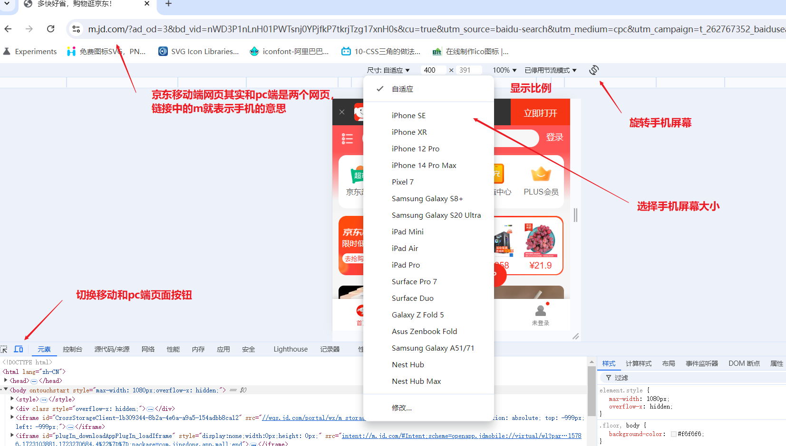
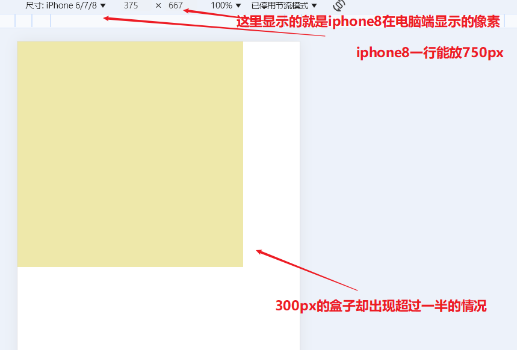
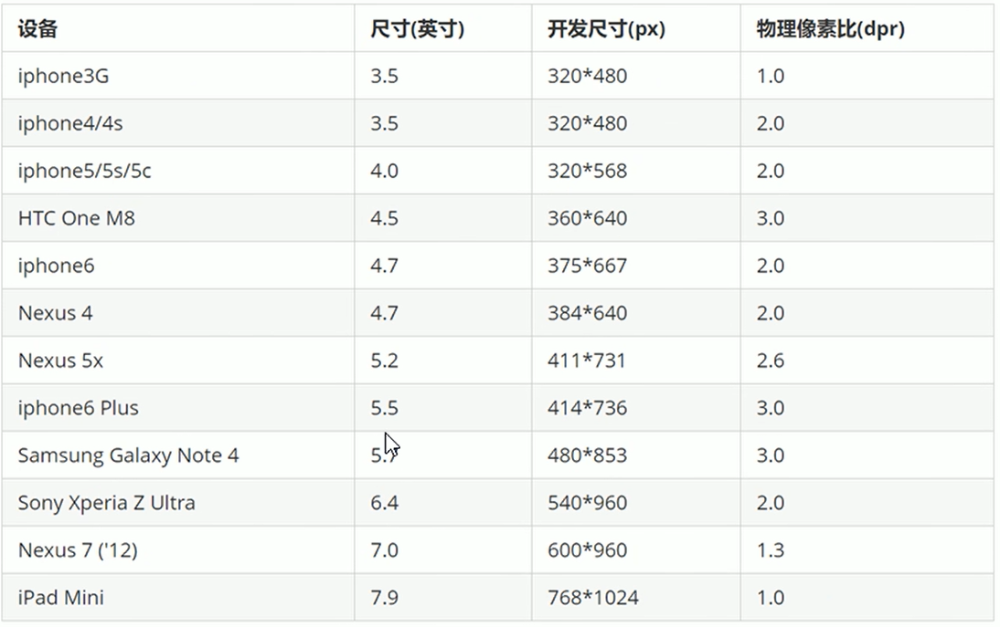
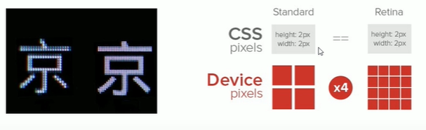
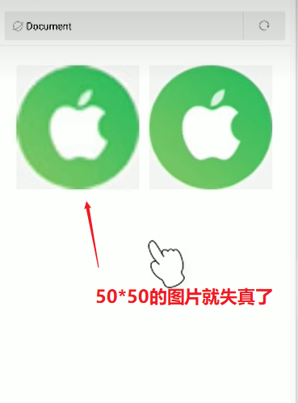
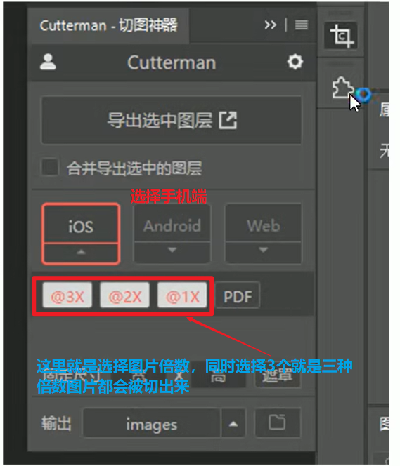
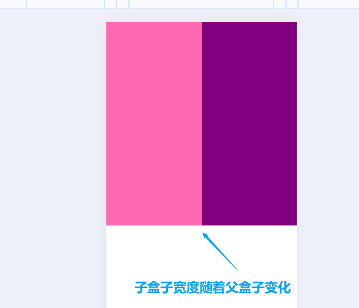
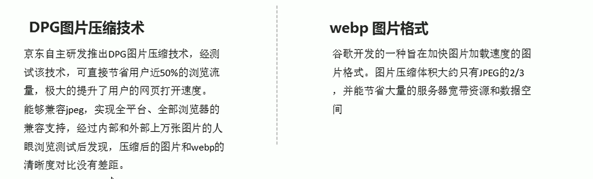

# CSS移动端


## 一、移动端基础

浏览器主要分为**PC端浏览器**和**移动端浏览器**。移动端浏览器有很多，类似qq浏览器、欧朋浏览器等，它们比PC端浏览器要晚出现，因此其版本和兼容性更强。大部分国产浏览器都是根据Webkit内核修改过来的，因此**兼容大部分移动端浏览器，只需要处理==Webkit内核浏览器==即可**。Webkit内核基本支持H5与CSS3,因此可以大量使用css3样式。

移动端设备屏幕尺寸非常多，以iPhone为例这些年其手机与各种平板设备屏幕的分辨率就有640×960、640×1136、750×1334、1242×2208。Android的更多。但**作为移动页面的开发者，无需关注这些分辨率**，因为我们使用的单位是`px`。再结合后面的布局技术，可以很容易实现自动适配屏幕。作为开发者不建议去纠结`dp`、`dpi`、`pt`、`ppi`等单位，只需要使用px后续换算为对应单位即可。

**移动端的调试**，以chrome浏览器，京东的手机页面为例。依然还是进入浏览器按`f12`进入调试。大部分调试**查看网页内容的方式跟之前pc端是一致的**。在移动端上边多了一些按钮，可调节屏幕大小以及旋转屏幕。



## 二、视口 viewport

视口(viewport)就是**浏览器显示页面内容的屏幕区域**。视口分为**布局视口**、**视觉视口**和==**理想视口**==。

**布局视口(layout viewport)**:一般移动设备的浏览器默认设置了一个**布局视口**，用于**解决早期PC端页面在手机上显示的问题**。Android、IOS基本都将这个视口分辨率设置为`980px`,所有PC网页大多数都能在手机上呈现，只不过==**元素会缩小**==,虽然可以手动缩放网页放大元素，但对用户十分不友好。

**视觉视口(visual viewport)**:它是**用户能看到的网站区域**，用户可以通过缩放去操作视觉视口，但不会影响布局视口，布局视口仍保持原有的宽度。类似于**PC上操作浏览器边框调节页面显示大小的操作**。==**网页看不全时通过左右滑动看完内容**==。

**理想视口(ideal viewport)**:理想视口对设备来说是最理想的视口尺寸，可以根据设备调整页面内容让浏览阅读最舒适，**需要手动添加`meta`视口标签通知浏览器操作，其主要目的是让布局视口的宽度与理想视口宽度一致**，也就是==**布局视口和设备宽度**==一样。（乔布斯发明的）

### 2.☆ meta视口标签

```html
<!DOCTYPE html>
<html lang="en">
<head>
    <meta charset="UTF-8">
    <!-- 定义视口 名称为viewport 标准视口写法 -->
    <meta name="viewport" content="width=device-width, user-scalable=no,initial-scale=1.0,maximum-scale=1.0,minimum-scale=1.0">
    <title>Document</title>
</head>

<body>
</body>
</html>
```

|       属性        |                           解释说明                           |
| :---------------: | :----------------------------------------------------------: |
|     **width**     | **宽度设置**，也就是布局视口的宽度，设置`device-width`就是**跟设备宽度一致**，动态调节宽度 |
| **initial-scale** | 初始缩放比，大于0的数字，意思是第一次打开页面时缩放比例，默认是1也就是不缩放 |
| **maximum-scale** |         最大缩放比，大于0的数字，限制缩放比例最大值          |
| **minimum-scale** |         最小缩放比，大于0的数字，限制缩放比例最小值          |
| **user-scalable** |      用户是否可以缩放，yes或者no（1或者0）,默认值是yes       |

## 三、二倍图

在在学习2倍图前，还需要先了解两个概念：**物理像素点**与**物理像素比**。

不管在手机还是电脑，都经常听到分辨率这词，例如一张图为**分辨率**1080×960，它的含义是：横向宽度上1080个像素，纵向高度上有960个像素。但这个像素是**屏幕像素**。

**物理像素**是指**屏幕显示的最小颗粒**(以前老电脑一个像素就是一个显像管)，是物理真实存在的。而它的大小一般**厂商**在出厂时就已经设置好了的。比如iPhone6\7\8的物理像素是`750×1334px`；

在电脑端，一般屏幕像素是等于物理像素的，也就是1px就是1个物理像素点。但移动端确不一样。例如一个300×300px盒子，在pc网页显示就是300×300px，但如果切换到iphone8,会出现放大2倍的情况。



这种情况的出现，就是因为iphone8的物理像素与屏幕像素不是1:1的比例，而是2:1,也就是2个物理像素等于一个屏幕像素。这也就是我们常说的**物理像素比(dpr)**。

浏览器上显示的`375×667px`也就是iphone8的屏幕像素。下表就列出的以前手机的屏幕尺寸与物理像素比。



> ==为什么会出现物理像素跟屏幕像素不一致的情况？==
>
> ****
>
> 因为本身手机屏幕很小，如果我们想要**显示图片更清晰**，就需要把更多的像素放入小屏幕中，这时厂商就采用了一种名叫**Retina**(视网膜屏幕)的显示技术，可以把多个物理像素点压缩到一块屏幕里。借此就出现物理像素比变大的情况。
>
> 

物理像素比不为1，在网页中显示的内容就会出现放大效果，对于网页文字来说放大并不会出现失真的情况，但图片一旦放大就会出现**失真模糊**。为了防止出现失真情况，这时就需要使用**二倍图**或者**多倍图**来解决该情况。

二倍图的策略就是将原本需要的图片先缩小显示为1/2，然后到手机端被放大时只是恢复本身大小，因此不会失真。例如：需要一个50×50px的图片，我们就准备一个100×100px的图片，在开发中先缩小显示图片，等到了手机端会被放大2倍还原不会失真。

==**img的2倍图**==的写法：

```html
<!DOCTYPE html>
<html lang="en">
<head>
    <meta charset="UTF-8">
    <!-- 定义视口 名称为viewport 标准视口写法 -->
    <meta name="viewport"
        content="width=device-width, user-scalable=no,initial-scale=1.0,maximum-scale=1.0,minimum-scale=1.0">
    <title>Document</title>
    <style>
        /* 大图片缩小为50*50显示 */
        img:nth-child(2) {
            width: 50px;
            height: 50px;
        }
    </style>
</head>
<body>
    <!-- 50*50的图片 -->
    
    <!-- 100*100的图片 -->
    
</body>
</html>
```

手机端的效果



多倍图写法与2倍图基本一致，就看你实际需要的图片倍数。如果用高倍图图片太大，会让网页加载很慢。

> 实际开发中，常常会**准备多个图片**，进入网页快速加载就先加载低倍图，等网页加载完毕，再加载高倍图替换低倍图。这就是现在常见的网页刚进入很模糊一会后图片就变清晰的原理。

==**background背景图的2倍图**==的写法为

```html
<!DOCTYPE html>
<html lang="en">
<head>
    <meta charset="UTF-8">
    <meta name="viewport"
        content="width=device-width, user-scalable=no,initial-scale=1.0,maximum-scale=1.0,minimum-scale=1.0">
    <title>Document</title>
    <style>
        div {
            width: 50px;
            height: 50px;
            border: 1px solid red;
            background: url(images/apple100.jpg) no-repeat;
            /* 核心就是这里背景图的缩放为50*50px */
            background-size: 50px 50px;
        }
    </style>
</head>
<body>
    <div></div>
</body>
</html>
```

==**精灵图的2倍图**==，它缩放的是整体的精灵图，因此不仅需要缩放精灵图本身大小，还需要将**精灵的位置距离也等比缩放**。例如：原本精灵图中图的位置是500*500px,它其中一个精灵的位置为-50px，-100px,则它的2倍精灵图写法如下

```html
<!DOCTYPE html>
<html lang="en">
<head>
    <meta charset="UTF-8">
    <meta name="viewport"
        content="width=device-width, user-scalable=no,initial-scale=1.0,maximum-scale=1.0,minimum-scale=1.0">
    <title>Document</title>
    <style>
        div {
            width: 50px;
            height: 50px;
            border: 1px solid red;
             /* 精灵的位置距离也缩放为-25px -50px */
            background: url(images/sprites.png) no-repeat -25px -50px;
            /* 这里是整体精灵图的缩放为250*250px */
            background-size: 250px 250px;
        }
    </style>
</head>
<body>
    <div></div>
</body>
</html>
```

**快速制作2倍图或者其他多倍图**，ps中的插件cutterman就可以很容易的实现该效果。选择ios端，这样可以直接看到效果。Android端导出的方式不一样。



## 四、移动端开发

移动端开发有两种主流方案：

1. **单独制作移动端页面**(**主流**)，京东、淘宝、苏宁易购手机版
2. **响应式页面**兼容pc端与移动端,[三星手机官网]:https://www.samsung.com.cn/，它的核心原理是**根据屏幕宽度来改变样式**，以适应不同终端。网页制作麻烦，维护成本高而且兼容性很容易出现问题。

**移动端css样式初始化** 推荐使用文档`normalize.css`,该文档的优点有保护了有价值的默认值、修复了浏览器bug、是模块化的、拥有详细的文档介绍，[官网地址]：https://github.com/necolas/normalize.css/,其8.0.1版本如下

```css
/*! normalize.css v8.0.1 | MIT License | github.com/necolas/normalize.css */

/* Document
   ========================================================================== */

/**
 * 1. Correct the line height in all browsers.
 * 2. Prevent adjustments of font size after orientation changes in iOS.
 */

html {
  line-height: 1.15; /* 1 */
  -webkit-text-size-adjust: 100%; /* 2 */
}

/* Sections
   ========================================================================== */

/**
 * Remove the margin in all browsers.
 */
/*这里使用body而不是*号，清除样式更快，只清除了margin是因为body没有内边距border，有什么清除什么是最优秀的写法*/
body {
  margin: 0;
}

/**
 * Render the `main` element consistently in IE.
 */

main {
  display: block;
}

/**
 * Correct the font size and margin on `h1` elements within `section` and
 * `article` contexts in Chrome, Firefox, and Safari.
 */

h1 {
  font-size: 2em;
  margin: 0.67em 0;
}

/* Grouping content
   ========================================================================== */

/**
 * 1. Add the correct box sizing in Firefox.
 * 2. Show the overflow in Edge and IE.
 */

hr {
  box-sizing: content-box; /* 1 */
  height: 0; /* 1 */
  overflow: visible; /* 2 */
}

/**
 * 1. Correct the inheritance and scaling of font size in all browsers.
 * 2. Correct the odd `em` font sizing in all browsers.
 */

pre {
  font-family: monospace, monospace; /* 1 */
  font-size: 1em; /* 2 */
}

/* Text-level semantics
   ========================================================================== */

/**
 * Remove the gray background on active links in IE 10.
 */

a {
  background-color: transparent;
}

/**
 * 1. Remove the bottom border in Chrome 57-
 * 2. Add the correct text decoration in Chrome, Edge, IE, Opera, and Safari.
 */

abbr[title] {
  border-bottom: none; /* 1 */
  text-decoration: underline; /* 2 */
  text-decoration: underline dotted; /* 2 */
}

/**
 * Add the correct font weight in Chrome, Edge, and Safari.
 */

b,
strong {
  font-weight: bolder;
}

/**
 * 1. Correct the inheritance and scaling of font size in all browsers.
 * 2. Correct the odd `em` font sizing in all browsers.
 */

code,
kbd,
samp {
  font-family: monospace, monospace; /* 1 */
  font-size: 1em; /* 2 */
}

/**
 * Add the correct font size in all browsers.
 */

small {
  font-size: 80%;
}

/**
 * Prevent `sub` and `sup` elements from affecting the line height in
 * all browsers.
 */

sub,
sup {
  font-size: 75%;
  line-height: 0;
  position: relative;
  vertical-align: baseline;
}

sub {
  bottom: -0.25em;
}

sup {
  top: -0.5em;
}

/* Embedded content
   ========================================================================== */

/**
 * Remove the border on images inside links in IE 10.
 */

img {
  border-style: none;
}

/* Forms
   ========================================================================== */

/**
 * 1. Change the font styles in all browsers.
 * 2. Remove the margin in Firefox and Safari.
 */

button,
input,
optgroup,
select,
textarea {
  font-family: inherit; /* 1 */
  font-size: 100%; /* 1 */
  line-height: 1.15; /* 1 */
  margin: 0; /* 2 */
}

/**
 * Show the overflow in IE.
 * 1. Show the overflow in Edge.
 */

button,
input { /* 1 */
  overflow: visible;
}

/**
 * Remove the inheritance of text transform in Edge, Firefox, and IE.
 * 1. Remove the inheritance of text transform in Firefox.
 */

button,
select { /* 1 */
  text-transform: none;
}

/**
 * Correct the inability to style clickable types in iOS and Safari.
 */

button,
[type="button"],
[type="reset"],
[type="submit"] {
  -webkit-appearance: button;
}

/**
 * Remove the inner border and padding in Firefox.
 */

button::-moz-focus-inner,
[type="button"]::-moz-focus-inner,
[type="reset"]::-moz-focus-inner,
[type="submit"]::-moz-focus-inner {
  border-style: none;
  padding: 0;
}

/**
 * Restore the focus styles unset by the previous rule.
 */

button:-moz-focusring,
[type="button"]:-moz-focusring,
[type="reset"]:-moz-focusring,
[type="submit"]:-moz-focusring {
  outline: 1px dotted ButtonText;
}

/**
 * Correct the padding in Firefox.
 */

fieldset {
  padding: 0.35em 0.75em 0.625em;
}

/**
 * 1. Correct the text wrapping in Edge and IE.
 * 2. Correct the color inheritance from `fieldset` elements in IE.
 * 3. Remove the padding so developers are not caught out when they zero out
 *    `fieldset` elements in all browsers.
 */

legend {
  box-sizing: border-box; /* 1 */
  color: inherit; /* 2 */
  display: table; /* 1 */
  max-width: 100%; /* 1 */
  padding: 0; /* 3 */
  white-space: normal; /* 1 */
}

/**
 * Add the correct vertical alignment in Chrome, Firefox, and Opera.
 */

progress {
  vertical-align: baseline;
}

/**
 * Remove the default vertical scrollbar in IE 10+.
 */

textarea {
  overflow: auto;
}

/**
 * 1. Add the correct box sizing in IE 10.
 * 2. Remove the padding in IE 10.
 */

[type="checkbox"],
[type="radio"] {
  box-sizing: border-box; /* 1 */
  padding: 0; /* 2 */
}

/**
 * Correct the cursor style of increment and decrement buttons in Chrome.
 */

[type="number"]::-webkit-inner-spin-button,
[type="number"]::-webkit-outer-spin-button {
  height: auto;
}

/**
 * 1. Correct the odd appearance in Chrome and Safari.
 * 2. Correct the outline style in Safari.
 */

[type="search"] {
  -webkit-appearance: textfield; /* 1 */
  outline-offset: -2px; /* 2 */
}

/**
 * Remove the inner padding in Chrome and Safari on macOS.
 */

[type="search"]::-webkit-search-decoration {
  -webkit-appearance: none;
}

/**
 * 1. Correct the inability to style clickable types in iOS and Safari.
 * 2. Change font properties to `inherit` in Safari.
 */

::-webkit-file-upload-button {
  -webkit-appearance: button; /* 1 */
  font: inherit; /* 2 */
}

/* Interactive
   ========================================================================== */

/*
 * Add the correct display in Edge, IE 10+, and Firefox.
 */

details {
  display: block;
}

/*
 * Add the correct display in all browsers.
 */

summary {
  display: list-item;
}

/* Misc
   ========================================================================== */

/**
 * Add the correct display in IE 10+.
 */

template {
  display: none;
}

/**
 * Add the correct display in IE 10.
 */

[hidden] {
  display: none;
}
```

**移动端盒子模型**使用CSS3的盒子模型，也就是`box-sizing:border-box`,因为这样就不需要考虑内边距与外边框对盒子宽度的影响。

**移动端特殊样式**，用于清除默认的移动端样式方便后续我们自定义样式。

```html
<!DOCTYPE html>
<html lang="en">
<head>
    <meta charset="UTF-8">
    <meta name="viewport"
        content="width=device-width, user-scalable=no,initial-scale=1.0,maximum-scale=1.0,minimum-scale=1.0">
    <title>Document</title>
    <style>
        body {
            /* CSS3盒子模型 */
            box-sizing: border-box;
            -webkit-box-sizing: border-box;
        }

        a {
            /* 点击a链接出现的高亮样式，清除高亮样式 设置透明色即可 该样式已经过时 因为是一个非标准的CSS属性。*/
            -webkit-tap-highlight-color: transparent;
        }

        input {
            /* 移动端默认按钮样式清除，ios上必须要加上这个属性才能给按钮输入框自定义样式 */
            -webkit-appearance: none;
        }

        img,
        a {
            /* 禁用长按页面时弹出的菜单 */
            -webkit-touch-callout: none;
        }
    </style>
</head>

<body>
    <a href="#">黑马</a>
    <input type="button" name="" id="" value="按钮">
    
</body>
</html>
```

## 五、移动端页面布局

移动端页面布局与PC端的布局是有区别的，根据移动端的开发方案分为两大类：

1. 单独制作移动端页面的布局有：

   + 流样式布局(百分比布局)
   + **flex弹性布局**(常用)
   + less+rem+媒体查询布局
   + 混合布局，也就是多种布局同时使用

2. 响应式页面的布局有：

   + 媒体查询

   + bootstarp布局

### 5.1 流式布局(百分比布局)

所谓流式布局也称为非固定像素布局。其本质就是==**盒子的宽度不在使用具体像素而是百分比**==，**让盒子宽度根据屏幕宽度来动态收缩**，不受固定像素限制，内容向两侧填充。**高度不用限制**，因为纵向上屏幕高度理论上是无限的。

有时也需要限制，如果让宽度无限拉伸或者缩小会导致布局混乱，比如第一行的显示到第二行了，因此常常会添加宽度限制

+ **max-width**:最大宽度
+ **min-width**:最小宽度
+ **max-height**:最大高度(扩展)
+ **min-height**:最大高度

```html
<!DOCTYPE html>
<html lang="en">
<head>
    <meta charset="UTF-8">
    <meta name="viewport" content="width=device-width, initial-scale=1.0">
    <title>Document</title>
    <style>
        * {
            margin: 0;
            padding: 0;
        }

        section {
            width: 100%;
            /* 宽度最大980px */
            max-width: 980px;
            min-width: 320px;
            margin: 0 auto;
        }

        section div {
            float: left;
            width: 50%;
            height: 400px;
        }

        section div:nth-child(1) {
            background-color: hotpink;
        }

        section div:nth-child(2) {
            background-color: purple;
        }
    </style>
</head>
<body>
    <section>
        <div></div>
        <div></div>
    </section>
</body>
</html>
```

效果



### 5.2 京东移动端模仿案例

案例中使用2种新的图片格式



html文件内容

```html
<!DOCTYPE html>
<html lang="en">
<head>
    <meta charset="UTF-8">
    <!-- 视口设置 -->
    <meta name="viewport"
        content="width=device-width, initial-scale=1.0,user-scalable=no,minimum-scale=1.0,maximum-scale=1.0">
    <title>Document</title>
    <!-- 引入初始化样式 -->
    <link rel="stylesheet" href="css/normalize.css">
    <!-- 引入个人的样式 -->
    <link rel="stylesheet" href="css/index.css">
</head>

<body>
    <!-- 1.头部区域-->
    <header class="app">
        <ul>
            <li>
                
            </li>
            <li>
                
            </li>
            <li>打开京东app，购物更轻松</li>
            <li>立即打开</li>
        </ul>
    </header>
    <!-- 2. 搜索区域 -->
    <div class="search-wrap">
        <div class="search-btn"></div>
        <div class="search">
            <div class="jd-icon"></div>
            <!-- 精灵2倍图 -->
            <div class="sou"></div>
            <input type="search" placeholder="好奇×蔡康永新书《博学》免费送dadasdsadaf">
        </div>
        <div class="search-login">登录</div>
    </div>

    <!-- 3.主体内容 -->
    <div class="main-content">
        <!-- 滑动图 -->
        <div class="slider">
            <!-- dpg格式图片是京东做的一种压缩图片的格式，就是为了不损失图片内容变小图片 -->
            
        </div>
        <!-- 特殊组合图片 由多张图片组合为一张图片展示-->
        <div class="brand">
            <div>
                <a href="#"></a>
            </div>
            <div>
                <a href="#"></a>
            </div>
            <div>
                <a href="#"></a>
            </div>
        </div>
        <!-- 导航栏 移动端不需要太复杂 因此没用ul li包含-->
        <nav>
            <a href="#">
                
                <span>京东超市</span>
            </a>
            <a href="#">
                
                <span>京东超市</span>
            </a>
            <a href="#">
                
                <span>京东超市</span>
            </a>
            <a href="#">
                
                <span>京东超市</span>
            </a>
            <a href="#">
                
                <span>京东超市</span>
            </a>
            <a href="#">
                
                <span>京东超市</span>
            </a>
            <a href="#">
                
                <span>京东超市</span>
            </a>
            <a href="#">
                
                <span>京东超市</span>
            </a>
            <a href="#">
                
                <span>京东超市</span>
            </a>
            <a href="#">
                
                <span>京东超市</span>
            </a>
        </nav>
        <!-- 新闻快报 -->
        <div class="news">
            <a href="#">
                
            </a>
            <a href="#">
                
            </a>
            <a href="#">
                
            </a>
        </div>
    </div>
</body>
</html>
```

css文件内容

```css
/* 1.公共统一的样式写在body，body里子盒子就直接继承该样式 */
body {
    width: 100%;
    min-width: 320px;
    max-width: 1080px;
    margin: 0 auto;
    font-family: -apple-system, Helvetica, sans-serif;
    font-size: 14px;
    color: #666;
    /* 行高为字体14*1.5=21px */
    line-height: 1.5;
    /* 测试用 */
    /* background-color: #ccc;
    height: 3000px; */
}

/* 特殊样式 */
* {
    -webkit-tap-highlight-color: transparent;
}

input {
    -webkit-appearance: none;
}

img,
a {
    -webkit-touch-callout: none;
}

/* 清除所有ul与li的样式 */
ul {
    margin: 0;
    padding: 0;
    list-style: none;
}

a {
    /* 整体修改a标签样式 */
    color: #666;
    text-decoration: none;
}

img {
    /* 去除图片底部空白缝隙 */
    vertical-align: top;
}

/* 1.头部header样式 */
.app {
    height: 45px;
}

.app ul li {
    float: left;
    height: 45px;
    background-color: #333333;
    text-align: center;
    line-height: 45px;
    color: #fff;
}

.app ul li:nth-child(1) {
    width: 8%;
}

.app ul li:nth-child(1) img {
    /* 只设置图片宽度，这样它的高度就会随宽度等比缩放 */
    vertical-align: middle;
    width: 10px;
}

.app ul li:nth-child(2) {
    width: 10%;
}

.app ul li:nth-child(2) img {
    width: 30px;
    /* 行内块元素图片要与文字垂直居中对齐 */
    vertical-align: middle;
}

.app ul li:nth-child(3) {
    width: 57%;
}

.app ul li:nth-child(4) {
    width: 25%;
    background-color: #f63115;
}

/* 2. 搜索样式 */
.search-wrap {
    /* 使用固定定位 固定定位盒子要给宽度 因此要设置最大最小宽度 */
    position: fixed;
    overflow: hidden;
    width: 100%;
    height: 44px;
    min-width: 320px;
    max-width: 1080px;
}

.search-btn {
    position: absolute;
    top: 0;
    left: 0;
    width: 40px;
    height: 44px;
}

.search-btn::before {
    content: "";
    display: block;
    width: 20px;
    height: 18px;
    background: url(../images/s-btn.png) no-repeat;
    /* 缩放图片 */
    background-size: 20px 18px;
    margin: 14px 0 0 15px;
}

.search-login {
    position: absolute;
    top: 0;
    right: 0;
    width: 40px;
    height: 44px;
    color: #fff;
    text-align: center;
    line-height: 44px;
}

.search {
    position: relative;
    /* 不给宽度，让搜索栏随父盒子大小变化而变化 */
    height: 30px;
    background-color: #fff;
    border-radius: 15px;
    /* 上边距有塌陷问题，使用overflow解决 */
    margin: 7px 50px 0;
}

.jd-icon {
    width: 20px;
    height: 15px;
    position: absolute;
    top: 8px;
    left: 13px;
    background: url(../images/jd.png) no-repeat;
    background-size: 20px 15px;
}

/* 竖线制作 */
.jd-icon::after {
    position: absolute;
    top: 0px;
    right: -8px;
    content: "";
    display: block;
    width: 1px;
    height: 15px;
    background-color: #ccc;
}

.sou {
    position: absolute;
    top: 8px;
    left: 50px;
    width: 18px;
    height: 15px;
    /* 精灵位置也变为原来的一半 */
    background: url(../images/jd-sprites.png) no-repeat -81px 0px;
    /* 精灵图2倍缩放,只需要宽度变为原来的一半，这样高度就等比缩放 这里不能用50%,因为这表示背景图盒子的一半，这里盒子远比精灵图小 */
    background-size: 200px auto;
}

/* 搜索内容 */
.search input {
    position: absolute;
    top: 5px;
    left: 77px;
    width: calc(100% - 90px);
    /* 清除外边框 */
    border: 0;
    /* 清除表单轮廓 */
    outline: none;
    font-size: 14px;
    white-space: nowrap;
    overflow: hidden;
    text-overflow: ellipsis;
}

/* 3. 主体内容 */
.slider img {
    width: 100%;
}

.brand {
    /* 圆角隐藏图片多余的内容 */
    overflow: hidden;
    border-radius: 10px 10px 0 0;
}

.brand div {
    float: left;
    width: 33.33%;
}

.brand div img {
    width: 100%;
}

/* nav导航栏 */
nav {
    /* 为了清除浮动，让下面的内容可以设置边距 */
    overflow: hidden;
    padding-top: 5px;
}

nav a {
    float: left;
    width: 20%;
    text-align: center;
}

nav a img {
    width: 40px;
    margin: 10px 0;
}

/* span行内元素转化为块级元素 */
nav a span {
    display: block;
}

/* 新闻快报 */
.news {
    /* 需要清除浮动才有效 */
    margin-top: 20px;
}

.news a {
    float: left;
    box-sizing: border-box;
}

.news a:nth-child(1) {
    width: 50%;
}

.news a:nth-child(n+2) {
    width: 25%;
    border-left: 1px solid #ccc;
}

.news img {
    width: 100%;
}
```

运行效果先模拟不同手机测试，最后真机测试效果，没问题就说明开发成功了


### 5.3 flex布局

