# Git基础入门

[TOC]


## 一、Git是什么？

git是一款分布式版本控制的软件。git作用跟svn一样，都是用于版本控制，俩者不同之处在于svn是**集中式**的，git是**分布式**的。

所谓**版本控制**，专业说法是一种记录一个或若干文件内容变化，以便将来查阅特定版本修订情况的系统。 例如，编写文档或者系统，会有初稿，中稿，完整稿，最终稿等不同的版本，保存所有版本内容就是版本控制。

版本控制系统也是经历了许多版本，其历史如下：

1. **本地版本控制系统**，本质就是复制整个项目目录，取不同名字来表示对应版本。唯一的好处就是简单，但是特别容易犯错。 有时候会混淆所在的工作目录，一不小心会写错文件或者覆盖意想外的文件。为了防止该问题，之后有人开发了许多种本地版本控制系统，大多都是采用某种简单的数据库来记录文件的历次更新差异，其中最流行就是 **RCS**。

   >[RCS](https://www.gnu.org/software/rcs/) 的工作原理是在硬盘上保存补丁集（补丁是指文件修订前后的变化），通过应用所有的补丁，可以重新计算出各个版本的文件内容。

   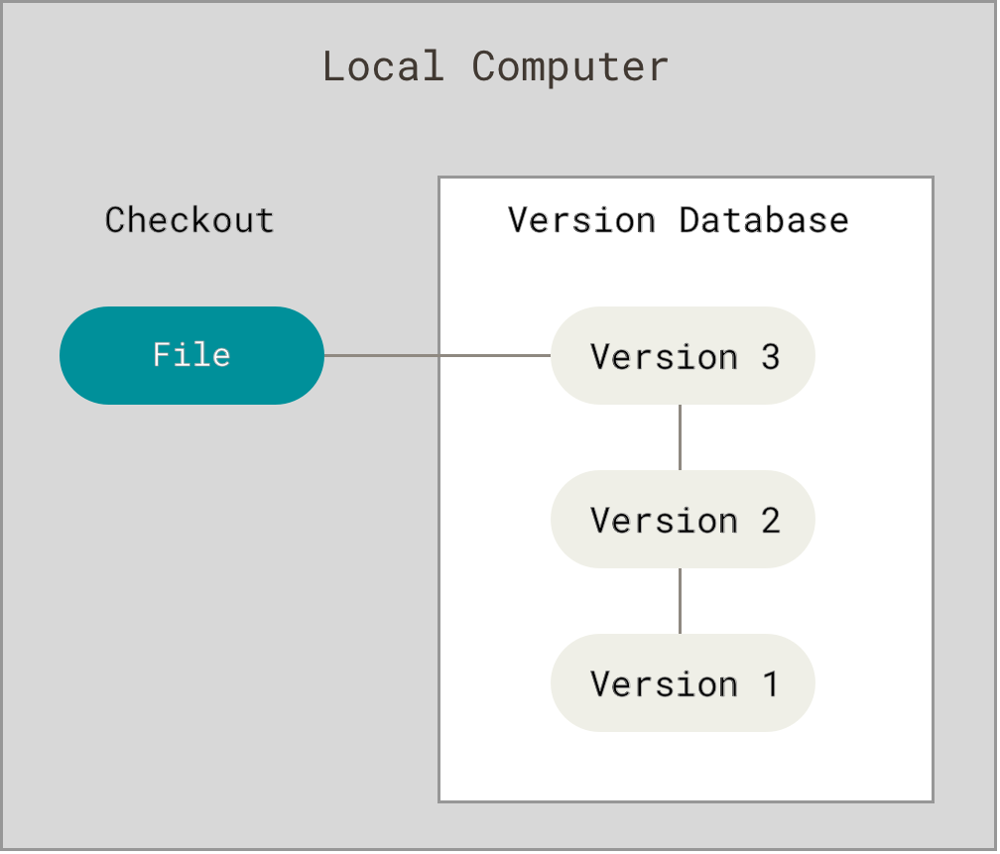

2. **集中式版本控制系统（Centralized Version Control Systems，简称 CVCS）**。 这类系统都有一个**单一的集中管理的服务器***，保存所有文件的修订版本，而协同工作的人们都通过客户端连到这台服务器，取出最新的文件或者提交更新。其最出名的软件就是**Subversion** 简称svn。该系统最大的问题就是断网，与服务中心断开连接就无法更新版本。或者服务中心数据丢失就将丢失所有历史版本。

   

3. **分布式版本控制系统（Distributed Version Control System，简称 DVCS）**。 客户端并不只提取最新版本的文件快照， 而是把代码仓库完整地镜像下来，包括完整的历史记录。 这么一来，任何一处协同工作用的服务器发生故障，事后都可以用任何一个镜像出来的本地仓库恢复。 因为每一次的**克隆**操作，实际上都是一次对代码仓库的完整备份。这类系统中，最著名的就是 Git。

   

> 总结: git就是每个客户端都有全部版本的控制软件，通过与服务器或者其他客户端同步保证所有端都有所有版本记录

## 二、Git安装步骤

windows端安装在官方下载网页https://git-scm.com/downloads/win，下载最新客户端安装包，下载完进行安装不停下一步就可完成。

 Linux端 安裝你可以使用 yum：

```console
$ sudo yum install git-all
```

如果你是使用 Debian 系列的發行版，如 Ubuntu，你可以使用 apt-get：

```console
$ sudo apt-get install git-all
```

 Mac 端安裝在 Mac 中安裝 Git 有很多種方法。 一是下载安装包安装，下载网址https://github.com/apps/desktop

二是使用指令

```console
$ sudo port install git
```

git安装完成后，windows端鼠标右键就可打开**git bash**客户端，输入指令`git version`就是查看git版本，查看成功就表示安装成功。


**git的开发者是Linux创始人之一**，因此git bash端口中可以直接使用**linux**相关指令。

+ `ls`：查看当前目录下的文件与文件夹

+ `ls -al`:查看当前目录中全部的文件信息,包括隐藏文件

+ `pwd`：查看路径

+ `cd`:进入下一目录；`cd ..`：进入上一目录；`cd -`表示重回上一次目录，-表示返回上一步

+ `touch`:创建文件

+ `mkdir`:创建文件夹

+ `vim`或`vi`:编辑文件内容

+ `echo 文字内容 > 文件名`:表示替换文件中全部内容为文字内容

+ `clear`:清空页面

+ `rm`:删除文件，`rm -f`表示强制删除文件，`rm -rf`表示强制循环删除文件夹中的全部内容，慎用。

+ `exit`:退出命令行

  > 快捷键:1.当文件名很长时,输入部分内容，然后按`tab`键自动补全其余内容
  >
  > ​      2.当命令输错时，使用`Ctrl+C`直接取消命令重新编写

## 三、Git基础

### 3.1 Git原理与三大区域

理解管理文件的三大区域前，先了解**Git文件存储原理**，与svn对比理解：

+ svn管理的是**文件变化内容**，就是记录增量，只对文件发生变化的内容进行保存，也就是每个文件都有一个版本
+ git管理的是**全部文件快照**，是用指针指向包含全部文件的一个版本，当出现变化的内容，就会保存变化的文件与未修改的文件为一个版本，指针指向新的版本。

Git保存文件的三大区域：

+ **工作区**，该区域又分为两个部分，一部分是透明色**已管理(commit)的文件**，另一部分就是红色**新文件或已修改的文件**。

  > **修改了已管理文件的内容，它会自动变为红色文件，该过程是git自动检测执行的。**

+ **暂存区**，该区域是绿色**暂存区文件**，是使用**add指令**添加了新文件或已修改的文件。

+ **版本库**，该区域是透明色**版本库文件或已管理文件**，是使用**commit指令**提交暂存区文件，生成版本的文件。

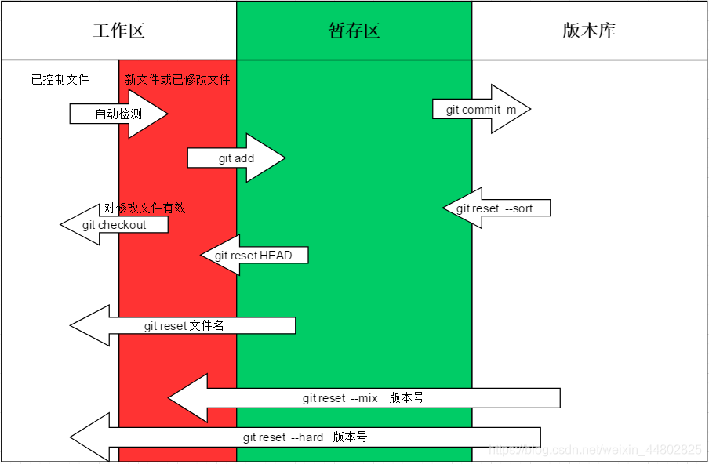

回滚指令:

+ 版本回滚

  ```console
  git reset --hard 版本号
  ```

+ 版本库回滚到暂存区

  ```console
  git reset --soft 版本号
  ```

+ 暂存区回滚到工作区未管理文件

  ```console
  git reset HEAD 文件名  //常用
  git rm --cached 文件名 //跟上边指令区别是，它是删除缓存区文件，因此恢复的文件状态时新文件，上边的是修改文件，不常用
  ```

+ 未管理文件回滚到已管理文件，不常用，因为未管理的文件回退后不可恢复。

  ```console
  git checkout -- 文件名
  ```

+ 版本库回滚到工作区未管理文件

  ```console
  git reset --mix 版本号
  ```

  mix就相当于soft+HEAD指令的效果，hard就相当于soft+HEAD+checkout的效果。最常用的依然是hard指令。

### 3.2 Git基本指令

#### 3.2.1 git简单控制流程

git做版本控制本质上就是让git管理一个文件夹。其初始化步骤为：

1. 先创建要管理的文件夹与文件，

2. 进入管理的文件夹根目录中打开**git bush**，

3. 使用指令初始化（又称提名）git，该过程会生成**.git**隐藏文件夹，该目录中就是git的核心文件

   ```console
   git init
   ```

   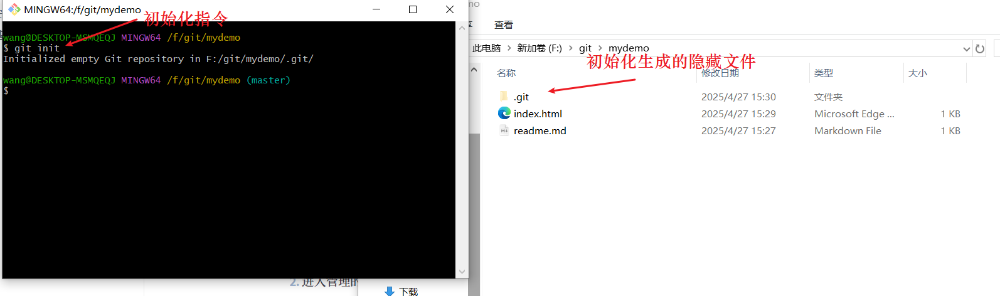

4. 使用git相关指令管理文件，并生成对应版本,其简单流程如下：

   ```console
   1. git status  //查看文件状态
   2. git add 文件名   //表示添加单个文件
      或者 
      git add .      //表示将全部未添加的文件都添加
   3. git commit -m '版本名称' //版本生成，也可不加后面的-m,这样就要单独写信息
   ```
   
   > commit提交的id是一个摘要值，这个摘要值实际上是使用**sha1**计算出来的
   
   ```console
   git commit -am '信息' //是add与commit的简写，但这个只针对修改文件有效，新文件无效。
   ```
   
   commit的id作用就是下一个版本有id值可以指向该版本，一个版本就是一个快照其中parent值就是上一个版本的id。
   
   commit提交时，git会创建一个commit对象，并将commit对象的parent指针设置为HEAD所指向的引用的SHA-1值。
   
   

#### 3.2.2 git config

第一次commit生成版本可能会出现错误，因为没有配置用户名与邮箱的信息，使用下面的指令进行配置**用户名**与**邮箱**

```console
git config --global user.email "you@example.com"  //配置邮箱
git config --global user.name "Your Name" //配置用户名 
```

该配置内容是写入C盘中的**.gitconfig**配置文件中的，后续该文件还可以配置其他内容

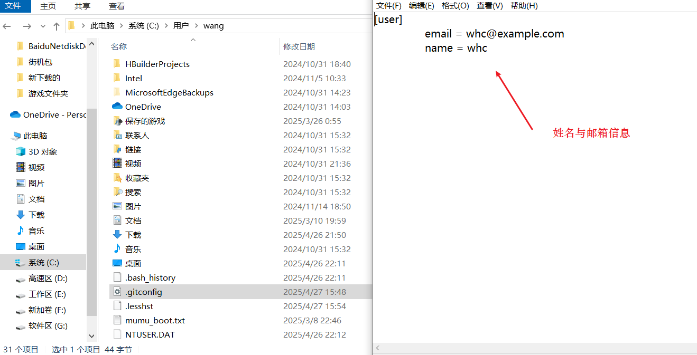

`git config`指令是**操作git配置文件的命令**。git的有三大配置文件：

+ **--local**,表示本地配置文件，修改.git文件夹中的config文件
+ **--global**,表示全局配置文件，修改C:\Users\wang目录下的.gitconfig文件
+ **--system**,表示系统配置文件，/etc/.gitconfig,需要root权限才能查看

最常用是**--local**，它的优先级最高，会覆盖下面两个配置文件，但它只作用于当前项目，其他项目无效。**编写git config指令时如果不指定配置文件,也就是不写--global内容，默认就会是--local**。

git config相关指令：

+ 查看所有关于git config指令

  ```console
  git config --help   //跳转到git config页面
  ```

+ 配置文件查询

  ```console
  git config --list //查看配置文件列表
  git config user.name //单独查看配置文件 user.name的信息
  ```

+ 修改配置文件信息

  ```console
  git config --local user.name '新名字'  //这里是修改本地文件中的user.name
  ```

+ 删除配置文件信息

  ```console
  git config --local --unset user.name
  ```

+ 直接修改配置文件,不推荐新手用

  ```console
  git config -e //-e是edit的简写，这里没指定配置文件，默认就是--local文件
  ```
  
+ 配置git命令别名，其效果就是用更短的命令代替原本的命令

  ```console
  git config --local alias.br branch  //git br==git branch
  git config --local alias.unstage 'reset HEAD'  //git unstage=git reset HEAD
  ```

+ 配置外部命令别名,这样需要使用`！`，否则无法识别外部命令

  ```console
  git config --local alias.ui '!gitk' //git ui =gitk，没有！git ui=git gitk命令是错误的
  ```

#### 3.2.3 git查询指令

+ 查看文件状态

  ```console
  git status 
  git status -s \\简略文件状态信息
  ```
  
  文件状态红色表示文件未添加，绿色表示文件未添加，没有文件表示文件已经提交
  
  
  
  简略信息中，新文件是问号，添加文件是A,修改后的文件是M。
  
  ```console
  git status -s 文件名 //单独查看某个文件的状态
  ```
  
+ **查看版本日志**

  ```console
  git log  //查看所有提交日志
  ```

  
  
  查看日志还可配合参数展示不同的日志
  
  ```console
  git log -数字  //查看最近几条日志
  git log --oneline 文件名 //单行信息内容 简略化展示
  git log --graph  // 图像化log内容
  //pretty表示指定格式展示内容
  git log --pretty=oneline //单行显示内容
  git log --graph --pretty=fromat:"%h %s"
  git log --graph --pretty=fromat:"%h - %an,%ar : %s" //图像化log内容并简略信息
  git log --graph --abbrev-commit  //简写信息
  ```
  
  **查看单个文件日志**
  
  ```console
  git log 文件名
  ```
  
  
  
+ 查看提交信息

  ```console
  git show //默认查看最新的版本提交内容
  git show 版本号 //查看对应版本提交的内容
  ```
  
  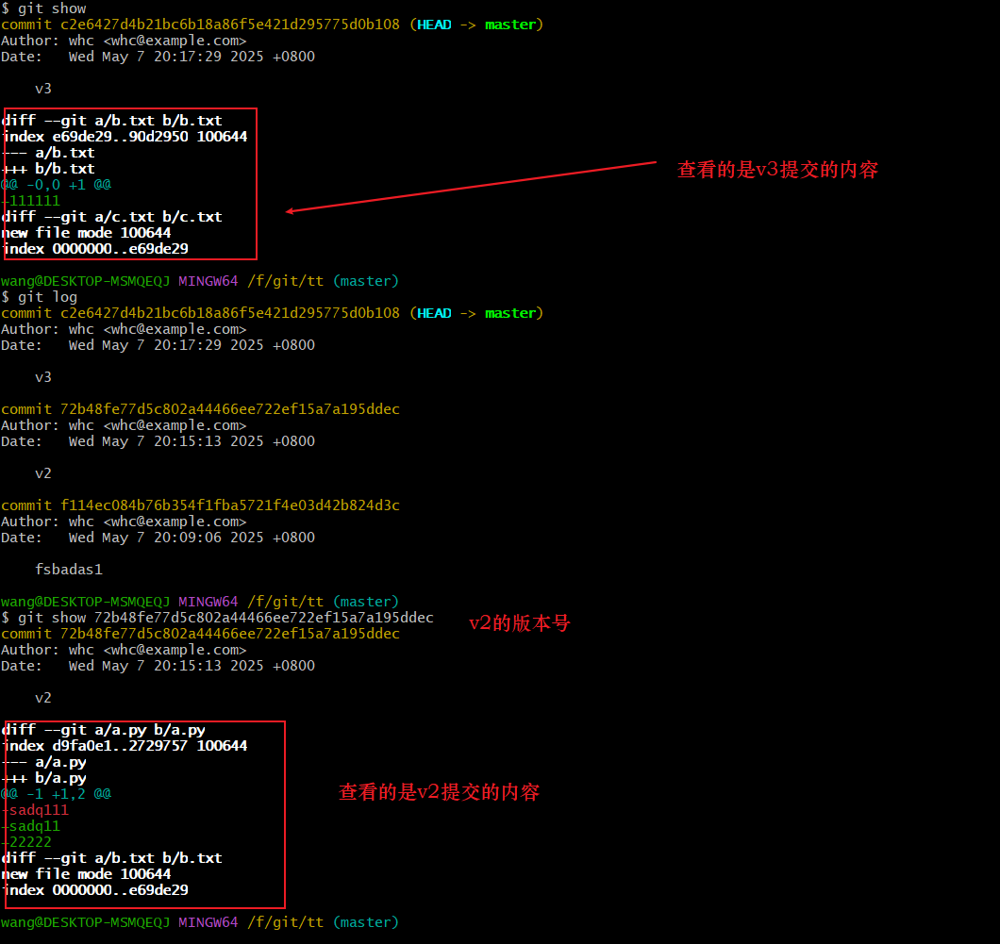

+ 查看帮助,可查询git的全部指令

  ```console
  git --help
  ```

  

#### 3.2.4 git文件操作（*）

+ **添加文件**(文件工作区放入暂存区)

  ```console
  git add 文件名1 文件名2 ... //同时添加多个文件
  ```

+ 撤销（回滚）添加的文件(暂存区放回工作区)

  ```console
  git reset HEAD 文件名
  ```

  当一个文件add后，该文件就进入git的暂存区，如果这时直接删除文件，再创建**同名文件**，则会出现两种情况：

  1. 新建的文件与删除文件内容相同，则文件直接就是add后的文件；

  2. 新建的文件与删除文件内容不同，则会出现文件有两个状态，即使add的文件又是修改的文件，如下图：

     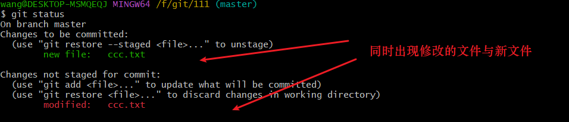

     使用add就会将两个信息合并，但这种操作始终是两步比较麻烦，这时可使用一个命令代替`git rm -f` 强制删除就不会保留记录。

+ **删除文件**(与git add恰恰相反)

  ```console
  git rm 文件名  
  ```

  `git rm`删除文件不仅删除文件，并且会删除该文件放入暂存区,并且该文件会进入一个**d状态**。

  不使用**git rm**删除的文件，而是使用rm直接删除的文件，文件会在工作区，并且该文件进入一个**红色d状态**。
  
  > git rm指令相当于普通的rm加上git add指令
  
  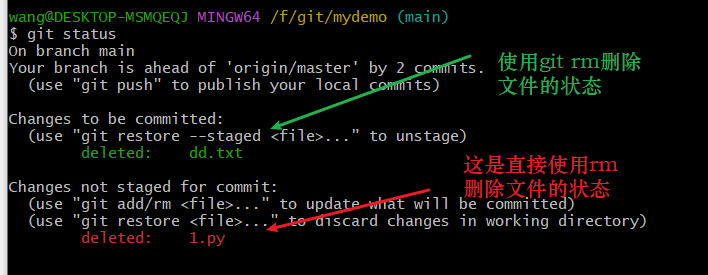
  
+ 撤销（回滚）删除文件(文件状态是已提交)

  ```console
git reset HEAD 文件名  //删除文件放入工作区
  git checkout -- 文件名 //撤销删除
  ```
  
  如果是使用rm直接删除文件，撤销就只需要一步`git checkout -- 文件名`。

+ **移动文件或重命名文件**

  如果直接移动，则该文件git信息会被保留，之后再创建同名文件会出现删除同样的问题。重命名也是一样，修改了文件名称，后续再出现同名内容，也会出现一样的问题。因此要使用git指令移动或重命名

  ```console
  git mv aaa.txt ddd/     //将aaa文件移动到ddd文件夹中
  git mv bbb.txt eee.txt  //将bbb文件修改为eee文件 
  ```

  git mv会让文件进入一个重命名的状态

  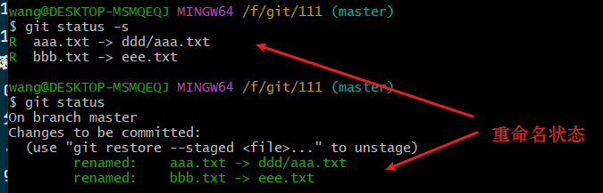

  > git mv其实都相当于普通的mv加上git add指令

+ 撤销重命名文件(git mv的文件)

  ```console
  git reset HEAD 原文件名 新文件名 //如果是mv重命名的文件，不需要该指令直接使用下面两个命令即可
  git checkout -- 原文件名
  rm 新文件名
  ```

+ **恢复或撤销文件更改的命令**。这个命令可以帮助开发者在多种情况下管理文件的状态，例如还原文件到最新提交的状态、丢弃未暂存的更改、丢弃已暂存但未提交的更改等。最常用的就是还原文件的修改内容。

  ```console
  git restore 文件名  //还原文件修改内容
  ```

+ **对比文件修改内容**，可结合git restore恢复文件内容。

  ```console
  git diff 文件名
  ```

  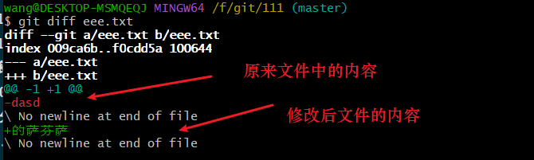

+ 查看文件日志内容

  ```console 
  git log 文件名
  ```
  
+ 查询文件提交修改记录，该命令会列举出该文件现有内容的来自哪个版本，提交人名是什么，方便我们查询提交记录

  ```console
  git blame 文件名
  ```

  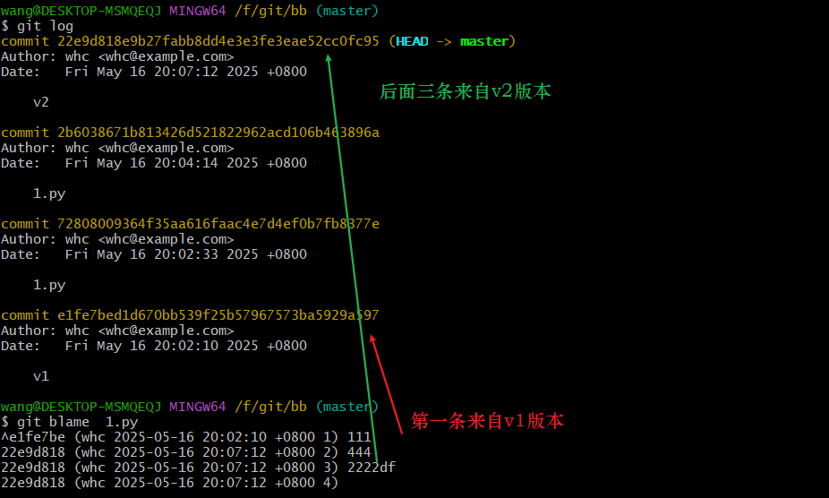

#### 3.2.5 git版本回滚

+ **回滚**，当开发了很多版本，要回到以前的版本的文件内容，就需要使用回滚

  ```console
  git reset --hard HEAD^  //回退上一个版本 ^表示上一个 ^^就表示上两个
  git reset --hard HEAD~1 //回退1个版本，数字为2就表示两个版本
  git reset --hard 版本号(可通过git log查询出来，不一定全部版本号，只要部分即可)
  ```

  版本2中index文件的内容
  
  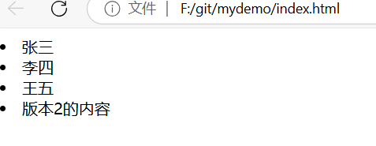
  
  回滚到版本1中index文件的内容
  
  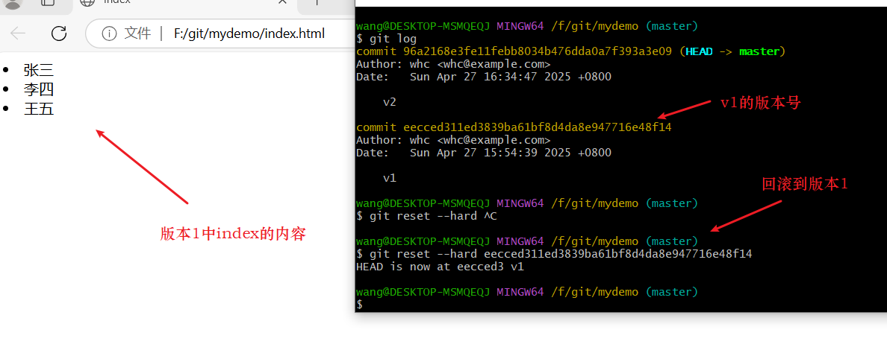
  
  回滚之后，`git log`指令只能查到v1的版本不能再查到v2的版本，如果需要**回滚到回滚前的版本**，就需要查询指令
  
+ 查看回滚前的版本信息

  ```console
  git reflog  //reflog记录的HEAD指针，对于HEAD的任何修改动作都会被记录，包括切换分支，pull，commit等
  ```

  
  
  **除了版本库回滚外，也有单步回滚，讲解git三大区域时会详细说明。**

#### 3.2.6 git tag

commit提交的版本，会发现版本号是不规则的数字，这样是不方便管理的，可使用Tag给版本添加标签。**本质tag就是版本的别名**。tag不受分支影响，它的创建是全局的。

+ s给当前版本添加标签tag

  ```console
  git tag 标签名 //给当前版本取别名
  ```

+ 给特定的版本添加标签tag(轻量级标签，标签内容就是对应的版本id)

  ```console
  git tag 版本名 版本号
  ```

+ 给特定版本添加tag与附注信息(对象标签，标签不仅有自身的对象id,也保存了对应版本的id)

  ```console
  git tag -a 标签名 版本号 -m '附注信息'
  -a 理解为annotated表示附注标签，它和-m配合使用
  -m 指附注信息，一般填写创建版本人名称、时间以及版本更新内容
  ```

  

+ 查看已有的标签tag

  ```console
  git tag
  ```

  有了tag后，可直接git show使用tag版本名。

  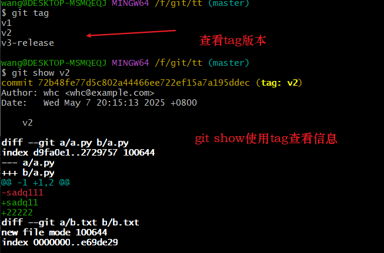

+ 筛选标签tag

  ```console
  git tag -l 对应的标签名，可使用星号
  -l 是--list的简写，表示列表
  ```

  

+ 删除标签tag

  ```console
  git tag -d 标签名
  -d 是--delete的简写，表示删除
  ```

+ 远程推送

  ```console
  git push origin 标签名  //表示推送tag标签的版本
  git push origin --tags  //表示将远程仓库没有的tag都推送上去
  ```

  远程仓库有了tag就可直接下载对应版本，也可利用tag创建release版本用于下载。git pull也会自动拉取标签。
  
+ 删除远程标签

  ```console
  git push origin :refs/tags/标签名  //推送空标签删除
  git push origin --delete tag 标签名 //删除标签，推荐使用
  ```

+ 完整推送标签

  ```console
  git push origin refs/tags/本地标签名：refs/tags/远程标签名
  ```

+ 特定拉取标签,git pull是拉取全部内容

  ```console
  git fetch origin tag 标签名
  ```

#### 3.2.7 git diff

`diff`在linux系统中也用于比较两个文件的信息。了解linux本身的diff才容易理解git diff。

+ 直接比较两个文件内容(不常用，展示信息不明确)

  ```console
  diff 文件名1 文件名2
  ```

+ 比较两个文件内容，展示详细信息

  ```console
  diff -u 文件名1 文件名2
  ```

  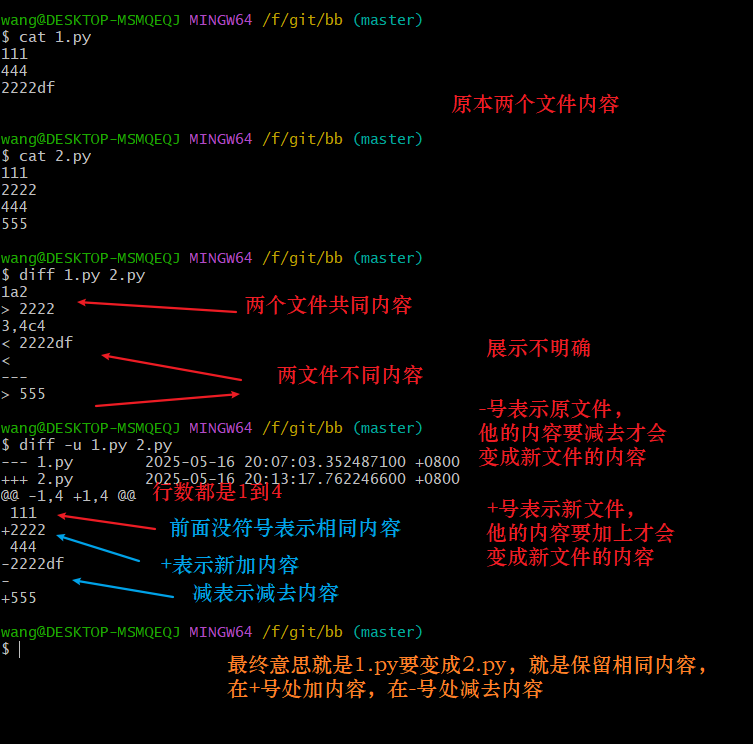

git diff有三种对比：

+ 暂存区比较工作区(要两个区域都有同名文件时才会生效)

  ```console
  git diff  //相当于diff -u 暂存区文件 工作区文件
  ```

  

+ 版本库比较工作区

  ```console
  git diff HEAD（版本号）  //相当于diff -u 版本库文件 工作区
  ```

+ 版本区比较暂存区

  ```console
  git diff --cached
  ```

  进阶理解,上一个相当于下面的简写

  ```
  git diff HEAD^ --cached
  ```

> **总结**：工作区的内容是最新的，因此始终是被暂存区或版本库内容对比。
>
> ​     暂存区与版本库相比，暂存区是最新的内容，因此始终是版本库比较暂存区。
>
> ​     版本库可以使用版本号选择任意版本，也可使用head寻找。

#### 3.2.7 日志信息修改

git commit是必须要有日志信息的，如果日志写错，git中是可以修改的。

```console
 git commit --amend -m '新的信息' 
```

这是只修改上一次提交的版本日志，如果该日志已经push到远程仓库，就不要再修改日志信息。

#### 3.2.8 换行符警告

当你在Git中看到 **“warning: LF will be replaced by CRLF the next time Git touches it”** 的警告时，这意味着你的文件使用了LF（换行符），而Git将在下次处理该文件时将其转换为CRLF（回车换行符），这是因为**Windows系统**使用CRLF作为换行符。
要解决这个问题，你可以采取以下几种方法：

1. 忽略警告：如果这个警告不会影响你的工作，可以选择忽略它;
2. 禁用自动转换：可以通过设置 `git config --local core.autocrlf false`来禁用Git自动将LF转换为CRLF的功能;
3. 使用**.gitattributes**文件：在项目根目录下创建一个`.gitattributes` 文件，明确指定文件的换行符处理方式。

#### 3.2.9 git merge原理

Git在自动合并时会使用**递归三路合并算法**对不同文件进行差异分析，该算法是：

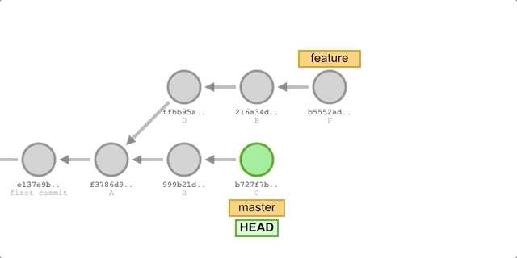

Git首先找到两个分支最近的**唯一共同祖先**提交A，然后分别对A、C、F提交的文件快照进行对比，我们下文称呼它们为A、C、F文件。接下来Git将逐行对三个文件的内容进行比较，如果三个文件中有两个文件该行的内容一致，则丢弃A文件中该行的内容，保留与A文件中不同的内容放到结果文件中。具体来说有几种情况：（A是父版本，C、F是子版本）

+ 假如A、C内容一致，说明这是在F中更改的内容，需要保留该更改；
+ A、F内容一致同理；
+ 假如C、F内容一致，说明C和F都相对于A做了同样的更改，同样需要保留。除此之外的内容差异仅剩两种情况：如果A、C、F的内容都一致，说明什么都没有发生；如果该行在A、C、F的内容都不一致，说明发生了冲突，需要我们手动合并选择需要保留的内容。

结束对比后Git会以最终的结果文件快照创建一个新的Merge提交并指向它。

三路合并算法的基础是找到被合并文件的共同祖先，在一些简单的场景中这还能行的通，但在遇到[十字交叉合并（criss-cross merge）]时，不存在唯一的最近共同祖先，如下图：

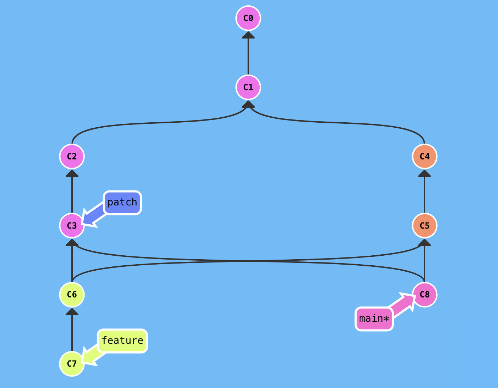

现在我们需要从`main`分支合并feature`分支，即把C7合并到C8，会发现C8和C7有两个共同祖先，这下怎么办呢？Git采取的是递归三路合并（Recursive three-way merge），会先合并C3和C5这两个共同祖先创建一个虚拟的唯一最近祖先（假设为 C9），接着在C9、C7、C8之间执行三路合并，如果在合并 C3 和 C5 的过程中又发生没有唯一共同祖先的情况，则递归执行上述过程。

#### 3.2.10 git gc文件压缩

`git gc`其实就是git的垃圾收集指令，它主要工作就是压缩git目录、git文件或对象，减小体积。实际开发很少直接使用，git gc默认git后台会自动进行。

.git目录中的**refs**工作目录，里面存放的是各种分支、tag信息。

**objects**目录里面存放的就是各个版本，其中文件夹名是版本前两个字符


压缩目录，等会gc命令就会产生文件在该目录

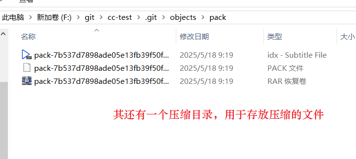

logs目录存放的是日志信息，其中HEAD存放的是全部日志，refs文件夹中存放的是本地各个分支的日志与远程各个分支的日志。

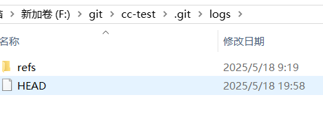

其它文件的内容

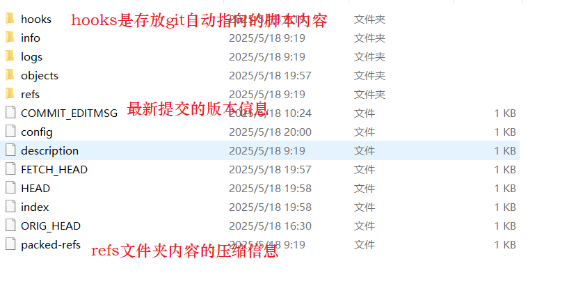

执行`git gc`指令后效果：

1. refs文件夹的内容大部分被压缩到packed-refs文件中，info文件夹中会多出一个**refs文件**，也是记录refs文件信息。

   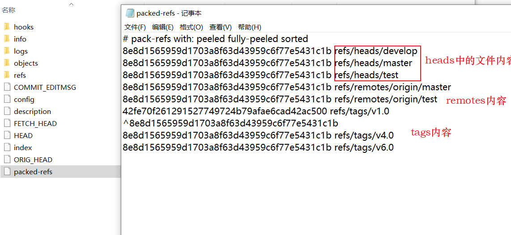

2. objects对象被压缩，内容被压缩到pack文件目录中

   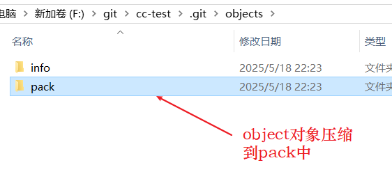

   

文件内容很少，压缩效果不会很明显，只有项目很大压缩效果才会明显。

#### 3.2.11 git裸库

所谓git裸库，就是没有工作区的仓库，它常用于服务器的仓库，上边只需要管理版本，不会添加文件。

创建git裸库的命令

```console
git init --bare
```

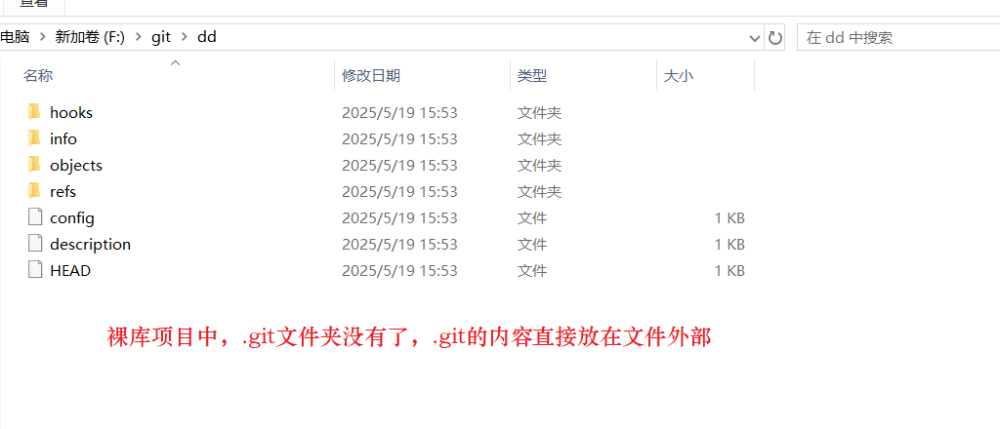

### 3.3 分支

分支是git中非常重要的功能，它可以更好的进行**版本隔离**，特别是做开发代码，一般都会有两个分支，分别是master线上分支与dev开发分支。master是git默认的主分支，不用创建就有。

分支也可以**实现协同开发**，让多个人各创建自己的分支，然后各自开发自己的功能，开发完成后合并起来。

分支解决一个特殊情景的问题，**线上紧急bug修复**：

> master分支就相当于线上代码，当开发完的v2版本后，v3版本需要一个月完成，当开发v3到一半时线上出现bug，这时回滚就是失去v3的内容，不回滚不能解决线上问题。

解决方式：开发v3版本时，先创建dev分支，再dev分支上开发，当线上出现bug，切换分支修改bug，再切换分支开发dev，最终开发完成合并分支就可完成。

#### 3.3.1 分支指令

git分支指令：

+ 查看分支

  ```console
  git branch
  ```

+ 创建分支

  ```console
  git branch 分支名
  ```

+ 切换分支

  ```console
  git checkout 分支名
  ```

+ 创建并切换分支

  ```console
  git checkout -b 分支名
  ```

  

+ **删除分支**，注意master分支不能删除，当前所在的分支不可删除或者当前分支有新的内容，没有merge不可删除

  ```console
  git  branch -d 分支名
  git branch -D 分支名 //大D表示强制删除，不merge也可删除
  ```

+ **合并分支**，该过程可能会出现冲突，冲突的出现是两个分支同时修改了同一个文件内容时产生的，这时就需要解决冲突，再提交完成合并。

  ```console
  git checkout 被合并分支名 //合并前，先切换到被合并的分支
  git merge 要合并分支名 //然后再合并分支
  ```

+ 修改当前分支名main

  ```console
  git branch -M main
  ```

+ 全局修改master分支名称为main

  ```console
  git config --global init.defaultBranch main
  ```


#### 3.3.2 分支原理

版本控制系统管理文件原理默认有两种方式：

1. 每个版本都全部文件复制一遍，svn就是采用该方式，缺点是对应大型项目，复制全部内容会特别费时。
2. 创建指针，新版本就是创建一个指针指向旧版本，git就是采用该方式，因此git创建分支，十分快速。创建指针然后让**HEAD**指向新指针。


**HEAD**是一个指针，它指向的是当前的分支。master是默认的分支。

创建分支——>切换分支——>合并分支的简单流程如下：


根据上图可看到分支的切换本质就是**HEAD指针**的切换，具体体现就是在.git文件夹中就是修改**HEAD**文件内容

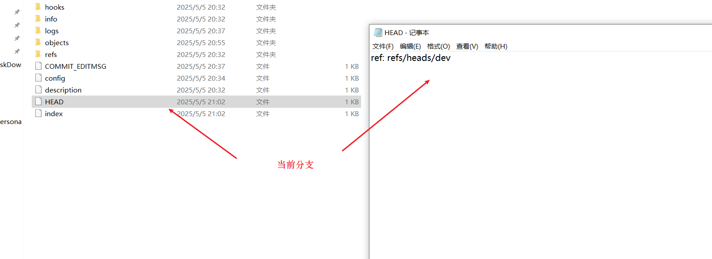


HEAD指向分支的版本管理文件就在**refs——heads**文件夹中，文件内容就是当前分支版本id


-d不能删除分支也就是dev与master内容不同，dev分支在新的版本上需要合并到master上才可删除。

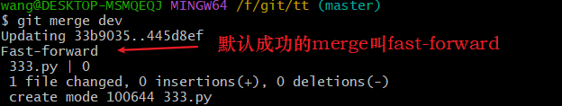

> 合并使用**fast-forward模式**本质就是master分支向前移动一位,没有冲突。这种模式是默认的，但不会保存分支信息。

不使用fast-forward模式，保留分支信息

```console
git merge --no-ff 分支名
```


#### 3.3.3 冲突

合并不一定每次都成功，有时会出现冲突。

产生冲突的方式可以让master分支修改一个文件内容，再在dev上同时修改同一个文件内容，两者都提交一个版本。这时就会出现冲突。

> 为什么会出现冲突?
>
> 因为master向前了版本，dev也向前了版本，这时合并就不能向之前fast-forward只切换指针，还需要匹配两者内容，如果有相同部分被修改，就需要用户自己先确认留下的内容后，再合并。


解决冲突，**HEAD**是当前分支版本内容，下面的是dev分支内容

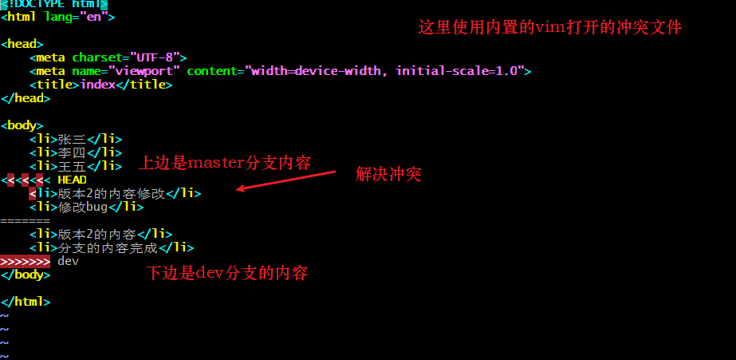

解决冲突的流程

1. 修改冲突文件，也就是删除多余的内容保留需要的内容

2. 使用`add`添加修改后的冲突文件，这时add的效果是解决冲突

3. 再`commit`提交文件生成版本，这时就解决完冲突

4. 为了保证分支的内容与master一致，还可在dev分支上再合并master的内容。

   注意这时分支合并会直接成功，因为master分支解决完冲突后，不仅拥有dev分支的内容，并且还向前提交了一个版本，这时的合并就是fast-forward向前合并，因此会直接成功。

   

### 3.4 checkout与stash

在之前我们已经使用`git checkout`的两种用法,切换分支与回退修改内容。

除了这两个用法外，它还可以直接切换版本，让HEAD进入游离状态。

```console
git checkout 版本号
```


这里其实是在切换的版本上开辟了一个新的分支，分支名称为特殊的字符


```console
git switch -c 分支名  //可使用该指令给游离状态的分支命名
git switch - //表示回退游离状态，也就是删除游离分支并回到之前的分支
```

> git checkout就可以实现在任意版本处开分支，而不是之前只能在最新的版本处开分支。

在游离状态可以直接创建文件，然后add添加并commit提交，但没命名分支前不要随意切换，如果切换就会丢失在该状态下创建的内容。

错误切换后，可输入指令挽回修改的内容

```console
git branch 分支名 游离的版本名
```

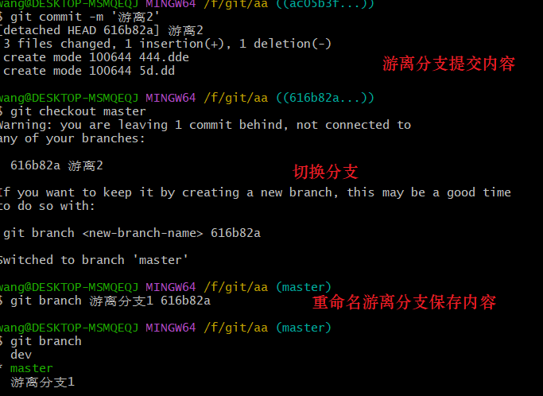

不命名分支，也可使用stash创建临时现场保存内容。

**stash**使用场景是有多个分支，在其中一个分支上开发了内容需要临时切换到其他分支时，但又不能提交文件版本防止错误，就可使用stash临时保存内容。**比如master分支与dev分支同时修改同一个文件内容，当master提交了一个版本，切换到dev修改了文件没提交要切换master就会报错。**

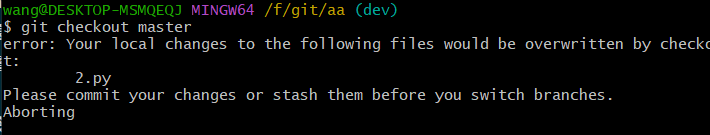

+ 创建临时保存版本

  ```console
  git stash  
  git stash save '临时版本名称' //给临时版本取名
  ```

+ 查询临时版本

  ```console
  git stash list
  ```

  

+ 取出最新临时版本内容并删除临时版(常用)

  ```console
  git stash pop
  ```

+ 取出临时版(不会删除临时版本)

  ```console
  git stash apply  //取出最新临时版本
  git stash apply stash@{版本序号} //取出对应版本序号的版本
  ```

+ 删除临时版本

  ```console
  git stash drop stash@{版本序号}
  ```

  如果临时版本同时修改同一个文件多次，恢复一个版本并commit提交，再恢复另一个版本时也可能出现冲突。这时就按之前解决冲突的方式解决问题即可。

  

### 3.5 git cherry-pick

在分支比较多时，有时可能因疏忽，添加内容添加到错误的分支，如果需要把提交错的版本移动到正确的分支上，这时使用`cherry-pick`最好，如果采用直接剪切复制文件的方式，会脱离git导致错误。

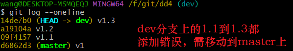

```console
git cherry-pick 版本号
```

如果添加的版本与master分支没有间隔，例如v1.1则可以直接添加成功，如果有隔离例如1.3，则会出现冲突，要先解决冲突才能提交。


使用该命令获取了dev分支的内容，但dev分支中依然还有错误的提交，需要回滚。

1. 可使用`git reset --hard版本号`回滚

2. 也可使用`git checkout 版本号`进入游离分支，然后删除dev分支，最后命名为dev分支即可。

   ```console
    git checkout 版本号 
    git branch -D dev  //删除dev分支
    git switch -c dev //重命名游离分支为dev
   ```

### 3.5 .gitignore忽略文件

git是帮我们完全管理一个文件夹中所有的内容，但当遇到我们不想要git管理某些文件时，就可以创建一个**.gitignore**文件完成。

```console
touch .gitignore
```

案例，下面的文件都不需要管理，当然也包括.gitignore文件本身，除了2.py使用特殊方式管理。


在.gitignore文件编写内容如下,注释内容不写

```console
1.py   				//表示忽略所有名为文件1.py，包括循环目录的内容
*.py				//表示忽略后缀名为.py的文件
!2.py				//!表示相反，不忽略文件2.py
/filedd  			//表示忽略文件夹filedd也可写为 filedd/
.gitignore			//表示忽略文件.gitignore
/fileddd/ccc.txt	//表示忽略文件夹fileddd中ccc.txt文件，当文件夹中没有其他文件，该文件夹也会被忽略
/*/ccc.txt          //表示忽略根目录下一级子目录下的所有ccc.txt文件
/*/**/ccc.txt         //表示忽略除根目录下所有子目录中的ccc.txt文件 **就表示所有子目录
#表示注释内容
```

忽略效果


自己写ignore文件很麻烦，可以直接在github上直接下载不同开发语言的gitignore。直接搜索gitignore就可找到一个项目，其中就有每种语言的gitignore文件。


### 3.6 git自带可视化操作工具

**gitK**工具，只需要在git bash输入命令`gitk`即可打开工具。

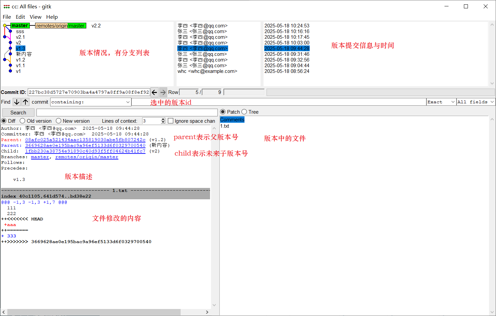

**gitK**可以很清晰的查看版本内容，但依然要使用命令为主，它为辅助，毕竟命令也可以展示这些内容并且帮我我们理解git。

gitGUI工具，也是可以在git bash工具中使用`git gui`指令打开的。

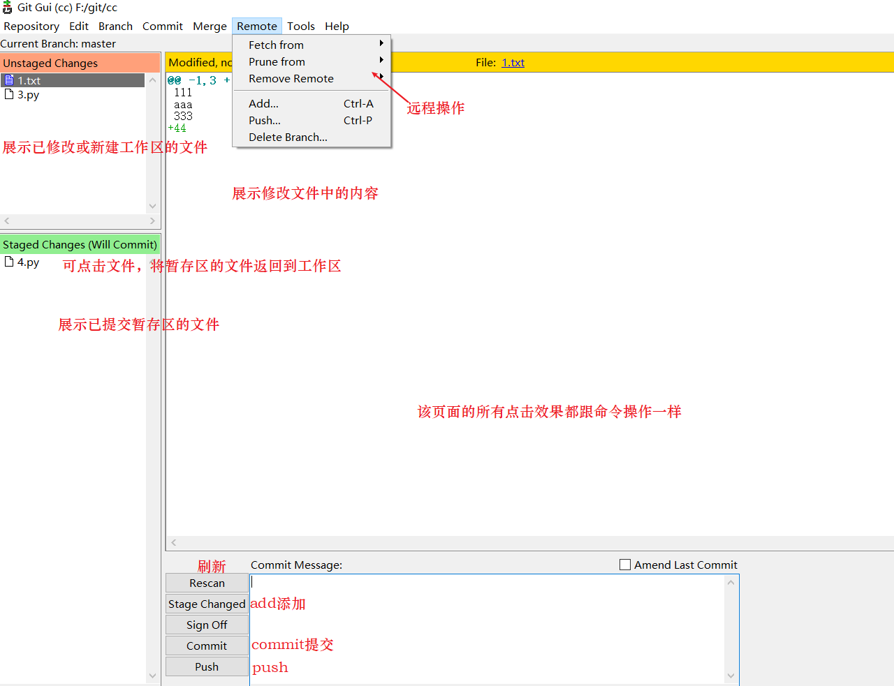

**Amend last commit**就是修改之前提交的信息。

### 3.7 git可视化操作工具

对应开发人员使用命令操作git是很简单的，但如果不懂代码的人员也要使用git，就可以使用工具帮助完成git的指令操作。

git自带可视化工具Git GUI,但如果不会可使用第三方工具，例如小乌龟**TortoiseGit**,gitDesktop等。

进入官网直接下载工具安装https://tortoisegit.org/，记得下载好软件后下载汉化包，这样就可以变为中文。

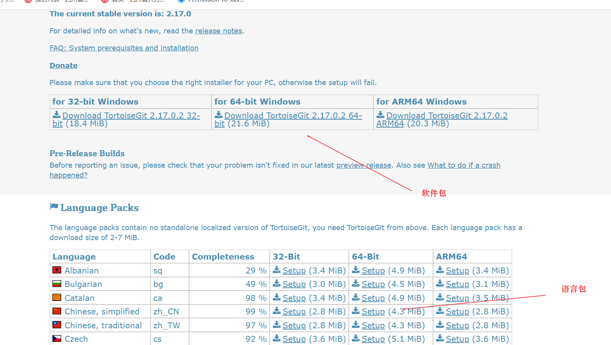

该工具使用非常方便，安装好后点击鼠标右键就可进行git操作。

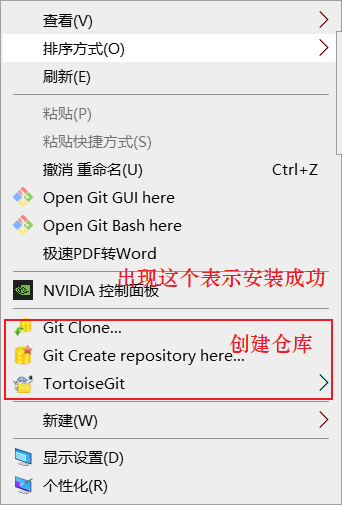

安装完软件后安装语言包，之后就可在设置中修改语言为中文


它的核心本质其实就是将git所有的指令变成点击按钮，点击添加就是add指令。其中它最强的功能就是使用icon显示文件状态。但因为windows系统限制的图标数量，需要修改注册表才能完整使用该功能。

```console
win+r regedit.exe //打开注册表
HKEY_LOCAL_MACHINE\Software\Microsoft\windows\CurrentVersion\Explorer //打开该路径
新建或修改键名 Max Caheed Icons(最大缓存图标)值为2000 该数据为字符串类型
```


修改完成后，还不行就重命名下面的文件，最关键是要让这几个文件在最上边，多加几个空格即可。


重启电脑后，就可以看到文件都会有标识状态的图标，这样可以了解文件状态。

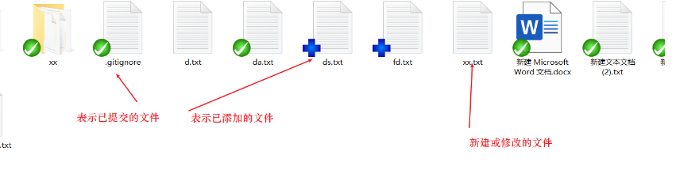

### 3.8 Oh-My-Zsh(美化命令行)(了解)

在Windows上使用**Oh My Zsh**可以让你的终端更加美观和功能强大。以下是详细的步骤：

1. **安装 Git Bash**：下载并安装 Windows 版本的 Git。在安装过程中，勾选 "Add a Git Bash Profile to Windows Terminal"

   

   勾选是为了在 `Windows Terminal（终端）` 中能够使用 `Git Bash`，可以看一下，原本终端是没有 `Bit Bash` 选项的,选择后才有

   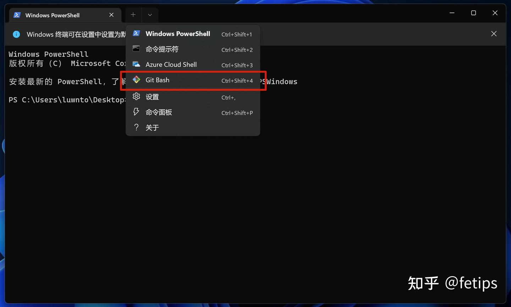

2. **安装Zsh**：下载Zsh安装包，下载地址：https://packages.msys2.org/packages/zsh?repo=msys&variant=x86_64

   

   也可使用下载指令（不一定有效），curl是一个利用URL语法在命令行下工作的文件传输工具，

   ```console
   curl -LO https://mirror.msys2.org/msys/x86_64/zsh-5.9-3-x86_64.pkg.tar.zst
   ```

3. **解压到Git的安装根目录下**。打开Git Bash输入`zsh`，确认安装成功。下载的包为pkg.tar.zst后缀，需要解压两次才行

   + 第一次解压，解压到当前目录即可，得到 `.tar`文件

   + 第二次解压 `.tar`文件到当前目录（直接解压到 git 安装目录可能会没有权限），移动解压后的文件到 `git` 安装目录即可，需要权限的话就授权，重名的话直接覆盖：

     

   ```console
   tar -xvf zsh-5.9-2-x86_64.pkg.tar.zst -C /path/to/git/root  //需确认路径是git根路径
   ```

   

   输入`zsh`就表示启动zsh，这时光标会与git bash时不同。

   

   编辑Git Bash的配置文件`.bashrc`，使其默认启动Zsh。`vim ~/.bashrc` 

   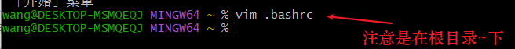

   ```console
   # 在文件末尾添加以下内容
   if [ -t 1 ]; then
     exec zsh
   fi
   ```

   成功后以后打开git bash就会默认启动zsh。**tab**是最好用的快捷键。

4. **安装Oh My Zsh**，在安装好`Zsh`终端之后，看起来跟`Bash`终端并无太大的区别，我们也没有进行设置。而`Oh My Zsh`可以用于管理 `Zsh`配置。它捆绑了数千个有用的功能、助手、插件、主题等。在命令行输入命令并按回车执行：

   ```console
   sh -c "$(curl -fsSL https://raw.githubusercontent.com/ohmyzsh/ohmyzsh/master/tools/install.sh)"
   ```

   

5. 配置zsh

   `Zsh`的配置文件在用户的家目录，文件是 `.zshrc`，编辑配置文件，可以对`Zsh`进行一些定制化配置：

   ```console
   vim ~/.zshrc
   //编辑保存后不会立即生效，需要source指令
   source ~/.zshrc
   ```

6. `Oh My Zsh`安装之后，默认使用主题是 `robbyrussell`，可以修改为`ZSH_THEME="agnoster"`，`.zshrc` 配置中的`ZSH_THEME`字段，所有可用主题可参考[ohmyzsh官方文档](https://link.zhihu.com/?target=https%3A//github.com/ohmyzsh/ohmyzsh/wiki/Themes)，这里先配置一下我个人比较喜欢的主题：

   

7. 配置插件。通过使用插件，可以让 `Zsh` 的功能更加强大，`Zsh` 和 `Oh My Zsh` 自带了一些实用的插件，也可以下载其他的插件。 如 `Zsh` 自带 `Git` 插件，可以在命令行显示 `Git` 相关的信息，并提供了一些操作 `Git` 的别名：

   ```console
   gaa = git add --all
   gcmsg = git commit -m
   ga = git add
   gst = git status
   gp = git push
   ```

   `zsh-autosuggestions` 插件，可以在你历史指令中找到与你当前输入指令匹配的记录，并高亮显示，如果想直接使用，可以直接通过右方向键补全。 安装插件，在终端分别执行下面两条命令

   ```console
   cd ~/.oh-my-zsh/custom/plugins //进入插件目录
   git clone https://github.com/zsh-users/zsh-autosuggestions ${ZSH_CUSTOM:-~/.oh-my-zsh/custom}/plugins/zsh-autosuggestions 
   ```

   插件下载完成之后，编辑 `~/.zshrc` 配置文件，修改插件相关配置项：`vim ~/.zshrc`

   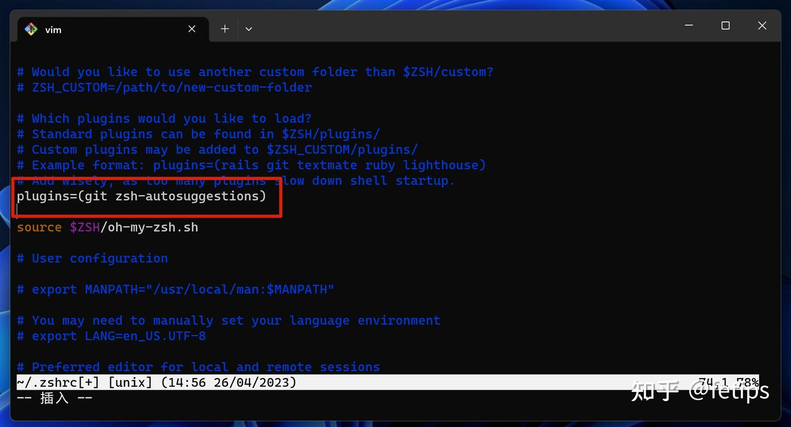

   如果你不喜欢提示默认的浅灰色，可以在 `~/.zshrc` 中修改（没有配置项就添加）

   ```console
   ZSH_AUTOSUGGEST_HIGHLIGHT_STYLE="fg=#9fc5e8"
   ```

   **目录跳转插件**：`Zsh` 自带有一个插件 `z`，可以让我们在访问过的目录中快速跳转，将该插件配置到 `~/.zshrc` 文件中即可使用：

   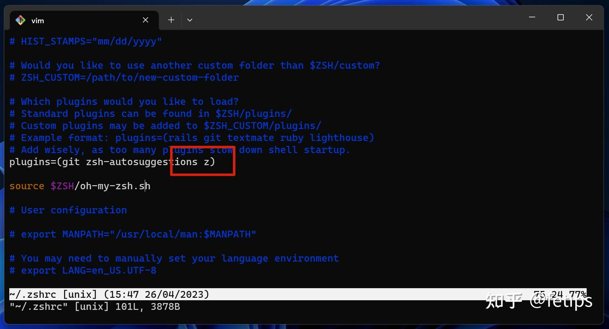

   保存退出之后，重载配置，随意进入一些目录，之后再使用命令 `z` 就可以实现快速跳转，支持模糊匹配：

   **配置别名**:`Zsh` 的 `alias` 配置项可以自定义命令别名，在使用一些比较复杂的命令时，使用别名可以提高效率，这里举例添加一个 `Git` 日志的别名：(注意等号两边不要有空格)

   ```text
   alias gli="git log --color --graph --pretty=format:'%Cred%h%Creset -%C(yellow)%d%Creset %s %Cgreen(%cr) %C(bold blue)<%an>%Creset' --abbrev-commit"
   ```

   

   高亮插件,步骤跟自动插件一样

   ```console
   cd ~/.oh-my-zsh/custom/plugins/
   git clone https://github.com/zsh-users/zsh-syntax-highlighting.git
   ```

   下载好后在配置文件中配置

   ```console
   plugins=(git zsh-syntax-highlighting zsh-autosuggestions)
   ```
   
   zsh不仅能美化界面，还有很多git提示，比如**文件目录+当前分支以及是否有文件未管理**，这样可大大提高使用git的效率，
   
   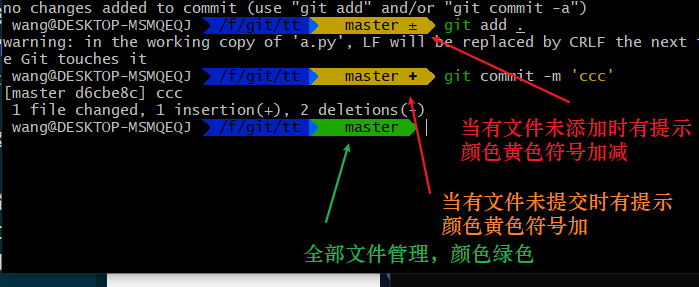
   
   > 未使用主题时，依然有当前分支，有黄色❌就表示有文件未管理。
   >
   > zsh使用后，`ls -al`的指令可直接使用`l`代替。

## 四、Github  

github相当于git的一个远程仓库，它跟git没有任何直接的关系，它相当于互联网上的云盘，要实现两地开发，就可以在github建立个人仓库进行完成。

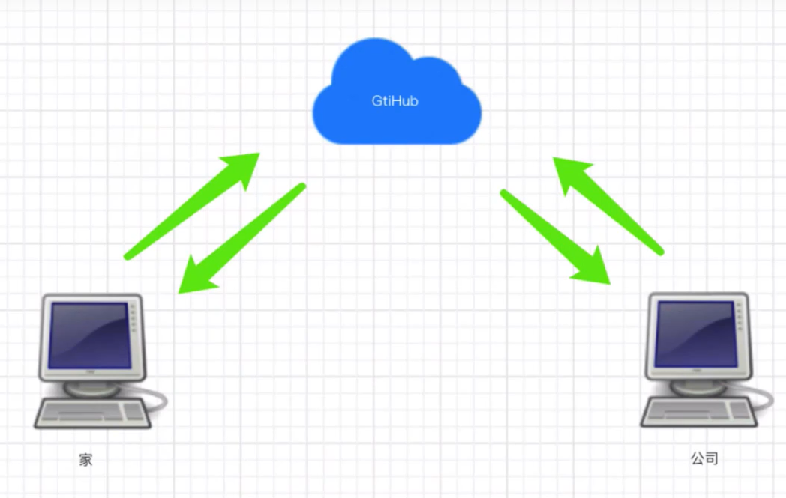


要使用GitHub先要注册创建个人账户。先进入**github官网**https://github.com/。

个人账户注册完毕后,就可以创建一个自己的仓库。

### 4.1 仓库 repository

#### 4.1.1 搭建远程仓库

创建仓库步骤很简单。流程如下图：


> 三个选项不勾选表示：1.不创建README文件说明文件，2.不创建.gitignore忽略文件，3.不创建license许可证文件，如果创建他人有许可证就可以完全使用你的项目，相当于项目开源化。

创建完成后就可以获得一个远程仓库地址https://github.com/Kitaily/demo1.git

#### 4.1.2 远程仓库推送原理

当本地仓库与远程仓库建立联系后，添加新文件查看状态就会发现不同


为了保证本地与远程仓库的联系，创建了一个中间分支origin/master来与远程仓库绑定。该分支是隐藏的需使用-a才能查看到

```console
git branch -a  //-a就是-all的简写
git branch -av //除了显示全部分支，还会显示相应的版本
```

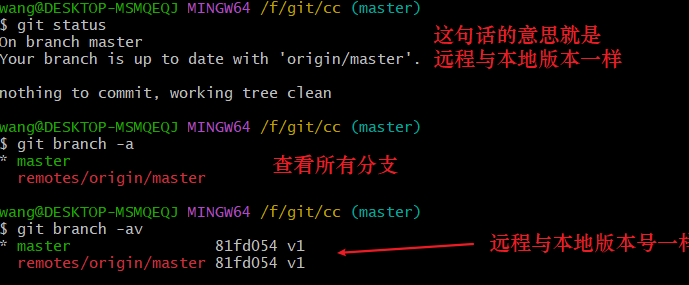

当本地提交的新的版本，而没有push到远程仓库时

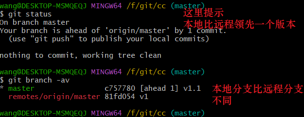

push成功时会看到，push不仅会把内容推送到远程，也会再同时更新本地origin/master分支内容

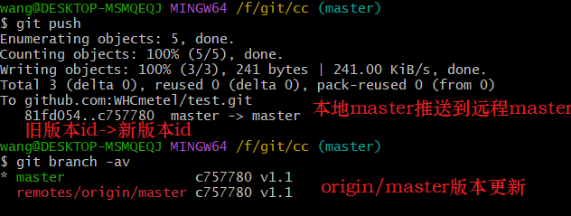

本地的origin/master分支是不可操作的，它的内容是git自动修改的，即使使用git checkout 该分支名也无法切换到该分支。

除了git push推送代码外，还可以使用git clone从远程下载代码

```console
git clone 远程仓库地址  //默认使用仓库名作为git文件名
git clone 远程仓库地址 文件名 //指定下拉代码文件名
```

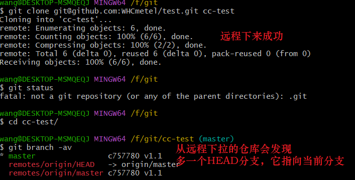

> **本地代码如何与远程仓库联系的原理**：最主要就是创建的远程分支`origin/master`(remotes可忽略),它就是远程与本地的桥梁，它绑定的是本地的master分支。其作用如下：
>
> + 当本地master分支更新要push给远程仓库，先会把本地分支推送到远程，然后分支内容更新合并到`origin/master`分支，也就是该分支的HEAD指针向前推进了几个版本,如果与远程有冲突，直接推送失败
> + 当本地master分支要获取远程仓库内容，先把远程分支拉取到`origin/master`分支，然后本地分支合并到`origin/master`分支，
> + pull出现冲突时，依然会先拉代码，合并`origin/master`分支与本地分支会失败(相当于两个分支合并)，这时会分离`origin/master`分支与本地分支，解决完冲突后，两者才会再次关联，再push将两者内容同步。

pull指令其实也是由两个指令合成的

```console
git fetch origin 分支 //远程仓库拉代码本地分支origin/分支
git merge origin/分支 或 git rebase origin/分支 //代码从版本库合并到工作区，有merge指令所以会出现冲突
```

git fetch完整写法

```console
git fetch origin 远程分支名：本地分支名
//拉取远程分支master的内容到本地mymaster中，这里本地分支直接使用ref路径表达
git fetch origin master:refs/remotes/origin/mymaster 
```


加上远程仓库后三大区域的指令


在没有添加远程仓库时，`git romote add`命令会自动生成远程仓库相关的refspec文件内容。git会获取远程仓库refs/heads下的所有引用，并将他们写到本地的`refs/remotes/origin`目录下。其内容都写在config目录下：

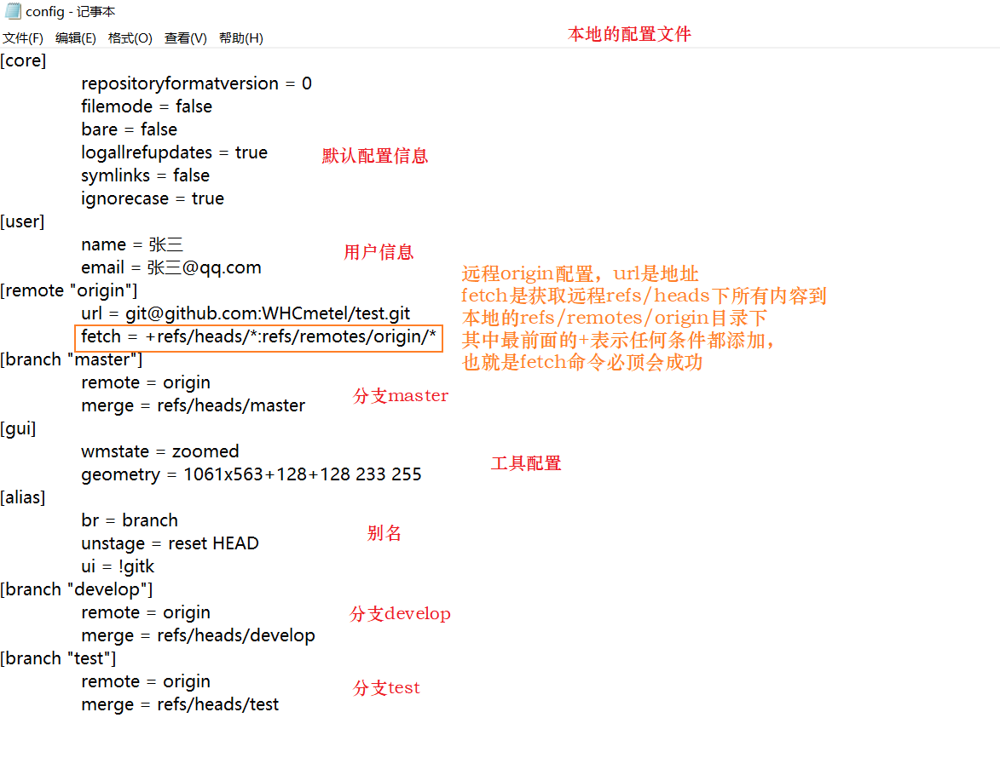

写入的内容就在**refs**目录中，其中heads是保存本地所有分支信息，remotes是远程信息，tags是标签

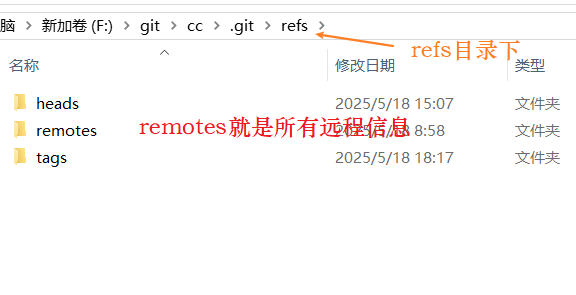

查看远程分支日志，该内容是被下载到本地的，不用联网。

```console
git log origin/分支名  //这是查看的远端分支的日志
git log remotes/origin/分支名
git log refs/remotes/origin/分支名 //写入了远程日志完整路径
```


#### 4.1.3 push与origin

创建完成远程仓库后就利用远程仓库地址push本地代码。

+ 远程仓库地址取别名

  ```console
  //添加别名 origin就是远程仓库地址
  git remote add origin https://github.com/Kitaily/demo1.git
  ```

+ 本地代码推送到远程仓库，-u就是设置`git push`推送设置为默认配置

  ```console
  //推送本地代码到远程仓库 -u表示默认，-u的属性可以省略不写，其含义undefined默认的，
  git push -u origin master
  //git push的完成参数写法，上边的简写实际是本地分支与远程分支同名
  git push origin 本地分支名:远程分支名
  ```
  
+ 如果推送远程错误，想要回退版本

  ```console
  //先在本地回退版本
  git reset --hard 版本
  //然后推送到远程，-f表示强制，如果不写推送会失败
  git push -f origin master 
  ```

如果推送出现问题，输入账户密码可能失败。可以采用三种**免密登录**方式解决问题：

1. **修改远程仓库url地址**，将账户与密码直接添加在地址上，使用修改指令修改origin

   ```console
   git remote set-url origin https://用户名:密码@github.com/Kitaily/demo1.git
   ```

2. **SSH实现**，其流程比较复杂(推荐使用)

   + 先使用指令生成公钥与私钥

     ```console
     ssh-keygen 
     ```

   + 在生成的文件路径中打开公钥文件`C:\Users\wang\.ssh\id_rsa.pub`其他系统在`~/.ssh/id_rsa.pub`,私钥文件为id_rsa

   + 拷贝公钥内容，复制到github中，创建一个SSHkey，创建SSHkey的地方有两个

     ①是给创建的仓库创建sshkey

     

     ②是给账户创建sshkey，这个key就是全局的，以后所有该账户创建的仓库都可以用这key

     

   + 创建完成后，只需要将origin设置为ssh的格式就行

     ```console
     git remote set-url origin git@github.com:Whc3438/demo1.git
     ```

3. **基于操作系统创建git凭证**，让git自动管理凭证。该功能是系统完成，就是输入成功一次密码自动保存。

推送成功后，就可以在远程仓库看到master分支。（注意origin只需要添加一次）


>**补充知识：**
>
>在Git中,`git push.default`是一个配置选项，用于控制`git push`命令的默认行为。这个选项有五个不同的值，每个值对应不同的推送策略：
>
>1. **nothing**: 直接执行 *git push* 会出错，需要显式指定推送的远程分支。例如：*git push origin master*。
>2. **current**: 只会推送当前所在的分支到远程同名分支。如果远程分支不存在相应的同名分支，则创建该分支。
>3. **upstream**: 推送当前分支到它的上游分支（upstream branch）。这个模式只适用于推送到与拉取数据相同的仓库。
>4. **simple**: 在中央仓库工作流程模式下，只能推送到与本地分支名一致的上游分支。如果推送的远程仓库和拉取数据的远程仓库不一致，那么该模式会像 *current* 模式一样进行操作。因为该选项对于新手来说是最安全的，所以在 Git 2.0 中，*simple* 是 push.default的默认值配置项（2.0以前的默认配置项是 *matching*）。
>5. **matching**: 推送本地和远程都存在的同名分支。
>
>+ 查看push.default的配置(默认没有)
>
>  ```console
>  git config --system -l
>  ```
>
>+ 修改push.default的配置
>
>  ```console
>  git config --global push.default matching(模式)
>  ```
>
>解决推送问题，如果在推送时遇到类似以下的警告：
>
>**The current branch newBranch has no upstream branch. To push the current branch and set the remote as upstream, use**
>
>**git push --set-upstream origin newBranch**
>
>可以通过以下两种方法解决：
>
>1. 修改仓库默认配置为current，然后执行git push
>
>```console
>git config --local push.default current
>```
>
>2. 指定推送的远程分支名，这种方法更推荐，例如：
>
>```console
>git push origin newBranch
>```
>
>通过了解和配置 `git push.default`，可以更好地控制代码推送的行为，避免不必要的错误和冲突。

操作origin的其它指令：

+ 查看origin

  ```consloe
  git remote -v 
  ```

+ 删除origin

  ```console
  git remote remove origin
  ```

+ 修改origin

  ```console
  git remote set-url origin 新的url地址
  ```
  
+ 查看所有远程地址别名

  ```console
  git remote show
  ```

+ 显示别名内容(有测试连接远程地址的效果，因为该的信息是从远程获取的)

  ```console
  git remote show origin(远程地址别名不一定是origin)
  ```

  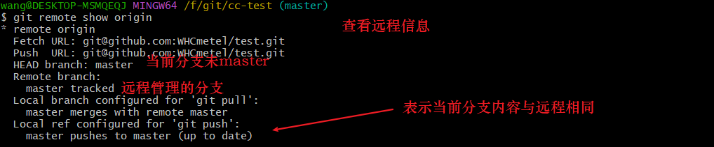

还可直接在配置文件中修改origin的值(不推荐)


#### 4.1.4 clone与pull下载远程代码

推送完成后，如何在新的电脑下载GitHub上的项目。这时就需要先在新电脑上clone一次github上的项目。

+ 克隆项目指令

  ```console
  git clone 项目路径
  ```

  克隆是完全复制github上的项目，其中最核心的就是.git文件夹

  > **.git文件夹中除了所有的分支记录外，还有origin的配置信息，因此下载下来的项目是可以直接推送的，不需要再配置origin。**
  >
  > **使用什么url，配置文件中的url就是什么，因此ssh最好使用ssh的url克隆。**

  

+ 看不到dev分支只需要`git checkout dev`即可,这时会建立一个新的dev分支并切换到dev分支，但因为原本的.git文件夹中就有以前dev分支的版本记录，这里就默认继承到新的dev中。

  

+ 更新github上的代码，不用再用clone，而是使用pull就可把新的文件下载下来

  ```console
   git pull origin 分支名
   //完整命令
   git pull origin 远程分支名：本地分支名
  ```

**同时修改同一文件时，如果已经有人推送了内容，另一人再想推送自己的内容会失败**。(跟本地两个分支合并冲突一样)

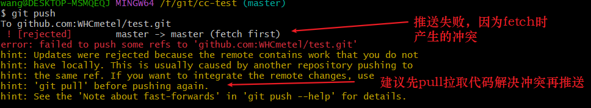

pull拉代码，会出现出现冲突。

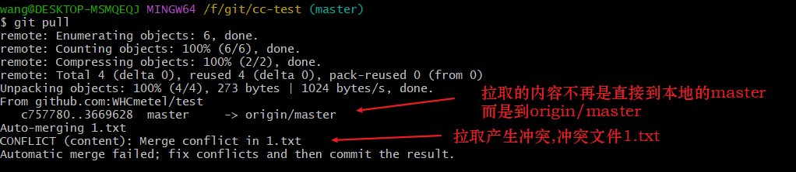

出现冲突就先解决冲突，然后将修改代码提交，最后在推送到远程就可以了。

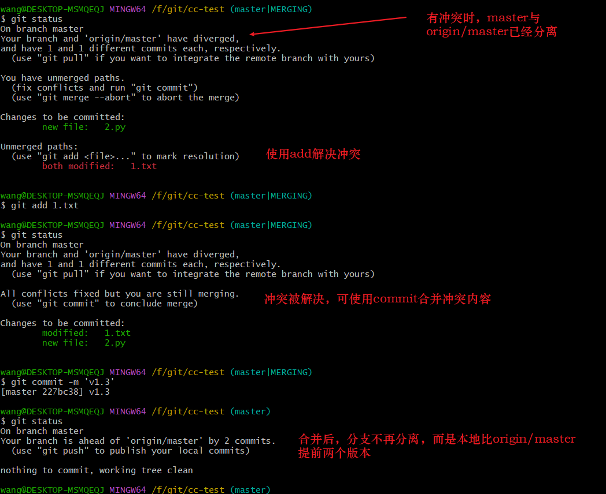

> 上述问题可以看出，每次push前，我们最好都先pull一次代码，保证本地与远程一致后再push。

远程连接成功后，本地.git会多出两个新文件**ORIGIN_HEAD**与**FETCH_HEAD**，它们都记录了远程分支版本id，其中FETCH_HEAD多了提交信息。

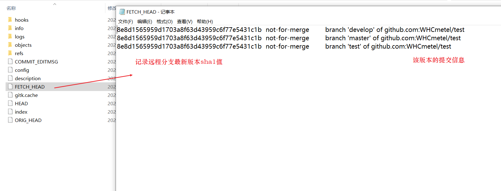

#### 4.1.5 远程分支

在远程仓库已经有分支后，如果在本地创建新分支添，直接推送到远程时就会出错，这时需要先创建远程分支来绑定新分支后才可推送。

方式一：**创建远程分支**绑定本地分支：(名称是可以不与本地相同的)

```console
git push --set-upstream origin develop //推荐使用
```

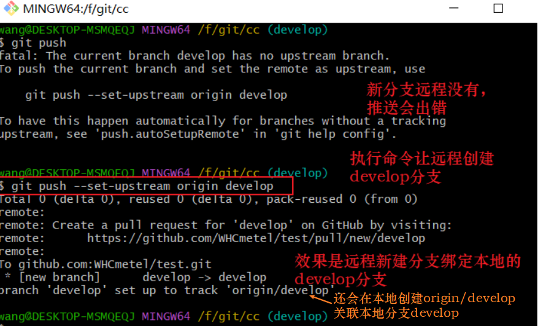

推送上的新分支，别人如何通过pull拉取下来，直接拉取是成功的，会在本地创建origin/develop分支。

**因本地没有develop分支，需要绑定develop与origin/develop才能实现远程与本地绑定**

```console
git checkout -b develop origin/develop 
```

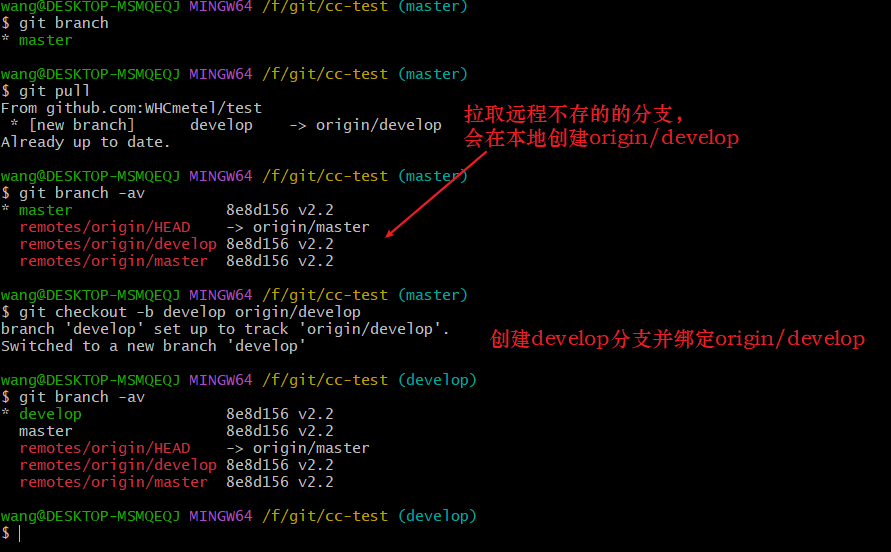

方式二：可用推送新分支方式创建远程分支,该指令就是第一次我们推送时的指令，-u其实也包含了set-upstream的内容。

```console
git push -u origin 分支名  
```

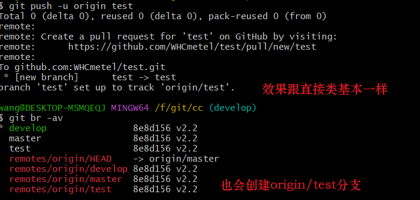

拉取新分支后也可以用新的指令创建分支，这种创建有个缺点就是创建的分支名与远程名一定会一致

```console
git checkout --track origin/分支名 //不推荐
```

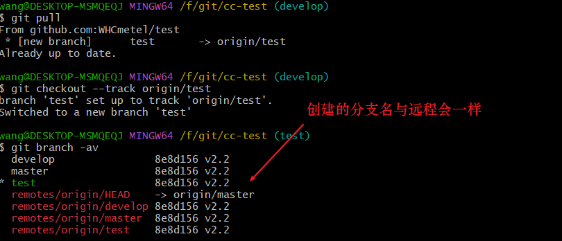

**删除远程分支**

```console
//方式1，推送一个空分支到远程,这里是push的完整写法
git push origin :分支名
//方式2 新版git的功能
git push origin --delete develop
```

> 注意上边删除远程分支同时本地的**origin/分支**也会被删除。

创建分支依然使用之前的`git push --set-upstream origin 分支名`即可

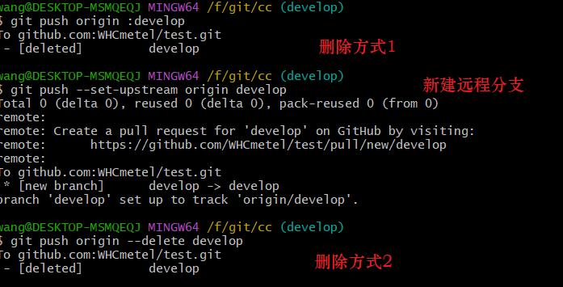

也可让远程分支名与本地分支不同。

```console
git push --set-upstream origin develop：develop2 //远程分支名为develop2
```

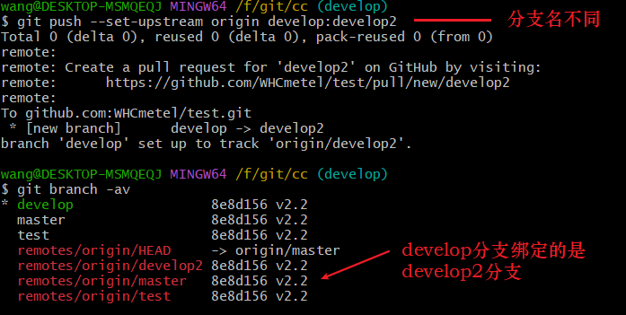

分支名相同时可以直接`git push`，分支名不同时则会失败。必须要完整的推送指令才能推送成功

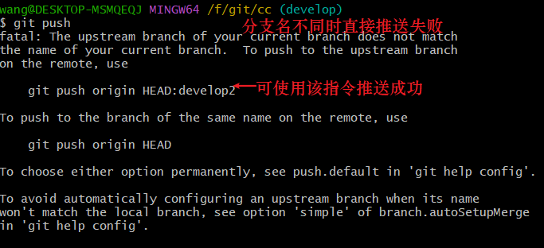

```console
git push origin HEAD:develop2  //HEAD表示当前分支当前版本
git push origin develop:develop2 //该方式与效果是一样的
```

查看分支对应关系

```console
git remote show origin
```

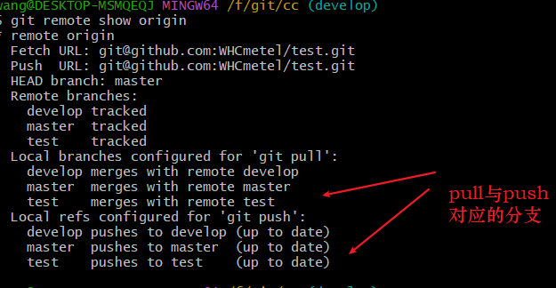

如果一人删除了远程分支，其他成员本地并没有删除，就会出现拉取远程分支错误

```console
git remote prune origin  //清除多余的远程分支
```

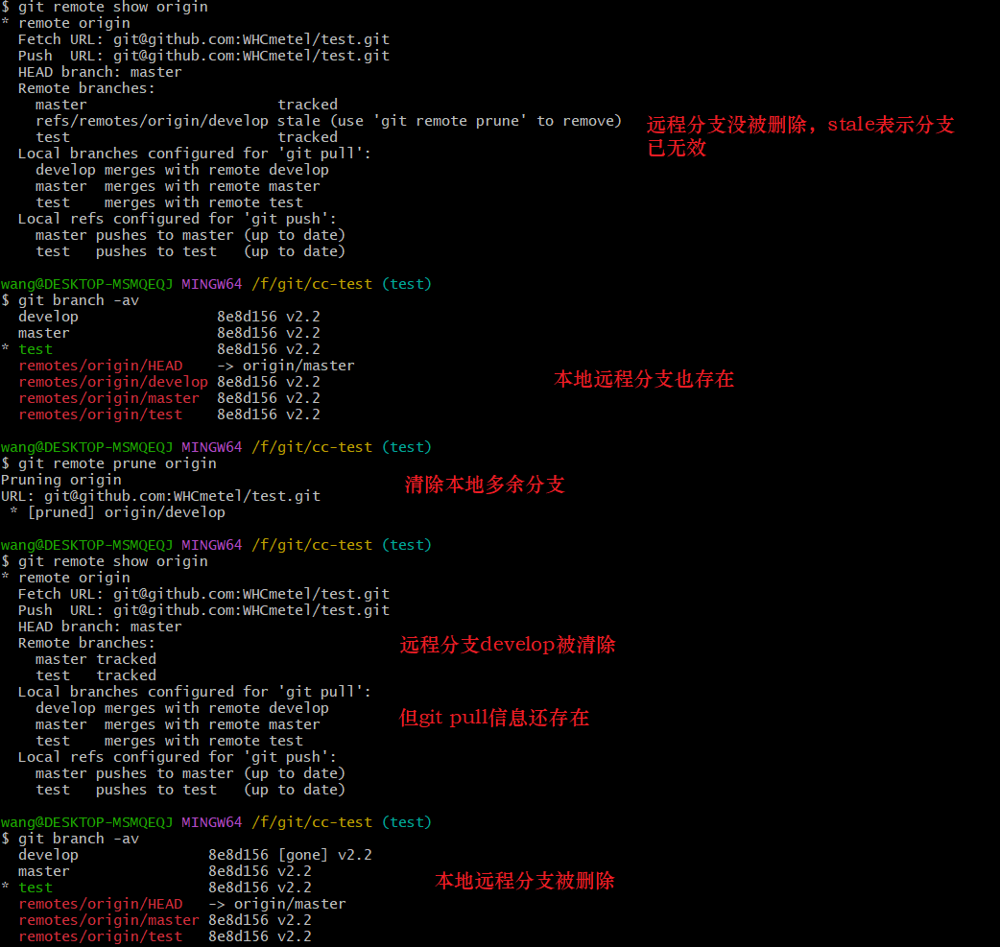

> git pull中develop内容依然存在是因为本地分支develop还在，只要删除本地的develop它就会消失。
>
> 或者使用命令删除`git branch --unset-upstream`,他的效果就相当于消除本地的关联与`git remote prune origin`搭配使用  

### 4.2 github页面

#### 4.2.1 Fork

学会github仓库后，基本本地与线上的内容就可完成，但github页面上还有很多功能需要了解。


最重要的就是**Fork**，它相当于复制别人的仓库到个人账号中，可以进行2次开发。fork的内容大部分都是开源的代码。


fork后的项目在自己本地随意修改都不会影响原项目。如果需要提交个人修改的内容到原项目，就需要使用pull request。

#### 4.2.2 pull request

**Pull Request**（PR）本质就是一种请求。它是Git和GitHub中的一个核心概念，它允许开发者将自己的代码变更提交给其他项目，以便进行代码审查和合并。PR不仅是代码贡献的桥梁，也是确保代码质量的重要审核机制。

fork后修改完代码，就可以发起请求申请添加代码，如果通过别人就会把你的代码合并，没有就不会改变


pr还可以用于多人协同开发，在代码review时就会使用pr审核代码。

#### 4.2.3 Issues与WiKi

在多人合作开发时，如果一个人对项目有问题或者有bug要提交，都可以在issues中提交。其相当于项目的聊天窗口，在其中可以发表各种意见，完成后就可以关闭issues即可。

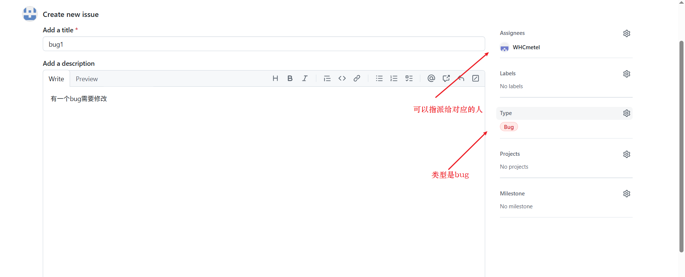


当内容比较多时，就可以在issues中做筛选，其相当于一个任务管理系统


关闭issues后依然可以查看


公司项目，一般会有专门做任务管理的系统，不会使用issues，因为不安全。

WiKi就是维基百科，也就是项目介绍，其中可写项目的功能以及开发的内容，方便新人查看文档快速熟悉项目。成熟的项目一般都有wiki，简单的项目可能就直接在README文件中就写完介绍，这样方便在网页直接查看。编辑wiki的页面如下：

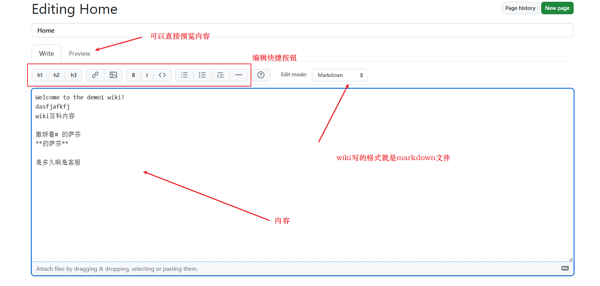

#### 4.2.4 新建，修改，删除文件

**新建文件**可以直接创建，也可上传已有的文件


新建文件不仅要先文件信息，写完后还会写commit信息以及选择合并到那个分支。

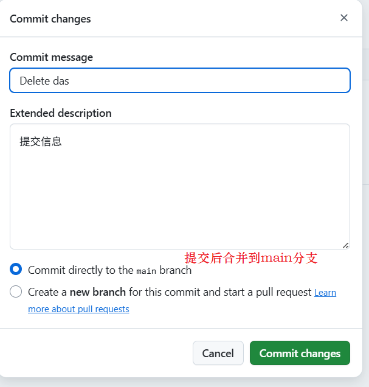

**修改文件**，打开文件后就可看到修改按钮。

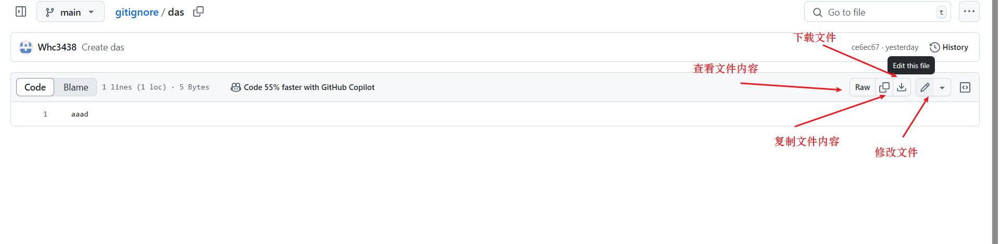

**删除文件**，删除流程与新建大体一样。

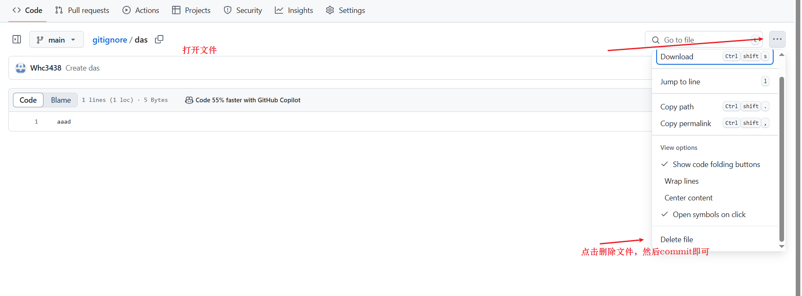

> 一般不推荐在网页上直接操作文件，一般会下载到本地再操作最后上传。

### 4.3 其他云仓库

github是国外的，有时访问会很忙，这时就可以使用国内的仓库代替。最出名的就是gitee（别名码云）。

gitee的官网是https://gitee.com/，它的使用方式跟github基本一样，先注册账号，然后创建仓库然后推送。


> 使用其他人的仓库,始终会有代码隐私问题,如果需要保护,可以使用一台**linux电脑搭建git个人服务器**,作为仓库来使用.
>
> 个人服务器的搭建流程放在另一个文档中,这里就不详述了.

## 五、rebase(变基)

rebase主要作用是简化git提交记录。rebase常见的使用场景有三种，下面会一个个说明。

### 5.1 合并多个提交记录整合成一个记录

假如有一个git记录如下，如果想要只保留v1和最后的记录，使用rebase就可完成

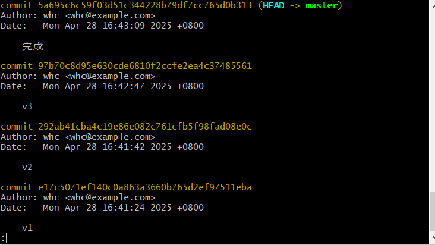

```console
git rebase -i 最终版本号  //假如为v2就表示合并 完成＋v3＋v2三个合并为一项，如果为v3就合并完成＋v3
```

```console
git rebase -i HEAD~3  //就表示前3个合并也就是跟上边的完成＋v3＋v2三个合并为一项
```

执行后会弹出修改内容


将其修改为s表示当前版本合并到上一个版本


修改完后按shfit+:编写wq保存退出


最终编写合并的信息v2&v3&完成保存就完成合并了

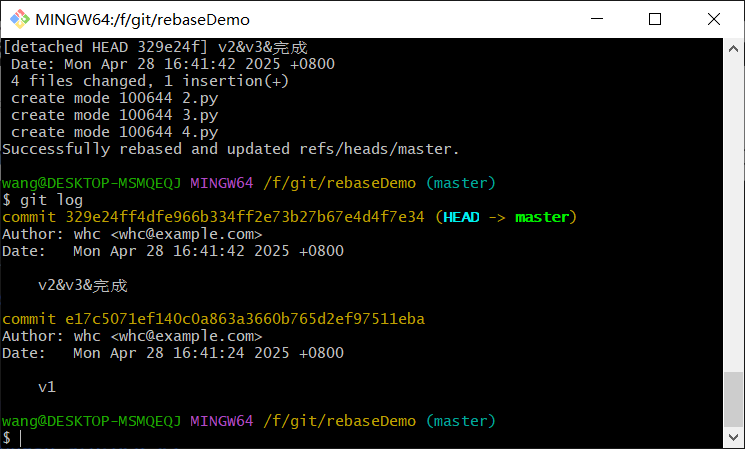

> 注意：做代码合并不要合并已经提交到远程仓库的记录，防止出现问题

### 5.2 合并分支记录

以前合并分支是使用merge指令，但是该合并的分支记录会出现分叉，使用`git log --graph`可查看

使用rebase合并，它将不会产生分叉。它会改变分支的版本流程，将变基对象的版本与分支合并成一条直线。**变基对象只能是个人的分支**，如果提交到远程有多人开发，就不能使用，否则流程改变会导致各种错误，当然要上线的master也不能用。

例如：原本的topic分支与dev分支流程如下

```console
          A---B---C topic
         /
    D---E---F---G dev
```

如果在topic上使用merge

```console
git merge dev
```

最终合并的结果

```console
     A--B--C——F     topic分支上产生一个F分支
             /
D---E---F---G       dev
```

如果在topic上使用变基指令，意思就是让dev分支变成topic分支的基础，

```console
git rebase dev
git rebase dev topic //与上边是等价的写法
```

最终合并的结果就是topic的分支前面追加所有的dev分支

```console
                  A'--B'--C' topic上所有版本都变化
                 /
    D---E---F---G dev   dev分支不变
```

变基指令实现的具体步骤：

1. git会把所有的topic版本临时保存下来，删除topic分支，

2. HEAD切换到dev分支最新版本上，基于此创建一个新的topic分支，

3. 最后把临时保存的topic版本一个个的merge到新的topic上，这时合并的topic版本号将与原来完全不同

   合并的流程为A的内容就会与G先合并，有冲突先解决冲突，然后add添加冲突文件,继续执行rebase，这时A与G合成的版本为A'

   ```console
   git rebase --continue  //表示继续rebase流程
   //如果不需要A的内容，执行skip表示跳过当前
   git rebase --skip 
   //如果rebase错误不想在执行，abort表示取消这次rebase，所有内容恢复最开始的样子
   git rebase --abort
   ```

   继续的下一次就是B的与A'的内容对比进行合并，同样的流程，合并B',最后就是C。

如果出现情况特殊情况，topic中有版本内容与dev一样，A等于A'，A的位置随意。

```
          A---B---C topic
         /
    D---E---A'---F dev
```

最终合并的结果，其流程也与之前一致，只是在合并A版本时发现与前面一致就直接skip舍弃。

```
                   B'---C' topic
                  /
    D---E---A'---F master
```

rebase还能实现插入的效果

```console
 A---B---C----F---G       dev
          \
           D——E            topic
```

执行指令

```console
git rebase topic  //注意是以topic为基础改变dev
```

最终结果dev分支改变，好像把topic的内容嵌入dev中

```console
A---B---C--D'--E'--F---G       dev
         \
          D——E            topic
```

变基后都记得切换到另一个分支将内容merge下来，让两者保持一致。

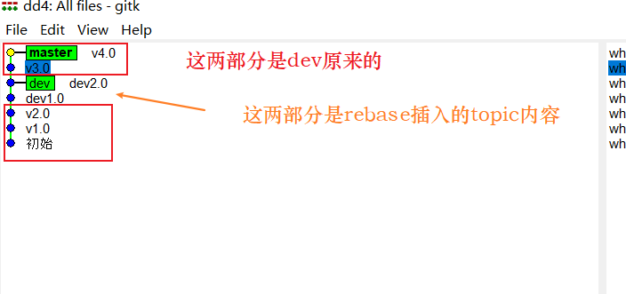


### 5.3 合并远程仓库记录

在之前使用github出现过一个案例就是忘记推送，导致`git pull`出现合并冲突。这种合并完成后记录也会出现分叉。

如果不想要分叉，就将其拆分为两个指令

```console
git fetch origin 分支 //拉取远程内容
git rebase origin/分支 //变基合并
```

这里的git rebase可以替换为merge,它是拉取的分支与本地的origin/分支进行合并。rebase合并的分支没有分叉，merge有。

如果使用rebase产生冲突，其执行步骤

1. 先解决冲突，

2. 然后`git add`添加解决完冲突的文件，

3. 继续rebase的流程，

   ```console
   git rebase --continue
   ```

4. 后续操作跟之前流程一样。

## 六、beyond compare工具

beyond compare工具可以帮助我们快速解决冲突。非常常用，我们可以将该软件集合到git中，当出现冲突时直接调用该工具解决。

先在官网https://www.scootersoftware.com/去下载工具并安装。

配置工具到git中

```console
git config --local merge.tool bc3
git config --local mergetool.bc3.path "G:\BeyondCompare\App\BCompare64\BCompare.exe" //软件路径自己设置,破解版路径要在最核心的里面
git config --local mergetool.bc3.keepBackup false  //每次解决冲突后不保留原文件
```

上边是配置本地，也就是每个项目都要配置一遍，如果要配置全局，将**--local**改为**--global**，全局文件在c盘的.gitconfig文件


配置完成后，当merge出现冲突时，输入指令,就会自动调用工具，其面板如下

```console
git mergetool
```


修改完成后点击右边保存关闭就可，后续的操作跟之前一致。

## 七、多人协同开发 

### 7.1 Gitflow工作流

**GitFlow**是一种基于 Git 的工作流程，它定义了一个围绕项目发布的严格分支建立模型。这个模型由两类分支构成：主分支和辅助分支。

GitFlow的核心优势在于它能够让代码仓库保持整洁，同时确保团队成员之间的开发工作相互隔离，有效避免开发中的代码相互影响导致的混乱。

GitFlow的主要分支

- **Master 分支**：存放的是最稳定的正式版本代码，应随时可在生产环境中使用。更新主要分支时，需要在上面打上对应的版本号标签。
- **Develop 分支**：主开发分支，包含所有要发布到下一个 *Release* 的代码。它接受其他辅助分支的合入，如 *Feature* 分支。

辅助分支的使用

- **Feature 分支**：用于开发新功能，基于 *Develop* 分支创建，开发完成后合并回 *Develop* 分支。
- **Release 分支**：用于准备发布新版本，基于 *Develop* 分支创建，允许进行小规模的 Bug 修复和准备发布版本的元数据信息。完成后合并到 *Develop* 和 *Master* 分支。
- **Hotfix 分支**：用于紧急修复生产环境的代码，基于 *Master* 分支创建，修复完成后合并回 *Develop* 和 *Master* 分支，并打上新的版本标签。


### 7.2 创建组织与项目

github上一个项目如果要邀请其他人一起开发，有两种方式。

+ 方式一：是在创建项目后，在设置中选择其他成员，去邀请便可，邀请的人会在注册邮箱中收到邀请，同意便加入了项目。

  

+ 方式二（推荐）：是先创建**组织organization**，再创建项目，这样一个组织就可以管理很多项目，组织成员管理就是开发人员的管理。

  

  中途有一些步骤可以跳过，邀请组织成员也可在以后完成。这里只需要先创建一个项目即可。

  

创建项目流程跟之前的github一样，不同之处在于链接

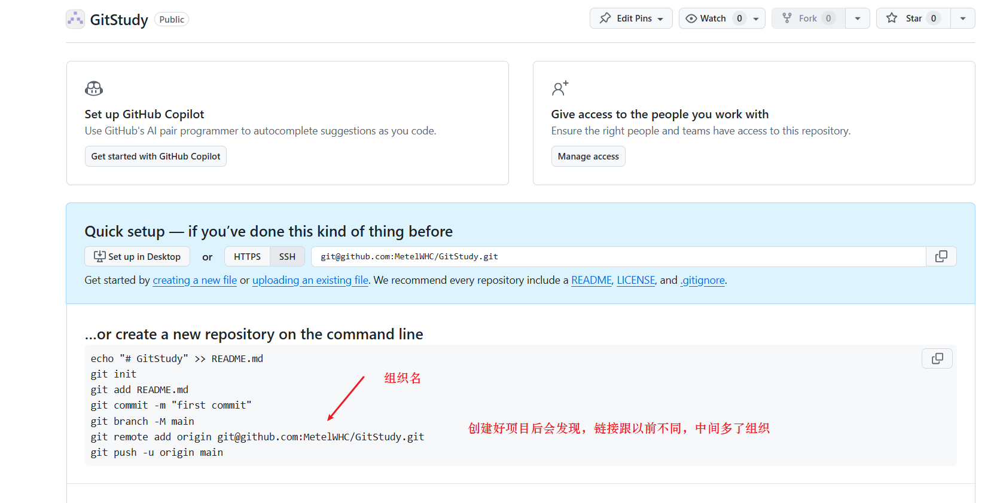

之前学习的版本其实都是提交信息，要真正做git的版本需要使用**Tag标签**来完成。

+ tag标签

  ```console
  git tag -a v1 -m '版本1'  //将tag打在当前分支的最后一次提交记录上
  ```

  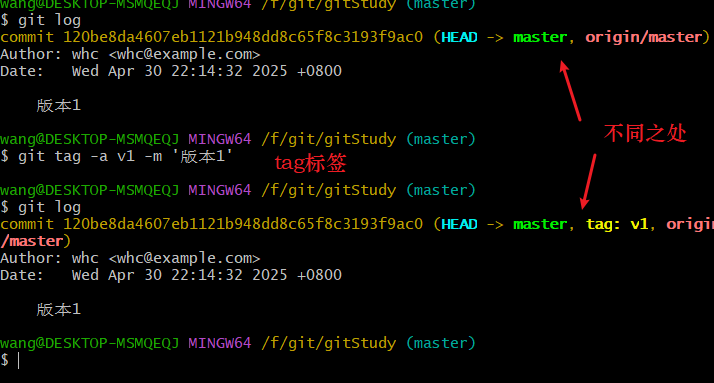

+ 使用tag进行推送

  ```console
  git push origin --tags
  ```

  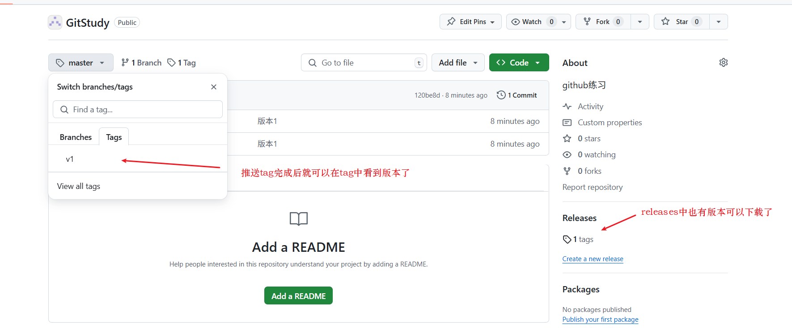

+ 创建dev并切换到dev分支，将以前的两个代码变为一条

  ```
  git checkout -b dev  //其中创建的分支为当前所在分支的子分支
  ```

  

### 7.3 邀请成员并分配权限

组织项目完成后，就可以邀请成员。先让员工创建自己的github账户，然后再邀请。


邀请的方式依然是发邮件。邀请它成为什么成员需要管理者选择。

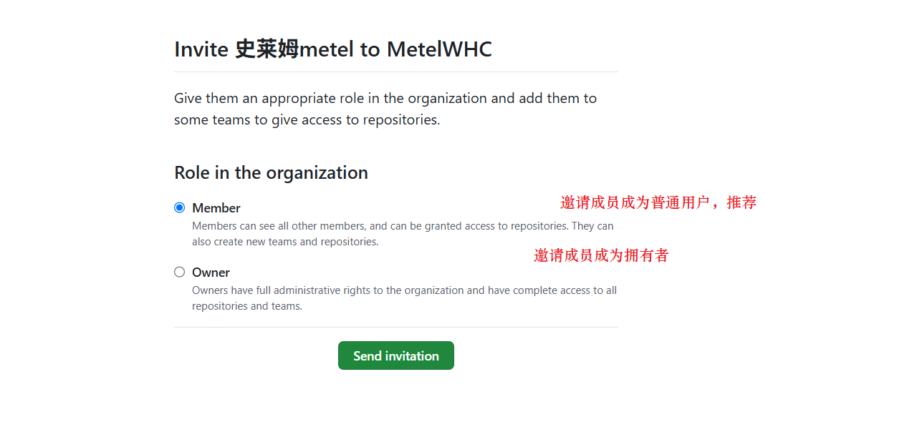

员工加入成功后就可以管理员工成员权限，默认他的权限是只读，需要在组织的setting中修改。

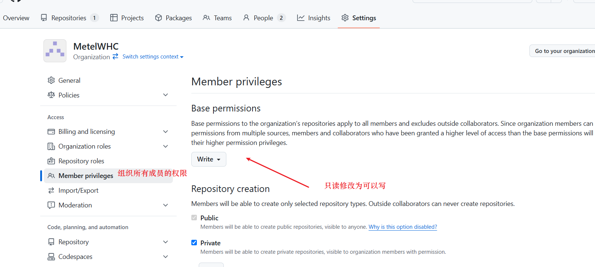

修改完成后，员工就可以拉代码到本地，然后在dev分支上创建自己的分支，开发功能，开发完毕后将功能push到github上即可。

### 7.4 review

如果全部开发完毕，要合并到dev上时，或许需要进行代码**review**。代码review一般是代码管理者或者测试人员使用。他主要是使用

Github上的`pull request`提交合并申请来实现。要使用review先要在项目设置中，设置分支合并规则。

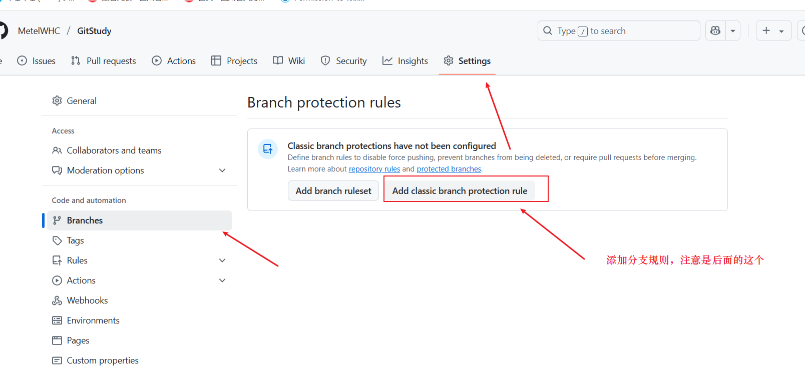

添加review规则到dev分支，我们选择默认就行，当然也可以设置更详细的内容。


创建好review后，要合并内容到dev，就必须review才行，这里登录员工的账户，然后在项目中提交一个**pull request**。

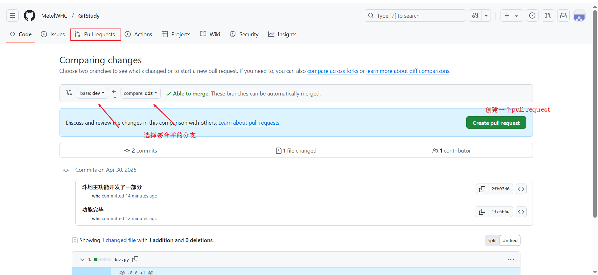

注意：如果是普通的pull request是会直接合并分支的，但设置了review后就需要在管理员中review后才可合并


点开申请后，可以在files change中审核代码，最后审核通过。


完成后dev分支就会合并ddz分支的内容，如果分支没用了，就可以删除


最后再pull一下最新的dev到本地就完成了dev的开发。

> Github的review功能，本质就是再github上要进行合并，让管理者审核后再合并的一种流程。

### 7.5 release

release就是发布版本，相当于dev的功能测试分支，是合并到master前需要的测试流程。

release分为**本地release**与**github的release**两种。

**本地release**就是在本地dev上创建一个release分支，做测试与bug修复，不会再对本身的dev功能进行修改，bug修复完成后，直接使用review流程合并到master上完成上线。


流程走完后，master就拥有dev与release的所有内容。


后面如果需要release和dev保存版本一致，可以直接在本地使用merge指令合并release，再推送到dev分支即可。

最后再pull代码master内容到本地，打上tag标签为版本2，推送tag，至此多人协同开发的流程就算完成了。

> github上的**pull request**的合并过程也会产生冲突，解决冲突跟之前一样。

github的release相当于创建一个线上下载release版本。点击github页面创建release版本，要有**Tag**版本才能创建release版本。


别人下载了release版本也能测试代码，有问题就可修改然后完成后变成下一版。

## 八、git submodule

submodule就是子模块，例如在开发java项目中,可能会把项目分为许多功能，但这些功能又要放入整体项目中才有效果。这时java就会采取两种方式解决：

+ 将子功能打包为jar文件，然后引入项目，可行，但要求功能不能频繁更改；

+ 将子功能以class文件放入项目中，这种就可以频繁更改，但git要管理这种项目，就必须使用submodule才行。

  >注意：嵌套的子项目本身也是一个项目，因此它也有git,submodule管理就相当于git项目中嵌套git项目

### 8.1 搭建submodule项目

在github中创建两个项目，分别为**parent**项目与**child**子项目。在本地也创建两个对应的项目关联远程的项目。该创建过程跟之前创建普通git项项目完全一样。做好后就相当于有两个git项目在github上。

+ 将child项目设置成parent项目的子项目,进入父项目执行

  ```console
  //使用child的远程地址下载内容，mymodule可以是多级目录，但不能存在否则git会报错，它用于存储子项目的内容
  git submodule add git@github.com:WHCmetel/child.git mymodule 
  ```

  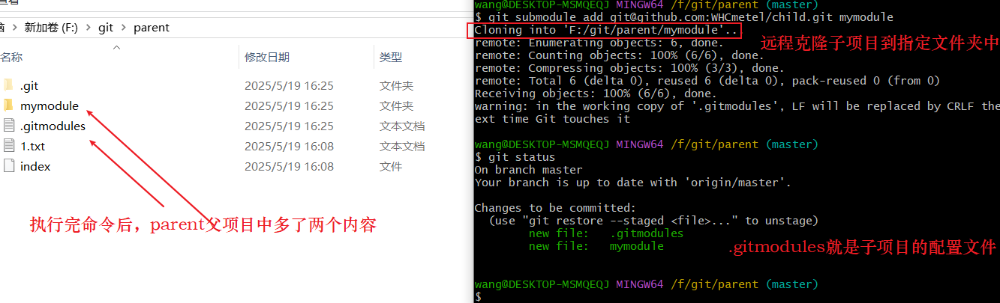

  mymodule文件夹中存放子项目的内容，.gitmodules配置文件配置了子项目的路径

  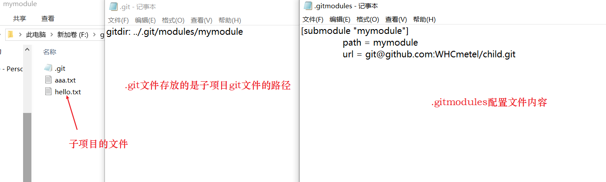

  子项目的.git文件在父亲项目的.git文件中的modules/mymodule文件夹中

  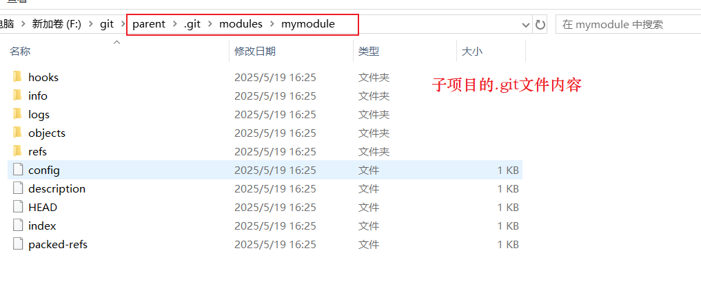

+ 绑定好后，将新增的内容add加commit添加到版本中，然后推送到远程，点击子模块文件夹会直接跳转到子项目

  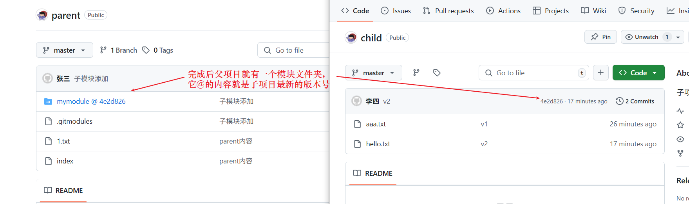

### 8.2 submodule项目操作

当**子项目内容发生变化**。它的操作依然是正常的操作，变化的内容推送到远程即可。

父项目要获取子项目的变化，方式有两种：

+ 进入mymodule目录，执行命令git pull

  

+ 直接在父目录，执行命令，foreach循环pull,这样不仅可以多个子模块同时更新，而且操作简单

  ```console
  git submodule foreach git pull  //子模块多少推荐使用
  ```

  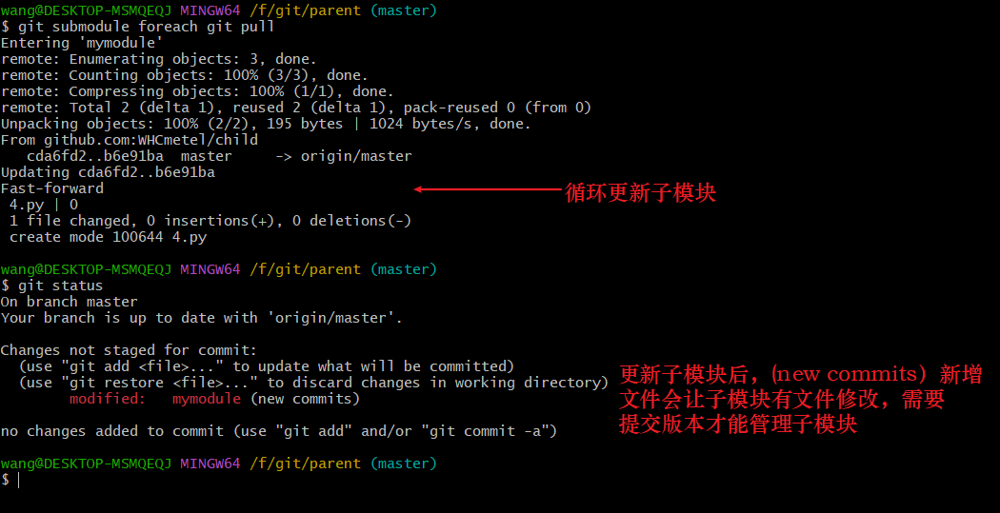

提交子模块版本，并提交到远程。

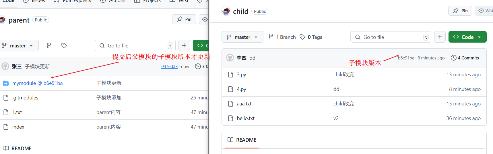

**克隆父项目与子项目的全部内容**,有两种方式：

+ 直接克隆父项目,会发现子模块内容没有，还需要执行识别子模块的命令

  ```console
  git clone git@github.com:WHCmetel/parent.git  parent2 //克隆内容到文件夹parent2中
  git submodule init //识别初始化子模块的内容
  git submodule update --recursive  //更新子模块内容
  ```

  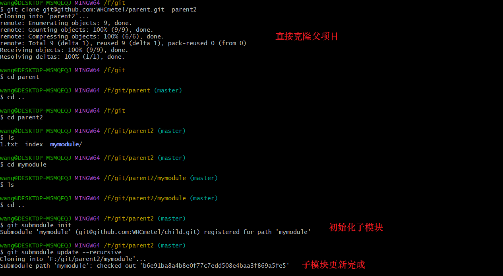

  这时进入子模块会发现，分支不是具体分支而是最新版本，直接切换到主分支就算完成克隆了

  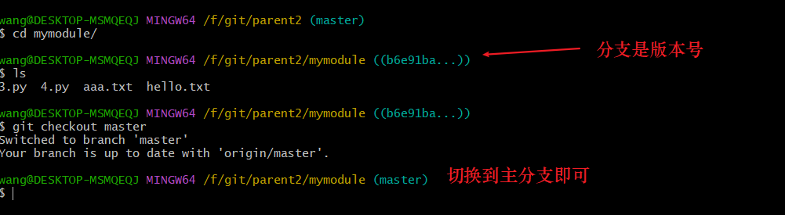

+ 另一种方式是在克隆时加参数

  ```
  git clone git@github.com:WHCmetel/parent.git  parent3 --recursive //所有子模块都克隆下来
  ```

  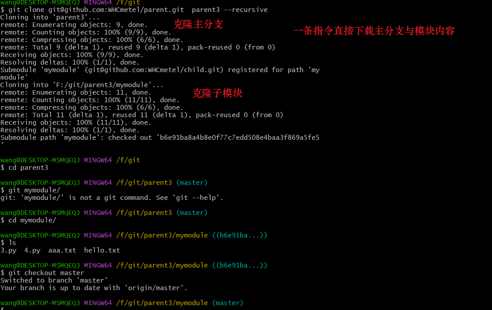

删除子项目，git没有直接的删除方式，可以使用多步指令组合进行删除，删除子模块的步骤

1. **删除子模块目录**：首先，你需要删除子模块的目录和源码。这可以通过执行`rm -rf`子模块目录*命令来完成。

   ```console
   git rm --cached mymodule  //从暂存区移除子模块目录
   rm -rf mymodule //从工作区删除子模块
   ```

2. **编辑.gitmodules文件**：需要编辑项目根目录下的.gitmodules文件，删除与子模块相关的条目。只有一个模块就删除文件。

   ```console
   rm .gitmodules //删除配置文件,删除只有一个子模块的情况
   vim .gitmodules //如果有多个就编辑
   git add .gitmodules 
   ```

3. **编辑.git/config文件**：然后，你需要编辑.git/config文件，删除其中与子模块相关的配置条目。

   ```console
   cd .git
   vim config
   ```

4. **删除.git/modules中的子模块目录**：在.git/modules目录下，每个子模块都有一个对应的目录。你需要删除与要移除的子模块对应的目录。

   ```console
   rm -rf modules/模块目录 //删除modules目录下的模块目录
   ```

5. **清除缓存**：如果在删除子模块后，Git报错，你可以执行`git rm --cached`子模块名称来清除缓存。

6. **提交更改**：完成上述步骤后，你需要提交这些更改到你的仓库。这可以通过执行git commit命令来完成。

   ```console
   git commit -m '版本信息'
   git push
   ```

   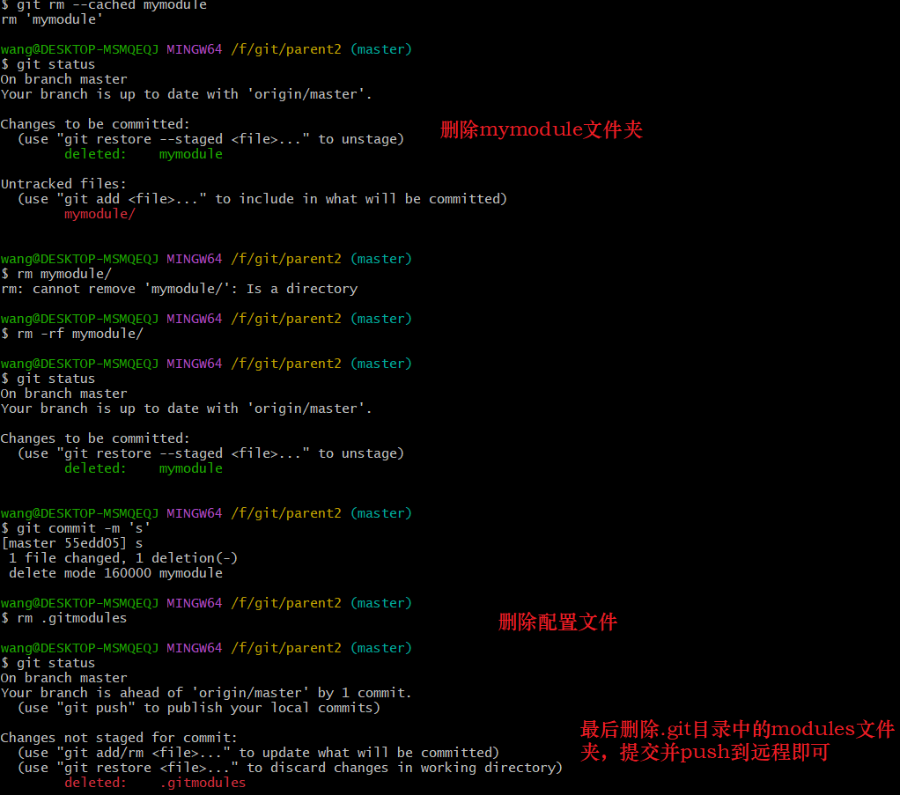

submodule项目外层父模块内容的操作跟以前没有任何区别，只有子模块的内容需要多几步操作。

## 九、git subtree

submodule是git早期解决多模块项目的方案，但其有一些缺点：一是没有删除的指令，并且子模块只能在子项目中修改，父项目中无法修改提交到子项目中。这时git就使用了一个新的技术subtree来完美代替submodule。

```console
git subtree //可直接查看subtree指令
```

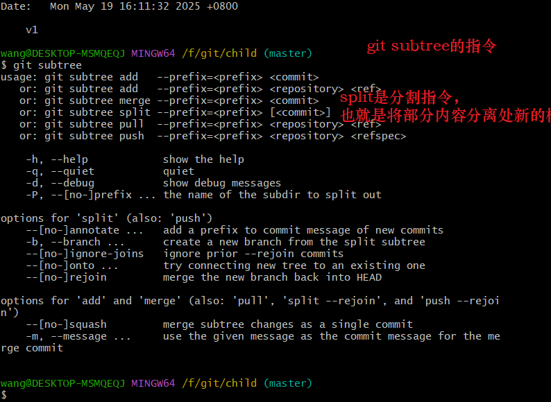

subtree的使用方式跟submodule很相似，也是创建父子项目，绑定远程github，然后再绑定子项目到父项目中。subtree使用流程：

1. 为防止写过多的远程地址，创建一个子项目链接的subtree的origin

   ```console
   git remote add subtree_origin git@github.com:WHCmetel/child.git 
   ```

2. **添加子项目**，并绑定到父项目中,放入的文件夹名称为subtree，可自定义为其他名称，有三种写法

   ```console
   //--squash参数可写可不写
   git subtree add --prefix=subtree subtree_origin master 
   //写法2空格代替=号
   git subtree add --prefix subtree subtree_origin master --squash
   //写法3-P代替--prefix
   git subtree add -P subtree subtree_origin master --squash
   ```

   使用--squash的效果

   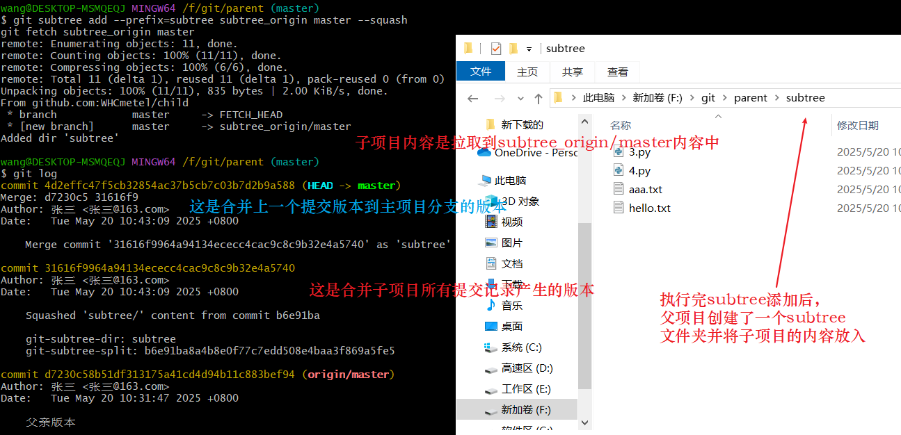

   不使用--squash的效果

   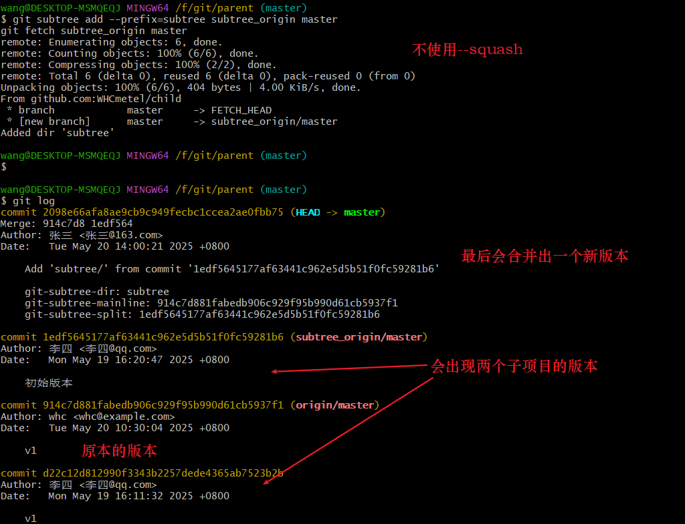

   可以看到不管是否使用--squash，在添加完子项目后，git都会再合并一个版本

   > --squash 参数其实是merge的参数，在之前的rebase中设置s就是它的简写，它的含义是将分支的多个提交版本合并成一个版本由合并的分支提交
   >
   > subtree使用该参数的好处是防止子项目的提交污染父项目，这样父项目的提交就全是父项目的版本，没有子项目的日志版本
   >
   > 注意：subtree如果开始就使用--squash参数，后续所有pull子项目的操作都要加该参数，防止报错。
   >
   > 慎重使用--squash参数，如果没有合并分支提交版本的要求，最好不使用

3. 推送父项目到远程，因为比远程多了两个版本

   ```console
   git push  //父项目
   ```

   

   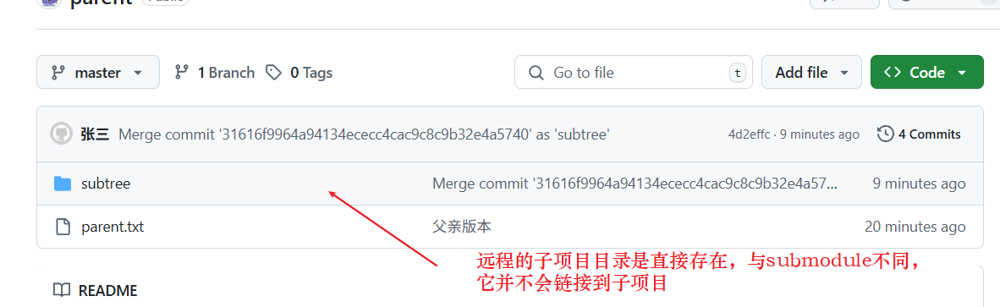

4. 修改子项目内容,提交到远程，该过程正常操作即可

5. 父项目拉取子项目新内容，如果前面使用--squash，这里必须写--squash，拉取完成后提交到父项目远程即可

   ```console
   git subtree pull --prefix=subtree subtree_origin master --squash
   ```

   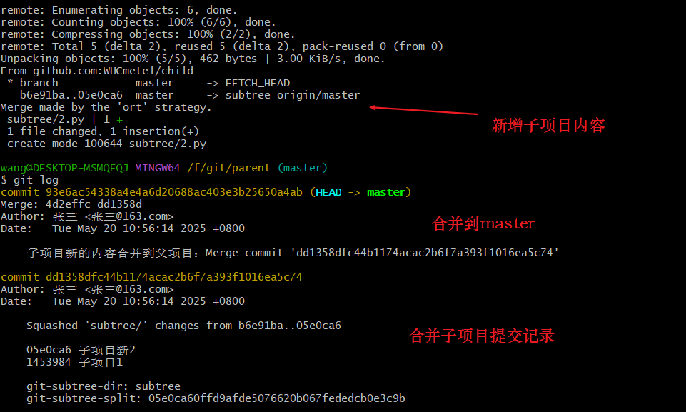

   如果后续不使用--squash，就会报错

   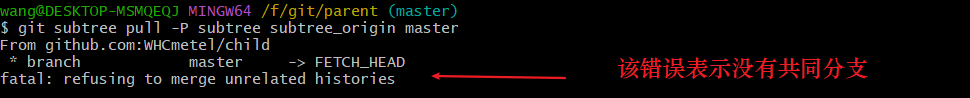

6. **父项目中修改子项目的内容**，并提交到远程,其中子项目也需要提交一次才能修改子项目远程内容

   ```console
   git push //父项目提交远程
   git subtree push --prefix=subtree subtree_origin master  //子项目提交远程
   ```

7. 子项目拉取远程内容，也就是父项目提交的内容

   ```console
   git pull //子项目
   ```

8. 在子项目中再次修改内容，提交到远程，然后父项目拉取子项目内容，这时就会出现一个冲突

   ```console
   git subtree pull --prefix=subtree subtree_origin master --squash
   ```

   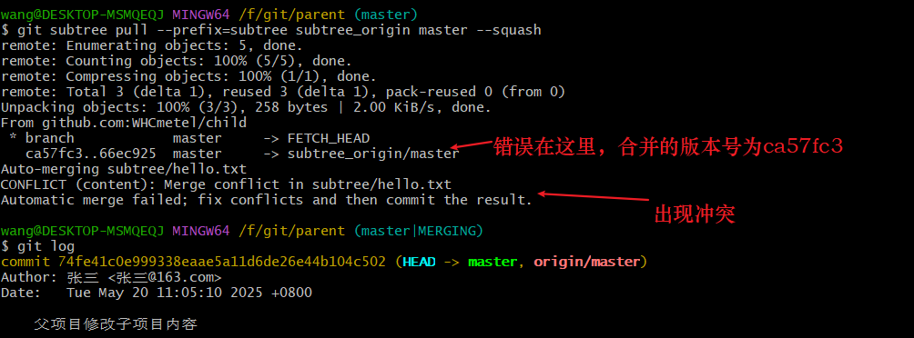

   按照一般情况，这里是不会又冲突的，因为我们的版本都是依次向前，两者都是再最新的版本上修改提交的。这时冲突的内容也不一样。

   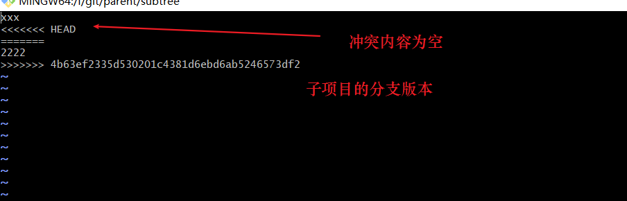

   产生冲突的原因分析：查看日志，发现父项目修改的版本与子项目拉取的版本日志id不同

   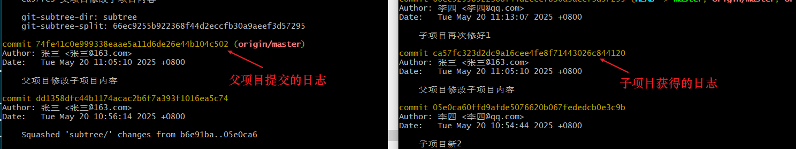

   使用gitk查看，可看到两者没有共同的父项目（本来上边两个日志就是他们共同父亲，但实际不同），因此合并就会产生冲突

   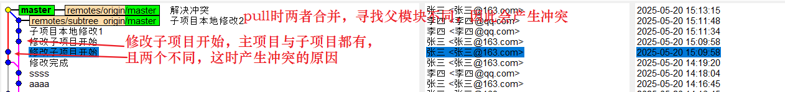

   上述效果产生的原因是父项目中修改子项目的内容，提交时有两个提交：

   + 先是子项目在内部进行了一次提交，产生的版本就是ca57c32
   + 然后子项目的内容合并到父项目，又提交一个版本74fe4，也就是上边两个不同id的日志

   subtree推送到子项目内部的版本是ca57c32版本，与父项目版本74fe4不同。因此当子项目修改内容提交父项目拉取合并时就会产生冲突。因为两者没有共同的父版本。它也相当于父版本提交了一个没有修改内容版本与子版本合并。

   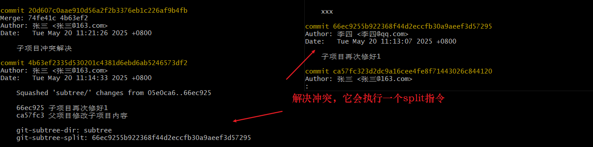

   要避免上述冲突，方法很简单，在父项目推送完子项目后，再从子项目远程pull一次，这样就能保证子项目与主项目版本一致，下次再修改子项目就不会有冲突。

## 十、Github搭建网站

github功能强大，可以很容易的搭建静态网站，有两种方式可以搭建。

### 10.1 仓库网站

创建仓库，但仓库名称必须是账户名.github.io。

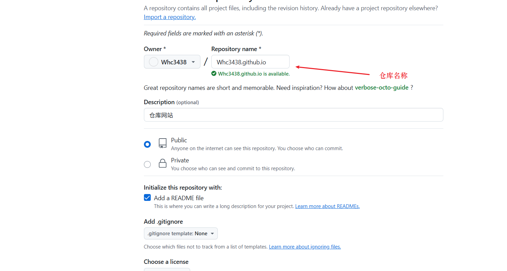


在仓库中创建一个index.html文件作为网页的入口文件。


最后输入链接[whc3438.github.io](https://whc3438.github.io/)，就可直接访问网页内容。这是可以直接在外网访问的网页。

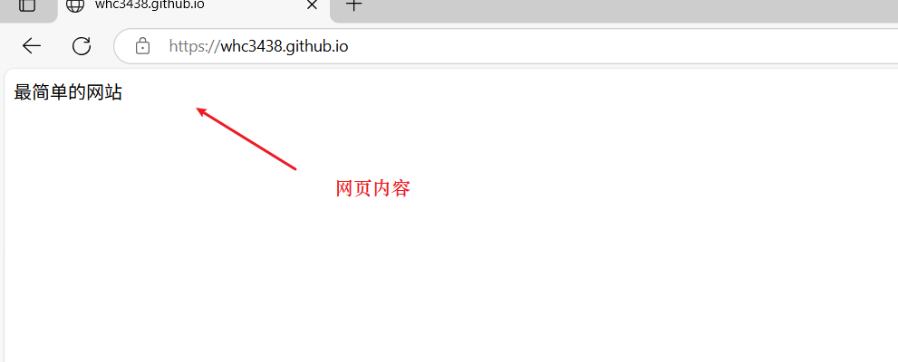

### 10.2 项目网站

1. **创建或选择一个仓库**： 您可以在新仓库或现有仓库中创建，仓库名称随便，注意在项目中创建一个index.html文件

   

2. **进入仓库设置**： 打开您选择的仓库，点击页面顶部的“Settings”（设置）选项卡。

3. **启用 GitHub Pages**： 在设置页面中，向下滚动到“GitHub Pages”部分。 在“Source”（源）下拉菜单中，选择要发布的分支（例如 main 或 master）。 选择分支后，点击“Save”按钮。

4. **自定义域名（可选）**： 如果您有自定义域名，可以在“Custom domain”字段中输入您的域名，然后点击“Save”。

   

5. **等待部署**： GitHub 会自动生成并部署您的网站。几分钟后，您可以通过 https://<username>.github.io/<repository> 访问您的站点。(https://whc3438.github.io/demo1/)

   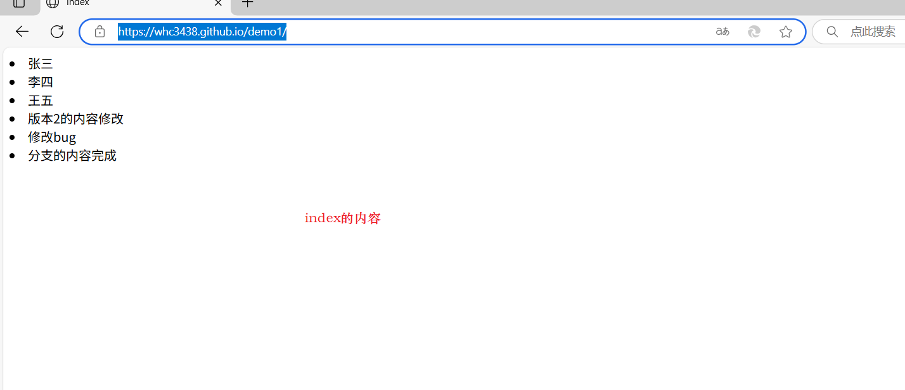

只是简单的文字的网页还不完美，接下来就是使用工具生成网页模板。

GitHub Pages支持多种静态网站生成工具，如**Jekyll**、Hugo、Gatsby等。这些工具可以帮助你快速生成网站结构和内容。

1. **安装Jekyll**：以Jekyll为例，你可以在Mac上通过Homebrew安装**Ruby**和**Jekyll**。只有安装了ruby才能使用jekyll。

2. **创建和预览网站**：使用*jekyll new*命令创建新网站，

   ```console
   jekyll new test-site
   ```

   使用*bundle exec jekyll serve*在本地预览。

   ```
   cd test-site //进入项目
   bundle exec jekyll serve
   ```

   根据控制台地址信息，可以本地预览网页

   

   

3. **配置文件**：编辑`_config.yml`文件来自定义Jekyll网站的设置和选项。

   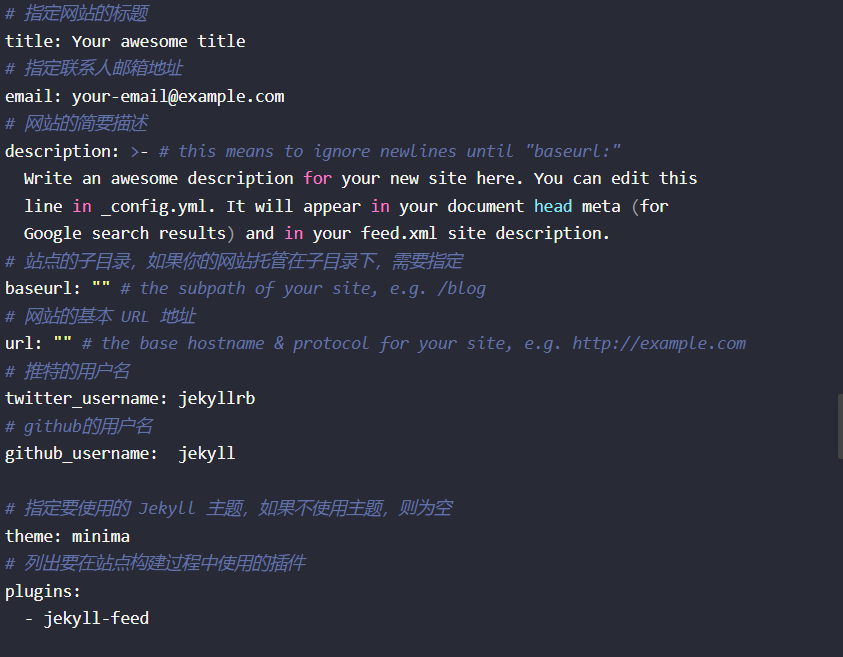

4. **选择模板**：你可以从多个资源中选择Jekyll模板，如官方网站或社区提供的模板集合。下载完成模板后会发现内容跟之前jekyll基本一样，这是只需要修改配置文件，然后使用指令本地预览。http://jekyllthemes.org/themes/not-pure-poole可使用这个模板。

   > 模板网站
   >
   > https://github.com/topics/jekyll-theme
   >
   > https://jamstackthemes.dev/ssg/jekyll/
   >
   > https://jekyllthemes.io/

5. 如果预览失败缺少包，使用指令`bundle install`进行安装

   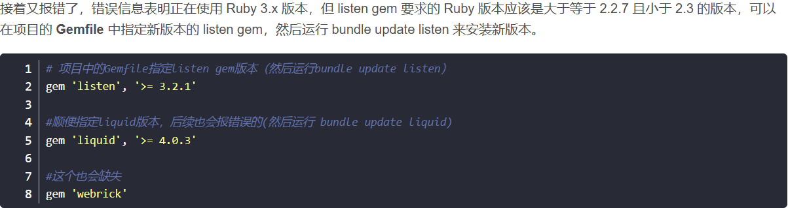

6. **本地调试和发布**：在本地调试模板后，通过Git客户端将内容推送到GitHub仓库，然后通过GitHub Pages的链接访问你的网站。

7. **查看部署进度**：可以在Actions中查看

   


## 十一、 gitLab

github是国外的服务器，而gitlab是可以本地搭建的自己的服务器。它相当于自己做的github服务器。

gitlab是官方网站为：https://about.gitlab.com/

其安装包的下载地址为：https://packages.gitlab.com/gitlab/gitlab-ce

gitlab只能安装在linux系统中，安装的什么系统就按照对应版本的gitlab即可。

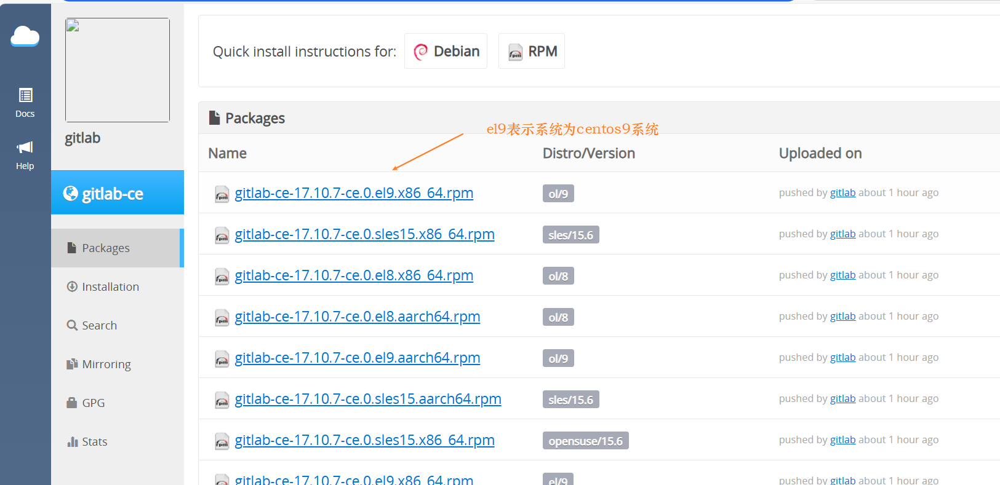

gitlab安装比较复杂，需要安装许多插件，可以去看专门的资料进行安装。安装好后，gitlab的使用基本跟github一样。
