# HTML5基础

[TOC]
```md
##强制换页代码 这是可以写在md文档用于换页的代码
<div style="page-break-after:always;"></div>
```
## 一、网站与网页

**网站**是由许多网页组合构成的，**网页**就是网站中的"一页"，它其实就是由HTML标签编写的HTML格式的文件在浏览器中展示的效果.

### 1.1 HTML简介

**HTML**指的是**超文本标记语言(Hyper Text Markup Language)**,它是用来描述网页内容的一种语言，HTML不是一种编程语言，而是一种简单的**标记语言(markup language)**,标记语言就是用**标记标签**描述内容的语言。

**超文本**的含义：

1. 它不仅使用文字，也可加入图片、声音、动画、多媒体等内容，超越了普通文本的限制
2. 它还可以从一个文件跳转到另一个文件，与多个主机文件链接形成了**超级链接文本**

用HTML编写最简单的网页代码：

```html
<h1> 大标题 </h1>

```

放一张图片01.png在与上边html文件的相同的目录中，浏览器运行效果：

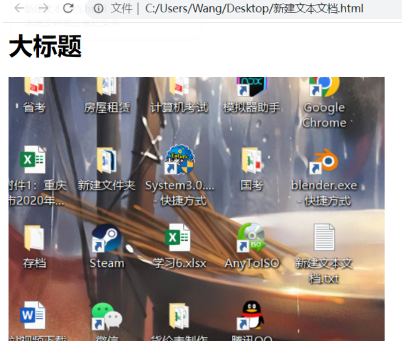

### 1.2 浏览器简介

常用的浏览器有IE、火狐、谷歌、Safari和Opera等，个人使用随意，开发推荐使用谷歌浏览器


**浏览器内核**

| 浏览器                 |    内核     |                      备注                       |
| ---------------------- | :---------: | :---------------------------------------------: |
| IE                     | **Trident** |     IE、猎豹安全、360极速浏览器、百度浏览器     |
| Firefox                |  **Gecko**  |                 火狐浏览器内核                  |
| **Safari**             | **Webkit**  |               **苹果浏览器内核**                |
| **chrome(谷歌)**/Opera |  **Blink**  | chrome/opera浏览器内核。Blink其实是Webkit的分支 |

目前国内大多数浏览器都采用Webkit/Blink内核，如UC、QQ、百度等

### 1.3 Web标准(重点)

**Web标准**是由W3C组织和其他标准化组织制定的一系列标准的集合。**W3C**又叫**万维网联盟**是国际最著名的标准化组织。

web标准的作用就是**防止不同浏览器出现页面或排版差异**，统一化标准显示。

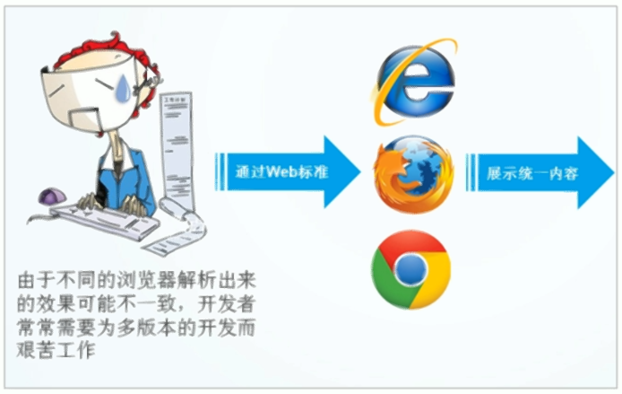

当然除了上述作用外，web标准的好处还有：

1. web内容能被更多的设备访问
2. 网站更易于维护
3. 提高浏览速度
4. 节省网站流量

web标准的组成元素

+ **结构(Structure)**:结构用于对网页元素进行整理和分类、最为重要，目前主要表现的内容就是**HTML**。
+ **表现(Presentation)**:表现用于设置网页元素的版式、颜色、大小等外观样式、主要为**CSS**.
+ **行为(Behavior)**:行为是网页模型的定义以及交互的编写，主要为**JavaScript**。

Web标准的最佳方案就是结构、表现、行为相分离。**简单的理解就是结构写到HTML文件中，表现写到CSS文件中，行为写到js文件中。**

上述最内容最简单理解如下图


## 二、HTML标签

HTML标签书写规范一般都是**放在<>中的成对出现的**，例如:`<html>内容</html>`，第一个是开始标签，有`/`的是结束标签。当然有特殊的单标签`<br \>`，但这种很少，大部分都是双标签成对出现。

标签的关系可以分为两类:**包含关系**与**并列关系**

```html
<!-- 包含关系 -->
<head>
	<title></title>
</head>
<!-- 并列关系 -->
<head></head>
<body></body>
```

### 2.1 HTML的基本结构标签(又称为骨架标签)

页面其他标签也是在基本结构标签中书写的，它是类似页面的框架，是最重要最基本的内容。

第一个html标签案例：
```html
<html>
	<head>
		<title>标题</title>
	</head>
	<body>
		页面中的内容，目前只有这句话
	</body>
</html>
```


|      标签名       | 定义     | 说明                                                 |
| :---------------: | -------- | ---------------------------------------------------- |
|  `<html></html>`  | HTML标签 | 页面中最大的标签，称为**根标签**                     |
|  `<head></head>`  | 头部标签 | 在head标签中必须要设置title标签``                    |
| `<title></title>` | 标题标签 | 网页标题内容的设置                                   |
|  `<body></body>`  | 主体标签 | 元素中包含文档所有内容，基本所有的网页内容都在body中 |

运行效果：
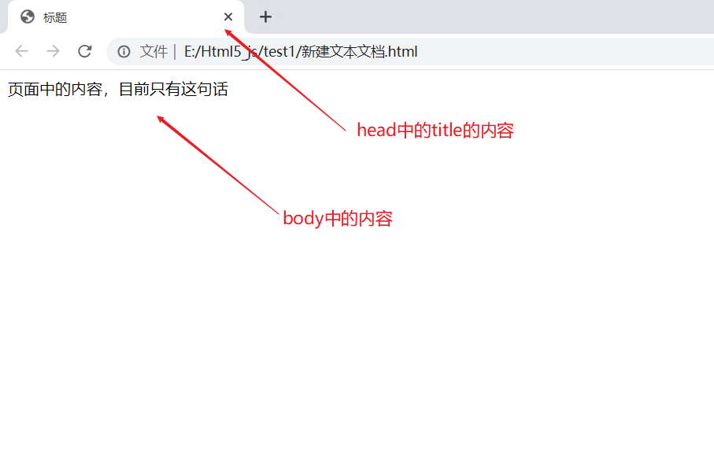

### 2.2 其他结构标签

**文档类型声明标签**`<!DOCTYPE>`，它用于文档类型声明，作用就是告诉浏览器使用哪个HTML版本来显示网页。

`<!DOCTYPE html>`意思是使用**HTML5**版本来显示网页，注意：`<!DOCTYPE html>`必须声明在文件最开始的位置，在`<html>`之前，且该标签并不是HTML标签。

**lang语言显示种类设置**`<html lang='zh-CN>'`就是设置语言为中文，默认为en是英文的意思,该标签就是简单定义网页为英文还是中文，但对于显示来说，定义en也可以在body中写中文显示正常，该属性对浏览器与搜索引擎说有意义的，并且如果要做多语言网页该属性就有用了。`

`<meta>`单标签,主要用于定义页面元素元信息的标签，必须定义在`<head></head>`标签中


其属性有

|                             属性                             |                              值                              | 描述                                         |
| :----------------------------------------------------------: | :----------------------------------------------------------: | -------------------------------------------- |
| [charset](https://www.w3school.com.cn/tags/att_meta_charset.asp) |                        character_set                         | 规定 HTML 文档的字符编码。                   |
|                         **content**                          |                             text                             | 定义与 http-equiv 或 name 属性相关的元信息。 |
|                        **http-equiv**                        | content-security-policy  content-type  default-style  refresh | 把 content 属性关联到 HTTP 头部。            |
|                           **name**                           | application-name  author  description  generator  keywords  viewport | 把 content 属性关联到一个名称。              |
|                          **scheme**                          |                          some_text                           | 定义用于翻译 content 属性值的格式            |

其中` <meta charset="UTF-8">`就是定义文档编码为UTF-8，可以防止网页显示出现乱码的情况，其中UTF-8不要写成utf-8等其他形式防止网页无法识别

**name 属性**

提供了名称/值对中的名称。HTML 和 XHTML 标签都没有**指定任何预先定义的 `<meta>` 名称**。通常情况下，您可以自由使用对自己和源文档的读者来说富有意义的名称。

"keywords" 是一个经常被用到的名称。它为文档定义了一组关键字。某些搜索引擎在遇到这些关键字时，会用这些关键字对文档进行分类。

类似这样的 meta 标签可能对于进入搜索引擎的索引有帮助：

```
<meta name="keywords" content="HTML,ASP,PHP,SQL">
```

如果没有提供 name 属性，那么名称/值对中的名称会采用 http-equiv 属性的值。

**http-equiv 属性**

http-equiv 属性为名称/值对提供了名称。并**指示服务器在发送实际的文档之前先在要传送给浏览器的 MIME 文档头部包含名称/值对**。

当服务器向浏览器发送文档时，会先发送许多名称/值对。虽然有些服务器会发送许多这种名称/值对，但是所有服务器都至少要发送一个：**content-type:text/html**。这将告诉浏览器准备接受一个 HTML 文档。

使用带有 http-equiv 属性的 <meta> 标签时，服务器将把名称/值对添加到发送给浏览器的内容头部。例如，添加：

```
<meta http-equiv="charset" content="iso-8859-1">
<meta http-equiv="expires" content="31 Dec 2008">
```

这样发送到浏览器的头部就应该包含：

```
content-type: text/html
charset:iso-8859-1
expires:31 Dec 2008
```

当然，只有浏览器可以接受这些附加的头部字段，并能以适当的方式使用它们时，这些字段才有意义。

**content 属性**

content 属性提供了名称/值对中的值。该值可以是任何有效的字符串。**content 属性始终要和 name 属性或 http-equiv 属性一起使用。**

**scheme 属性**

scheme 属性用于指定要**用来翻译属性值的方案**。此方案应该在由 <head> 标签的 profile 属性指定的概况文件中进行了定义。

#### 2.2-x 网站TDK三大标签SEO优化(扩展)

**SEO(search Engine Optimization)**名为搜索引擎优化，是一致利用**搜索引擎的规则**提供网站在有关搜索引擎内的自然排名的方式。

seo的目的是对网站进行深度优化，从而帮助网站获取免费的流量，提高网站排名与知名度。

一般页面必须有三个标签用来符合SEO优化：

1. **title**：其具有不可替代性，也是网页第一个重要的标签，是搜索引擎了解网页入口和对网页主题归属的最佳判断点。写法建议：==**网站名(产品名)-网站的简介**==,一般不超过30个汉字。例如：**小米商城**-小米5s、红米Note4、小米MIX、小米笔记本**官方**网站
2. **description**：网站说明，主要介绍网站是做什么的，主要写网站业务和主题，多采用"我们是..."，"xxx网作为...","电话：010..."之类的话语。例如：京东JD.COM-专业的综合网上购物商城，为您提供正品低价的购物选择、优质便捷的服务体验。商品来自全球数十万品牌商家，囊括家电、手机、电脑、服装、居家、母婴、美妆、个护、食品、生鲜等丰富品类，满足各种购物需求。
3. **keyword**s：是**页面的关键词**，是搜索引擎的关注点之一。最好限制为6~8个关键词，关键词用`，`隔开，采用关键词1，关键词2的形式。**关键词越靠前，越容易被引擎搜索**到。例如：网上购物,网上商城,家电,手机,电脑,服装,居家,母婴,美妆,个护,食品,生鲜,京东

具体案例

```html
<!DOCTYPE html>
<html lang="zh-CN">
<head>
    <meta charset="UTF-8">
    <meta name="viewport" content="width=device-width, initial-scale=1.0">
     <!-- description-->
    <meta name="description" content="品优购商城-专业的综合网上购物商城，为您提供正品低价的购物选择、优质便捷的服务体验。商品来自全球数十万品牌
    商家，囊括家电、手机、电脑、服装、居家、母婴、美妆、个护、食品、生鲜等丰富品类，满足各种购物需求。">
    <!-- 关键词 -->
    <meta name="keywords" content="网上购物,网上商城,家电,手机,电脑,服装,居家,母婴,美妆,个护,食品,生鲜,品优购">
    <!-- title -->
    <title>品优购商城-综合网购首选-正品低价、品质保证、配送及时、轻松购物！</title>
</head>
<body>
</body>
</html>
```

一般这些描述会找专业的人员编写。里边用词是十分讲究的。

### 2.3 常用标签

#### 2.3.1 标题标签

为了使网页结构更加明确，HTML提供了6个等级的网页标题，即是`<h1>-<h6>`,h是head单词的缩写，其作用就是体现内容重要性。

加了标题标签的文字会变粗，字号也会依次变大，并且标题会独占一行。

```html
<h1>一级标题</h1>
<h2>二级标题</h2>
<h3>三级标题</h3>
<h4>四级标题</h4>
<h5>五级标题</h5>
<h6>六级标题</h6>
```

运行效果：

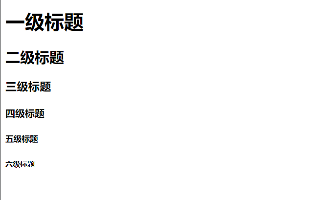

#### 2.3.2 段落标签与换行标签

**段落标签**`<p></p>`默认html文档不会识别文字的换行，默认会把所有文字放到一起，因此要实现段落效果就需要段落标签,p是单词paragraph段落的缩写，它可以明确的把文档分为若干段落。**段落会根据浏览器窗口大小自动换行，且段落与段落之前保有空隙**。

```html
<p>这是一段的文字内容</p>
```

而如果不需要段落间的空隙而是拥有类似回车键的换行效果就需要**换行标签**`<br />`,是break单单词的缩写，该标签是单标签，**效果是强制文本内容换行**。具体两个标签的不同效果看下图

```html
这是一段文字<br />后面是换行的内容
```
运行效果：
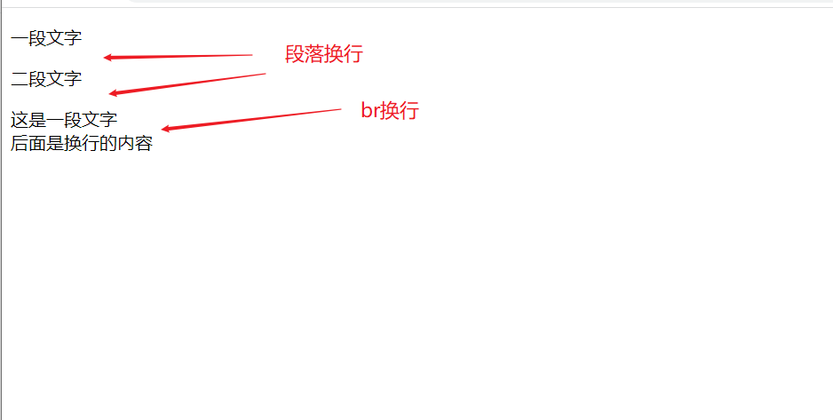

标签说可以**嵌套**的，因此可以在p标签内部同时加上换行标签

```html
<p>一个段落<br />段落换行</p>
```

#### 2.3.3 文字格式标签

常用的文字样式有**粗体、斜体、下划线**等效果，而它们在html都有对应的标签

```html
<b>加粗标签1</b>
<strong>加粗标签2</strong> ##更推荐
<i>倾斜1<i/>
<em>倾斜2</em> ##更推荐
<s>删除线1</s>
<del>删除线2</del> ##更推荐
<u>下划线1</u>
<ins>下划线2</ins> ##更推荐
<!-- 推荐的其实都是比较新的html标签，老版本html可能不支持 -->
```


运行效果：


`<div>`和`<span>`标签，它们是没有特定含义与效果的，一般会将它们看作空盒子，常用于装网页内容实现不同的网页布局。div是division

的缩写表示分区的意思。而span意为跨度、跨距的意思。

```html
<div>这是一个大盒子div,它会默认占一行</div>
<div>这是一个大盒子div,它会默认占一行</div>
<span>小盒子1</span>
<span>小盒子2</span>
<span>小盒子3</span>
```
运行效果：
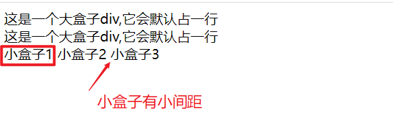

#### 2.3.4 图像标签

图像标签``,它是一个单标签，其中src是必须的属性，否则图像无法显示。图像标签其他属性

|    属性    | 属性值   | 说明                                                         |
| :--------: | -------- | ------------------------------------------------------------ |
|  **src**   | 图片路径 | 必须属性，用于查找图像                                       |
|  **alt**   | 文本     | 替换文本。当图像不能显示时显示的文字                         |
| **title**  | 文本     | 提示文本。鼠标放到图像上显示的文字                           |
| **width**  | 像素     | 设置图像的宽度(**默认宽高只需设置一个，另一个会等比缩放，可以防止图像变形**) |
| **height** | 像素     | 设置图像的高度                                               |
| **border** | 像素     | 设置图像的边框粗细                                           |

```html


<!-- 标签属性的书写不分先后顺序，但中间必须用空格分开，格式采用键值对方式，也就是属性=“属性值”的方式 -->
```

将一张名为01.png的图片放到与html文件同目录下，运行效果：


上边的案例中图片路径是与网页同目录，因此可以直接获得，但大部分项目中它们可能不在一个目录中，因此会使用相对路径或绝对路径。

**相对路径**：是指以引用文件所在位置为参考而建立的目录路径。这里其实就是html文件所在的位置。

| 相对路径分类 | 符号         | 说明                                                         |
| ------------ | ------------ | ------------------------------------------------------------ |
| 同一级路径   | **不写或./** | 图像文件位于html文件同一级，**其中.表示当前目录,/表示下一级**，如`` |
| 上一级路径   | **../**      | 图像文件位于html文件上一级，如` `     |
| 下一级路径   | **/**        | 图像文件位于html文件下一级，如``  |

**绝对路径**：是指绝对的目录位置路径，一般个人电脑就是从盘符开始的路径`E:\Html5_js\111\11\01.png`,注意这种路径是用的斜杠方向，一般不使用，因为该路径只能在个人电脑上使用。而常用的的是网页图片链接的绝对路径，类似百度图片的**链接路径**[百度图标](https://www.baidu.com/img/flexible/logo/pc/result.png)。

```html
<!-- 相对路径 -->

 
<!-- 绝对路径 -->
 
 
```

运行效果：


#### 2.3.5 超链接标签

超链接的效果就是**实现页面跳转的**，也就是一个网页跳转到另一个网页，或者实现页面内的跳转。超链接标签为`<a href=“链接地址”></a>`，是单词**anchor**的缩写，意思是锚点。超链接主要属性有

| 属性名     | 作用                                                         |
| ---------- | ------------------------------------------------------------ |
| **href**   | 指定链接目标的url地址，是必须的属性，没有超链接标签不起作用  |
| **target** | 指定链接页面的打开方式，默认是**_self**，表示在当前页面打开，**_blank**表示在新窗口打开页面 |

链接的分类：

+ **外部链接**，就是直接使用外部网址作为url地址，例如`<a href="https://www.baidu.com/">百度</a>`
+ **内部链接**，是指打开内部不同html页面，使用方式就是内部页面路径,路径跟图片一样
+ **空链接**，没有确定链接目标时，可使用空链接，默认是使用#字符`<a href="#" target="_blank">空标签</a>`
+ **下载链接**，如果href里面的地址是一个文件或者压缩包，则会下载该文件,图片则是打开图片
+ **网页元素链接**，链接的内容不仅可以是文字，图片、音频、表格等都可以添加超链接
+ **锚点链接**，主要用于实现网页内部跳转，使用步骤如下
  + 在href属性中设置#名字的形式 `<a href="#位置" target="_blank">锚点标签</a>`
  + 找到跳转目标位置的标签，在标签属性上写id=刚才链接标签设置的名字 `<p id="位置">跳转的位置</p><br />`

```html
 <a href="https://www.baidu.com/">百度</a> <br />
 <a href="../../tab标签图.html" target="_blank">内部网页跳转</a><br />
 <a href="#位置" target="_blank">锚点标签</a><br />
 <a href="01.rar" target="_blank">下载链接</a><br />
 <a href="#" target="_blank">空标签</a><br />
 <a href="https://www.baidu.com/" target="_blank"></a><br />
 <p id="位置">跳转的位置</p><br />
 
```
运行效果：


#### 2.3.6 audio与video标签

播放音频与视频的标签是audio与video，这是HTML5新增的标签,可直接使用，**这里只是简单的使用，后面有属性专门的介绍**

```html
 <!-- 音频控制 -->
<audio controls>
    <source src="01.mp3" type="audio/mpeg">
</audio>
<p></p>
 <!-- 视频控制 -->
<video width="320" height="240" controls>
    <source src="01.mp4" type="video/mp4">
<video />
```
运行效果：


#### 2.3.7 注释与特殊字符

页面中要不显示某些内容，可使用注释标签包含就行，`<!-- 注释的内容 -->`。这样html执行时就会自动忽略这些内容。代码添加注释可以更方便代码阅读。使用工具一般注释的快捷键说 `ctrl + /`

当html识别空格时，默认无论多少都会只识别一个空格字符，因此要有多空格就要使用空格字符`&nbsp;`，而要显示<>符号也要使用特殊的字`&lt;&gt;`,而取地址符&也需要特殊字符`&amp;`。这四个字符最常用，其他字符可通过查表寻找。

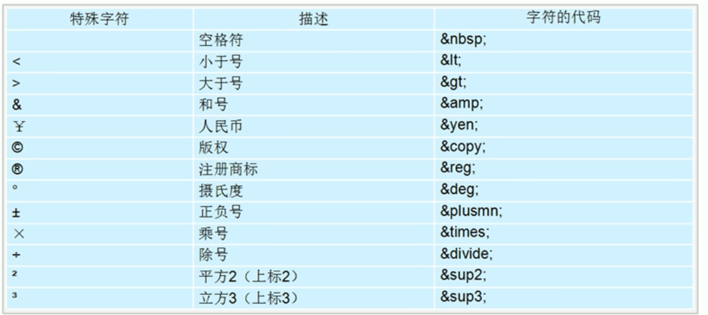

```html
<p>多空格&nbsp;&nbsp;&nbsp;&nbsp;&nbsp;&nbsp;&nbsp;&nbsp;&nbsp;多空格</p>
<p>12&gt;2 2&lt;3</p>
<p>取地址符号&amp;</p>
```
运行效果：
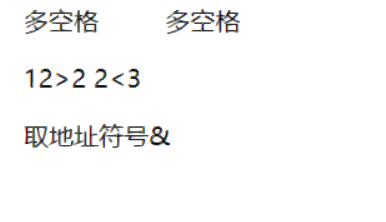

### 2.4 表格标签 table

**表格**主要用于**显示、展示数据**，它可以让数据显示的非常规整，可读性很好。注意它不是用来布局的，而是有条理的展示数据。

表格的基本标签为`<table>`定义表格，`<tr>`（**table row**)定义一行表数据，`<td>`(**table data**)定义一个表格元素,它必须放在`<tr>`中，`<th>`(**table head**)定义一个表头元素，与`<td>`很像但内容会默认加粗并居中。`<thead>与<tbody>`定义表头与表身的区域范围，是**表格的结构标签**。

```html
<table>
        <!-- thead与tbody主要用于划分表头与表内容的区域，可以不写 -->
        <thead>
            <tr>
                <th>序号</th>
                <th>姓名</th>
                <th>性别</th>
                <th>年龄</th>
            </tr>
        </thead>
        <tbody>
            <tr>
                <td>1</td>
                <td>张三</td>
                <td>男</td>
                <td>28</td>
            </tr>
            <tr>
                <td>2</td>
                <td>张四</td>
                <td>男</td>
                <td>29</td>
            </tr>
            <tr>
                <td>3</td>
                <td>张娜</td>
                <td>女</td>
                <td>18</td>
            </tr>
        </tbody>
    </table>
```


运行效果：


上述表格虽然展示数据内容，但感觉样式太丑，这时就可以用**表格简单的属性**来修改样式，后期会用css做出更好的样式

| 属性名      | 属性值              | 描述                                                 |
| ----------- | ------------------- | ---------------------------------------------------- |
| align       | left、center、right | 设置表格的相对周围元素的对其方式，center就是居中对齐 |
| border      | 1或“”               | 设置表格边框的宽度，默认为“”或0表示没有边框          |
| cellpadding | 像素值              | 设置单元格内容与单元格间的间距，默认1像素            |
| cellspacing | 像素值              | 设置单元格与单元格间的间距，默认2像素                |
| width       | 像素值或百分比      | 设置表格宽度                                         |
| height      | 像素值或百分比      | 设置表格高度                                         |

```html
<table align="center" border="1" cellspacing="0" cellpadding="5" width="500">
        <!-- 中间内容与上边代码一样这里就省略了 -->
       ....内容省略
</table>
```

运行效果，表格实际在网页的中间：

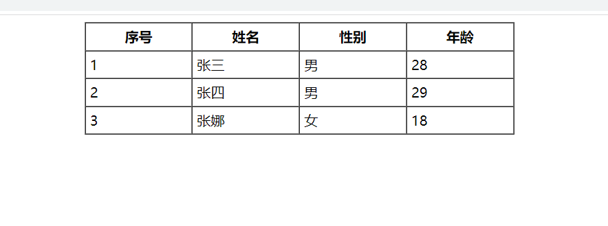

合并单元格就是将多个同行或同列的单元格合并为一个，合并单元格合并方式有

+ **跨行合并**：`rowspan="合并单元格的个数"`
+ **跨列合并**：`clospan="合并单元格的个数"`

合并单元格的三步曲：

1. 先确定是跨行还是跨列合并
2. 找到目标单元格，在单元格标签上添加合并方式=合并单元格数量的属性，例如`<td colspan="3"></td>`
3. **删除合并的多余的单元格**

```html
<table border="1" cellspacing="0" cellpadding="30" width="500">
        <tr>
            <td colspan="3"></td>
            <td></td>
        </tr>
        <tr>
            <td></td>
            <td></td>
            <td></td>
            <td rowspan="2"></td>
        </tr>
        <tr>
            <td></td>
            <td></td>
            <td></td>
        </tr>
 </table>
```
运行效果：
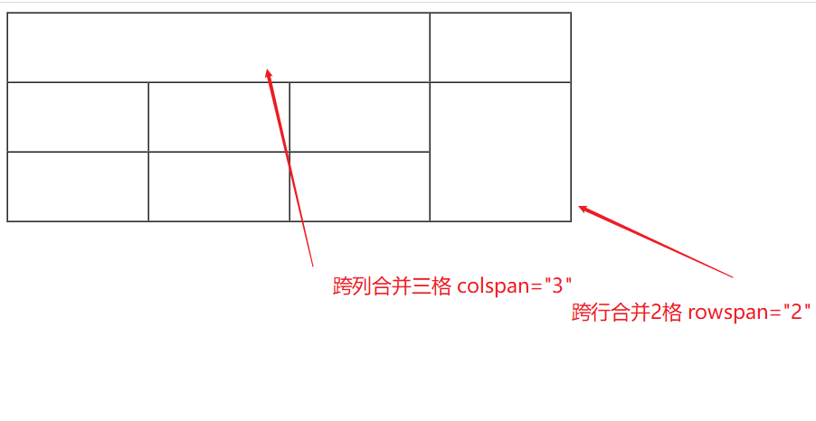

### 2.5 列表标签

表格是用来展示数据的，那**列表就是拿来布局的**，其最大特点就是整齐、整洁、有序、布局方便且自由。

列表可分为三大类：无序列表，有序列表、自定义列表。

#### 2.5.1 无序列表标签(ul 十分重要)

无序列表意思就是列表项`<li>`之间没有顺序之分，`<li>`相当于一个容器，内部可放任何其他元素，布局十分常用。其语法为

```html
 <ul>
        <!-- ul中必须跟li标签，不能使用其他标签，其他标签要写在li中才有效 -->
        <li>精品</li>
        <li>美食</li>
        <li>购物</li>
 </ul>
```

运行效果：

+ 精品
+ 美食
+ 购物

#### 2.5.2 有序列表标签 (ol)

与无序列表相对应，有序列表列表项间就是有顺序的，顺序是从上往下依次上升，使用方法与无序列表一样

```html
<ol>
        <!-- ul中必须跟li标签，不能使用其他标签，其他标签要写在li中才有效 -->
        <li>精品</li>
        <li>美食</li>
        <li>购物</li>
</ol>
```

运行效果：

1. 精品
2. 美食
3. 购物

#### 2.5.3 自定义列表标签(dl)

自定义列表的作用就是定义出有列表头的列表或者有上下级关系的列表，`<dl>`是自定义列表，`<dt>`是自定义列表表头，`<dd>`是自定义列表元素。同理，dl中只能放dt与dd标签。

```html
<dl>
        <dt>娱乐广场</dt>
        <dd>精品</dd>
        <dd>美食</dd>
        <dd>购物</dd>
</dl>
```
运行效果：


列表标签的属性一般不常用，要做出优美的列表还是使用CSS才可以制作。

### 2.6 表单标签 form（重要）

表单是获取用户数据，以及网页间发送数据与后台交互最重要的标签。表单通常由**表单域**、**表单控件(表单元素)**、**提示信息**三部分构成。

**表单域**指一个表单包含的表单元素的区域范围，用`<form>`标签来定义，用于实现表单信息的收集与传递,其常用属性为

| 属性   | 属性值   | 作用                                                |
| ------ | -------- | --------------------------------------------------- |
| action | url地址  | 用于指定接收并处理表单数据的服务器url地址           |
| method | get/post | 设置表单数据的提交方式，一般用post，因为get不太安全 |
| name   | 表单名称 | 指定表单名称，用于区分同一页面不同的表单            |

表单元素，其主要可分为三大类：

+ input 文本输入元素
+ select 下拉表单元素
+ textarea 文本域元素

#### 2.6.1 input表单元素

`<input type="" />`是单标签，有很多类型，其主要是靠**type**属性来设置其元素类型，下面就是其主要包含的类型


简单综合案例：

```html
<form acton="111.php" method="get" name="uname">
        <!-- text文本框 -->
        姓名 <input type="text" name="uname" placeholder="请输入姓名" value="" /> <br /><br />
        <!-- 密码文本框 -->
        密码 <input type="password" name="pwd" /><br /><br />
        <!-- 单选按钮 单选按钮要实现单选效果，name必须一样-->
        男 <input type="radio" name="sex" checked="checked" value="男" />
        女 <input type="radio" name="sex" value="女" /><br /><br />
        <!-- 多选按钮 -->
        爱好: <br />
        篮球 <input type="checkbox" name="like" checked="checked" value="篮球" />
        足球 <input type="checkbox" name="like" value="足球" />
        乒乓球 <input type="checkbox" name="like" value="乒乓球" /><br /><br />
        <!-- 普通按钮 -->
        <input type="text" value="验证码" maxlength="6" /> &nbsp;
        <input type="button" value="输入验证码" />
        <br /><br />
        <!-- hidden不显示给用户的表单元素，但依然要提交数据 -->
        <input type="hidden" value="隐藏" name="hd" />
        <!-- 上传文件 -->
        <input type="file" name="file" /><br /><br />
        <!-- 重置表单 -->
        <input type="reset" value="重置" />
        <!-- 图片类型的提交按钮 -->
        <input type="image" src="01.png" width="30" height="20" />
        <!-- 提交按钮 -->
        <input type="submit" value="提交表单" /><br /><br />
   </form>
```

运行效果：

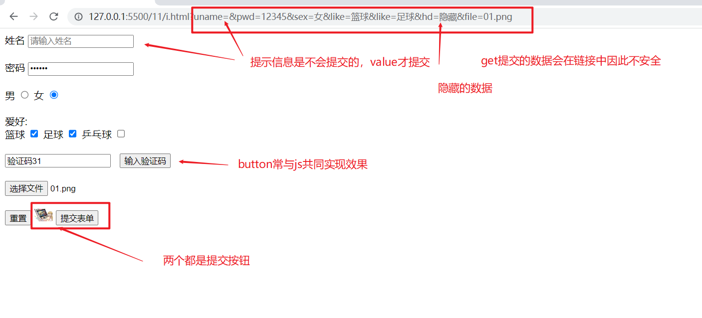


上述表单案例中使用到的属性有：

| 属性        | 属性值     | 描述                                                |
| ----------- | ---------- | --------------------------------------------------- |
| id          | 用户自定义 | 页面元素的唯一标识符，不可重名                      |
| name        | 用户自定义 | 定义input的元素名称，可重名，与服务器交互时十分重要 |
| value       | 用户自定义 | 指定默认要提交的元素值，该数据是会提交到服务器的    |
| checked     | checked    | 指定单选或复选框默认选中的值                        |
| placeholder | 用户自定义 | 文本框用于提示用户输入，该内容是不会提交到服务器的  |
| maxlength   | 正整数     | 规定输入字段的最大长度，后期会用正则表达式完成      |

额外补充，如果要单选复选框点击文字也有选中的效果可使用`<label>`**标注标签**完成，有两种方式：

+ 一种是嵌套直接将input嵌套在label中
+ 第二种则是使用`for属性=input的id`完成

```html
<!-- 单选按钮 单选按钮要实现单选效果，name必须一样-->
        <label>
            男 <input type="radio" name="sex" checked="checked" value="男" />
        </label>
<!-- 更推荐for方式，主要防止html中太多嵌套-->
        <label for="sexid">女</label>
        <input type="radio" name="sex" value="女" id="sexid" /><br /><br />
```

label标签不仅可以增加用户点击体验，并且可当作元素容器，完成各种表单布局。

#### 2.6.2 下拉列表

下拉表单`<select>`就是提前设置选项`<option>`，让用户直接可以选择提交的数据,如果不设置value,默认就是option中的文本值

```html
<select name="st">
    <!-- 设置value为空防止不正确的数据提交-->
            <option selected="selected" value="">请选择地址</option>
            <option>北京</option>
            <option>上海</option>
            <option>广州</option>
            <option>深圳</option>
</select>
```

默认选择的数据就是`selected="selected"`。

#### 2.6.3 文本域

当要输入的文本数据比较多时，就需要使用文本域`<textarea>`来完成,而需要设置行数与列数使用`rows="行数"`与`cols="列数"`,当然最好的还是后续使用CSS来完成。

```html
<textarea rows="10" cols="20" name="tx">许许多多的文本
​    许许多多的文本
​      许许多多的文本
​      许许多多的文本
​      许许多多的文本
​      许许多多的文本
​      许许多多的文本
​      许许多多的文本
​      许许多多的文本
​      许许多多的文本
​      许许多多的文本
​      许许多多的文本
​      许许多多的文本
​      许许多多的文本
​    </textarea>
```

注意，文本域中是识别空格与换行的等字符的

运行效果：


### 2.7 网页的favicon图标

网页的favicon图标使用很简单，就是将一个.ico图标文件放入网页根目录。然后在网页中引入就可之间看到效果

```html
<!DOCTYPE html>
<html lang="zh-CN">
<head>
    <meta charset="UTF-8">
    <meta name="viewport" content="width=device-width, initial-scale=1.0">
    <title>品优购</title>
    <link rel="shortcut icon" href="favicon.ico" type="image/x-icon">
</head>
<body>
</body>
</html>
```

效果

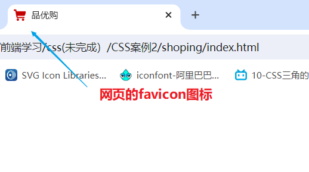

制作ico图片，可以先找到或制作好一个png的透明图片,然后在网页[比特虫]:http://www.bitbug.net/进行ico图标转化。

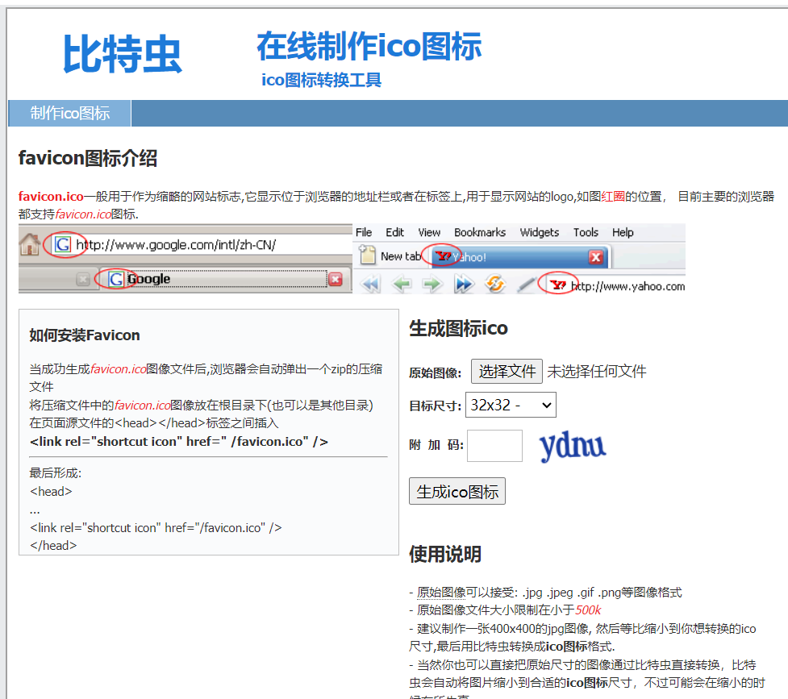


## 三、HTML5标签

HTML5针对以前的不足(例如：制作一个网页**全都使用的是div标签作为盒子**，一个**表单全是input**的问题)，增加了一些**新的标签**、**新的表单**和**新的表单属性**等。

HTML5新增的标签与特性有兼容性要求，基本需要IE9+以上的版本浏览器才支持。

### 3.1 HTML5语义化标签

div虽然可以开发网页，但对搜索引擎很不友好，无法更明确的表示网页结构功能。HTML5新增的语义化标签就可以解决这问题:

+ `<header>`：头部标签
+ `<nav>`:导航栏标签
+ `<artice>`:内容标签
+ `<section>`:定义某个特殊区域标签(比如：五张图有一个比较特殊就可以使用section来表示)
+ `<aside>`:侧边栏标签
+ `<footer>`:底部(尾部)标签

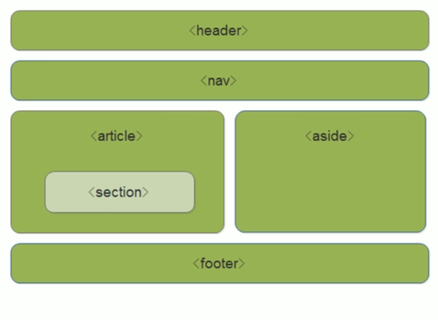

利用上述的标签，就可以更好的布局网页结构如上图一般。

```html
<!DOCTYPE html>
<html lang="en">
<head>
    <meta charset="UTF-8">
    <meta name="viewport" content="width=device-width, initial-scale=1.0">
    <title>Document</title>
    <style>
        header,
        nav,
        footer {
            height: 120px;
            background-color: aquamarine;
            border-radius: 15px;
            width: 800px;
            margin: 15px auto;
        }
        article {
            border-radius: 15px;
            width: 800px;
            height: 300px;
            margin: 15px auto;

        }
        section,
        aside {
            float: left;
            width: 320px;
            height: 260px;
            margin: 20px 0;
            background-color: pink;
            line-height: 260px;
            text-align: center;
        }
        aside {
            float: right;
        }
    </style>
</head>
<body>
    <header>头部标签</header>
    <nav>导航栏标签</nav>
    <article class="center">
        <section>某个区域</section>
        <aside>侧边栏</aside>
    </article>
    <footer>底部标签</footer>
</body>
</html>
```

效果


这种语义化标签主要针对搜索引擎的，新的标签也可以在页面多次使用，比如两个footer。

IE9中需要把这些元素转化为块级元素，也就是写如下代码在css中：

```css
header,nav,footer,article,section,aside {
        display: block;
}
```

> **移动端更喜欢使用这类标签,如果网页需要转化为移动端内容，多使用这种标签可以更好转化**

### 3.2 HTML5多媒体标签

在前面已经简单使用过`<video>`与`<autio>`标签，下面就详细讲解这两个标签的使用规则与属性。

#### 3.2.1 video视频标签

HTML在不使用插件的情况下也支持原生视频播放，其支持的格式是有限的，且在不同浏览器下不同

|      浏览器       |                          Mp4                           | WebM | Ogg  |
| :---------------: | :----------------------------------------------------: | :--: | :--: |
| internet Explorer |                          YES                           |  NO  |  NO  |
|      Chrome       |                          YES                           | YES  | YES  |
|      Firefox      | YES，从FireFox21版本开始<br />Linux系统从FireFox30开始 | YES  | YES  |
|      Safari       |                          YES                           |  NO  |  NO  |
|       Opera       |                 YES,从Opera25版本开始                  | YES  | YES  |

从表格可以看出，大部分浏览器都支持Mp4，默认使用Mp4格式即可。video使用最简单的代码:

` <video src="小米视频.mp4" controls></video>`

如果为了防止兼容性问题，可以同时准备多种视频，采用如下**兼容性写法**

```html
<!-- 兼容性写法 -->
<video width="320" height="240" controls>
    <source src="小米视频.mp4" type="video/mp4">
    <source src="小米视频.ogg" type="video/mp4">
    您的浏览器不支持video标签。
</video>
```

video的常用属性

|     属性     |    值     |                             描述                             |
| :----------: | :-------: | :----------------------------------------------------------: |
| **autoplay** | autoplay  | 视频加载好就自动播放(谷歌浏览器自动播放有问题，需要同时添加muted属性才能解决问题) |
| **controls** | controls  | 显示播放控件，例如暂停、播放等按钮。**不同浏览器控件样式不同**，如果要统一需要使用js |
|  **width**   |  像素值   |                           视频宽度                           |
|  **height**  |  像素值   |                           视频高度                           |
|   **loop**   |   loop    |                         视频循环播放                         |
|   preload    | auto/none | 规定是否在未播放前**预先加载视频**，如果设置了`autoplay`就表示要预先加载,忽略该属性 |
| **==src==**  |    url    |                       视频路径(必须的)                       |
|  **poster**  |  Imgurl   |              视频未播放或加载未完成时显示的图片              |
|  **muted**   |   muted   |                           静音播放                           |

```html
<!DOCTYPE html>
<html lang="en">
<head>
    <meta charset="UTF-8">
    <meta name="viewport" content="width=device-width, initial-scale=1.0">
    <title>简单的视频属性案例</title>
</head>
<body>
    <!-- 自动静音循环播放视频 属性名与属性值相同时有两种写法-->
    <video src="小米视频.mp4" width="320" height="240" autoplay muted loop="loop"></video>
    <!-- 有播放控件的视频 -->
    <video src="小米视频.mp4" height="240" controls="controls" poster="001.jpg" preload="none"></video>
</body>
</html>
```

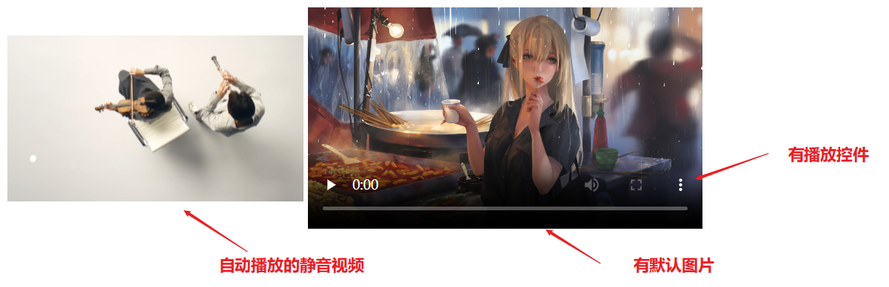

#### 3.2.2 audio音频标签

音频标签支持的格式：

|      浏览器       | Mp3  | Wav  | Ogg  |
| :---------------: | :--: | :--: | :--: |
| internet Explorer | YES  |  NO  |  NO  |
|      Chrome       | YES  | YES  | YES  |
|      Firefox      | YES  | YES  | YES  |
|      Safari       | YES  | YES  |  NO  |
|       Opera       | YES  | YES  | YES  |

大部分浏览器都支持mp3，因此使用mp3格式音频即可。如果考虑兼容性，依然有其兼容性写法

```html
<!-- 兼容性写法 -->
<audio controls="controls">
    <source src="音频.mp3" type="audio/mpeg">
    <source src="音频.ogg" type="audio/ogg">
    您的浏览器不支持audio标签。
</audio>
```

音频标签的属性

|     属性     |    值    |                             描述                             |
| :----------: | :------: | :----------------------------------------------------------: |
| **autoplay** | autoplay | 已过时，页面加载好自动播放(大部分浏览器自动播放功能被禁用，需要使用js才能完成该功能) |
| **controls** | controls | 显示播放控件，例如暂停、播放等按钮。**不同浏览器控件样式不同**，如果要统一需要使用js |
|   **loop**   |   loop   |                           循环播放                           |
|   **src**    |   url    |                           音频路径                           |

```html
<!DOCTYPE html>
<html lang="en">
<head>
    <meta charset="UTF-8">
    <meta name="viewport" content="width=device-width, initial-scale=1.0">
    <title>Document</title>
</head>
<body>
    <!-- 带控件的循环播放音频 -->
    <audio src="音频.mp3" loop controls></audio>
</body>
</html>
```

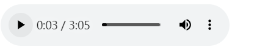

默认开始不播放，点击播放后就无限循环。上边音频没法控制宽高，可使用`object`的写法

```html
<!DOCTYPE html>
<html lang="en">
<head>
    <meta charset="UTF-8">
    <meta name="viewport" content="width=device-width, initial-scale=1.0">
    <title>Document</title>
</head>
<body>
     <!-- 嵌入网页的音频写法 -->
    <object data="音频.mp3" width="100" height="50"></object>
</body>
</html>
```


要真正实现上述效果，最好使用js完成，保证兼容性与样式一致。

### 3.3 新增input类型

为了满足用户各种类型的输入，HTML5新增许多input类型(红色的最常用)表示不同表单类型，可以限制用户输入内容，防止错误。

|     属性值     |            说明             |
| :------------: | :-------------------------: |
|   **email**    | 限制用户输入必须是Email类型 |
|    **url**     |  限制用户输入必须是URL类型  |
|    **date**    | 限制用户输入必须是日期类型  |
|    **time**    | 限制用户输入必须是时间类型  |
|   **month**    | 限制用户输入必须是月份类型  |
|    **week**    |  限制用户输入必须是周类型   |
| ==**number**== | 限制用户输入必须是数字类型  |
|  ==**tel**==   |          手机电话           |
| ==**search**== |           搜索框            |
|   **color**    |    生成一个颜色选择表单     |

```html
<!DOCTYPE html>
<html lang="en">
<head>
    <meta charset="UTF-8">
    <meta name="viewport" content="width=device-width, initial-scale=1.0">
    <title>Document</title>
</head>
<body>
    <form action="">
        <ul>
            <li>邮箱: <input type="email" /></li>
            <li>网址: <input type="url" /></li>
            <li>日期: <input type="date" /></li>
            <li>时间: <input type="time" /></li>
            <li>数字: <input type="number" /></li>
            <li>手机号码: <input type="tel" /></li>
            <li>搜索: <input type="search" /></li>
            <li>颜色: <input type="color" /></li>
            <li><input type="submit" value="提交" /></li>
        </ul>
    </form>
</body>
</html>
```


验证效果

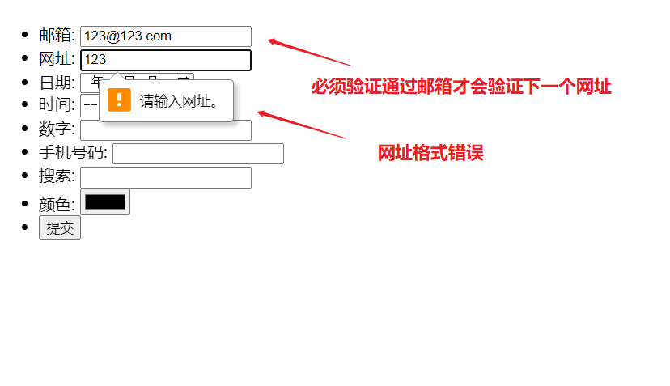
其他内容的效果


这些表单类型在手机页面也是直接有效的，且显示的样式更好看。


### 3.4 新增表单属性

html5新增表单属性可以帮助我们完成更多想要的功能,常用的如下

|        属性         |    值     |                             说明                             |
| :-----------------: | :-------: | :----------------------------------------------------------: |
|  ==**required**==   | required  |             表单拥有该属性表示内容不能为空，必填             |
| ==**placeholder**== | 提示文本  |            表单提示信息，只显示不影响value值内容             |
|  **==autofocus==**  | autofocus |         自动聚焦属性，页面加载完成自动聚焦到指定表单         |
|    autocomplete     |  off/on   | 常结合search类型使用，默认是on开启的，要使用该功能确保name属性有值，且成功提交过，这样才会**出现以前的输入记录**。为了安全不保留提交记录可以off关闭 |
|    **multiple**     | multiple  | 多选文件提交，一般与file类型的input一起使用，可以同时提交多个文件 |

```html
<!DOCTYPE html>
<html lang="en">
<head>
    <meta charset="UTF-8">
    <meta name="viewport" content="width=device-width, initial-scale=1.0">
    <title>Document</title>
    <style>
        input::placeholder {
            /* 修改提示文字的颜色 */
            color: red;
        }
    </style>
</head>
<body>
    <form action="">
        <input type="search" name="" id="" required="required" placeholder="提示文字" />
        <!-- 自动聚焦 -->
        <input type="text" name="" id="" autofocus />
        <!-- 输入提示以前的记录 -->
        <input type="search" autocomplete="on" name="zhangsan">
        <!-- 多选文件 -->
        <input type="file" name="" multiple="multiple">
        <input type="submit" value="提交" />
    </form>
</body>
</html>
```

效果

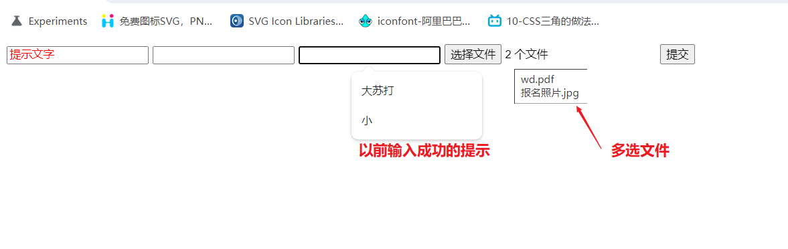

## 额外资料网站

html权威的网站：https://www.w3school.com.cn/

web知识权威网站：https://developer.mozilla.org/zh-CN/

简单案例较多的菜鸟驿站网站：https://www.runoob.com/

