# SVG

## 一、 svg的基本概念

**svg**是解决**网站图标**问题的最佳方案，svg是基于**XML语法**的图像格式，英文全称为**Scalable Vector Graphics**，译为可缩放矢量图形，简称矢量图。所谓**矢量图**，就是使用直线和曲线来描述的图形，构成这些图形的元素是一些点、线、矩形、多边形、圆和弧线等，它们都是通过**数学公式**计算获得的，具有编辑后不失真的特点。

矢量图以几何图形居多，图形可以无限放大，不变色、不模糊。常用于图案、标志、VI、文字等设计。常用软件有：CorelDraw、Illustrator、Freehand、XARA、CAD等。

矢量图的优点：

1.  文件小，图像中保存的是线条和图块的信息，所以与分辨率和图像大小无关，只与图像的复杂程度有关；
2.  图像可以无限级缩放，对图形进行缩放，旋转或变形操作时，图形不会产生锯齿效；
3.  可采取高分辨率印刷，矢量图形文件可以在任何输出设备打印机上以打印或印刷的最高分辨率进行打印；
4.  矢量图与位图的效果是天壤之别，矢量图无限放大不模糊，大部分位图都是由矢量导出来的，也可以说**矢量图就是位图的源码，源码是可以编辑的**。

svg是一种文本文件，它的内容是属于对图像形状的描述，它的体积一般比较小。由于它是符合W3C的标准，因此可直接用于HTML网页标签语言。

矢量图常用的网站：https://www.iconfont.cn/

https://www.iconstore.co/

svg代码最简单的引入：

```html
<!DOCTYPE html>
<html lang="en">
<head>
    <meta charset="UTF-8">
    <meta name="viewport" content="width=device-width, initial-scale=1.0">
    <title>svg</title>
</head>
<body>
     <!-- 使用img的src引入svg文件内容 -->
    
</body>
</html>
```

## 二、svg标签语言

XML本身是一种严格的标签语言，因此svg描述图像的内容都是使用svg标签来完成的。svg的标签形式**写法严格**不能像html标签那么随意省略一半标签。

### 2.1 svg标签(画布标签)

svg所有的标签内容都会放到一个svg容器中，它就是svg标签`<svg></svg>`，它类似html文件的`<html></html>`标签。

该标签又可以称为画布或者画板，相当于我们绘制图像最底层的一种画纸。

```html
<!DOCTYPE html>
<html lang="en">
<head>
    <meta charset="UTF-8">
    <meta name="viewport" content="width=device-width, initial-scale=1.0">
    <title>svg</title>
</head>
<body>
    
    <br>
    <!-- 创建一张200*300的画布 -->
    <svg width="200" height="300"></svg>
</body>
</html>
```

### 2.2 基本图形标签

svg中有一些预定义的形状元素，它们分别是**矩形rect**、**圆形circle**、**椭圆形ellipse**、**线条line**、**多线条polyline**、**多边形polygon**、**路径path**。


基本图形主要包括是**矩形**、**圆**与**椭圆**。

**矩形rect**是单词rectangle的缩写，它是一个单标签`<rect/>`。,**/**一般不能省略，表示标签闭合，html中省略的写法不规范的。

矩形标签的属性

|        属性        | 效果                                                         |
| :----------------: | ------------------------------------------------------------ |
|     **width**      | 定义矩形的宽度                                               |
|     **height**     | 定义矩形的高度                                               |
|      **fill**      | 定义填充颜色，默认黑色，值可以是颜色名称，rgb颜色值以及十六进制颜色值等，none表示不填充 |
|  **fill-opacity**  | 定义填充颜色的不透明度，值是0~1，1是完全不透明，0是完全透明  |
|  **stroke-width**  | 定义边框（描边）宽度                                         |
|     **stroke**     | 定义边框（描边）颜色                                         |
| **stroke-opacity** | 定义边框（描边）颜色的不透明度，值是0~1，1是完全不透明，0是完全透明 |
|      **x值**       | 定义矩形的左边位置距离画布边缘的距离，也是矩形左上角x轴的坐标 |
|      **y值**       | 定义矩形的顶部位置距离画布边缘的距离，也是矩形左上角y轴的坐标 |
|    **opacity**     | 定义整个元素的不透明度，fill-opacity与stroke-opacity相当于它的子属性 |
|       **rx**       | 定义圆角x轴方向的半径长度                                    |
|       **ry**       | 定义圆角y轴方向的半径长度                                    |

矩形代码案例：

```html
<!DOCTYPE html>
<html lang="en">
<head>
    <meta charset="UTF-8">
    <meta name="viewport" content="width=device-width, initial-scale=1.0">
    <title>svg</title>
</head>
<body>
    <svg width="400" height="500">
        <!-- 300*100像素大小，3像素黑色描边蓝色填充的矩形 -->
        <rect width="300" height="100" fill="blue" stroke-width="3" stroke="#000000"/>


        <!-- 矩形左上角坐标为(20,120) 大小150*150px 蓝色填充不透明度0.1 西红柿色描边5px不透明度0.5 -->
        <rect x="20" y="120" width="150" height="150" fill="blue" stroke-width="5" stroke="tomato" 
        fill-opacity="0.1" stroke-opacity="0.5">
        </rect>

        <!-- 矩形左上角坐标为(20,280) 大小150*150px 蓝色填充不透明度0.7 西红柿色描边5px不透明度0.7-->
        <rect x="20" y="280" width="150" height="150" fill="blue" stroke-width="5" stroke="tomato" 
        opacity="0.7">
        </rect>
    </svg>
    <br>
    <svg width="400" height="180">
        <!-- 圆角矩形 -->
        <rect x="50" y="20" width="150" height="100" fill="red" stroke="black" stroke-width="5" 
        opacity="0.5" rx="10" ry="20"/>
    </svg>
</body>
</html>
```

绘制的4个矩形的效果


**圆形circle**,它也是一个单标签`<circle/>`。

圆形标签的属性

|        属性        | 效果                                                         |
| :----------------: | ------------------------------------------------------------ |
|      **cx值**      | 定义圆心x轴的坐标，省略默认值为0                             |
|      **cy值**      | 定义圆心y轴的坐标，省略默认值为0                             |
|       **r**        | 定义圆的半径                                                 |
|      **fill**      | 定义填充颜色，默认黑色，值可以是颜色名称，rgb颜色值以及十六进制颜色值等，none表示不填充 |
|  **fill-opacity**  | 定义填充颜色的不透明度，值是0~1，1是完全不透明，0是完全透明  |
|  **stroke-width**  | 定义边框（描边）宽度                                         |
|     **stroke**     | 定义边框（描边）颜色                                         |
| **stroke-opacity** | 定义边框（描边）颜色的不透明度，值是0~1，1是完全不透明，0是完全透明 |
|    **opacity**     | 定义整个元素的不透明度，fill-opacity与stroke-opacity相当于它的子属性 |

> [!NOTE]
>
> 注意：图形只要有填充色与描边的都有**fill**、**stroke**、**opacity**相关的属性，因此后续将不会重复说明

圆形代码案例：

```html
<!DOCTYPE html>
<html lang="en">
<head>
    <meta charset="UTF-8">
    <meta name="viewport" content="width=device-width, initial-scale=1.0">
    <title>svg</title>
</head>
<body>
    <svg width="100" height="200">
        <!-- 半径40，位置（50，80）描边红色填充绿色的圆形 -->
        <circle cx="50" cy="80" r="40" stroke="red" stroke-width="3" fill="green" opacity="0.6"/>
    </svg>
</body>
</html>
```

效果

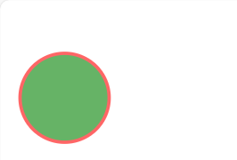

**椭圆ellipse**,它也是一个单标签`<ellipse/>`。

ellipse属性

|   属性   | 效果                                 |
| :------: | ------------------------------------ |
| **cx值** | 定义椭圆圆心x轴的坐标，省略默认值为0 |
| **cy值** | 定义椭圆圆心y轴的坐标，省略默认值为0 |
|  **rx**  | 定义椭圆x轴的半径                    |
|  **ry**  | 定义椭圆y轴的半径                    |

椭圆代码案例：

```html
<!DOCTYPE html>
<html lang="en">
<head>
    <meta charset="UTF-8">
    <meta name="viewport" content="width=device-width, initial-scale=1.0">
    <title>svg</title>
</head>
<body>
    <svg width="500" height="200">
        <!-- 椭圆形 -->
        <ellipse cx="200" cy="80" rx="100" ry="50" stroke="purple" stroke-width="3" fill="yellow" opacity="0.6"/>
    </svg>
    <br>
    <svg width="500" height="150">
        <!-- 3个堆叠的椭圆 注意其书写顺序以及显示顺序 最下面的显示在最上方，因为其cx，cy值最小-->
        <ellipse cx="240" cy="100" rx="220" ry="30" fill="purple"></ellipse>
        <ellipse cx="220" cy="70" rx="190" ry="20" fill="lime"></ellipse>
        <ellipse cx="210" cy="45" rx="170" ry="15" fill="yellow"></ellipse>
    </svg>
    <br>
    <svg width="500" height="100">
        <!-- 空心椭圆 -->
        <ellipse cx="240" cy="50" rx="220" ry="30" fill="blue"/>
        <ellipse cx="220" cy="50" rx="190" ry="20" fill="white"/>
    </svg>
</body>
</html>
```

效果


### 2.3 线型形状 

线型形状主要包括是**线条**、**多边型**与**多线条**。

**线条line**,又称线段，它是一个单标签`<line/>`。

line属性

|   属性   | 效果                  |
| :------: | --------------------- |
| **x1值** | 定义线条起点坐标的x值 |
| **y1值** | 定义线条起点坐标的y值 |
| **x2值** | 定义线条终点坐标的x值 |
| **y2值** | 定义线条终点坐标的y值 |

svg参考的坐标系都是**屏幕坐标系**，也就是画布左上角为坐标系原点(0,0),向右是x轴正方向，向下是y轴正方向。之前基本图形确定位置也是使用的屏幕坐标系的。

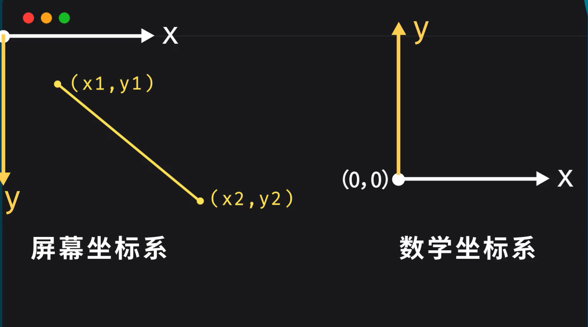

线条代码案例：

```html
<!DOCTYPE html>
<html lang="en">
<head>
    <meta charset="UTF-8">
    <meta name="viewport" content="width=device-width, initial-scale=1.0">
    <title>svg</title>
</head>
<body>
    <svg width="500" height="200">
        <line x1="0" y1="0" x2="200" y2="200" stroke="red" stroke-width="3"></line>
    </svg>

</body>
</html>
```

效果

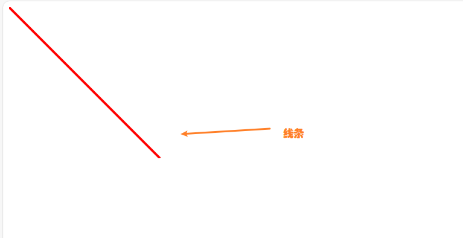

**多边形polygon**,它是一个单标签`<polygon/>`。poly在希腊语中含义为许多，gon是角度。

polygon属性

|    属性    | 效果                                                         |
| :--------: | ------------------------------------------------------------ |
| **points** | 定义多边形顶点的坐标。至少需要三对坐标，x与y用**,**分开，每对坐标使用**空格**分开 |

points绘制多边形过程是按照定义的顶点坐标顺序一个个连接起来，最终回到起点连接出一个**闭合多边形**。

多边形代码案例

```html
<!DOCTYPE html>
<html lang="en">
<head>
    <meta charset="UTF-8">
    <meta name="viewport" content="width=device-width, initial-scale=1.0">
    <title>svg</title>
</head>
<body>
    <svg width="500" height="220">
        <!-- 三角形 -->
        <polygon points="200,20 250,190 160,210" fill="lime" stroke="purple" stroke-width="2"/>
    </svg>
    <br>
    <svg width="500" height="250">
        <!-- 四边形 -->
        <polygon points="220,10 300,210 170,250 123,234" fill="lime" stroke="blue"></polygon>
    </svg>
    <br>
    <svg width="500" height="250">
        <!-- 五角星 -->
        <polygon points="100,10 40,198 198,78 10,78 160,198" fill="tomato" stroke="black" stroke-width=2>			</polygon>
    </svg>
</body>
</html>
```

效果

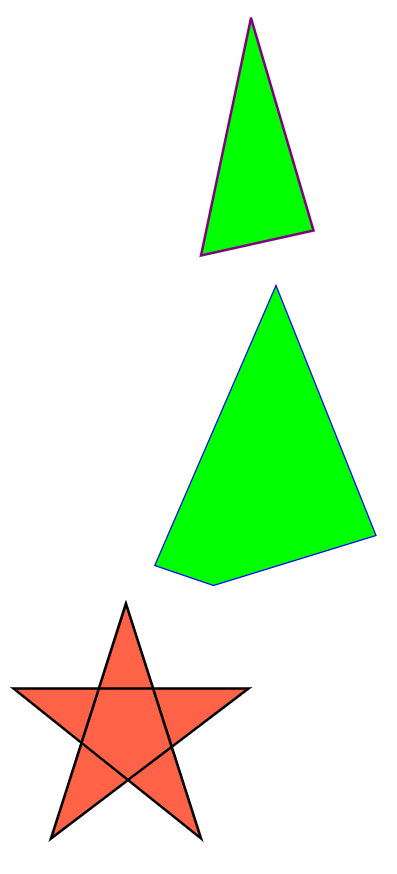

**多线条polyline**,它是一个单标签`<polyline/>`。poly在希腊语中含义为许多，line含义是线条。多线条与多边形最大的区别就是它并不要求**封闭**，因此最后一个点不会与起点连接起来。

polyline属性：

|    属性    | 效果                                                         |
| :--------: | ------------------------------------------------------------ |
| **points** | 定义多线条顶点的坐标。至少需要两对坐标，x与y用**,**分开，每对坐标使用**空格**分开 |

polyline代码

```html
<!DOCTYPE html>
<html lang="en">
<head>
    <meta charset="UTF-8">
    <meta name="viewport" content="width=device-width, initial-scale=1.0">
    <title>svg</title>
</head>
<body>
    <svg width="500" height="220">
        <!-- 多线段图形,折线图，一般填充fill值，默认为black,不填充任何颜色需要设置为none -->
       <polyline points="20,20 40,25 60,40 80,120 120,140 200,180" stroke="black" stroke-width="3" fill="none"></polyline>
    </svg>
    <br>
    <svg width="500" height="180">
        <!-- 多线段图形,梯子图-->
       <polyline points="0,40 40,40 40,80 80,80 80,120 120,120 120,160 160,160 " stroke="red" stroke-width="2" fill="none" />
    </svg>
</body>
</html>
```

效果


### 2.4 文本

**文本text**,它是一个双标签`<text>文本内容</text>`。

文本属性：

|      属性       | 效果                                                         |
| :-------------: | ------------------------------------------------------------ |
|     **x值**     | 定义文本中心点位置的x轴坐标                                  |
|     **y值**     | 定义文本中心点位置的y轴坐标                                  |
| **text-anchor** | 定义文本的对齐方式，有三个值:**start**,文本左端对齐;**middle**,文本中间对齐;**end**,文本右端对齐；默认值start |
|  **font-size**  | 定义文本大小                                                 |

文本对齐与中心点的关系，文本对齐就是控制中心点位置，它不仅决定文本显示，也是文本移动旋转变形的参考点。

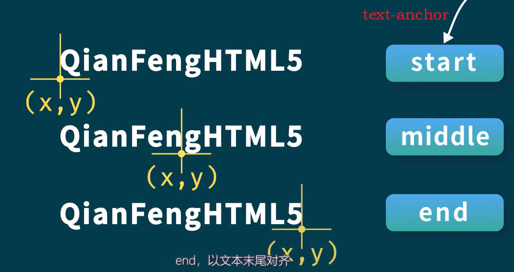

> svg中为什么不直接使用html的p标签来表示文本？
>
> 因为svg是在画布里绘制图形，text是绘制对象，使用它就可以使用svg一些专有特性来控制文本。比如旋转文本。

**transform**变换属性，该属性是svg中所有图形都具有的公共属性

|                 属性                  | 效果                                                         |
| :-----------------------------------: | ------------------------------------------------------------ |
| **rotate(旋转角度 旋转的中心点坐标)** | rotate(30 20,40)表示旋转角度30度，旋转中心(20,40),其默认值为(0,0) |

text内部可以拥有多个tspan标签，**tspan**也是一种文本标签，它是双标签`<tspan>span内容</tspan>`。它常用于多行文本展示。tspan属性基本和文本一致。

text文本也可拥有链接属性，就是使用`<a></a>`标签包含text标签即可。a标签的属性跟html中是一样的。

```html
<!DOCTYPE html>
<html lang="en">

<head>
    <meta charset="UTF-8">
    <meta name="viewport" content="width=device-width, initial-scale=1.0">
    <title>svg</title>
</head>

<body>
    <svg width="500" height="120">
        <!-- 默认文本对齐方式是start -->
        <text x="0" y="15" fill="red">文本文字</text>
        <text x="30" y="45" fill="yellow" text-anchor="middle" font-size="32">文本文字2</text>
        <text x="45" y="65" fill="blue" text-anchor="end">文本文字3</text>
    </svg>
    <br>
    <svg width="200" height="60">
        <!-- 文本旋转 -->
        <text x="0" y="15" fill="red" transform="rotate(30 20,40)">I love SVG</text>
    </svg>
    <br>
    <svg width="200" height="90">
        <!-- 多行文本 -->
        <text x="0" y="20" fill="red">
            I love SVG
            <!--tspan标签-->
            <tspan x="10" y="45">first span</tspan>
            <tspan x="10" y="70">end span</tspan>
        </text>
    </svg>
    <br>
    <!-- xmlns定义xlink的命名空间，必须编写后面才能识别 -->
    <svg width="200" height="30" xmlns:xlink="https://www.w3.org/1999/xlink">
        <!-- href设置连接地址 target设置浏览器打开方式 blank表示在新窗口打开链接-->
        <a xlink:href="index.html" target="_blank">
            <text x="10" y="15" fill="pink">index文件</text>
        </a>
    </svg>
</body>
</html>
```

效果


### 2.5 路径

**路径path**,它是一个单标签`<path>文本内容</path>`。路径可以任意绘制，它就是有多个端点连接出一个形状。s

路径属性：

|   属性    | 效果                                |
| :-------: | ----------------------------------- |
| **d命令** | d是draw单词缩写，表示绘制路径的命令 |

绘制路径的命令有很多，常用的有

+ **M（moveto)命令**：用于绘制路径点，M150 0表示绘制路径点，其坐标为(150,0)。还可写为M 150 0。

+ **L（lineto）命令**：用于绘制路径线段，l75 20表示从上一个结束点到距离它坐标(75,20)处绘制一条线段。还可写为l 75 20。

+ **Q（quadratic Bezier curve）命令**：用于绘制二次贝塞尔曲线,q150 -300 300 0表示控制点坐标相对于上个点坐标（150,-300）,终点坐标相对于上个点坐标（300,0）

  > 命令的大小写含义是不同的，大写字母表示**绝对定位**，小写字母表示**相对定位**。
  >
  > 绝对定位是相对于屏幕坐标系原点的位置。
  >
  > 相对定位是相对于上一个绘制点的位置。


路径不仅可以绘制出直线，它更可以绘制出完美的曲线。贝塞尔曲线就可以使用路径绘制，它为矢量图形学发展奠定了基础。

绘制二次贝塞尔曲线的原理图。


svg中常用**g标签**来包含多个其他标签，在g标签上定义公共属性。g是group缩写，表示编组。它是一个双标签。`<g></g>`

路径案例代码

```html
<!DOCTYPE html>
<html lang="en">

<head>
    <meta charset="UTF-8">
    <meta name="viewport" content="width=device-width, initial-scale=1.0">
    <title>svg</title>
</head>

<body>
    <svg width="500" height="210">
        <!-- 绘制一个三角形 都使用绝对定位-->
        <path d="M150 0 L75 200 L225 200" />
    </svg>
    <br>
    <svg width="500" height="400">
        <!-- 绘制两条线 -->
        <path d="M100 350 l150 -300" stroke="red" stroke-width="3" fill="none"></path>
        <path d="M250 50 l150 300" stroke="red" stroke-width="3" fill="none"></path>
        <!-- 绘制中点线 也是贝塞尔曲线切线-->
        <path d="M175 200 l150 0" stroke="green" stroke-width="3" fill="none"></path>
        <!-- 绘制二次贝塞尔曲线 -->
        <path d="M100 350 q150 -300 300 0" stroke="blue" stroke-width="5" fill="none"></path>
        <!-- 绘制三个点 g标签编组，三个圆点都是黑色-->
        <g fill="black">
            <circle cx="100" cy="350" r="3"></circle>
            <circle cx="250" cy="50" r="3"></circle>
            <circle cx="400" cy="350" r="3"></circle>
        </g>
        <!-- 绘制三个点名称，dx属性表示水平方向x偏移距离 -->
        <g font-size="30" fill="black" text-anchor="middle">
            <text x="100" y="350" dx="-30">A</text>
            <text x="250" y="50" dx="-10">B</text>
            <text x="400" y="350" dx="30">C</text>
        </g>
    </svg>
</body>
</html>
```

效果

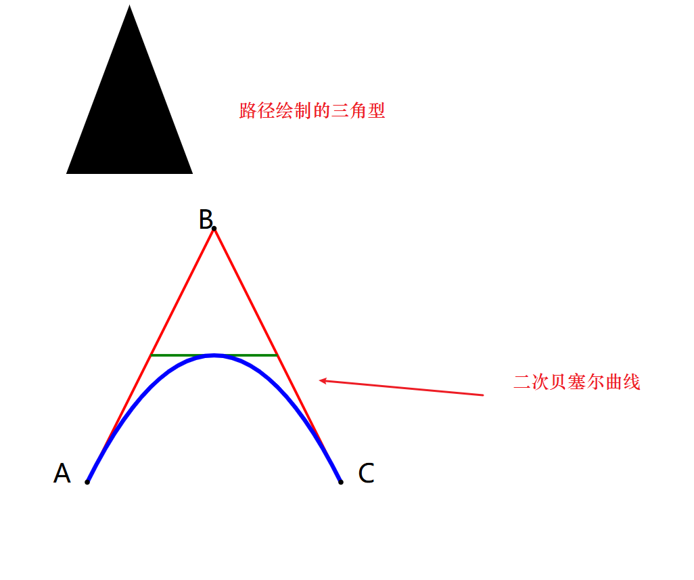

### 2.6 svg描边属性

svg中提供了大量的描边属性，在之前我们就已经接触到的stroke就是其中之一。所有的描边属性都可应用于svg中的元素。

|         属性         | 效果                                                         |
| :------------------: | ------------------------------------------------------------ |
|      **stroke**      | 描边颜色属性                                                 |
|   **stroke-width**   | 描边宽度属性                                                 |
|  **stroke-linecap**  | 描边笔帽属性，所谓笔帽就是绘制线结束点是圆的还是方的，**butt**没有线帽，**round**圆形线帽，**square**方形线帽 |
| **stroke-dasharray** | 虚线描边,值为数字，定义虚线线条宽度与空隙的大小，中间用,号分隔开，两者是交替的 |

虚线值表示的不同虚线

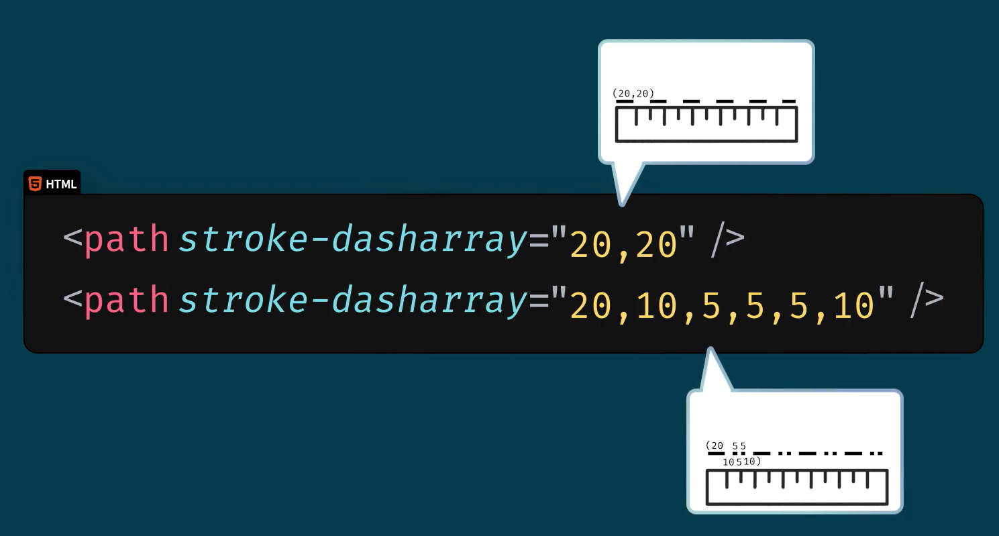

描边属性代码

```html
<!DOCTYPE html>
<html lang="en">

<head>
    <meta charset="UTF-8">
    <meta name="viewport" content="width=device-width, initial-scale=1.0">
    <title>index</title>
</head>

<body>
    <!-- 颜色属性 -->
    <svg width="300" height="80">
        <g fill="none">
            <path stroke="red" d="M5 20 l215 0"></path>
            <path stroke="black" d="M5 40 l215 0"></path>
            <path stroke="blue" d="M5 60 l215 0"></path>
        </g>
    </svg>
    <br>
    <!-- 宽度属性 -->
    <svg width="300" height="80">
        <g fill="none" stroke="black">
            <path stroke-width="2" d="M5 20 l215 0"></path>
            <path stroke-width="4" d="M5 40 l215 0"></path>
            <path stroke-width="6" d="M5 60 l215 0"></path>
        </g>
    </svg>
    <br>
    <!-- 笔帽属性 -->
    <svg width="300" height="80">
        <g fill="none" stroke="black" stroke-width="6">
            <path stroke-linecap="butt" d="M5 20 l215 0"></path>
            <path stroke-linecap="round" d="M5 40 l215 0"></path>
            <path stroke-linecap="square" d="M5 60 l215 0"></path>
        </g>
    </svg>
    <br>
    <!-- 虚线属性 -->
    <svg width="300" height="80">
        <g fill="none" stroke="black" stroke-width="4">
            <path stroke-dasharray="5,5" d="M5 20 l215 0"></path>
            <path stroke-dasharray="10,10" d="M5 40 l215 0"></path>
            <path stroke-dasharray="20,10,5,5,5,10" d="M5 60 l215 0"></path>
        </g>
    </svg>
</body>
</html>
```

效果


### 2.7 svg模糊与阴影效果

给svg图形添加特殊效果，需要通过**filter**元素完成。filter是过滤器的意思。它是一个双标签。`<filter></filter>`

filter元素中可包含一个或多个效果滤镜。其属性有

|    属性    | 效果                                     |
| :--------: | ---------------------------------------- |
|   **id**   | filter的唯一标识符。是filter中必写的属性 |
|   **x**    | 表示filter效果起始点的x轴坐标            |
|   **y**    | 表示filter效果起始点的y轴坐标            |
| **width**  | 表示filter效果范围宽度                   |
| **height** | 表示filter效果范围高度                   |

filter元素都是在defs元素中定义的，definitions的简称。它是一个双标签。`<definitions></definitions>`。最简单的filter

```xml
<defs>
	<filter id></fliter>
</defs>
```

**高斯模糊特效**，feGaussianBlur,它是一个单标签。`<feGaussianBlur />`必须写在fliter中才能有效。其属性有

|       属性       | 效果                             |
| :--------------: | -------------------------------- |
| **stdDeviation** | 定义模糊数值。值越大模糊度就越高 |

**阴影特效**，它是通过**feOffset**和**feBlend**效果实现，它们都是一个单标签。`<feOffset/>`，`<feBlend/>`。

其原理就是先通过feOffset将图形在x轴与y轴上平移。然后使用feBlend在偏移的图像上混合原始图像。

feOffset属性有

|  属性  | 效果                                                         |
| :----: | ------------------------------------------------------------ |
| **dx** | 表示阴影在x轴上的偏移量                                      |
| **dy** | 表示阴影在y轴上的偏移量                                      |
| **in** | 表示阴影图形的来源，黑色阴影值可设置为**SourceAlpha**,使用原图作为来源值为**SourceGraphic** |

feBlend属性有

|  属性  | 效果                                              |
| :----: | ------------------------------------------------- |
| **in** | 表示混合的图像，值为**SourceGraphic**表示混合原图 |

filter案例代码

```html
<!DOCTYPE html>
<html lang="en">
<head>
    <meta charset="UTF-8">
    <meta name="viewport" content="width=device-width, initial-scale=1.0">
    <title>filter</title>
</head>
<body>
    <!-- 高斯模糊filter -->
    <svg width="110" height="110">
        <!-- 定义filter效果 -->
        <defs>
            <filter x="0" y="0" id="f1">
                <feGaussianBlur stdDeviation="15" />
            </filter>
        </defs>
        <!-- filter应用通过id进行引用 -->
        <rect width="90" height="90" stroke="green" stroke-width="3" fill="yellow" filter="url(#f1)" />
    </svg>
    <br>
    <!-- 阴影filter -->
    <svg width="140" height="140">
        <!-- 定义filter效果 -->
        <defs>
            <filter x="0" y="0" width="200" height="200" id="f2">
                <!-- 三者顺序不能交换 -->
                <feOffset in="SourceAlpha" dx="20" dy="20" />
                <!-- 添加阴影模糊 -->
                <feGaussianBlur stdDeviation="10" />
                <feBlend in="SourceGraphic" />
            </filter>
        </defs>
        <!-- filter应用通过id进行引用 -->
        <rect width="90" height="90" stroke="green" stroke-width="3" fill="yellow" filter="url(#f2)"></rect>
    </svg>
</body>
</html>
```

效果

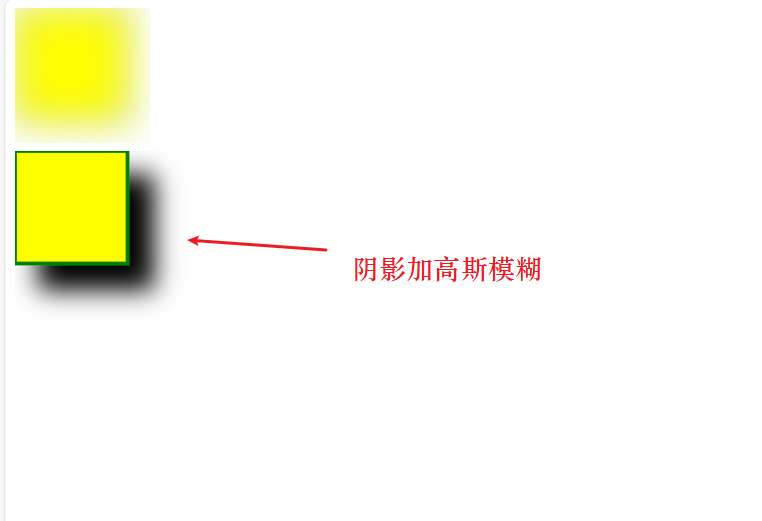

### 2.8 svg线性渐变与径向渐变

渐变是一种颜色到另一种颜色的过渡。多种颜色的过渡可应用于同一元素。

线性渐变通过**linearGradient**元素完成,它是双标签。`<linearGradient></linearGradient>`,它也必须嵌套在defs中使用。

其属性有

|  属性  | 效果                  |
| :----: | --------------------- |
| **id** | 渐变唯一标识符        |
| **x1** | 渐变方向起始点x轴坐标 |
| **y1** | 渐变方向起始点y轴坐标 |
| **x2** | 渐变方向起始点x轴坐标 |
| **y2** | 渐变方向起始点y轴坐标 |


线性渐变颜色范围可以由两种或多种颜色组成，每种颜色都用一个stop标签来指定。它是单标签。`<stop/>`

其属性有

|      属性      | 效果                                                       |
| :------------: | ---------------------------------------------------------- |
|   **offset**   | 定义渐变颜色的开始和结束位置，属性值是描述相对位置的百分比 |
| **stop-color** | 定义渐变的颜色                                             |

线性渐变案例代码

```html
<!DOCTYPE html>
<html lang="en">
<head>
    <meta charset="UTF-8">
    <meta name="viewport" content="width=device-width, initial-scale=1.0">
    <title>Document</title>
</head>
<body>
    <svg width="400" height="150">
        <defs>
            <!-- y1=y2,x1≠x2说明是水平渐变 -->
            <linearGradient x1="0%" y1="0%" x2="100%" y2="0%" id="grad1">
                <!-- 渐变开始由椭圆的0%处开始，颜色为黄色 -->
                <stop offset="0%" stop-color="rgb(255,255,0)"></stop>
                <!-- 渐变开始由椭圆的100%处结束，颜色为红色 -->
                <stop offset="100%" stop-color="rgb(255,0,0)"></stop>
            </linearGradient>
        </defs>
        <ellipse cx="200" cy="70" rx="85" ry="55" fill="url(#grad1)"></ellipse>
        <text fill="#ffffff" font-size="45" x="150" y="86">SVG</text>
    </svg>
</body>
</html>
```

效果


径向渐变通过**radialGradient**元素完成,它是双标签。`<radialGradient></radialGradient>`,它也必须嵌套在defs中使用。

其属性有

|  属性  | 效果                  |
| :----: | --------------------- |
| **id** | 渐变唯一标识符        |
| **cx** | 渐变外部圆的圆心x坐标 |
| **cy** | 渐变外部圆的圆心y坐标 |
| **r**  | 渐变外部圆的半径值    |
| **fx** | 渐变内部圆的圆心x坐标 |
| **fy** | 渐变内部圆的圆心y坐标 |
|        |                       |
|        |                       |

径向渐变也用stop标签来指定颜色。

径向渐变案例代码

```html
<!DOCTYPE html>
<html lang="en">
<head>
    <meta charset="UTF-8">
    <meta name="viewport" content="width=device-width, initial-scale=1.0">
    <title>Document</title>
</head>
<body>
    <svg width="500" height="150">
        <defs>
            <radialGradient cx="50%" cy="50%" r="50%" fx="50%" fy="50%" id="grad2">
                <!-- 渐变开始由椭圆的0%处开始，颜色为黄色 -->
                <stop offset="0%" stop-color="rgb(255,255,255)"></stop>
                <!-- 渐变开始由椭圆的100%处结束，颜色为蓝色 -->
                <stop offset="100%" stop-color="rgb(0,0,255)"></stop>
            </radialGradient>
        </defs>
        <ellipse cx="200" cy="70" rx="85" ry="55" fill="url(#grad2)"></ellipse>
    </svg>
    <br>
    <!-- 高光位置改变 -->
    <svg width="500" height="150">
        <defs>
            <radialGradient cx="30%" cy="30%" r="50%" fx="30%" fy="30%" id="grad3">
                <!-- 渐变开始由椭圆的0%处开始，颜色为黄色 -->
                <stop offset="0%" stop-color="rgb(255,255,255)"></stop>
                <!-- 渐变开始由椭圆的100%处结束，颜色为蓝色 -->
                <stop offset="100%" stop-color="rgb(0,0,255)"></stop>
            </radialGradient>
        </defs>
        <ellipse cx="200" cy="70" rx="85" ry="55" fill="url(#grad3)"></ellipse>
    </svg>
</body>
</html>
```

效果

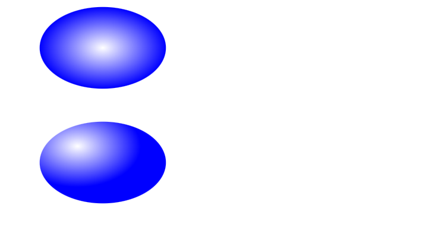

## 三、得到

# AI工具

## 一、AI工具基本功能与界面

AI工具全名叫**Adobe Illustrator**,是Adobe公司开发的专门用于制作**矢量图**的软件，矢量图的代表格式就是**svg**，它相比于jpg这种位图好处是可以无损缩放。

使用AI工具，首先新建一个600*400的AI文档，使用**RGB颜色模式**，需要打印才使用**CMYK模式**。

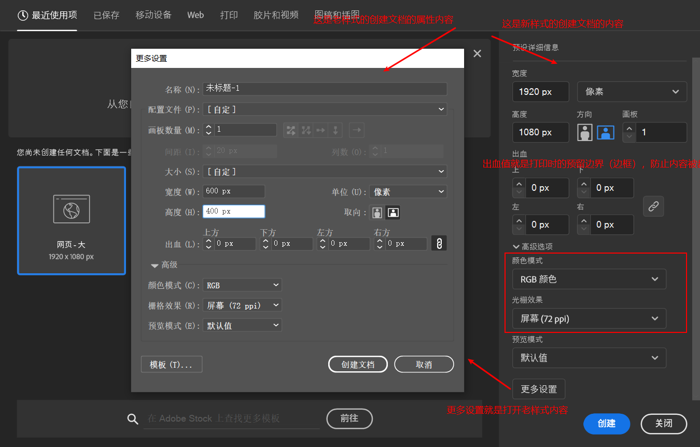

### 1.1 页面布局

认识工具界面，将工具分类方便后续AI工具的熟练使用

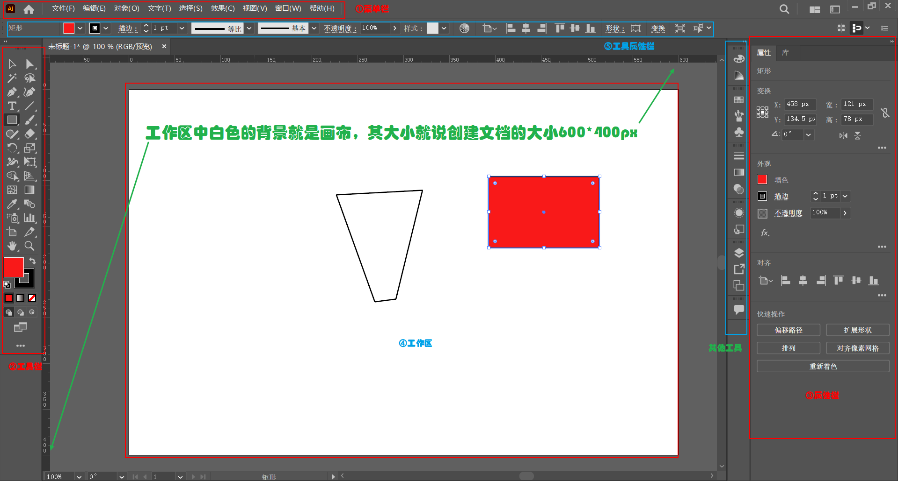

上边使用的布局是**传统基本功能布局**，默认是**基本功能**布局。(布局是可以随意拖拽放置，就看个人的使用习惯)


页面布局中如果缺少某些工具，可在**菜单栏——窗口**中找出来

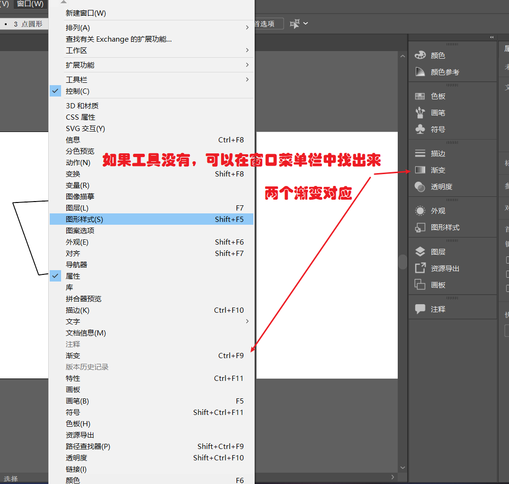

根据个人需要建立布局(工作区)，常用的工具按习惯进行布局

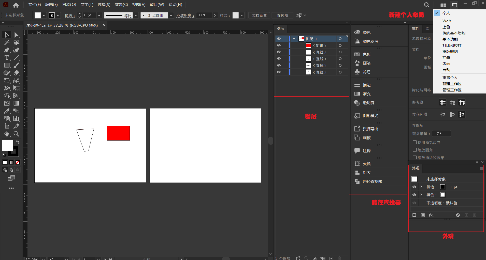

**工具栏**中的工具可按功能进行分组(**填充色/描边色**是跟PS中的**前景色/背景色**最大区别)


**标尺**是在视图菜单栏中快捷键**Ctrl+R**，参考线直接拖拽出来即可。标尺与参考线设置都可以在首选项中修改。

**修改标尺单位**直接右键标尺就可修改单位，如果有多个画板，还可以更改为**画板标尺**，其含义是选中每个画板时，其标尺都会从零开始。默认的是**全局标尺**，标尺不会随着画板改变。

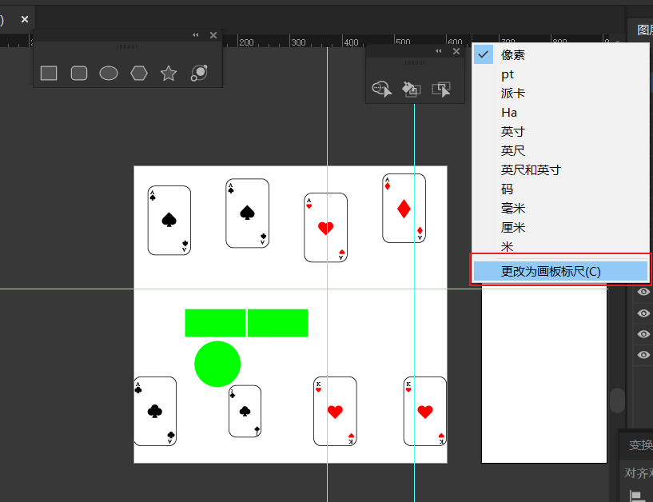

**显示网格**的快捷键为**Ctrl+"**，也可以在首选项中设置网格大小，内部分为几部分，默认网格大小72\*72px，分为8部分，也就是小网格为9\*9px。

### 1.2 首选项设置

首选项在**菜单栏——编辑**中，其面板快捷键为**Ctrl+K**。


**快捷键**其实分为工具快捷键与菜单快捷键，可以在菜单栏中的**编辑-键盘快捷键**中打开进行自定义设置

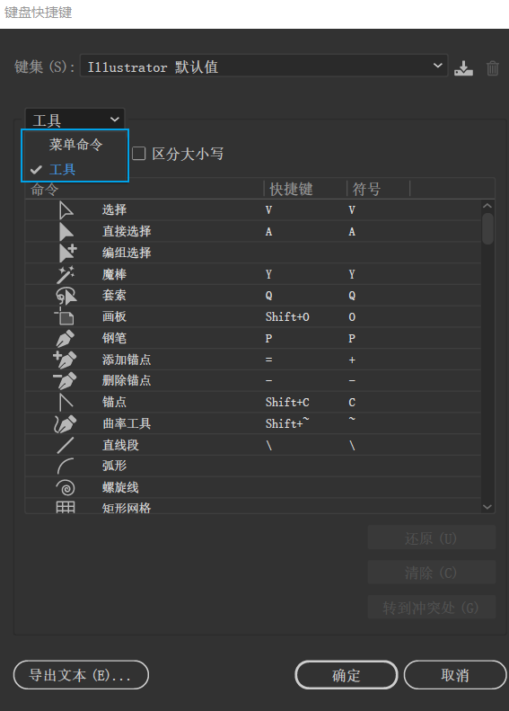

### 1.3 导入导出文件

如果编辑好AI图片，可使用快捷键**Ctrl+S**将文档以AI的格式快速保存。如果要保存为其他格式，可在**文件——存储为**

中选择其他矢量图格式进行保存，其快捷键为**Ctrl+Shift+S**。最常用的保存格式就是svg

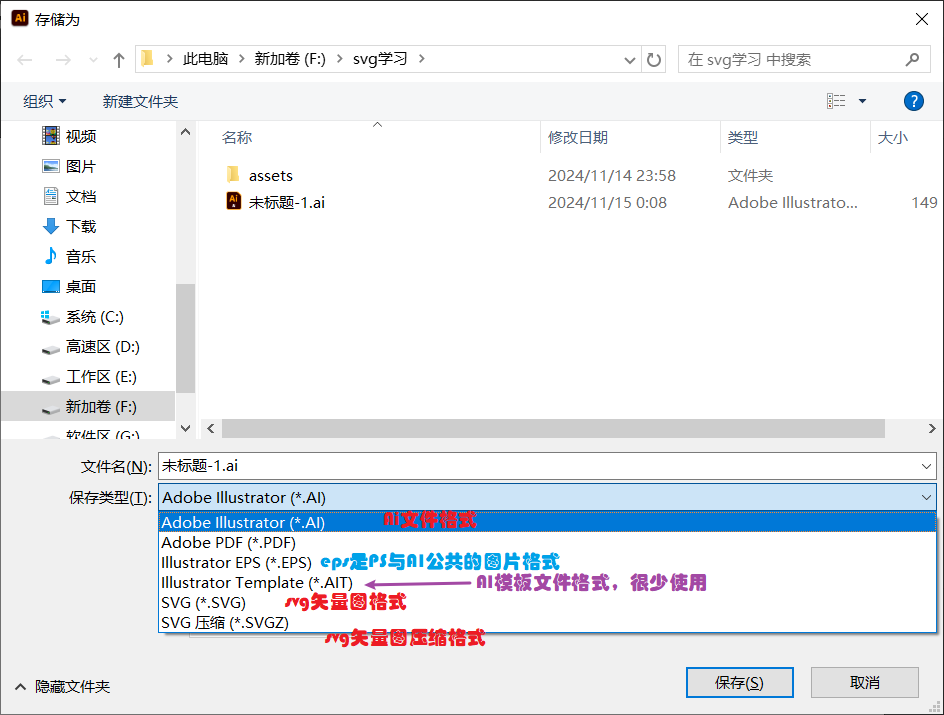

svg文件格式保存


svg文件可用文本工具查看源码，要查看实际图像效果则使用浏览器打开。

要保存为其他文件格式，比如**jpg**有损压缩图片格式，则需要使用**导出**使用**文件——导出——导出为**

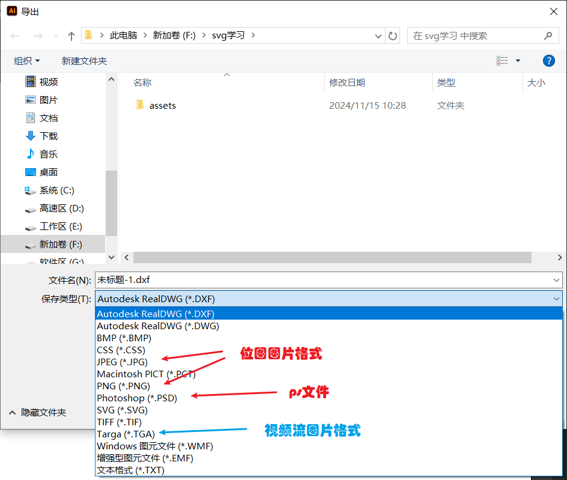

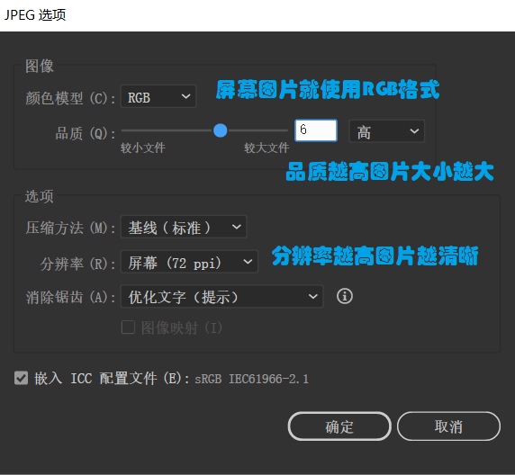

如果要导出网页开发的多倍图，可使用**资源导出**工具，下面使用**iOS的三倍图**，也可以使用**Android**的或者**自定义**。

要导出的资源，**使用鼠标选中图形，拖动到资源导出面板中**即可


导出的效果

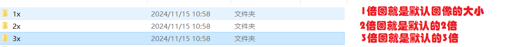


导入文件，可以使用**打开图片**快捷键**Ctrl+O**直接打开图片，可以像PS那样直接拖入，也可以使用**置入**快捷键**Ctrl+Shfit+P**，选择要导入的图片。

> **拖入到工作区是导入到当前文档**，**拖入到工作区标题栏则是新建图片文档**。

AI中拖入图片后还需要点击**嵌入**才算完全导入图片，如果没嵌入下次打开文档该图片会消失。

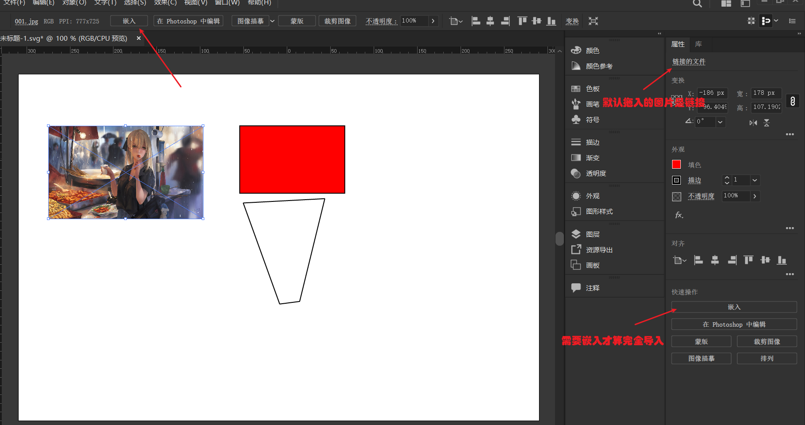

选择置入的好处是可以直接在画板中拖动出图片大小，这样可以等比缩放，不用担心原图过大的问题。

AI中不仅可以打开位图矢量图，还可以直接打开**PSD文件**，并且保留其原本图层内容

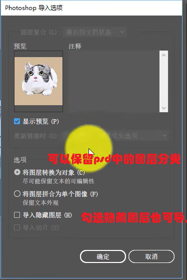

画板中实现**复制图像**，选中图片，使用**Ctrl+C**与**Ctrl+V**进行复制，也可使用**Alt键+鼠标左键**拖动。

**删除图像**，选择图片，使用**delate键**或者**del键**进行删除。

### 1.4 视图操作

要操作视图，可直接使用工具栏中的视图工具

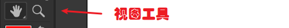

**抓手**可以平移视图，快捷键为**空格**。

**放大镜**可以放大缩小视图，快捷键为**Ctrl++**或**Ctrl+-**,或者使用**Alt＋鼠标滚轮**，**Ctrl+1**还原视图，**Ctrl+0**单独显示选择的内容。

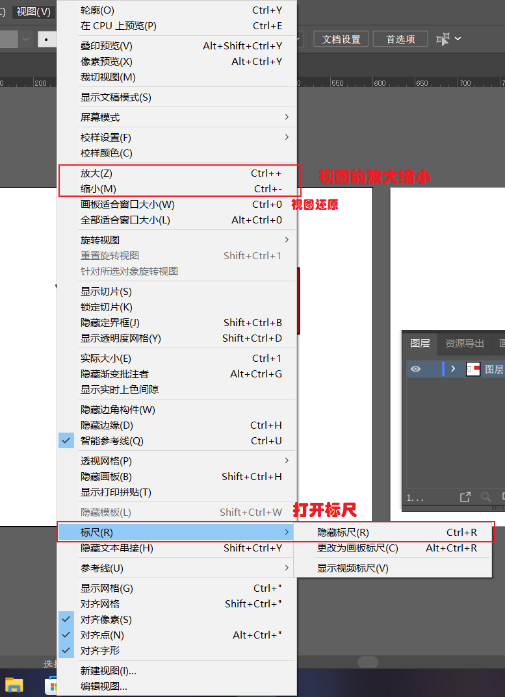

如果要隐藏工具栏这些，可使用**Tab**键进行全部隐藏，也可使用**Shfit＋Tab**键进行部分隐藏

要演示文稿，可更改**屏幕模式**，快捷键是**Shift+F**，退出使用**Esc键**

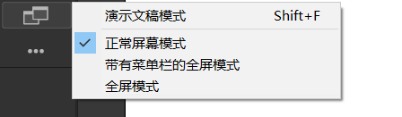

最快速切换屏幕模式的快捷键为**`F键`**，可随意进行模式切换。

在矢量图中还有一个重要视图就是**轮廓图**，轮廓图模式打开**视图——轮廓**，其快捷键为**Ctrl+Y**

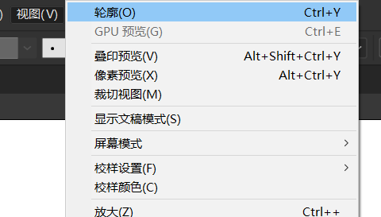

同时查看多个文档，并且进行内容复制

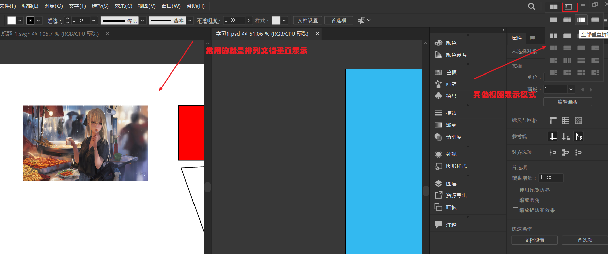

### 1.5 画板

AI一个文档中可创建多个画板，默认视图显示比例为100%，选中某个画板使用**Ctrl+0**可最大化显示选中画板，**Ctrl+Alt+0**就是所有画板都显示在工作区中。

创建多个画板，可以在新建文档中选择多个

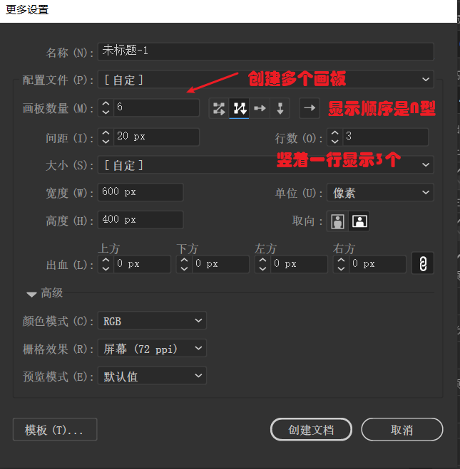

也可以在创建好的文档中添加画板，在**画板工具**中选择**编辑画板**进入画板编辑模式。

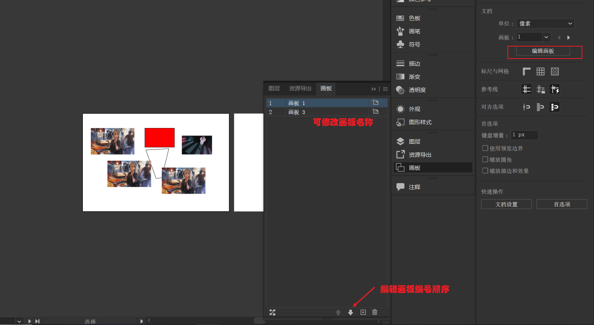

进入**画板编辑模式**后，该模式下可直接鼠标左键拖动创建画板，也可以进行**复制删除画板**，操作方式跟复制图像一样

选择**全部重新排列**，就可重新设置画板的排列顺序，按照每个画板的唯一编号进行排列。

**交换画板编号**需在画板工具中使用上下箭头进行交换，修改画板名称也可在工具中进行。

当一个文档有多个画板，导出时可使用**画板导出**，自定义设置需要导出的画板，导出的图片名就是**画板的名称**。

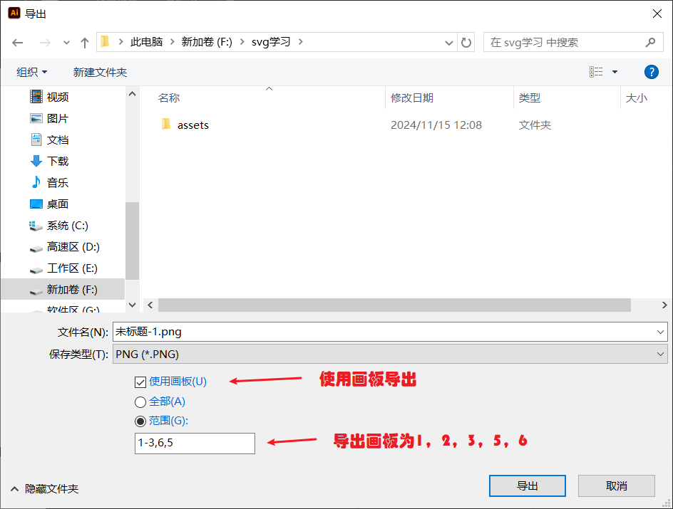

## 二、图形与上色

### 2.1 基本形状工具

在矢量图绘制中，大量的图像都是由基本的多边形或者圆组合绘制出来的，因此需要会使用绘制基本多边形形状的工具。


选择矩形后，可直接在画板中使用**鼠标左键拖拽绘制**出来，如果属性不对，可在属性栏中设置其属性，如果对宽高要求精准，使用**鼠标点击设置属性绘制**。

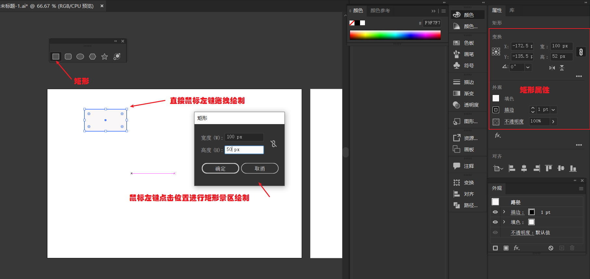

如果要绘制出正方形或者圆形，可按住**shfit键**进行拖拽，也可在绘制好后按住鼠标左键不放，按一下shift键，这样就是出现矩形或者圆形。

默认是从图形左上角进行绘制的，如果要从中心绘制，按住**Alt键**就可中心绘制，常用的组合就是**Alt+shfit+鼠标拖拽**绘制中心圆。

绘制多边形，在绘制图中**按住鼠标左键不松手**，按**键盘的上下方向键**可进行多边形边数的动态增加减少。按住**Ctrl键+鼠标拖拽**可调节多边形边角的长度。

绘制好图形后需要微调节，则可使用**选择工具**，选择要调节的图形，选中特定点进行调节，也可在属性栏中进行属性值直接调节。


如果单个或多个矩形的点属性进行修改，可使用**直接选择工具**，先拖动虚线框框选需要修改的点，然后拖拽即可

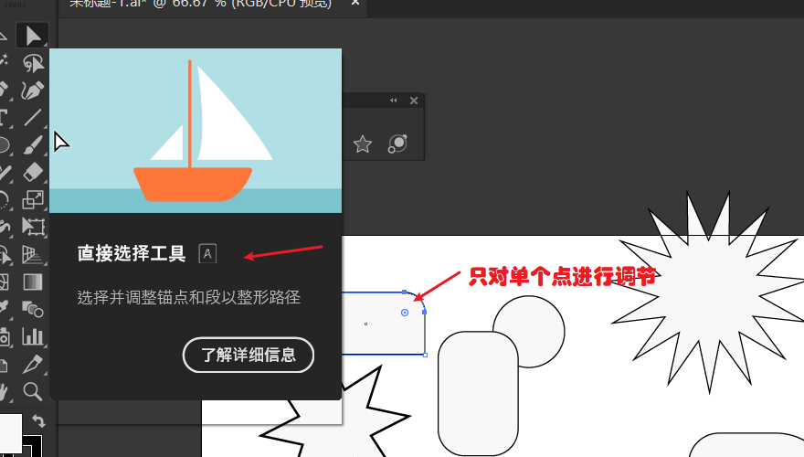

设置图形的颜色与描边颜色，可在属性栏中直接设置。

> 如果将**颜色设置为无，描边设置为无**，则该图形就不可见。而实际该图形的路径依然存在，要查看到该图形，就需要在**轮廓视图**查看该图形。

### 2.2 图形上色

之前我们已经可以简单的使用属性修改图形颜色。如果需要同时对多个图形进行统一上色，就使用选择工具框选图形，然后使用属性，或者工具栏中的颜色进行修改。框选时如果多选择或者少选择了，可按住**shfit**点击图形就可移除或添加图形。

**快捷键X**是将颜色与描边位置进行切换，**shift+X**就是将描边颜色和填充色进行切换。

如果要恢复形状默认的白色填充黑色描边，可使用**快捷键D**进行还原。


如果不知道颜色值，但有颜色图片，可使用**吸管工具**进行颜色吸取,**快捷键I**。如果要**吸取ai工具外的图标颜色**，按住鼠标左键不松手就可，如果要吸取描边色，按住shfit＋鼠标左键不松手就行。

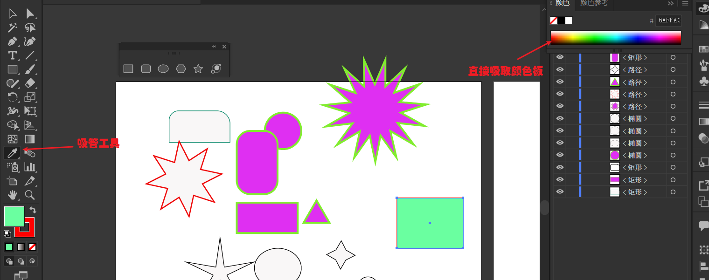

除了纯色外，也可使用渐变色进行描边或填充

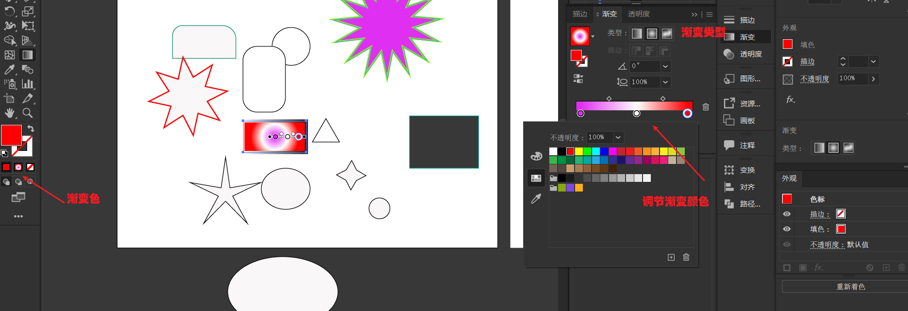

如果要快速**设置描边颜色或填充颜色为无**，可使用快捷键**反斜线/**

### 2.3 图形形状变换

#### 2.3.1 图形自由变换

图形的自由变换属性指的就是图形的**移动**、**旋转**、**缩放**。在直接使用选择工具时，我们已经简单的接触过这些。

如果要进行等比例放大缩小，旋转角度按固定值变化，就按住**shfit键**即可。

而如果要进行图形属性精确变化，则选中图形选择右键进行变换

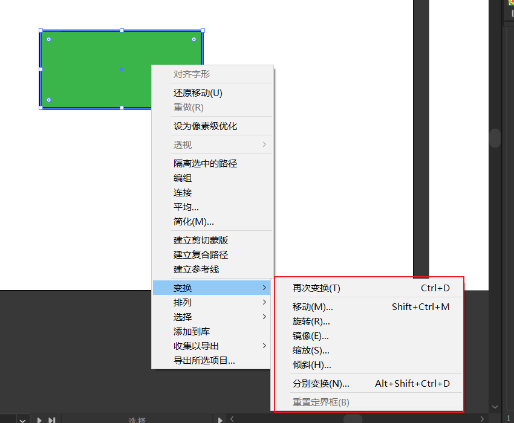

其中再次变换，快捷键**Ctrl+D**，就是按照上一次的变换步骤进行重复的操作,该效果结合**Alt键的复制**效果，可以制作很多小案例。例如：阶梯制作,使用**移动变换**的效果

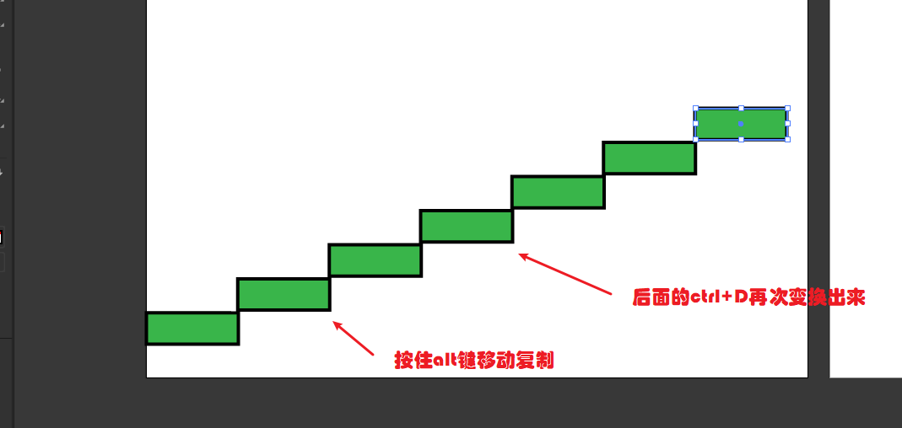

**旋转变换**，以及利用椭圆＋旋转复制制作花。


**倾斜变换**就是将矩形变成平行四边形，**镜像**也就是对称效果，可以制作一半然后镜像出另一半。

**缩放变换**功能很重要，特别是对于描边与圆角的缩放，要根据实际情况进行选择

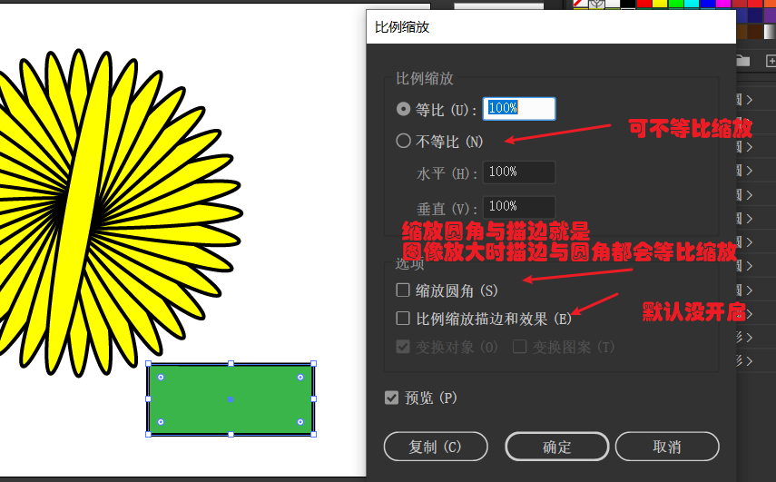

变换的属性值还可以在变换工具中进行具体调节，这样可以更快速的调节


案例：樱花绘制，利用多角星型利用旋转复制绘制而成，其绘制路径为倒S型，绘制多边形然后按住**~键**进行路径复制

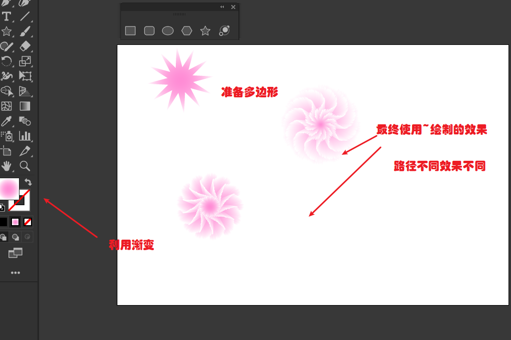

之前学习的都是单个的变换，如果需要复合的多个变换，就使用**分别变换**快捷键为**Alt+Ctrl+Shift+D**。

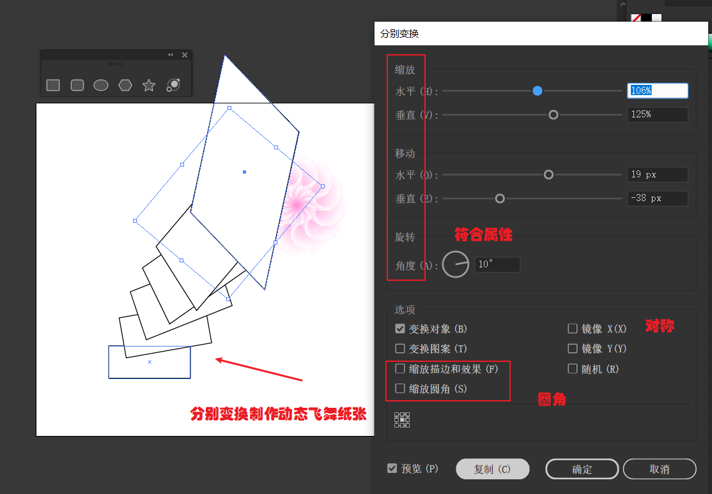

分别变换还可以有更强的功能，该功能是在菜单栏中的**效果——扭曲与变换——变换**中，其最核心就是**副本效果**

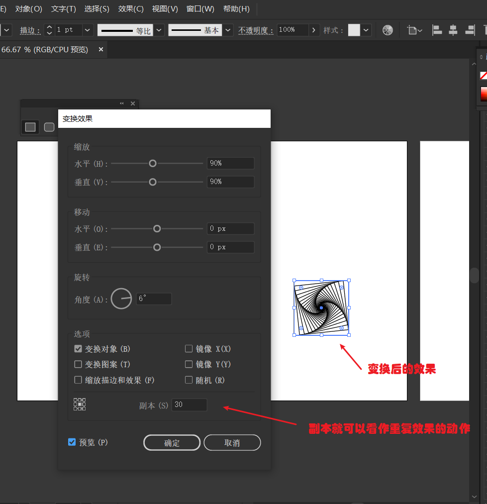

变换后还可以继续在属性中调节图像属性，比如描边圆角等

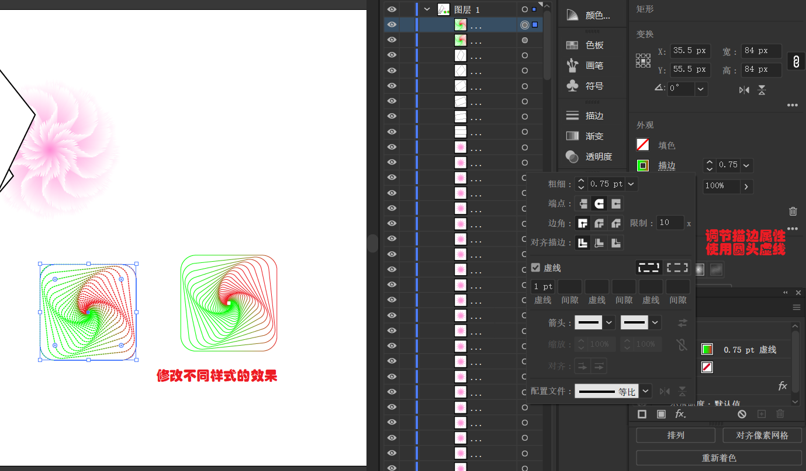

#### 2.3.2 自由变换工具

除了属性中的自由变换外，还可以使用**自由变换工具**，完成图形变换的效果。


> 自由变换操作属性常用快捷键，按住**Ctrl键**可以进行旋转与缩放。
>
> 操作时按住**shift键**，进行水平或垂直的标准变换。
>
> 按住**alt键**进行以图形中心为参照进行变化。
>
> 这几个快捷键都可同时按下进行复合操作：
>
> 鼠标选中某个点时，按住Ctrl就可单独对该点进行操作，也就是自由扭曲的效果。
>
> 选中某个的点时，按住**Alt+Ctrl+鼠标拖动**就可实现沿着对角线变化。
>
> 选中某个的点时，按住**Alt+Ctrl+Shift+鼠标拖动**就可实现透视扭曲的效果。

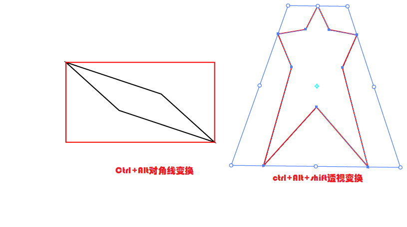

### 2.4 图形合成——布尔运算

图形合成需要使用工具**路径查找器**，没有就在**菜单栏——窗口**中打开，快捷键**Ctrl+Shift+F9**。

简单的布尔运算有四种：①联集(并集)、②减去顶层、③交集、④差集。在路径查找器中的形状模式就是这四种运算。

其效果如图

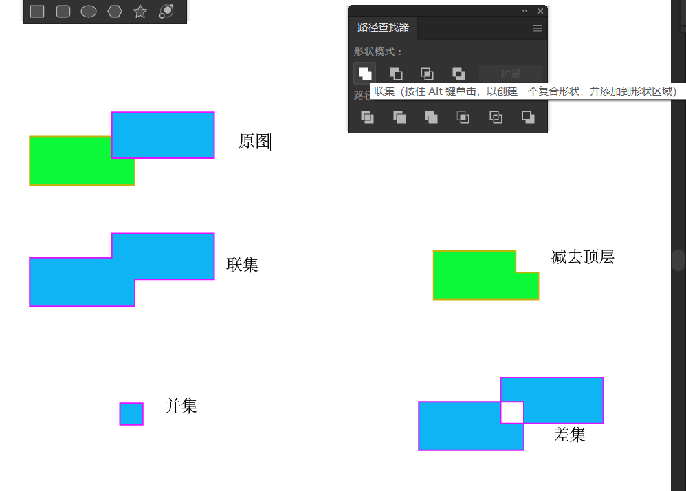

这样直接合成会直接让原图修改，有时我们需要只看到合成效果，但依然保留原图方便再次修改。这时就按住**Alt键单击**合成模式创建**复合形状**。


而要修改操作复合形状，就需要使用**编组选择工具**。复合形状图修改确认点击**扩展**就可把图形合并完成。

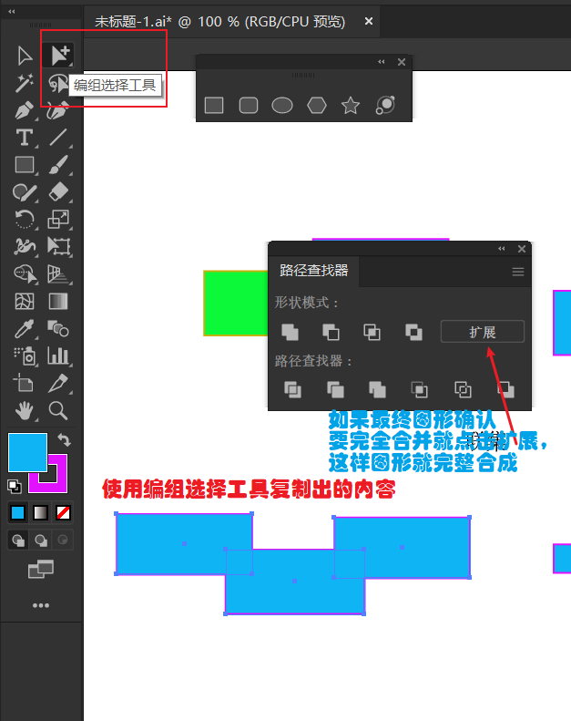

> 退出复合形状模式:(不使用Ctrl+Z的方式)
>
> 先剪切一部分内容，然后再粘贴出来，这样就分离的复合图形，最后把未剪切的内容点击扩展就退出了复合模式。

案例：熊猫头

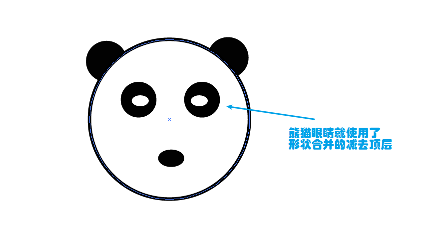

### 2.5 图形合成——路径查找器

路径查找器有六种效果：

1. **分割**：原图按照描边进行分割，默认分割后其还在一个编组内，要**取消编组**(选择整体对象**右键**就有取消编组)才可将图形分离开；如果使用编组选择工具，不取消编组也能将图形分割开；
2. 修边：移除描边，再原图分割；
3. 合并：**移除描边，让相同的颜色连为一体，不同颜色保留进行分割**，与之前的形状合并完全不同；
4. 裁剪：裁剪就是保留重叠部分，移除描边，与之前的交集的区别就是颜色保留的是后方对象的颜色，并且没有描边；
5. 轮廓：只保留描边轮廓，颜色与内部颜色一致，会进行分割；
6. 减去后方对象：与减去顶层效果刚刚相反。就是保留前面的图案；

六种路径查找器的效果如下图，其中**路径查找器没有alt键进入复合形状的功能**。

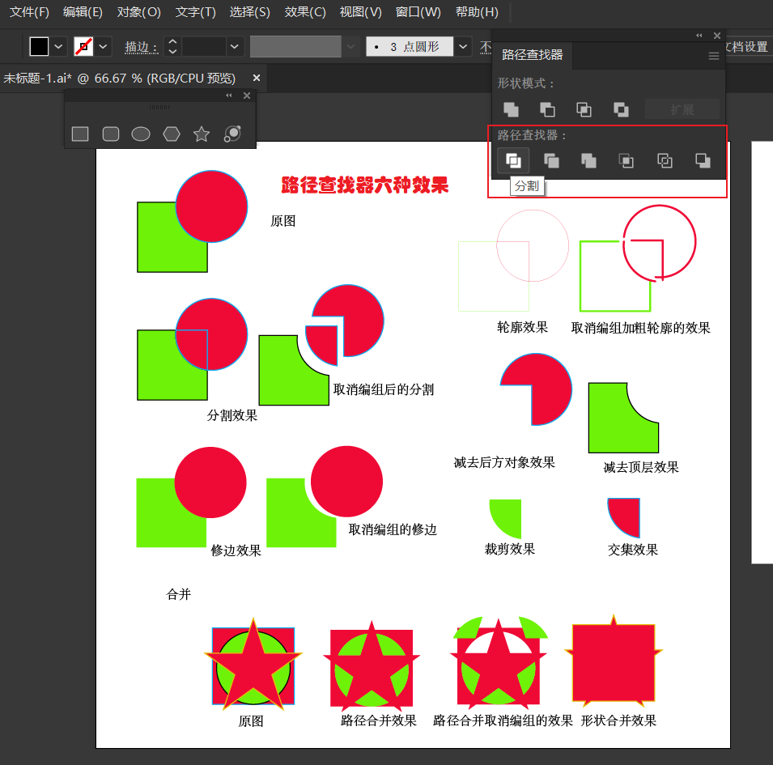

六种路径效果，其中使用最多的就是分割，其他的可以利用其他手段完成同样的效果。

### 2.6 形状生成器与shaper工具(☆)

**形状生成器工具**，快捷键是**Shift+M**，是很方便快捷的图形**合并**与**分割**工具，在工具栏中可以直接打开

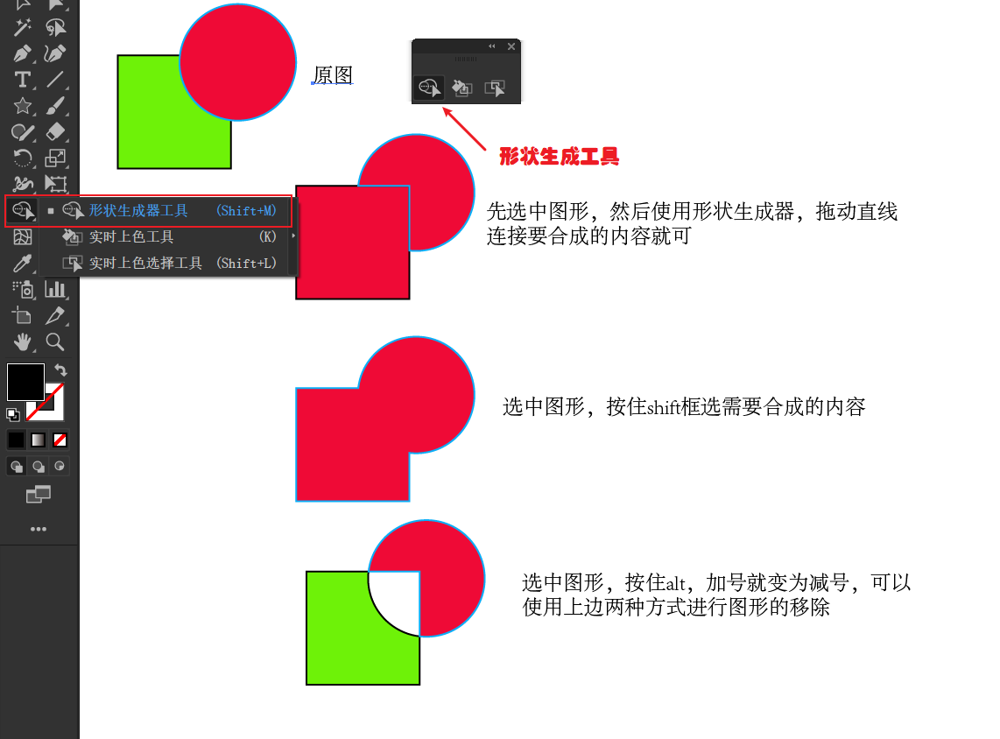

形状生成工具可以快速的完成之前路径查找器功能的图像合并与删除的效果。合并或删除后的图像边界是有分割的效果，不需要**取消编组**就可分离开。

操作很简单，**操作的第一步必须选中要操作的对象**，注意使用**shift键**进行多个图像的合并，或者**alt键**将合并变成删除的操作。

**shaper工具**是一个十分好用的图形绘制工具，它不仅可以快速绘制出简单的几何图形，并且还自带了部分形状生成工具的功能。


结合使用shaper工具与形状生成器，就可以很快速的完成复杂图形的绘制，比如云朵，就可使用shaper工具绘制多个椭圆快速完成


### 2.7 复合形状与复合路径

路径指的就是工作路径，比如直线、曲线等，而形状指的是由闭合路径构成的图形就是形状。因此**形状本质就是一种特殊的路径**。

**复合形状**，就是多个形状组合而成。**复合路径**，就是多个路径组合而成。

复合形状在之前已经接触过，就是在路径选择器中按住alt键选择对应形状模式生成的。

复合路径有两种方式生成，选中图形①在菜单栏中**对象——复合路径——建立**完成，快捷键是**Ctrl+8**;②右键选择**建立复合路径**就可。复合路径状态也是可以解除的，并且方式比复合形状简单很多，直接右键**释放复合路径**就可解除。

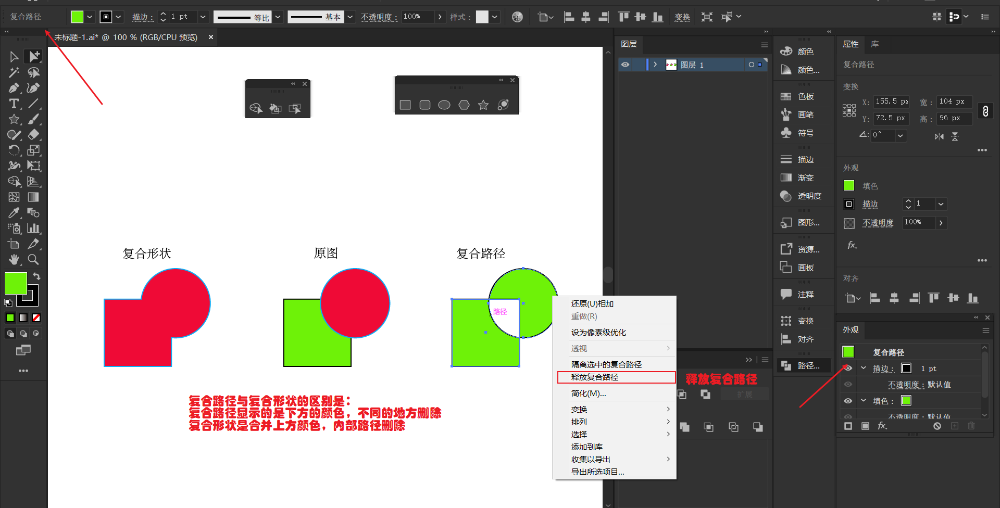

**隔离模式**，不管是复合路径和复合形状或者普通图形，都可以通过**双击图形**进入隔离模式，进入该模式后，就可以很简单的操作选中的图形，其他不相关的图形都是无法操作的。而复合路径与复合形状是操作一组内容，普通图形是操作单个。

**退出隔离模式**就是双击图形外的其他空白地方即可。

复合路径与复合形状都有**高级的编组功能**，可以很好的帮助我们对图形进行分组操作。

复合路径可以实现不规则图形的上色操作。选中图形，先把不规则图形变成**复合路径**，再使用实时上色工具，**快捷键K**。


### 2.8 描边

**描边**其实就是图形边框的绘制，其功能在前面经常使用，具体的描边属性控制还没详细说明。


在AI工具中，调节数值都可以按住**shift键+鼠标滚轮**调节，这样是以数值10进行增减。

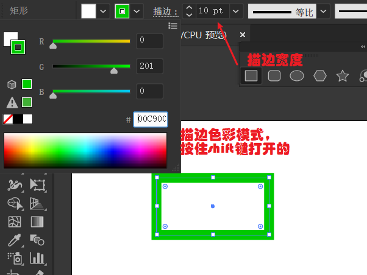

描边的**具体属性**，可根据自己的需求进行对应的设置，如果右边属性栏不一样，可点击三个横线**显示选项**


描边配置文件就是默认描边模板，可用宽度工具自定义。而**描边线条样式**默认使用的是**基本线条**，后面也可以使用更多高级的内容，比如自己绘制的图形作为描边线条的样式。

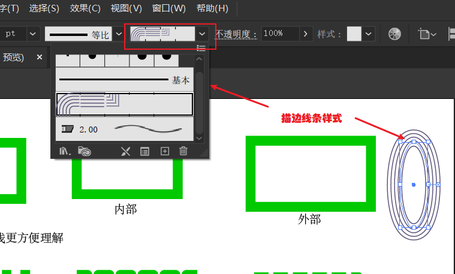

### 2.9 综合案例

综合案例：渐变盾形

利用圆形与形状生成器制作盾形

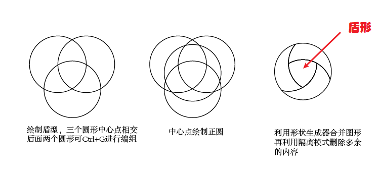

制作渐变色条

渐变色网站:https://uigradients.com/


创建一个矩形，并使用渐变色，将网站的渐变色复制到该矩形中


调整渐变颜色，使用渐变工具，重新着色以及复制利用透明度差正片叠底加深颜色等操作


案例：先天八卦，绘制八卦先绘制太极，方法很多就看自己的方式，然后八卦就是多边形加矩形制作，矩形的复制利用旋转复制

> **旋转工具快捷键R**，**alt键**可以设置旋转中心点，点击设置旋转角度就可得到效果

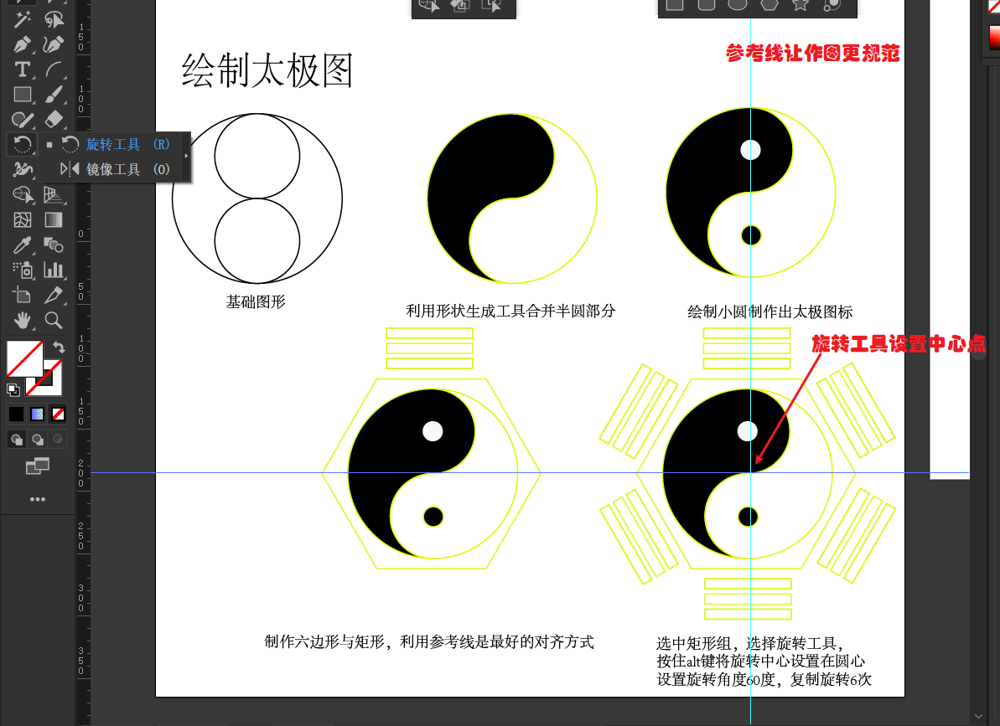

### 2.10 绘制图标

绘制图标最关键的就是分析图标，看是否能使用标准图形利用旋转，缩放复制等方式进行完成。


旋转复制图标案例


当然还有其他的图标，也都可以通过相似的方式制作

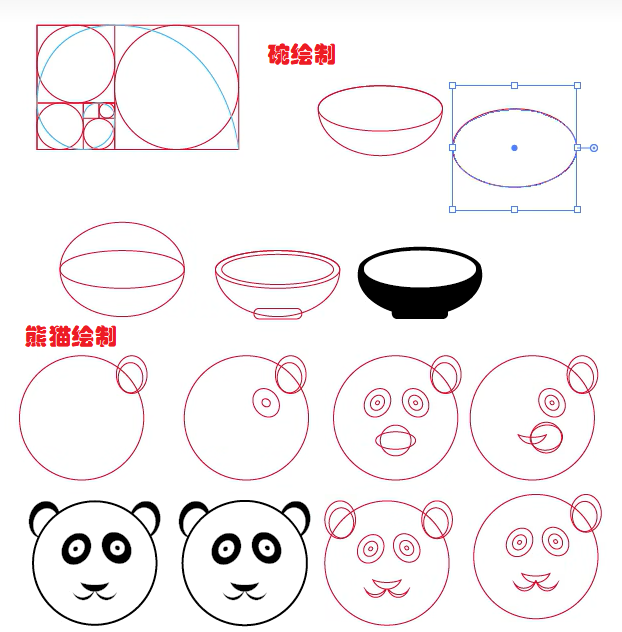

如果遇到特别复杂的，后期就可以使用**钢笔**来绘制，钢笔基本能绘制所有图形。

### 2.11 绘制对称图形

之前绘制对称图形，我们是使用变换中的翻转复制完成的。其实**镜像工具**也可实现同样的效果。


**镜像工具**是与旋转工具是一组的，其快捷键为**O**键。其操作方式跟旋转工具类似：

1. 方式1，选中对象，设置中心点，然后按住鼠标左键拖拽，要复制就按照alt键；
2. 方式2，选中对象，按住**Alt键**设置中心点，然后直接设置镜像属性（推荐使用该方式）。


如果需要两边同时进行绘制，也就是对称绘制。其步骤比较复杂：

1. 先绘制一条路径线当中对称轴，使用Ctrl+G进行编组；

2. 有编组后，给**编组**添加一个**变换效果**，不是给对称轴；(添加方式在菜单栏中**效果——扭曲与变换——变换**)

3. 设置对称轴的方向，副本数设置为1，设置参考点，参考点就是右边进行绘制，那参考点就在左边

   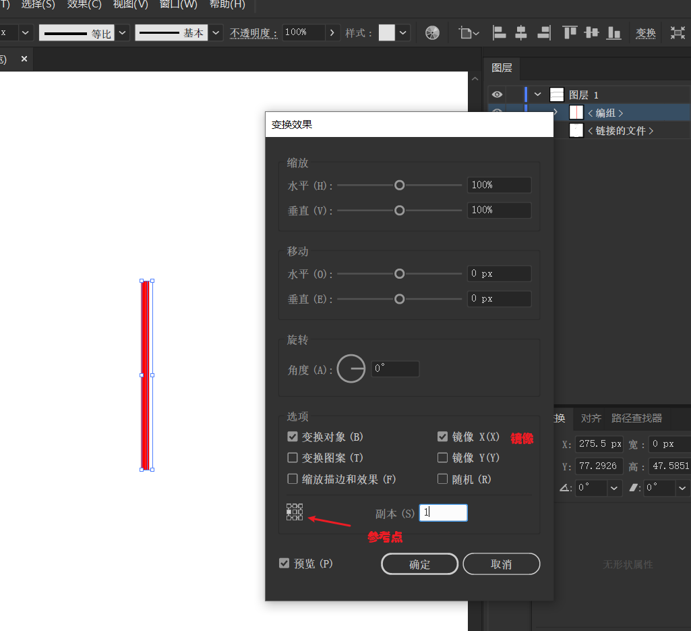

4. 设置确定好后，双击对称轴进入隔离模式，就可以开始绘制，绘制途中左边绘制什么，右边就会生成对应的内容**映射虚像**

   

5. 最后要将虚像转化为实际路径，菜单栏中的对象——扩展外观进行扩展后才算完成

   

### 2.12 绘制同心圆

通过旋转复制，可绘制出如下同心圆，其原理都是旋转复制。只是添加不同的效果得到不同的同心圆。

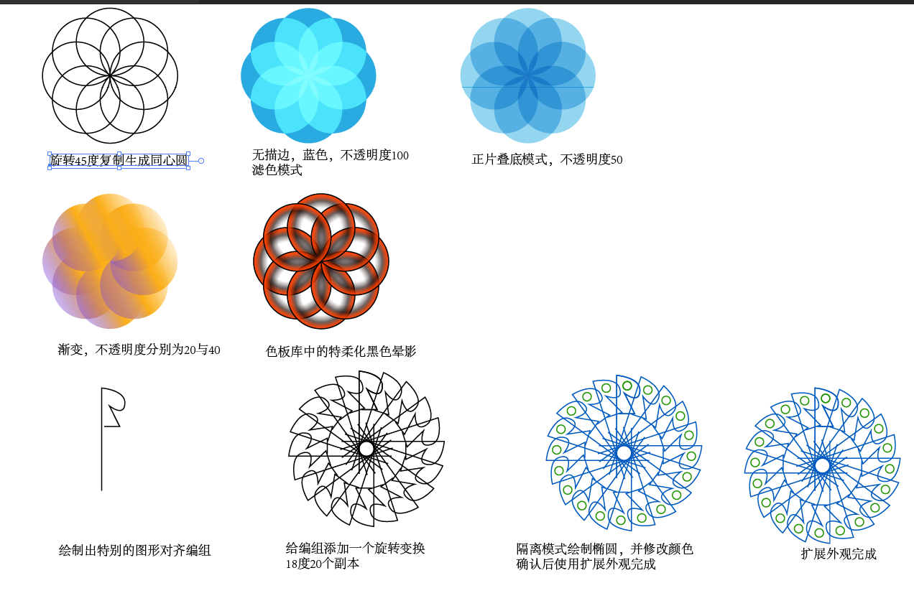

##  三、选择工具

在前面我们已经使用了普通的**选择工具**、**直接选择工具**以及**编组选择工具**。

1. **选择工具**（黑箭头快捷键为`V`）是最常用的，可以看作全局选择，鼠标左键点击可以单个选中，拖动鼠标可进行框选，以及**Shift键**进行多个选择或者取消选择；
2. **直接选择工具**（白箭头快捷键为`A`）可以看到局部选择，两者可通过快捷键进行快速切换；
3. **编组选择工具**，可选择编组对象局部内容；
4. **套索工具**需要选择多个图形，使用不规则图形来框选；
5. **魔棒工具**选择多个类似的图形，比如描边相似或者填充颜色相似时，判断条件可自定义

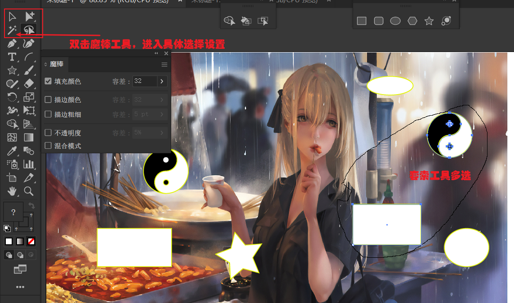

类似魔棒的效果还可以使用菜单栏中的**选择——相同——填色与描边**，也可以根据其他条件进行选择


**全部选择**快捷键**Ctrl+A**,**取消全选**快捷键**Ctrl+Shift+A**，**反向选择**就是选择除了选择图形以为的内容。

使用选择工具选择重叠图形时，特别是有背景图时，常常会错选背景，这时需要使用**锁定图层**来防止误选。

**锁定图层**方式有两种方式：

1. 选中对象，使用菜单栏中的锁定选择对象，或者快捷键**Ctrl+2**进行锁定，全部解锁快捷键**Alt+Ctrl+2**
2. 在图层中选择需要锁定的对象，点击前面空白位置进行图层锁定

在图层中，选中的图形后面会有一个**蓝色矩形**，该图标就表示选中状态。因此在**图层中选择**才是最精确的。


选择重叠对象时，还可以**右键——选择**上下对象从而实现一层层的向下选择

选中的内容需要保存选择状态，方便下次再次使用，可**存储所选对象**，类似于PS中的存储选区。


存储完后下次就可直接再菜单栏中**选择——所选对象1**直接选择内容，如果不需要可**编辑所选对象**进行删除即可。

与之类似的可以存储视图，在菜单栏中**视图——新建视图**，这样下次要跳转到该视图就十分快速。

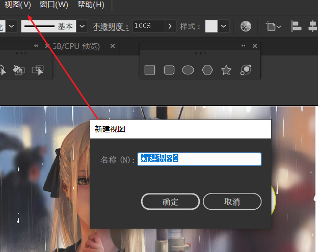

## 四、图层(★)

### 4.1 图层基本理论

图层是十分重要的内容，AI中的图层与PS中图层不同，PS中的一个图层就是一个对象，而AI中的一个图层中可包含多个对象。

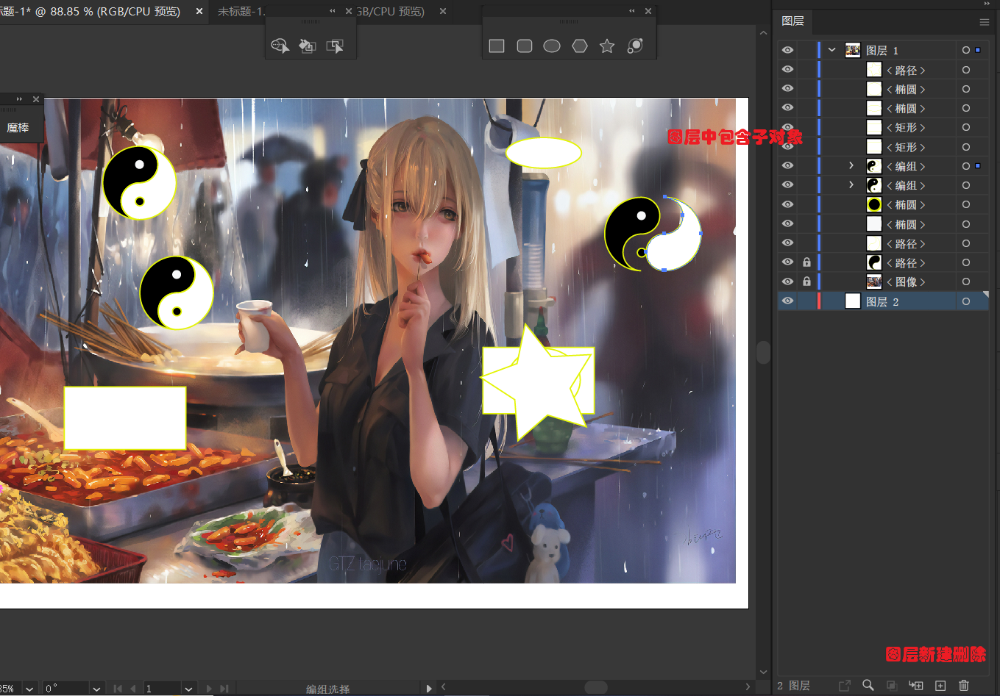

AI图层中的对象是依次显示的，也就是上边的对象显示在上层，图层也一样，上边图层显示在上层。**图层图标大小是可修改的**。

要移动图层上下位置，可选中对象**右键——排列**，其快捷键与PS中是一样的。也可直接在图层中进行**拖拽**。

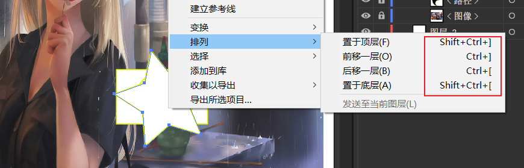

图层可**锁定**，也可使用眼睛选择**显示或隐藏**，还可以进行颜色分类。

图层中的对象可使用**Ctrl+G**进行**编组**，编组就类似将一个对象打包分类。显示在图层中就是**对象嵌套**的效果


### 4.2 图层归类

在使用AI绘制图形时，经常会发现我们制作完成后，所有的图形内容都在一个图层中，即不方便查找的也不方便导出。因此常常需要**图层归类**。步骤如下：

1. 新建图层

2. 选中同类对象，如果小图形没编组先**Ctrl+G**进行编组，编组完成后全部选中

3. 使用ctrl+X剪切，在选中新建的图层**Ctrl+F**在前方或者**Ctrl+B**在后方粘贴，注意不要使用**Ctrl+V**，这种粘贴会移动图形位置

   > 选中图像后，还可以直接**拖动选中内容后面的矩形**到新图层，这样也能实现剪切粘贴的效果

4. 粘贴好，根据内容重命名图层，锁定图层或隐藏，方便后面内容的选择

5. 重复上述步骤直到全部内容归类好，最终调节图层顺序(这样调节后是不影响原本图片内容的展示)


图层归类好后，不仅方便查找，还利于上色修改，最大的好处是可以很快导出图层中小图形，选中图层，点击图层下方的**收集与导出**便可一键导出多倍图。


## 五、布局

### 5.1 对齐与分布

**对齐**功能就是将多个图形按照一定规律进行对齐。对齐可以在功能栏中进行快速选择，也可在左下角对齐工具中选择


**分布**功能就是调整多个对象在水平与垂直方向的分布**间距**，一般是平均分配。


**分布间距**功能是可以**设置具体间距数值的分布**，应对一些大小不一致的图形要平均分布的问题，可使用该功能结合**对齐关键对象**实现平均分布。


对齐与分布的方式规则有三种，本质就是三种参考对象，分别是

1.  **对齐所选对象**，就是以**选中对齐对象整体的矩形框**为一个参考对象，按照规则进行对齐或者分布；
2.  **对齐关键对象**，就是以对齐对象中的**某个对象**(该对象会**高亮显示**)作为参考对象，按照规则进行对齐或者分布；
3.  **对齐画板**，就是以**画板**作为参考对象，按照规则进行进行对齐或者分布。


### 5.2 参考线

在对齐过程中，判断是否真正对齐，一般需要借助参考线或网格才能精准对齐。

**智能参考线**，在菜单栏中**视图——智能参考线**中打开，快捷键为**Ctrl+U**,默认开启，它可以在需要两个对象对齐时自动显示对齐线。


**参考线**，其功能就是帮助用户参考位置的，在打开标尺后，就可以拖拽出来的线，拖拽出的线可按**ALT键**进行横竖切换。

在AI中参考线也是有对象的，可以才图层中查看。


**参考线锁定**就是防止参考线被选中移动，其解锁与锁定的快捷键都是**Alt+Ctrl+;**,这个锁定是全局的。

**参考线隐藏**快捷键是**Ctrl+；**,清除参考线可以直接**del键**删除，如果参考线过多，可使用**视图——参考线——清除参考线**全部清除。

与网格。

**建立参考线**，快捷键**Ctrl+5**，可以把矢量图形制作为参考线,这样转化的图形就具有参考线的特性。如果该图不在需要参考线，就可使用**释放参考线**，快捷键**Ctrl+Alt+5**将图形还原。

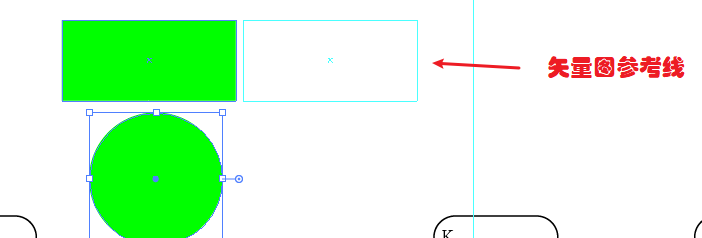

参考线是图层，因此对图层的操作它都可以做。

### 5.3 网格

**网格显示**，可以在菜单栏中**视图——显示网格**打开，快捷键为**Ctrl+“**；隐藏网格也是**Ctrl+“**。

网格的大小颜色在**首选项**中可以自己设置，默认72px*72px的网格。

**对齐网格**，选中后在移动图形时，就会发现移动后的位置都会对齐网格边缘，不会出现在网格中间的情况，默认没开启。

> **对齐像素**就是以图形像素点为单位对齐；
>
> **对齐点**就是图形间点与点对齐；
>
> **对齐字形**就是文字对齐时以文字形状对齐。

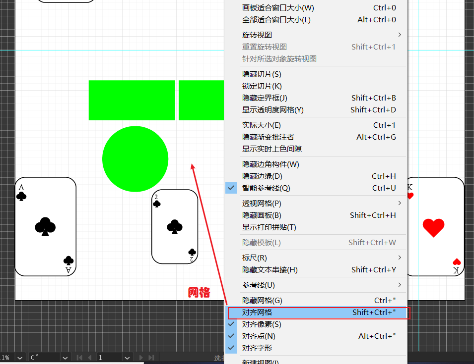

案例：扑克牌制作

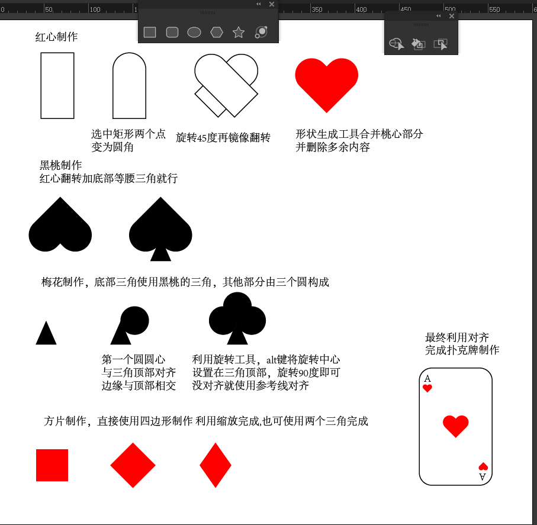

## 六、颜色

学习色板前，先补充了解AI中的颜色模式。

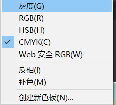

+ **灰度**：指的就是只有黑白灰三种颜色的模式；
+ **RGB**：也就是发光物体彩色模式，一般用于屏幕颜色；
+ **HSB**：色相、饱和度、亮度模式，以颜色、色差、亮度作为属性值的模式；
+ **CMYK**：颜料模式，也是常用的打印颜色的模式;
+ **Web安全RGB**：该模式会涉及一个色域问题，有些屏幕颜色无法打印出来，就可以使用该模式避免；

**反相**指的是颜色的相反颜色，颜色是有一个色环，反相就是得到颜色色环的对面的颜色。


**补色**指的是RGB数值中的三个颜色值中**最大值与最小值之和**分别减去三个颜色值得到的新颜色值。

### 6.1 色板

**色板**也就是常用的颜色色块的集合，其最大作用就是记录颜色。色板很常用，之前的描边颜色中以及在右侧工具栏中都有色板。


色板中的默认有**色相块**，如果需要新增色块，只需用吸管工具吸取颜色后新增色块就行。色块分为两类，**普通色块**与**全局色块**。

一般自己创建的色块都单独创建一个**颜色组**，这样方便区别默认内容。

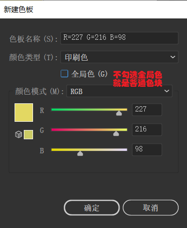

普通色块就是颜色的方块，而全局色块在右下角是有一个白三角表示的。

> **全局色**最大效果就是全局色颜色的图形颜色统一，一个改变全部都会一起改变。


一个图稿中有很多颜色，用吸管去吸取流程太多，可使用**新建颜色组**的方式一步建立所有颜色色块，其步骤如下：

1. **全选**Ctrl+A图稿全部**矢量图**内容；

2. **新建颜色组**，勾选**选定的图稿**，并将**印刷色转化为全局色**，这里的印刷色就是普通颜色；

3.  修改全局色，将图稿颜色修改，因为是全局色，因此是一个修改同颜色的就一起修改。

4.  如果该颜色组很好，下一个图稿依然需要该颜色组，可以将颜色组保存为**颜色文件ase**

   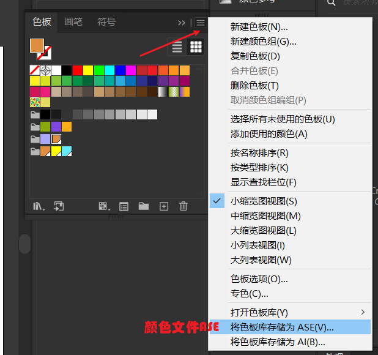

除了标准的色板外，AI中还默认有一些色板库可以直接使用。


如果软件中的色板不够用，还可以去网页中进行在线配色https://www.chinavid.com/color.html

配好后可以截图配色，然后再AI中将颜色吸取出来制作相关颜色组

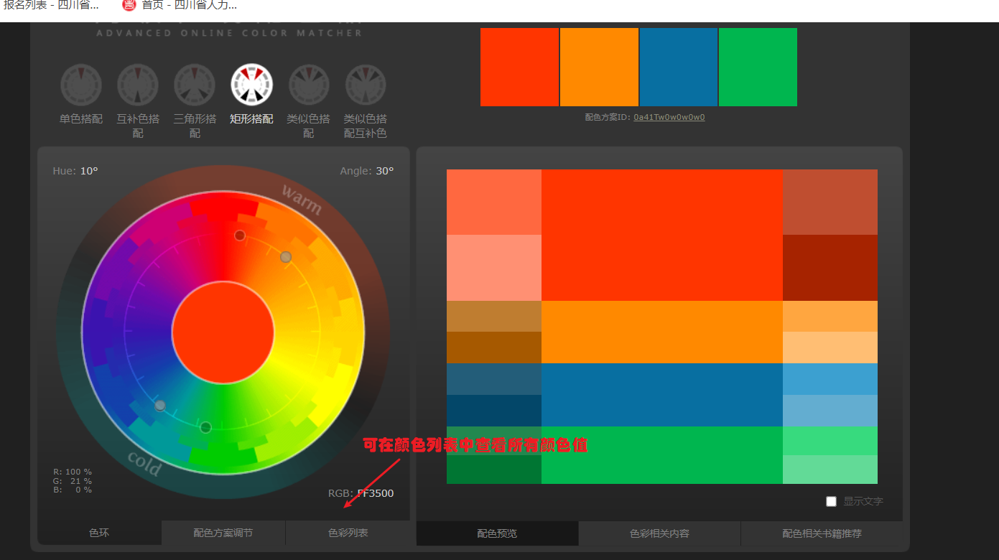

全局修改颜色的方式除了全局色外，还可以使用**重新着色图稿**，该功能可以全局修改选中图形的颜色，类似ps的滤镜。

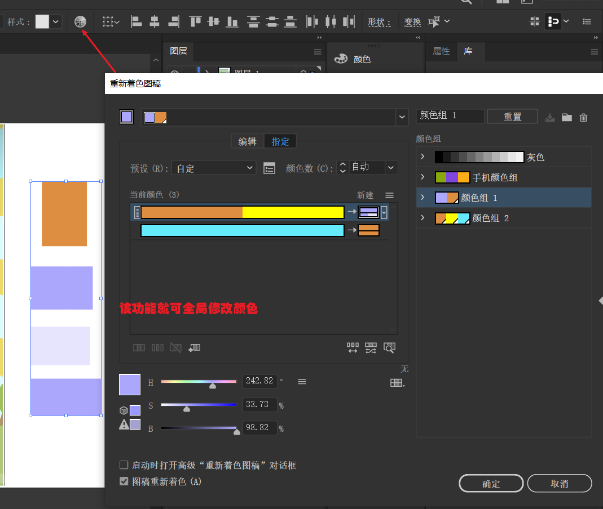

### 6.2 渐变色

渐变就是多个颜色过度效果。渐变有三种类型

1. **线性渐变**，是沿着一条直线进行渐变
2. **径向渐变**，是沿着一个圆形的半径进行渐变
3. **任意形状渐变**，自定义图形，按照自定义图形的路径进行渐变

其中渐变颜色可以通过**双击渐变色条下方**进行颜色添加，而渐变过渡可通过渐变色条上方的**菱形**控制，菱形离颜色越近颜色过渡就越突兀。

> 使用**渐变工具**拖出的线条与渐变色条是一致的，也可进行一样的操作。该线条可在视图中选择**隐藏渐变批注者**进行隐藏。


**渐变角度**就是控制渐变的方向。**不透明度**指的是渐变颜色的透明度，**位置**也就是渐变颜色的位置。

**径向渐变**大部分属性与线性渐变一样，其多了一个**长宽比**属性，该属性就是控制渐变圆形的长宽比，100%就是圆，其他为椭圆。


**任意形状渐变**，该模式下的渐变就是任意的，只需要控制**点或线来设置渐变颜色与路径**即可。


除了填充色进行渐变外，还有**描边渐变**，创建一个图形，不填充颜色，描边色使用渐变。描边渐变也有三种：①默认线型渐变，②角度渐变，③径向渐变

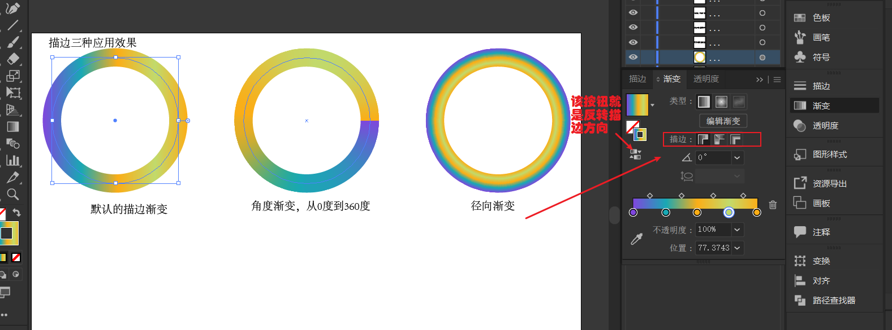

渐变色制作好后可以在色板中进行保存，渐变色板不能保存在颜色组中，且没有全局色块。

## 七、外观面板

打开外观面板的是在菜单栏**窗口——外观**，快捷键是**Shift+F6**,其基本的属性跟属性栏的值相似，但外观面板有更强大的功能。

其可以像图层管理一样**上下拖动属性位置**，可以创建多个效果叠加，在外观面板下面分别由三大功能

1. **添加新描边**，多个描边的叠加就可以实现多种色环的描边效果，其中位于上方的描边会覆盖下面的描边；

   

2. **添加新填色**，多个填充色可以使用蒙版、混合模式以及不透明度制作出各种效果，依然也是上方覆盖下方；

   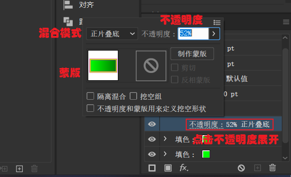

3. **添加新效果**，其功能就是PS中的滤镜效果，可以多个叠加制作出金属立体等特效。特效既可以单独作用于**描边**，也可以单独作用于**填充色**，还可以作用于**图形整体**（外部）。

   > 菜单栏中的**效果栏**中的选项全部都是拥有特效制作的，功能十分丰富，跟PS中滤镜库制作特效一样。
   >
   > 比较常用的效果有：
   >
   > 1. 扭曲与变换里的**粗糙化**，制作开通风格图
   > 2. 3D里的3D经典里的**突出与斜角**，制作立体图
   > 3. SVG里的**高斯模糊**，注意不是PS的，用于虚化背景
   > 4. 风格化里的**投影**，制作阴影

   效果分为**Illustrator效果**与**PS效果**，两者区别就在于PS效果制作出来的图将不再是矢量图而是位图，放大将会图像失真。

   

外观面板中的效果制作完成后，如果想要复用，可点击图形样式进行**新建图层样式**进行保存，后续要使用直接点击样式即可。系统中也有默认的样式库，在左下角可点击直接使用。


> **扩展外观（重要）**，默认外观面板里的属性都是一个图层对象的样式，它们是一个对象，但如果需要将这些样式分离出多个对象，就可使用菜单栏中**对象——扩展外观**，它可以将描边，填充以及特效等内容都单独分离出一个对象图层。
>
> 扩展外观除了对象外，也可对画笔工具绘制的路径进行扩展，它可以把**路径转化为形状**，更利于上色。

扩展外观的优点就是方便进行单独的调节每个样式的内容，缺点就是无法在原本的外观面板中进行数值调整。


案例：马路，其原型就是**一条直线**，利用多重描边制作出来的

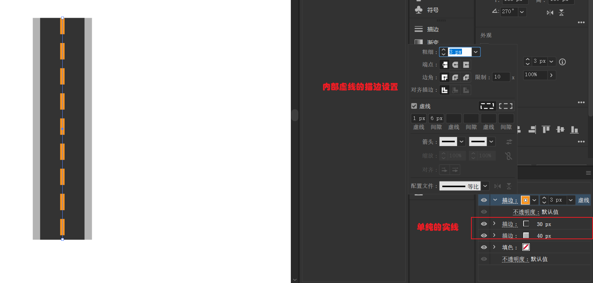

强化马路，制作好该图层样式后保存样式，就可以直接保存样式。

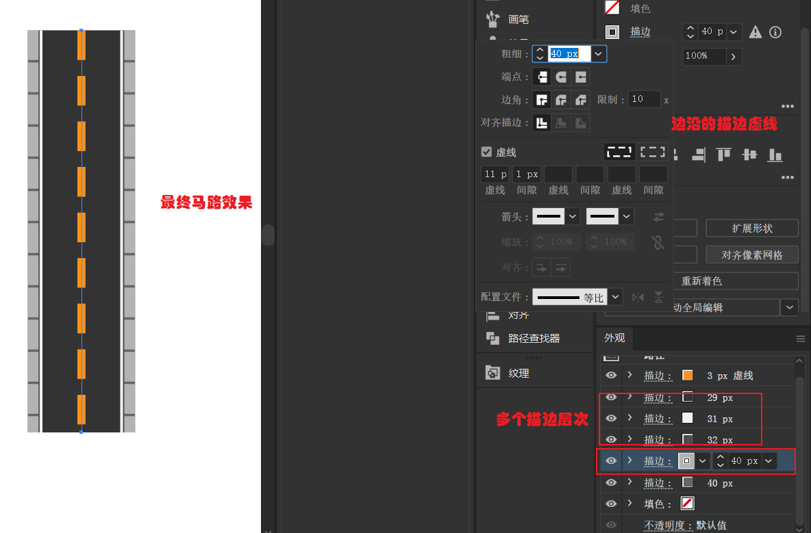

因为本身是线的效果，因此可以直接给绘制的图形添加样式，从而快速制作出各种马路

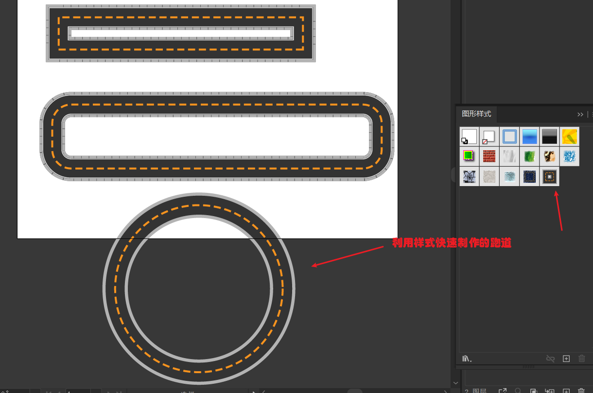

案例：字体效果，直接在文字上添加效果，比如阴影，立体的特效

> 复杂文字特效，需先将**文字转化为图形**，选中文字，使用菜单栏的**文字——创建轮廓**，快捷键**Ctrl+Shift+O**（右键也可直接创建轮廓）
>
> 再将图形转化为**复合路径**，选中图形，在菜单栏中的**对象——复合路径——建立**，
>
> 建立好路径后就可以按照复合路径的方式制作描边，填充等特效，其中偏移位置可使用**偏移路径**来移动位置


## 八、铅笔与画笔

### 8.1 铅笔

**铅笔工具**是跟直接的shaper工具是一组的，它们都是常用于形状塑形的。铅笔工具的详细设置可以双击铅笔工具打开。

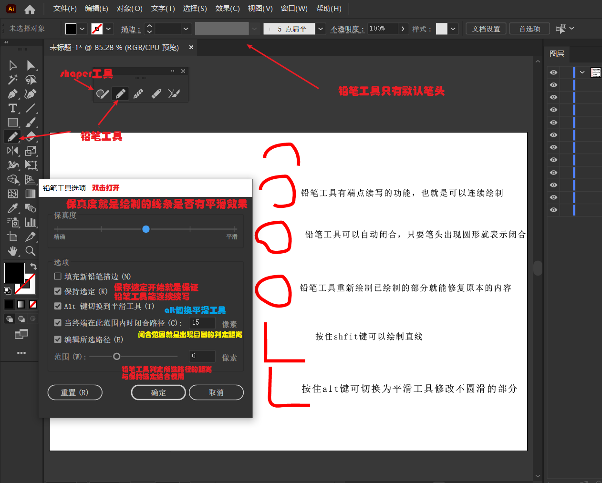

铅笔的重新绘制不仅可以修复，还可以直接改变方向，这样可以大大解决画错修复的时间。

### 8.2 画笔

**画笔工具**与铅笔工具使用操作很相似，但画笔使用起来更灵活，加上笔头可以自定义设置，因此画笔可以看作是铅笔功能的强化版它才是**绘制图形最常用的工具**，铅笔工具常常用于后期塑形。

> 画笔工具的自动闭合功能是需要按住**alt键**才会出现圆圈的，这一点跟铅笔工具的自动闭合不同。
>
> 画笔工具绘制直线，需要按住**shift键**。
>
> 画笔工具笔头的大小调节，其快捷键是**[键**与**]键**，其他工具快捷键也是一样比如斑点画笔、橡皮擦，如果无法调节，先按shift切换输入法后在尝试。

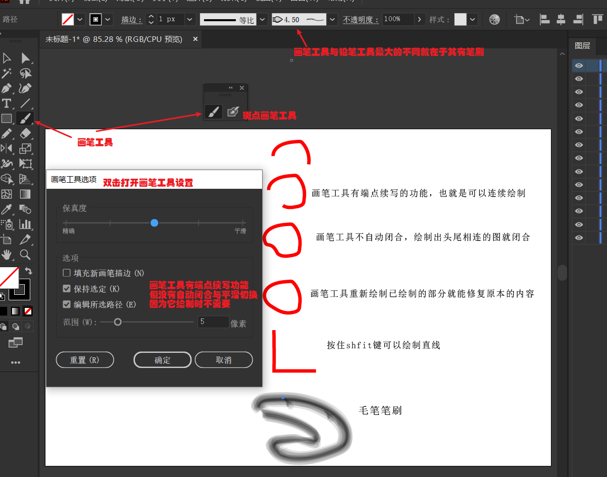

不管是铅笔还是画笔工具手动绘制出的曲线，路径**锚点**都是很多的，有很多其实是无效的，在上色前，都需要**路径简化**。

**简化**功能，是在菜单栏中**对象——路径——简化**，也可直接**右键——简化**打开。如果出现的不是下图中的详细设置，是没打开**三个点的更多选项**。


案例：**绘制熊猫**，将熊猫图片放入ai工具中，锁定，使用画笔绘制。

画笔绘制的初略图，绘制时其中相交部分要画出（例如耳朵部分），防止自动修改将原本绘制的部分删除。

> 闭合部分的路径一定要记住alt键进行闭合。


绘制好粗略图后使用**形状生成工具**，按alt键将多余的线头减去，并精简锚点。

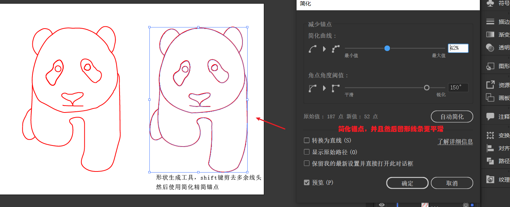

上色前先复制一份，上色后的描边，可以利用复制出来的轮廓，删除眼睛与鼻子部分，然后与上色图对齐放置。最终效果如下：

> 上色时如果出现无法上色的情况，说明选中的对象是混合对象，有可能是路径中出现多余对象，尽量删除多余的后再上色


### 8.3 斑点画笔(上色)

斑点画笔工具与画笔工具是一组的，其快捷键是**Shift+B**。斑点画笔工具的属性也可双击打开。


快速调节斑点画笔的大小跟画笔调节一样，使用**[键**或**]键**就行。


可在轮廓视图中看得更加明显


斑点画笔工具与画笔工具的区别：

1. 斑点画笔绘制出是**图形**，而画笔工具绘制出的是**路径**，路径可通过**扩展外观**功能转化为图形；
2. 画笔工具主要用于绘制图形，斑点画笔工具主要用于**上色**；
3. 画笔工具交叉线条不会自动合并，斑点画笔工具交叉线条只要颜色一样就能合并；
4. 画笔工具绘制路径，因此要求**没有填充色，只有描边色**，斑点画笔工具绘制形状，一般没有要求。

斑点画笔工具最核心的作用就是上色，其上色的步骤为：

1. 选中上色的图形，看是路径图还是形状图，如果是路径图先使用外观扩展转化为形状（防止后续删除时误删路径）；

2. 编组，将图形使用Ctrl+G进行编组；

3. 切换绘图模式，快捷键**Shift+D**，切换为背面绘图模式；

   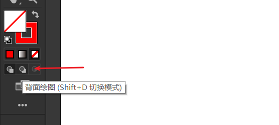

4. 选中斑点画笔工具，调节好笔头大小，并移除填充色，描边色设置为要绘制的颜色；

5. 涂抹要上色的部分，不用担心超出，只要覆盖并尽量保证涂抹部分连成一块即可；

6. 选中图形，使用形状生成工具，按住**ALT**键删除多余颜色部分就完成了。


> 斑点画笔与实时上色工具都能实现快速上色，它们的使用是各有优缺点，实时上色一般处理**封闭路径**，擅长精准上色，对复杂元素的处理比较有限。斑点画笔就擅长处理大范围颜色，对于精细上色不擅长。

两者常常是结合使用的。例如下图的花最快速的上色方式就是先用斑点画笔上色全部，再用实时上色工具上色花蕊。

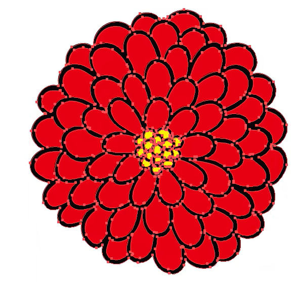

### 8.4 内部绘图模式

**内部绘图模式**，就是再图形内部进行绘制，要进入该模式，必须选中一个图形，按**shift+D**进行模式切换，该图形的轮廓就会生成剪切组，这样绘制的内容就是在该剪切组下的类似PS中的**蒙版**效果。

为了方便演示，创建一个只有**描边没有填充**的圆形作为范围。

> 绘制图形轮廓时，**一定只能用描边不要用填充**，否则后期路径分割会出现意想不到的各种问题。


内部绘图模式还可以与斑点画笔结合使用，就是把斑点画笔工具绘制的颜色拖入剪切组中，就自动完成颜色的切割


如果还需要对该内容进行实时上色，会发现无法成功


因为这里剪切组中创建了剪切蒙版，并非普通路径，要解决问题，使用路径查找器分割图形，分割后剪切组就没有了变成普通编组

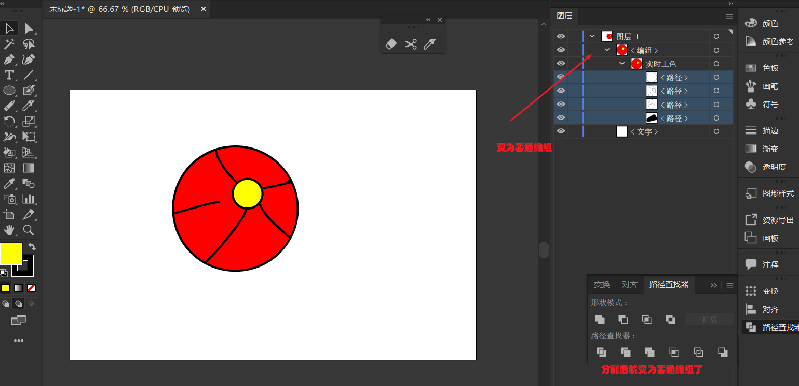

遇到有间隙使用实时上色会把两块连着一起上色，这时就可以使用直接选择工具调整间隙，并在菜单栏中**对象——实时上色——间隙**设置为大间隙。


## 九、钢笔

### 9.1 钢笔工具

> **路径**是矢量的线段(有方向)，它是由一个个路径点(又叫**锚点**)构成。非闭合的路径构成**线段**，闭合的路径构成**形状**(图形)。

之前我们以及学习过铅笔，画笔工具等，它们绘制的锚点都是自动生成的，我们没法控制生成的锚点位置与数量。而钢笔工具恰恰相反，它就是专门用于绘制锚点的，最简单的直线，只需要使用刚刚工具点击两个锚点就能生成。

钢笔工具的快捷键是**P键**，如果要绘制出笔直的线，按住**shift键**就可绘制。钢笔**结束绘制**有3种方式① 按**enter键**②按**esc键**③按住**Ctrl键点击其他空白处**。


钢笔不仅能绘制直线，它更擅长绘制**曲线**。最著名的贝塞尔曲线就是钢笔工具的数学原理。

钢笔要绘制曲线，只需在点击锚点后**长按鼠标左键**，就能拖出锚点控制线，控制该曲线的方向长度就能调节生成的曲线。

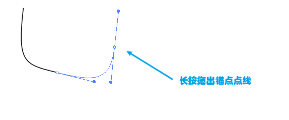

**锚点控制线**是双向的，我们也常常把它们称为**左右手柄**，这两条手柄就是控制曲线**曲率**的。也可看做是生成曲线的**切线**。

> **左右手柄**拖动时也可按住**shift键**，这样拖出的线也会是笔直的。

钢笔工具也有闭合功能，当绘制的终点与之前绘制的锚点重合就能绘制出**闭合路径**也就是图形。这时钢笔头会出现圆圈。

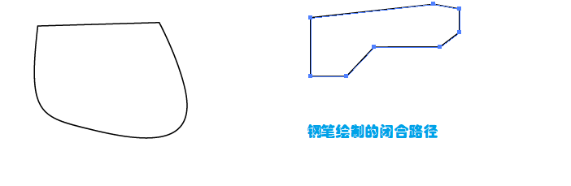

钢笔绘制出S型曲线

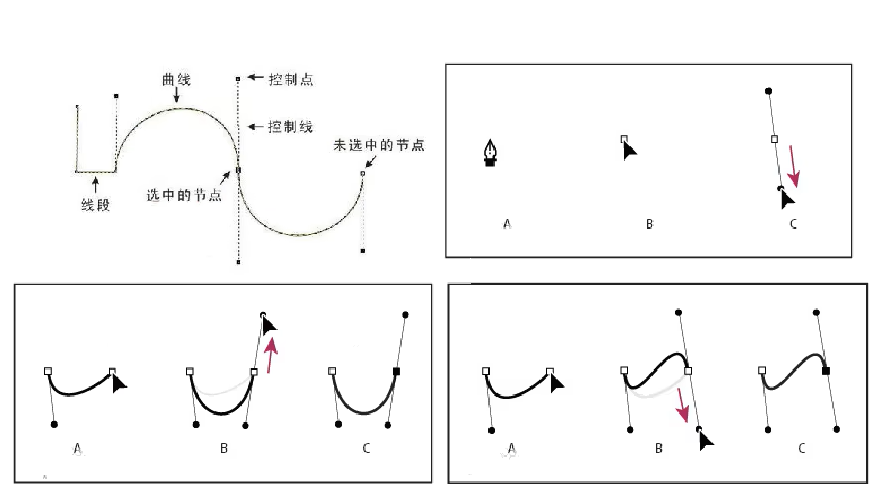

钢笔搭配不同的快捷键会出现不同的光标。

+ 新绘制一个锚点就会是*****号（跟之前的铅笔、画笔是一样的）；
+ 在已有路径上**添加锚点**或者**删除锚点**，按键盘的**+键**或**-键**进行切换；
+ 路径封闭时，会出现**圆圈**表示路径封闭(跟之前的画笔是一样的)；
+ 在之前绘制的路径上再次绘制，就会出现**/线**表示继续绘制；
+ 转换锚点，可按住**alt键**进入该模式


> **alt键**转换锚点其原理就是将锚点控制线归零。
>
> 它可以实现很多的效果：①可以直接将曲线转化为直角，②可以重置曲线曲度，也就是将锚点控制线还原；③还可用于删除一半控制线，这样就能在绘制尖锐的拐角（删除方式就是点击要删除一边的手柄头）
>

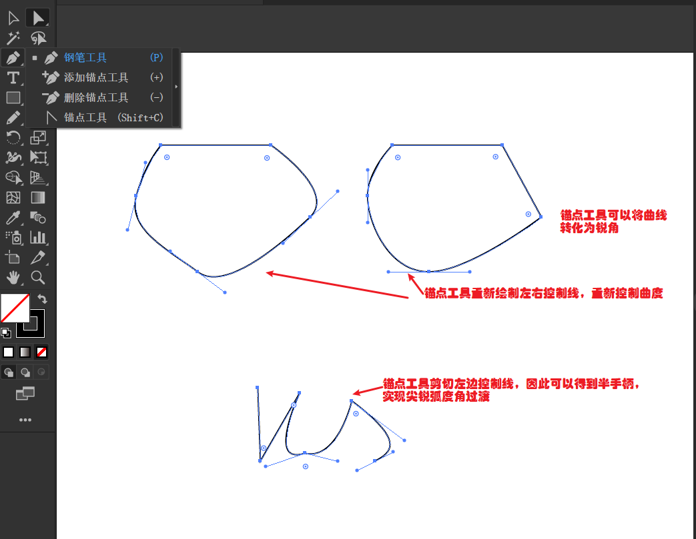

> 钢笔工具控制锚点的快捷键：
>
> **alt键**用于转换锚点，本质就是钢笔工具转换为锚点工具，**长按alt键拖动锚点手柄还可移动锚点手柄方向**，比如制作垂直90度的手柄，也可点击删除一半手柄
>
> **shift键**用于绘制直线或者对角线，一是控制绘制出的线是笔直的，二也可控制锚点的控制线是笔直的；
>
> **Ctrl键**可以选中移动锚点，其实就是切换为直接选择工具；

使用直接选择工具查看时如果没有控制线显示，可在首选项中设置


钢笔工具要熟练使用就在于多练习，练习越多钢笔工具就越熟练。下图就是简单钢笔练习：

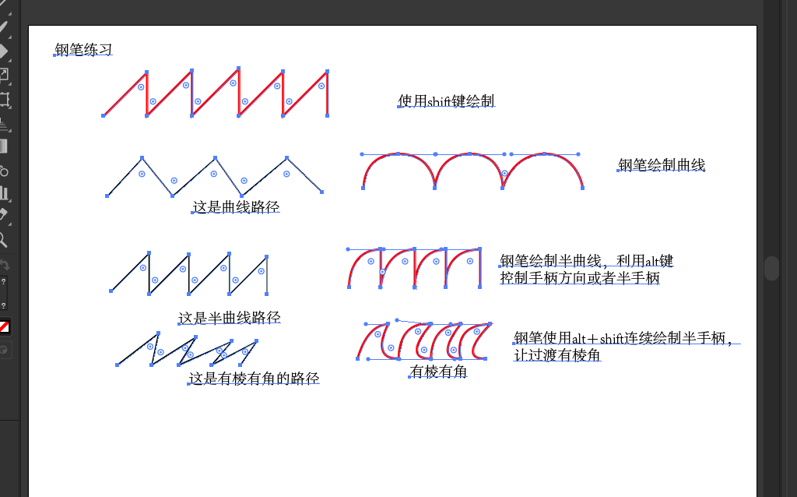

钢笔练习最简单的方式，就是找现有的形状，使用钢笔对齐进行描边，也就是类似PS中的抠图。在使用过程中要经常使用快捷键，**Ctrl键**选中锚点移动锚点，**shift键**绘制直线，**ALT键**放到锚点处就**转换锚点**，放在路径上就变为**整形工具**，它可直接调整曲线。


### 9.2 四种曲线工具

钢笔工具可以绘制任意曲线或者直线，但有时会觉得钢笔工具使用太复杂。

**曲率工具**，它是一款高效绘制曲线的工具，快捷键是**Shift+~**。它是可绘制曲线与直线的。

曲率工具也是点击绘制锚点，但它没有钢笔那么复杂，只需**点击曲线点**，它会自动绘制曲线，如果不对就**移动曲线点**或者**添加曲线点**就可以绘制出下面的简单曲线图形。


相比于钢笔工具，曲率工具绘制的锚点可能会很多，这时就使用右键**简化**锚点数量。

第二种高效绘制曲线的工具**整形工具**。它类似曲率工具，可以直接调整**曲线的曲度**，其快捷键就是**钢笔模式**下按住**alt键**放到路径上即可，按住**shift键**可以绘制标准圆形曲线。


其最强大的效果就是利用钢笔工具定点图形的折线图，然后使用整形工具直接调整为曲线。这种绘制方法非常快速。


第三种高效绘制曲线的工具就是**弧形工具**。其绘制类似直线工具，但它绘制出的曲线是一段段的。如果需要连为一体连接工具。

弧形工具调节弧线弯曲方向按**X键**进行切换，调节弧度大小使用键盘的**上下方向键**。

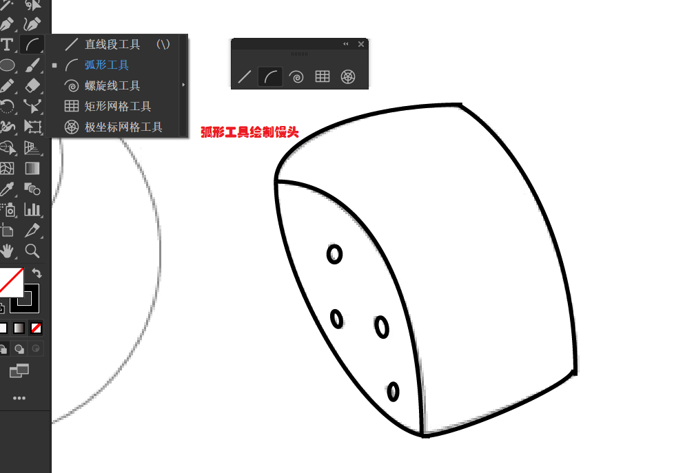

如果要制作毛发方面的内容，可以使用**~键**进行快速绘制

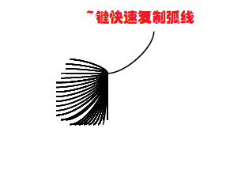

第四种快速绘制曲线的工具，就是使用**直接选择工具**，它的边角控制点就可以快速绘制曲度角

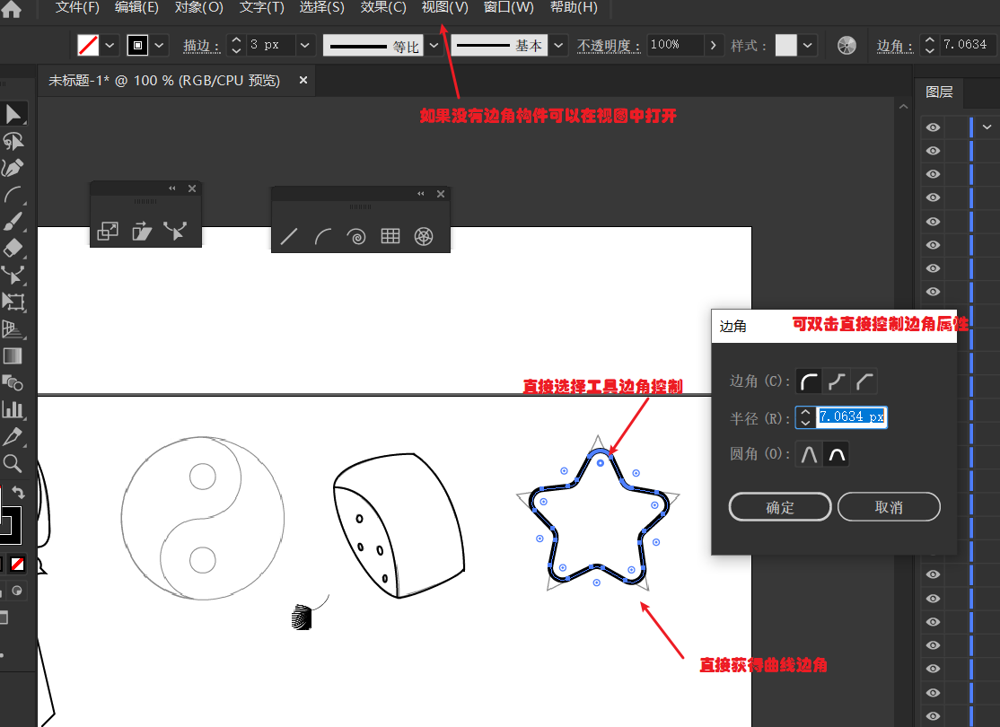

基本掌握好使用上述四种曲线工具，绘制曲线将非常简单快速。


## 十、辅助绘画工具

**辅助绘画工具**，主要是帮助我们在绘制过程中进行细节修改的工具，比如直接接触过的shaper工具，以及铅笔工具。它们都是辅助绘画用的。接下来介绍其他的辅助绘画工具：

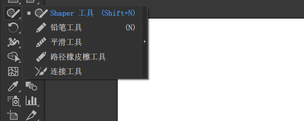

**平滑工具**，直接也说过可以在铅笔模式下按ALT键进行切换，主要用于平滑直接，比如将尖锐边角变得圆滑。平滑工具要有效果，必须选中对象在使用平滑工具涂抹。

除了平滑工具可以平滑边角外，**直接选择工具**也有一样的效果，就是单独选中要平滑的边角，使用边角转换或者拖拽


**路径橡皮擦工具**，该工具是擦除路径的功能，其效果类似直接**切断路径的连接**，其中鼠标按的力度越大，擦除范围也越大。要使用直接选中工具选中路径后才可擦除。擦除后的路径是断开的

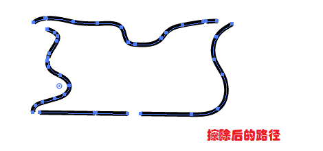

**连接工具**，该工具就是用于断开路径的连接，其中**直接选择工具**也有连接断点的功能，但两者最大的不同就是连接工具有一定的**记忆功能**，能恢复大致原本断点连接的形状，直接选择工具的连接就是直接两点相连。

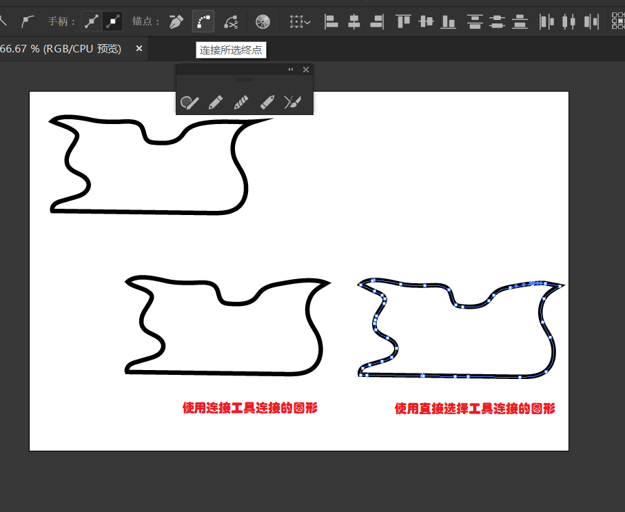

要查看路径是否恢复完全，可进入轮廓模式下查看。路径全部连接就说明以及恢复完全。轮廓模式下也可连接路径。

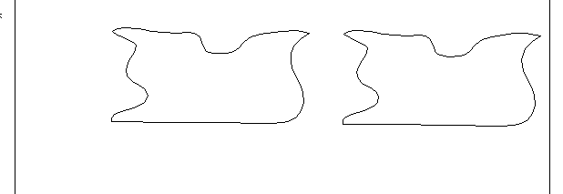


除了上边的辅助工具外，还有一组工具也是用于辅助的

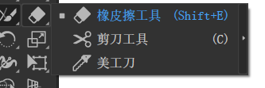

**橡皮擦工具**快捷键是**Shift+E,**其大小调节快捷键也像画笔一样。橡皮擦工具可以直接擦除，也可按住**ALT键**进行范围擦除

> 橡皮擦擦除的内容就是**路径点**，而路径橡皮擦是直接**分割路径**，两者本质是不同的。

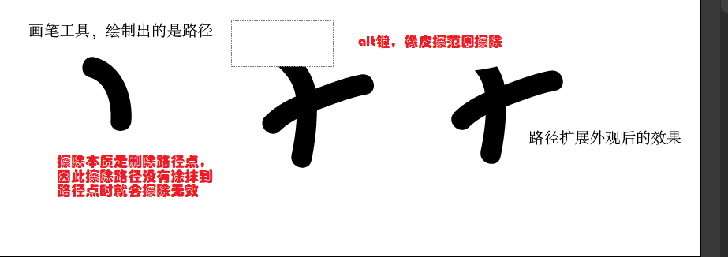

橡皮擦针对封闭路径有**自动闭合路径**的功能，也就是擦除的部分如果没有连接就会自动创建新的路径点进行连接。利用该功能，可以用橡皮擦实现绘画的效果。

开发路径下就没有自动闭合功能，擦除效果就是直接分割路径，效果就与路径橡皮擦类似。


**剪刀工具**，快捷键是**C键**,它的效果是直接分割路径，切割方式就是在分割处点击一下即可。剪刀工具与橡皮工具的区别就是对应封闭路径，它不会有自动闭合的效果。

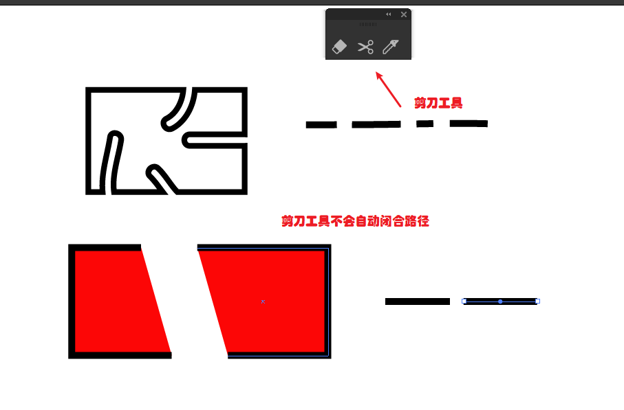

**刻刀工具**，其分割效果类似水果切割，他是直接将图形分割为多份。跟之前路径查找器的分割效果一样


其中要刻刀绘制出直线，按住**shift键**再绘制就行。刻刀工具也可以实现类似橡皮擦绘图的功能。

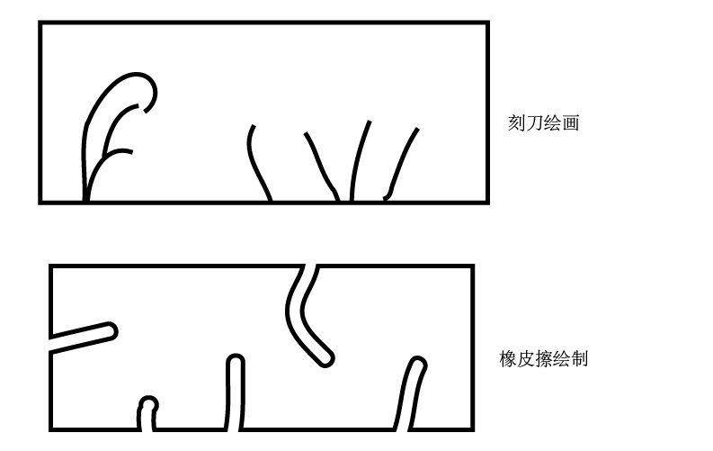

刻刀工具只对封闭路径有效，对开放路径，例如直线是没有效果的。

如果使用路径橡皮擦擦除封闭路径后再用刻刀绘制，会发现擦除部分会被连接，连接效果根据情况而定。


## 十一、扭曲变形工具

扭曲变形工具组不用于绘制图形，它们主要用于给绘制好的图形添加膨胀、收缩、液化、长刺的效果。

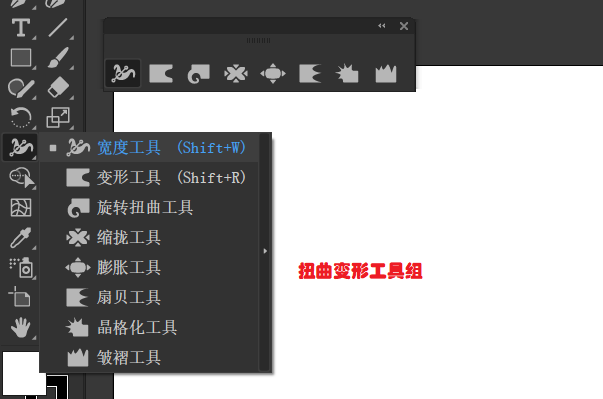

**宽度工具**，快捷键**Shift+W**,该工具主要用于调节描边宽度，通过拖拽描边路径上的圆点扩宽或收窄描边。


**变形工具**，快捷键**Shift+R**；该工具功能是让物体产生变形的效果，其具体效果跟PS中液化很相似。

> 调节涂抹笔头大小的快捷键为**ALT+Shift+鼠标左键拖拽**，这是等比缩放，如果不等比可以直接**Alt+鼠标左键**进行缩放。

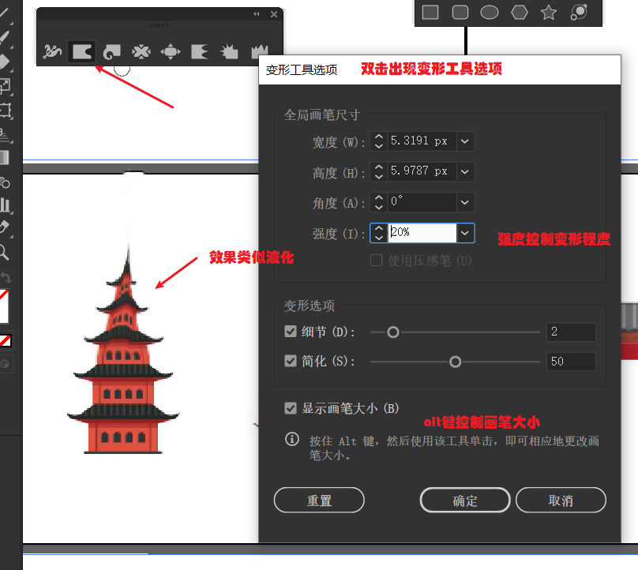

**旋转扭曲工具**，其效果就是产生螺旋形扭曲的效果，常常用于制作头发，花纹的效果，其操作方法基本与扭曲变形一样。

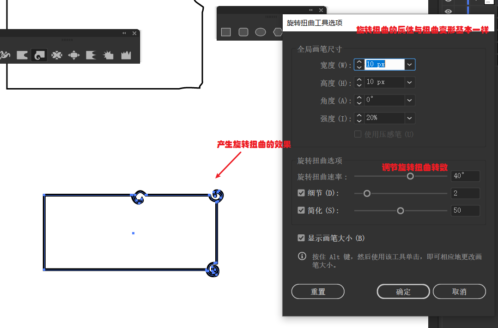

**收缩工具**与**膨胀工具**，这两个工具的效果就是放大与缩小图形的效果。其操作也有扭曲变形基本一样。


**扇贝工具**与**晶格化工具**，主要是产生尖刺突出的工具。扇贝是向内进行长刺，晶格化就是向外进行长刺。


**褶皱工具**，它是融化工具，主要用于产生一种水滴，蜡烛融化的效果。

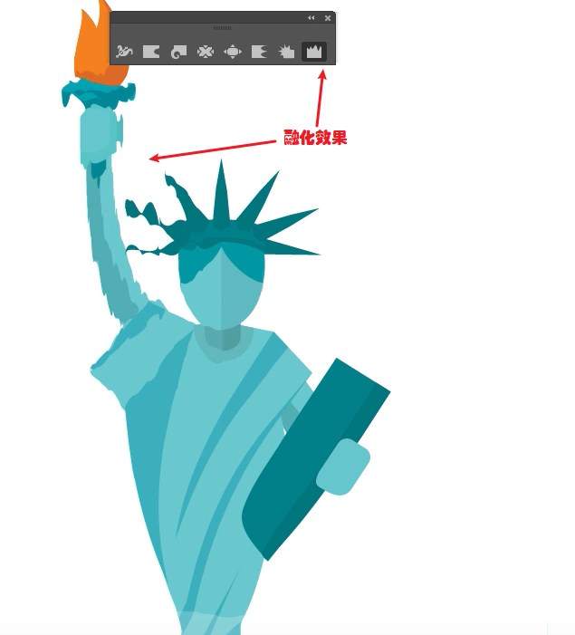

，
