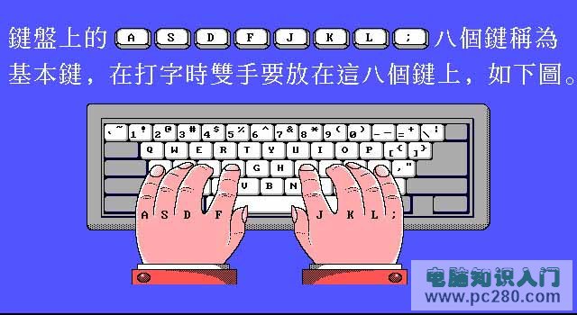
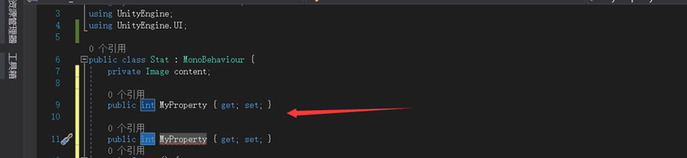

# windows10桌面图标简化

桌面图标太多，很难看，有一种方式可以简化桌面，就是固定到开始菜单与任务栏

如果任务栏东西太多也不好看，这就看个人

Windows10查看最近访问文件记录

https://jingyan.baidu.com/article/ca41422f095d8c1eaf99ed51.html

**windows10**系统恢复文件默认打开方式的方法 比如dat二进制文件的打开方式

http://www.xitongcheng.com/jiaocheng/win10_article_35320.html

# VC++2015安装失败解决

一位用户在windows10系统电脑中安装VC++2015时遇到了设置失败问题，提示：一个或多个问题导致了安装失败。请修复这些问题，然后重试安装。有关系昂细信息，请参阅日志文件 。0x80070666 - 已安装这个产品的另一个版本。这个版本的安装无法继续。要配置或删除这个产品的现有版本，请用“控制面板”上的“添加/删除程序”。这是怎么回事呢？其实，该问题是由于系统中已经包含老版本的vc++导致的。接下来，系统城小编给大家介绍下解决方法。

**步骤：前提需要通过程序和功能 将旧版的vc++ 卸载**

1、首先下载"VC6.0垃圾文件清理工具"（[下载地址](http://down1.greenxf.com:8010/系统工具/卸载清除/CleanVC(www.greenxf.com).rar)）；（使用迅雷下载）

2、将下载的到压缩包解压出来；

3、打开文件夹，在 CopyAndReg.bat上单击右键，选择以管理员身份运行即可开始清理 系统中旧版本 vc的一些残留文件。

清理完成后重新启动一次计算机即可正常安装vc++2015！

win10安装vc++2015提示错误0x80070666问题的解决方法就介绍完了。有遇到同样问题的朋友们，都可以操作看看

# **电脑键盘指法练习**

**摘要**:学会正确的键盘指法打字，对以后在使用电脑时是很重要的。正确的指法有利于快速实现盲打，而不用一直看着键盘打字。本文有提供电脑键盘指法练习图，可以很方便的让你学习电脑键盘指法

电脑键盘指法练习学习目的：

1. 正确的指法；

2. 熟悉字母位置。电脑键盘指法学习步骤：第一步、将手指放在键盘上（如下图，手指放在八个基本键上，两个母指轻放在空格键上）第二步、练习击键（例如要打D键，方法是：1、提起左手约离键盘两厘米；2、向下击键时中指向下弹击D键，其它手指同时稍向上弹开，击键要能听见响声。击其它键类似打法，请多体会。形成正确的习惯很重要，而错误的习惯则很难改。

3. 练习熟悉八个基本键的位置（请保持第二步正确的击键方法）

4. 练习非基本键的打法（例如要打E键，方法是：

   1、提起左手约离键盘两厘米；

   2、整个左手稍向前移，同时用中指向下弹击E键，同一时间其它手指稍向上弹开，击键后四个手指迅速回位如上图，注意右手不要动，其它键类似打法，注意体会）。

5. 继续练习，达到即见即打水平（前提是动作要正确）。

   1、键盘左半部份由左手负责, 右半部份由右手负责。

   2、每一只手指都有其固定对应的按键: (1) 左小指: [`]、[1]、[Q]、[A]、[Z] (2) 左无名指: [2]、[W]、[S]、[X] (3) 左中指: [3]、[E]、[D]、[C] (4) 左食指: [4]、[5]、[R]、[T]、[F]、[G]、[V]、[B] (5) 左、右拇指: 空白键 (6) 右食指: [6]、[7]、[Y]、[U]、[H]、[J]、[N]、[M] (7) 右中指: [8]、[I]、[K]、[,] (8) 右无名指: [9]、[O]、[L]、[.] (9) 右小指: [0]、[-]、[=]、[P]、([)、(])、[;]、[']、[/]、[\]

   3、A、S、D、F、J、L八个按键称为“导位键”, 可以帮助您经由触觉取代眼睛, 用来定位您的手或键盘上其他的键, 亦即所有的键都能经由导位键来定位。

   4、[Enter]键在键盘的右边, 使用右手小指按键。

   5、有些键具有二个字母或符号, 如数字键常用来键入数字及其他特殊符号, 用右手打特殊符号时, 左手小指按住[Shift]键, 若以左手打特殊符号, 则用右手小指按住[Shift]键。

   总结：字母练习所需时间约两天（每天六小时），一定要保证达到即见即打水平。 电脑键盘指法练习图1、2电脑键盘指法练习图1 电脑键盘指法练习图2 小键盘的基准键位是“ 4， 5， 6”，分别由右手的食指、中指和无名指负责。在基准键位基础上，小键盘左侧自上而下的“7， 4， l”三键由食指负责；同理中指负责“8， 5， 2”；无名指负责“9，6，3”和“．”；右侧的“一、十、↙”由小指负责；大拇指负责“O”。 小键盘指法分布图见1。图3小键盘指法图指法练习软件免费下载地址：金山打字通http://typeeasy.kingsoft.com/五笔指法练习：五笔打字拆字规则学习 (责任编辑：电脑实用百科)

# 单机游戏环境

运行单机PC游戏，需要安装环境有核心有三样:

+ DirectX 每种游戏开发使用的版本不同，安装的Direct版本也不一样
+ Microsoft .NET Framework 
+ Visual C++运行库 各种版本都需要（不同游戏需要的运行库版本不同，并且x86与x64都需要安装）

次要的

+ Rapture3D 2.7.4 Game
+ Open Audio Library 2.1.0 (OpenAL)
+ NVIDIA PhysX System Software 9.16.0318
+ Social Club 1.2.1.0
+ Microsoft AppLocale(微软官方解决游戏乱码工具)

# 小知识

1. ctrl + d切换到桌面 就可以使用右手边的上下左右键打开应用了
2. 打开的可以使用alt+tab进行切换  
3. word软件可以按alt键打开操作模式，各种使用全都可以使用按键解决
4. 有道云笔记可以创建删除格，使用的快捷键是ctrl+d键
5. 有道云笔记使用shift+加移动键支持多选

6. windows关闭应用快捷键 alt F4 
7. 360助手ctrl+enter可以进入快速访问界面
8. alt+左右键控制页面全屏或是非全屏
9. 压缩文件如何变成exe,创建自解压文件

​    

#  查看windows版本号

按下键盘 **Win键+R键**，在弹出的运行框里面输入**winver**并按enter确定，即能看到你的版本号了（如下图）里面有1803，说明你的Win10版本号是1607，其它的1703，10586（1511）或10240也都会在这里显示！

这方法兼容一切win系统…

**提醒：Win10系统必须用和自己版本号一样的主题，切勿尝试使用Win10其它版本主题或Win8主题，只有1803，1709和1703版本的主题互相通用，其它版本均不通用，跨版本使用主题真滴会闪屏！**

**Win10主题版本区分**

**列表页面**

**内容页**

**下载页面**

# VSCode小技巧

1. 小技巧：快速创建prop对象的快捷方法，prop字段+2下Tab按键，就会快速创建一个带get，set的属性字段

   

2. 小技巧：**重构字段**，VS提供快速重构的方式，比如创建一个private的字段，需要外部获取他的值，就可以使用重构

   

   有两种重构选择

   

   重构的结果

   两种都可以，不必在意因为后期都会根据个人需要进行修改的，而这样的封装有很多好处（这就相当于java的属性封装，方法接口的模式)

