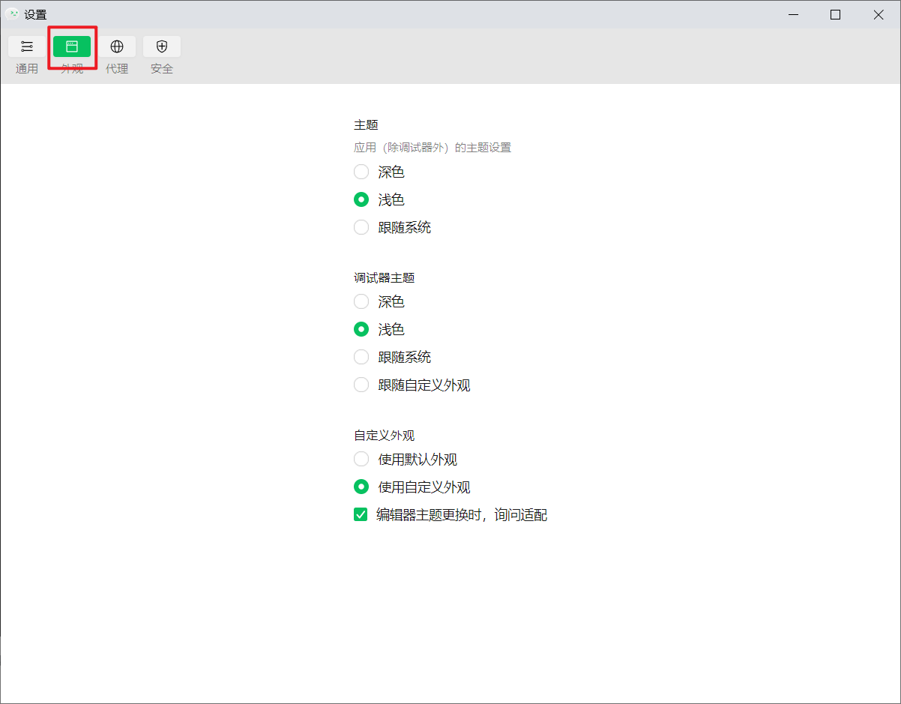
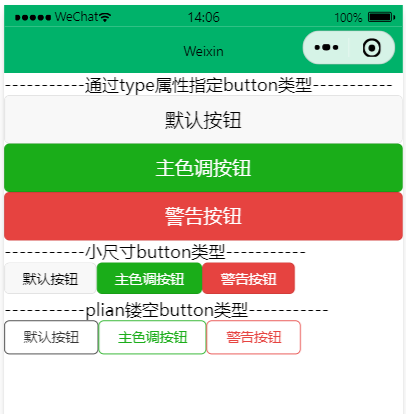
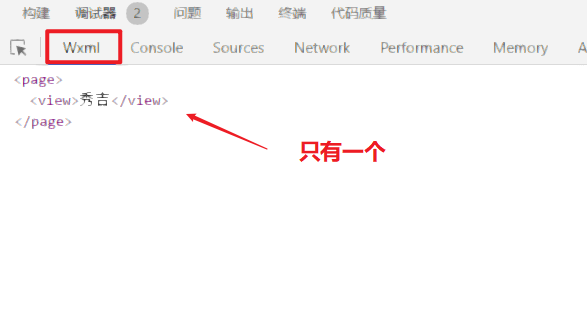
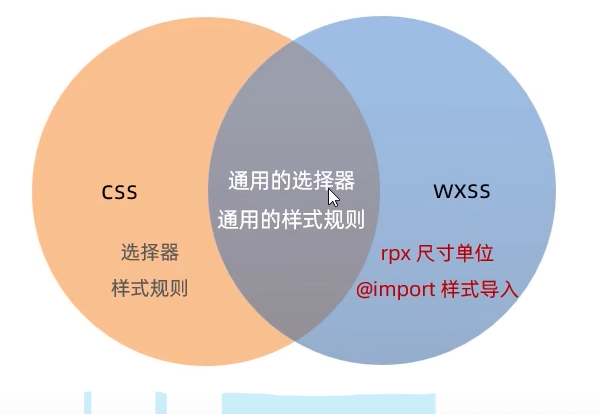
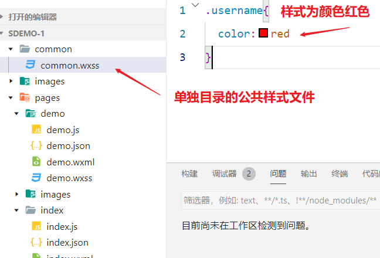
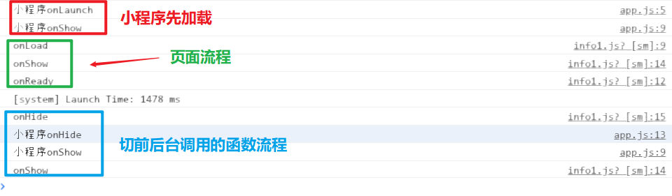

# 微信小程序

## 一、什么是微信小程序

小程序与网页开发区别对比：

+ **运行环境不同**，网页运行在**浏览器环境**中，小程序运行在**==微信环境==**中
+ **API不同**，小程序**无法调用DOM和BOM的API**，但可以调用微信环境提供的各种API,例如：**地理定位，微信扫码，微信支付**
+ **开发模式不同**，网页开发模式是浏览器＋代码编辑器
  小程序有自己的标准开发模式，其流程为：
  1. **==申请微信小程序开发账号==**
  2. **==安装小程序开发工具==**
  3. **==创建和配置小程序项目==**

小程序组件开发体验，下图就是体验的二维码，需要微信6.7.2版本以上才可扫码体验


扫码后展示内容如下，具体的组件使用在后续的开发学习中进行讲解


### 1.1 小程序ID注册

要开发微信小程序，先需要到[官方网站]:https://mp.weixin.qq.com/ 去注册小程序开发账号，其注册流程为：

1. 点卷右上角**立即注册**按钮
2. 选择注册**小程序**
3. 进入注册页面，按提示填写注册内容即可，需要验证邮箱，验证成功后信息登记选择**==个人==**


信息认证成功后就会自动跳转到管理者页面，下面就需要完善小程序相关信息（**小程序信息**，**小程序类目**都是必须填写完整的，需要更改信息在**页面设置**中就可更改），完善后备案小程序作品，最后微信认证，认证成功就可发布相关小程序作品了。


选择开发栏目的开发管理——找到开发者ID,该ID后面会**创建小程序项目时会使用**


页面还提供了小程序两种不同成员角色：

+ **项目成员**就是参与小程序开发、运营的成员，项目成员可登录微信公众后台，管理员可在成员管理中设置项目成员角色
+ **体验成员**就是参与小程序内测体验的成员，可使用小程序体验版，不属于项目成员。


### 1.2 安装开发者工具

微信开发者工具是微信官方推荐使用的小程序开发工具，其主要功能如下：

+ ① 快速创建小程序项目
+ ② 代码的查看与编辑
+ ③ 对小程序的功能进行调试
+ ④ 小程序的预览与发布

开发工具版本分为

+ **稳定版(Stable 推荐)**：测试版缺陷收敛后转为稳定版。Stable版本从 1.06 开始不支持Windows7，建议开发者升级Windows版本。**==推荐下载安装最新稳定版（Stable Bulid）工具==**
+ 预发布版(RC)：包含大的特性；通过内部测试，稳定性尚可。RC版本从 1.06 开始不支持Windows7，建议开发者升级Windows版本。
+ 开发版(Nightly)：日常构建版本(基于 NW.js 0.54.1) ，用于尽快修复缺陷和敏捷上线小的特性；开发自测验证，稳定性欠佳。Nightly版本从 1.06 开始不支持Windows7，建议开发者升级Windows版本

微信小程序[**官方文档网站**]:https://developers.weixin.qq.com/miniprogram/dev/framework/

[开发工具下载官方文档网站]:https://developers.weixin.qq.com/miniprogram/dev/devtools/download.html

下载好安装包后，直接安装流程提示进行安装即可，如果遇到安装出现Path环境变量问题


只需要在系统环境变量处添加一个对应的工具路径即可：


本教程使用的开发工具是1.0.6稳定版，安装完成后登录程序只需要用自己的微信扫码即可


登录成功小程序页面如下


### 1.3 第一个小程序项目

设置小程序项目目录位置，默认是C盘，可以按照自己喜好设置


设置小程序外观：可以按照自己喜好设置即可



设置代理


设置好小程序后就可以点击页面**＋号**创建第一个小程序


创建完成后就可以看到项目结构，可以使用**==预览==**扫码在微信中的直接看程序效果。


开发工具界面组成部分


相关页面内容查看


### 1.4 自定义编译模式

小程序模拟编译页面是编译配置文件中第一个页面，如果需要跳过其他直接编译自己需要的页面，可自定义编译模式


不需要后，直接删除就行。

## 二、代码基础

### 2.1 小程序的项目结构

1.0.6版本js基础模板的项目结构如下图：


**==pages==**：**用来存放所有小程序的页面**，默认的页面就有**index基础页面**与**log日志页面**，如果需要创建自己的页面也按照该格式创建就行，其中小程序的页面结构跟网页的项目结构类似，可进行如下对比：

+ ==**.wxml**==：对应的网页的**html**文件，也就是页面模块结构文件，WXML就是小程序的一套标签语言，用于构建小程序的页面结构

  > **wxml与html的区别**：
  >
  > +  标签名称不同： **==html(div,span,img,a)==**对应 **==wxml(view,text,image,navigator)==**
  > +  属性节点不同： `<a href="#">超链接</a>`对应`<navigator url="/pages/home/home"></navigator>`
  > +  wxml提供了类似vue中的**模板语法**，例如：**数据绑定、列表渲染、条件渲染**等内容

+ ==**.wxss**==：对应的是网页的**css**文件，也就是页面样式文件

  > **wxss与cssd的区别**：
  >
  > + 新增**==rpx==**尺寸单位： css需要手动进行像素单位换算，例如**rem**,而wxss在底层支持新的尺寸单位rpx，可以实现在不同大小的屏幕上小程序会**自动**进行换算
  > + 提供了全局样式和局部样式：项目根目录的app.wxss就是全局样式，会作用于小程序的所有页面，局部页面的.wxss样式仅对当前页面生效
  > + **==wxss仅支持部分的css选择器==**（大部分常用的选择器都支持例如下方比较常用的选择器）：
  >   1. .class和#id
  >   2. element
  >   3. 并集选择器、后代选择器
  >   4. ::after和::before等伪类选择器

+ ==**.js**==:对应的是网页的js文件，也就是页面脚本文件，用于存放页面的数据、事件处理函数等

  > 小程序中.js文件的主要分为三大类：
  >
  > + app.js：是整个程序的项目入口文件，通过调用**APP()函数**来启动整个小程序
  > + 页面的.js文件：是页面的入口文件，通过调用**Page()函数**来创建并运行页面
  > + 普通的.js文件：是普通的功能模块文件，例如util.js文件，主要用于**封装公共的函数或属性**供页面使用

+ ==**.json**==：对应的是网页的json文件，也就是页面配置文件，用于配置窗口外观、表现等

  > json是一种数据格式，在实际开发中总是以配置文件的形式出现。小程序项目也不例外，通过不同的json配置文件，可以对小程序项目进行不同级别的配置，小程序中的含有的配置文件如下：
  >
  > + 项目根目录的app.json配置文件
  > + 项目根目录的project.config.json与project.private.config.json配置文件
  > + 项目根目录的sitemap.json配置文件
  > + **==页面文件夹中的.json页面配置文件==**


**==utils==** 用来存放工具性质的模块，类似java中的工具类（例如:格式化时间的自定义模块）

```js
//时间转化功能函数
const formatTime = date => {
  const year = date.getFullYear()
  const month = date.getMonth() + 1
  const day = date.getDate()
  const hour = date.getHours()
  const minute = date.getMinutes()
  const second = date.getSeconds()

  return `${[year, month, day].map(formatNumber).join('/')} ${[hour, minute, second].map(formatNumber).join(':')}`
}

//字符转化数字函数
const formatNumber = n => {
  n = n.toString()
  return n[1] ? n : `0${n}`
}

module.exports = {
  formatTime
}

```

**==.eslintrc.js==** 是Eslint的配置文件，ESLint 是一个代码检查工具,用来**检查你的代码是否符合指定的规范**(例如: = 的前后必须有一个空格)，该文件是新增的，**在老版本的小程序中可能没有。而且如果要使用该功能需要先安装对应的工具包到项目**。基础内容就先不讲解了。

**==app.js==** 是小程序的项目入口文件。也就是启动小程序最开始运行的代码

```js
// app.js
App({
  onLaunch() {
    // 展示本地存储能力
    const logs = wx.getStorageSync('logs') || []
    logs.unshift(Date.now())
    wx.setStorageSync('logs', logs)

    // 登录
    wx.login({
      success: res => {
        // 发送 res.code 到后台换取 openId, sessionKey, unionId
      }
    })
  },
  globalData: {
    userInfo: null
  }
})
```

**==app.json==** 是小程序项目的全局配置文件，主要配置**所有页面路径、窗口外观、页面表现、底部tab等**,默认文件内容如下

```json
{
   //配置页面路径，只要配置了会自动在page目录下生成对应页面的基础文件
  "pages": [
    "pages/index/index",
    "pages/logs/logs"
  ],
   //全局定义小程序所有页面的背景颜色、文字颜色等
  "window": {
    "navigationBarTextStyle": "black",
    "navigationBarTitleText": "Weixin",
    "navigationBarBackgroundColor": "#ffffff"
  },
  "style": "v2", //微信样式版本设置，要使用旧的版本样式只需删除该配置就行
  "componentFramework": "glass-easel", //glass-easel属于Vue的组件框架,可以快速组织并且使用框架
  "sitemapLocation": "sitemap.json",//配置微信索引文件
  "lazyCodeLoading": "requiredComponents"//开启小程序组件按需注入特性”
}
```

**==app.wxss==** 是小程序项目的全局样式文件，主要就是用于配置小程序页面的全局样式

```css
/**app.wxss**/
.container {
  height: 100%;
  display: flex;
  flex-direction: column;
  align-items: center;
  justify-content: space-between;
  padding: 200rpx 0;
  box-sizing: border-box;
} 
```

**==project.config.json==** 是项目编译配置文件，用来其中**setting**中的配置**记录我们对==小程序开发工具==所做的个性化配置**

```json
{
  //配置编译类型，数据库版本、打包内容等
  "compileType": "miniprogram",
  "libVersion": "trial",
  "packOptions": {
    "ignore": [],
    "include": []
  },
  //配置开发工具编译相关的内容
  "setting": {
    "coverView": true,
    "es6": true,
    "postcss": true,
    "minified": true,
    "enhance": true,
    "showShadowRootInWxmlPanel": true,
    "packNpmRelationList": [],
    "babelSetting": {
      "ignore": [],
      "disablePlugins": [],
      "outputPath": ""
    }
  },
  
  "condition": {},
  "editorSetting": {
    "tabIndent": "auto",
    "tabSize": 2
  },
  //配置小程序的账号ID
  "appid": "******"
}
```


**==project.private.config.json==** 是项目的私人配置文件，也就是编译后不对外共享配置，这也是新增内容，在老版本项目中说没有的。

```json
{
  "description": "项目私有配置文件。此文件中的内容将覆盖 project.config.json 中的相同字段。项目的改动优先同步到此文件中。详见文档：https://developers.weixin.qq.com/miniprogram/dev/devtools/projectconfig.html",
   //项目名称配置
  "projectname": "sdemo-1",
  "setting": {
    "compileHotReLoad": true
  }
}
```

**==sitemap.json==** 用来配置小程序及其页面是否允许被微信索引，开启后小程序相关页面能被微信在搜索栏中直接搜索出来，该功能相当于**PC网页的SEO**，默认配置是全部页面都被允许。

```json
{
  "desc": "关于本文件的更多信息，请参考文档 https://developers.weixin.qq.com/miniprogram/dev/framework/sitemap.html",
   //索引规则配置 allow就是允许索引，disallow就是不允许被索引
  "rules": [{
  "action": "allow",
  "page": "*"
  }]
}
```

如果需要在项目编译中开启索引功能检测，需要在project.config.json配置文件中配置相关内容


### 2.2 小程序的宿主环境

宿主环境（host environment）指的是程序运行所必须的依赖环境。例如Android app的宿主环境就是Android系统，ios app的宿主环境就是ios系统。而**小程序的宿主环境其实就是手机微信app**。小程序就是基于微信系统安装的，如果没有微信小程序就无法使用。


小程序可以借助宿主环境提供的能力完成普通网页无法完成的功能，例如：微信扫码、微信支付、微信登录、地理定位、etc等功能

小程序宿主环境包含的内容：

1. **通讯模型**：小程序中通讯的主体是**==渲染层==**和**==逻辑层==**，其中**wxml模板和wxss样式工作在渲染层，js脚本工作在逻辑层**。

   小程序中的通讯模型主要分为两部分：

   + 渲染层和逻辑层之间的通讯，其由微信客户端进行转发
   + 逻辑层与第三方服务器之间的通讯，也由微信客户端进行转发

   

2. **运行机制**：主要分为**小程序启动过程**与**页面渲染过程**两个部分。

   小程序启动过程： 

   1. 把小程序的代码包下载到本地
   2. 解析app.json全局配置文件
   3. 执行app.js小程序的入口文件，调用App()创建小程序实例
   4. 渲染小程序首页
   5. 小程序启动完成

   页面渲染过程：

   1. 加载解析页面的.json配置文件
   2. 加载页面的.wxml模板和.wxss样式
   3. 执行页面的.js文件，调用Page()创建页面的实例
   4. 页面渲染完成

3. **组件**，组件内容比较多，下面单独讲解，最常见的就是页面UI组件类似button按钮等

4. **API**，调用微信相关功能，比如常见的api有:**微信扫码、获取用户信息、本地存储、支付功能**等。小程序API主要分为三类：

   1. **事件监听API**,特点是以==**on**==开头，用来**监听某些事件的触发**

      例如：`wx.onWindowResize(function callback)`监听窗口尺寸变化的事件,**其中wx.xxx就类似DOM中的windows.xxx对象的使用方式**

   2. **同步API**,特点是以**==Sync==**结尾的API都是同步API，**同步API的执行结果可以通过函数返回值直接获取**，如果执行出错会抛出异常

      例如：`wx.setStorageSync('key','value')`向本地存储中写入内容

   3. **异步API**,类似于jQuery中的`$.ajax(options)`函数，需要通过**success、fail、complete**接收调用的结果。

      例如：`wx.request()`发起网络数据请求，通过success回调函数接收数据

### 2.3 新建小程序页面

新建小程序页面，只需要在app.json中配置对应页面名称就可以自动生成小程序页面对应的四个文件，效果如下


如果要让demo页面成为第一个进入的页面，只需要将其配置放到第一位即可


如果想要修改页面样式内容，例如修改demo页面的窗口的抬头栏颜色，可以在页面配置文件demo.json中添加窗口栏颜色配置


其中在全局的app.json中也有该项配置，这里页面配置文件配置了相同内容就会覆盖全局样式的配置，全局配置默认为白色。


### 2.4 小程序组件

小程序的组件也是由宿主环境提供的，开发者可以基于组件快速搭建漂亮的页面结构，微信官方主要把组件分为9大类（加粗的为常用组件）：

1. **视图容器**
2. **基础组件**
3. **表单组件**
4. **导航组件**
5. 媒体组件
6. map地图组件
7. canvas画布组件
8. 开放能力
9. 无障碍访问

#### 2.4.1 视图容器类组件

常见的容器类组件分为：

+ **view**：普通视图区域，**类似HTML中的div功能**，是一个块级元素，常用于实现页面布局
+ **scroll-view**：可滚动的视图区域，常用于实现滚动列表效果
+ **swiper**和**swiper-item**：轮播图容器组件和轮播图item组件

**案例：view组件的基本使用，实现如图的flex横向布局效果**：


wxml文件代码内容,跟html中的div代码基本一样

```html
<view class="container1">
  <view>A</view>
  <view>B</view>
  <view>C</view>
</view>
```

wxss代码内容，写法也跟css一致

```css
/* pages/demo/demo.wxss */
/*容器view的整体样式*/
.container1 view {
  width: 100px;
  height: 100px;
  text-align: center;
  line-height: 100px;
}
/*选择子类设置背景颜色*/
.container1 view:nth-child(1){
  background-color: lightgreen;
}
.container1 view:nth-child(2){
  background-color: lightskyblue;
}
.container1 view:nth-child(3){
  background-color: lightcoral;
}
/*类选择器，对父容器进行整体布局*/
.container1{
  display: flex;
  justify-content: space-around;
}
```

**案例：scroll-view的基本使用，实现如图的y轴滚动布局效果，可根据上诉代码修改部分内容即可**


wxml文件代码内容：

```html
<!--修改父容器，设置属性scroll-y沿着y轴滚动--> 
<scroll-view class="container1" scroll-y>
  <view>A</view>
  <view>B</view>
  <view>C</view>
</scroll-view>
```

wxss文件代码内容：

```css
/* pages/demo/demo.wxss */
/*容器view的整体样式*/
.container1 view {
  width: 100px;
  height: 100px;
  text-align: center;
  line-height: 100px;
}
/*选择子类设置背景颜色*/
.container1 view:nth-child(1){
  background-color: lightgreen;
}
.container1 view:nth-child(2){
  background-color: lightskyblue;
}
.container1 view:nth-child(3){
  background-color: lightcoral;
}
/*上边的子容器内容样式不变*/

/*类选择器，对父容器进行整体布局*/
.container1{
  border: 1px solid red; 
  /*y轴滚动必须设置scroll-view固定高度*/
  height: 120px;
  width: 100px;
}
```

**案例：swiper和swiper-item组件的基本使用，实现如图轮播图的效果**：


wxml文件代码内容：

```html
<!--轮播图效果-->
<!--indicator-dots属性：显示轮播图有指示点-->
<swiper class="swiper-container" indicator-dots>
  <!--第一页-->
  <swiper-item>
    <view class="item">A</view>
  </swiper-item>
  <!--第二页-->
  <swiper-item>
    <view class="item">B</view>
  </swiper-item>
  <!--第三页-->
  <swiper-item>
    <view class="item">C</view>
  </swiper-item>
</swiper>
```

wxss文件代码内容：

```css
/* pages/demo/demo.wxss */
.swiper-container {
  height: 150px;/*轮播图容器高度固定*/
}

.item {
  height: 100%;
  line-height: 150px;/*行高等于容器，让文本纵向居中*/
  text-align: center;
}

/*swiper-item是标签类型选择器*/
swiper-item:nth-child(1){
  background-color: lightgreen;
}
swiper-item:nth-child(2){
  background-color: lightskyblue;
}
swiper-item:nth-child(3){
  background-color: lightcoral;
}
```

这里演示使用的是view，实际开发可以替换为image实现对应的效果

swiper组件的常用属性

|            属性            |  类型   |    默认值     |                     说明                     |
| :------------------------: | :-----: | :-----------: | :------------------------------------------: |
|     **indicator-dots**     | boolean |     false     |              是否显示面板指示点              |
|    **indicator-color**     |  color  | rgba(0,0,0,3) |          指示点颜色（指没激活的点）          |
| **indicator-active-color** |  color  |    #000000    |             当前选择的指示点颜色             |
|        **autoplay**        | boolean |     false     |                 是否自动切换                 |
|        **interval**        | number  |     5000      |               自动切换时间间隔               |
|        **circular**        | boolean |     false     | 是否采用衔接滑动（最后一张和第一张形成循环） |

#### 2.4.2 基础组件

基础组件主要包括：**text组件、rich-text组件、button组件**以及**image组件**。

**text组件**是基础文本组件，可通过==**user-select**==属性**实现长按选中文本内容的操作**(老版本使用**selectable**属性，现在已经废弃)

view中也可以之间放入文本，但其中会缺少相关text文本的属性操作效果。

```html
<view>
  长按选中手机号：
  <text user-select="true">1234567890</text>
</view>
```

**rich-text组件**的nodes属性节点，可以把HTML字符串渲染为对应的UI结构(该标签效果跟v-html标签效果一致)，该组件常用于**展示商品详情页**，服务器返回内容为html标签内容，就可以使用该组件的nodes属性之间展示服务器返回的内容。

```html
<rich-text nodes="<h1 style='color:red'>标题1</h1>"/>
```

上述小案例运行效果


**button组件**，也就是按钮组件，其功能比HTML的button按钮丰富很多，**通过==open-type属性==可以调用微信提供的各种功能**(客服、转发、获取用户授权、获取用户信息等)

案例：不同类型按钮效果

```html
<view>-----------通过type属性指定button类型-----------</view>
<button>默认按钮</button>
<button type="primary">主色调按钮</button>
<button type="warn">警告按钮</button>

<view>-----------小尺寸button类型-----------</view>
<!--默认按钮跟view一样独占一行，小按钮则不独占一行-->
<button size="mini">默认按钮</button>
<button type="primary" size="mini">主色调按钮</button>
<button type="warn" size="mini">警告按钮</button>

<view>-----------plian镂空button类型-----------</view>
<button size="mini" plain="true">默认按钮</button>
<button type="primary" size="mini" plain="true">主色调按钮</button>
<button type="warn" size="mini" plain="true">警告按钮</button>
```


如果配置文件app.json的风格样式不用新版`"style": "v2"`，使用老版本的样式效果如下



**image组件**，也就是图片组件，image组件默认宽度约为300px、高度约为240px，mode属性控制图片裁剪和缩放的模式，常见属性有

|     mode值      |                             说明                             |
| :-------------: | :----------------------------------------------------------: |
| **scaleToFill** | (默认值)缩放模式，**==不保持纵横比缩放图片==**，使图片的宽高完全拉伸至**填满image元素** |
|  **aspectFit**  | 缩放模式，**保持纵横比缩放图片，使图片的==长边==能完全显示出来**。可以完整显示图片，但**会出现空白部分** |
| **aspectFill**  | 缩放模式，**保持纵横比缩放图片，只保证图片的==短边==能完全显示出来**。图片只在水平或垂直方向完整，另一方向**会出现裁剪的情况** |
|  **widthFix**   | 缩放模式，容器宽度不变，高度自动变化，使原图宽高比不变(**变化的是image容器大小**) |
|  **heightFix**  | 缩放模式，容器高度不变，宽度自动变化，使原图宽高比不变(**变化的是image容器大小**) |

image组件效果案例

```html
<!--空图片-->
<image></image>
<!--默认是按照组件大小进行缩放图片，会存在变形的问题-->
<image src="/images/001.jpg"></image>
<!--使用mode属性可以让图片进行等比缩放不变形-->
<image src="/images/001.jpg" mode="widthFix"></image>
```

wxss属性内容，添加边框

```css
image {
  /*设置边框显示证明 image组件默认的宽和高*/
  border: 1px solid red;
}
```

运行效果


**navigator组件**，也就是页面导航组件，类似于HTML中的a链接。

### 2.5 WXML模板语法

#### 2.5.1 数据绑定

数据绑定的使用步骤为(使用方式跟Vue模板类似)：

1. 在**.js文件**中的data对象中定义数据

   ```js
   // pages/demo/demo.js
   Page({
     /**
      * 页面的初始数据
      */
     data: {
       // 定义字符串类型数据
       info:'hello wx',
       //定义数组类型数据
       msgList:[{msg:'hello'},{msg:'world'}]
     }
   })
   ```

2. 在WXML文件中使用数据，要把data中数据渲染到页面中，小程序常使用**==Mustache语法(双大括号，在Vue中被称为差值表达式)==**将变量包起来即可，代码如下：

   ```html
   <view>{{info}}</view>
   <view>{{msgList[0].msg}}</view>
   <view>{{msgList[1].msg}}</view>
   ```

   运行效果

   s

Mustache语法的主要应用场景有：**绑定内容、绑定属性、运算(三元运算、算术运算等)**。

绑定内容的使用在上边的案例中已经使用过，**动态绑定属性**的写法基本类似

```js
Page({
  data: {
    // 定义字符串类型数据
    img1:'/images/001.jpg'
  }
})
```

```html
//这里与vue中不同，vue使用的v-bind绑定属性值，小程序依然使用Mustache语法，注意这里大括号外依然有引号
<image src="{{img1}}" mode="aspectFill"></image>
```


三元运算的写法如下：

```js
Page({
  data: {
    // 定义生成10以内的随机数
    randomNum:Math.random()*10
  }
})
```

```html
<view>{{randomNum>=5?"随机数大于等于5":"随机数小于5"}}</view>
```

运行结果


算术运算的写法如下：

```js
Page({
  data: {
    // 定义生成带2位小数的随机数，例如0.34
    randomNum:Math.random().toFixed(2)
  }
})
```

```html
<view>生成100以内的随机数：{{randomNum*100}}</view>
```

运行结果


#### 2.5.2 事件绑定

**事件**是渲染层到逻辑层的通讯方式。通过事件可以将**用户渲染层产生的行为**(例如：手指点击屏幕按钮)反馈到逻辑层进行业务处理(点击后触发函数进行相应的数据操作)。


小程序中常用的事件

|    类型    |        绑定方式         |                         事件描述                          |
| :--------: | :---------------------: | :-------------------------------------------------------: |
|  **tap**   |    bindtap或bind:tap    |         手指触摸后马上离开，类似HTML中的click事件         |
| **input**  |  bindinput或bind:input  |                     文本框的输入事件                      |
| **change** | bindchange或bind:change | 状态改变时触发的事件(例如：check复选框是否勾选的状态改变) |

**事件对象的属性列表**，在事件回调触发的时候，往往会收到一个事件对象**==event==**(也就是事件函数默认的回调参数)，它的详细属性如下

|        属性        |    类型    |                       事件类型                       |
| :----------------: | :--------: | :--------------------------------------------------: |
|      **type**      |   String   |                       事件类型                       |
|   **timeStamp**    |  Integer   |           页面打开到触发事件所经过的毫秒数           |
|   **==target==**   | ==Object== | ==触发事件的组件的属性值集合(标红的是最常用的属性)== |
| **currentTarget**  |   Object   |                 当前组件的属性值集合                 |
|   **==detail==**   | ==Object== |         ==额外的信息(标红的是最常用的属性)==         |
|    **touches**     |   Array    |   **触摸事件**，当前停留在屏幕中的触摸点信息的数组   |
| **changedTouches** |   Array    |       **触摸事件**，当前变化的触摸点信息的数组       |

##### 2.5.2.1 bindtap

编写最简单的按钮绑定函数，打印event通信

```js
Page({
  data: {
    // 定义生成带2位小数的随机数
    randomNum:Math.random().toFixed(2)
  },
  //按钮的绑定函数，event可以简写为e
  buttonTap1(event){
    console.log(event)
  }
})
```

```html
<button bind:tap="buttonTap1">按钮</button>
```

打印的结果


target与currentTarget的区别为，target指的是触发该事件的源头组件，而currentTarget则是当前事件所绑定的组件。举例如下：


上述案例组件出现多层嵌套的情况，因为点击内部按钮时，点击事件会以**冒泡**的方式向外扩散，也就是会触发外层的view的tap事件处理函数。

此时。对于外层view触发的函数**outerHandler**来说:

+ **e.target** 指的是触发事件的源头组件，也就是内部的按钮组件
+ **e.currentTarget** 指的是当前正在触发事件的组件，也就是当前外部的view组件

测试的代码如下，为了更好的看出打印结果，在组件里添加id属性用以区分组件对象

```js
Page({
  data: {
  },
  viewTap(e){
    console.log(e)
  }
})
```

```html
<view id="view" bindtap="viewTap">
  <button id="button">按钮</button>
</view>
```

可以打印的看到内容与上述描述的一致


**事件处理函数中为data中的数据赋值**，可以通过调用**==this.setData(dataObject)==**方法，可以给页面data中的数据重新赋值。

**案例：通过按钮点击实现显示数字加1**

```js
Page({
  data: {
    count:0
  },
  //修改count的值
  changeCount(e){
    this.setData({
      count:this.data.count+1 //小程序中赋值不在是=，而是属性+：实现赋值
    })
  }
})
```

```html
<view>{{count}}</view>
<button type="primary" bind:tap="changeCount">＋1</button>
```

最终效果


##### 2.5.2.2 **事件传参**

小程序的事件传参比较特殊，不能再绑定事件的同时为事件处理函数传递参数，比如下面的vue写法就不能运行

```html
<button type="primary" bind:tap="changeCount(124)">事件传参</button>
```

小程序**会把changeCount(124)整个字符串当作绑定函数的名称**，因此小程序中要使用**==data-\*==自定义属性传参**，其中**\*代表的参数的名称**，示例代码如下

```html
<!--注意区分不同，上边传递的参数名为info，传递的是字符串124，下边传递的参数名为info，传递的是数字124-->
<button type="primary" bind:tap="changeCount1" data-info="124">事件传参字符串</button>

<button type="primary" bind:tap="changeCount2" data-info="{{124}}">事件传参数字</button>
```

在事件处理函数中如何获取到参数值，可通过**==event.target.dataset.参数名==**获取到具体的参数值，其代码如下

```js
Page({
  data: {
  },
  //打印参数数据
  changeCount1(e){
    console.log(e.target.dataset)
    console.log(e.target.dataset.info)
  },
  changeCount2(e){
    console.log(e.target.dataset)
    console.log(e.target.dataset.info)
  }
})
```

运行结果


##### 2.5.2.3 bindinput

input事件是用来响应文本框的输入事件，其代码流程如下：

1. 通过bindinput在文本框中绑定输入事件

   ```html
   <input bind:input="inputHandler"></input>
   ```

2. 在js页面中定义事件的处理函数，通过==**e.detail.value**==可以获取input中输入的数据

   ```js
   Page({
     data: {
     },
     //绑定打印input数据
     inputHandler(e){
       console.log(e.detail.value)
     }
   })
   ```

   

案例：实现文本框和data之间数据同步

1.定义文本框初始data，并编写数据绑定函数

```js
Page({
  data: {
    msg:'文本框初始值:'
  },
  //修改msg的值
  inputHandler(e){
    this.setData({
      msg:e.detail.value
    })
  }
})
```

2.编写文本框结构，使用vlaue绑定文本框值,bindinput绑定函数

```html
<input value="{{msg}}" bind:input="inputHandler"></input>
```

3.美化文本框样式

```css
/* pages/demo/demo.wxss */
input {
  border: 1px solid #cee;
  padding: 5px;
  margin: 5px;
  border-radius: 3px;/*圆角*/
}
```

最终运行效果


#### 2.5.3 条件渲染

小程序中，有时需要根据条件判断是否需要渲染页面代码块的情况，这时就可以使用`wx:if="{{condition}}"`来判断是否需要渲染该代码块。

可以结合`wx:elif`和`wx:else`来完成复杂的判断逻辑。

简单的使用案例

```js
Page({
  data: {
    flag:0
  }
})
```

```html
<view wx:if="{{flag===0}}">男生</view>
<view wx:elif="{{flag===1}}">女生</view>
<view wx:else>秀吉</view>
```

运行效果，可以直接更改appData中的flag数据查看对应的显示效果


页面渲染的最终内容可以看到三个view,最终只渲染出一个



**block组件**，如果需要一次性控制多个组件的展示和隐藏，可以使用`<block></block>`标签将多个组件包装起来，并在block使用`wx:if`控制是否渲染。最簡單的代碼如下，block与view是区别的，**view只要有内容就会被渲染，而block只是包裹容器，不会在页面中渲染**。

```html
<block wx:if="{{flag===0}}">
  <view>男生</view>
  <view>女生</view>
</block>
<view wx:if="{{flag===0}}">
  <view>男生</view>
  <view>女生</view>
</view>
```


`hidden={{condition}}`属性也可以控制元素的显示与隐藏，其中**条件为true就会隐藏，false则会显示**，与刚刚的wx:if效果相反。

```html
<view hidden="{{false}}">条件为true隐藏</view>
```

> **wx:if与hidden的区别**,运行方式原理不同
>
> + wx:if是以动态创建和移除元素的方式来控制元素的展示与隐藏，
>
> + hidden则是以改变wxss样式的方式(display:none/block)来控制元素的显示与隐藏。
>
> 使用建议，如果是要频繁切换显示隐藏的组件，使用hidden。如果控制条件很复杂时，建议使用wx:if的组合进行组件的展示与隐藏。

代码案例如下

```html
<view hidden="{{!(flag===0)}}">hidden隐藏</view>
<view wx:if="{{flag===0}}">wx:if隐藏</view>
```

让flag的条件不满足时，页面渲染的效果


#### 2.5.4 列表渲染

通过`wx:for`可以根据指定的**数组**，循环渲染重复的组件结构，最简单的写法如下

```js
Page({
  data: {
    arr1:["张三","李四","王五"] //定义一个数组数据
  }
})
```

```html
<view wx:for="{{arr1}}">
  索引是：{{index}},数据是：{{item}}
</view>
```


**手动指定索引和当前项的变量名**，使用`wx:for-index`可以指定当前循环的索引的变量名，使用`wx:for-item`可以指定当前item项的变量名

```html
<view wx:for="{{arr1}}" wx:for-index="idx" wx:for-item="item1">
  索引是：{{idx}},数据是：{{item1}}
</view>
```

上边的写法虽然正确显示内容，但会报警告说缺少**key**，和vue中的列表渲染类似，都**==建议渲染出列表项指定唯一的key值，从而提供渲染效率==**


因此官方推荐写法为,这里是**使用index直接作为key**，注意key的值没有使用Mustache语法。

```html
<view wx:for="{{arr1}}" wx:key="index">
  索引是：{{index}},数据是：{{item}}
</view>
```

创建list用户对象数据，**规范写法说使用数据对象的id作为key来使用**

```js
Page({
  data: {
    userList:[
      {id:1,name:"张三"},
      {id:2,name:"黎三"},
      {id:3,name:"文档"},
    ]
  }
})
```

```html
<view wx:for="{{userList}}" wx:key="id">
  索引是:{{index}},key值是：{{item.id}},数据是：{{item.name}}
</view>
```


### 2.6 WXSS模板样式

**WXSS(WeiXin Style Sheets)**是一套样式语言，用于美化WXML的组件样式，使用方式类似于网页的CSS。WXSS具有大部分CSS的特性，同时，WXSS还对CSS进行了扩充以及修改，以适应微信小程序的开发。WXSS扩展的内容有

+ **==rpx==**尺寸单位
+ **==@import==**样式导入



#### 2.6.1 rpx尺寸单位

**rpx(responsive pixel)**是微信小程序独有的，用来**解决屏幕适配的尺寸单位**。

> rpx的实现原理：鉴于不同设备屏幕的大小不同，为了实现**==屏幕的自动适配==**，**==rpx把所有设备的屏幕在宽度上等分为750份==**，即设备屏幕的总宽度为固定的**750rpx**,其效果为
>
> + 较小的设备上，1rpx所代表的宽度较小
> + 较大的设备上，1rpx所代表的宽度较大
>
> 小程序在不同设备上运行时，会自动把rpx的样式单位自动换算为对应的像素单位进行渲染，实现屏幕适配。

rpx与px之间的单位换算，以iPhone6为例，其屏幕宽度为375px，共有750个物理像素，等分为750rpx。则得到换算公式为

`750rpx=375px=750物理像素 => 1rpx=0.5px=1物理像素`

|     设备     | rpx换算px(屏幕宽度/750) | px换算rpx(750/屏幕宽度) |
| :----------: | :---------------------: | :---------------------: |
|   iPhone5    |       1rpx=0.42px       |       1px=2.34rpx       |
|   iPhone6    |       1rpx=0.5px        |        1px=2rpx         |
| iPhone6 Plus |      1rpx=0.552px       |       1px=1.81px        |

官方建议：使用iPhone6作为视觉稿的标准，因为iPhone6的换算基本为整数。例如：**绘制宽100px高20px的盒子，换算为rpx就是宽200rpx，高度40rpx**。

#### 2.6.2 @import样式导入

@import语法格式为@import+需要导入的外联样式表的相对路径，用；表示语句结束。其使用流程如下，先创建一个公共样式文件




在页面的样式表中使用@import导入公共样式文件内容


在页面结构中使用导入的样式


如果删除公共样式导入，页面就找不到username的样式，文字变为默认的黑色


#### 2.6.3 全局样式与局部样式

全局样式，就是定义在app.wxss中的样式就是全局样式，它作用于每一个页面。

局部样式，就是定义在页面.wxss中的样式就是局部样式，它只作用于当前页面。

当局部样式和全局样式发生冲突时，**根据就近原则，局部样式会覆盖全局样式**。**==局部样式的权重大于或等于全局样式的权重时，才会发生覆盖==**。

上边两个原则其实跟CSS中的是一样的，下面小案例就可以帮助我们理解权重的问题。

编写一个view的数据列表结构

```html
//列表数据
data: {
    userList:[
      {id:1,name:"张三"},
      {id:2,name:"黎三"},
      {id:3,name:"文档"},
    ]
}
//view循环展示列表数据
<view wx:for="{{userList}}" wx:key="id">
  索引是:{{index}}, key值是:{{item.id}}, 数据是:{{item.name}}
</view>
```

在全局样式中添加view的样式，注意使用rpx换算px


再在局部样式文件中，编写view的样式


#### 2.6.4 全局配置更改样式

之前就以及了解app.json文件就是小程序的的全局配置文件，其常用的配置项有：

1. **pages**,配置当前小程序所有页面的存放路径
2. **==window==**,全局配置小程序窗口外观
3. **==tabBar==**,配置小程序底部的tabBar效果
4. **style**,是否启用新版组件样式

小程序窗口的组成部分


##### 2.6.4.1 window配置

全局配置**window**项的配置主要就是**配置导航栏区域的样式以及其背景区域的样式**。其常用配置项有(可分为三类):

|              属性名              |   类型   | 默认值  |                        说明                        |
| :------------------------------: | :------: | :-----: | :------------------------------------------------: |
|    **navigationBarTitleText**    |  String  | 字符串  |                 导航栏标题文字内容                 |
| **navigationBarBackgroundColor** | HexColor | #ffffff |     导航栏背景颜色，只能使用16位数据如#000000      |
|    **navigationBarTextStyle**    |  String  |  black  |     导航栏标题文字颜色，仅支持**black/white**      |
|     **==backgroundColor==**      | HexColor | #ffffff |                   窗口的背景颜色                   |
|   **==backgroundTextStyle==**    |  String  |  dark   |      下拉loading的样式，仅支持**dark/light**       |
|      enablePullDownRefresh       | Boolean  |  false  |              是否全局开启**下拉刷新**              |
|      onReachBottomDistance       |  Number  |   50    | 页面**上拉触底事件**触发时距页面底部的距离，单位px |

导航栏配置案例，默认导航栏配置为白底黑字，文字为微信


修改**导航栏**样式:文字，颜色背景都能按照个人喜好修改


> 注意:这些配置也可以也在页面配置json文件中，写在app.json就是全局开启，写在页面json就只是当前页面开启(推荐页面单独开启)

##### 2.6.4.2 下拉刷新

**==下拉刷新==**是移动端的专有名词，指的是通过手指在屏幕上的下拉滑动操作从而**重新加载页面数据**，**开启页面下拉刷新功能**：


> 注意：**==模拟器显示的内容并不能百分比还原真机效果==**，例如：下拉刷新功能会出现下拉后，第一行样式颜色由粉色改为绿色，然后下拉后会自动合上背景区域。而真机则不会改变颜色，也不会自动合上背景区域（需要在下拉刷新监听函数中onPullDownRefresh()手动关闭刷新**==wx.stopPullDownRefresh()==**

全局配置**背景样式**，下拉刷新时可以看到背景颜色默认为**白色**，然后由三个暗色dark的**loading的小圆点**，这两个内容都可自定义配置


不过推荐使用dark的loading圆点更好看一些。老版本默认是light,新版改为了dark。

**==监听下拉刷新事件==**，在页面的.js文件中，通过==**onPullDownRefresh()**==函数来监听下拉刷新事件

```js
Page({
  data: {
   
  },

  //监听下拉刷新事件
  onPullDownRefresh:function() {
    console.log("下拉刷新触发")
  }

})
```

**案例：下拉刷新清空页面数据**,案例中就用最简单的count数据表示

```html
<!--pages/info/info.wxml-->
<view>{{count}}</view>
<button bind:tap="countAdd" type="primary">count加1</button>
```

页面的js文件

```js
Page({
  data: {
    //定义页面数据
    count: 0
  },
  countAdd() {
    this.setData({
      count: this.data.count + 1
    })
  },
  //监听下拉刷新事件
  onPullDownRefresh:function() {
    //下拉刷新重置页面数据
    this.setData({
      count: 0
    })
    //执行玩下拉刷新后，一定要关闭下拉刷新，这样下拉刷新就会停止
    wx.stopPullDownRefresh()
  }
})
```

最终效果，点击按钮增加count，下拉刷新重置count数值为0


##### 2.6.4.3 上拉触底

**==上拉触底==**是移动端的专有名词，**指通过手指在屏幕上的==上拉滑动==操作，从而==加载更多数据==的行为。**上拉触底事件一般用于**实现分页操作**。

当滚动条到达距离底部某个位置时就触发上拉触底事件加载更多数据。这个距离就被称为**上拉触底距离**，默认是50px,一般不建议修改。

```json
"onReachBottomDistance": 100 //设置触底距离为100px
```

在页面js文件中，通过onReachBottom()函数即可监听当前页面的上拉触底事件,代码案例如下

```js
Page({
  data: {
    
  },
  //监听上拉触底事件
  onReachBottom:function(){
    console.log(触发上拉触底事件)
  }  
})
```

要看到上拉触底事件效果，需要页面内容的范围超出展示的范围(最简单的方式就是创建超大view样式)，从而在上拉过程中触发上拉触底事件

```html
<view class='box1'></view>
```

样式

```css
/* pages/info/info.wxss */
.box1 {
  height: 1000px;
  background-color: lightcoral;
}
```

最终效果


> 注意：上边的案例中会发现，只要在距离底部50px时就会触发事件，如果在附近反复上下拉动就会**反复触发事件**，实际开发是需要根据加载数据完成来决定是否再次触发事件,也就是所谓的**==节流==**操作。

**==案例：上拉触底实现数据分页展示(附带实现数据加载效果与节流效果，节流使用一个boolean变量控制完成)==**

编写生成随机颜色数组数据代码，数组数据为颜色值"233,21,15"的字符串，如果有后台数据，可直接通过请求获取数组数据

```js
//网络数据请求的版本
Page({
  //有后台数据的按钮
  data: {
    colorList: [],
    isloading: false //节流变量
  },
  //网络请求的方式获取后台的颜色数据
  getColors() {
    //打开节流阀
    this.setData({
      isloading: true
    })
    wx.showLoading({
      title: "数据加载中"
    }) //展示loading效果
    wx.request({
      url: 'https://自己的后台网址/api/color',
      method: 'GET',
      success: ({
        data: res
      }) => {
        this.setData({
          colorList: [...this.data.colorList, ...res.data]
        })
      },
      complete: () => {
        wx.hideLoading() //隐藏loading效果
        //关闭节流阀
        this.setData({
          isloading: false
        })
      }
    })
  },
  onLoad: function (options) {
    this.setData({
      colorList: []
    })
    this.getColors()
  },
  //监听上拉触底事件，每次触发获取新的页面颜色数据
  onReachBottom: function () {
    if (this.data.isloading) return //如果正在加载数据，就不调用获取颜色
    this.getColors()
  }
})
```

没有后台就直接使用js代码随机生成数据

```js
//js生成数据，模拟请求的版本
Page({
  data: {
    colorList: [],
    isloading: false //节流变量
  },
  //获取随机颜色
  getColors() {
    //打开节流阀
    this.setData({
      isloading: true
    })
    wx.showLoading({
      title: "数据加载中"
    }) //展示loading效果
    var r, g, b = 0
    var arr = []
    for (var i = 0; i < 10; i++) {
      r = Math.round(Math.random() * 255)
      g = Math.round(Math.random() * 255)
      b = Math.round(Math.random() * 255)
      //拼接r,g,b颜色数据字符串放入数组中
      arr[i] = r + "," + g + "," + b
    }
    //将随机颜色数据添加到data数据colorList列表中，这里是拼接了旧数组内容与新数组内容
    this.setData({
      colorList: [...this.data.colorList, ...arr]
    })
    //模拟数据请求的延时效果 ，延时2秒
    setTimeout(() => {
      wx.hideLoading() //隐藏loading效果
      //关闭节流阀
      this.setData({
        isloading: false
      })
    }, 2000)
    clearTimeout()
  },
  onLoad: function (options) {
    this.setData({
      colorList: []
    })
    this.getColors()
  },
  //监听上拉触底事件，每次触发获取新的页面颜色数据
  onReachBottom: function () {
    if (this.data.isloading) return //如果正在加载数据，就不调用获取颜色
    this.getColors()
  }
})
```

数据准备好后，在WXML页面使用之前学习的wx：for展示数据，其背景颜色就使用生成的随机颜色值

```html
<!--style就是设置背景颜色，其颜色值就使用后台颜色值-->
<view wx:for="{{colorList}}" wx:key="index" style="background-color: rgba({{item}});" class='box1'>{{item}}</view>

```

编写view样式，让页面更好看

```css
/* pages/info/info.wxss */
.box1 {
  border: 1rpx solid #efefef;
  border-radius: 8rpx;
  line-height: 200rpx;
  margin: 15px;
  text-align: center;
  text-shadow: 0rpx 0rpx 5rpx #fff;
  box-shadow: 1rpx 1rpx 6rpx #aaa;
}
```

运行测试


触发下拉触底事件时，因为有节流效果，因此加载不会出现重复加载


##### 2.6.4.4 tabBar配置

**tabBar**是移动端应用常见的页面效果，**用于实现多页面的快速切换**。一般分为两类：**①底部tabBar、②顶部tabBar**

tabBar中只能配置**==最少两个、最多5个tab页签==**，**当渲染顶部tabBar时，不显示icon,只显示文本**。


tabBar的6个**样式配置选项**


tabBar节点的配置项

|        属性         |     类型      | 必填 | 默认值  |                 描述                  |
| :-----------------: | :-----------: | :--: | :-----: | :-----------------------------------: |
|    **position**     |    String     |  否  | bottom  |    tabBar的位置，仅支持bottom/top     |
|   **borderStyle**   |    String     |  否  |  black  | tabBar上边框的颜色，仅支持black/white |
|      **color**      |   HexColor    |  否  |  白色   |  tabBar上文字的默认（未选中时）颜色   |
|  **selectedColor**  |   HexColor    |  否  |  綠色   |     tabBar上文字的（选中时）颜色      |
| **backgroundColor** |   HexColor    |  否  | #ffffff |            tabBar的背景色             |
|    **==list==**     | **==Array==** |  是  | **无**  |    **tabBar页签的列表，2~5个tab**     |

**tab页签**的配置项

|         属性         |  类型  | 必填 | 默认值 |                       描述                        |
| :------------------: | :----: | :--: | :----: | :-----------------------------------------------: |
|   **==pagePath==**   | String |  是  |   无   |  ==要跳转的页面路径，页面必须在pages中预先定义==  |
|     **==text==**     | String |  是  |   无   |              ==tab上显示的文字内容==              |
|     **iconPath**     | String |  否  |   无   | 未选中时icon图标的图片路径，position为top时不显示 |
| **selectedIconPath** | String |  否  |   无   |  选中时icon图标的图片路径，position为top时不显示  |


下面配置一个有图标比较完整的tabBar,图标图片就放到images文件夹中


##### 2.6.4.5 页面配置

每个页面都有自己的json配置文件，该配置文件中配置的内容只对当前页面生效，**其中如果出现页面与全局配置相同属性时，也遵循就近原则，页面的配置覆盖全局配置**。**想要有独特的窗口样式就需要在页面配置文件中配置**。页面配置常用项，基本与全局窗口相同

|              属性名              |   类型   | 默认值  |                      说明                      |
| :------------------------------: | :------: | :-----: | :--------------------------------------------: |
|    **navigationBarTitleText**    |  String  | 字符串  |               导航栏标题文字内容               |
| **navigationBarBackgroundColor** | HexColor | #ffffff |   导航栏背景颜色，只能使用16位数据如#000000    |
|    **navigationBarTextStyle**    |  String  |  black  |   导航栏标题文字颜色，仅支持**black/white**    |
|     **==backgroundColor==**      | HexColor | #ffffff |                 窗口的背景颜色                 |
|   **==backgroundTextStyle==**    |  String  |  dark   |    下拉loading的样式，仅支持**dark/light**     |
|      enablePullDownRefresh       | Boolean  |  false  |              是否全局开启下来刷新              |
|      onReachBottomDistance       |  Number  |   50    | 页面上拉触底事件触发时距页面底部的距离，单位px |


### 2.7 页面导航

**页面导航指的是页面之间的相互跳转**。例如，HTML中使用页面导航的方式有**\<a>链接标签**,**location.href**。同理，小程序实现页面导航的方式也有两种，分别是

1. 声明式导航，指在页面上声明一个**\<navigator>导航组件**,通过点击组件触发绑定事件实现页面跳转
2. 编程式导航，调用小程序的导航API,实现页面跳转

#### 2.7.1 声明式导航

声明式导航其根据跳转的页面分为两大类：1.导航到tabBar页面（**配置到tabBar上的页面**）的跳转，2.导航到非tabBar页面的跳转。

navigator组件实现跳转功能需要指定**url属性**与**open-type属性**。url表示需要跳转的页面地址，==**必须以/开头**==。open-type属性指定跳转的方式。

**导航到tabBar页面的写法**：open-type的值必须配置为==**switchTab**==,不配置就无法跳转。

`<navigator url="/pages/index/index" open-type="switchTab">导航到index页面</navigator>`


**导航到非tabBar页面的写法**：open-type类型为navigate(省略不写)。

`<navigator url="/pages/info/info" open-type="navigate">导航到info页面</navigator>`

**后退导航**，指的是跳转后放回上一个页面或多个页面的操作，其需要指定**open-type**属性值必须为**navigateBack**和**delta**属性值必须是数字，标准后退的层级，**默认值为1**指返回上一页(可省略不写)。其写法为

`<navigator url="/pages/demo/demo" open-type="navigateBack" delta="1">返回上一页</navigator>`

#### 2.7.2 编程式导航

编程式导航指的是通过函数调用API实现页面跳转效果，其内容主要写在**js文件**中。其不同的跳转分别调用不同函数：

+ 导航到tabBar页面，调用**wx.switchTab(Object object)**
+ 导航到非tabBar页面，调用**wx.navigateTo(Object object)**

Object参数对象属性有：

|     属性     |   类型   | 是否必选 |                        说明                        |
| :----------: | :------: | :------: | :------------------------------------------------: |
|   **url**    |  string  |    是    |        需要跳转的页面路径，路径后不能带参数        |
| **success**  | function |    否    |              接口调用成功时的回调函数              |
|   **fail**   | function |    否    |              接口调用失败时的回调函数              |
| **complete** | function |    否    | 接口调用结束时的回调函数(调用不管成功失败都会执行) |

编程式导航写法为，在WXML页面定义一个按钮，绑定一个点击事件函数

`<button bind:tap="gotoIndex">跳转index页面</button>`

在js中编写按钮点击事件的函数，在其中调用**wx.switchTab(Object object)**方法指定url就行

```js
Page({
  data: {
    
  },
  gotoIndex(){
    wx.switchTab({
      url: '/pages/index/index'
    })
  }
})
```

跳转到非tabBar页面写法，按钮内容基本跟之前一样

```js
Page({
  data: {

  },
  gotoInfo(){
    wx.navigateTo({
      url: '/pages/info/info',
      success:function(){
        console.log("info跳转成功")
      }
    })
  }
})
```

**后退导航**，调用方法**wx.navigateBack(Object object)**，其Object属性为

|     属性     |   类型   | 是否必选 |                             说明                             |
| :----------: | :------: | :------: | :----------------------------------------------------------: |
|  **delta**   |  number  |    是    | 默认值为1，返回的页面数，如果delta大于现有页面数就会返回首页 |
| **success**  | function |    否    |                   接口调用成功时的回调函数                   |
|   **fail**   | function |    否    |                   接口调用失败时的回调函数                   |
| **complete** | function |    否    |      接口调用结束时的回调函数(调用不管成功失败都会执行)      |

```js
// pages/info/info.js
Page({
  data: {

  },
  gotoBack(){
  	//delta参数可以省略，其默认为1
    wx.navigateBack()
  }
  
})
```

#### 2.7.3 导航传参

**非tabBar页面的声明式导航传参**可以在**url属性指定页面路径的后面追加参数**，其写法跟普通html页面传参一样，使用`？`分离参数和路径，参数名与参数值用`=`连接，不同参数用`&`分隔，具体代码如下（注意字符串和数字都没有引号）:

`<navigator url="/pages/info/info?user=张三&age=18" open-type="navigate">导航到info页面</navigator>`

编程式传参也是一样的

```js
Page({
  data: {
    
  },
  gotoInfo(){
    wx.navigateTo({
      url: '/pages/info/info?name=李四&age=12'
    })
  }
  
})
```


**注意：switchTab类型或wx.switchTab(Object object)不能使用url传参，都会传递参数为空，并报下面的警告错误**，因此解决方式是使用定义全局变量，页面跳转成功后获取全局变量值作为参数。 


获取传递参数，可以在跳转的页面的js文件中编写**Onload()**函数(页面加载完成的生命周期函数)中获取对应的值，常见的用法为，其代码如下

```js
Page({
  data: {

  },
  gotoBack(){
    wx.navigateBack()
  },
  onLoad:function(options){
    //打印参数对象
    console.log(options)
  }
  
})
```

最常用的写法还是在data中定义参数数据，然后或许传递的参数方便后续页面使用

```js
Page({
  data: {
    //获取导航参数对象
    query: {}
  },
  gotoBack() {
    wx.navigateBack()
  },
  onLoad: function (options) {
	//或者参数对象
    this.setData({
      query: options
    })
  }
})
```


### 2.8 生命周期

小程序的生命周期指的是小程序从启动到销毁的全过程。其生命周期分为两类：

+ **应用生命周期**，特指小程序从启动->运行->销毁的过程
+ **页面生命周期**，特指每个页面从启动->运行->销毁的过程

应用生命周期其实中包含了页面生命周期的流程。其流程图如下：


生命周期的流程中有其相关的**生命周期函数**（小程序内置函数），**它会伴随着生命周期，自动按次序执行**。

生命周期函数的作用就是**允许开发人员在特定的时间点，执行某些特定的操作**。例如，页面加载时在**onLoad生命周期函数**中初始化页面数据。生命周期强调**时间段**，生命周期函数强调**时间点**。

**应用生命周期函数**，需要在app.js中声明，常用的声明周期函数有下面三个

```js
// app.js
App({
  onLaunch:function(options){
    //小程序初始化完成时，执行此函数，全局只触发一次，可以做小程序的初始化工作
    console.log("onLaunch")
  },
  onShow:function(options){
    //小程序启动，或从后台进入前台显示时触发
    console.log("onShow")
  },
  onHide:function(){
    //小程序从前台进入后台时触发
    console.log("onHide")
  }
})
```

> 注：从前台切换到后台，就是手机点击home按钮，程序不显示但依然在后端运行的情况。从后台切换到前台也是同理操作


小程序的模拟器上实现前后台切换的功能开启


测试效果


页面生命周期函数，主要定义在页面.js文件Page中，页面的生命周期函数有下面五个：

```js
// pages/info1/info1.js
Page({
  /**
   * 页面的初始数据
   */
  data: {},

  onLoad:function(options) {},//生命周期函数--监听页面加载一个页面只加载一次（常用）
  onReady:function() {},//生命周期函数--监听页面初次渲染完成,一个页面只调用一次，可在该函数中调用wx.setNavigationBarTitle({title: '页面标题',})修改页面标题（常用）
  onShow:function() {},// 生命周期函数--监听页面显示
  onHide:function() {},//生命周期函数--监听页面隐藏
  onUnload:function() {}//生命周期函数--监听页面卸载,一个页面只调用一次
})
```

单页面简单完整的小程序生命周期流程如下：有"小程序"文字的就是应用生命周期函数，没有的则是页面周期函数



### 2.9 wxs脚本

**WXS**(WeiXin Script)是**小程序独有的一套脚本语言**，结合WXML,可以构建出页面的结构。**在wxml中无法调用在页面.js中定义的函数，但wxml中可以调用wxs中定义的函数**。因此，wxs经典的应用场景就是"**过滤器**"。过滤器指的就是在渲染页面数据前，对数据做一层包装的处理，最终处理的结果会渲染到页面上。

wxs语法类似JavaScript，但两者其实是完全不同的语言。不同之处在于：

+ wxs有自己的数据类型 number数值类型、string字符串类型、boolean布尔类型、object对象类型、function函数类型、array数组类型、date日期类型、regexp正则
+ wxs不支持类似于ES6及以上的语法形式，例如：let、const、解构赋值、展开运算、箭头函数、对象属性简写等，但支持var定义变量、普通的function函数等类似ES5语法
+ wxs遵循CommonJs规范(与nodejs很像)，有module对象、require()函数、module.exports对象
+ wxs中定义的函数不能作为**组件的事件回调函数**，例如:m2.toLower是wxs中定义的函数,m2是模块名，toLower是函数名
  + 错误用法：`<button bindtap="m2.toLower"></button>`
  + 正确用法:`<view>{{m2.toLower(name)}}</view>`
+ wxs运行环境具有**隔离性**，也就是wxs与JavaScript代码是隔离的，不能调用js定义的函数，wxs中也不能调用小程序的API
+ 在ios设备上，小程序内的wxs脚本会比JavaScript代码快2~20倍，在Android中差异不大

#### 2.9.1 内嵌wxs脚本

wxs代码可以编写在wxml文件中的`<wxs>`标签内，就像JavaScript可以写在html文件中的`<script>`标签内一样。

wxml中每个wxs标签必须提供一个module属性，用来指定当前wxs的模块名称，方便在wxml中访问模块成员。

```html
<view>{{m1.toUpper(username)}}</view>

<wxs module="m1">
//将数据文本转化为大写的形式zs->ZS
module.exports.toUpper=function(str){
  return str.toUpperCase()
}
</wxs>
```

data中定义一个username数据为"zsd"


#### 2.9.2 外联wxs脚本

wxs代码还可写在`.wxs`文件中,就像JavaScript代码写在js中一样，示例代码如下：

```js
function toLower1(str){
  return str.toLowerCase()
}
//exports共享外联函数,其中toLower是外部调用函数的名称，最好与内部函数名一致，这里为了测试区别才区分编写的
module.exports={
  toLower:toLower1
}
```

在外部引入wxs脚本内容，使用跟JavaScript相似，在wxs标签中定义**module模块名称与src属性定义脚本路径，必须为相对路径**

```html
<view>{{m2.toLower(username)}}</view>

<wxs module="m2" src="../../utils/tools.wxs"></wxs>
```

最终效果，data中的数据大写变为小写展示


注：外联脚本和内联脚本说可以同时在一个wxml页面中使用的，也可同时外联多个脚本。

## 三、自定义组件

组件其实在之前的wxml文件中已经使用过，也就是常见的页面标签，类似`<view>`这些,但为了实现更高效的模块开发，**自定义组件**的需求也是必须的。一个自定义组件就相当于一个功能模块，这样就可以加快程序的开发。

### 3.1 自定义组件创建

自定义组件主要步骤如下：

1. 在项目中创建放置自定义组件文件的目录，常见的方式是**项目根目录下创建名为`components`的父文件夹，然后创建组件对应的文件夹例如`test`**
2. 在test文件目录上右键选择"`新建Component`"
3. 写入名称后直接回车，工具会自动生成**组件对应的4个文件**，其结构和直接的一个页面项目类似,**一个组件对应一个文件目录最好，这样结构更清晰**


创建完组件后，下面就是在页面中**引用组件**。其方式分为

+ **局部引用**：组件只在引用页面生效，一般配置在该页面的json文件中，**其引用场景为组件只在特定页面使用或使用次数少**。

```json
{
  //在页面的json文件中配置，只有配置的页面有效
  "usingComponents": {
    "my-demo1":"/components/test/demo1"
  }
}
```

+ **全局引用**：组件在每个小程序页面都生效，一般配置在app.json文件中，写法与局部一样，**其引用场景为组件被多个页面使用或使用范围广**


在json文件中配置完成后就可在wxml文件中直接使用组件

```html
<!-- 在wxml文件中使用自定义组件 -->
<my-demo1></my-demo1>
```

最终效果就是组件页面中的页面在引用页面中正确的展示出来


组件与页面的区别，在创建时就发现组件和页面的结构很相似，这也说明页面本质也是一种大一些组件，只是比较特殊。但其实**页面与组件的js文件与json文件使用有明显的不同**：

+ 组件的json文件中需要声明`"component": true`属性,默认组件的json文件内容如下

  ```json
  {
    "component": true,
    "usingComponents": {}
  }
  ```

+ 组件的js文件中调用的`Component()`函数并非页面的`Page()`函数

+ 组件的事件处理函数需要定义到`methods`中，**==并非跟页面一样直接定义到Page中==**，注意**事件处理函数与自定义函数的命名规则的区分**（非强制的），这样开发代码更有可辨识度。

+ 组件的`properties`属性，是组件的**对外属性**，主要**用于接收外界传递到组件中的数据**，类似于用标签中属性字段传递参数。其定义有两种方式，**完整定义**与**简化定义**，一般推荐完整定义，因为其可设置属性默认值。

  > 在vue中也有properties与data,其中data是组件内部私有数据，**==可读可写==**，properties是外部传到组件内部的数据，是**==只读的==**
  >
  > 在小程序中，properties与data用法跟vue中类似，但不同之处在于其两者都是==**可读可写**==的，也就是properties与data是等价的，可用如下代码证明两种是等价的:
  >
  > ```js
  > testInfo(){
  >       console.log(this.data) 
  >       console.log(this.properties)
  >       console.log(this.data===this.properties) //打印结果为true，说明两个属性等价
  > }
  > 
  > ```
  >
  > 因为两者等价，**==因此小程序中可使用setData的方法给properties中的属性赋值==**
  
  ```js
  // 默认组件内容如下，其使用方式大部分跟page一样，注意函数方法写的位置
  Component({
    /**
     * 组件的属性列表，接收外界传递到组件中的数据
     */
    properties: {
  	//属性完整定义
      max:{
        type:Number,//定义属性类型
        value:10 //定义默认值
      },
      //简化定义
      //max:Number //无法指定默认值，不需要默认值时可以使用
    },
    /**
     * 组件的初始数据
     */
    data: {
      count:0
    },
  
    /**
     * 组件的方法列表
     */
    methods: {
      addButton(){
        //验证增加范围，超出范围直接结束函数
        if(this.data.count>=this.properties.max) return
        
        this.setData({
          count:this.data.count+1
        })
        //console.log("count数据加1")
        this._showCount()//调用自定义方法
      },
      //自定义方法，其命名规则与事件处理函数区分，一般以_开头，用于内部调用
      _showCount(){
        //弹窗函数
        wx.showToast({
          title: 'count值为 '+this.data.count,
          icon:'none'
        })
      },
      //修改属性properties的值
      addMax(){
        this.setData({
          max:this.properties.max+1
        })
      }
    }
  })
  ```
  
  引用wxml中绑定函数与数据，方式与页面中基本一样
  
  ```html
  <text>{{count}}</text>
  <button type="primary" bind:tap="addButton">加1</button>
  <button type="primary" bind:tap="addMax">上限加1</button>
  ```
  
  增加属性限制，在引用组件的页面中添加
  
  ```html
  <!-- 在wxml文件中使用自定义组件 设定属性值用于限制增加的最大范围为5-->
  <my-demo1 max="5"></my-demo1>
  ```
  
  最终效果，页面中只引用就有组件的全部内容，且使用一次就复制一次组件全部内容
  
  
  
  

### 3.2 自定义组件样式

默认情况下，自定义组件的样式只对当前组件生效(**使用的==类选择器==**)，不会影响到组件外的UI结构。也就是默认**组件样式隔离**。


**也就是组件A样式不会影响组件C的样式，组件A样式也不会影响小程序页面，小程序页面样式也不会影响组件A与C的样式**。

组件样式隔离的好处是**防止外界样式影响组件内部样式**，防止乱引用组件引发**==样式冲突==**。

组件样式隔离注意点：

+ **app.wxss文件**中的全局样式在组件内部样式引用无效，例如在全局文件中定义一个文字样式`.g-red-text{color:red;}`,注意使用的是类选择器，然后在普通页面中引用，以及组件内部的页面中应用

  

+ 只有**class类选择器**才有隔离效果，id选择器、属性选择器、标签选择器都没有隔离效果，例如在app.wxss文件中定义text标签选择器文本大小`text{font-size: 25rpx;}`，可以看到组件样式也会改变，**==因此在组件或引用组件的页面中样式都推荐使用类选择器==**

  

小程序的样式隔离是可以打开关闭的，默认是打开的，其设置方式有两种:

+ 在组件内部的js文件中新增配置关闭隔离(**官方推荐使用**)

  ```js
  Component({
    options:{
      styleIsolation:"isolated" //默认是isolated,表示隔离，如果配置shared表示完全不隔离
    }
  })
  ```

+ 在组件内容的json文件中新增配置关闭隔离

  ```json
  {
    "component": true,
    "usingComponents": {},
    "styleIsolation": "isolated" //默认是isolated,表示隔离，如果配置shared表示完全不隔离
  }
  ```

**styleIsolation**属性常用的可选值：

|    可选值    |                             描述                             |
| :----------: | :----------------------------------------------------------: |
|   isolated   | 默认值，完全样式隔离，在自定义组件内外，使用class指定样式将不会相互影响 |
| apply-shared | 部分隔离，**表示页面 wxss 样式将影响到自定义组件**，但==**自定义组件 wxss 中指定的样式不会影响页面**== |
|    shared    | 不隔离，表示页面 wxss 样式将影响到自定义组件，自定义组件 wxss 中指定的样式也会影响页面和其他设置了 `apply-shared` 或 `shared` 的自定义组件。（这个选项在插件中不可用） |

如果这个 [Component 构造器用于构造页面](https://developers.weixin.qq.com/miniprogram/dev/framework/custom-component/component.html) ，则默认值为 `shared` ，且还有以下几个额外的样式隔离选项可用：

- `page-isolated` 表示在这个页面禁用 app.wxss ，同时，页面的 wxss 不会影响到其他自定义组件；
- `page-apply-shared` 表示在这个页面禁用 app.wxss ，同时，页面 wxss 样式不会影响到其他自定义组件，但设为 `shared` 的自定义组件会影响到页面；
- `page-shared` 表示在这个页面禁用 app.wxss ，同时，页面 wxss 样式会影响到其他设为 `apply-shared` 或 `shared` 的自定义组件，也会受到设为 `shared` 的自定义组件的影响。

### 3.3 自定义组件数据监听器

数据监听器（`observers`）**用于监听和响应==任何属性或数据字段的变化，从而自动执行特定操作的函数==**。它类似于vue中的`watch`监听器。小程序数据监听器基本使用方式如下:

```js
// components/test2/test2.js
Component({
  methods: {

  },
  //数据监听器与methods同级
  observers:{
      //前面字段的顺序决定后面函数参数的数据
    '数据字段A,数据字段B':function(dataNewA,dataNewB){
      //函数内容
    }
  }
})
```

#### 3.3.1 监听普通数据

案例：两个数字数据变化，自动计算其和

```js
// components/test2/test2.js
Component({
  data: {
    countA:0, //数字A
    countB:0,//数字B
    sum:0 //数字A＋B的和
  },

  methods: {
    addA(){
      this.setData({
        countA:this.data.countA+1
      })
    },
    addB(){
      this.setData({
        countB:this.data.countB+1
      })
    }
  },
  observers:{
      //监听A，B自动的变化，自动相加放入sum中
    'countA,countB':function(dataNewA,dataNewB){
      this.setData({
        sum:dataNewA+dataNewB
      })
    }
  }
})
```

页面代码

```html
<!--components/test2/test2.wxml-->
<view>{{countA}}+{{countB}}={{sum}}</view>
<button type="default" bind:tap="addA">countA＋1</button>
<button type="default" bind:tap="addB">countB＋1</button>
```

最终效果


#### 3.3.2 监听对象数据

数据监听不仅可以监听简单属性的变化，也可监听对象中单个或多个属性的变化，其用法如下

```js
observers:{
      //监听对象属性变化
    '对象.属性A,对象.属性B':function(属性新值A,属性新值B){
      //触发条件有下面三种情况：
      //对象属性A使用setData设置新值时
      //对象属性B使用setData设置新值时
      //对象直接赋值新对象时
        //函数内容
    }
  }
```

案例：使用数据监听器监听对象，完成RGB颜色变化

```js
// components/test2/test2.js
Component({
  data: {
    rgb:{ //rgb对象
      r:0,
      g:0,
      b:0
    },
    fullColor:"0,0,0"//根据rgb对象三个属性动态计算fullColor值
  },

  methods: {
    changeR(){ //修改rgb对象中的r属性值
      this.setData({
        'rgb.r':this.data.rgb.r+5>255?255:this.data.rgb.r+5
      })
    },
    changeG(){ //修改rgb对象中的g属性值
      this.setData({
        'rgb.g':this.data.rgb.g+5>255?255:this.data.rgb.g+5
      })
    },
    changeB(){ //修改rgb对象中的b属性值
      this.setData({
        'rgb.b':this.data.rgb.b+5>255?255:this.data.rgb.b+5
      })
    },
  },
  observers:{
      //监听对象属性变化
    'rgb.r,rgb.g,rgb.b':function(newR,newG,newB){
        this.setData({
          fullColor:`${newR},${newG},${newB}` //这里使用$拼接字符串
        })
    }
  }
})
```

页面代码

```html
<!--components/test2/test2.wxml-->
<view style="background-color: rgb({{fullColor}});" class="colorBox">颜色值：{{fullColor}}</view>
<button size="mini" type="default" bind:tap="changeR">R</button>
<button size="mini" type="primary" bind:tap="changeG">G</button>
<button size="mini" type="warn" bind:tap="changeB">B</button>
<view>{{rgb.r}},{{rgb.g}},{{rgb.b}}</view>
```

样式代码

```css
/* components/test2/test2.wxss */
.colorBox{
  line-height: 200rpx;
  font-size:24rpx;
  color:white;
  text-shadow: 0rpx,0rpx,2rpx black;
  text-align: center;
}
```

最终效果


如果对象属性比较多，可使用通配符`**`来表示**监听对象所有的属性**，上述案例中的代码就可修改为：

```js
observers:{
      //监听对象所有属性变化,注意如果是所有属性，接收的内容就是整个新对象obj
    'rgb.**':function(obj){
        this.setData({
          fullColor:`${obj.r},${obj.g},${obj.b}` //这里使用$拼接字符串
        })
    }
}
```

#### 3.3.3 纯数据字段

==**纯数据字段**==，**是指不会展示在页面上，也不会传递给其他组件，仅在当前组件内部使用的data字段**，例如上面案例中的rgb对象数据就可以定义为纯数据字段。将data数据定义为纯数据字段==**有利于提升页面渲染性能**==。

纯数据字段是在`options->pureDataPattern`写法为如下：

```js
Component({
  options:{
    //定义纯数据字段命名规则，使用正则表达式定义规则,案例z规则是以_开头的字段就为纯数据字段
    pureDataPattern:/^_/
  },
  data: {
    a:true,//普通数据字段
    _b:true,//纯数据字段
  }
})
```

### 3.4 组件的生命周期

组件的生命周期函数表如下，其中红色的是比较常用的函数

|   生命周期函数   |     参数     |                           描述说明                           |
| :--------------: | :----------: | :----------------------------------------------------------: |
| **==created==**  |      无      | ==在组件实例刚刚被创建时执行==，不能调用setData方法，常用this给组件添加一些自定义的属性字段 |
| **==attached==** |      无      | ==在组件实例进入页面节点树时执行，也就是组件渲染在页面上时执行（最常用）==，可使用this.data,常用于请求获取初始数据进行组件数字初始化 |
|    **ready**     |      无      |                 在组件在视图层布局完成后执行                 |
|    **moved**     |      无      |           在组件实例被移动到节点树另一个位置时执行           |
| **==detached==** |      无      | ==在组件实例被从页面节点树中移除时执行==，退出包含组件的页面时会触发，用于清理数据工作 |
|    **error**     | Object Error |                  每当组件方法抛出错误时执行                  |

生命周期函数的写法有两种：

+ 老方法直接定义在Component构造器第一级参数中(该方法已经被遗弃)，
+ 新方案是将生命周期函数写在`lifetimes`字段中(官方推荐)，新写法默认会覆盖旧方式的内容

```js
Component({
    //旧方式
	// created(){
  	//   console.log("组件创建")
    // },
    //新方式写法，推荐
    lifetimes:{
      created(){console.log("created")},
      attached(){console.log("attached")},
      detached(){console.log("detached")}
    }
})
```

### 3.5 组件所在页面的生命周期

自定义组件的行为**依赖于所在页面状态的变化**时，这时就需要使用**组件所在页面的生命周期函数**来完成相应的功能。常用的函数有三个：

| 生命周期函数 |    参数     |             描述             |
| :----------: | :---------: | :--------------------------: |
|   **show**   |     无      |  组件所在的页面被展示时执行  |
|   **hide**   |     无      |  组件所在的页面被隐藏时执行  |
|  **resize**  | Object Size | 组件所在的页面尺寸变化时执行 |

组件所在页面的生命周期函数定义在pageLifetimes字段中，其示例代码如下

```js
Component({
	pageLifetimes:{
    	show:function(){console.log('show')}, //页面显示
    	hide:function(){console.log('hide')}, //页面隐藏
    	resize:function(size){console.log(size)}, //页面尺寸变化
  	}
})
```

案例：强化之前的rgb案例，在组件页面显示时，使用show函数完成，随机生成初始的颜色数据(使用了**纯数据字段＋生命周期函数**)

```js
// components/test2/test2.js
Component({
  options:{
    //定义纯数据字段命名规则，使用正则表达式定义规则
    pureDataPattern:/^_/ //这里规则是以_开头的字段就为纯数据字段
  },
  data: {
    _rgb:{ //rgb对象
      r:0,
      g:0,
      b:0
    },
    fullColor:"0,0,0"//根据rgb对象三个属性动态计算fullColor值
  },

  methods: {
    changeR(){ //修改rgb对象中的r属性值
      this.setData({
        '_rgb.r':this.data._rgb.r+5>255?255:this.data._rgb.r+5
      })
    },
    changeG(){ //修改_rgb对象中的g属性值
      this.setData({
        '_rgb.g':this.data._rgb.g+5>255?255:this.data._rgb.g+5
      })
    },
    changeB(){ //修改_rgb对象中的b属性值
      this.setData({
        '_rgb.b':this.data._rgb.b+5>255?255:this.data._rgb.b+5
      })
    },
    //生成随机颜色函数，非事件处理函数用_开头写法
    _randomColor(){
      this.setData({
        _rgb:{
          r:Math.floor(Math.random()*256),
          g:Math.floor(Math.random()*256),
          b:Math.floor(Math.random()*256),
        }
      })
    }
  },
  observers:{
      //监听对象所有属性变化
    '_rgb.**':function(obj){
        this.setData({
          fullColor:`${obj.r},${obj.g},${obj.b}` //这里使用$拼接字符串
        })
    }
  },
  lifetimes:{
    attached(){
      console.log("attached")
    }
  },
  pageLifetimes:{
    //调用随机生成页面颜色初始值
    show:function(){
      this._randomColor()
    }
  }
})
```

### 3.6 插槽

在自定义组件的wxml结构中，可以提供一个`<slot>`插槽，用于承载组件使用者提供的wxml结构,换句话就是**在组件中使用插槽占位置，到具体调用组件时再根据需求定义相应的结构**。


在小程序中默认每个自定义组件中只允许一个`<slot>`进行占位,这就是**单个插槽**。其使用方式如下

在自定义组件wxml文件中定义插槽

```html
<view>
  <view>组件内容</view>
  <!-- 插槽，对不确定的内容进行占位 -->
  <slot></slot>
</view>
```

使用组件页面的wxml中使用插槽

```html
<!-- 组件调用 -->
<my-test3>
  <!-- 编写具体插槽的内容，可以使用任意标签，例如view,button等代替 -->
  <view>插槽内容</view>
</my-test3>
```

最终效果


如果想要在小程序中使用多个插槽，需要先在组件的js文件中配置`multipleSlots:true`来启用多插槽。而多个插槽如果需要一一对应，则可以使用属性`name`实现具名插槽，实现插槽一一对应。

```js
// components/test3/test3.js
Component({
  options:{
    //启用多个插槽
    multipleSlots:true
  },
 
  properties: {

  },
})
```

具名插槽的写法

```html
<view>
  <slot name='before'></slot>
  <view>组件内容</view>
  <!-- 具名插槽，对特定名称的内容进行占位 -->
  <slot name='after'></slot>
</view>
```

使用具名插槽

```html
<my-test3>
  <view slot='after'>插槽after内容</view>
  <!-- 编写具体插槽的内容 -->
  <view slot='before'>插槽before内容</view>
</my-test3>
```

展示的插槽内容跟写的顺序无关，与组件中定义的顺序有关


### 3.7 组件间通信

组件间通信指的就是**调用子组件的父组件或者==页面==**与子组件间的数据交互，父子组件间的通信有三种方式：

+ **属性绑定**：用于父组件向子组件指定属性`properties`设置数据（**父组件传递数据到子组件**），仅能设置json兼容的数据,也就是能在properties中设置的数据
+ **事件绑定**：用于**子组件向父组件传递数据**，可以传递任意数据，核心就是**回调函数**
+ **获取组件实例**：父组件中可以通过`this.selectComponent()`获取**子组件实例对象**，通过实例对象实现直接访问子组件的任意数据与方法

#### 3.7.1 属性绑定

实现父向子传值，**只能传递普通数据，不能传递函数方法**。示例代码如下

父组件中定义要传递的数据count,编写函数实现count变化

```js
// components/test3/test3.js
Component({
  data: {
    count:0
  },
  methods: {
    addCount(){
      this.setData({
        count:this.data.count+1
      })
    }
  }
})
```

父组件页面wxml内容

```html
<!-- 子组件属性绑定父组件中data的内容，实现count内容传递,其中count是子组件中属性名，不一定要与父组件中的一样 -->
<my-test4 count="{{count}}"></my-test4>
<view>~~~~~~~~</view>
<view>父组件中的count值：{{count}}</view>
<button type="default" bind:tap="addCount">父组件count加1</button>
```

子组件中定义绑定的属性count，添加修改count属性的方法

```js
// components/test4/test4.js
Component({
  /**
   * 子组件的属性列表
   */
  properties: {
    count:Number
  },

  methods: {
    addCount(){
      this.setData({
        count:this.properties.count+1
      })
    }
  }
})
```

子组件页面wxml内容

```html
<!--components/test4/test4.wxml-->
<view>子组件的count:{{count}}</view>
<button type="default" bind:tap="addCount">子组件count加1</button>
```

最终效果，父组件中count变化，子组件也会一并变化，


如果子组件中变化count，是不会同步到父组件中的


#### 3.7.2 事件绑定

事件绑定用于子组件向父组件传值的，并且可以传递任意数据，包括**函数方法**。使用步骤如下

1. 在子组件的js中，通过`this.triggerEvent("自定义函数名称"，{"参数对象"})`，将数据发送到父组件
2. 在父组件js中定义一个函数，这个函数通过自定义事件的形式传递给子组件(也就是函数绑定)，在父组件的wxml中,将自定义函数的引用传递给子组件，方式为`bind：函数名={{绑定的函数名}}`
3. 在父组件js中通过`e.detail`获取子组件传递过来的数据,包括函数与方法

其使用方式本质就是回调函数的编写方法，实际案例如下：

子组件js文件中绑定函数`this.triggerEvent("sync",{value:this.properties.count})` sync是函数名，value是参数

```js
// components/test4/test4.js
Component({

  /**
   * 组件的属性列表
   */
  properties: {
    count:Number
  },

  /**
   * 组件的初始数据
   */
  data: {

  },

  /**
   * 组件的方法列表
   */
  methods: {
    addCount(){
      this.setData({
        count:this.properties.count+1
      })
      //绑定回调函数，子组件数据变化时调用回调函数 主要函数名称就是子组件调用时绑定的名称
      this.triggerEvent("sync",{value:this.properties.count})
    }
  }
})
```

父组件js文件中定义绑定函数`syncCount(e)`,e是传递过来的参数

```js
// components/test3/test3.js
Component({
  properties: {

  },

  data: {
    count:0
  },
  methods: {
    addCount(){
      this.setData({
        count:this.data.count+1
      })
    },
    //父组件中定义回调函数
    syncCount(e){
     this.setData({
       //获取子组件数据，修改父组件内容
       count:e.detail.value
     })
    }
  }
})
```

父组件页面文件中绑定函数

```html
<!-- 子组件属性绑定父组件中data的内容， bind绑定异步函数 sync就是函数名 -->
<my-test4 count="{{count}}" bind:sync="syncCount"></my-test4>

<view>~~~~~~~~</view>
<view>父组件中的count值：{{count}}</view>
<button type="default" bind:tap="addCount">父组件count加1</button>
```

最终效果，实现数据不管在父组件还是子组件数据都是同步的


#### 3.7.3 获取组件实例

在父组件里调用`this.selectComponent("id或者class选择器")`获取子组件的实例对象，从而直接访问子组件中任意数据与方法。

实例案例：父组件页面文件中定义子组件选择器类名或者id名,例如：`class="countA"`

```html
<!-- 子组件属性绑定父组件中data的内容， bind绑定异步函数 sync就是函数名 -->
<my-test4 class="countA" id="CA"></my-test4>
<view>~~~~~~~~</view>
<view>父组件中的count值：{{count}}</view>
<button type="default" bind:tap="getChild">父组件count加1</button>
```

在父组件js文件中定义方法，在方法中获取子组件实例对象

```js
// components/test3/test3.js
Component({
  data: {
    count:0
  },
  methods: {
    getChild(){
      const child=this.selectComponent('.countA') //获取子组件实例，这里使用的是类选择器
      //调用子组件方法
      child.addCount()
      //修改子组件数据设置
      child.setData({
        count:child.properties.count
      }) 
    }
  }
})
```

子组件js文件中定义一个最简单的方法与属性

```js
// components/test4/test4.js
Component({
  properties: {
    count:Number
  },

  methods: {
    addCount(){
      this.setData({
        count:this.properties.count+1
      })
    }
  }
}
```

子组件页面只展示count值

```html
<view>子组件的count:{{count}}</view>
```

最终效果，只增加子组件值，父组件不变


### 3.8 behaviors

`behaviors`是小程序中用于**实现组件代码共享**的，也就是提取组件中相同的**属性、数据、方法和生命周期函数**，使用behavior进行封装共享，类似于vue中的`mixins`混合。


**每个组件可以引用多个behavior,behavior也可以引用其他behavior进行嵌套**。因此behaviors不推荐大量使用，防止混合嵌套过于混乱。

使用behaviors步骤主要有：

1. 创建`Behavior`对象，并使用模块**导出`Behavior`对象实例**进行共享，一般是单独使用一个文件夹放置behavior对象的js文件

   

   ```js
   //调用Behavior方法创建实例对象
   //使用模块导出实例对象
   module.exports=Behavior({
     properties:{},
     data:{username:'zs'},
     methods:{
       setName(){
         this.setData({
           username:"李四"
         })
       }
     }
   })
   ```

2. 组件中使用`require()`方法导入需要的behavior实例对象

3. 组件中使用behaviors:[behavior实例对象]导入实例对象，将behavior内容挂载到数组节点中生效

   ```js
   //导入behavior实例对象
   const myBehavior = require("../../Behaviors/my-behavior")
   Component({
     //挂在behavior实例对象到behaviors数组中
     behaviors: [myBehavior],
     /**
      * 组件的属性列表
      */
     methods: {
   
     }
   })
   ```

4. 直接使用behavior对象的中的数据与方法,这里直接在组件的wxml文件中使用

   ```html
   <view>{{username}}</view>
   <button type="default" bind:tap="setName">修改名称</button>
   ```

最终效果


behavior中所有可用的节点表,红色内容最常用

|   **可用的节点**   |   **类型**   |        **描述**        |
| :----------------: | :----------: | :--------------------: |
| **==properties==** |  Object Map  |    类似组件中的属性    |
|    **==data==**    |    Object    |    类似组件中的数据    |
|  **==methods==**   |    Object    | 类似自定义组件中的方法 |
| **==behaviors==**  | String Array |   引入其他的Behavior   |
|    **created**     |   Function   |      生命周期函数      |
|    **attached**    |   Function   |      生命周期函数      |
|     **ready**      |   Function   |      生命周期函数      |
|     **moved**      |   Function   |      生命周期函数      |
|    **detached**    |   Function   |      生命周期函数      |

behavior引入很容易出现字段重名或者函数重名的情况，组件和它引用的 `behavior` 中可以包含同名的字段，对这些字段的处理方法如下：

- 如果有同名的属性 (properties) 或方法 (methods)：
  1. 若组件本身有这个属性或方法，则组件的属性或方法会覆盖 `behavior` 中的同名属性或方法；
  2. 若组件本身无这个属性或方法，则在组件的 `behaviors`  字段中定义靠后的 `behavior` 的属性或方法会覆盖靠前的同名属性或方法；
  3. 在 2 的基础上，若存在嵌套引用 `behavior` 的情况，则规则为：`引用者 behavior` 覆盖 `被引用的 behavior` 中的同名属性或方法。
- 如果有同名的数据字段 (data)：
  - 若同名的数据字段都是对象类型，会进行对象合并；
  - 其余情况会进行数据覆盖，覆盖规则为： `引用者 behavior`  >  `被引用的 behavior` 、 `靠后的 behavior`  >  `靠前的 behavior`。（优先级高的覆盖优先级低的，最大的为优先级最高）
- 生命周期函数和 observers 不会相互覆盖，而是在对应触发时机被逐个调用：
  - 对于不同的生命周期函数之间，遵循组件生命周期函数的执行顺序；
  - 对于同种生命周期函数和同字段 observers ，遵循如下规则：
    - `behavior` 优先于组件执行；
    - `被引用的 behavior` 优先于 `引用者 behavior` 执行；
    - `靠前的 behavior` 优先于 `靠后的 behavior` 执行；
  - 如果同一个 `behavior` 被一个组件多次引用，它定义的生命周期函数和 observers 不会重复执行。

详细内容可参考官方文档：https://developers.weixin.qq.com/miniprogram/dev/framework/custom-component/behaviors.html

## 四、npm第三方组件

小程序支持使用npm安装第三方包，从而提高小程序的开发效率。但小程序中使用第三方npm包有3个限制：

+ 不支持依赖于**Node.js内置库**的包，例如：依赖于node的fs或者pass模块的包
+ 不支持依赖于**浏览器内置对象**的包，例如：jQuery依赖于浏览器window对象，不支持
+ 不支持依赖于**C++插件**的包，例如：加密的包

因为上述限制，在小程序上能使用的npm包并不多。

### 4.1 Vant Weapp

Vant Weapp是有赞前端团队**开源的一套小程序==UI组件库==**，它使用的是`MIT`**开源许可协议**，对于商业使用是否友好。它可用帮助小程序快速搭建出漂亮的UI结构。

官方文档地址：https://vant-ui.github.io/vant-weapp/#/home

**安装Vant组件**库主要分为三步：

1. **运行npm指令**，右键项目目录选择**在外部终段端口打开，**`npm i @vant/weapp -S --production`，安装指定版本的Vant(推荐1.3.3版本)`npm i @vant/weapp@1.3.3 -S --production`

   > 注：要使用npm安装指令，先要确保项目中有`package.json`包管理配置文件，并且安装了`node.js`才行，没有可先使用`npm init -y`创建文件后再使用安装指令
   >
   > 如果npm安装特别慢：可使用下面指令切换为国内镜像
   >
   > `npm config set registry https://registry.npm.taobao.org`
   >
   > `npm config set registry https://registry.npmmirror.com`

2. **修改app.json**,将app.json中的`"style": "v2"`去除，小程序的**新版基础组件**强行加上了许多样式，难以覆盖，不关闭将造成部分组件样式混乱。

3. **构建npm包**，打开微信开发者工具，点击 **工具 -> 构建 npm**，并勾选 **使用 npm 模块** 选项(新版本小程序没这个选项，直接构建就行)，构建完成后，即可引入组件。

   

​	

> 为什么要构建npm:
>
> 因为使用npm安装完成的包，会放入`node_modules`文件目录中，但小程序无法直接读取该目录中的内容，因此构建其实就是将安装的内容放入`miniprogram_npm`目录中，方便小程序直接读取。
>
> 为了防止重复构建内容，每次构建时都建议删除`miniprogram_npm`目录后再构建。

如果你使用**typescript**开发小程序，还需要做如下操作

1. 安装 miniprogram-api-typings

```bash
# 通过 npm 安装
npm i -D miniprogram-api-typings

# 通过 yarn 安装
yarn add -D miniprogram-api-typings
```

2. 在 tsconfig.json 中增加如下配置，以防止 tsc 编译报错。

请将`path/to/node_modules/@vant/weapp`修改为项目的 `node_modules` 中 @vant/weapp 所在的目录。

```json
{
  ...
  "compilerOptions": {
    ...
    "baseUrl": ".",
    "types": ["miniprogram-api-typings"],
    "paths": {
      "@vant/weapp/*": ["path/to/node_modules/@vant/weapp/dist/*"]
    },
    "lib": ["ES6"]
  }
}
```

#### 4.1.1 **按钮组件**

安装完成Vant组件库后，只需在全局**app.json中配置引入组件**，

```json
{
  "pages": [
    "pages/index/index"
  ],
  //引入vant的button组件
  "usingComponents": {
    "van-button": "@vant/weapp/button/index"
  }
}
```

最后就可在wxml中使用引入的Vant组件

```html
<!--pages/demo1/demo1.wxml-->
<van-button>按钮</van-button>
```


如果要其他样式的按钮，修改按钮类型就行`default`、`primary`、`info`、`warning`、`danger`,默认按钮类型为`default`

#### 4.1.2 **定制主题样式**

有时觉得默认按钮的颜色，文字样式不适合。是可以自己定义样式的。Vant Weapp使用的是**==CSS变量==**来使用定制主题的。

关于CSS变量的基本原理，可参考文档

https://developer.mozilla.org/zh-CN/docs/Web/CSS/Using_CSS_custom_properties

本质CSS变量就是统一重复使用的样式，使用修改一个变量实现全局修改的效果，

```css
/* element是变量的作用域 */
element {
  --main-bg-color: brown;  /* --变量名 less的写法是@变量名 */
}
```

**要修改按钮样式全局生效**，在app.wxss全局样式文件中定义变量

```css
/*page是作用域，小程序页面都是page为页面根节点*/
page {
  /* 背景颜色 */
  --button-danger-background-color:#C00000;
  /* 边框颜色 */
  --button-danger-border-color:#D60000;
}
```

原本danger按钮样式


修改后的按钮样式


Vant组件的样式配置文件：https://github.com/youzan/vant-weapp/blob/dev/packages/common/style/var.less

### 4.2 API Promise化

**API Promise化**指的是通过额外的配置，将官方提供的**基于回调函数的异步API**(例如：数据请求API),升级改造为**基于Promise的异步API**,从而提高代码的可读性、维护性，避免回调地狱的问题。

实现API Promise化主要依赖于`miniprogram-api-promise`这个第三方的npm包。其安装指令为(版本为1.0.4)

```js
npm install --save miniprogram-api-promise@1.0.4
```

安装构建完成后，就可以在miniprogram_npm目录中查看的组件目录


api promise组件的官方网站：https://github.com/wechat-miniprogram/miniprogram-api-promise

小程序中实现api promise化只需要在全局app.js文件中调用一次`promisifyAll`方法即可。

```js
// app.js
//实现异步API promise化，只需要调用一次promisifyAll方法即可
import {promisifyAll} from 'miniprogram-api-promise'
//构建空对象接收promise化的结果
const wxp=wx.p={}
promisifyAll(wx,wxp) //promise化
App({
    //...
})
```

调用promise化的异步API接口，在页面js文件中的使用。

```js
// pages/demo1/demo1.js
Page({
  data: {

  },
 //定义异步函数 使用promise化后的网络请求函数 {data:res}数据解构，就相当于后续的res.data
  async getInfo(){
    const {data:res}=await wx.p.request({
      method:'GET',
      url:'www.xxxx.cn/api/get',
      data:{name:'zs',age:20}
    })
    console.log(res)
  }
})
```

在wxml中调用异步函数

```html
<van-button type="danger" bind:tap="getInfo">按钮</van-button>
```

### 4.3 全局数据共享(Store)

**全局数据共享(又叫状态管理)**时为了解决组件间数据共享的问题。开发中常用的全局数据共享方案有：`VueX`、`Redux`、`MobX`等。


没有全局数据共享，组件间传递数据可能就要多次传递，有就只需要在Stroe中获取就行。

小程序中可使用`mobx-miniprogram`配合`mobx-miniprogram-bindings`实现全局数据共享,其中

+ mobx-miniprogram：是用来**创建Store对象实例的**
+ mobx-miniprogram-bindings：是用来**把Store中共享的数据或方法绑定到组件或页面中的**

组件安装指令为：

```js
npm install --save mobx-miniprogram
npm install --save mobx-miniprogram-bindings
//合并的写法 加上了版本号
npm install --save mobx-miniprogram@4.13.2 mobx-miniprogram-bindings@1.2.1
```

安装完成后完成npm构建就可。

**创建Store实例**，先创建单独的文件夹以及单独的js文件来保存实例对象


简单的store实例对象代码

```js
//用于创建Store实例的js文件
import {action,observable} from 'mobx-miniprogram'
//导出实例对象 store
export const store = observable({
  //定义数据字段
  numA: 1,
  numB: 2,
  //方法
  get sum() {
    return this.numA + this.numB
  },
  //action方法，用于修改store内部数据字段
  updateNum1: action(function (step) {
    this.numA += step
  }),
  updateNum2: action(function (step) {
    this.numB += step
  })
})
```

**绑定Store对象到页面**中，编写代码在页面js文件中：

```js
// pages/demo1/demo1.js
import {createStoreBindings} from 'mobx-miniprogram-bindings'
import {store} from '../../store/store' //导入实例对象
Page({
  data: {

  },
  /**
   * 生命周期函数--监听页面加载
   */
  onLoad(options) {
    //绑定数据到this页面中
    this.storeBindings = createStoreBindings(this,{
      store,
      fields:['numA','numB','sum'],
      actions:['updateNum1']
    })
  },

  /**
   * 生命周期函数--监听页面卸载
   */
  onUnload() {
    this.storeBindings.destroyStoreBindings() //解除绑定
  },
  //自定义函数，使用了事件传参
  btnHandler1(e){
    this.updateNum1(e.target.dataset.step)
  }
})
```

在页面wxml文件中使用store的数据

```html
<!--pages/demo1/demo1.wxml-->
<view>{{numA}}+{{numB}}={{sum}}</view>
<van-button type="primary" bind:tap="btnHandler1" data-step="{{1}}">NumA+1</van-button>
<van-button type="danger" bind:tap="btnHandler1" data-step="{{-1}}">NumA-1</van-button>
```

最终效果


**绑定Store对象到组件**中，编写代码在组件的js文件中：

```js
// components/myDemo1s/mydemo1.js
import {storeBindingsBehavior} from 'mobx-miniprogram-bindings'
import {store} from '../../store/store'
Component({
  behaviors:[storeBindingsBehavior], //组件绑定的对象为behavior，实现自动绑定
  //绑定数据，这里没有销毁，实在behavior中自动创建销毁的
  storeBindings:{
    store,//绑定store
    fields:{//绑定字段
      numA:()=>store.numA,//绑定方式1 前面的numA可以不跟store一样
      numB:(store)=>store.numB,//绑定方式2
      sum:'sum',//绑定方式3 最常用
    },
    actions:{ //绑定action
      updateNum2:'updateNum2'
    }
  },
  /**
   * 组件的方法列表
   */
  methods: {
    btnHandler2(e){
      this.updateNum2(e.target.dataset.step)
    }
  }
})
```

组件的页面代码,基本跟之前的一样

```html
<!--components/myDemo1s/mydemo1.wxml-->
<view>{{numA}}+{{numB}}={{sum}}</view>
<van-button type="primary" bind:tap="btnHandler2" data-step="{{1}}">NumB+1</van-button>
<van-button type="danger" bind:tap="btnHandler2" data-step="{{-1}}">NumB-1</van-button>
```

最终效果


## 五、分包

分包指的是把一个完整的小程序项目，**按照需求划分不同的子包**，在构建时打包成不同的分包，用户在使用时按需进行加载。分包可以优化小程序**首次启动的下载时间**，在多团队共同开发时可以更好的完成**功能解耦**。

不分包的小程序项目**所有页面和资源都会被打包到一起**，导致项目体积过大，影响小程序首次下载时间。


分包的小程序项目由1个**主包**+多个**分包**组成：

+ 主包：一般只包含项目的**启动页面**或**TabBar页面**、以及**所有分包需要用到的一些公共资源**
+ 分包：只包含和当前**分包有关的页面和私有资源**


分包的加载规则是①在小程序启动时，默认会**下载主包并启动主包内页面**，tabBar页面需要放到主包内，②当用户进行分包页面时，客户端会把**对应的分包下载下来**，**下载完成后再进行展示**，非tabBar页面可**按照功能不同划分为不同的分包**，按需下载。

小程序分包的**体积大小限制**有两个：① 整个小程序所有分包大小不超过**16M**(主包+分包)，②单个分包/主包大小不能超过**2M**

**分包的打包原则**：

1. 小程序会按照`subpackages`的配置进行分包，subpackages之外的目录会被打包到主包中
2. 主包也可以有自己的pages(例如最外层的index页面)，**tabBar页面必须在主包**中
3. 分包之间不能相互嵌套，所有分包都是平级的

**资源引用原则**：

1. 主包无法引用分包的私有资源
2. 分包之间不能相互引用私有资源
3. 分包可以引用**主包内的公共资源**

### 5.1 分包的基本用法

案例：需要配置如下小程序结构


app.json文件中使用节点`subPackages`进行分包，其配置如下

```json
{
  "pages": [
    "pages/demo1/demo1",
    "pages/index/index"
  ],
  "subPackages": [ //通过subpackages节点进行分包
    {
      "root":"packageA", //分包A的根目录
      "pages":[ //当前分包下所有page页面路径
        "pages/cat",
        "pages/dog"
      ]
    },
    {
      "root":"packageB",//分包B的根目录
      "name":"pakB", //分包B的别名
      "pages":[
        "pages/apple",
        "pages/banana"
      ]
    }
  ]
}
```

分包后会自动生成页面，目录结构如下


小程序中**查看分包主包大小**


### 5.2 独立分包

独立分包是一种**特殊的分包**，它可以**独立于主包和其他分包单独运行**。它与普通分包最大的区别就是是否依赖主包才能运行，**普通分包必须进入主包才能运行分包，独立分包可以不进入主包直接运行**，效果如下：


在开发中可以根据需求，将某些**具有一定功能独立性的页面配置到独立分包**中。这样这些功能就可以不下载主包直接启动，从而**很大程度提升分包页面的启动速度**。一个小程序中可以有多个独立分包。

独立分包与普通分包的区别就在于是否配置`"independent": true`,配置了就是独立分包。

```json
"subPackages": [
    {
      "root":"packageA",
      "pages":[
        "pages/cat/cat",
        "pages/dog/dog" 
      ] //普通分包
    },
    {
      "root":"packageB",
      "name":"pakB", 
      "pages":[
        "pages/apple/apple",
        "pages/banana/banana"
      ],
      "independent": true //独立分包
    }
  ]
```

独立分包的引用原则：独立分包与普通分包以及主包之间是**相互隔绝**的，**不能相互引用彼此的资源**：

+ 主包无法引用独立分包内的私有资源
+ 独立分包之间不能相互引用私有资源
+ 独立分包与普通分包之间不能相互引用私有资源
+ 独立分包**==还不能引用主包内的公共资源==**

### 5.3 分包预下载

分包预下载指在进入小程序某个页面时，由**框架自动预先下载可能需要的分包**，从而**提升后续进入分包页面的速度**。

配置分包预下载，在app.json中使用`preloadRule`定义分包预下载规则，示例代码如下

```json
"subPackages": [
    {
      "root":"packageA",
      "pages":[
        "pages/cat/cat",
        "pages/dog/dog"
      ]
    },
    {
      "root":"packageB",
      "name":"pakB", 
      "pages":[
        "pages/apple/apple",
        "pages/banana/banana"
      ],
      "independent": true
    }
  ],
  //分包预下载规则配置
  "preloadRule": {
    "pages/demo1/demo1":{ //触发分包预下载的页面路径
      "network": "all", //配置预下载的网络模式，all(不限网络)、wifi(仅在wifi模式下下载)，默认值为wifi
      "packages": ["packageA","pakB"] //配置需要预下载的分包，可通过root或者name进行指定
    }
  },
```

进入demo1页面测试，可以看到进入页面时console就会打印下面内容，说明分包已经加载完成,加载时间976


可**切换模拟器网络模式**进行测试，切换其他网络模式测试，会看到加载失败并弹出警告说网络模式不匹配


分包预下载有大小限制:**同一个分包中的页面享有共同的预下载大小限额2M**,也就是一个分包/主包中最多预下载2M的分包。


## 六、综合案例，自定义TabBar

微信小程序中要实现自定义TabBar主要步骤分为三步：

1. **app.json配置tabBar**,添加属性`"custom": true`,下面的list配置后续可能不会使用，但建议保留用来兼容老版本小程序
2. **添加tabBar组件代码**，在根目录下创建文件夹名为`custom-tab-bar`(文件夹名固定)，然后在其中创建组件名为index，index的内容就是自定义tabBar的内容
3. 在index组件中编写具体的tabBar组件代码

详细案例使用了vant weapp和Mobx全局数据，最简单vant tabBar的项目代码为：

index.json文件在引入vant tabBar

```json
{
  "component": true,
  "usingComponents": {
    "van-tabbar":"@vant/weapp/tabbar/index",
    "van-tabbar-item":"@vant/weapp/tabbar-item/index"
  }
}
```

index.js编写必要数据

```js
// custom-tab-bar/index.js
Component({
  data: {
    active:0
  },

  methods: {
    onChange(e){
      this.setData({
        active:e.detail
      })
    }
  }
})
```

index.wxml编写tabBar标签

```html
<!--custom-tab-bar/index.wxml-->
<!-- 使用van-tabbar active表示当前选中页面的索引 onChange函数就是切换tabBar调用的函数 -->
<van-tabbar active="{{active}}" bind:change="onChange">
  <van-tabbar-item icon="home-o">标签</van-tabbar-item>
  <van-tabbar-item icon="search">标签</van-tabbar-item>
  <van-tabbar-item icon="setting-o">标签</van-tabbar-item>
</van-tabbar>
```

效果为


自定义tabBar功能完善可观看视频学习，具体代码如下：

全局数据store.js文件内容(使用了之前的一点内容)：

```js
//用于创建Store实例的js文件
import {action,observable} from 'mobx-miniprogram'
//导出实例对象 store
export const store = observable({
  //定义数据字段
  numA: 1,
  numB: 2,
  //定义active
  activeTabBarIndex:0,
  //方法
  get sum() {
    return this.numA + this.numB
  },
  //action方法，用于修改store内部数据字段
  updateNum1: action(function (step) {
    this.numA += step
  }),
  updateNum2: action(function (step) {
    this.numB += step
  }),
  //更新active的方法
  updateActiveTabBarIndex:action(function(index){
    this.activeTabBarIndex=index
  })
})
```

消息页面内容，使用之前全局数据的消息页面内容

```js
// pages/message/message.js
import {createStoreBindings} from 'mobx-miniprogram-bindings'
import {store} from '../../store/store' //导入实例对象
Page({
  /**
   * 页面的初始数据
   */
  data: {

  },
  /**
   * 生命周期函数--监听页面加载
   */
  onLoad(options) {
    //绑定数据到this页面中
    this.storeBindings = createStoreBindings(this,{
      store,
      fields:['numA','numB','sum'],
      actions:['updateNum1']
    })
  },

  /**
   * 生命周期函数--监听页面卸载
   */
  onUnload() {
    this.storeBindings.destroyStoreBindings() //解除绑定
  },
  //自定义函数，使用了事件传参
  btnHandler1(e){
    this.updateNum1(e.target.dataset.step)
  }
})
```

```html
<!--pages/message/message.wxml-->
<view>{{numA}}+{{numB}}={{sum}}</view>
<van-button type="primary" bind:tap="btnHandler1" data-step="{{1}}">NumA+1</van-button>
<van-button type="danger" bind:tap="btnHandler1" data-step="{{-1}}">NumA-1</van-button>
```

tabBar的index.js文件内容(active变量使用全局就是必要跳转错误)

```js
// custom-tab-bar/index.js
import { observe } from 'mobx-miniprogram'
import {storeBindingsBehavior} from 'mobx-miniprogram-bindings'
import {store} from '../store/store' //导入实例对象
Component({
  // 在自定义组件中要覆盖vantweapp的样式，需要配置 styleIsolation:"shared"才能生效
  options:{
    styleIsolation:"shared"
  },
  //绑定全局共享数据
  behaviors:[storeBindingsBehavior], //组件绑定的对象为behavior，实现自动绑定
  storeBindings:{
    store,//绑定store
    fields:{//绑定字段
      sum:'sum',//绑定方式3 最常用
      active:'activeTabBarIndex',
    },
    actions:{ //绑定action
      updateActiveTabBarIndex:'updateActiveTabBarIndex'
    }
  },
  data: {
    //tabBarl列表数据，主要path与app.json稍微有点不同，需要/开头
    "tabBarList": [{
        "pagePath": "/pages/index/index",
        "text": "首页",
        "iconPath": "/images/home.png",
        "selectedIconPath": "/images/home_active.png"
      },
      {
        "pagePath": "/pages/message/message",
        "text": "消息",
        "iconPath": "/images/message.png",
        "selectedIconPath": "/images/message_active.png",
         info:0
      },
      {
        "pagePath": "/pages/fire/fire",
        "text": "热门",
        "iconPath": "/images/fire.png",
        "selectedIconPath": "/images/fire_active.png"
      }
    ]
  },

  methods: {
    onChange(e) {
      //更新active
      this.updateActiveTabBarIndex(e.detail)
      wx.switchTab({
        //设置跳转路径，使用switchTab跳转会销毁组件，因此active写在data中每次都会清零，为了防止该问题，建议将active写到stroe中    
        url: this.data.tabBarList[e.detail].pagePath
      })
    }
  },

  //利用数据监听器绑定sum的数据到info中
  observers:{
    'sum':function(val){
      this.setData({
        'tabBarList[1].info':val
      })
    }
  }
})
```

index.wxss样式内容

```css
/* custom-tab-bar/index.wxss */
/* 移除默认tabBar文本与图片间距样式 */
.van-tabbar-item{
  --tabbar-item-margin-bottom:0
}
```

index.wxml内容

```html
<!--custom-tab-bar/index.wxml-->
<!-- 使用van-tabbar active表示当前选中页面的索引 onChange函数就是切换tabBar调用的函数 -->
<!-- active-color更改文本颜色 -->
<van-tabbar active="{{active}}" bind:change="onChange" active-color="#13A7A0">
  <van-tabbar-item wx:for="{{tabBarList}}" wx:key="index" info="{{item.info>0?item.info:''}}">
    <!-- slot表示图标是否为活跃图标，src表示图标路径 -->
    <image slot="icon" src="{{item.iconPath}}" mode="aspectFit" style="width: 25px;height: 25px;"></image>
    <image slot="icon-active" src="{{item.selectedIconPath}}" mode="aspectFit" style="width: 25px;height: 25px;"></image>
    <!-- 注意文本是在单独，并不在image中 -->
    {{item.text}}
  </van-tabbar-item>
</van-tabbar>
```

app.json文件配置

```json
{
  "pages": [
    "pages/index/index",
    "pages/message/message",
    "pages/fire/fire"
  ],
  "window": {
    "navigationBarTextStyle": "black",
    "navigationBarTitleText": "TabBar案例",
    "navigationBarBackgroundColor": "#00B26A"
  },
  "tabBar": {
    "custom": true,
    "list": [{
      "pagePath": "pages/index/index",
      "text": "首页",
      "iconPath": "/images/home.png",
      "selectedIconPath": "/images/home_active.png"
    },
    {
      "pagePath": "pages/message/message",
      "text": "消息",
      "iconPath": "/images/message.png",
      "selectedIconPath": "/images/message_active.png"
    },
    {
      "pagePath": "pages/fire/fire",
      "text": "热门",
      "iconPath": "/images/fire.png",
      "selectedIconPath": "/images/fire_active.png"
    }]
  },
  "componentFramework": "glass-easel",
  "sitemapLocation": "sitemap.json",
  "lazyCodeLoading": "requiredComponents"
}
```

最终效果


