# Cemu模拟器


[TOC]

## **一、模拟器与游戏资源**

### **1.1 Cemu模拟器**

Cemu模拟器是模拟主机WiiU的模拟器，该模拟器比较成熟，因此可以玩到多款游戏，例如塞尔达旷野之息的大作。模拟器文档结构图：

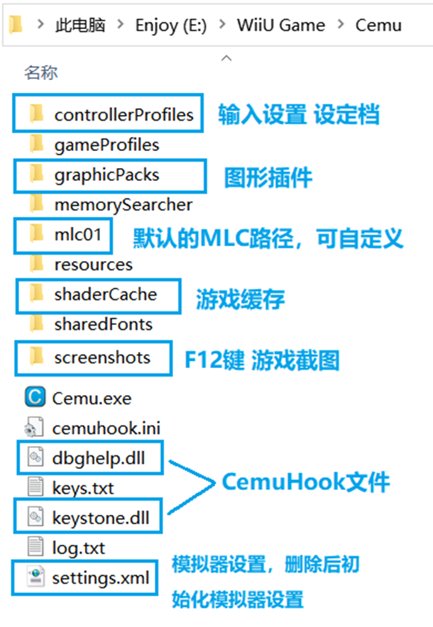

模拟器的没有的朋友，建议去Cemu官网：[http://cemu.info/](http://jump2.bdimg.com/safecheck/index?url=x+Z5mMbGPAsqsSnj3qczkFsUpbaMKsmByExmB9N/65I=)

和CemuHook官网：[https://cemuhook.sshnuke.net/](http://jump2.bdimg.com/safecheck/index?url=rN3wPs8te/oTet06oPzm815j0wT6/FUyQdnL/SlYHDZqikdHUSx0ychMZgfTf+uS)

下载模拟器和必要的**Hook文件**，也可以使用整合包等带有的模拟器。但是版本太老或修改过的模拟器不推荐.

模拟器的目录可以与游戏本体和DLC等存档分开，比较好的结构如下图

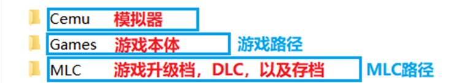

其中MLC目录其实就代替了模拟器中mlc01文文件夹的功能

### **1.2 游戏获取与安装**

**寻找游戏资源可以去老男人游戏网**

[https://www.oldmanemu.net/](http://jump2.bdimg.com/safecheck/index?url=rN3wPs8te/pL4AOY0zAwhwAlUqgl5y87oeyA0VkSPkYzQUl7pKY9sQBvuApuBUlN)

但是老男人的WiiU游戏，收录的是**WUP格式的文件**，该文件无法直接在Cemu上运行，需要**进行转换**.

老男人下载解压后，会得到一些文件夹，和一大堆.app及.h3结尾得文件，这是WUP得文件结构。

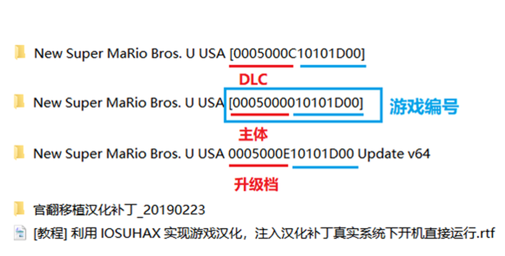

转化工具使用**WUP转Loadiine工具**模拟，转化方法如下：

打开我们的转换工具. 按下图步骤，开始对下载下来的 主体，升级档，DLC进行转换.

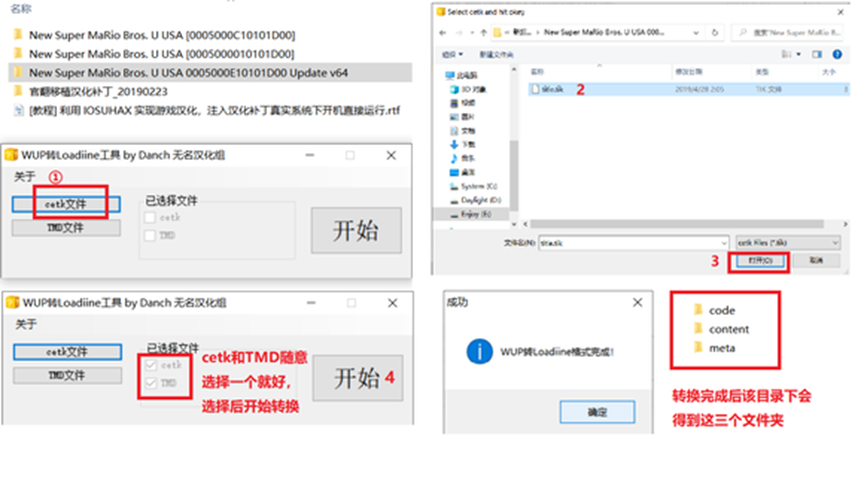

1. 选择这些目录下的**title.tik文件**，点击打开。
2. 转换完成会得到**code，content，meta三个文件夹****
3. 模拟器添加游戏很简单，但对于游戏格式必须如下图

全部转换后，开始安装，这里提供两种安装方法。

#### **1.使用模拟器进行安装**

如图，找到我们刚刚转换好的文件，meta->meta.xml 开始安装.

这样安装比较方便，但其实也就是将 这三个文件夹复制到正确的地方.缺点是所以又增加了一些硬盘读写的容量.（相当于一个游戏，解压了四次）

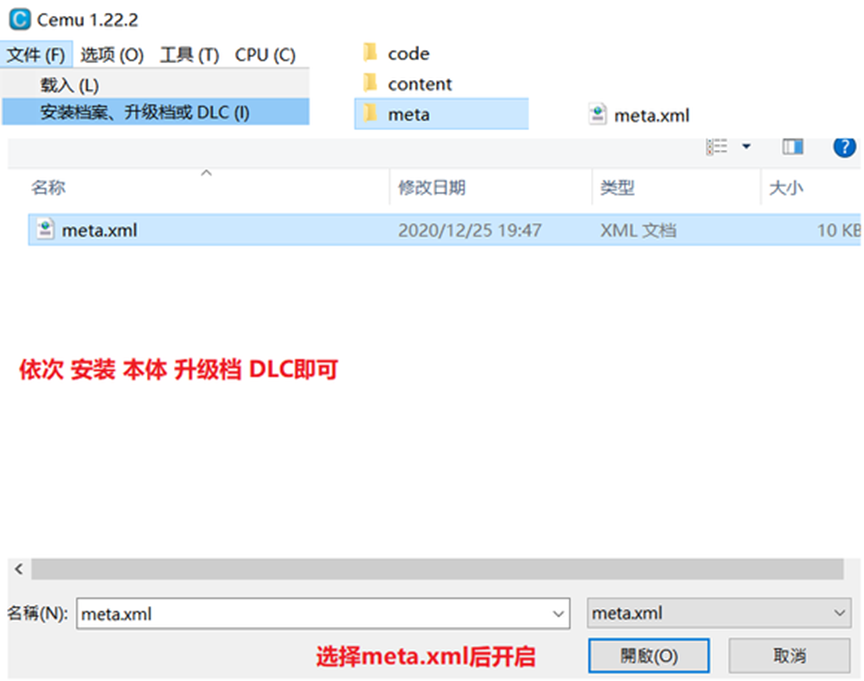

#### **2.手动复制安装（推荐）**

如果你掌握了游戏存放路径，并且下载和游戏存放在一个盘，推荐使用这种方法. 先了结模拟器中**MLC文档结构,特别注意字母。其中User是存档目录，要覆盖存档最好是common加数字文档一起替换。**

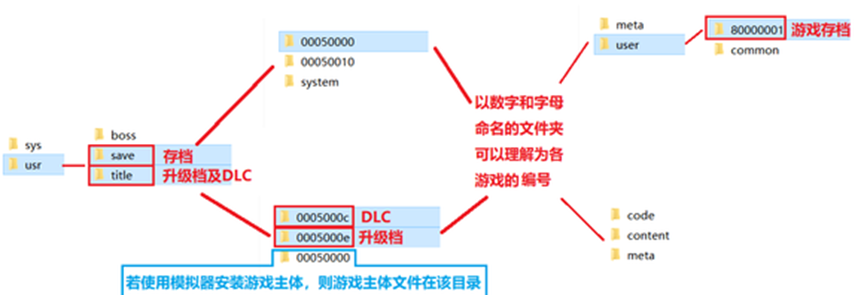

虽然麻烦，但是减少硬盘读写量嘛，爱硬盘从我做起.

**主体**：【游戏路径】如个人新建一个的Games的英文文件夹，建立游戏名文件夹MaliaoU,然后将主体0005000010101d00里三个文件夹，剪切粘贴到MaliaoU中.

**升级档**：在【MLC路径】下的**usr\title\0005000e**中，建立一个**【游戏编号】（如马里奥U就是：10101d00）文件夹**将对应的0005000e10101d00里的三个文件夹剪切粘贴过去.

**DLC**：同上，文件夹换成usr\title\0005000c

操作完成上述步骤后，需要在模拟器**选项**中**通用设置中设置**游戏本体存档位置与自已放置的MLC位置，（其中模拟器语言也在这设置，其他部分勾选就看个人）

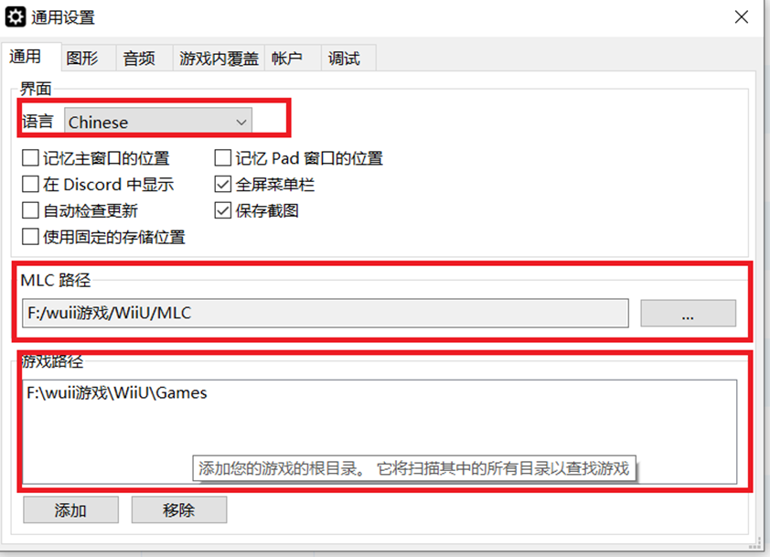

#### **3. 游戏汉化**

老男人的游戏都是原盘+提供了汉化补丁，还需要我们手动安装汉化文件,汉化补丁也由两种使用方法,依然马里奥U为例:

**1.覆盖游戏原文件**

进入解压后的到的汉化脚本文件夹.

因为我们的游戏是美版，所以我们**用记事本打开一个美版的脚本**.，**可以看到汉化文件和需要复制到的地方**.

就是把这些文件覆盖到，【游戏路径】和【MLC路径】相同的文件夹就行了.

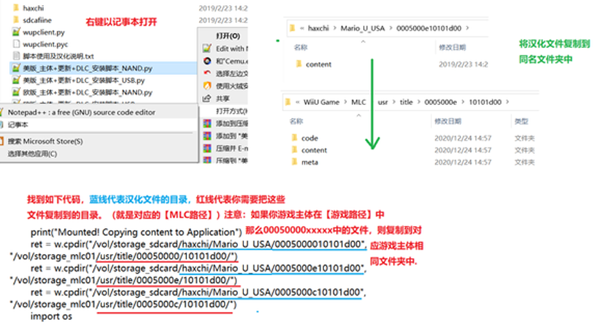

这种方法比较通用，比较复杂的汉化也能用，但会破坏游戏原文件，如个某些汉化有问题，极可能造成游戏异常，恢复起来也很麻烦（特指异度之刃X）

**2.使用图形插件加载汉化.**

这个方法汉化的好处是，不会破坏游戏原文件，即便汉化异常，也可以取消勾选图形插件来快速恢复。

缺点是某些复杂汉化不适用，但大多数游戏都能用这个方法汉化。

怎么制作汉化插件呢，还还还还是以马里奥U为例。

其实很多汉化补丁里会有一个**sdcafiine的文件夹**，有这个文件夹基本代表可以制作图形插件汉化，由于是美版，我们打开对应的美版补丁 00050000101d00文件夹。

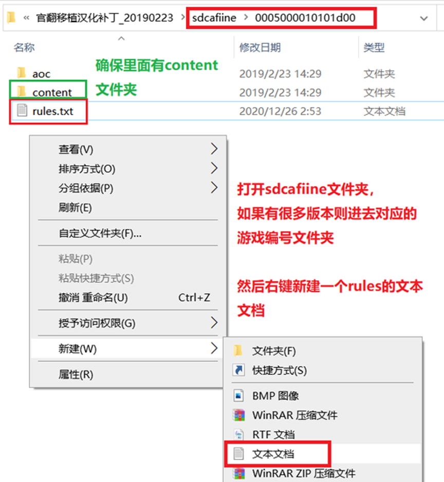

然后按下图rules.txt的模板，或者复制下面或自己改一下就可

```console
[Definition] 
titleIds = 游戏完整编号（注意等号前后有一个空格，不要删除空格和下方引号） 
name = "简体中文" 
path = "游戏名称/简体中文" 
description = 简体中文 version = 4
```

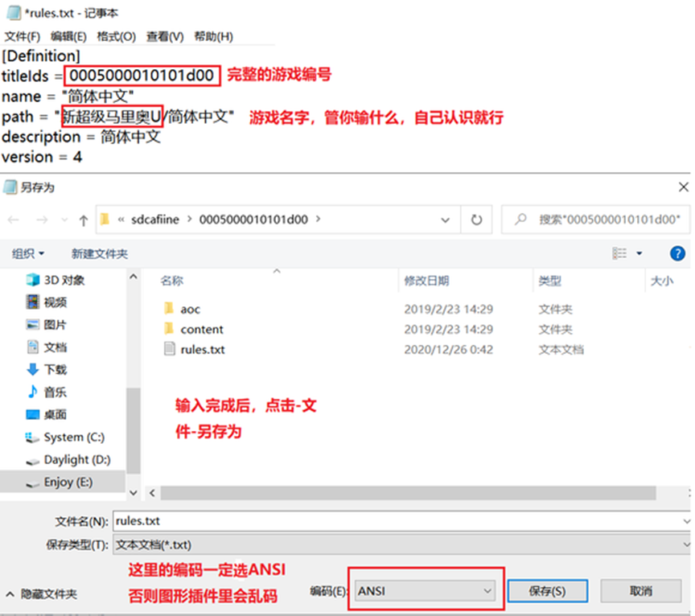

保存，接下来在模拟器图像插件文件夹中复制内容就行

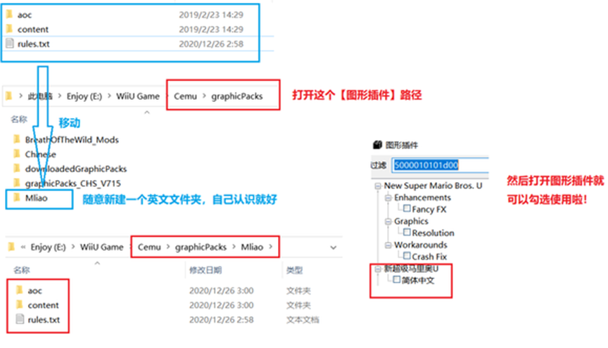

如此操作后，游戏汉化就搞定了.制作图形插件的方法不难，但这种方法也有不能用的地方，比如汉化补丁中有，本体，升级档，DLC等多个汉化文件，且各个content文件夹中有同名文件，它们大小又不一样，那么基本无法制作成图形插件使用.（比如怪物猎人3U欧版），遇到了，就用第一个方法吧！

<font color='red'>**出现运行异常，可以右键游戏，选择Wiki page，查看该游戏的模拟情况（可以用浏览器的翻译，应该能勉强看懂）**</font>

<font color='red'>**网页最下面也有各配置的测试表格。**</font>

**官方图形插件汉化版**，可以解压到【graphicPacks】文件夹即可使用。

使用整合版的Cemu可以默认就安装了很多汉化内容与图像插件了，比默认的Cemu大。

#### **4. 游戏格式说明**

附一下网上找到的WiiU格式说明，你们找资源的时候，别下错了哦.

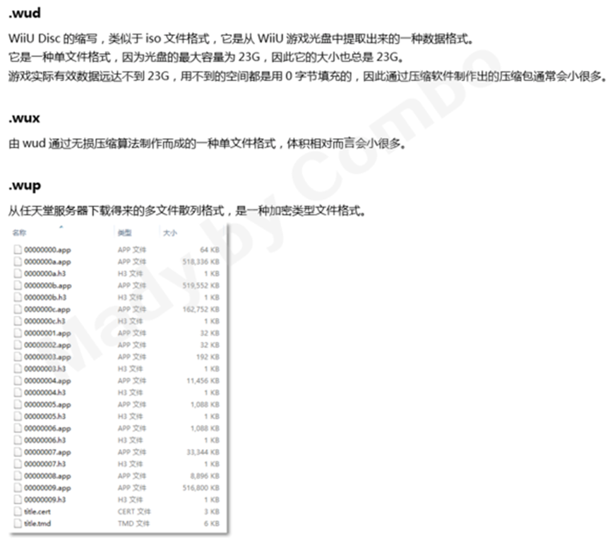

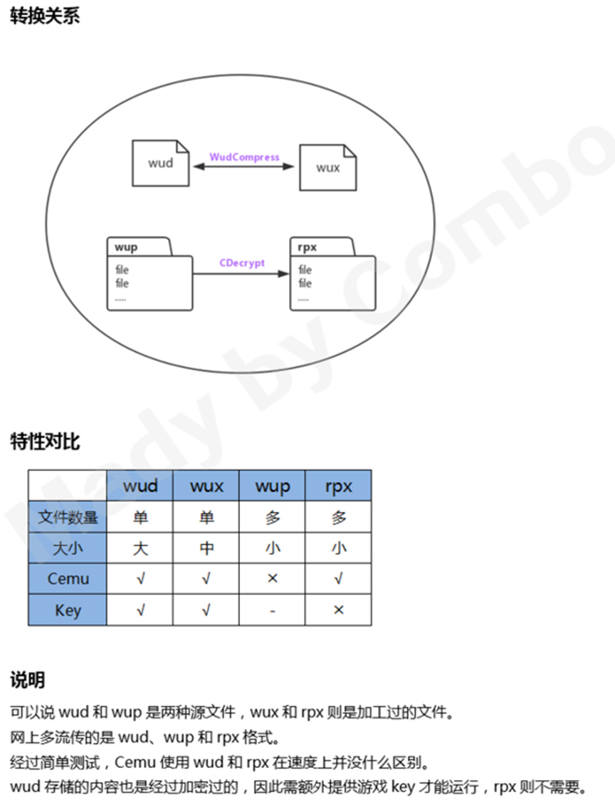

因此建议下载wup或者转化后的rpx。

一般游戏**Auto**可以应付，如出现游戏进不去，卡第一屏，可以试试切换**CPU模式为single，Multi**。

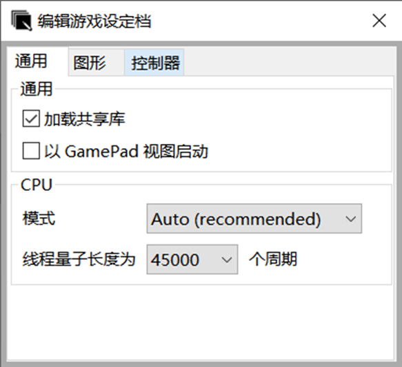

最终安装好后，点开模拟器右键刷新一下就可看到游戏了

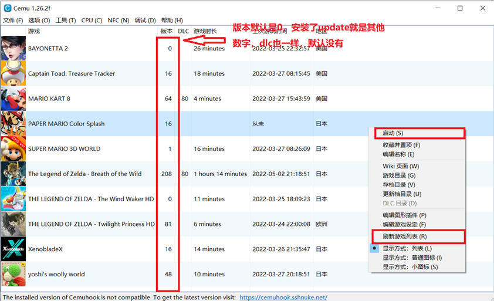

其中要快速进入存档目录，dlc目录，更新档目录都可以点击右键快速进入。

上述游戏目录为：

```console
猎天使魔女2
耀西的毛线世界
异度之刃X
塞尔达传说 风之杖 HD
塞尔达传说 黄昏公主 HD
超级马里奥3D世界
蘑菇队长 奇诺比奥 宝藏追踪者
马里奥赛车8
纸片马里奥 彩色喷涂
塞尔达传说 荒野之息
```

### **1.3 缓存文档**

默认对于一些加了dlc与更新档的游戏，有时游戏载入特别慢，这时就需要缓存文件，这样可以大大加速游戏进入的时间。例如整合包中塞尔达与纸片马里奥都是有缓存的。缓存文档的下载也可去贴吧中寻找下载。

### **1.4 图文插件**

之前使用汉化时，我们利用的图文插件文件夹，其实除了汉化，里面还可以放入画质包、mod、帧数60、金手指以及各种插件，这其实就类似yuzu中的插件文件夹一样。

## **二、模拟器控制设置**

### **2.1 非体感游戏控制**

手柄键盘控制设置，默认简单的手柄可以直接在模拟器中设置，而且只要设置一遍保存后，以后只需要载入就行

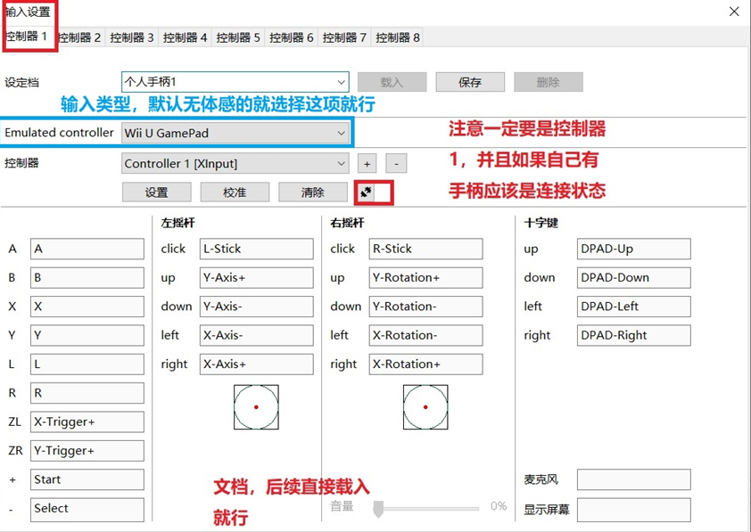

当然如果觉得设置太麻烦，而你又是比较官方的手柄，则可以去下载文档放入控制文件夹中就可以了

### **2.2 体感游戏模拟**

要模拟体感就行使用相应的插件，比如mouse就是鼠标转化体感的工具，个人建议使用体感手柄，鼠标模拟有时候不太好玩。

**mouse2Joystick**是鼠标模拟体感的工具，其使用方法很简单，先安装驱动，然后再将控制器配置文件放入模拟器手柄文件中，最后设置好后就可以使用鼠标模拟体感了。

**betterJoy**手柄体感工具，对应不同的手柄启动不同的，如果是ps官方的还需要下载其他的体感模拟工具。

使用方法都是先连接上手柄，然后启动软件，添加手柄，测试连接，这时如果连接成功就有一个转化好的IP地址与端口号。

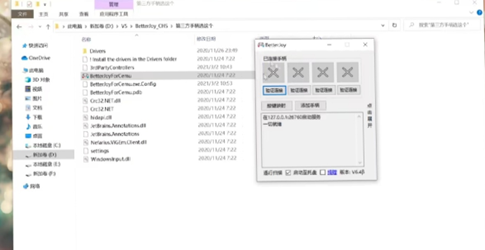

进入模拟器控制界面，看motion内容中是否有需要IP+端口号的，只要设置一样就可以测试。一般使用**奇落比队长**这游戏测试体感就行。

下图是ps5正版手柄的体感模拟器工具，其中udp就是服务器地址与端口

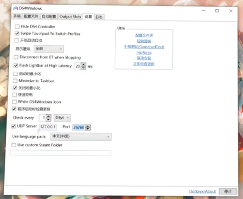