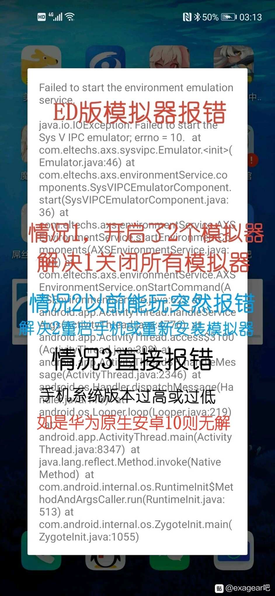

# exagear模拟器

[TOC]

exagear是在安卓手机上模拟windows系统的模拟器。

PS:华为安卓10或以上系统升级到鸿蒙2.0.0.210以上就能运行exagear

## 一、exagear模拟器安装教程(以ED版模拟器为例)

1.下载模拟器:(下载想玩的游戏)

普通ed版fix23版:https://pan.baidu.com/s/1BJnLDGhWGuXBEbj8BVUThg 提取码:1iq0

安兔兔ed版fix23版:https://pan.baidu.com/s/1Tht0I8rdzHCxqXlhU7qRkA 提取码:3895

鲁大师ed版fix23版:https://pan.baidu.com/s/199imfYyJ5fjtRgHUiTB1Hw 提取码:0226

bass.so闪退补丁(放手机根目录):

https://pan.baidu.com/s/1akY9z8fG-FvUU2rwgsX_bw 提取码:3osq

rar解压软件:https://pan.baidu.com/s/1bVKfkweCGadVglkGij8A_Q 提取码:fndb

ZArchiver解压工具:https://pan.baidu.com/s/19lX0Nv6ijH4VYcvxZV0ttA 提取码:99b2

游戏键盘:(玩mugen需要安装)

链接:https://pan.baidu.com/s/1k_l9MLGVmBIHwvWD--2BlQ 提取码:33f2

2.解压edfix23数据包。

   

3.把bass.so文件复制或者移动到手机根目录。**根目录位置:储存管理→手机储存→bass.so(不要任何文件夹)**

​    

4.安装ed302-9_d3d.apk并打开

​    

5.看到此提示后退出模拟器

​    

6.把数据包main.31.com.eltechs.ed.obb(注意:普通版，安兔兔版和鲁大师版数据包名字不一样)移动或者复制到  Android→obb→com.eltechs.ed文件夹:

> 注意:
>
> + 普通版是 com.eltechs.ed文件夹,
> + 安兔兔版是 com.antutu.ABenchMark文件夹,
> + 鲁大师版是 com.ludashi.benchmark文件夹

 

注意:

  普通版obb数据包名字是:main.30.com.eltechs.ed.obb

  安兔兔版obb数据包名字是:main.31.com.antutu.ABenchmark.obb

  鲁大师版obb数据包名字是:main.31.com.ludashi.benchmark.obb

​    

7.打开模拟器(解压时不要点击屏幕，误点的话点击空白地方就行)

​    

8.启动后点击左上角三横(桌面两字左边)

9.点击环境管理

​    

10.如果玩3d游戏就点击右上角+号添加一个环境(如果玩mugen或者2d游戏可无视这步)

   

11.选择一个环境管理点击左边的三点选择设置

​    

12.设置好游戏对应的分辨率和颜色(设置好后按左上角←退出)

​    

13.点击设置好的环境右边三点选择启动

​    

14.第一次启动会显示这个(不用管)

   

15.把游戏放到ExaGear文件夹里(游戏记得解压)。一般直装版使用download，非直装是exagear文件夹，如果没有ExaGear文件夹就自己创建一个。如果游戏不显示把ExaGear文件夹全部大写改成EXAGEAR，如果是其它版本模拟器也可以试试把游戏放Download文件夹。

​    

16.模拟器里进入D盘找到游戏(如游戏是模拟器打开后才放进去，那就随便进入一个文件夹后退回d盘就会显示该游戏)

17.找到游戏的开始exe文件进入游戏(可以愉快玩耍了)，当然，安装插件也是在内部运行exe就行。其中字体与声音需要放到对应位置。

## 二、es版,et版,ex版等非ED版安装教程

1.下载模拟器:

  

2.安装apk，然后打开模拟器

3.放数据包:压缩包解压后是obb文件的放:(以es版为例)

Android文件夹→obb文件夹→com.eltechs.es文件夹→main.40.com.eltechs.es.obb(解压后的数据包)，注意数据包名字。

压缩包解压后是一个com.eltechs.es文件夹:

把里面的整个image文件夹移动或者复制到:

Android文件夹→data文件夹→com.eltechs.es文件夹→files文件夹→image文件夹(解压后的文件夹)

3.把游戏解压后放进ExaGear文件夹(如不显示则改成EXAGEAR)没有就自己创建一个或者Download文件夹(以前的安装包一般放Download)

4.启动模拟器，选择相应的exe点击右边的齿轮设置好后进入游戏即可。

## 三、爆音解决(还会有些爆音)

1.下载EdToolv2.5.exe  (ed工具箱)打开

链接:https://pan.baidu.com/s/11XgMrSwJnUlgm_zKCHqz5g 提取码:4860

​    

2.点击左上角“工具箱”，选择“切换声音驱动”

​    

3.选择第二个声音驱动(完成)

如果第一次爆音方法还嫌声音不好

​    

爆音解决方法2  (声音完美，但部分游戏闪退)

下载wnex.exe(主要是中文方便操作)

链接:https://pan.baidu.com/s/1a88bV4eYkEio7xWyeOmW9w 提取码:5w4f

   

下载声音补丁

链接:https://pan.baidu.com/s/1LtYzWFGBu6MfqQRs96Wqgw 提取码:qq46

1.打开wnex.exe

2.点击“此电脑”→选择“z盘”

​    

3.找到dsound.dll.so右键选择复制(用cp10操作模式比较方便)

   

4.点击“我的电脑”→“z盘”→“usr”→“lib”→“i386-linux-gnu”→“wine”→右键粘贴→替换文件。

  

  

5.进游戏愉快玩耍。

## 四、添加字体

下载wnex.exe打开(主要是中文方便操作)

链接:https://pan.baidu.com/s/1oNUhCdrKsfMZHPcM42hOzQ 提取码:w8a1

下载需要添加的字体(注意字体格式)

1.打开wnex.exe  点击“此电脑”→选择“z盘”

​    

2.找到需要添加的字体右键选择复制

   

3点击“我的电脑”→“c盘”→“Windows”→“Fonts”→右键粘贴→重启模拟器(完成)

​    

   

## 五、mugen流畅度设置

1.不要用opengl渲染的主程序或者战斗场景。

2.mugen分辨率调到最低640x480

3.把mugen.cfg里的RenderMode=OpenGL改成rendermode=system或者rendeemode=DirectX

4.手机配置太差就把游戏声音关了。

​    

​    

## 六、游戏键盘安装(mugen游戏需要)

​    

​    

​    

​    

   

## 七、玩GAL GAME游戏黑屏的部分原因:

一:此游戏无需dX。使用有dX的 就有可能会因dX导致黑屏。解决方法:用无dX数据包。或者修改成gdi。

二:此游戏需要dX。但因dX对其来说是不正常的，就会黑屏。解决办法:换其它带dX的数据包。

三:此游戏需要dX。dX对其来说也属正常，但因3d优化设置对其不合适，从而导致黑屏。解决办法:将backbuffer删除，或改为pbuffer。

四:游戏自身问题，如仙剑4。原本在中低配置的电脑上就有喜欢黑屏的问题，自身优化不佳。

五:解码问题，即op问题。

​    

总结，大多是与dX有关。

​    

## 八、其它

视频安装教程:(以后新版本模拟器会在视频简介更新)已更新至fix26版

https://b23.tv/6JqnCW

手机mugen键位设置:

https://b23.tv/UEn5jW

视频ED版fix26版爆音解决方法:

https://b23.tv/ad5bdH

以下2个爆音解决方法对fix26版无效:

视频爆音解决1:(还会有点爆音)

https://b23.tv/znRxkd

视频爆音解决2:(声音完美，但部分游戏闪退)

https://b23.tv/fKd3Ij

视频添加字体教程:

https://b23.tv/6PTPKH

​                          图文教程

以后新版本模拟器将更新在(视频教程简介里):

已更新至ED版fix26版

https://b23.tv/VBjOaJ

如果你手机是(华为安卓10)那对不起，目前exagear不支持你手机。

PS:华为最新系统已支持exagear!

小米手机锁DATA文件夹的可试下把数据包放根目录(不带文件夹)