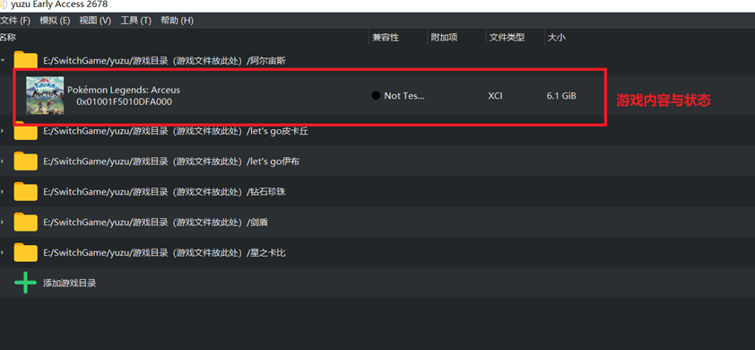
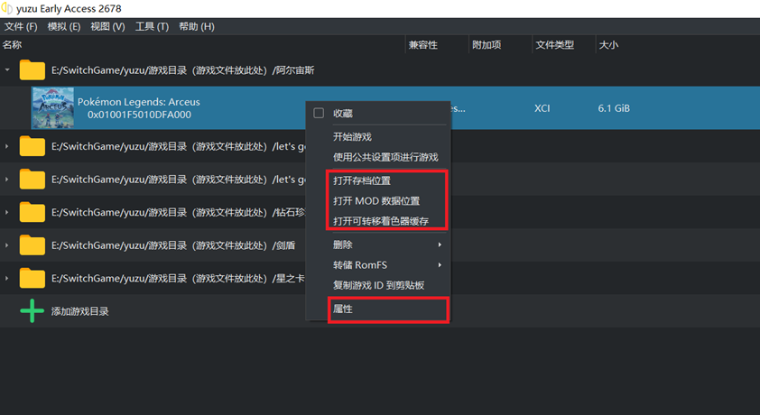
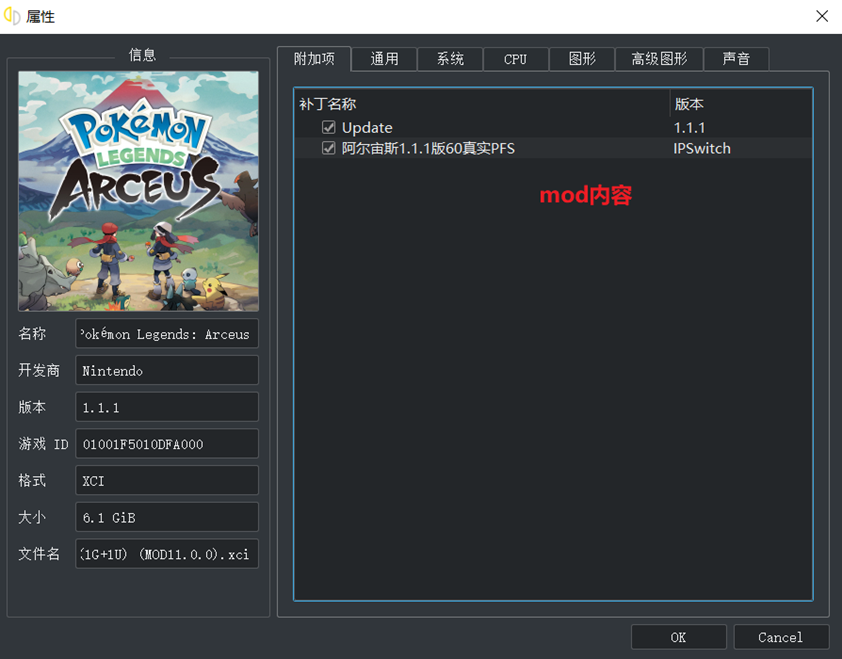

# **一、模拟器基础操作**

yuzu模拟器又称柚子模拟器，是专门用来模拟switch游戏机的。**目前pc模拟switch游戏的模拟器有三款yuzu柚子模拟器，ryujinx龙神模拟器**。用这三款模拟器基本可以模拟大部分switch游戏且都能较稳定模拟。

**ceum模拟器是wuii机子的模拟器，与switch不同**

YUZU最低电脑配置要求:

> **CPU：I3-5XX代**
>
> **内存：8G**
>
> **显卡：GTX650**

**如果达不到配置要求或者没有独立的显卡， 游戏中极有可能出现图形黑屏、画面有横条、画面卡顿等现象！**

模拟器使用方法如下：

1.放入游戏本体到游戏目录

游戏路径=双击模拟器中间的 + 选择（游戏目录），游戏文件本体格式为：**xci、nsp**

2.游戏基本设置

- 键位控制自定义
- 图形模式一般使用vulkan（v模式）比较好，在vulkan模式游玩中出现问题后可换OpenGL模式过关，如果vulkan模式没法选择请更新显卡驱动
- 输出分辨率（画面分辨率）：1x (低配电脑请只使用1x ，中高配电脑可使用2x尝试帧数是否稳定)

3.使用手柄游玩手柄，在设置-模拟-控制-输入设备中，选择自已的手柄 (手柄无线模式连接模拟器要有手柄驱动)

如果Let's Go 皮卡丘控制没反应需勾选左上角**模拟--设置--连接控制器--选择掌机模式**(默认左下角主机模式没法开启) 画面黑屏用请用vulkan模式，为什么改作品需要掌机模式是游戏需要体感功能操作导致。

4.游戏发现加速现象属正常 (因为主机是锁30帧的)，可能是加入了60帧的补丁的效果，如果不喜欢可以在右击游戏--属性--把60帧的补丁前面的勾选去掉就行

快捷键**Ctrl+U**可以解锁帧数目前只能适用宝可梦：珍珠/钻石 

剑盾Let's Go皮卡丘使用后会加速过快

5.如果设置打不开闪退：删除配置文件重调设置，配置文件目录**\YUZU\user\config**

6.全屏游戏按F11键

配置好后如果出现下图内容，就可双击游玩游戏了。

​    

# **二、模拟器常见问题解决**

1.出现VCRUNTIME140错误 

答：请安装解压资源中的 请优先安装 VC2019

2.打开模拟器发生闪退

答：请确认自己的系统是否是64位的系统  Windows7和windows11可能会出现问题 请更新显卡驱动

3.模拟器无限读条加载

答：请确认自己的模拟器和游戏本体 有没有放到固态硬盘，如果是机械盘或比较低端电脑，加载慢确为正常。

4.vulkan模式没法选择或者提示视频解码核心出现问题

答：更新显卡驱动

5.在游戏的过程中出现闪退、卡死

答：内存8G的只能标准合格， 升级内存16G可以减少或者设置虚拟内存，不懂得百度

6.感觉画面卡顿帧数过低

答：可能电脑配置过低或电脑没最大化输出 笔记本请不要用省电模式 ，键盘Ctrl+u尝试解锁帧数或加入60帧补丁

7.画面太模糊

答：确认左下角“主机模式”有没打开？输出分辨率= 模拟，设置，图形，画面分辨率：1x (低配电脑请只使用1x  中高配电脑使用2x尝试帧数是否稳定)

# **三、游戏版本、mod、缓存、存档、金手指使用**

在模拟器中右键游戏，便可以看到存档、mod、缓存等目录，只需要下载好对应的文件放入对应目录就可使用。

右键内容

属性面板

## **3.1 游戏版本+dlc更新**

一般版本要升级需要下载升级包，格式一般为nsp。升级流程：

1. 打开yuzu，选中要升级的游戏
2. 点击文件选择第一个安装选项
3. 选择好补丁确认好就等待就行

其中安装dlc也是一样的流程，其中需要注意有时升级游戏后mod或金手指有可能失效的

## **3.2 游戏mod**

mod也就是我们常说的游戏补丁，其中类型各种各样，包括环境、任务、人物mod等

1、鼠标右击游戏选择---打开MOD数据位置---跳到文件夹目录---放入mod文件

2、鼠标右击游戏选择---属性---补丁目录有显示你解压的补丁名字出现，有就打勾的图标(**补丁MOD版本与游戏版本必须相同 否则无效**)

3、人物mod有时需要注意多个mod的冲突，或者有时勾选无效或许是没有替换到默认模型时未生效。

## **3.3 金手指**

yuzu金手指的目录是放在mod目录中的，其中也是要勾选，因此需要三层文件目录，金手指名称—cheats—金手指文件

**金手指文件名一般不要修改，内容也要对应游戏版本**

其中很多时候是多个效果在一个文件中，要分批很简单，只需要复制文件然后删除不需要部分就行。

## **3.4 游戏存档与缓存**

要找到游戏存档与缓存的目录，只需要右键游戏就可以直接找到。

其中存档文件为main文件，要用别人存档直接替换就行，而缓存只需要放到对应目录下的cache文件夹内就行。

存档的作用不必多少，其中缓存的作用就是如果觉得游戏每次进入加载过慢就可去下载一个缓存包，然后放入缓存目录，这样就可大幅度提高加载速度。

## **3.5 修改器**

很多时候金手指不可用的时候，可以考虑使用对应游戏的修改器直接修改游戏存档。比如宝可梦的修改器就是**pkHex**，该修改器可以直接修改宝可梦属性，6v，闪光直接拿到都行。

当然修改器内容也是与游戏版本有关，一旦版本不匹配可能在修改器中现在有些存档文件会出现错误。

其他模拟器大部分操作与该模拟器差不多，就是位置不同而已。