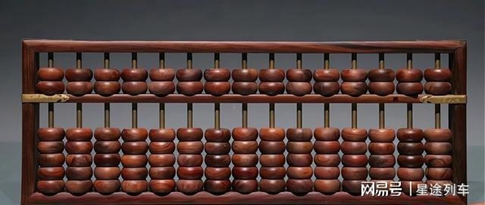
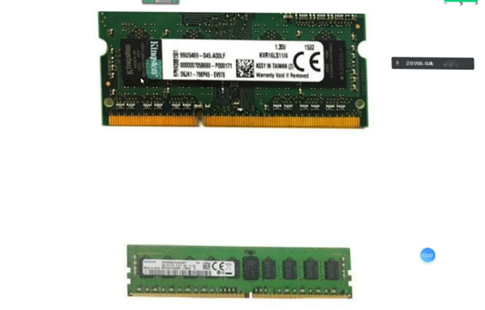

# 一、计算机发展史

在数字出现后，人们就无时无刻不用它们去计算，但慢慢人们就发现，人的计算能力是有限的，不管是计算量或者计算速度有时都无法满足很多需要，因为人们慢慢开始萌芽使用工具代替计算，这就是计算机的发源。

## 1.1 算筹与算盘

在中国古代，人们使用算筹与算盘来帮助计算，算筹主要是使用木棍记录计算的计算数字的大小，为十进制每五根棍横竖交替表示记录的数字，而算盘就是算筹的进步，**上二下五珠**，表示其为十六进制，因为一组表示15，然后十五满进一位。它们都提高我们计算数字的量与计算速度，但**工具只能作为存储数字的作用，计算依然是人脑**。

**效果：输入数字+人脑计算+存储结果+展示结果**

算筹图片

算盘图片

## 1.2 机械计算器

1. 帕斯卡计算器

2. curta计算器,这类计算器，主要是利用机械原理来实现计算，人们只需要输入要计算的数字与加减指令就可完成。它大大减少人脑的需要从而大大加速了计算。

   **效果：输入数字+机械计算+存储结果+展示结果**

3. 差分器计算机,科学家巴贝奇想利用他们差分理论结合机械计算器完成一个能做**函数运算**的计算机，例如y=x2+x*2+2这种，只需要改变x就可以得到不同结果的机器。但由于当时机械工艺有些最终无法实现。但差分理论在现在计算机中依然很实用。

   **效果：输入数字+函数计算+存储结果+展示结果**

   

## 1.3 电子计算机

第一台电子计算机是**图灵的ABC计算机（英国）**，主要用于军事密码破解。

第一台**通用**计算机是**冯诺依曼的ENIAC计算机（美国）**，使用许多真空管与继电器制作，占地有170平米。可以做的每秒5000次加法与400次乘法，大幅度提高运算速度。

在这之后，计算机得到大力发展。

1. 第一代计算机（真空管），缺点体积太大
2. 第二代计算机（晶体管），体积大幅度降低

大部分晶体管都是二极管或者三极管，不通电状态表示0，通电状态表示1，这也奠定了计算机二进制的基础。

3. 第三代计算机（集成电路），进一步缩小晶体管体积，进而使用更多晶体管，大幅度提高计算速度
4. 第四代计算机（超大规模集成电路、现代计算机），再进一步集成更多晶体管。32nm的i3处理器就有6亿晶体管，苹果a15处理器有150亿晶体管,要生产这类芯片，必须使用光刻机，中国没有这类技术，因此很难生产自己的芯片。

5. 第五代计算机（量子计算机）研发中。

## 1.4 inte+ CPU发展史（有趣）

在超大规模集成电路技术出现后，半导体公司intel就迅速崛起。其发展史也很有趣。

4004：1967年，第一代4位处理器诞生

8008：就是第一代8位处理器

8080：8位但优化的工艺技术

8086：第一代16位处理器，跨时代的技术

80386：出现第一代32位处理器

2001年：出现第一代64位处理器安腾处理器

这段时间出现CPU型号类似是80136、80236、80336、80436、80536，在80636时发生一些事（传闻是被提前注册）名为奔腾Pentium处理器，后续intel公司考虑到面相多方用户

+ 奔腾处理器Pentium：高端用户
+ 赛扬处理器Celeron：低端用户
+ 酷睿处理器Core：中端用户

后续继续优化科技，在2008年11月，第一代酷睿i3诞生，接着第二代、第三代随着工艺的进步又推出i5，i7，其中i9系列诞生是由于竞争对手amd由苏妈带领工艺进步，迫使intel不得不发布。

其中酷睿从2008到如今的2022年13处理器，可以看出intel基本是每年更新一代，但其实性能提升只能达到10％，这也是intel刻意放缓进度，例如i3第一代是32nm工艺，第二代就是22nm，但第三代只是优化但依然是22nm，因此很多人也称intel为牙膏厂。其中nm技术也在这些年中从32nm、22nm、14nm、10nm、8nm最近听说台积电已经拥有7nm技术。当然，后面有了分频多核技术，逐渐也出现4核，8核等代表不同工艺。

inte+ i3-530外，第二代名叫i3-2120第三代i3-3220，可以看出i3是系列，而后面第一位数字就是第几代，而后面的数字就代表不同型号。下面是intel处理器命名认知

例如inte+ 酷睿 i5-12600KF表示intel是厂家，酷睿是品牌系列

i5表示定位中端，i7或i9就是高端数字越大性能越强

12表示十二代，代数越往后说明工艺越强同等性能越强

600表示inte+ sku型号划分，数字越大频率就越高性能也就越强

K表示不锁频，就是可以进行超频操作

F则表示不带集成显卡，毕竟配合独立显卡使用

intel与amd区别，intel是研发、生产、销售都是自己，而amd则是研发、台积电、销售，amd靠着这种模式才能迅速崛起并且成本比intel少，虽然品质上依然有差距。

## 1.5 冯•诺依曼体系

计算机在图灵制作出图灵机后就标志着计算机正式诞生。但当时计算机**程序与数据是一体的**，因此无法给普通大众使用。当冯诺依曼提出了程序+数据的体系后，才标志着计算机的体系正式完善，该体系最核心的就是有控制器控制流程，运算器按步骤进行计算其简单体系如下：

运算器+控制器（也就是CPU的功能）

存储：硬盘、闪存、U盘、光盘、磁带

输入设备：键盘、鼠标、触摸屏

输出设备：显示器、打印机、音响

Gpu其实就是显卡CPU，是发展到后期满足高画面运算才诞生的。早期是没有的。

# 二、计算机硬件

从原始的冯诺依曼体系发展到现在计算机硬件包括：

1. CPU：最核心硬件
2. 内存：动态存储器
3. 显卡：图像处理器
4. 硬盘：静态存储器
5. 电源
6. 主板：所有的硬件都需要安装在主板上
7. 其他的设备：机箱（主板的外壳）、鼠标、键盘、显示器

## 2.1 CPU

常见的CPU架构有：

+ X86架构：intel、AMD、兆芯，该架构常用于台式机、笔记本、服务器
+ ARM架构：苹果、高通、麒麟、三星、联发科，常用于移动端、嵌入式设备、服务器，window10有ARM版，完善了可实现手机window10系统

+ mips（开源）：龙芯，用于交换机、路由器，嵌入式设备
+ RISC-V（开源）：国产玄铁910

+ SPARC：java的sun公司推出的 目前已经被淘汰了

+ PowerPC，只有IBM服务器使用

x86架构intel与AMD的CPU不同在于针脚，intel没有针脚，intel是要求主板厂商在其主板上做针脚，因此用不同CPU要注意买对应是主板，intel的CPU因没有针脚而更稳定不容易坏

**CPU主要参数有：（判断CPU好坏）**

+ 主频：主频越高，性能越强，功耗越高，2.4ghz表示一秒运算约为2.4亿次
+ 最高睿频：则是偶尔CPU最大频率，因此CPU往往可以运行远高于自身频率，有些人会修改CPU电压值+液氮降温来玩CPU超频，2.4ghz超到8.5ghz的都有
+ 核心数：核心越多，同时处理多任务越强，效率越高因此性能更强
+ 缓存：缓存越大，读取数据越快，处理速度越快
+ 工艺：14nm，22nm，32nm，越小说明同样大小CPU中晶体管数量越多，性能越强，但同时可能功耗也会越高，发热更强
+ 扩展性：最大支持内存参数
+ 散热：防止过热烧毁（主频越高要求散热能力越强），过热断电就会出现黑屏，台式机：正常温度20-50℃，笔记本（压测）：正常温度 超薄本 80℃ 、普通本 70℃、游戏本 60℃左右，如果散热不好，可能是CPU与风扇间的硅脂干了，不要太厚，太厚干了就更不导热。

案例：

CPU因材料不同，往往对内存有限制，买内存时就需要考虑CPU支持的最大内存

**多线程原理**：现在电脑往往我们能同时听歌，打游戏，看视频。为什么能实现这样的效果，其实就是多线程的帮助：

运行一个软件，往往是先从硬盘中加载数据到内存中，这也是一个进程或线程的启动，然后CPU再从内存中读取数据进行处理，同时运行多个软件其实就是同时加载多个内存，当CPU只有单核时，因为性能强，它会给每个软件线程0.01秒进行处理，因为处理时间太短，因为使用者就感觉所有软件同时在运行，当多核时就更方便，直接可以一个进程一个CPU，这样就少了切换的时间，因此效率会更高。这就是多核的优势。

要了解CPU是否真的好，可以去CPU天梯图看，或者用跑分软件跑分。

在工厂生产CPU时是有良品率的，好的直接可能提高频率卖高价，次一级是就低价售卖，最次的可能有损坏的核心，这时就会使用屏蔽技术降核心数量从而保证能使用。在这种前提下，以前也有CPU开核技术，也就是解除这种频率，用低价买到更好性能。

**压缩文件，画图渲染，视频剪辑或者ai运算这些应用最消耗CPU**。

## 2.2 内存 Memory

在冯诺依曼体系中最初是没内存的，主要是因后期CPU处理数据速度太快而硬盘加载数据速度太慢，因此需要内存提前加载数据来提速。

**内存参数：**

+ **内存大小**
+ **频率：读写频率越高越好**
+ **品牌：越好品牌用的内存颗粒越好**

目前内存的代数：

1. DDR： 265mhz
2. DDR2：533mhz 800mhz
3. DDR3：1066mhz 1600mhz
4. DDR4：2400mhz 4300mhz
5. DDR5：7500mhz

每一代内存的接口都不一样，不上下兼容，因此不同主板支持的内存也不同，金手指上的凹槽也是防插反的设计。之前说过不同CPU支持内存不同，买内存一定要看CPU。

内存分为**台式机内存、笔记本内存**，台式机要比笔记本内存要窄一些更长一些。下图上边就是笔记本内存，下边就是台式机内存

上图中台式机内存上的黑块其实就是内存颗粒（中间那颗不是），一般一颗512M，因此上图可能就是4g内存或者8g（正反两面）

内存的厂商：三星（颗粒最好）、海力士、镁光、东芝（改名铠侠）

内存有双通道技术与四通道技术

双通道技术意思就是需要16g的内存，可用两条8g内存代替单条16g且性能更好。注意用两条内存一定**同频率、同品牌、同电压**都要一致最好，否则容易**蓝屏**。蓝屏一般都是收集内存出错信息。

有时不同牌子内存似乎也能两者兼容， 其实这可能这两个牌子生产厂家是相同的，也就是使用的相同的颗粒。

## 2.3 硬盘 hard disk

**硬盘参数：**

+ **类型，现在大部分都用固态硬盘**
+ **硬盘大小**
+ **频率：读写速度越快越好**
+ **接口类型：ide＜SATA＜m.2**
+ **协议：越新的协议越好**
+ **硬盘颗粒：固态闪存颗粒评级一般是SLC＞MLC＞TLC＞QLC，一般使用MLC、TLC，QLC质量很差不推荐。**
+ **厂家品牌：机械硬盘：**西部数据、希捷、东芝  **固态：**三星（最好）金士顿、爱国者、东芝

硬盘分为机械硬盘与固态硬盘

+ **机械硬盘**：3.5寸（一般台式机，长度指的是对角线长度），2.5寸（一般为笔记本），机械硬盘最怕坏道，**读写速度100M/s**

  机械硬盘是因为内部有旋转的马达，他是靠高速旋转来实现高速读取，一般笔记本为5200转/分钟，台式为7200转，服务器能达到10000转或15000转

+ **固态硬盘**：闪存颗粒，分为SATA接口固态硬盘（2.5寸）与m.2接口固态很像内存，按长度区分标准80，60。

  SATA接口固定一般读写速度为**500M/s**，而m.2接口固态硬盘速度更快，读取速度能达到**7000M/s，写入速度也有5000M/s**

上图从左到右分别是sata固态硬盘，2.5寸机械硬盘，3.5寸机械硬盘。

## 2.4 显卡 GPU

显卡分为：

+ **集成显卡**：CPU自带的显卡，使用内存作为显存，命令dxdiag可以查看显存大小
+ **独立显卡**：自带显存，独立显卡性能好，玩3a大作都需要独显

显卡参数：

+ **显存：决定支持最大的分辨率，越大越好，显存是存储图片的，想要存储越高清图，显存容量就要越大。**
+ **显存频率：处理速度，越高越好**
+ **显存位宽：64、128、256、512，越大每秒处理的量越大，类似水管宽度**
+ **CUDA核心：个数越多越优秀**

显卡的厂商就只有英伟达NVIDIA与AMD，英伟达的产品稳定性要比AMD好一些，价格AMD更便宜一些。

英伟达系列是从 7，8，9到现在的10，20，30系列，40系列，其中4050 4060属于低端显卡，4070中端，4080，4090高端，后面加个ti表示升级版，基本是每年更新一代。AMD现在也是推出到最新的6000系列。

显示接口就是显卡连接显示器的线接口：

+ VGA：比较老式的接口，是圆角梯形
+ HDMI：比较新的接口，现在很多高清智能电视也是这种接口，是扁平的梯形
+ DVI：即数字视频接口，简称[DVI接口](https://baike.sogou.com/m/fullLemma?lid=7538847&g_ut=3)。
+ DP：比较常见，是直角梯形

如何能实现多屏显示内容，其实就看显卡卡槽有多少接口，下图就支持4屏接入。

## 2.5 主板

不管是CPU还是显卡或者电源，都是要插在主板上才能使用，机械硬盘一般使用SATA线连接，新版的主板可支持m.2固态直接插在主板上。

一般主板只支持一张显卡，好的主板也有支持多张显卡，通过交叠技术提高显卡性能。

**主板规格参数：**

+ **CPU：CPU决定主板，intel与AMD主板完全不同，CPU针脚就可看出**

+ **接口参数：内存，硬盘，显卡接口个数，越多越好**

+ **型号：h系列是低端 ，b系列是中端，z系列是高端**

+ **品牌：品牌越好使用的材料越好，**

+ **集成显卡接口：有显示器接口说明主板支持CPU集成显卡**

+ **网卡与声卡：越高端的主板集成的声卡网卡就越好**

华硕案例

h610：接口少只有6个，扩展性差，显卡1块，内存插槽2个，音质差

b660：接口少只有8个，扩展性好，显卡2块，内存插槽4个，音质好

z690：接口少只有8个，扩展性好，显卡3块，内存插槽4个，支持超频，音质最好

主板品牌：华硕、技嘉、七彩虹、微星等

主板一般也只支持两代CPU，例如：

华硕z360主板 支持inte+ i5 8代与9代CPU

华硕z460主板 支持inte+ i5 10代与11代CPU

华硕z560主板 支持inte+ i5 10代与11代CPU

华硕z660主板 支持inte+ i5 12代与13代CPU

## 2.6 电源

如果使用好的主板，那供电电源也建议使用好品牌的，使用劣质电源容易烧毁主板。

**电源功率计算：CPU功耗+显卡功耗+内存硬盘功耗+风扇+其他**

一般功耗要选大一些或者按显卡推荐功率来买。鲁大师硬件参数中也可以帮忙计算

![88fc4b4e3277d0e2ac053a5c554c841a.jpg](data:image/jpeg;base64,/9j/4AAQSkZJRgABAQEAeAB4AAD/2wBDAAoHBwkHBgoJCAkLCwoMDxkQDw4ODx4WFxIZJCAmJSMgIyIoLTkwKCo2KyIjMkQyNjs9QEBAJjBGS0U+Sjk/QD3/2wBDAQsLCw8NDx0QEB09KSMpPT09PT09PT09PT09PT09PT09PT09PT09PT09PT09PT09PT09PT09PT09PT09PT09PT3/wAARCADlAYQDASIAAhEBAxEB/8QAHwAAAQUBAQEBAQEAAAAAAAAAAAECAwQFBgcICQoL/8QAtRAAAgEDAwIEAwUFBAQAAAF9AQIDAAQRBRIhMUEGE1FhByJxFDKBkaEII0KxwRVS0fAkM2JyggkKFhcYGRolJicoKSo0NTY3ODk6Q0RFRkdISUpTVFVWV1hZWmNkZWZnaGlqc3R1dnd4eXqDhIWGh4iJipKTlJWWl5iZmqKjpKWmp6ipqrKztLW2t7i5usLDxMXGx8jJytLT1NXW19jZ2uHi4+Tl5ufo6erx8vP09fb3+Pn6/8QAHwEAAwEBAQEBAQEBAQAAAAAAAAECAwQFBgcICQoL/8QAtREAAgECBAQDBAcFBAQAAQJ3AAECAxEEBSExBhJBUQdhcRMiMoEIFEKRobHBCSMzUvAVYnLRChYkNOEl8RcYGRomJygpKjU2Nzg5OkNERUZHSElKU1RVVldYWVpjZGVmZ2hpanN0dXZ3eHl6goOEhYaHiImKkpOUlZaXmJmaoqOkpaanqKmqsrO0tba3uLm6wsPExcbHyMnK0tPU1dbX2Nna4uPk5ebn6Onq8vP09fb3+Pn6/9oADAMBAAIRAxEAPwDmau2OlT3ytIGjht1OGmlbagPpnuarQRGe4jhXgyOEB+pxXVQWcd9q7xzmIaZpu6IxM2Og5cj3PevsKtXkWh8zThzMyBoccmRbapZTSdk3FS30J4rPmgltpminjaOReCrDkV1Gl+FkuLa6DyW0slxFusysmcYPX+VUdQtpZNLnF06PdaZKsRdTncjdBnvg1lCunLlvcqdJ2vaxhojuwVFZixwABnJpNrHOFJ29cDpXT+GppxZbY7mMCGdZ2hbkmMZ3cY45xj3q9ZmK3tZGvFis5pLXfICuwlvMPUDkcY5+lTUxbhJxsOFBSSdzjWtbhF3NBKowTkoRwOppnlPhDsbEn3OPvc44/Gu5uo0vb+2ljEjpJb+WHyyA5iJ6k8/dwfrzWT9oiSPRFhs40k3uqsshbZiTnHY55pRxbktv61/yCVFLqc+badVLNDIFVtpJQ8H0pfsdz/z7TdM/6s9K77W7uF7DUoortd8ZUYDgYJYf0Bq8kcodoy4ZjyJSnyhifTGce9ZPHySvymv1VXtc8tppNOlwsjhDlQxwfamV6a1OSwUtFFMQUUU5RmgAUd6dRRSJuFIaKSgEFITQTTaZQZpaSjNAC0lFHWgAAzUgGKFGBS0hNhSUtFAhtFLjNLjFAXEo6UU0nNAATmkJoJpKCgpaSimMWjOKKYTmgAJzSUUtBRPb2U1yjPGo2g7SSe/WnXenz2SI06qA5IGGz0pkV3NBGY432qTyMdaJ7qe5AE0hYA5A9Kj37+Q/dsNjglmz5UbvjrtGcUxlKsVYEEcEHtQCR0JH0NJ1NVqImFs7W5nBXyxwTno3p9a1PCcccniaySZQ0bOQVPfissSybAm87QNuO2K0/Cxx4msD/wBNP6VhiL+xnfszSi17WNu57TPo9hcvvntIpXxjc67jj8aKt8+v6UV8hc+jsfPMUjQTxyp96Ngw+oOa6VLxNN1r+1Cnm2F+pLEDdtz1U+4PauXNWrLU7iwDrC6mKT78TqGVvqDX2FSnzrQ+ZhLlOxh1zTdLj+1w3yTXDD5o44fveij+6orAupJLTRZhcAC51OUTFe6oCTz6ZJqBdbER321hZwy9pApYj6A8VQnnkuZ3mncvI5yzN1NZUsPyu5U6t0XbPTJLmz86ObaSxUoOpwM09tMkmMTtdFjNwS+c4/HrWaHZcYYjHTBoEjAqQ5BUYHPQVu4SbvczUl2NibQpI7dm+2s6xdFAPTuQM+9QLpEyywKbgDLYBTJ2HnkflVD7TMOk0men3jTVuJUXasrqvoGqFCoupXPDsWNRtDYTmPzWkDAMzep96nTT5nuBH9omAI3bsHrtJ9fas55ndcPIzDOcE5pBcSjGJXGOBhjVuErbiurlxtIlGD5seG6ZqSTRJo4fNDZUAE5HTI5rPE0m4N5jbgMA56CnG4lOcyuSevzGly1O4+aHY1F0EksDNk5wNq9ev+FQ/wBm24SPfdEStj91tGRmqPnyDB81+OnzGm+a5k8zed/97PNHJPrIXNHsbN1oCQt8k52gZJYVWh0wyIjGeNQ0vlk56dP8aqC7mP3ppDj/AGjQGJ5LHrnr39aFGdtWKUo9i9qGlHT1jYyeZuJBwOlLHpYlsvtPnYyPuhCe+KpmZypBkYg9QT1pVuZkXas0ir6Bjinyz5bX1J5o3vY0v+EfVyAtzyU34K/QevvUcejxPpklyZH3KOFIx+lZjyODuEjZ9c0z7TMBgTSAem41PJU/mNFKHY010PLENM4wuf8AVkc+n60NoEn2e4lEoUQsRtZeuKyjNIf+Wr/99GlNxKwwZpCPQsafLU/mHzQ7C3EYhmZA24LjnHtUNKTnqaTNarYgUVIq4pqgDnvTgaCWOopMj1oyKCRaKTNOBFACjikNGR60xmz3oEkITmkJoJHrTc0y0haKKTI9aBi0UmaWgBDTadkUlA0FFGR60ZHrQAUUZHrRketABTgKaCPWnZHrQIUVpeHpFi8QWTscKJRmswEetXNIQzaxZIhGTOn86xxCvSl6Mul/Ej6nuSaxZOoZZsg9wporndR8L3byoLXDxomNxIXJLFumfeivkLI+luzB+G2k2GprqX260inMbpt8xc4znNdx/wAInof/AEC7X/viuR+FRxLq6/7Sf+zV6LXbjqk1Xkk30/I5MJCLpK6Mj/hFND/6Bdr/AN8Uf8Ipof8A0C7X/viteo2niQMWkUbevPSuT21T+Z/edPsodkZo8K6IP+YXa/8AfsUf8Iton/QLtf8Av2KvpeW8jKqTRszfdAbrU9Htan8z+8PZw7Iyf+EW0T/oF2v/AH7FH/CLaJ/0C7X/AL9itaij2tT+Z/eHs4dkZP8Awiuif9Au0/79ij/hFdE/6Bdp/wB+xWtRR7Wp/M/vD2cOyMkeFtEH/MLtP+/Ypf8AhF9F/wCgXaf9+hWrRR7Wf8z+8PZw7Iyv+EX0X/oF2n/foUf8Ivov/QLtP+/QrVoo9rP+Zh7OHZGV/wAIvov/AEC7T/v0KX/hGdG/6Blr/wB+xWpRR7Wf8z+8PZw7Iyx4a0Yf8wy0/wC/Qpf+Eb0f/oGWn/foVp0Uvaz/AJmHs4dkZn/CNaN/0DLT/v0KT/hGdF/6Bdp/36FalFHtZ92Hs4dkZf8AwjOi/wDQLtP+/Qo/4RnRf+gXaf8AfoVqUUe1n3Yezh2Mv/hGdFH/ADC7T/v0KP8AhGtG/wCgXZ/9+hWpRR7Wfdh7OPYzP+Ec0f8A6Blp/wB+hR/wjej/APQMtP8Av0K06KPaT7sPZw7GZ/wjej/9Ay0/79Cj/hG9H/6Blp/36FadFHtJ92Hs4djM/wCEc0cf8wy0/wC/Qp3/AAj2k/8AQNtP+/QrRoo9pPuw9nDsZ3/CPaT/ANA20/79Ck/4R3SP+gbaf9+hWlRR7Sfdh7OHYzf+Ed0j/oGWn/foUf8ACO6R/wBAy0/79CtKij2k+7HyR7Gb/wAI7pH/AEDbT/v0KX/hH9J/6Btp/wB+lrRoo9pPuw5I9jO/4R/Sf+gbaf8AfpaP+Ef0n/oG2n/fpa0aKPaT7hyR7Gd/wj+k/wDQNtP+/S0f8I/pP/QNtP8Av0taNFHtJ92HJHsZ3/CPaT/0DbT/AL9LS/2BpX/QOtP+/S1oUUe0n3Yckexn/wBg6V/0DrT/AL9L/hR/YOlf9A60/wC/K/4VoUUe0n3Dkj2M/wDsHSv+gdaf9+l/wo/sHSv+gdaf9+l/wrQoo9pPuHJHsZ/9g6V/0DrT/v0ted+KbeCy+ItilvFHDHtiO1FCjqa9Uryj4jRl/GlqqqzM0UeAvU/Ma68FKTm030f5HNiopRTS6o9SE0W0fvE6f3hRXKHRJrw75EdNvyjORkDoaK47LudVzJ+Fhxe6uvun82r0avN/hcQdU1jHQhSP++mr0iurH/x5fL8jmwf8JfP8xmMynPYDH61VfTUZ5G3f6zrwKtf8tj/uis28TVPNf7K6iMnjOM/hn/PNcZ1EsWjwxSxSBm3R4xjgcf8A66vbF9Kykj1ZzcmRlXKgRhSBj5ufxI6GnldRAC24KgYx5xDcY6E5znNAGlsX0o2L6VlSRanJaQ7yPOC5cIdoLbhgdemM5qS8h1CQqY32/IQyxtj+IYxnvjPNAGjsX0o2L6Vh/ZdYDELLz1Dl+N3GePTqB9elTyQ6gLS3UO+Qzb8N8+M/Lk/zoA1di+lGxfSqgS6F5AWJZBEVlIOAW45x+dU5rfUS8Wx5CiriXDgFxjoPRs85444oA19i+lGxfSslk1dVjYMpOzBVMEqcrz8x56NWvQAmxfSjYvpTqKAG7F9KNi+lOooAbsX0o2L6U6igCNOHcdgR/Kn01f8AWv8AhVfUbV7u3EcbAHdk5NNbgy1mlrMk0t5N/wA4BdgTgnptww/GrdlA8EBEhBkZizEdPbH4YoaXcSbLFFFFIYUUUUAFFFFABRRRQAUUVmalqYgzDCcydz/d/wDr00m3oBp0VzS3tz/z3f8AOpVvLg/8tn/Or9mxXOgorDF1P/z1b86kW4m/56NS5GFzYoqna3W75JDz2NXKlqwwooopAFFFFABRRRQAV5h4++Xx7pZ9Y4//AEM16fXl3xKBXxfprqSCIV6dfvmuzA/xfk/yObF/AvVHp6f6tfoKKwrOaSVJPMgu5NrlVKydBxgHHeiuSx0XOT+FoKavqqN1CKD9Qxr0uvNPhk27xDqxIwSmcHt85r0uuvH/AMZ+i/I5sH/C+/8AMYytv3KR0xzR+8/2KVnAIHJJ9BVN9QKXjw+XkKpOQ2T09K4zqLf7z/Yo/ef7FRwXHnQLLsZd3bHSpPM/2W/KgA/ef7FH7z/Yo8z/AGW/KjzP9lvyoAP3n+xR+8/2KPM/2W/KjzP9lvyoAP3n+xR+8/2KPM/2W/KjzP8AZb8qAD95/sUfvP8AYo8z/Zb8qPM/2W/KgA/ef7FH7z/Yo8z/AGW/KjzP9lvyoAP3n+xR+8/2KPM/2W/KjzB/db8qAD95/sUfvP8AYo8wf3W/75o8wf3W/wC+aABFIZi2Mn0p9NVw2QM5HYinUAJS0UUAFFFFABRRRQAUUUUAFFFFAGN4q1eXRNEe6hQO+9UwTjqa5IXuun5v7EkOec7+tb/xBH/FKS+0sZ/8eqt4kvr2w8PpcacSJ98S5Ee/5T14rppWUdupL3MsX2uD/mByf99VKuo62P8AmCP/AN9Vkaj4n8TQ2ymCBl5bMv2JnzgKQMDjqSM+1drpU811pFnPcjE8kKPIMY+YjnjtVuVugrGMupaz30Z/++qlXU9W76O3/fVXNTjjF3aT7pRPHvEZV8IoI5Zl6ECue1CKXz03Pczyyf6thf8AktN/1zUcfnS5k+hLlZ2NpdU1PvpTD/gVbehalLqEcwmi8t4WCkZzXIWl2tzfWWn391PcMkzSxTqwTZIgH7mTH3mAOfQ103hw/wCl6mP+mw/rWc0uXY0TN6iiisBhRRRQAUUUUAFeZ/EfjxZpLf8ATNf/AEOvTK80+JnHiPSW/wBj/wBnFdmA/jfJ/kc2L/h/NfmeiWsaR20YjVVBAOAMc0VW0q6kuYZRKioYZPLAU5yAoIP15orjsdF0cF8M1aLxNqsbtuZYyCfUh+tem15f8MZGk8S6g7/ee33H67hXqFdmO/jfJfkc2E/h/NjP+W3/AAGq7Xlmly0RdBMrBSMc5IyP0qwf9cP901VuNLt7m4WdwwkXOGU46rt/z71xnUOOpWizmHzRvHBGDgfU9Kl+1Q4kPmL+7AL+2RkVUXRLVWJHmYYAMC3DYxjP5UqaNbI8zjzN0ww5LnnnIP4dqALDX0CRJIzEK5AA2nOT0461J50fP7xOP9oVTGiWnnmZlZpCVJJPp0pzaTA0yykvvXGDx659KAJp72C2CGaQKHbYD15pkOp2s8nlxyHfuK4KkEkHB6+4qFdDtFtkgUOFSQyKd3O7GM5qVdNhW4jmBffGWK5PTcct+dACvqdpGcPMFOSMEHqP8/jQNTtWikkWXKxLufAJwKhk0W2ldmfeSxy3PBPbinw6TbwJIqbsSIUPPQHrigCzHcxSRearfJ6kYpq3sDOirICXZlUjoSOoz68H8qaLGNYXjBbDOJCSe4wf6CkSwjjlWRS2QzsAeRljk0AIdTtQyAy4LkquVPJH/wCurKsHQMpyrDII71QfRoXnSZpJTIhypLdMYx/IVdghFvAkSklUUKCaAJKKKKACiiigBg/1rfQf1ps9wlvs35w7bRj1pw/1rf7o/rTZrdJ9vmZIU5AB701bqDK51WARLId+0jPAzgds/lUkF/DcymOJiWGc8en/AOukXTrdSDtJIOTk9T70+C0htzmJNp2hPwHSm+UlcxPRRRUlBRRRQAUUUUAFFFFAHNePxnwlcn0dD/48KfcajBpejG9u5NkMUKszfgOKPHoz4PvfbYf/AB4VhatqGja34bfTJdUjh82JFZgMlSMHp+FdFNXgvUlvUzbT4r2c97FDcWM9tE7BWlZwQmehI9K7rrz615pP4d0e5E4fxHF+/SJHxD2jxtx+XNduniPSAqqL+I4AGaqUP5UCY7VBh0z0lR4QfRj0/PGKxdT1GG3gntJJI4zMpWaRpArWeVx8o6n14rQudX065uIXXVUWFAwkiA4kyMDnqMe1Z8kWnvgQ62FQdBJEsjL9GIzS5X2MnD3uZGZY28v9uWUGDmW7W8jf+9DHCE8w+hc9utdx4e/5CGpj/pov9awbaPT7OKNLPV5A/niWWSQ72lHdeegPtW34blSXUNSeNgyMykEdD1pT+FmqOhooornKCiiigAooooAK80+KHGtaS3+yf/QhXpdeafFcmO90yQdVRyPwINdmA/jr5/kcuM/hP5fmehWMMaWysigGQB2I7nAGf0FFcJo3xRtv7LgF9ZzNMFwWtwCp/M8H2orl5ZG/PHuVvh7GsHjPUoUztSJlH0DivTa8z8D8fEDUx/sSf+hivTK6sd/FXovyMMJ8D9WNKhsZHSjy19P1pGJ3hQcZB7VUnt7lrgvHLwRgDONvrXGdRb8tfT9aXYvp+tZBstSkaPfOg2tlmDHJq5ZRXUbTfaHBDHKfNnFAFvy19P1o8tfT9aheR1YjcMD2pq3DEKwZWU46CnYVyx5a+n60eWvp+tKc444NU7+3uJvK8iTBUndzjPSkMt7F9P1o2L6H86zZ7S9eKQJN8zEbctwBRa21/FPD5ku6NVAb5uvrQBpbF9/zo8tfQ/nTJGdBkMOvpUYnckgMuR1GOlOwrk+xff8AOjYvv+dJExeNWPUio3814H8tgHOQvtzSGS7F9/zo2L7/AJ1nNaXxkX/SSFU9c9RWiQ3Zh+VAB5a+/wCdHlr7/nSNvCk7hx7VD5z8fMvPtTSuK5OqhckDk06oYpGZyrY4GeKmpDCiiigAooooAKKKKACiiigAooooAZLEk0bRyorowwVYZBqr/Yum/wDPha/9+l/wq7RTTaApf2Npv/Pha/8Afpf8KP7H04f8uNt/36FXaKOZ9wsU/wCyNP8A+fK2/wC/Yo/smwH/AC5W/wD37FXKKOZ9wKg0uxH/AC5wf9+xU8NvFbgiGJIweoVcZqSii7AKKKKQBRRRQAUUUUAFea/FofPpp/2ZR/6DXpVecfFsfLph/wCuo/8AQa7MB/Hj8/yObGfwWeUmOeBUVASNucgcGir2m6Lc6hZJPFbXs6njdEBtHtzRWfN5iUX2PQvBny/EfUR6pL/6Etem15l4S+X4mX49Vl/mtem1pjvjXovyDCfA/VjG/wBav0P9KjWdjfSQFQFWNXDZ65JGP0qR8h1OCQM9KPMH91v++a4zqHUtM8wf3X/75o8wf3W/75oAilALkHoe1RBFSNVUAKpGAPrUkuWY/I+D7UzY2AoR+vcVd9Cepbqte3n2VoFzHulkCBWbBPrj6VZPSmFlbGUY49VqCh9LTPMH91v++TR5g/ut/wB8mgBs33R9agWNVZmUAFupx1qaVtyjCv1/u1CAQSdsnPsapbEssQf6laY8ogtZJGZVCbiWY4A+tPgBWJQRg0gIAZWUnJP8OR1qShLSb7RaxSnHzqDx0qaowyqAFUgDsFpfMHo3/fJoAV/un6VVZFYgsASvQ46VYZwVPDf98mq5UnHyuMegNVETJIf9cf8Ad/rT7l/LgdwSCBwQuT+VMhB8wnaQMY5FWKT3BbGWbq8RCzKrlACyovX1/n+lWLCaeUP54GUIXIXGW7n6VcpKba7CSfcWiiipKEJCgknAFRi4iY4WRCcZwDTplLQuo6lSBWTFps8e9VCBShUE9c+v50mZzlJPRGotzE4JWRcDGT9elKJ4yMiRCPUGsyPTZVMvAC5AVQ3YU2PSpkgaPOGJJzuyOh+h70Eqc+xpy3KRRF+WGcYXkk+lV21WBQp+c9S2F+5zg59OaSC0cWskcqgsX3LliPTBzye1QLpUkayCORP3ylZMg8ZJOR+dGoOVTSyLQ1KEsRh9oOA2ODzg4+hp39oQ75VBYmJ1jbA7npWdfWT2+lz5kASJJCjKcMNx/p606xi8+5VoZ1eKFv3jD/lqTyD7Hn+VGoXqdjWaVFbDMoPoTQZEHVh+dU721muJsoF27NvJI9z/ACFH2ec7htiwx3fMeR04/Sgrmd9i7uGSMjIpguYDjE0fIyPmFVmSdrkyGA4KheJcevb8arnT5JFVShQkncxIbAxxQJzl0RorcQvnbKjY64YHFPV1f7rA49DWTHp1xC8u3a4bOGJx3z0qbTLGSzkcuRjbtGO/vQJTm2k0aVFFFM2CiiigAooooAK88+LI/c6Wf9uQfoK9Drz74sj/AELTT/01f+QrrwP+8R/roc2L/gyOv0O3ii0W0WONVURjgDFFQ6NqliNHtA17bAiMZBlX/GiuWW7OlJ2OK8MfL8Ub0eol/pXpteY+HuPitdD183+Qr06uvG/FH/Cjlwvwy9WISB1IH1qN7mKNwjOAx5AqO5VXuLdXAZSW4PTpSy2cUrbmXn1HHHpXIrdTp1GjUrUgETKQW28c81JHdQyyOkcisyfeA7VAulWqghUIBO77x4PqKdBp0MEjuoZjIMMGOQab5egveLO5fUfnQGHqPzqpNbQhjiFOnTFVXjX7G0nkCJwM4xyOaFG4NtGvTJJUiXdI6qPUnFO6ioZ7SK4jEci5TOdo6GpKHiaNpNgYFsZx7U+oVtY0mEo3bgMcmpPKT+4PyoAdRTfKT+6Pyo8pP7o/KgB1LTPKT+6Pyo8pP7ooAfRTPKT+6KPKT+6KAH0Uzyk/uijyk/uigB9FRhQso2jGVNPJxQAtFJuHqKMg96AFooooAKjNxEpw0qAjsWFEwZoXEZw5UhT6GvPJNPvEkYSW0xfPJ2k5qZS5ThxuLlh7csb3PQvtMP8Az2j/AO+hS/aIf+esf/fQrzn7Dcj/AJdpf++DSfYrn/n2l/74NR7R9jg/tep/z7/r7j0b7RD/AM9U/wC+hS/aIv8Anqn/AH0K84+xXP8Az7S/98Gj7Hcf8+8v/fBo9o+wf2vU/wCff9fcejNLCylWeMg8EEjmkRreMsUaJSxycEDNedfY7j/n3l/74NH2S4/595f++DR7R9g/tif/AD7/AK+49H86L/non/fQo86L/non/fQrz21tnWUmW3crg43IcZq+kFt5bg2zhznBMbEDjt+NNTubU8ynNX5LfP8A4B2fnRf89E/76FKJYz0dfzrhSiKpItpGbjgxHGfyqMwE6hA1vBMqblyCh45o5x/2lJfY/H/gHoGaM1XIOTxSYPoa1sercs5ozVbB9DRg+hosFyzmiq2D6GjB9DRYLlmiq3PvUsOefSiwXJa4H4rj/iX6af8Aps3/AKDXfVwfxWGdJsD6XB/9BNdWB/3iJhi/4MjwEj5m47minMPnf/eP86K86fxM+hpr3F6HtWicfFqf38z/ANBr06vMtK+X4uSe5k/9Ar02vSxu8P8ACj5zC7S9WV5/+Pm2/wB5v/QTTDBP/aYmDqYdm0g9R9PxqaaJpCjIwVkORkZHTFN2XH/PWP8A74/+vXIdJPRUG24/56R/98f/AF6Ntx/z0j/74P8AjRYLiTHDk+1Vrhw9lKy9Np6jFTtDcMc+bH/3wf8AGmPaTSIyNKm1hg4X/wCvVJol3ZcqlqdtcXMca277SHyfmI7cH8Dzirvam4k9V/KoLMn+y7n+3zeGU+RnIQOcdMdOnvR/Zt89o8TTYdpQwbeTgY5P4nnFa2JPVfyoxJ6r+VAHOz6Xq8jwGOV4xCNuBOcNg5z+NdLTMSeq/lR+89V/KgB9FM/eeq/lR+89V/KgB9FM/eeq/lR+8/2aAH1DNC8jxlJnjCtlgoHzj0NP/ef7NH7z/ZoAD/rV+h/pRIC0bAAEkdDQFYuGbHA7U+gDLXTJfJEZZAQvyuM5B7D6VYsrNrZnLsCCAq47Dqf1Jq5RVOTZKikFFFFSUJRQxIUkDJA4FYX9p6i0Uq+Rsmz8g8s9cdD/AI0AbtFYS6jqarbbogxcfO3ln5TnvinDUNR+0SIyKF/h+U4+tAG3RisObUtSjSErChyvznYeufTtxViS+utzqsagEjy3wegGScY/D60AalGKy2u7/wA2TbGCgK7fl5we35cmrn2nfZvKitvVCdpHOcZoAsYoxWc93cLF+72yyErgex69KibUbt5B5SIiNyAwJ/z3oA1se1QXlu9zbNFHM0DN/Go5FYv9r6jHA7yQ7iu3hUPfrj17UDWNR/cnygQ6hj+7IP3iCKBOKaszfiVljVXbewGC2MZp1Y8mp3sUbs0CEgjGM4Iyf8Keb+9DAGJDtOH2j3Uf1P5UD2NWisePU703EqPCvyqSowQDz60v9pXZtUkWEEs23Kr29cdqANeiqhu2/s1p1w0ipkgDvjPSs621y4kEpliQKkhVSAckAZ6fnQBuUVkDVbgzlfKXGMgAHnj1+tTabfz3c0qTIqhQCMAg/rQBpVw3xUGdEsj6XP8A7Ka7muJ+KYz4etT6XQ/9BaurBf7xD1OfFfwZHgLL+8k/32/nRWhb6PfX5mktLSWWNZWUsq5GfT9aK8+pF879T6GlOPs4+iPV7H5fi8fdn/8AQDXpteYwfL8X193b/wBFmvTq9LGfY/wo+cw32/VjWbbjgkk4FVLq7mhuI0ji3Icbjg/LzVmT70f+9/Q1HcX1vaOiTyBGkOFGDzXGdRnS6xcIhxb/AD7sAdQfr6VaN9MFYtCUwoIJBIPtxT4tVs52ZYp1YqCSBnjBwac2o2qIrNKFVyQuQecHFAFaPU5nkCtb4XHJzwTjoDTotQnkEe22znO4jtgj/Gp4dStLifyYplaTG7aPSkuNStbSdYZpNrsAQMdcnA/WgCG51CSGFnSNcggc8549quxSF4UcqcsoJ4qKO/t5bk28bgyAZxTLrVbKycrc3CRsMZB7ZOBQBa3f7Jo3f7JqvBqNpc3DwQ3Ebyp95Aeabc6rZWdwkFxOscsn3VIPNAFrd/smjd/smmR3EUrukcisyHDAHkf5zUE+qWltceRLIRLgHaFJ69KALW7/AGWo3f7LVBJqFrErtJPGojbaxJ6H/JqWC4iuYhLA4dD0YdDQA7d/st+VG7/Zb8qdRQA3d/st+VG7/Zb8qdRQA3eNwXkE9M06o3/10f408kKCScAdSaAFoqj/AGpEY/MCSGPnLAcDBI/pUsF7HcSFI92eTkjjAOM/jT5WLmRZooopDENZY1h9rFoMEEY+bjBJHX/gNatMMSEEFFwRjGKAMuLXRIpIgLED+Bs98VEfER8+eJYBmPIBZsAkEdfTitgQRDpGg+iik+zQ5J8mPJ6naOaAM5NYkeKJxHF+8cqMSE8f3untULeItlxNH5CsIs8iTrx9K2REi4wijByMCmtbQvu3RRkt97Kjn60AUINZE0QdYs7icYb0x3P1obWcXRg8n5gN33uw6j65q8LS3UYEMYHoFFO8iLOfLTOc52jNAEFnfLdNIhQxyR/eU9aJ75IJRGdpJIXG7nkjt+f5VY8tA24KoPqBSNDG7ZaNCfUigDJk8RLHbyym2kUJIEAc43f5/rT5PEEMSxFonJkGcAjgVom0gPWGM/VRSm2hbGYkOBgfKOlAGb/wkEJtZZ1iYrGV4LDkHH+NDeIIVAIhkZcgEgjjJx/WtA2du2cwRnP+yKBZ24BAhjAPouKAM/8A4SCFpHQQuQu7JPscUy58QpbRFzbk5GQN3X/PNagtYA4YRJuHfbSGytmzmCI55OVFAFFNdhLKGhkXcCencLkioh4jhMTSC3kwMdx3Ga1vIj/uL37e2KiGnWioUFvEFOMqF4oASyvVvU3IhVdqsCe+c/4VZpscMcKhY0VABjAGOKfQAVxfxRH/ABTUJ9Lpf5NXaVx3xQH/ABSqH0uU/ka6cH/Hh6mGJ/gy9A+HNlDZeEIPLIfzpHmZvcn+mMfhRS+DoJ/+EatTFImxhkKcjb+Xvz+NFY1UueXqbQk+VGD934vxe7n/ANANenV5jP8AL8Xbf3kH/oJr06unF7U/8KObDbz9WRy9Y/8Ae/oarXumx30kTySyKYjuUIRjPr0q4VDDDAEe9N8qP+4v5VxnUUY9Ds4t5QOC2c4bHXnpUqabAqoGLOUIKsxGQc5yPToOlWfKj/uL+VHkx/3F/KgCjFosEF8bqKSVXJzjII569vanXukw306yySSq6rgbGxjvn61c8mP+4v5UeTH/AHF/KgCpDpMFvP50JdX45z25yPxzUWoaDaalcCeXzFlAUbkOOhyK0PJj/uCjyY/7goAz7TRls7pp0uZmZhghwpGM59KsT6ba3Nys88SySJjYW/hx6VY8mP8Auik8mP8AuigCCHTbe3nkmgjWOSRssQB7cfpTLnSbe6uDO4PnfLtb+5g54q15Mf8AdFHkx/3RQBSfQrBxMDbp+9bc2BjnA/wqzZWcVhbLBAuEX9TUnkx/3RR5Mf8AdoAkoqPyY/7tHkp/d/WgCSio/JT+7+tHkp6frQAP/rY/x/lTmUOpVgCpGCD3pFjRTkDmn0AV0sbeIERxhVOcqOnPt+NOhtYrckxIFJAU/QdKmpKd2KyFooopDCiimGaMfxjpnrQA+imNIiAl2CgdyaYbqANtM0e4dtwoAmoqH7VBjPmp+dKbiFQSZUABwfmHBoAloppdQu4sNvrniovtlvgHzo8Hp81AE9FQfbLfBPnR4HU7qX7XBuK+amR2zQBNRUP2uDj98nPTmka8t0ALTRjP+1QBPRUC3luxIWZCR15pReW7HAnjJ9mFAE1FRNcwoAWlQAnAywqWgAooooAKKKKACuQ+Jwz4SPtcR/1rr65L4ljPhCT2mj/nXRhP48PVGOI/hS9CTwQ2fCln/u0VX8C3C/8ACLW6vwVJFFZ1v4kvVl0l7i9DCvvl+Llr7yL/ACNenV5jqny/FqyPrKn9a9Oroxfw0/8ACjDD/FP1Gu21c0zz/wDZp0v+rNRoIio3bc+9ci2Okd5/tR53tWdeNcrbJ9kx5mecjPGKgE+ovvVUQHy/lLKQN2P8aqyFdmx53tR549KwvtOp4tyY+duXCJ1P+f501bvU3A/dshJ5Bj6cdqLILs3/ADh6UecPSoEJKKW64GaWiyC5N5w9DR5w9Khoo5UFybzh6Gjzh6GoaKOVBcm84eho84ehrEjvrv7WyMo8sAkAryecCmz6pcxqhjiD5BzhTx0/xrT2LvYj2hu+cPQ0ecPQ1jLqFx9rMboFTBPCkkGlN/clcrCCQ3JAPSl7Jh7Q2fOB7GvM7jWdRW5mC3s4AdgBv969EjJZUJGCQMivL7wYvLgf9NW/ma9DLYRcpXVzkxsmkrMvf2hrX7v9/d/vPucn5vpSi/1wlgJrwlDhuvFPzDcLb+fcrBL0LRyEjYF7+hzxTH1Ai4uZmcBxCI4lRyRn7uSe5AzXbo9oL7jk1/mYz+2NXXf/AKXcjZ97n7v1pH1zVkJVr24Vh2Jq5DdWslvFDJOFF2oW5ZhyhUcH8eKyLub7RdTS5zuY4+nb9Kqkozk04JfIUnKKupHqenu0unWzuSzNEpJPc4qzVPSDnR7M/wDTFP5CrlfOT+JntR+FBUEtqkvUsowVwpxkGp6KkorPZCXIkcsDjPyjnHSof7IgLBizlsbecVfooApf2XCWJYuxPUk8mmDR7YRyLg5kOSc960KKAK7WqtamAsduAAfTFVE0OBEI3MTng+g9K06KAMxdCgClWdmB9aV9FhbHzMD1/GtKigDOTR4liVGcsFJxx0B7Uf2NBtRSzEIMLxyK0aKAM1tFhZiWdjk5xgU1NCgUn52IIwRgdP8AIrUooAzJNEil4aR9u7cAABWkBgYpaQkDqcUALRTS6jqw/Ol3D1FAC0Ux5USJpGcBFGS2eMVWtdUtL2QpBKGbGcEYyPUUEucU1FvVlyuV+JAz4Pn9pI//AEIV1Vcx8RBnwbd+zR/+hit8N/Gh6ozxH8KXoYHhWykvPD9u+FAXKj94RkZ9vrRWH4c8bHSdMNnJpN9ceXIdskCZUjiipxH8WXqzWjF+zj6I1da+X4rWB/6ax/1r02vMvEPy/FLTj/01i/nXptb4r4KX+H9Tmw/xz9RrLuXFR+R7/pU1FclzqIfJ96PJ/wBr9KlpaLsVkQ+T/tfpR5P+1U1FF2FiHyf9qjyf9qpqKLsLEPkn1o8k+tTUUXYWIfJ96PJPrU1FF2FiHyT60eSfWpqKLsLIh8k+tHkn1qaii7CxCISD1rkbjwPcTXMsovIgHcsAUPGTmu0orWliKlFtwZnUowqfEcP/AMIFc/8AP5D/AN8mj/hA7odLyH/vk13FFb/2jiO/4GX1Oj2OG/4QO7/5+4P++TR/wgd3/wA/cH5Gu5op/wBo4jv+AfU6XYr2Fu1pp9vA5DNFGqEjocCrFFFcTd3c6UrKwUUUUhhRRRQAUUUUAFFFFABRRRQAUUUUAFFFFABUF3b/AGmHYCAcggkZqeigDLbS5WuI5PNUKgUbOe3vQNKkMLo03Lc554OeK1KKAM6bTWl0eWz3gM4OCOnXNZelaHeQ6hBNdMqpAuFCtnca6Wik4pu5z1MNCpUVSW6Cua+IIz4MvfbYf/HxXS1zvjwZ8Gah7Kp/8eFb4f8Aix9UXX/hy9DC8FSwL4bhEskSsGbhmAPWivCtYV21Sbk44xz7UVOJlatP1Zvh6MnSi/JHrvjy7bTvG9veIodoAkgU9CQc4qX/AIWze/8AQOt/++2oor38Ph6VWhBzV9Dwq1adOrJRdtRf+Fs3n/QNt/8Avs0o+LN3302D/v4aKK0+o4f+X8zP63W/mFHxZu/+gZB/38P+FKPizdf9AyH/AL+n/Ciil9Rw/wDL+Y/rdb+Yd/wti5/6BcX/AH9P+FL/AMLYn/6BcX/f4/4UUUvqOH/l/Mf1ut/ML/wtib/oFR/9/j/hSr8Vpj/zCo/+/wCf8KKKl4Gh/L+ZSxVb+YcvxUlJx/Zaf9/z/wDE0/8A4WlJ/wBAtP8Av+f/AImiipeCofy/mP61V7jv+FoSf9Atf+//AP8AY08fE1yAf7LX/v8A/wD2NFFQ8HR/l/MpYmr3HD4lsR/yDF/7/wD/ANjTl+JLH/mGD/v/AP8A2NFFS8JR/l/MaxNXuOHxHJI/4lg/7/8A/wBjTv8AhYp/6Bg/7/8A/wBjRRUPC0u35lfWKncd/wALC/6hv/kf/wCxp6+P9wz/AGd/5H/+xooqHhqXYr6xU7j18d7s/wDEvxj/AKbf/Y1IvjfccfYMf9tv/saKKl4en2Gq9TuPHjPJA+w9f+mv/wBjUn/CXf8ATl/5F/8ArUUVP1en2LVafcePFOf+XT/yL/8AWp6+Jdwz9l/8if8A1qKKl0KfYarT7j18Rbs/6N/5E/8ArU9de3MB9n/8f/8ArUUVDpQ7Fe1n3H/21/0w/wDH/wD61O/tf/pj/wCP/wD1qKKj2cexSqS7jhquRnyf/Hv/AK1OGpZ/5Zf+Pf8A1qKKnkiUpyHDUMn/AFf/AI9/9anfbf8Apn/49RRUuCHzsd9r/wBj9ad9o/2f1ooqeVD5mOE2R0/WlV89qKKlopSY7dRuoopDuw3UbqKKAuGaM0UUDuGaXNFFAXDNYHjjnwbqX/XMf+hCiitaH8WPqiKv8OXoz531FQb+Uken8hRRRXNjP94n6s+gwKX1an6I/9k=)

## 2.7 其他设备

主机箱好的类似海景机箱、水冷散热、键盘、鼠标、显示器、独立声卡、网卡

显示器：三星用料最好、戴尔颜色更真实 AOC性价比高。买显示器就考虑尺寸，分辨率，品牌，屏幕类型，亮度以及支持接口类型就可以了

**要了解更多硬件价格信息内容，可以去zol中关村网站上去查询。**

# 三、操作系统历史

不管是windows系统、Linux、苹果ISO还是手机Android系统，其本源都是基于Unix系统衍生出来的。

1969年AT&T创立贝尔实验室，目的就是开发一款操作系统但失败了，1970年，在肯•汤普森和丹尼斯•里奇为玩游戏无意中开发出Unix系统。**因此1970年被称为Unix元年。而Unix是所有操作系统的鼻祖。**

开始Unix系统是开源的但虽然使用人数大量提升，于1982年开始商业。

1984年，苹果mac OS系统发布，

1985年，微软正式发布图形系统window1.0，在同一年，为了抵制系统软件收费，Richard Stallman自由软件基金会GNU成立，

1987年 谭•邦宁开发minix用于学校教学，

1991年 林纳斯•托瓦兹基于minix开发出linux系统内核，**该Linux内核与GNU开发的免费软件结合，成为现在开源Linux的鼻祖。也被称为GNU/Linux**。Linux开源有法律规定，开发者使用都要将个人开发的内容共享。基于这种规律Linux发展特别快。

**注：操作系统一般是由内核与外部系统软件结合而成，同内核决定软件不同版本的兼容性，系统软件方便非专业人员开发使用内核**

2008年，安卓系统发布，后续就基于此开发出MIUI，EMUI，flyme等系统，**这些系统其实就是制作个性化UI，内部核心依然是安卓。**从命名也可以看出。

Linux发行版本：redhat Fedora CentOS Ubuntu debian suse Arch Linux kali

**主要可分为两个系列**

**redhat系：**

+ **Fedora（测试版，问题最多）**

+ **redhat 稳定的企业版，有收费企业软件**

+ **CentOS 社区版企业操作系统（免费）**

该系列以前稳定的是CentOS版，后面公司被redhat收购了，7系列后稳定性也变差了。该系列系统常用于服务器，很稳定，但没有UI图形界面

**debian/Ubuntu系：**

+ **Ubuntu 常用于个人系统，有桌面UI**

+ **debian 专业系统**

 

 

 